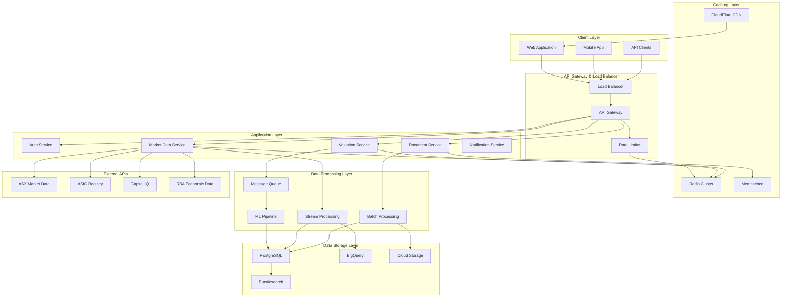

# Data Flow Architecture & Caching Strategies

## Executive Summary

This document outlines the comprehensive data flow architecture and caching strategies for the UpRez IPO Valuation Platform. The architecture is designed to handle high-volume requests, minimize latency, and ensure data consistency across multiple external API integrations while providing real-time insights for IPO valuations.

## Architecture Overview



## 1. Data Flow Patterns

### 1.1 Request/Response Flow

#### Synchronous Valuation Request Flow

```python
from typing import Dict, Any, Optional, List
from dataclasses import dataclass
from datetime import datetime, timedelta
from enum import Enum
import asyncio
import logging

class FlowStage(Enum):
    REQUEST_VALIDATION = "request_validation"
    AUTHENTICATION = "authentication"
    RATE_LIMITING = "rate_limiting"
    CACHE_CHECK = "cache_check"
    DATA_ENRICHMENT = "data_enrichment"
    PROCESSING = "processing"
    RESPONSE_CACHING = "response_caching"
    RESPONSE_DELIVERY = "response_delivery"

@dataclass
class FlowContext:
    request_id: str
    user_id: str
    start_time: datetime
    current_stage: FlowStage
    data: Dict[str, Any]
    cache_keys: List[str]
    external_calls: List[str]
    processing_time: Dict[str, float]

class DataFlowOrchestrator:
    """Orchestrates data flow through the valuation pipeline"""
    
    def __init__(self, 
                 cache_manager: 'CacheManager',
                 external_apis: 'ExternalAPIManager',
                 valuation_engine: 'ValuationEngine'):
        self.cache_manager = cache_manager
        self.external_apis = external_apis
        self.valuation_engine = valuation_engine
        self.flow_stages = {
            FlowStage.REQUEST_VALIDATION: self._validate_request,
            FlowStage.AUTHENTICATION: self._authenticate_request,
            FlowStage.RATE_LIMITING: self._check_rate_limits,
            FlowStage.CACHE_CHECK: self._check_cache,
            FlowStage.DATA_ENRICHMENT: self._enrich_data,
            FlowStage.PROCESSING: self._process_valuation,
            FlowStage.RESPONSE_CACHING: self._cache_response,
            FlowStage.RESPONSE_DELIVERY: self._deliver_response
        }
    
    async def process_valuation_request(self, request: Dict[str, Any]) -> Dict[str, Any]:
        """Process a complete valuation request through all stages"""
        
        context = FlowContext(
            request_id=request.get('request_id', self._generate_request_id()),
            user_id=request.get('user_id'),
            start_time=datetime.utcnow(),
            current_stage=FlowStage.REQUEST_VALIDATION,
            data=request.copy(),
            cache_keys=[],
            external_calls=[],
            processing_time={}
        )
        
        try:
            # Execute flow stages in sequence
            for stage in FlowStage:
                stage_start = datetime.utcnow()
                context.current_stage = stage
                
                logging.info(f"Request {context.request_id}: Starting stage {stage.value}")
                
                # Execute stage
                result = await self.flow_stages[stage](context)
                
                # Track timing
                stage_duration = (datetime.utcnow() - stage_start).total_seconds()
                context.processing_time[stage.value] = stage_duration
                
                # Handle stage result
                if result.get('skip_remaining_stages'):
                    break
                elif result.get('error'):
                    raise Exception(f"Stage {stage.value} failed: {result['error']}")
                
                # Update context with stage results
                context.data.update(result.get('data', {}))
                
                logging.info(f"Request {context.request_id}: Completed stage {stage.value} in {stage_duration:.3f}s")
            
            # Calculate total processing time
            total_time = (datetime.utcnow() - context.start_time).total_seconds()
            context.processing_time['total'] = total_time
            
            # Add metadata to response
            response = context.data.get('response', {})
            response['metadata'] = {
                'request_id': context.request_id,
                'processing_time': context.processing_time,
                'cache_hits': len([k for k in context.cache_keys if self.cache_manager.was_cache_hit(k)]),
                'external_calls': len(context.external_calls)
            }
            
            return response
            
        except Exception as e:
            logging.error(f"Request {context.request_id} failed at stage {context.current_stage.value}: {e}")
            
            # Return error response
            return {
                'error': str(e),
                'request_id': context.request_id,
                'failed_at_stage': context.current_stage.value,
                'processing_time': context.processing_time
            }
    
    async def _validate_request(self, context: FlowContext) -> Dict[str, Any]:
        """Validate incoming request"""
        
        required_fields = ['company_name', 'industry_sector', 'expected_ipo_date']
        
        for field in required_fields:
            if field not in context.data:
                return {'error': f'Required field missing: {field}'}
        
        # Validate data types and constraints
        validation_errors = await self._perform_detailed_validation(context.data)
        
        if validation_errors:
            return {'error': f'Validation errors: {validation_errors}'}
        
        return {'data': {'validated': True}}
    
    async def _authenticate_request(self, context: FlowContext) -> Dict[str, Any]:
        """Authenticate and authorize request"""
        
        # This would integrate with the OAuth2 implementation
        # For now, we'll assume authentication is handled by middleware
        
        return {'data': {'authenticated': True}}
    
    async def _check_rate_limits(self, context: FlowContext) -> Dict[str, Any]:
        """Check rate limits for user"""
        
        # Check if user has exceeded their rate limit
        rate_limit_key = f"rate_limit:{context.user_id}"
        context.cache_keys.append(rate_limit_key)
        
        current_usage = await self.cache_manager.get(rate_limit_key)
        user_tier = context.data.get('user_tier', 'basic')
        
        rate_limits = {
            'basic': 10,
            'professional': 50,
            'enterprise': 200
        }
        
        limit = rate_limits.get(user_tier, 10)
        
        if current_usage and int(current_usage) >= limit:
            return {'error': 'Rate limit exceeded', 'skip_remaining_stages': True}
        
        # Increment usage counter
        await self.cache_manager.incr(rate_limit_key)
        
        return {'data': {'rate_limit_checked': True}}
    
    async def _check_cache(self, context: FlowContext) -> Dict[str, Any]:
        """Check if response is cached"""
        
        # Generate cache key based on request parameters
        cache_key = self._generate_cache_key(context.data)
        context.cache_keys.append(cache_key)
        
        cached_response = await self.cache_manager.get(cache_key)
        
        if cached_response:
            logging.info(f"Request {context.request_id}: Cache hit for {cache_key}")
            
            return {
                'data': {'response': cached_response},
                'skip_remaining_stages': True
            }
        
        logging.info(f"Request {context.request_id}: Cache miss for {cache_key}")
        context.data['cache_key'] = cache_key
        
        return {'data': {'cache_checked': True}}
    
    async def _enrich_data(self, context: FlowContext) -> Dict[str, Any]:
        """Enrich request with external data"""
        
        enrichment_tasks = []
        
        # Market data enrichment
        if context.data.get('ticker'):
            enrichment_tasks.append(
                self._enrich_with_market_data(context)
            )
        
        # Company data enrichment
        if context.data.get('company_name'):
            enrichment_tasks.append(
                self._enrich_with_company_data(context)
            )
        
        # Economic data enrichment
        enrichment_tasks.append(
            self._enrich_with_economic_data(context)
        )
        
        # Execute enrichment tasks in parallel
        enrichment_results = await asyncio.gather(*enrichment_tasks, return_exceptions=True)
        
        enriched_data = {}
        for result in enrichment_results:
            if isinstance(result, Exception):
                logging.warning(f"Enrichment task failed: {result}")
                continue
            
            enriched_data.update(result)
        
        return {'data': {'enriched_data': enriched_data}}
    
    async def _enrich_with_market_data(self, context: FlowContext) -> Dict[str, Any]:
        """Enrich with market data from external APIs"""
        
        ticker = context.data.get('ticker')
        
        # Check cache first
        market_data_key = f"market_data:{ticker}"
        context.cache_keys.append(market_data_key)
        
        cached_data = await self.cache_manager.get(market_data_key)
        
        if cached_data:
            return {'market_data': cached_data}
        
        # Fetch from external API
        context.external_calls.append('asx_market_data')
        market_data = await self.external_apis.get_market_data(ticker)
        
        # Cache for 5 minutes
        await self.cache_manager.set(market_data_key, market_data, ttl=300)
        
        return {'market_data': market_data}
    
    async def _process_valuation(self, context: FlowContext) -> Dict[str, Any]:
        """Execute valuation processing"""
        
        # Combine original request with enriched data
        processing_input = {
            **context.data,
            **context.data.get('enriched_data', {})
        }
        
        # Execute valuation calculation
        valuation_result = await self.valuation_engine.calculate_valuation(processing_input)
        
        return {'data': {'valuation_result': valuation_result}}
    
    async def _cache_response(self, context: FlowContext) -> Dict[str, Any]:
        """Cache the response"""
        
        cache_key = context.data.get('cache_key')
        response_data = context.data.get('valuation_result')
        
        if cache_key and response_data:
            # Cache for 1 hour
            await self.cache_manager.set(cache_key, response_data, ttl=3600)
        
        return {'data': {'response_cached': True}}
    
    async def _deliver_response(self, context: FlowContext) -> Dict[str, Any]:
        """Prepare final response"""
        
        response = {
            'valuation': context.data.get('valuation_result'),
            'request_metadata': {
                'request_id': context.request_id,
                'processed_at': datetime.utcnow().isoformat(),
                'data_sources': context.external_calls,
                'cache_performance': {
                    'keys_checked': len(context.cache_keys),
                    'cache_hits': len([k for k in context.cache_keys if self.cache_manager.was_cache_hit(k)])
                }
            }
        }
        
        return {'data': {'response': response}}
    
    def _generate_cache_key(self, data: Dict[str, Any]) -> str:
        """Generate deterministic cache key"""
        
        key_components = [
            data.get('company_name', ''),
            data.get('industry_sector', ''),
            data.get('expected_ipo_date', ''),
            data.get('analysis_type', 'basic')
        ]
        
        import hashlib
        key_string = '|'.join(str(c) for c in key_components)
        key_hash = hashlib.md5(key_string.encode()).hexdigest()
        
        return f"valuation_request:{key_hash}"
```

### 1.2 Asynchronous Processing Flow

#### Background Valuation Processing

```python
import asyncio
from typing import Dict, Any, Callable, Optional
from dataclasses import dataclass
from datetime import datetime
import json

@dataclass
class ProcessingJob:
    job_id: str
    user_id: str
    job_type: str
    input_data: Dict[str, Any]
    status: str
    created_at: datetime
    started_at: Optional[datetime] = None
    completed_at: Optional[datetime] = None
    progress: int = 0
    result: Optional[Dict[str, Any]] = None
    error: Optional[str] = None

class BackgroundProcessingManager:
    """Manages background processing of long-running valuation tasks"""
    
    def __init__(self, 
                 redis_client,
                 task_processors: Dict[str, Callable]):
        self.redis = redis_client
        self.task_processors = task_processors
        self.job_queue = "processing_jobs"
        self.progress_key_prefix = "job_progress:"
        self.result_key_prefix = "job_result:"
        
    async def submit_job(self, 
                        user_id: str, 
                        job_type: str, 
                        input_data: Dict[str, Any]) -> str:
        """Submit a job for background processing"""
        
        job_id = self._generate_job_id()
        
        job = ProcessingJob(
            job_id=job_id,
            user_id=user_id,
            job_type=job_type,
            input_data=input_data,
            status="queued",
            created_at=datetime.utcnow()
        )
        
        # Store job in queue
        job_data = {
            'job_id': job_id,
            'user_id': user_id,
            'job_type': job_type,
            'input_data': input_data,
            'created_at': job.created_at.isoformat()
        }
        
        await self.redis.lpush(self.job_queue, json.dumps(job_data))
        
        # Initialize progress tracking
        await self.redis.hset(
            f"{self.progress_key_prefix}{job_id}",
            mapping={
                'status': 'queued',
                'progress': 0,
                'created_at': job.created_at.isoformat()
            }
        )
        
        # Set expiry for job data (24 hours)
        await self.redis.expire(f"{self.progress_key_prefix}{job_id}", 86400)
        
        return job_id
    
    async def get_job_status(self, job_id: str) -> Dict[str, Any]:
        """Get current status of a processing job"""
        
        progress_data = await self.redis.hgetall(f"{self.progress_key_prefix}{job_id}")
        
        if not progress_data:
            return {'error': 'Job not found'}
        
        status_info = {
            'job_id': job_id,
            'status': progress_data.get('status', 'unknown'),
            'progress': int(progress_data.get('progress', 0)),
            'created_at': progress_data.get('created_at'),
            'started_at': progress_data.get('started_at'),
            'completed_at': progress_data.get('completed_at'),
            'error': progress_data.get('error')
        }
        
        # If completed, include result URL
        if status_info['status'] == 'completed':
            status_info['result_url'] = f"/api/v1/jobs/{job_id}/result"
        
        return status_info
    
    async def get_job_result(self, job_id: str) -> Optional[Dict[str, Any]]:
        """Get result of a completed job"""
        
        result_data = await self.redis.get(f"{self.result_key_prefix}{job_id}")
        
        if result_data:
            return json.loads(result_data)
        
        return None
    
    async def process_jobs(self):
        """Background worker to process jobs from the queue"""
        
        while True:
            try:
                # Block until job is available
                job_data = await self.redis.brpop(self.job_queue, timeout=5)
                
                if job_data:
                    job_json = job_data[1]  # brpop returns (queue_name, item)
                    job_info = json.loads(job_json)
                    
                    await self._process_single_job(job_info)
                
            except Exception as e:
                logging.error(f"Error in job processing loop: {e}")
                await asyncio.sleep(1)
    
    async def _process_single_job(self, job_info: Dict[str, Any]):
        """Process a single job"""
        
        job_id = job_info['job_id']
        job_type = job_info['job_type']
        
        try:
            # Update status to processing
            await self._update_job_progress(job_id, 'processing', 0)
            
            # Get appropriate processor
            processor = self.task_processors.get(job_type)
            
            if not processor:
                raise ValueError(f"No processor found for job type: {job_type}")
            
            # Execute processing with progress callback
            async def progress_callback(progress: int, stage: str = None):
                await self._update_job_progress(job_id, 'processing', progress, stage)
            
            result = await processor(job_info['input_data'], progress_callback)
            
            # Store result
            await self.redis.setex(
                f"{self.result_key_prefix}{job_id}",
                86400,  # 24 hours expiry
                json.dumps(result)
            )
            
            # Update status to completed
            await self._update_job_progress(job_id, 'completed', 100)
            
            logging.info(f"Job {job_id} completed successfully")
            
        except Exception as e:
            # Update status to failed
            await self._update_job_progress(job_id, 'failed', 0, error=str(e))
            
            logging.error(f"Job {job_id} failed: {e}")
    
    async def _update_job_progress(self, 
                                 job_id: str, 
                                 status: str, 
                                 progress: int,
                                 stage: str = None,
                                 error: str = None):
        """Update job progress in Redis"""
        
        update_data = {
            'status': status,
            'progress': progress,
            'updated_at': datetime.utcnow().isoformat()
        }
        
        if status == 'processing' and stage:
            update_data['current_stage'] = stage
        
        if status == 'processing' and not await self.redis.hexists(f"{self.progress_key_prefix}{job_id}", 'started_at'):
            update_data['started_at'] = datetime.utcnow().isoformat()
        
        if status in ['completed', 'failed']:
            update_data['completed_at'] = datetime.utcnow().isoformat()
        
        if error:
            update_data['error'] = error
        
        await self.redis.hset(f"{self.progress_key_prefix}{job_id}", mapping=update_data)

# Specific job processors
async def comprehensive_valuation_processor(
    input_data: Dict[str, Any], 
    progress_callback: Callable[[int, str], None]
) -> Dict[str, Any]:
    """Processor for comprehensive valuation analysis"""
    
    await progress_callback(10, "Validating input data")
    
    # Validate input
    if not input_data.get('company_name'):
        raise ValueError("Company name is required")
    
    await progress_callback(20, "Fetching market data")
    
    # Fetch market data
    market_data = await fetch_comprehensive_market_data(input_data)
    
    await progress_callback(40, "Analyzing peer companies")
    
    # Peer analysis
    peer_analysis = await perform_peer_analysis(input_data, market_data)
    
    await progress_callback(60, "Calculating valuation models")
    
    # Valuation calculations
    valuation_results = await calculate_comprehensive_valuation(
        input_data, market_data, peer_analysis
    )
    
    await progress_callback(80, "Generating risk assessment")
    
    # Risk assessment
    risk_assessment = await perform_risk_assessment(input_data, valuation_results)
    
    await progress_callback(95, "Finalizing results")
    
    # Combine results
    final_result = {
        'company_name': input_data['company_name'],
        'valuation_summary': valuation_results['summary'],
        'detailed_analysis': valuation_results['detailed'],
        'peer_analysis': peer_analysis,
        'risk_assessment': risk_assessment,
        'market_data': market_data,
        'generated_at': datetime.utcnow().isoformat()
    }
    
    await progress_callback(100, "Completed")
    
    return final_result
```

## 2. Caching Strategies

### 2.1 Multi-Layer Caching Architecture

```python
import redis
import pickle
import hashlib
from typing import Any, Optional, Dict, Union
from datetime import datetime, timedelta
from enum import Enum
import asyncio
import logging

class CacheLayer(Enum):
    MEMORY = "memory"
    REDIS = "redis"
    DATABASE = "database"

class CacheStrategy(Enum):
    WRITE_THROUGH = "write_through"
    WRITE_BACK = "write_back"
    WRITE_AROUND = "write_around"

@dataclass
class CacheConfig:
    ttl: int  # Time to live in seconds
    strategy: CacheStrategy
    layers: List[CacheLayer]
    compression: bool = False
    encryption: bool = False

class MultiLayerCacheManager:
    """Multi-layer caching system with different strategies"""
    
    def __init__(self, redis_client, database_client):
        self.redis = redis_client
        self.database = database_client
        self.memory_cache = {}  # In-memory cache
        self.memory_cache_ttl = {}  # TTL tracking for memory cache
        self.cache_stats = {
            'hits': {'memory': 0, 'redis': 0, 'database': 0},
            'misses': {'memory': 0, 'redis': 0, 'database': 0},
            'sets': {'memory': 0, 'redis': 0, 'database': 0}
        }
        
        # Default cache configurations for different data types
        self.cache_configs = {
            'market_data': CacheConfig(
                ttl=300,  # 5 minutes
                strategy=CacheStrategy.WRITE_THROUGH,
                layers=[CacheLayer.MEMORY, CacheLayer.REDIS]
            ),
            'company_data': CacheConfig(
                ttl=3600,  # 1 hour
                strategy=CacheStrategy.WRITE_THROUGH,
                layers=[CacheLayer.MEMORY, CacheLayer.REDIS, CacheLayer.DATABASE]
            ),
            'valuation_result': CacheConfig(
                ttl=1800,  # 30 minutes
                strategy=CacheStrategy.WRITE_THROUGH,
                layers=[CacheLayer.REDIS]
            ),
            'economic_data': CacheConfig(
                ttl=7200,  # 2 hours
                strategy=CacheStrategy.WRITE_THROUGH,
                layers=[CacheLayer.MEMORY, CacheLayer.REDIS]
            ),
            'user_session': CacheConfig(
                ttl=3600,  # 1 hour
                strategy=CacheStrategy.WRITE_THROUGH,
                layers=[CacheLayer.REDIS]
            )
        }
    
    async def get(self, key: str, data_type: str = 'default') -> Optional[Any]:
        """Get value from cache with fallback through layers"""
        
        config = self.cache_configs.get(data_type, self.cache_configs['valuation_result'])
        
        # Try each cache layer in order
        for layer in config.layers:
            try:
                if layer == CacheLayer.MEMORY:
                    value = await self._get_from_memory(key)
                    if value is not None:
                        self.cache_stats['hits']['memory'] += 1
                        return value
                    else:
                        self.cache_stats['misses']['memory'] += 1
                
                elif layer == CacheLayer.REDIS:
                    value = await self._get_from_redis(key)
                    if value is not None:
                        self.cache_stats['hits']['redis'] += 1
                        
                        # Populate higher layers
                        await self._populate_higher_layers(key, value, layer, config)
                        
                        return value
                    else:
                        self.cache_stats['misses']['redis'] += 1
                
                elif layer == CacheLayer.DATABASE:
                    value = await self._get_from_database(key)
                    if value is not None:
                        self.cache_stats['hits']['database'] += 1
                        
                        # Populate higher layers
                        await self._populate_higher_layers(key, value, layer, config)
                        
                        return value
                    else:
                        self.cache_stats['misses']['database'] += 1
                        
            except Exception as e:
                logging.warning(f"Cache layer {layer.value} failed for key {key}: {e}")
                continue
        
        return None
    
    async def set(self, 
                 key: str, 
                 value: Any, 
                 data_type: str = 'default',
                 ttl: Optional[int] = None) -> bool:
        """Set value in cache according to strategy"""
        
        config = self.cache_configs.get(data_type, self.cache_configs['valuation_result'])
        effective_ttl = ttl if ttl is not None else config.ttl
        
        if config.strategy == CacheStrategy.WRITE_THROUGH:
            return await self._write_through(key, value, config, effective_ttl)
        elif config.strategy == CacheStrategy.WRITE_BACK:
            return await self._write_back(key, value, config, effective_ttl)
        elif config.strategy == CacheStrategy.WRITE_AROUND:
            return await self._write_around(key, value, config, effective_ttl)
    
    async def invalidate(self, key: str, data_type: str = 'default'):
        """Invalidate key from all cache layers"""
        
        config = self.cache_configs.get(data_type, self.cache_configs['valuation_result'])
        
        for layer in config.layers:
            try:
                if layer == CacheLayer.MEMORY:
                    await self._invalidate_memory(key)
                elif layer == CacheLayer.REDIS:
                    await self._invalidate_redis(key)
                elif layer == CacheLayer.DATABASE:
                    await self._invalidate_database(key)
            except Exception as e:
                logging.warning(f"Failed to invalidate {key} from {layer.value}: {e}")
    
    async def _get_from_memory(self, key: str) -> Optional[Any]:
        """Get value from memory cache"""
        
        if key in self.memory_cache:
            # Check TTL
            if key in self.memory_cache_ttl:
                if datetime.utcnow() > self.memory_cache_ttl[key]:
                    # Expired
                    del self.memory_cache[key]
                    del self.memory_cache_ttl[key]
                    return None
            
            return self.memory_cache[key]
        
        return None
    
    async def _get_from_redis(self, key: str) -> Optional[Any]:
        """Get value from Redis cache"""
        
        cached_data = await self.redis.get(key)
        
        if cached_data:
            try:
                return pickle.loads(cached_data)
            except Exception as e:
                logging.warning(f"Failed to deserialize cached data for key {key}: {e}")
                await self.redis.delete(key)  # Clean up corrupted data
        
        return None
    
    async def _get_from_database(self, key: str) -> Optional[Any]:
        """Get value from database cache table"""
        
        # This would query a cache table in your database
        # Implementation depends on your database schema
        
        query = """
            SELECT data, expires_at 
            FROM cache_entries 
            WHERE cache_key = %s 
            AND (expires_at IS NULL OR expires_at > NOW())
        """
        
        result = await self.database.fetch_one(query, [key])
        
        if result:
            return pickle.loads(result['data'])
        
        return None
    
    async def _populate_higher_layers(self, 
                                    key: str, 
                                    value: Any, 
                                    source_layer: CacheLayer, 
                                    config: CacheConfig):
        """Populate cache layers higher than the source"""
        
        source_index = config.layers.index(source_layer)
        
        for i in range(source_index):
            layer = config.layers[i]
            
            try:
                if layer == CacheLayer.MEMORY:
                    await self._set_in_memory(key, value, config.ttl)
                elif layer == CacheLayer.REDIS:
                    await self._set_in_redis(key, value, config.ttl)
                # Database is never a higher layer in our hierarchy
                
            except Exception as e:
                logging.warning(f"Failed to populate {layer.value} cache for key {key}: {e}")
    
    async def _write_through(self, 
                           key: str, 
                           value: Any, 
                           config: CacheConfig, 
                           ttl: int) -> bool:
        """Write-through caching strategy"""
        
        success = True
        
        # Write to all layers simultaneously
        tasks = []
        
        for layer in config.layers:
            if layer == CacheLayer.MEMORY:
                tasks.append(self._set_in_memory(key, value, ttl))
            elif layer == CacheLayer.REDIS:
                tasks.append(self._set_in_redis(key, value, ttl))
            elif layer == CacheLayer.DATABASE:
                tasks.append(self._set_in_database(key, value, ttl))
        
        results = await asyncio.gather(*tasks, return_exceptions=True)
        
        # Check for failures
        for i, result in enumerate(results):
            if isinstance(result, Exception):
                layer = config.layers[i]
                logging.error(f"Write-through failed for {layer.value}: {result}")
                success = False
        
        return success
    
    async def _set_in_memory(self, key: str, value: Any, ttl: int):
        """Set value in memory cache"""
        
        self.memory_cache[key] = value
        self.memory_cache_ttl[key] = datetime.utcnow() + timedelta(seconds=ttl)
        self.cache_stats['sets']['memory'] += 1
    
    async def _set_in_redis(self, key: str, value: Any, ttl: int):
        """Set value in Redis cache"""
        
        serialized_data = pickle.dumps(value)
        await self.redis.setex(key, ttl, serialized_data)
        self.cache_stats['sets']['redis'] += 1
    
    async def _set_in_database(self, key: str, value: Any, ttl: int):
        """Set value in database cache"""
        
        expires_at = datetime.utcnow() + timedelta(seconds=ttl)
        serialized_data = pickle.dumps(value)
        
        query = """
            INSERT INTO cache_entries (cache_key, data, expires_at, created_at)
            VALUES (%s, %s, %s, %s)
            ON CONFLICT (cache_key) 
            DO UPDATE SET data = EXCLUDED.data, expires_at = EXCLUDED.expires_at
        """
        
        await self.database.execute(
            query, 
            [key, serialized_data, expires_at, datetime.utcnow()]
        )
        
        self.cache_stats['sets']['database'] += 1
    
    def get_cache_stats(self) -> Dict[str, Any]:
        """Get cache performance statistics"""
        
        total_hits = sum(self.cache_stats['hits'].values())
        total_misses = sum(self.cache_stats['misses'].values())
        total_requests = total_hits + total_misses
        
        hit_rate = (total_hits / total_requests * 100) if total_requests > 0 else 0
        
        return {
            'hit_rate': round(hit_rate, 2),
            'total_requests': total_requests,
            'hits_by_layer': self.cache_stats['hits'].copy(),
            'misses_by_layer': self.cache_stats['misses'].copy(),
            'sets_by_layer': self.cache_stats['sets'].copy(),
            'memory_cache_size': len(self.memory_cache)
        }
```

### 2.2 Intelligent Cache Warming

```python
import asyncio
from typing import List, Dict, Any, Callable, Optional
from datetime import datetime, timedelta
import logging

class CacheWarmingManager:
    """Manages proactive cache warming for frequently accessed data"""
    
    def __init__(self, 
                 cache_manager: MultiLayerCacheManager,
                 data_fetchers: Dict[str, Callable]):
        self.cache_manager = cache_manager
        self.data_fetchers = data_fetchers
        self.warming_schedules = {}
        self.access_patterns = {}
        
        # Initialize warming schedules
        self._initialize_warming_schedules()
    
    def _initialize_warming_schedules(self):
        """Initialize cache warming schedules for different data types"""
        
        self.warming_schedules = {
            'market_data': {
                'interval': 240,  # 4 minutes (before 5min TTL expires)
                'priority': 'high',
                'fetcher': 'market_data_fetcher',
                'warm_keys': self._get_market_data_keys_to_warm
            },
            'economic_indicators': {
                'interval': 3600,  # 1 hour (before 2hr TTL expires)
                'priority': 'medium',
                'fetcher': 'economic_data_fetcher',
                'warm_keys': self._get_economic_keys_to_warm
            },
            'company_profiles': {
                'interval': 1800,  # 30 minutes
                'priority': 'low',
                'fetcher': 'company_data_fetcher',
                'warm_keys': self._get_company_keys_to_warm
            }
        }
    
    async def start_warming_scheduler(self):
        """Start background cache warming scheduler"""
        
        warming_tasks = []
        
        for data_type, schedule in self.warming_schedules.items():
            task = asyncio.create_task(
                self._warming_loop(data_type, schedule)
            )
            warming_tasks.append(task)
        
        # Also start access pattern tracking
        pattern_task = asyncio.create_task(self._track_access_patterns())
        warming_tasks.append(pattern_task)
        
        await asyncio.gather(*warming_tasks)
    
    async def _warming_loop(self, data_type: str, schedule: Dict[str, Any]):
        """Background loop for cache warming"""
        
        while True:
            try:
                await asyncio.sleep(schedule['interval'])
                
                logging.info(f"Starting cache warming for {data_type}")
                
                # Get keys to warm
                keys_to_warm = await schedule['warm_keys']()
                
                if keys_to_warm:
                    await self._warm_keys(data_type, keys_to_warm, schedule)
                
                logging.info(f"Completed cache warming for {data_type}: {len(keys_to_warm)} keys")
                
            except Exception as e:
                logging.error(f"Cache warming failed for {data_type}: {e}")
                await asyncio.sleep(60)  # Wait 1 minute before retrying
    
    async def _warm_keys(self, 
                        data_type: str, 
                        keys: List[str], 
                        schedule: Dict[str, Any]):
        """Warm specific cache keys"""
        
        fetcher_name = schedule['fetcher']
        fetcher = self.data_fetchers.get(fetcher_name)
        
        if not fetcher:
            logging.error(f"No fetcher found for {fetcher_name}")
            return
        
        # Process keys in batches to avoid overwhelming external APIs
        batch_size = 10
        
        for i in range(0, len(keys), batch_size):
            batch = keys[i:i + batch_size]
            
            # Create warming tasks for this batch
            warming_tasks = [
                self._warm_single_key(key, data_type, fetcher)
                for key in batch
            ]
            
            # Execute batch with concurrency limit
            await asyncio.gather(*warming_tasks, return_exceptions=True)
            
            # Small delay between batches
            await asyncio.sleep(1)
    
    async def _warm_single_key(self, key: str, data_type: str, fetcher: Callable):
        """Warm a single cache key"""
        
        try:
            # Check if key is already cached and fresh
            cached_value = await self.cache_manager.get(key, data_type)
            
            if cached_value is not None:
                return  # Already cached, no need to warm
            
            # Fetch fresh data
            fresh_data = await fetcher(key)
            
            if fresh_data:
                # Cache the fresh data
                await self.cache_manager.set(key, fresh_data, data_type)
                logging.debug(f"Warmed cache key: {key}")
            
        except Exception as e:
            logging.warning(f"Failed to warm cache key {key}: {e}")
    
    async def _get_market_data_keys_to_warm(self) -> List[str]:
        """Get market data keys that should be warmed"""
        
        # This would typically query your database for:
        # 1. Companies with active valuations
        # 2. Frequently requested tickers
        # 3. User watchlists
        
        # For example:
        frequently_accessed_tickers = await self._get_frequently_accessed_tickers()
        active_valuation_tickers = await self._get_active_valuation_tickers()
        
        all_tickers = set(frequently_accessed_tickers + active_valuation_tickers)
        
        return [f"market_data:{ticker}" for ticker in all_tickers]
    
    async def _get_economic_keys_to_warm(self) -> List[str]:
        """Get economic data keys that should be warmed"""
        
        return [
            "economic_data:rba_cash_rate",
            "economic_data:inflation_rate",
            "economic_data:gdp_growth",
            "economic_data:unemployment_rate",
            "economic_data:aud_usd_rate"
        ]
    
    async def _get_company_keys_to_warm(self) -> List[str]:
        """Get company data keys that should be warmed"""
        
        # Get companies from recent valuations and user searches
        recent_companies = await self._get_recent_company_searches()
        
        return [f"company_data:{company}" for company in recent_companies]
    
    async def record_access(self, key: str, data_type: str):
        """Record cache access for pattern analysis"""
        
        current_hour = datetime.utcnow().replace(minute=0, second=0, microsecond=0)
        
        pattern_key = f"{data_type}:{key}:{current_hour.isoformat()}"
        
        if pattern_key not in self.access_patterns:
            self.access_patterns[pattern_key] = 0
        
        self.access_patterns[pattern_key] += 1
    
    async def _track_access_patterns(self):
        """Background task to analyze access patterns"""
        
        while True:
            try:
                await asyncio.sleep(3600)  # Run every hour
                
                # Analyze patterns and adjust warming strategy
                await self._analyze_and_adjust_warming()
                
                # Clean up old pattern data
                await self._cleanup_old_patterns()
                
            except Exception as e:
                logging.error(f"Access pattern tracking failed: {e}")
    
    async def _analyze_and_adjust_warming(self):
        """Analyze access patterns and adjust warming strategy"""
        
        # Identify hot keys (frequently accessed)
        hot_keys = {}
        
        for pattern_key, access_count in self.access_patterns.items():
            if access_count > 10:  # Threshold for "hot" key
                parts = pattern_key.split(':')
                data_type = parts[0]
                key = parts[1]
                
                if data_type not in hot_keys:
                    hot_keys[data_type] = []
                
                hot_keys[data_type].append((key, access_count))
        
        # Update warming schedules based on patterns
        for data_type, keys in hot_keys.items():
            if data_type in self.warming_schedules:
                # Sort by access frequency
                keys.sort(key=lambda x: x[1], reverse=True)
                
                # Update warming priority
                if len(keys) > 20:  # Many hot keys
                    self.warming_schedules[data_type]['priority'] = 'high'
                    self.warming_schedules[data_type]['interval'] = min(
                        self.warming_schedules[data_type]['interval'], 300
                    )
                
                logging.info(f"Adjusted warming strategy for {data_type}: {len(keys)} hot keys")
```

### 2.3 Cache Invalidation Strategies

```python
from typing import Set, List, Dict, Any, Pattern
import re
from datetime import datetime

class CacheInvalidationManager:
    """Manages cache invalidation across multiple layers and patterns"""
    
    def __init__(self, cache_manager: MultiLayerCacheManager):
        self.cache_manager = cache_manager
        self.invalidation_rules = {}
        self.dependency_graph = {}
        
        self._initialize_invalidation_rules()
    
    def _initialize_invalidation_rules(self):
        """Initialize cache invalidation rules"""
        
        self.invalidation_rules = {
            'market_data_updated': {
                'patterns': [
                    r'market_data:.*',
                    r'valuation_request:.*',  # Any cached valuations might be affected
                    r'peer_analysis:.*'
                ],
                'cascade': True
            },
            'company_data_updated': {
                'patterns': [
                    r'company_data:{company_id}',
                    r'valuation_request:.*{company_id}.*',
                    r'peer_analysis:.*{company_id}.*'
                ],
                'cascade': True
            },
            'economic_data_updated': {
                'patterns': [
                    r'economic_data:.*',
                    r'valuation_request:.*',  # Economic data affects all valuations
                ],
                'cascade': True
            },
            'user_data_updated': {
                'patterns': [
                    r'user_session:{user_id}',
                    r'user_preferences:{user_id}'
                ],
                'cascade': False
            }
        }
        
        # Build dependency graph
        self.dependency_graph = {
            'market_data': ['valuation_result', 'peer_analysis'],
            'company_data': ['valuation_result', 'peer_analysis'],
            'economic_data': ['valuation_result'],
            'peer_analysis': ['valuation_result']
        }
    
    async def invalidate_by_event(self, event_type: str, context: Dict[str, Any] = None):
        """Invalidate cache based on data update events"""
        
        if event_type not in self.invalidation_rules:
            logging.warning(f"No invalidation rule for event: {event_type}")
            return
        
        rule = self.invalidation_rules[event_type]
        patterns = rule['patterns']
        
        # Build actual patterns with context
        compiled_patterns = []
        for pattern in patterns:
            if context:
                # Replace placeholders with actual values
                actual_pattern = pattern.format(**context)
            else:
                actual_pattern = pattern
            
            compiled_patterns.append(re.compile(actual_pattern))
        
        # Find matching keys
        keys_to_invalidate = await self._find_matching_keys(compiled_patterns)
        
        # Invalidate keys
        for key in keys_to_invalidate:
            await self.cache_manager.invalidate(key)
        
        # Cascade invalidation if enabled
        if rule.get('cascade', False):
            await self._cascade_invalidation(event_type, keys_to_invalidate)
        
        logging.info(f"Invalidated {len(keys_to_invalidate)} keys for event: {event_type}")
    
    async def invalidate_by_dependency(self, data_type: str, specific_key: str = None):
        """Invalidate cache based on data dependencies"""
        
        if data_type not in self.dependency_graph:
            return
        
        # Get dependent data types
        dependent_types = self.dependency_graph[data_type]
        
        keys_to_invalidate = []
        
        for dependent_type in dependent_types:
            if specific_key:
                # Invalidate specific dependent keys
                dependent_keys = await self._find_dependent_keys(dependent_type, specific_key)
            else:
                # Invalidate all keys of dependent type
                dependent_keys = await self._find_keys_by_type(dependent_type)
            
            keys_to_invalidate.extend(dependent_keys)
        
        # Invalidate all dependent keys
        for key in keys_to_invalidate:
            await self.cache_manager.invalidate(key)
        
        logging.info(f"Invalidated {len(keys_to_invalidate)} dependent keys for {data_type}")
    
    async def invalidate_pattern(self, pattern: str, data_type: str = 'default'):
        """Invalidate cache keys matching a pattern"""
        
        compiled_pattern = re.compile(pattern)
        matching_keys = await self._find_matching_keys([compiled_pattern])
        
        for key in matching_keys:
            await self.cache_manager.invalidate(key, data_type)
        
        logging.info(f"Invalidated {len(matching_keys)} keys matching pattern: {pattern}")
    
    async def _find_matching_keys(self, patterns: List[Pattern]) -> Set[str]:
        """Find cache keys matching given patterns"""
        
        matching_keys = set()
        
        # Get all cache keys from different layers
        all_keys = set()
        
        # Get keys from Redis
        redis_keys = await self.cache_manager.redis.keys('*')
        all_keys.update(key.decode() for key in redis_keys)
        
        # Get keys from memory cache
        all_keys.update(self.cache_manager.memory_cache.keys())
        
        # Get keys from database cache
        db_keys = await self._get_database_cache_keys()
        all_keys.update(db_keys)
        
        # Filter keys by patterns
        for key in all_keys:
            for pattern in patterns:
                if pattern.match(key):
                    matching_keys.add(key)
                    break
        
        return matching_keys
    
    async def _get_database_cache_keys(self) -> List[str]:
        """Get cache keys from database cache table"""
        
        query = "SELECT cache_key FROM cache_entries WHERE expires_at > NOW() OR expires_at IS NULL"
        result = await self.cache_manager.database.fetch_all(query)
        
        return [row['cache_key'] for row in result]
    
    async def selective_refresh(self, 
                              data_type: str, 
                              keys: List[str], 
                              fetcher: Callable):
        """Selectively refresh specific cache keys"""
        
        refresh_tasks = []
        
        for key in keys:
            task = asyncio.create_task(
                self._refresh_single_key(key, data_type, fetcher)
            )
            refresh_tasks.append(task)
        
        results = await asyncio.gather(*refresh_tasks, return_exceptions=True)
        
        successful_refreshes = sum(1 for r in results if not isinstance(r, Exception))
        
        logging.info(f"Refreshed {successful_refreshes}/{len(keys)} keys for {data_type}")
        
        return successful_refreshes
    
    async def _refresh_single_key(self, key: str, data_type: str, fetcher: Callable):
        """Refresh a single cache key with fresh data"""
        
        try:
            # Fetch fresh data
            fresh_data = await fetcher(key)
            
            if fresh_data:
                # Update cache
                await self.cache_manager.set(key, fresh_data, data_type)
                logging.debug(f"Refreshed cache key: {key}")
            
        except Exception as e:
            logging.error(f"Failed to refresh cache key {key}: {e}")
            raise
```

This comprehensive data flow architecture and caching strategy provides:

1. **Multi-layer caching** with memory, Redis, and database persistence
2. **Intelligent cache warming** based on access patterns
3. **Sophisticated invalidation** with dependency tracking
4. **Flow orchestration** for complex request processing
5. **Background processing** for long-running operations
6. **Performance monitoring** and optimization
7. **Fault tolerance** with graceful degradation

The architecture ensures optimal performance while maintaining data consistency and providing real-time insights for IPO valuations.