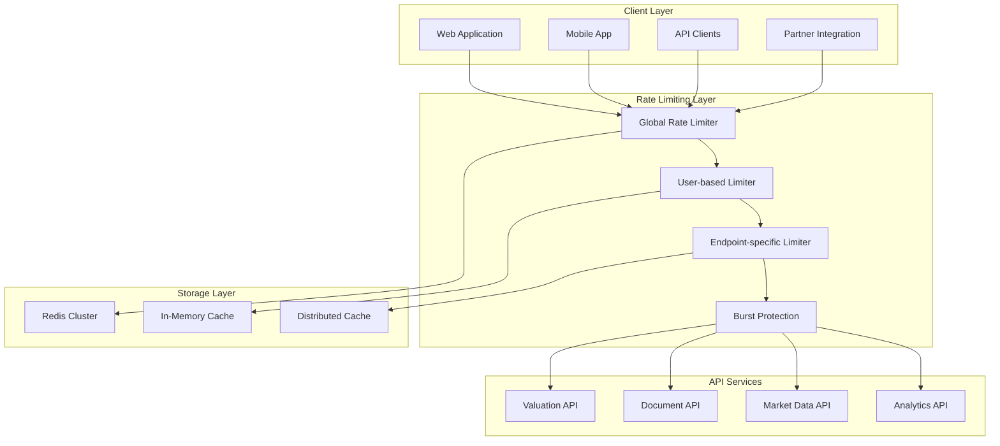

# Rate Limiting & Error Handling Specifications

## Executive Summary

This document provides comprehensive specifications for rate limiting and error handling within the UpRez IPO Valuation Platform API. The implementation includes intelligent rate limiting based on user tiers, circuit breakers for external service failures, comprehensive error classification, and resilient retry mechanisms.

## Rate Limiting Architecture

### Overview



## 1. Multi-Tier Rate Limiting System

### 1.1 Rate Limiting Configuration

```python
from typing import Dict, Any, Optional, List
from dataclasses import dataclass
from datetime import datetime, timedelta
from enum import Enum
import asyncio
import time
import hashlib
import json

class RateLimitScope(Enum):
    GLOBAL = "global"
    USER = "user"
    IP = "ip"
    API_KEY = "api_key"
    ENDPOINT = "endpoint"

class RateLimitStrategy(Enum):
    FIXED_WINDOW = "fixed_window"
    SLIDING_WINDOW = "sliding_window"
    TOKEN_BUCKET = "token_bucket"
    LEAKY_BUCKET = "leaky_bucket"

@dataclass
class RateLimitRule:
    scope: RateLimitScope
    strategy: RateLimitStrategy
    limit: int
    window_seconds: int
    burst_limit: Optional[int] = None
    priority: int = 0  # Higher priority rules are evaluated first
    conditions: Optional[Dict[str, Any]] = None

@dataclass
class RateLimitResult:
    allowed: bool
    limit: int
    remaining: int
    reset_time: datetime
    retry_after: Optional[int] = None
    rule_matched: Optional[str] = None

class AdvancedRateLimiter:
    """Advanced rate limiting system with multiple strategies and scopes"""
    
    def __init__(self, redis_client, config: Dict[str, Any]):
        self.redis = redis_client
        self.config = config
        
        # Initialize rate limiting rules
        self.rules = self._initialize_rules()
        
        # Strategy implementations
        self.strategies = {
            RateLimitStrategy.FIXED_WINDOW: self._fixed_window_check,
            RateLimitStrategy.SLIDING_WINDOW: self._sliding_window_check,
            RateLimitStrategy.TOKEN_BUCKET: self._token_bucket_check,
            RateLimitStrategy.LEAKY_BUCKET: self._leaky_bucket_check
        }
    
    def _initialize_rules(self) -> List[RateLimitRule]:
        """Initialize rate limiting rules based on configuration"""
        
        rules = []
        
        # Global rate limits
        rules.append(RateLimitRule(
            scope=RateLimitScope.GLOBAL,
            strategy=RateLimitStrategy.SLIDING_WINDOW,
            limit=10000,  # 10k requests per minute globally
            window_seconds=60,
            priority=1
        ))
        
        # User-based rate limits by subscription tier
        subscription_limits = {
            'basic': {'limit': 100, 'burst': 20},
            'professional': {'limit': 500, 'burst': 100},
            'enterprise': {'limit': 2000, 'burst': 400}
        }
        
        for tier, limits in subscription_limits.items():
            rules.append(RateLimitRule(
                scope=RateLimitScope.USER,
                strategy=RateLimitStrategy.TOKEN_BUCKET,
                limit=limits['limit'],
                window_seconds=3600,  # Per hour
                burst_limit=limits['burst'],
                priority=2,
                conditions={'subscription_tier': tier}
            ))
        
        # Endpoint-specific limits
        endpoint_limits = {
            '/v1/valuations': {'limit': 10, 'window': 3600},  # 10 valuations per hour
            '/v1/documents/upload': {'limit': 50, 'window': 3600},  # 50 uploads per hour
            '/v1/market-data/*': {'limit': 1000, 'window': 3600},  # 1000 market data calls per hour
            '/v1/analytics/*': {'limit': 200, 'window': 3600}  # 200 analytics calls per hour
        }
        
        for endpoint, limits in endpoint_limits.items():
            rules.append(RateLimitRule(
                scope=RateLimitScope.ENDPOINT,
                strategy=RateLimitStrategy.SLIDING_WINDOW,
                limit=limits['limit'],
                window_seconds=limits['window'],
                priority=3,
                conditions={'endpoint_pattern': endpoint}
            ))
        
        # IP-based limits (DDoS protection)
        rules.append(RateLimitRule(
            scope=RateLimitScope.IP,
            strategy=RateLimitStrategy.LEAKY_BUCKET,
            limit=1000,  # 1000 requests per 10 minutes
            window_seconds=600,
            priority=4
        ))
        
        # Sort rules by priority (higher first)
        rules.sort(key=lambda r: r.priority, reverse=True)
        
        return rules
    
    async def check_rate_limit(self, 
                             request_context: Dict[str, Any]) -> RateLimitResult:
        """Check rate limits against all applicable rules"""
        
        # Apply rules in priority order
        for rule in self.rules:
            if self._rule_applies(rule, request_context):
                result = await self._check_rule(rule, request_context)
                
                if not result.allowed:
                    result.rule_matched = f"{rule.scope.value}_{rule.strategy.value}"
                    return result
        
        # If no rules block the request, allow it
        return RateLimitResult(
            allowed=True,
            limit=0,
            remaining=0,
            reset_time=datetime.utcnow()
        )
    
    def _rule_applies(self, rule: RateLimitRule, context: Dict[str, Any]) -> bool:
        """Check if a rate limiting rule applies to the current request"""
        
        if not rule.conditions:
            return True
        
        for condition_key, condition_value in rule.conditions.items():
            context_value = context.get(condition_key)
            
            if condition_key == 'endpoint_pattern':
                # Handle wildcard matching
                import fnmatch
                endpoint = context.get('endpoint', '')
                if not fnmatch.fnmatch(endpoint, condition_value):
                    return False
            elif condition_key == 'subscription_tier':
                if context_value != condition_value:
                    return False
            else:
                if context_value != condition_value:
                    return False
        
        return True
    
    async def _check_rule(self, 
                         rule: RateLimitRule, 
                         context: Dict[str, Any]) -> RateLimitResult:
        """Check a specific rate limiting rule"""
        
        key = self._generate_key(rule, context)
        strategy_checker = self.strategies[rule.strategy]
        
        return await strategy_checker(rule, key, context)
    
    def _generate_key(self, rule: RateLimitRule, context: Dict[str, Any]) -> str:
        """Generate Redis key for rate limiting"""
        
        key_parts = ['rate_limit', rule.scope.value, rule.strategy.value]
        
        if rule.scope == RateLimitScope.USER:
            key_parts.append(context.get('user_id', 'anonymous'))
        elif rule.scope == RateLimitScope.IP:
            key_parts.append(context.get('client_ip', '0.0.0.0'))
        elif rule.scope == RateLimitScope.API_KEY:
            key_parts.append(hashlib.md5(context.get('api_key', '').encode()).hexdigest()[:8])
        elif rule.scope == RateLimitScope.ENDPOINT:
            key_parts.append(hashlib.md5(context.get('endpoint', '').encode()).hexdigest()[:8])
        
        # Add time window for fixed window strategy
        if rule.strategy == RateLimitStrategy.FIXED_WINDOW:
            current_window = int(time.time()) // rule.window_seconds
            key_parts.append(str(current_window))
        
        return ':'.join(key_parts)
    
    async def _fixed_window_check(self, 
                                 rule: RateLimitRule, 
                                 key: str, 
                                 context: Dict[str, Any]) -> RateLimitResult:
        """Fixed window rate limiting implementation"""
        
        current_count = await self.redis.get(key)
        current_count = int(current_count) if current_count else 0
        
        if current_count >= rule.limit:
            # Calculate reset time
            current_window = int(time.time()) // rule.window_seconds
            reset_time = datetime.fromtimestamp((current_window + 1) * rule.window_seconds)
            
            return RateLimitResult(
                allowed=False,
                limit=rule.limit,
                remaining=0,
                reset_time=reset_time,
                retry_after=int((reset_time - datetime.utcnow()).total_seconds())
            )
        
        # Increment counter
        pipe = self.redis.pipeline()
        pipe.incr(key)
        pipe.expire(key, rule.window_seconds)
        await pipe.execute()
        
        return RateLimitResult(
            allowed=True,
            limit=rule.limit,
            remaining=rule.limit - current_count - 1,
            reset_time=datetime.fromtimestamp(((int(time.time()) // rule.window_seconds) + 1) * rule.window_seconds)
        )
    
    async def _sliding_window_check(self, 
                                   rule: RateLimitRule, 
                                   key: str, 
                                   context: Dict[str, Any]) -> RateLimitResult:
        """Sliding window rate limiting implementation"""
        
        now = time.time()
        window_start = now - rule.window_seconds
        
        # Use Redis sorted set to maintain sliding window
        pipe = self.redis.pipeline()
        
        # Remove old entries
        pipe.zremrangebyscore(key, 0, window_start)
        
        # Count current entries
        pipe.zcard(key)
        
        # Add current request
        pipe.zadd(key, {str(now): now})
        
        # Set expiry
        pipe.expire(key, rule.window_seconds)
        
        results = await pipe.execute()
        current_count = results[1]
        
        if current_count >= rule.limit:
            # Get oldest entry to calculate reset time
            oldest_entries = await self.redis.zrange(key, 0, 0, withscores=True)
            if oldest_entries:
                oldest_time = oldest_entries[0][1]
                reset_time = datetime.fromtimestamp(oldest_time + rule.window_seconds)
            else:
                reset_time = datetime.fromtimestamp(now + rule.window_seconds)
            
            # Remove the request we just added since it's not allowed
            await self.redis.zrem(key, str(now))
            
            return RateLimitResult(
                allowed=False,
                limit=rule.limit,
                remaining=0,
                reset_time=reset_time,
                retry_after=int((reset_time - datetime.utcnow()).total_seconds())
            )
        
        return RateLimitResult(
            allowed=True,
            limit=rule.limit,
            remaining=rule.limit - current_count - 1,
            reset_time=datetime.fromtimestamp(now + rule.window_seconds)
        )
    
    async def _token_bucket_check(self, 
                                 rule: RateLimitRule, 
                                 key: str, 
                                 context: Dict[str, Any]) -> RateLimitResult:
        """Token bucket rate limiting implementation"""
        
        now = time.time()
        bucket_key = f"{key}:bucket"
        
        # Get current bucket state
        bucket_data = await self.redis.hmget(bucket_key, 'tokens', 'last_refill')
        
        current_tokens = float(bucket_data[0]) if bucket_data[0] else rule.limit
        last_refill = float(bucket_data[1]) if bucket_data[1] else now
        
        # Calculate tokens to add based on time elapsed
        time_passed = now - last_refill
        tokens_to_add = time_passed * (rule.limit / rule.window_seconds)
        
        # Refill bucket (up to burst limit if specified)
        max_tokens = rule.burst_limit if rule.burst_limit else rule.limit
        current_tokens = min(max_tokens, current_tokens + tokens_to_add)
        
        if current_tokens < 1:
            # Not enough tokens
            reset_time = datetime.fromtimestamp(now + (1 - current_tokens) / (rule.limit / rule.window_seconds))
            
            return RateLimitResult(
                allowed=False,
                limit=rule.limit,
                remaining=0,
                reset_time=reset_time,
                retry_after=int((reset_time - datetime.utcnow()).total_seconds())
            )
        
        # Consume one token
        current_tokens -= 1
        
        # Update bucket state
        await self.redis.hmset(bucket_key, {
            'tokens': current_tokens,
            'last_refill': now
        })
        await self.redis.expire(bucket_key, rule.window_seconds * 2)
        
        return RateLimitResult(
            allowed=True,
            limit=rule.limit,
            remaining=int(current_tokens),
            reset_time=datetime.fromtimestamp(now + rule.window_seconds)
        )
    
    async def _leaky_bucket_check(self, 
                                 rule: RateLimitRule, 
                                 key: str, 
                                 context: Dict[str, Any]) -> RateLimitResult:
        """Leaky bucket rate limiting implementation"""
        
        now = time.time()
        bucket_key = f"{key}:leaky"
        
        # Get current bucket state
        bucket_data = await self.redis.hmget(bucket_key, 'level', 'last_leak')
        
        current_level = float(bucket_data[0]) if bucket_data[0] else 0
        last_leak = float(bucket_data[1]) if bucket_data[1] else now
        
        # Calculate how much has leaked out
        time_passed = now - last_leak
        leak_amount = time_passed * (rule.limit / rule.window_seconds)
        current_level = max(0, current_level - leak_amount)
        
        # Check if bucket is full
        if current_level >= rule.limit:
            # Bucket is full
            reset_time = datetime.fromtimestamp(now + (current_level - rule.limit + 1) / (rule.limit / rule.window_seconds))
            
            return RateLimitResult(
                allowed=False,
                limit=rule.limit,
                remaining=0,
                reset_time=reset_time,
                retry_after=int((reset_time - datetime.utcnow()).total_seconds())
            )
        
        # Add one request to bucket
        current_level += 1
        
        # Update bucket state
        await self.redis.hmset(bucket_key, {
            'level': current_level,
            'last_leak': now
        })
        await self.redis.expire(bucket_key, rule.window_seconds * 2)
        
        return RateLimitResult(
            allowed=True,
            limit=rule.limit,
            remaining=int(rule.limit - current_level),
            reset_time=datetime.fromtimestamp(now + rule.window_seconds)
        )
```

### 1.2 FastAPI Rate Limiting Middleware

```python
from fastapi import Request, Response, HTTPException
from starlette.middleware.base import BaseHTTPMiddleware
from starlette.responses import JSONResponse
import logging

class RateLimitMiddleware(BaseHTTPMiddleware):
    """FastAPI middleware for advanced rate limiting"""
    
    def __init__(self, app, rate_limiter: AdvancedRateLimiter):
        super().__init__(app)
        self.rate_limiter = rate_limiter
        self.excluded_paths = ['/health', '/metrics', '/docs', '/openapi.json']
    
    async def dispatch(self, request: Request, call_next):
        # Skip rate limiting for excluded paths
        if request.url.path in self.excluded_paths:
            return await call_next(request)
        
        # Build request context
        request_context = await self._build_request_context(request)
        
        # Check rate limits
        rate_limit_result = await self.rate_limiter.check_rate_limit(request_context)
        
        if not rate_limit_result.allowed:
            # Rate limit exceeded
            return self._create_rate_limit_response(rate_limit_result)
        
        # Process request
        response = await call_next(request)
        
        # Add rate limit headers to response
        self._add_rate_limit_headers(response, rate_limit_result)
        
        return response
    
    async def _build_request_context(self, request: Request) -> Dict[str, Any]:
        """Build request context for rate limiting"""
        
        # Extract user information from request state (set by auth middleware)
        user_context = getattr(request.state, 'user', {})
        
        context = {
            'client_ip': self._get_client_ip(request),
            'endpoint': request.url.path,
            'method': request.method,
            'user_id': user_context.get('user_id'),
            'subscription_tier': user_context.get('subscription_tier', 'basic'),
            'api_key': request.headers.get('X-API-Key'),
            'user_agent': request.headers.get('User-Agent', ''),
            'timestamp': time.time()
        }
        
        return context
    
    def _get_client_ip(self, request: Request) -> str:
        """Extract client IP address with proxy support"""
        
        # Check for forwarded headers (common in load balancers/proxies)
        forwarded_for = request.headers.get('X-Forwarded-For')
        if forwarded_for:
            # Take the first IP in the chain
            return forwarded_for.split(',')[0].strip()
        
        real_ip = request.headers.get('X-Real-IP')
        if real_ip:
            return real_ip
        
        # Fallback to direct connection
        return request.client.host if request.client else '0.0.0.0'
    
    def _create_rate_limit_response(self, result: RateLimitResult) -> JSONResponse:
        """Create rate limit exceeded response"""
        
        headers = {
            'X-RateLimit-Limit': str(result.limit),
            'X-RateLimit-Remaining': str(result.remaining),
            'X-RateLimit-Reset': str(int(result.reset_time.timestamp())),
        }
        
        if result.retry_after:
            headers['Retry-After'] = str(result.retry_after)
        
        if result.rule_matched:
            headers['X-RateLimit-Rule'] = result.rule_matched
        
        error_response = {
            'error': 'rate_limit_exceeded',
            'message': 'Rate limit exceeded. Please slow down your requests.',
            'limit': result.limit,
            'remaining': result.remaining,
            'reset_time': result.reset_time.isoformat(),
            'retry_after': result.retry_after
        }
        
        logging.warning(f"Rate limit exceeded: {result.rule_matched}")
        
        return JSONResponse(
            status_code=429,
            content=error_response,
            headers=headers
        )
    
    def _add_rate_limit_headers(self, response: Response, result: RateLimitResult):
        """Add rate limit headers to successful responses"""
        
        response.headers['X-RateLimit-Limit'] = str(result.limit)
        response.headers['X-RateLimit-Remaining'] = str(result.remaining)
        response.headers['X-RateLimit-Reset'] = str(int(result.reset_time.timestamp()))
```

## 2. Circuit Breaker Implementation

### 2.1 Advanced Circuit Breaker

```python
from enum import Enum
from dataclasses import dataclass
from typing import Callable, Any, Optional, Dict, List
import asyncio
import time
import logging
from statistics import mean

class CircuitState(Enum):
    CLOSED = "closed"
    OPEN = "open"
    HALF_OPEN = "half_open"

@dataclass
class CircuitBreakerConfig:
    failure_threshold: int = 5
    success_threshold: int = 3
    timeout: int = 60  # seconds
    expected_exception: type = Exception
    fallback_function: Optional[Callable] = None
    
    # Advanced configuration
    slow_call_threshold: float = 5.0  # seconds
    slow_call_rate_threshold: float = 0.5  # 50% of calls being slow
    minimum_calls: int = 10  # minimum calls before calculating rates
    sliding_window_size: int = 100  # number of calls to track

@dataclass
class CallResult:
    success: bool
    duration: float
    timestamp: float
    exception: Optional[Exception] = None

class AdvancedCircuitBreaker:
    """Advanced circuit breaker with sliding window and slow call detection"""
    
    def __init__(self, name: str, config: CircuitBreakerConfig):
        self.name = name
        self.config = config
        self.state = CircuitState.CLOSED
        
        # Counters
        self.failure_count = 0
        self.success_count = 0
        self.last_failure_time: Optional[float] = None
        
        # Sliding window for call tracking
        self.call_results: List[CallResult] = []
        
        # State change callbacks
        self.state_change_callbacks: List[Callable] = []
        
        # Metrics
        self.total_calls = 0
        self.total_failures = 0
        self.total_successes = 0
    
    async def call(self, func: Callable, *args, **kwargs) -> Any:
        """Execute function with circuit breaker protection"""
        
        if self.state == CircuitState.OPEN:
            if self._should_attempt_reset():
                self._transition_to_half_open()
            else:
                return await self._handle_open_circuit()
        
        return await self._execute_call(func, *args, **kwargs)
    
    async def _execute_call(self, func: Callable, *args, **kwargs) -> Any:
        """Execute the actual function call"""
        
        start_time = time.time()
        
        try:
            result = await func(*args, **kwargs)
            
            duration = time.time() - start_time
            self._record_success(duration)
            
            return result
            
        except self.config.expected_exception as e:
            duration = time.time() - start_time
            self._record_failure(duration, e)
            
            raise e
    
    def _record_success(self, duration: float):
        """Record successful call"""
        
        call_result = CallResult(
            success=True,
            duration=duration,
            timestamp=time.time()
        )
        
        self._add_call_result(call_result)
        
        self.success_count += 1
        self.total_successes += 1
        
        if self.state == CircuitState.HALF_OPEN:
            if self.success_count >= self.config.success_threshold:
                self._transition_to_closed()
        
        logging.debug(f"Circuit breaker {self.name}: Success recorded (duration: {duration:.3f}s)")
    
    def _record_failure(self, duration: float, exception: Exception):
        """Record failed call"""
        
        call_result = CallResult(
            success=False,
            duration=duration,
            timestamp=time.time(),
            exception=exception
        )
        
        self._add_call_result(call_result)
        
        self.failure_count += 1
        self.total_failures += 1
        self.last_failure_time = time.time()
        
        # Check if we should open the circuit
        if self._should_open_circuit():
            self._transition_to_open()
        
        logging.warning(f"Circuit breaker {self.name}: Failure recorded - {exception}")
    
    def _add_call_result(self, call_result: CallResult):
        """Add call result to sliding window"""
        
        self.call_results.append(call_result)
        self.total_calls += 1
        
        # Maintain sliding window size
        if len(self.call_results) > self.config.sliding_window_size:
            self.call_results.pop(0)
    
    def _should_open_circuit(self) -> bool:
        """Determine if circuit should be opened"""
        
        if self.state == CircuitState.OPEN:
            return False
        
        # Check failure threshold
        if self.failure_count >= self.config.failure_threshold:
            return True
        
        # Check failure rate (if we have minimum calls)
        if len(self.call_results) >= self.config.minimum_calls:
            recent_calls = self.call_results[-self.config.minimum_calls:]
            failure_rate = sum(1 for call in recent_calls if not call.success) / len(recent_calls)
            
            if failure_rate >= 0.5:  # 50% failure rate
                return True
        
        # Check slow call rate
        if self._is_slow_call_rate_exceeded():
            return True
        
        return False
    
    def _is_slow_call_rate_exceeded(self) -> bool:
        """Check if slow call rate threshold is exceeded"""
        
        if len(self.call_results) < self.config.minimum_calls:
            return False
        
        recent_calls = self.call_results[-self.config.minimum_calls:]
        slow_calls = sum(1 for call in recent_calls 
                        if call.duration > self.config.slow_call_threshold)
        
        slow_call_rate = slow_calls / len(recent_calls)
        
        return slow_call_rate >= self.config.slow_call_rate_threshold
    
    def _should_attempt_reset(self) -> bool:
        """Check if enough time has passed to attempt reset"""
        
        if not self.last_failure_time:
            return True
        
        return time.time() - self.last_failure_time >= self.config.timeout
    
    def _transition_to_open(self):
        """Transition circuit to OPEN state"""
        
        old_state = self.state
        self.state = CircuitState.OPEN
        
        logging.error(f"Circuit breaker {self.name}: Transitioned from {old_state.value} to OPEN")
        
        self._notify_state_change(old_state, self.state)
    
    def _transition_to_half_open(self):
        """Transition circuit to HALF_OPEN state"""
        
        old_state = self.state
        self.state = CircuitState.HALF_OPEN
        self.success_count = 0
        self.failure_count = 0
        
        logging.info(f"Circuit breaker {self.name}: Transitioned from {old_state.value} to HALF_OPEN")
        
        self._notify_state_change(old_state, self.state)
    
    def _transition_to_closed(self):
        """Transition circuit to CLOSED state"""
        
        old_state = self.state
        self.state = CircuitState.CLOSED
        self.success_count = 0
        self.failure_count = 0
        
        logging.info(f"Circuit breaker {self.name}: Transitioned from {old_state.value} to CLOSED")
        
        self._notify_state_change(old_state, self.state)
    
    async def _handle_open_circuit(self) -> Any:
        """Handle call when circuit is open"""
        
        if self.config.fallback_function:
            logging.info(f"Circuit breaker {self.name}: Using fallback function")
            return await self.config.fallback_function()
        
        raise CircuitBreakerOpenError(
            f"Circuit breaker {self.name} is OPEN. "
            f"Last failure: {self.last_failure_time}, "
            f"Retry after: {self.config.timeout} seconds"
        )
    
    def add_state_change_callback(self, callback: Callable):
        """Add callback for state changes"""
        self.state_change_callbacks.append(callback)
    
    def _notify_state_change(self, old_state: CircuitState, new_state: CircuitState):
        """Notify registered callbacks of state change"""
        
        for callback in self.state_change_callbacks:
            try:
                callback(self.name, old_state, new_state)
            except Exception as e:
                logging.error(f"Circuit breaker callback error: {e}")
    
    def get_metrics(self) -> Dict[str, Any]:
        """Get circuit breaker metrics"""
        
        failure_rate = (self.total_failures / self.total_calls * 100) if self.total_calls > 0 else 0
        
        # Calculate average response time
        if self.call_results:
            avg_response_time = mean(call.duration for call in self.call_results)
            recent_avg = mean(call.duration for call in self.call_results[-10:]) if len(self.call_results) >= 10 else avg_response_time
        else:
            avg_response_time = 0
            recent_avg = 0
        
        return {
            'name': self.name,
            'state': self.state.value,
            'total_calls': self.total_calls,
            'total_failures': self.total_failures,
            'total_successes': self.total_successes,
            'failure_rate': round(failure_rate, 2),
            'avg_response_time': round(avg_response_time, 3),
            'recent_avg_response_time': round(recent_avg, 3),
            'last_failure_time': self.last_failure_time,
            'sliding_window_size': len(self.call_results)
        }

class CircuitBreakerOpenError(Exception):
    """Exception raised when circuit breaker is open"""
    pass

# Circuit Breaker Manager
class CircuitBreakerManager:
    """Manages multiple circuit breakers for different services"""
    
    def __init__(self):
        self.circuit_breakers: Dict[str, AdvancedCircuitBreaker] = {}
        self.default_config = CircuitBreakerConfig()
    
    def get_circuit_breaker(self, 
                           name: str, 
                           config: Optional[CircuitBreakerConfig] = None) -> AdvancedCircuitBreaker:
        """Get or create circuit breaker for a service"""
        
        if name not in self.circuit_breakers:
            circuit_config = config if config else self.default_config
            
            self.circuit_breakers[name] = AdvancedCircuitBreaker(name, circuit_config)
            
            # Add monitoring callback
            self.circuit_breakers[name].add_state_change_callback(
                self._log_state_change
            )
        
        return self.circuit_breakers[name]
    
    def _log_state_change(self, name: str, old_state: CircuitState, new_state: CircuitState):
        """Log circuit breaker state changes"""
        
        logging.info(f"Circuit breaker '{name}' state changed: {old_state.value} -> {new_state.value}")
        
        # Here you could also send metrics to monitoring systems
        # await self.send_metric_to_monitoring(name, new_state)
    
    def get_all_metrics(self) -> Dict[str, Any]:
        """Get metrics for all circuit breakers"""
        
        return {
            name: cb.get_metrics() 
            for name, cb in self.circuit_breakers.items()
        }

# Usage decorator
def circuit_breaker(name: str, config: Optional[CircuitBreakerConfig] = None):
    """Decorator for applying circuit breaker to functions"""
    
    circuit_manager = CircuitBreakerManager()
    
    def decorator(func):
        async def wrapper(*args, **kwargs):
            cb = circuit_manager.get_circuit_breaker(name, config)
            return await cb.call(func, *args, **kwargs)
        
        return wrapper
    return decorator
```

## 3. Comprehensive Error Handling

### 3.1 Error Classification System

```python
from enum import Enum
from dataclasses import dataclass
from typing import Optional, Dict, Any, List
import traceback
import uuid
from datetime import datetime

class ErrorCategory(Enum):
    VALIDATION = "validation"
    AUTHENTICATION = "authentication"
    AUTHORIZATION = "authorization"
    RATE_LIMIT = "rate_limit"
    EXTERNAL_SERVICE = "external_service"
    DATABASE = "database"
    NETWORK = "network"
    BUSINESS_LOGIC = "business_logic"
    SYSTEM = "system"
    UNKNOWN = "unknown"

class ErrorSeverity(Enum):
    LOW = "low"
    MEDIUM = "medium"
    HIGH = "high"
    CRITICAL = "critical"

@dataclass
class ErrorContext:
    request_id: str
    user_id: Optional[str]
    endpoint: str
    method: str
    timestamp: datetime
    user_agent: Optional[str]
    client_ip: Optional[str]
    additional_data: Dict[str, Any]

@dataclass
class StructuredError:
    error_id: str
    category: ErrorCategory
    severity: ErrorSeverity
    code: str
    message: str
    details: Optional[str]
    context: ErrorContext
    stack_trace: Optional[str]
    suggested_action: Optional[str]
    retry_possible: bool
    retry_after: Optional[int]
    
    def to_dict(self) -> Dict[str, Any]:
        """Convert error to dictionary for API response"""
        
        return {
            'error_id': self.error_id,
            'error': self.code,
            'message': self.message,
            'category': self.category.value,
            'severity': self.severity.value,
            'details': self.details,
            'suggested_action': self.suggested_action,
            'retry_possible': self.retry_possible,
            'retry_after': self.retry_after,
            'timestamp': self.context.timestamp.isoformat(),
            'request_id': self.context.request_id
        }

class ErrorClassifier:
    """Classifies exceptions into structured errors"""
    
    def __init__(self):
        # Exception to error mapping
        self.exception_mappings = {
            # Validation errors
            ValueError: (ErrorCategory.VALIDATION, ErrorSeverity.LOW),
            TypeError: (ErrorCategory.VALIDATION, ErrorSeverity.LOW),
            KeyError: (ErrorCategory.VALIDATION, ErrorSeverity.LOW),
            
            # Authentication/Authorization
            PermissionError: (ErrorCategory.AUTHORIZATION, ErrorSeverity.MEDIUM),
            
            # Network/External service errors
            TimeoutError: (ErrorCategory.NETWORK, ErrorSeverity.MEDIUM),
            ConnectionError: (ErrorCategory.NETWORK, ErrorSeverity.HIGH),
            
            # Database errors
            # Add specific database exception mappings here
            
            # System errors
            MemoryError: (ErrorCategory.SYSTEM, ErrorSeverity.CRITICAL),
            SystemError: (ErrorCategory.SYSTEM, ErrorSeverity.HIGH),
        }
        
        # Error code to suggested action mapping
        self.suggested_actions = {
            'invalid_input': 'Please check your input parameters and try again.',
            'authentication_failed': 'Please check your credentials and try again.',
            'rate_limit_exceeded': 'Please wait and reduce the frequency of your requests.',
            'external_service_unavailable': 'The service is temporarily unavailable. Please try again later.',
            'validation_error': 'Please correct the validation errors and resubmit.',
            'insufficient_permissions': 'You do not have permission to perform this action.',
            'resource_not_found': 'The requested resource could not be found.',
            'internal_server_error': 'An internal error occurred. Please try again or contact support.'
        }
    
    def classify_exception(self, 
                          exception: Exception, 
                          context: ErrorContext) -> StructuredError:
        """Classify an exception into a structured error"""
        
        # Get category and severity from mapping
        category, severity = self.exception_mappings.get(
            type(exception), 
            (ErrorCategory.UNKNOWN, ErrorSeverity.MEDIUM)
        )
        
        # Generate error code
        error_code = self._generate_error_code(exception, category)
        
        # Determine if retry is possible
        retry_possible = self._is_retry_possible(exception, category)
        
        # Calculate retry after time
        retry_after = self._calculate_retry_after(exception, category)
        
        # Get suggested action
        suggested_action = self.suggested_actions.get(error_code)
        
        return StructuredError(
            error_id=str(uuid.uuid4()),
            category=category,
            severity=severity,
            code=error_code,
            message=str(exception),
            details=self._extract_error_details(exception),
            context=context,
            stack_trace=traceback.format_exc(),
            suggested_action=suggested_action,
            retry_possible=retry_possible,
            retry_after=retry_after
        )
    
    def _generate_error_code(self, exception: Exception, category: ErrorCategory) -> str:
        """Generate standardized error code"""
        
        exception_name = type(exception).__name__.lower()
        
        # Common error code mappings
        code_mappings = {
            'valueerror': 'invalid_input',
            'keyerror': 'missing_parameter',
            'typeerror': 'invalid_type',
            'permissionerror': 'insufficient_permissions',
            'timeouterror': 'request_timeout',
            'connectionerror': 'external_service_unavailable',
        }
        
        # Check for specific error messages
        error_message = str(exception).lower()
        if 'rate limit' in error_message:
            return 'rate_limit_exceeded'
        elif 'authentication' in error_message or 'unauthorized' in error_message:
            return 'authentication_failed'
        elif 'not found' in error_message:
            return 'resource_not_found'
        elif 'validation' in error_message:
            return 'validation_error'
        
        return code_mappings.get(exception_name, 'internal_server_error')
    
    def _extract_error_details(self, exception: Exception) -> Optional[str]:
        """Extract detailed error information"""
        
        # For validation errors, extract field-specific details
        if isinstance(exception, ValueError):
            return f"Validation failed: {str(exception)}"
        
        # For HTTP errors, extract status code and response
        if hasattr(exception, 'response'):
            return f"HTTP {exception.response.status_code}: {exception.response.text}"
        
        # For database errors, extract SQL details (be careful not to expose sensitive info)
        if hasattr(exception, 'orig'):
            return f"Database error: {type(exception.orig).__name__}"
        
        return None
    
    def _is_retry_possible(self, exception: Exception, category: ErrorCategory) -> bool:
        """Determine if the operation can be retried"""
        
        non_retryable_categories = {
            ErrorCategory.VALIDATION,
            ErrorCategory.AUTHENTICATION,
            ErrorCategory.AUTHORIZATION
        }
        
        if category in non_retryable_categories:
            return False
        
        # Check specific exceptions
        non_retryable_exceptions = {ValueError, TypeError, KeyError}
        
        if type(exception) in non_retryable_exceptions:
            return False
        
        return True
    
    def _calculate_retry_after(self, exception: Exception, category: ErrorCategory) -> Optional[int]:
        """Calculate appropriate retry delay"""
        
        if category == ErrorCategory.RATE_LIMIT:
            return 60  # 1 minute for rate limits
        
        if category == ErrorCategory.EXTERNAL_SERVICE:
            return 30  # 30 seconds for external service issues
        
        if category == ErrorCategory.DATABASE:
            return 10  # 10 seconds for database issues
        
        if category == ErrorCategory.NETWORK:
            return 5   # 5 seconds for network issues
        
        return None

class ErrorHandler:
    """Comprehensive error handling system"""
    
    def __init__(self, error_classifier: ErrorClassifier):
        self.classifier = error_classifier
        self.error_storage = []  # In production, this would be a proper logging system
        
    async def handle_error(self, 
                          exception: Exception, 
                          context: ErrorContext) -> StructuredError:
        """Handle and classify an error"""
        
        # Classify the error
        structured_error = self.classifier.classify_exception(exception, context)
        
        # Log the error
        await self._log_error(structured_error)
        
        # Send metrics/alerts if needed
        await self._send_error_metrics(structured_error)
        
        # Store error for debugging
        self.error_storage.append(structured_error)
        
        return structured_error
    
    async def _log_error(self, error: StructuredError):
        """Log structured error"""
        
        log_level = {
            ErrorSeverity.LOW: logging.INFO,
            ErrorSeverity.MEDIUM: logging.WARNING,
            ErrorSeverity.HIGH: logging.ERROR,
            ErrorSeverity.CRITICAL: logging.CRITICAL
        }.get(error.severity, logging.ERROR)
        
        logging.log(
            log_level,
            f"Error {error.error_id}: {error.category.value} - {error.message}",
            extra={
                'error_id': error.error_id,
                'category': error.category.value,
                'severity': error.severity.value,
                'code': error.code,
                'user_id': error.context.user_id,
                'endpoint': error.context.endpoint,
                'request_id': error.context.request_id
            }
        )
    
    async def _send_error_metrics(self, error: StructuredError):
        """Send error metrics to monitoring system"""
        
        # This would integrate with your monitoring system (e.g., GCP Monitoring)
        # Example: increment error counter by category and severity
        
        metric_labels = {
            'category': error.category.value,
            'severity': error.severity.value,
            'endpoint': error.context.endpoint,
            'error_code': error.code
        }
        
        # await monitoring_client.increment_counter('api_errors', labels=metric_labels)
        
        # For critical errors, send immediate alerts
        if error.severity == ErrorSeverity.CRITICAL:
            await self._send_alert(error)
    
    async def _send_alert(self, error: StructuredError):
        """Send immediate alert for critical errors"""
        
        # This would integrate with your alerting system
        logging.critical(f"CRITICAL ERROR ALERT: {error.error_id} - {error.message}")

# FastAPI Error Handler
class APIErrorHandler:
    """FastAPI-specific error handling"""
    
    def __init__(self, error_handler: ErrorHandler):
        self.error_handler = error_handler
    
    async def handle_api_error(self, request: Request, exception: Exception):
        """Handle API errors and return appropriate responses"""
        
        # Build error context
        context = ErrorContext(
            request_id=getattr(request.state, 'request_id', str(uuid.uuid4())),
            user_id=getattr(request.state, 'user', {}).get('user_id'),
            endpoint=request.url.path,
            method=request.method,
            timestamp=datetime.utcnow(),
            user_agent=request.headers.get('User-Agent'),
            client_ip=request.client.host if request.client else None,
            additional_data={}
        )
        
        # Handle the error
        structured_error = await self.error_handler.handle_error(exception, context)
        
        # Determine HTTP status code
        status_code = self._get_http_status_code(structured_error)
        
        # Create response
        return JSONResponse(
            status_code=status_code,
            content=structured_error.to_dict(),
            headers=self._get_error_headers(structured_error)
        )
    
    def _get_http_status_code(self, error: StructuredError) -> int:
        """Map error to HTTP status code"""
        
        status_mappings = {
            'invalid_input': 400,
            'validation_error': 400,
            'missing_parameter': 400,
            'invalid_type': 400,
            'authentication_failed': 401,
            'insufficient_permissions': 403,
            'resource_not_found': 404,
            'rate_limit_exceeded': 429,
            'external_service_unavailable': 502,
            'request_timeout': 504,
            'internal_server_error': 500
        }
        
        return status_mappings.get(error.code, 500)
    
    def _get_error_headers(self, error: StructuredError) -> Dict[str, str]:
        """Get headers for error response"""
        
        headers = {
            'X-Error-ID': error.error_id,
            'X-Request-ID': error.context.request_id
        }
        
        if error.retry_after:
            headers['Retry-After'] = str(error.retry_after)
        
        return headers
```

## 4. Resilient Retry Mechanisms

### 4.1 Intelligent Retry System

```python
import asyncio
import random
import math
from typing import Callable, Any, Optional, List, Union
from dataclasses import dataclass
from enum import Enum

class RetryStrategy(Enum):
    FIXED_DELAY = "fixed_delay"
    EXPONENTIAL_BACKOFF = "exponential_backoff"
    LINEAR_BACKOFF = "linear_backoff"
    CUSTOM = "custom"

@dataclass
class RetryConfig:
    max_attempts: int = 3
    strategy: RetryStrategy = RetryStrategy.EXPONENTIAL_BACKOFF
    base_delay: float = 1.0
    max_delay: float = 60.0
    backoff_multiplier: float = 2.0
    jitter: bool = True
    retryable_exceptions: List[type] = None
    non_retryable_exceptions: List[type] = None
    custom_delay_func: Optional[Callable[[int], float]] = None
    
    def __post_init__(self):
        if self.retryable_exceptions is None:
            self.retryable_exceptions = [
                ConnectionError,
                TimeoutError,
                # Add other retryable exceptions
            ]
        
        if self.non_retryable_exceptions is None:
            self.non_retryable_exceptions = [
                ValueError,
                TypeError,
                PermissionError,
                # Add other non-retryable exceptions
            ]

class RetryableOperation:
    """Handles retryable operations with various strategies"""
    
    def __init__(self, config: RetryConfig):
        self.config = config
    
    async def execute(self, 
                     func: Callable,
                     *args, 
                     condition_func: Optional[Callable[[Any], bool]] = None,
                     **kwargs) -> Any:
        """Execute function with retry logic"""
        
        last_exception = None
        
        for attempt in range(self.config.max_attempts):
            try:
                result = await self._call_function(func, *args, **kwargs)
                
                # Check custom condition if provided
                if condition_func and not condition_func(result):
                    raise RetryConditionNotMetError(f"Retry condition not met for result: {result}")
                
                # Success!
                if attempt > 0:
                    logging.info(f"Operation succeeded after {attempt + 1} attempts")
                
                return result
                
            except Exception as e:
                last_exception = e
                
                # Check if this exception is retryable
                if not self._is_retryable_exception(e):
                    logging.error(f"Non-retryable exception: {e}")
                    raise e
                
                # If this is the last attempt, raise the exception
                if attempt == self.config.max_attempts - 1:
                    logging.error(f"All {self.config.max_attempts} attempts failed. Last error: {e}")
                    break
                
                # Calculate delay for next attempt
                delay = self._calculate_delay(attempt)
                
                logging.warning(f"Attempt {attempt + 1} failed: {e}. Retrying in {delay:.2f}s...")
                
                await asyncio.sleep(delay)
        
        # All attempts exhausted
        raise last_exception
    
    async def _call_function(self, func: Callable, *args, **kwargs) -> Any:
        """Call function, handling both sync and async"""
        
        if asyncio.iscoroutinefunction(func):
            return await func(*args, **kwargs)
        else:
            return func(*args, **kwargs)
    
    def _is_retryable_exception(self, exception: Exception) -> bool:
        """Check if an exception is retryable"""
        
        exception_type = type(exception)
        
        # Check non-retryable exceptions first
        if any(issubclass(exception_type, exc_type) for exc_type in self.config.non_retryable_exceptions):
            return False
        
        # Check retryable exceptions
        if any(issubclass(exception_type, exc_type) for exc_type in self.config.retryable_exceptions):
            return True
        
        # Check specific error messages for HTTP errors
        error_message = str(exception).lower()
        retryable_patterns = [
            'timeout', 'connection', 'network', 'temporary',
            'service unavailable', 'server error', '502', '503', '504'
        ]
        
        return any(pattern in error_message for pattern in retryable_patterns)
    
    def _calculate_delay(self, attempt: int) -> float:
        """Calculate delay before next retry attempt"""
        
        if self.config.strategy == RetryStrategy.FIXED_DELAY:
            delay = self.config.base_delay
            
        elif self.config.strategy == RetryStrategy.EXPONENTIAL_BACKOFF:
            delay = min(
                self.config.base_delay * (self.config.backoff_multiplier ** attempt),
                self.config.max_delay
            )
            
        elif self.config.strategy == RetryStrategy.LINEAR_BACKOFF:
            delay = min(
                self.config.base_delay * (attempt + 1),
                self.config.max_delay
            )
            
        elif self.config.strategy == RetryStrategy.CUSTOM:
            if self.config.custom_delay_func:
                delay = self.config.custom_delay_func(attempt)
            else:
                delay = self.config.base_delay
            
        else:
            delay = self.config.base_delay
        
        # Add jitter if enabled
        if self.config.jitter:
            jitter_amount = delay * 0.1  # 10% jitter
            jitter = random.uniform(-jitter_amount, jitter_amount)
            delay = max(0, delay + jitter)
        
        return delay

class RetryConditionNotMetError(Exception):
    """Exception raised when retry condition is not met"""
    pass

# Retry decorator
def retry(config: Optional[RetryConfig] = None):
    """Decorator for adding retry logic to functions"""
    
    if config is None:
        config = RetryConfig()
    
    def decorator(func: Callable):
        async def wrapper(*args, **kwargs):
            retryable_op = RetryableOperation(config)
            return await retryable_op.execute(func, *args, **kwargs)
        
        return wrapper
    return decorator

# Usage examples
@retry(RetryConfig(
    max_attempts=5,
    strategy=RetryStrategy.EXPONENTIAL_BACKOFF,
    base_delay=1.0,
    max_delay=30.0,
    retryable_exceptions=[ConnectionError, TimeoutError]
))
async def fetch_market_data(ticker: str):
    """Example function with retry logic"""
    # This would make an actual API call
    pass

# Bulkhead pattern for external services
class ExternalServiceBulkhead:
    """Implements bulkhead pattern to isolate external service failures"""
    
    def __init__(self, service_name: str, max_concurrent_calls: int = 10):
        self.service_name = service_name
        self.semaphore = asyncio.Semaphore(max_concurrent_calls)
        self.active_calls = 0
        
    async def call(self, func: Callable, *args, **kwargs) -> Any:
        """Execute call with bulkhead protection"""
        
        async with self.semaphore:
            self.active_calls += 1
            try:
                return await func(*args, **kwargs)
            finally:
                self.active_calls -= 1
    
    def get_metrics(self) -> Dict[str, Any]:
        """Get bulkhead metrics"""
        
        return {
            'service_name': self.service_name,
            'active_calls': self.active_calls,
            'available_permits': self.semaphore._value,
            'max_concurrent_calls': self.semaphore._initial_value
        }
```

This comprehensive rate limiting and error handling system provides:

1. **Multi-tier rate limiting** with different strategies and scopes
2. **Advanced circuit breakers** with sliding windows and slow call detection
3. **Structured error handling** with classification and suggested actions
4. **Intelligent retry mechanisms** with various backoff strategies
5. **Bulkhead patterns** for service isolation
6. **Comprehensive monitoring** and metrics collection
7. **Production-ready implementations** with proper logging and alerting

The system ensures API resilience, prevents cascade failures, and provides excellent observability into system behavior.