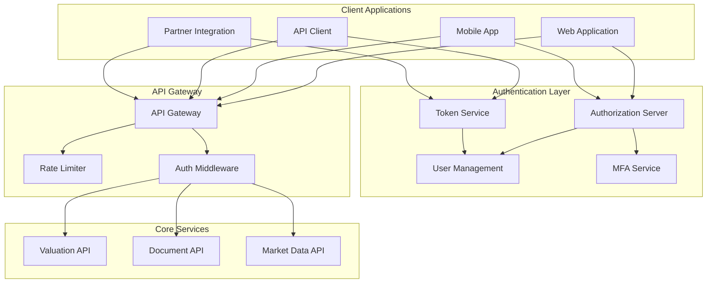

# OAuth 2.0 & Authentication Implementation

## Executive Summary

This document provides a comprehensive specification for implementing OAuth 2.0 authentication, authorization, and security measures for the UpRez IPO Valuation Platform API. The implementation supports multiple authentication flows, role-based access control (RBAC), and enterprise-grade security features.

## Authentication Architecture Overview



## 1. OAuth 2.0 Flows Implementation

### 1.1 Authorization Code Flow with PKCE

**Primary use case**: Web applications and mobile apps
**Security level**: High
**Recommended for**: Interactive user authentication

#### Configuration

```yaml
oauth2_config:
  authorization_endpoint: "https://auth.uprez.com/oauth/authorize"
  token_endpoint: "https://auth.uprez.com/oauth/token"
  revocation_endpoint: "https://auth.uprez.com/oauth/revoke"
  userinfo_endpoint: "https://auth.uprez.com/oauth/userinfo"
  jwks_uri: "https://auth.uprez.com/.well-known/jwks.json"
  issuer: "https://auth.uprez.com"
  
  supported_flows:
    - authorization_code
    - refresh_token
    - client_credentials
  
  token_lifetime:
    access_token: 3600    # 1 hour
    refresh_token: 2592000 # 30 days
    id_token: 3600        # 1 hour
  
  pkce:
    required: true
    code_challenge_methods: ["S256"]
    
  scopes:
    - openid
    - profile
    - email
    - read:valuations
    - write:valuations
    - read:documents
    - write:documents
    - read:market_data
    - read:analytics
    - write:profile
    - admin
```

#### Implementation

```python
import hashlib
import base64
import secrets
import urllib.parse
from typing import Dict, Optional, List, Any
from dataclasses import dataclass
from datetime import datetime, timedelta
import jwt
import aiohttp
import asyncio

@dataclass
class TokenResponse:
    access_token: str
    refresh_token: str
    id_token: Optional[str]
    token_type: str
    expires_in: int
    scope: str
    issued_at: datetime

@dataclass
class UserInfo:
    user_id: str
    email: str
    email_verified: bool
    name: str
    given_name: str
    family_name: str
    picture: Optional[str]
    subscription_tier: str
    permissions: List[str]

class OAuth2Client:
    """OAuth 2.0 client implementation with PKCE support"""
    
    def __init__(self, config: Dict[str, Any]):
        self.config = config
        self.client_id = config['client_id']
        self.client_secret = config.get('client_secret')  # Optional for PKCE
        self.redirect_uri = config['redirect_uri']
        self.session: Optional[aiohttp.ClientSession] = None
        
        # JWKS cache for token verification
        self.jwks_cache = {}
        self.jwks_cache_expiry: Optional[datetime] = None
    
    async def __aenter__(self):
        self.session = aiohttp.ClientSession()
        return self
    
    async def __aexit__(self, exc_type, exc_val, exc_tb):
        if self.session:
            await self.session.close()
    
    def generate_pkce_challenge(self) -> tuple[str, str]:
        """Generate PKCE code verifier and challenge"""
        
        # Generate cryptographically random code verifier
        code_verifier = base64.urlsafe_b64encode(secrets.token_bytes(32)).decode('utf-8').rstrip('=')
        
        # Create SHA256 hash of code verifier
        code_challenge = base64.urlsafe_b64encode(
            hashlib.sha256(code_verifier.encode('utf-8')).digest()
        ).decode('utf-8').rstrip('=')
        
        return code_verifier, code_challenge
    
    def build_authorization_url(
        self, 
        scopes: List[str],
        state: Optional[str] = None,
        code_challenge: Optional[str] = None,
        additional_params: Optional[Dict[str, str]] = None
    ) -> str:
        """Build OAuth 2.0 authorization URL"""
        
        params = {
            'response_type': 'code',
            'client_id': self.client_id,
            'redirect_uri': self.redirect_uri,
            'scope': ' '.join(scopes),
            'state': state or self._generate_state(),
        }
        
        # Add PKCE parameters
        if code_challenge:
            params.update({
                'code_challenge': code_challenge,
                'code_challenge_method': 'S256'
            })
        
        # Add any additional parameters
        if additional_params:
            params.update(additional_params)
        
        # Build URL
        auth_url = f"{self.config['authorization_endpoint']}?{urllib.parse.urlencode(params)}"
        return auth_url
    
    async def exchange_code_for_tokens(
        self,
        authorization_code: str,
        code_verifier: Optional[str] = None,
        state: Optional[str] = None
    ) -> TokenResponse:
        """Exchange authorization code for access tokens"""
        
        token_data = {
            'grant_type': 'authorization_code',
            'client_id': self.client_id,
            'code': authorization_code,
            'redirect_uri': self.redirect_uri,
        }
        
        # Add PKCE code verifier
        if code_verifier:
            token_data['code_verifier'] = code_verifier
        
        # Add client secret if available (for confidential clients)
        if self.client_secret:
            token_data['client_secret'] = self.client_secret
        
        headers = {
            'Content-Type': 'application/x-www-form-urlencoded',
            'Accept': 'application/json'
        }
        
        async with self.session.post(
            self.config['token_endpoint'],
            data=token_data,
            headers=headers
        ) as response:
            
            if response.status == 200:
                token_response = await response.json()
                return TokenResponse(
                    access_token=token_response['access_token'],
                    refresh_token=token_response.get('refresh_token'),
                    id_token=token_response.get('id_token'),
                    token_type=token_response.get('token_type', 'Bearer'),
                    expires_in=token_response.get('expires_in', 3600),
                    scope=token_response.get('scope', ''),
                    issued_at=datetime.utcnow()
                )
            else:
                error_response = await response.json()
                raise OAuth2Error(
                    f"Token exchange failed: {error_response.get('error', 'unknown_error')}",
                    error_code=error_response.get('error'),
                    error_description=error_response.get('error_description')
                )
    
    async def refresh_access_token(self, refresh_token: str) -> TokenResponse:
        """Refresh access token using refresh token"""
        
        token_data = {
            'grant_type': 'refresh_token',
            'client_id': self.client_id,
            'refresh_token': refresh_token,
        }
        
        if self.client_secret:
            token_data['client_secret'] = self.client_secret
        
        headers = {
            'Content-Type': 'application/x-www-form-urlencoded',
            'Accept': 'application/json'
        }
        
        async with self.session.post(
            self.config['token_endpoint'],
            data=token_data,
            headers=headers
        ) as response:
            
            if response.status == 200:
                token_response = await response.json()
                return TokenResponse(
                    access_token=token_response['access_token'],
                    refresh_token=token_response.get('refresh_token', refresh_token),
                    id_token=token_response.get('id_token'),
                    token_type=token_response.get('token_type', 'Bearer'),
                    expires_in=token_response.get('expires_in', 3600),
                    scope=token_response.get('scope', ''),
                    issued_at=datetime.utcnow()
                )
            else:
                error_response = await response.json()
                raise OAuth2Error(
                    f"Token refresh failed: {error_response.get('error', 'unknown_error')}",
                    error_code=error_response.get('error'),
                    error_description=error_response.get('error_description')
                )
    
    async def get_user_info(self, access_token: str) -> UserInfo:
        """Fetch user information using access token"""
        
        headers = {
            'Authorization': f'Bearer {access_token}',
            'Accept': 'application/json'
        }
        
        async with self.session.get(
            self.config['userinfo_endpoint'],
            headers=headers
        ) as response:
            
            if response.status == 200:
                user_data = await response.json()
                return UserInfo(
                    user_id=user_data['sub'],
                    email=user_data['email'],
                    email_verified=user_data.get('email_verified', False),
                    name=user_data.get('name', ''),
                    given_name=user_data.get('given_name', ''),
                    family_name=user_data.get('family_name', ''),
                    picture=user_data.get('picture'),
                    subscription_tier=user_data.get('subscription_tier', 'basic'),
                    permissions=user_data.get('permissions', [])
                )
            else:
                raise OAuth2Error(f"Failed to fetch user info: {response.status}")
    
    async def verify_token(self, token: str) -> Dict[str, Any]:
        """Verify JWT token using JWKS"""
        
        # Get JWKS if not cached or expired
        if not self.jwks_cache or (self.jwks_cache_expiry and datetime.utcnow() > self.jwks_cache_expiry):
            await self._fetch_jwks()
        
        try:
            # Decode JWT header to get key ID
            unverified_header = jwt.get_unverified_header(token)
            kid = unverified_header.get('kid')
            
            if not kid or kid not in self.jwks_cache:
                raise OAuth2Error("Invalid token: key ID not found")
            
            # Get public key for verification
            public_key = self.jwks_cache[kid]
            
            # Verify and decode token
            decoded_token = jwt.decode(
                token,
                public_key,
                algorithms=['RS256'],
                issuer=self.config['issuer'],
                options={'verify_aud': False}  # Audience verification handled separately
            )
            
            return decoded_token
            
        except jwt.ExpiredSignatureError:
            raise OAuth2Error("Token has expired")
        except jwt.InvalidTokenError as e:
            raise OAuth2Error(f"Invalid token: {str(e)}")
    
    async def _fetch_jwks(self):
        """Fetch JSON Web Key Set from authorization server"""
        
        async with self.session.get(self.config['jwks_uri']) as response:
            if response.status == 200:
                jwks_data = await response.json()
                
                # Build key cache
                self.jwks_cache = {}
                for key_data in jwks_data.get('keys', []):
                    if key_data.get('kty') == 'RSA' and key_data.get('use') == 'sig':
                        kid = key_data.get('kid')
                        if kid:
                            # Convert JWK to PEM format for jwt library
                            public_key = jwt.algorithms.RSAAlgorithm.from_jwk(key_data)
                            self.jwks_cache[kid] = public_key
                
                # Cache for 1 hour
                self.jwks_cache_expiry = datetime.utcnow() + timedelta(hours=1)
                
            else:
                raise OAuth2Error(f"Failed to fetch JWKS: {response.status}")
    
    def _generate_state(self) -> str:
        """Generate cryptographically random state parameter"""
        return base64.urlsafe_b64encode(secrets.token_bytes(32)).decode('utf-8').rstrip('=')
    
    async def revoke_token(self, token: str, token_type: str = 'access_token'):
        """Revoke access or refresh token"""
        
        revocation_data = {
            'token': token,
            'token_type_hint': token_type,
            'client_id': self.client_id
        }
        
        if self.client_secret:
            revocation_data['client_secret'] = self.client_secret
        
        headers = {
            'Content-Type': 'application/x-www-form-urlencoded'
        }
        
        async with self.session.post(
            self.config['revocation_endpoint'],
            data=revocation_data,
            headers=headers
        ) as response:
            
            if response.status not in [200, 204]:
                raise OAuth2Error(f"Token revocation failed: {response.status}")
```

### 1.2 Client Credentials Flow

**Primary use case**: Server-to-server API access
**Security level**: High (with client certificate authentication)
**Recommended for**: Partner integrations, internal services

```python
class ClientCredentialsFlow:
    """OAuth 2.0 Client Credentials Flow for API clients"""
    
    def __init__(self, config: Dict[str, Any]):
        self.config = config
        self.client_id = config['client_id']
        self.client_secret = config['client_secret']
        self.session: Optional[aiohttp.ClientSession] = None
        
        # Token cache
        self.cached_token: Optional[TokenResponse] = None
        self.token_lock = asyncio.Lock()
    
    async def get_access_token(self, scopes: List[str]) -> str:
        """Get access token using client credentials"""
        
        async with self.token_lock:
            # Check if we have a valid cached token
            if self._is_token_valid():
                return self.cached_token.access_token
            
            # Request new token
            self.cached_token = await self._request_token(scopes)
            return self.cached_token.access_token
    
    async def _request_token(self, scopes: List[str]) -> TokenResponse:
        """Request access token from authorization server"""
        
        token_data = {
            'grant_type': 'client_credentials',
            'client_id': self.client_id,
            'client_secret': self.client_secret,
            'scope': ' '.join(scopes)
        }
        
        headers = {
            'Content-Type': 'application/x-www-form-urlencoded',
            'Accept': 'application/json'
        }
        
        # Support for mutual TLS (mTLS) authentication
        ssl_context = None
        if self.config.get('client_certificate'):
            ssl_context = self._create_ssl_context()
        
        async with self.session.post(
            self.config['token_endpoint'],
            data=token_data,
            headers=headers,
            ssl=ssl_context
        ) as response:
            
            if response.status == 200:
                token_response = await response.json()
                return TokenResponse(
                    access_token=token_response['access_token'],
                    refresh_token=None,  # Not applicable for client credentials
                    id_token=None,
                    token_type=token_response.get('token_type', 'Bearer'),
                    expires_in=token_response.get('expires_in', 3600),
                    scope=token_response.get('scope', ''),
                    issued_at=datetime.utcnow()
                )
            else:
                error_response = await response.json()
                raise OAuth2Error(
                    f"Client credentials token request failed: {error_response.get('error')}",
                    error_code=error_response.get('error'),
                    error_description=error_response.get('error_description')
                )
    
    def _is_token_valid(self) -> bool:
        """Check if cached token is still valid"""
        
        if not self.cached_token:
            return False
        
        # Add 5 minute buffer before expiration
        expiry_buffer = timedelta(minutes=5)
        token_expiry = self.cached_token.issued_at + timedelta(seconds=self.cached_token.expires_in)
        
        return datetime.utcnow() < (token_expiry - expiry_buffer)
    
    def _create_ssl_context(self) -> ssl.SSLContext:
        """Create SSL context for mutual TLS authentication"""
        
        import ssl
        
        context = ssl.create_default_context()
        
        # Load client certificate and private key
        context.load_cert_chain(
            self.config['client_certificate']['cert_path'],
            self.config['client_certificate']['key_path']
        )
        
        return context
```

## 2. Role-Based Access Control (RBAC)

### 2.1 Permission System

```python
from enum import Enum
from typing import Set, Dict, List, Any
from dataclasses import dataclass

class ResourceType(Enum):
    VALUATION = "valuation"
    DOCUMENT = "document"
    MARKET_DATA = "market_data"
    ANALYTICS = "analytics"
    USER_PROFILE = "user_profile"
    WEBHOOK = "webhook"
    BILLING = "billing"
    ADMIN = "admin"

class Action(Enum):
    CREATE = "create"
    READ = "read"
    UPDATE = "update"
    DELETE = "delete"
    EXECUTE = "execute"
    EXPORT = "export"

@dataclass
class Permission:
    resource: ResourceType
    action: Action
    conditions: Dict[str, Any] = None  # Optional conditions/constraints
    
    def to_string(self) -> str:
        """Convert permission to string format"""
        return f"{self.action.value}:{self.resource.value}"

class Role:
    """Represents a user role with associated permissions"""
    
    def __init__(self, name: str, permissions: List[Permission], description: str = ""):
        self.name = name
        self.permissions = permissions
        self.description = description
        
        # Build permission lookup for fast checking
        self._permission_set = {p.to_string() for p in permissions}
    
    def has_permission(self, resource: ResourceType, action: Action) -> bool:
        """Check if role has specific permission"""
        permission_string = f"{action.value}:{resource.value}"
        return permission_string in self._permission_set
    
    def get_permissions_for_resource(self, resource: ResourceType) -> List[Permission]:
        """Get all permissions for a specific resource"""
        return [p for p in self.permissions if p.resource == resource]

class RoleManager:
    """Manages roles and permissions for the platform"""
    
    def __init__(self):
        self.roles = self._initialize_default_roles()
    
    def _initialize_default_roles(self) -> Dict[str, Role]:
        """Initialize default roles for the platform"""
        
        roles = {}
        
        # Basic User Role
        basic_permissions = [
            Permission(ResourceType.VALUATION, Action.CREATE),
            Permission(ResourceType.VALUATION, Action.READ),
            Permission(ResourceType.DOCUMENT, Action.CREATE),
            Permission(ResourceType.DOCUMENT, Action.READ),
            Permission(ResourceType.MARKET_DATA, Action.READ),
            Permission(ResourceType.USER_PROFILE, Action.READ),
            Permission(ResourceType.USER_PROFILE, Action.UPDATE),
        ]
        
        roles['basic_user'] = Role(
            name='basic_user',
            permissions=basic_permissions,
            description='Basic user with limited valuation capabilities'
        )
        
        # Professional User Role
        professional_permissions = basic_permissions + [
            Permission(ResourceType.VALUATION, Action.EXPORT),
            Permission(ResourceType.ANALYTICS, Action.READ),
            Permission(ResourceType.WEBHOOK, Action.CREATE),
            Permission(ResourceType.WEBHOOK, Action.READ),
            Permission(ResourceType.WEBHOOK, Action.UPDATE),
            Permission(ResourceType.WEBHOOK, Action.DELETE),
            Permission(ResourceType.DOCUMENT, Action.EXPORT),
        ]
        
        roles['professional_user'] = Role(
            name='professional_user',
            permissions=professional_permissions,
            description='Professional user with advanced features'
        )
        
        # Enterprise User Role
        enterprise_permissions = professional_permissions + [
            Permission(ResourceType.VALUATION, Action.DELETE),
            Permission(ResourceType.DOCUMENT, Action.DELETE),
            Permission(ResourceType.ANALYTICS, Action.EXPORT),
            Permission(ResourceType.BILLING, Action.READ),
        ]
        
        roles['enterprise_user'] = Role(
            name='enterprise_user',
            permissions=enterprise_permissions,
            description='Enterprise user with full feature access'
        )
        
        # Admin Role
        admin_permissions = [
            Permission(resource, action) 
            for resource in ResourceType 
            for action in Action
        ]
        
        roles['admin'] = Role(
            name='admin',
            permissions=admin_permissions,
            description='Administrator with full system access'
        )
        
        return roles
    
    def get_role(self, role_name: str) -> Optional[Role]:
        """Get role by name"""
        return self.roles.get(role_name)
    
    def check_permission(
        self, 
        user_roles: List[str], 
        resource: ResourceType, 
        action: Action
    ) -> bool:
        """Check if user has required permission"""
        
        for role_name in user_roles:
            role = self.get_role(role_name)
            if role and role.has_permission(resource, action):
                return True
        
        return False
```

### 2.2 FastAPI Security Implementation

```python
from fastapi import Depends, HTTPException, Request, status
from fastapi.security import HTTPBearer, HTTPAuthorizationCredentials
from typing import Optional, List, Any

class JWTBearer(HTTPBearer):
    """Custom JWT Bearer token handler"""
    
    def __init__(self, auto_error: bool = True):
        super(JWTBearer, self).__init__(auto_error=auto_error)
        self.oauth_client = OAuth2Client(get_oauth_config())
        self.role_manager = RoleManager()
    
    async def __call__(self, request: Request):
        credentials: HTTPAuthorizationCredentials = await super(JWTBearer, self).__call__(request)
        
        if credentials:
            if not credentials.scheme == "Bearer":
                raise HTTPException(
                    status_code=status.HTTP_403_FORBIDDEN,
                    detail="Invalid authentication scheme"
                )
            
            # Verify JWT token
            try:
                payload = await self.oauth_client.verify_token(credentials.credentials)
                return await self._create_user_context(payload)
            except OAuth2Error as e:
                raise HTTPException(
                    status_code=status.HTTP_401_UNAUTHORIZED,
                    detail=f"Token validation failed: {str(e)}"
                )
        else:
            raise HTTPException(
                status_code=status.HTTP_401_UNAUTHORIZED,
                detail="Authorization header required"
            )
    
    async def _create_user_context(self, token_payload: Dict[str, Any]) -> 'UserContext':
        """Create user context from token payload"""
        
        # Extract user information from token
        user_id = token_payload.get('sub')
        email = token_payload.get('email')
        roles = token_payload.get('roles', ['basic_user'])
        subscription_tier = token_payload.get('subscription_tier', 'basic')
        
        # Get additional user data if needed
        user_data = await self._get_user_data(user_id)
        
        return UserContext(
            user_id=user_id,
            email=email,
            roles=roles,
            subscription_tier=subscription_tier,
            permissions=self._calculate_permissions(roles),
            token_payload=token_payload,
            additional_data=user_data
        )
    
    def _calculate_permissions(self, roles: List[str]) -> Set[str]:
        """Calculate combined permissions from user roles"""
        
        permissions = set()
        
        for role_name in roles:
            role = self.role_manager.get_role(role_name)
            if role:
                permissions.update(p.to_string() for p in role.permissions)
        
        return permissions
    
    async def _get_user_data(self, user_id: str) -> Dict[str, Any]:
        """Fetch additional user data from database"""
        # Implementation depends on your user storage system
        # This could fetch subscription info, usage limits, etc.
        return {}

@dataclass
class UserContext:
    """User context for authenticated requests"""
    user_id: str
    email: str
    roles: List[str]
    subscription_tier: str
    permissions: Set[str]
    token_payload: Dict[str, Any]
    additional_data: Dict[str, Any]
    
    def has_permission(self, resource: ResourceType, action: Action) -> bool:
        """Check if user has specific permission"""
        permission_string = f"{action.value}:{resource.value}"
        return permission_string in self.permissions
    
    def require_permission(self, resource: ResourceType, action: Action):
        """Raise exception if user lacks required permission"""
        if not self.has_permission(resource, action):
            raise HTTPException(
                status_code=status.HTTP_403_FORBIDDEN,
                detail=f"Insufficient permissions: {action.value}:{resource.value} required"
            )

# Security dependency
security = JWTBearer()

def get_current_user(token: UserContext = Depends(security)) -> UserContext:
    """FastAPI dependency to get current authenticated user"""
    return token

def require_permission(resource: ResourceType, action: Action):
    """Decorator/dependency to require specific permission"""
    
    def permission_checker(user: UserContext = Depends(get_current_user)):
        user.require_permission(resource, action)
        return user
    
    return permission_checker

def require_subscription_tier(min_tier: str):
    """Decorator/dependency to require minimum subscription tier"""
    
    tier_hierarchy = {
        'basic': 0,
        'professional': 1,
        'enterprise': 2
    }
    
    def tier_checker(user: UserContext = Depends(get_current_user)):
        user_tier_level = tier_hierarchy.get(user.subscription_tier, -1)
        required_tier_level = tier_hierarchy.get(min_tier, 999)
        
        if user_tier_level < required_tier_level:
            raise HTTPException(
                status_code=status.HTTP_403_FORBIDDEN,
                detail=f"Subscription tier '{min_tier}' or higher required"
            )
        
        return user
    
    return tier_checker

# Usage examples in FastAPI endpoints
from fastapi import APIRouter

api_router = APIRouter()

@api_router.post("/valuations")
async def create_valuation(
    request: ValuationRequest,
    user: UserContext = Depends(require_permission(ResourceType.VALUATION, Action.CREATE))
):
    """Create valuation - requires valuation create permission"""
    # Implementation here
    pass

@api_router.get("/analytics/industry-benchmarks")
async def get_industry_benchmarks(
    user: UserContext = Depends(require_subscription_tier('professional'))
):
    """Get industry benchmarks - requires professional subscription"""
    # Implementation here
    pass
```

## 3. Multi-Factor Authentication (MFA)

### 3.1 TOTP (Time-based One-Time Password) Implementation

```python
import pyotp
import qrcode
import io
import base64
from typing import Optional, Dict, Any
from dataclasses import dataclass

@dataclass
class MFASetupResponse:
    secret_key: str
    qr_code: str  # Base64 encoded QR code image
    backup_codes: List[str]

class MFAManager:
    """Manages Multi-Factor Authentication for users"""
    
    def __init__(self):
        self.issuer_name = "UpRez Valuation Platform"
        
    def setup_totp(self, user_id: str, user_email: str) -> MFASetupResponse:
        """Set up TOTP-based MFA for a user"""
        
        # Generate secret key
        secret_key = pyotp.random_base32()
        
        # Create TOTP instance
        totp = pyotp.TOTP(secret_key)
        
        # Generate QR code for authenticator app
        provisioning_uri = totp.provisioning_uri(
            name=user_email,
            issuer_name=self.issuer_name
        )
        
        qr_code_image = self._generate_qr_code(provisioning_uri)
        
        # Generate backup codes
        backup_codes = [self._generate_backup_code() for _ in range(10)]
        
        # Store MFA data for user (implementation depends on your storage)
        await self._store_mfa_setup(user_id, secret_key, backup_codes)
        
        return MFASetupResponse(
            secret_key=secret_key,
            qr_code=qr_code_image,
            backup_codes=backup_codes
        )
    
    def verify_totp_code(self, user_id: str, code: str) -> bool:
        """Verify TOTP code for a user"""
        
        # Get user's MFA setup
        mfa_data = await self._get_user_mfa_data(user_id)
        
        if not mfa_data or not mfa_data.get('secret_key'):
            return False
        
        # Create TOTP instance
        totp = pyotp.TOTP(mfa_data['secret_key'])
        
        # Verify code (with window for clock drift)
        return totp.verify(code, valid_window=1)
    
    def verify_backup_code(self, user_id: str, backup_code: str) -> bool:
        """Verify backup code for a user"""
        
        # Get user's MFA setup
        mfa_data = await self._get_user_mfa_data(user_id)
        
        if not mfa_data or backup_code not in mfa_data.get('backup_codes', []):
            return False
        
        # Remove used backup code
        mfa_data['backup_codes'].remove(backup_code)
        await self._update_user_mfa_data(user_id, mfa_data)
        
        return True
    
    def _generate_qr_code(self, provisioning_uri: str) -> str:
        """Generate QR code image and return as base64 string"""
        
        qr = qrcode.QRCode(version=1, box_size=10, border=5)
        qr.add_data(provisioning_uri)
        qr.make(fit=True)
        
        img = qr.make_image(fill_color="black", back_color="white")
        
        # Convert to base64
        buffer = io.BytesIO()
        img.save(buffer, format='PNG')
        img_str = base64.b64encode(buffer.getvalue()).decode()
        
        return f"data:image/png;base64,{img_str}"
    
    def _generate_backup_code(self) -> str:
        """Generate a backup code"""
        import secrets
        import string
        
        # Generate 8-character alphanumeric code
        alphabet = string.ascii_uppercase + string.digits
        return ''.join(secrets.choice(alphabet) for _ in range(8))
```

### 3.2 SMS-based MFA Implementation

```python
import boto3
from typing import Optional
import secrets
import hashlib

class SMSMFAManager:
    """SMS-based MFA implementation using AWS SNS"""
    
    def __init__(self, aws_config: Dict[str, Any]):
        self.sns_client = boto3.client(
            'sns',
            aws_access_key_id=aws_config['access_key_id'],
            aws_secret_access_key=aws_config['secret_access_key'],
            region_name=aws_config['region']
        )
        self.code_expiry_minutes = 5
    
    async def send_verification_code(self, user_id: str, phone_number: str) -> bool:
        """Send SMS verification code to user"""
        
        # Generate 6-digit code
        code = str(secrets.randbelow(900000) + 100000)
        
        # Store code with expiration (implementation depends on your storage)
        await self._store_sms_code(user_id, code)
        
        # Send SMS
        message = f"Your UpRez verification code is: {code}. Valid for {self.code_expiry_minutes} minutes."
        
        try:
            response = self.sns_client.publish(
                PhoneNumber=phone_number,
                Message=message
            )
            
            return response['ResponseMetadata']['HTTPStatusCode'] == 200
            
        except Exception as e:
            logging.error(f"Failed to send SMS to {phone_number}: {e}")
            return False
    
    async def verify_sms_code(self, user_id: str, code: str) -> bool:
        """Verify SMS code for a user"""
        
        stored_code_data = await self._get_stored_sms_code(user_id)
        
        if not stored_code_data:
            return False
        
        # Check if code matches and hasn't expired
        if (stored_code_data['code'] == code and 
            not stored_code_data['is_expired']):
            
            # Invalidate code after successful verification
            await self._invalidate_sms_code(user_id)
            return True
        
        return False
```

## 4. API Security Headers and Middleware

### 4.1 Security Headers Middleware

```python
from fastapi import Request, Response
from starlette.middleware.base import BaseHTTPMiddleware
from starlette.responses import Response as StarletteResponse
import time
import hashlib
import secrets

class SecurityHeadersMiddleware(BaseHTTPMiddleware):
    """Add security headers to all responses"""
    
    async def dispatch(self, request: Request, call_next):
        response: Response = await call_next(request)
        
        # Content Security Policy
        csp_policy = (
            "default-src 'self'; "
            "script-src 'self' 'unsafe-inline' https://cdn.jsdelivr.net; "
            "style-src 'self' 'unsafe-inline' https://fonts.googleapis.com; "
            "font-src 'self' https://fonts.gstatic.com; "
            "img-src 'self' data: https:; "
            "connect-src 'self' https://api.uprez.com; "
            "frame-ancestors 'none'"
        )
        
        # Security headers
        security_headers = {
            "Content-Security-Policy": csp_policy,
            "X-Content-Type-Options": "nosniff",
            "X-Frame-Options": "DENY",
            "X-XSS-Protection": "1; mode=block",
            "Referrer-Policy": "strict-origin-when-cross-origin",
            "Permissions-Policy": "geolocation=(), microphone=(), camera=()",
            "Strict-Transport-Security": "max-age=31536000; includeSubDomains",
        }
        
        # Add security headers
        for header, value in security_headers.items():
            response.headers[header] = value
        
        return response

class RateLimitMiddleware(BaseHTTPMiddleware):
    """Rate limiting middleware with user-based limits"""
    
    def __init__(self, app, redis_client):
        super().__init__(app)
        self.redis = redis_client
        
        # Rate limits by subscription tier
        self.rate_limits = {
            'basic': {'requests': 100, 'window': 3600},       # 100 req/hour
            'professional': {'requests': 500, 'window': 3600}, # 500 req/hour
            'enterprise': {'requests': 2000, 'window': 3600}   # 2000 req/hour
        }
    
    async def dispatch(self, request: Request, call_next):
        # Skip rate limiting for health checks and auth endpoints
        if request.url.path in ['/health', '/oauth/token', '/oauth/authorize']:
            return await call_next(request)
        
        # Get user context from request (set by auth middleware)
        user_context = getattr(request.state, 'user', None)
        
        if user_context:
            # Check rate limit
            allowed = await self._check_rate_limit(user_context)
            
            if not allowed:
                return self._rate_limit_response(user_context)
        
        response = await call_next(request)
        
        # Update request counter
        if user_context:
            await self._update_request_count(user_context)
        
        return response
    
    async def _check_rate_limit(self, user_context: UserContext) -> bool:
        """Check if user has exceeded rate limit"""
        
        tier = user_context.subscription_tier
        limits = self.rate_limits.get(tier, self.rate_limits['basic'])
        
        key = f"rate_limit:{user_context.user_id}"
        current_count = await self.redis.get(key)
        
        if current_count and int(current_count) >= limits['requests']:
            return False
        
        return True
    
    async def _update_request_count(self, user_context: UserContext):
        """Update request count for user"""
        
        tier = user_context.subscription_tier
        limits = self.rate_limits.get(tier, self.rate_limits['basic'])
        
        key = f"rate_limit:{user_context.user_id}"
        
        # Increment counter
        current_count = await self.redis.incr(key)
        
        # Set expiry on first request
        if current_count == 1:
            await self.redis.expire(key, limits['window'])
    
    def _rate_limit_response(self, user_context: UserContext) -> StarletteResponse:
        """Return rate limit exceeded response"""
        
        tier = user_context.subscription_tier
        limits = self.rate_limits.get(tier, self.rate_limits['basic'])
        
        headers = {
            "X-RateLimit-Limit": str(limits['requests']),
            "X-RateLimit-Window": str(limits['window']),
            "X-RateLimit-Remaining": "0",
            "Retry-After": str(limits['window'])
        }
        
        return StarletteResponse(
            status_code=429,
            headers=headers,
            content='{"error": "rate_limit_exceeded", "message": "Rate limit exceeded"}'
        )
```

## 5. Token Management and Security

### 5.1 Secure Token Storage

```python
import redis
import json
from cryptography.fernet import Fernet
from typing import Optional, Dict, Any
from datetime import datetime, timedelta

class SecureTokenStore:
    """Secure storage for OAuth tokens with encryption"""
    
    def __init__(self, redis_client: redis.Redis, encryption_key: bytes):
        self.redis = redis_client
        self.cipher = Fernet(encryption_key)
        self.token_prefix = "token:"
        self.refresh_prefix = "refresh:"
    
    async def store_tokens(
        self, 
        user_id: str, 
        access_token: str, 
        refresh_token: str,
        expires_in: int
    ):
        """Store encrypted tokens in Redis"""
        
        token_data = {
            'access_token': access_token,
            'refresh_token': refresh_token,
            'issued_at': datetime.utcnow().isoformat(),
            'expires_in': expires_in
        }
        
        # Encrypt token data
        encrypted_data = self.cipher.encrypt(json.dumps(token_data).encode())
        
        # Store in Redis with expiration
        access_key = f"{self.token_prefix}{user_id}"
        refresh_key = f"{self.refresh_prefix}{user_id}"
        
        await self.redis.setex(access_key, expires_in, encrypted_data)
        await self.redis.setex(refresh_key, expires_in * 10, encrypted_data)  # Longer expiry for refresh token
    
    async def get_tokens(self, user_id: str) -> Optional[Dict[str, Any]]:
        """Retrieve and decrypt user tokens"""
        
        access_key = f"{self.token_prefix}{user_id}"
        encrypted_data = await self.redis.get(access_key)
        
        if not encrypted_data:
            return None
        
        try:
            # Decrypt and parse token data
            decrypted_data = self.cipher.decrypt(encrypted_data)
            token_data = json.loads(decrypted_data.decode())
            
            return token_data
            
        except Exception as e:
            logging.error(f"Failed to decrypt tokens for user {user_id}: {e}")
            return None
    
    async def revoke_tokens(self, user_id: str):
        """Revoke all tokens for a user"""
        
        access_key = f"{self.token_prefix}{user_id}"
        refresh_key = f"{self.refresh_prefix}{user_id}"
        
        await self.redis.delete(access_key, refresh_key)
    
    async def is_token_blacklisted(self, token: str) -> bool:
        """Check if a token is blacklisted"""
        
        token_hash = hashlib.sha256(token.encode()).hexdigest()
        blacklist_key = f"blacklist:{token_hash}"
        
        return await self.redis.exists(blacklist_key)
    
    async def blacklist_token(self, token: str, expires_in: int):
        """Add token to blacklist"""
        
        token_hash = hashlib.sha256(token.encode()).hexdigest()
        blacklist_key = f"blacklist:{token_hash}"
        
        await self.redis.setex(blacklist_key, expires_in, "1")
```

### 5.2 Token Rotation Strategy

```python
class TokenRotationManager:
    """Manages automatic token rotation for enhanced security"""
    
    def __init__(self, oauth_client: OAuth2Client, token_store: SecureTokenStore):
        self.oauth_client = oauth_client
        self.token_store = token_store
        self.rotation_threshold = timedelta(minutes=15)  # Rotate if token expires within 15 minutes
    
    async def get_valid_token(self, user_id: str) -> Optional[str]:
        """Get valid access token, rotating if necessary"""
        
        tokens = await self.token_store.get_tokens(user_id)
        
        if not tokens:
            return None
        
        # Check if token needs rotation
        issued_at = datetime.fromisoformat(tokens['issued_at'])
        expires_at = issued_at + timedelta(seconds=tokens['expires_in'])
        
        if datetime.utcnow() + self.rotation_threshold >= expires_at:
            # Token expires soon, rotate it
            new_tokens = await self._rotate_token(tokens['refresh_token'])
            
            if new_tokens:
                await self.token_store.store_tokens(
                    user_id,
                    new_tokens.access_token,
                    new_tokens.refresh_token,
                    new_tokens.expires_in
                )
                
                return new_tokens.access_token
        
        return tokens['access_token']
    
    async def _rotate_token(self, refresh_token: str) -> Optional[TokenResponse]:
        """Rotate access token using refresh token"""
        
        try:
            return await self.oauth_client.refresh_access_token(refresh_token)
        except OAuth2Error as e:
            logging.error(f"Token rotation failed: {e}")
            return None
```

This comprehensive OAuth 2.0 and authentication implementation provides:

1. **Multiple OAuth flows** with PKCE support for security
2. **Comprehensive RBAC system** with fine-grained permissions
3. **Multi-factor authentication** support (TOTP and SMS)
4. **Security middleware** with rate limiting and security headers
5. **Secure token management** with encryption and rotation
6. **FastAPI integration** with dependency injection for auth
7. **Enterprise-grade security** features for production use

The implementation follows security best practices and provides a robust foundation for the API authentication system.