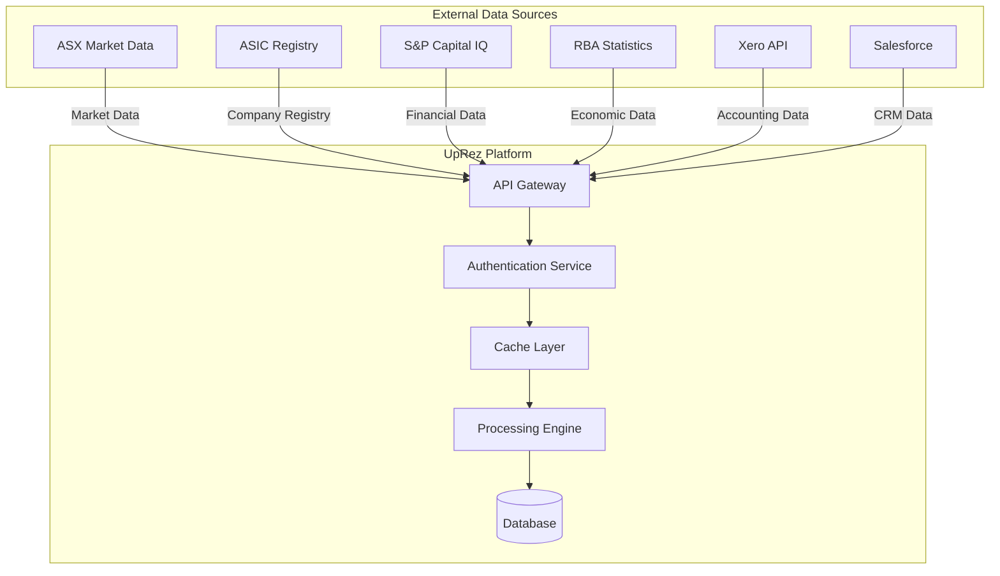

# External API Integration Patterns

## Executive Summary

This document outlines the comprehensive external API integration patterns for the UpRez IPO Valuation Platform. The platform integrates with multiple financial data providers, regulatory bodies, and market data sources to deliver accurate and timely valuation insights.

## Integration Architecture

### Overview



## 1. ASX Market Data Integration

### Real-time Market Data API

**Endpoint**: `https://api.asx.com.au/v1`
**Authentication**: API Key + OAuth 2.0
**Rate Limits**: 1000 requests/minute
**Data Refresh**: Every 5 minutes during trading hours

#### Connection Configuration

```yaml
asx_api:
  base_url: "https://api.asx.com.au/v1"
  authentication:
    type: "oauth2_client_credentials"
    token_url: "https://auth.asx.com.au/oauth/token"
    scopes: ["market_data", "company_info"]
  rate_limiting:
    requests_per_minute: 1000
    burst_limit: 100
  timeout:
    connect: 30s
    read: 60s
  retry_policy:
    max_retries: 3
    backoff_multiplier: 2
    max_backoff: 300s
  circuit_breaker:
    failure_threshold: 5
    recovery_timeout: 60s
```

#### Data Points Retrieved

1. **Current Market Data**
   - Share price (current, open, high, low)
   - Trading volume and value
   - Market capitalization
   - Shares on issue

2. **Financial Ratios**
   - P/E ratio
   - EV/EBITDA
   - Price-to-Sales
   - Dividend yield

3. **Historical Data**
   - Daily OHLC data (up to 5 years)
   - Volume-weighted average price (VWAP)
   - Adjusted prices for corporate actions

4. **Corporate Actions**
   - Dividend declarations
   - Stock splits and consolidations
   - Rights issues
   - Spin-offs and mergers

#### Implementation Pattern

```python
import asyncio
import aiohttp
from typing import List, Optional, Dict, Any
from dataclasses import dataclass
from datetime import datetime, timedelta
import logging

@dataclass
class MarketData:
    ticker: str
    current_price: float
    market_cap: float
    volume: int
    pe_ratio: Optional[float]
    ev_ebitda: Optional[float]
    last_updated: datetime

class ASXMarketDataClient:
    def __init__(self, config: dict):
        self.config = config
        self.session: Optional[aiohttp.ClientSession] = None
        self.access_token: Optional[str] = None
        self.token_expires: Optional[datetime] = None
        self.circuit_breaker = CircuitBreaker(
            failure_threshold=config['circuit_breaker']['failure_threshold'],
            recovery_timeout=config['circuit_breaker']['recovery_timeout']
        )
        
    async def __aenter__(self):
        self.session = aiohttp.ClientSession(
            timeout=aiohttp.ClientTimeout(
                connect=self.config['timeout']['connect'],
                total=self.config['timeout']['read']
            )
        )
        await self._ensure_authenticated()
        return self
    
    async def __aexit__(self, exc_type, exc_val, exc_tb):
        if self.session:
            await self.session.close()
    
    async def _ensure_authenticated(self):
        """Ensure we have a valid access token"""
        if not self.access_token or (
            self.token_expires and datetime.utcnow() >= self.token_expires
        ):
            await self._refresh_token()
    
    async def _refresh_token(self):
        """Refresh OAuth access token"""
        auth_data = {
            'grant_type': 'client_credentials',
            'scope': ' '.join(self.config['authentication']['scopes'])
        }
        
        async with self.session.post(
            self.config['authentication']['token_url'],
            data=auth_data,
            auth=aiohttp.BasicAuth(
                self.config['authentication']['client_id'],
                self.config['authentication']['client_secret']
            )
        ) as response:
            if response.status == 200:
                token_data = await response.json()
                self.access_token = token_data['access_token']
                expires_in = token_data.get('expires_in', 3600)
                self.token_expires = datetime.utcnow() + timedelta(seconds=expires_in - 300)
            else:
                raise Exception(f"Failed to refresh token: {response.status}")
    
    @circuit_breaker_decorator
    async def get_market_data(self, ticker: str) -> MarketData:
        """Fetch current market data for a ticker"""
        await self._ensure_authenticated()
        
        url = f"{self.config['base_url']}/companies/{ticker}/market-data"
        headers = {'Authorization': f'Bearer {self.access_token}'}
        
        async with self.session.get(url, headers=headers) as response:
            if response.status == 200:
                data = await response.json()
                return MarketData(
                    ticker=ticker,
                    current_price=data['current_price'],
                    market_cap=data['market_cap'],
                    volume=data['volume'],
                    pe_ratio=data.get('pe_ratio'),
                    ev_ebitda=data.get('ev_ebitda'),
                    last_updated=datetime.fromisoformat(data['last_updated'])
                )
            elif response.status == 404:
                raise CompanyNotFoundError(f"Company {ticker} not found")
            else:
                raise ASXAPIError(f"API request failed: {response.status}")
    
    async def get_batch_market_data(self, tickers: List[str]) -> List[MarketData]:
        """Fetch market data for multiple tickers in parallel"""
        semaphore = asyncio.Semaphore(10)  # Limit concurrent requests
        
        async def fetch_with_semaphore(ticker):
            async with semaphore:
                try:
                    return await self.get_market_data(ticker)
                except Exception as e:
                    logging.error(f"Error fetching data for {ticker}: {e}")
                    return None
        
        tasks = [fetch_with_semaphore(ticker) for ticker in tickers]
        results = await asyncio.gather(*tasks, return_exceptions=True)
        
        return [r for r in results if r is not None]
    
    async def get_historical_data(
        self, 
        ticker: str, 
        start_date: datetime, 
        end_date: datetime
    ) -> List[Dict[str, Any]]:
        """Fetch historical OHLC data"""
        await self._ensure_authenticated()
        
        url = f"{self.config['base_url']}/companies/{ticker}/historical"
        params = {
            'start_date': start_date.isoformat(),
            'end_date': end_date.isoformat(),
            'frequency': 'daily'
        }
        headers = {'Authorization': f'Bearer {self.access_token}'}
        
        async with self.session.get(url, headers=headers, params=params) as response:
            if response.status == 200:
                data = await response.json()
                return data['historical_data']
            else:
                raise ASXAPIError(f"Historical data request failed: {response.status}")
```

### Data Quality and Validation

```python
from typing import Dict, List, Any
from datetime import datetime, timedelta
import statistics

class ASXDataValidator:
    """Validates and cleanses ASX market data"""
    
    def __init__(self):
        self.validation_rules = {
            'price_spike_threshold': 0.20,  # 20% price change threshold
            'volume_spike_threshold': 3.0,   # 3x average volume threshold
            'stale_data_threshold': 300,     # 5 minutes in seconds
        }
    
    def validate_market_data(self, data: MarketData, historical_context: List[MarketData]) -> Dict[str, Any]:
        """Comprehensive data validation with historical context"""
        validation_result = {
            'is_valid': True,
            'warnings': [],
            'errors': [],
            'quality_score': 1.0,
            'data_age': None
        }
        
        # Check data freshness
        data_age = (datetime.utcnow() - data.last_updated).total_seconds()
        validation_result['data_age'] = data_age
        
        if data_age > self.validation_rules['stale_data_threshold']:
            validation_result['warnings'].append(
                f"Data is {data_age:.0f} seconds old (threshold: {self.validation_rules['stale_data_threshold']})"
            )
            validation_result['quality_score'] *= 0.9
        
        # Price spike detection
        if historical_context:
            recent_prices = [h.current_price for h in historical_context[-5:]]
            avg_recent_price = statistics.mean(recent_prices)
            price_change = abs(data.current_price - avg_recent_price) / avg_recent_price
            
            if price_change > self.validation_rules['price_spike_threshold']:
                validation_result['warnings'].append(
                    f"Significant price change detected: {price_change:.2%}"
                )
                validation_result['quality_score'] *= 0.95
        
        # Volume spike detection
        if historical_context:
            recent_volumes = [h.volume for h in historical_context[-20:]]
            avg_recent_volume = statistics.mean(recent_volumes)
            
            if data.volume > avg_recent_volume * self.validation_rules['volume_spike_threshold']:
                validation_result['warnings'].append(
                    f"Unusual trading volume: {data.volume} vs avg {avg_recent_volume:.0f}"
                )
        
        # Basic data integrity checks
        if data.current_price <= 0:
            validation_result['errors'].append("Invalid price: must be positive")
            validation_result['is_valid'] = False
        
        if data.market_cap <= 0:
            validation_result['errors'].append("Invalid market cap: must be positive")
            validation_result['is_valid'] = False
        
        if data.volume < 0:
            validation_result['errors'].append("Invalid volume: cannot be negative")
            validation_result['is_valid'] = False
        
        # Ratio validation
        if data.pe_ratio and (data.pe_ratio < 0 or data.pe_ratio > 1000):
            validation_result['warnings'].append(f"Unusual P/E ratio: {data.pe_ratio}")
            validation_result['quality_score'] *= 0.95
        
        return validation_result
```

## 2. ASIC Company Registry Integration

### Company Registry API

**Endpoint**: `https://api.asic.gov.au/v2`
**Authentication**: OAuth 2.0 Client Credentials
**Rate Limits**: 500 requests/hour
**Data Refresh**: Daily for company structure, real-time for filings

#### Connection Configuration

```yaml
asic_api:
  base_url: "https://api.asic.gov.au/v2"
  authentication:
    type: "oauth2_client_credentials"
    token_url: "https://auth.asic.gov.au/oauth/token"
    scopes: ["registry_read", "filings_read"]
  rate_limiting:
    requests_per_hour: 500
    burst_limit: 50
  cache_ttl:
    company_details: "24h"
    filings: "1h"
    compliance_status: "6h"
```

#### Implementation Pattern

```python
from dataclasses import dataclass
from typing import List, Optional, Dict, Any
from enum import Enum

class CompanyStatus(Enum):
    ACTIVE = "active"
    DEREGISTERED = "deregistered"
    UNDER_ADMINISTRATION = "under_administration"

@dataclass
class CompanyDetails:
    acn: str
    name: str
    status: CompanyStatus
    abn: Optional[str]
    registered_office: str
    principal_place_of_business: str
    company_type: str
    registration_date: datetime
    last_annual_return: Optional[datetime]
    current_directors: List[str]
    current_secretaries: List[str]
    share_structure: Dict[str, Any]

class ASICRegistryClient:
    def __init__(self, config: dict):
        self.config = config
        self.session: Optional[aiohttp.ClientSession] = None
        self.access_token: Optional[str] = None
        self.token_expires: Optional[datetime] = None
        
    async def get_company_details(self, acn: str) -> CompanyDetails:
        """Fetch comprehensive company details from ASIC registry"""
        await self._ensure_authenticated()
        
        url = f"{self.config['base_url']}/organisations/{acn}"
        headers = {'Authorization': f'Bearer {self.access_token}'}
        
        async with self.session.get(url, headers=headers) as response:
            if response.status == 200:
                data = await response.json()
                return self._parse_company_details(data)
            elif response.status == 404:
                raise CompanyNotFoundError(f"ACN {acn} not found in registry")
            else:
                raise ASICAPIError(f"Registry request failed: {response.status}")
    
    async def get_financial_filings(self, acn: str, years: int = 3) -> List[Dict[str, Any]]:
        """Retrieve recent financial filings and annual returns"""
        await self._ensure_authenticated()
        
        url = f"{self.config['base_url']}/organisations/{acn}/filings"
        params = {
            'type': 'financial',
            'years': years,
            'include_lodgement_date': True
        }
        headers = {'Authorization': f'Bearer {self.access_token}'}
        
        async with self.session.get(url, headers=headers, params=params) as response:
            if response.status == 200:
                data = await response.json()
                return data.get('filings', [])
            else:
                raise ASICAPIError(f"Filings request failed: {response.status}")
    
    async def get_compliance_status(self, acn: str) -> Dict[str, Any]:
        """Check company compliance status with ASIC requirements"""
        await self._ensure_authenticated()
        
        url = f"{self.config['base_url']}/organisations/{acn}/compliance"
        headers = {'Authorization': f'Bearer {self.access_token}'}
        
        async with self.session.get(url, headers=headers) as response:
            if response.status == 200:
                return await response.json()
            else:
                raise ASICAPIError(f"Compliance check failed: {response.status}")
    
    def _parse_company_details(self, data: Dict[str, Any]) -> CompanyDetails:
        """Parse ASIC API response into structured company details"""
        return CompanyDetails(
            acn=data['acn'],
            name=data['name'],
            status=CompanyStatus(data['status'].lower()),
            abn=data.get('abn'),
            registered_office=data['addresses']['registered_office'],
            principal_place_of_business=data['addresses'].get('principal_place_of_business', ''),
            company_type=data['company_type'],
            registration_date=datetime.fromisoformat(data['registration_date']),
            last_annual_return=datetime.fromisoformat(data['last_annual_return']) if data.get('last_annual_return') else None,
            current_directors=[d['name'] for d in data.get('current_directors', [])],
            current_secretaries=[s['name'] for s in data.get('current_secretaries', [])],
            share_structure=data.get('share_structure', {})
        )
```

## 3. S&P Capital IQ Integration

### Professional Financial Data API

**Endpoint**: `https://api.capitaliq.com/v3`
**Authentication**: API Key + OAuth 2.0
**Rate Limits**: 2000 requests/hour (Enterprise tier)
**Data Coverage**: Global public companies, M&A transactions, credit data

#### Connection Configuration

```yaml
capital_iq_api:
  base_url: "https://api.capitaliq.com/v3"
  authentication:
    type: "api_key_oauth2"
    api_key_header: "X-API-Key"
    oauth2_token_url: "https://auth.capitaliq.com/oauth/token"
  rate_limiting:
    requests_per_hour: 2000
    burst_limit: 200
  data_refresh:
    fundamentals: "4h"
    market_data: "15min"
    transactions: "24h"
```

#### Implementation Pattern

```python
from typing import List, Dict, Any, Optional
from decimal import Decimal
import asyncio

@dataclass
class TransactionData:
    transaction_id: str
    announcement_date: datetime
    target_company: str
    acquirer_company: str
    transaction_value: Optional[Decimal]
    enterprise_value: Optional[Decimal]
    ev_revenue_multiple: Optional[float]
    ev_ebitda_multiple: Optional[float]
    target_industry: str
    deal_status: str
    payment_method: str

class CapitalIQClient:
    def __init__(self, config: dict):
        self.config = config
        self.session: Optional[aiohttp.ClientSession] = None
        self.api_key = config['api_key']
        self.access_token: Optional[str] = None
        
    async def get_peer_group_analysis(
        self, 
        industry_code: str, 
        market_cap_range: tuple,
        region: str = "Australia"
    ) -> Dict[str, Any]:
        """Find and analyze peer companies based on industry and size"""
        
        search_criteria = {
            'industry_classification': industry_code,
            'market_cap_min': market_cap_range[0],
            'market_cap_max': market_cap_range[1],
            'primary_exchange': 'ASX',
            'status': 'active',
            'region': region
        }
        
        # Search for peer companies
        peer_companies = await self._search_companies(search_criteria)
        
        # Fetch detailed financial data for each peer
        peer_data = []
        semaphore = asyncio.Semaphore(5)  # Limit concurrent requests
        
        async def fetch_peer_data(company):
            async with semaphore:
                financial_data = await self.get_financial_metrics(company['ticker'])
                return {**company, **financial_data}
        
        tasks = [fetch_peer_data(company) for company in peer_companies]
        peer_data = await asyncio.gather(*tasks, return_exceptions=True)
        
        # Filter out any failed requests
        valid_peers = [p for p in peer_data if not isinstance(p, Exception)]
        
        return {
            'criteria': search_criteria,
            'peer_companies': valid_peers,
            'peer_count': len(valid_peers),
            'summary_statistics': self._calculate_peer_statistics(valid_peers)
        }
    
    async def get_transaction_multiples(
        self, 
        sector: str, 
        timeframe_months: int = 24,
        min_transaction_value: Decimal = Decimal('10000000')  # $10M minimum
    ) -> List[TransactionData]:
        """Retrieve M&A transaction data for precedent analysis"""
        
        await self._ensure_authenticated()
        
        url = f"{self.config['base_url']}/transactions/search"
        
        search_params = {
            'sector': sector,
            'timeframe_months': timeframe_months,
            'deal_status': 'completed',
            'target_geography': ['Australia', 'New Zealand'],
            'min_transaction_value': str(min_transaction_value),
            'include_multiples': True,
            'sort_by': 'announcement_date',
            'sort_order': 'desc',
            'limit': 50
        }
        
        headers = {
            'X-API-Key': self.api_key,
            'Authorization': f'Bearer {self.access_token}',
            'Content-Type': 'application/json'
        }
        
        async with self.session.post(url, json=search_params, headers=headers) as response:
            if response.status == 200:
                data = await response.json()
                return [self._parse_transaction_data(tx) for tx in data.get('transactions', [])]
            else:
                raise CapitalIQError(f"Transaction search failed: {response.status}")
    
    async def get_financial_metrics(self, ticker: str) -> Dict[str, Any]:
        """Fetch comprehensive financial metrics for a company"""
        
        await self._ensure_authenticated()
        
        url = f"{self.config['base_url']}/companies/{ticker}/fundamentals"
        
        metrics_requested = [
            'market_cap', 'enterprise_value', 'revenue_ttm', 'ebitda_ttm',
            'net_income_ttm', 'total_debt', 'cash_and_equivalents',
            'pe_ratio', 'ev_revenue', 'ev_ebitda', 'price_to_book',
            'roe', 'roa', 'debt_to_equity', 'current_ratio',
            'revenue_growth_1y', 'ebitda_growth_1y', 'eps_growth_1y'
        ]
        
        params = {
            'metrics': ','.join(metrics_requested),
            'period': 'ttm',  # Trailing twelve months
            'currency': 'AUD'
        }
        
        headers = {
            'X-API-Key': self.api_key,
            'Authorization': f'Bearer {self.access_token}'
        }
        
        async with self.session.get(url, headers=headers, params=params) as response:
            if response.status == 200:
                return await response.json()
            elif response.status == 404:
                raise CompanyNotFoundError(f"Company {ticker} not found")
            else:
                raise CapitalIQError(f"Fundamentals request failed: {response.status}")
    
    def _calculate_peer_statistics(self, peers: List[Dict[str, Any]]) -> Dict[str, float]:
        """Calculate summary statistics for peer group"""
        
        if not peers:
            return {}
        
        def safe_median(values):
            filtered_values = [v for v in values if v is not None and not math.isnan(v)]
            return statistics.median(filtered_values) if filtered_values else None
        
        def safe_mean(values):
            filtered_values = [v for v in values if v is not None and not math.isnan(v)]
            return statistics.mean(filtered_values) if filtered_values else None
        
        return {
            'median_market_cap': safe_median([p.get('market_cap') for p in peers]),
            'median_pe_ratio': safe_median([p.get('pe_ratio') for p in peers]),
            'median_ev_ebitda': safe_median([p.get('ev_ebitda') for p in peers]),
            'median_ev_revenue': safe_median([p.get('ev_revenue') for p in peers]),
            'median_revenue_growth': safe_median([p.get('revenue_growth_1y') for p in peers]),
            'mean_market_cap': safe_mean([p.get('market_cap') for p in peers]),
            'mean_pe_ratio': safe_mean([p.get('pe_ratio') for p in peers]),
            'mean_ev_ebitda': safe_mean([p.get('ev_ebitda') for p in peers]),
            'peer_count': len(peers)
        }
    
    def _parse_transaction_data(self, tx_data: Dict[str, Any]) -> TransactionData:
        """Parse transaction data from Capital IQ response"""
        return TransactionData(
            transaction_id=tx_data['id'],
            announcement_date=datetime.fromisoformat(tx_data['announcement_date']),
            target_company=tx_data['target']['name'],
            acquirer_company=tx_data['acquirer']['name'],
            transaction_value=Decimal(str(tx_data['transaction_value'])) if tx_data.get('transaction_value') else None,
            enterprise_value=Decimal(str(tx_data['enterprise_value'])) if tx_data.get('enterprise_value') else None,
            ev_revenue_multiple=tx_data.get('multiples', {}).get('ev_revenue'),
            ev_ebitda_multiple=tx_data.get('multiples', {}).get('ev_ebitda'),
            target_industry=tx_data['target'].get('industry', ''),
            deal_status=tx_data['status'],
            payment_method=tx_data.get('payment_method', '')
        )
```

## 4. Reserve Bank of Australia (RBA) Economic Data

### Public Statistics API

**Endpoint**: `https://rba.gov.au/statistics/tables/json`
**Authentication**: None (Public API)
**Rate Limits**: 100 requests/hour
**Data Refresh**: Daily for most indicators

#### Implementation Pattern

```python
from typing import Dict, List, Any
import aiohttp
import asyncio
from datetime import datetime, timedelta

@dataclass
class EconomicIndicators:
    cash_rate: float
    inflation_rate: float
    gdp_growth: float
    unemployment_rate: float
    aud_usd_rate: float
    bond_yield_10y: float
    data_date: datetime
    
class RBAStatisticsClient:
    def __init__(self):
        self.base_url = "https://rba.gov.au/statistics/tables/json"
        self.session: Optional[aiohttp.ClientSession] = None
        
    async def __aenter__(self):
        self.session = aiohttp.ClientSession()
        return self
    
    async def __aexit__(self, exc_type, exc_val, exc_tb):
        if self.session:
            await self.session.close()
    
    async def get_economic_indicators(self) -> EconomicIndicators:
        """Fetch key economic indicators for valuation context"""
        
        indicators_config = {
            'cash_rate': 'f1-1.json',          # Official Cash Rate
            'inflation': 'g2-1.json',           # Consumer Price Index
            'gdp_growth': 'g1-1.json',          # GDP Growth
            'unemployment': 'g5-1.json',        # Unemployment Rate
            'aud_usd': 'f11-1.json',           # AUD/USD Exchange Rate
            'bond_yield_10y': 'f2-1.json'      # 10-year Government Bond Yield
        }
        
        # Fetch all indicators in parallel
        tasks = [
            self._fetch_indicator(endpoint, indicator_name) 
            for indicator_name, endpoint in indicators_config.items()
        ]
        
        results = await asyncio.gather(*tasks, return_exceptions=True)
        
        # Process results
        indicator_data = {}
        for i, (indicator_name, _) in enumerate(indicators_config.items()):
            if not isinstance(results[i], Exception):
                indicator_data[indicator_name] = results[i]
            else:
                logging.warning(f"Failed to fetch {indicator_name}: {results[i]}")
                indicator_data[indicator_name] = None
        
        return EconomicIndicators(
            cash_rate=indicator_data.get('cash_rate'),
            inflation_rate=indicator_data.get('inflation'),
            gdp_growth=indicator_data.get('gdp_growth'),
            unemployment_rate=indicator_data.get('unemployment'),
            aud_usd_rate=indicator_data.get('aud_usd'),
            bond_yield_10y=indicator_data.get('bond_yield_10y'),
            data_date=datetime.utcnow()
        )
    
    async def _fetch_indicator(self, endpoint: str, indicator_name: str) -> Optional[float]:
        """Fetch a specific economic indicator"""
        
        url = f"{self.base_url}/{endpoint}"
        
        try:
            async with self.session.get(url) as response:
                if response.status == 200:
                    data = await response.json()
                    return self._extract_latest_value(data, indicator_name)
                else:
                    raise RBAAPIError(f"RBA API request failed: {response.status}")
        except Exception as e:
            logging.error(f"Error fetching {indicator_name}: {e}")
            return None
    
    def _extract_latest_value(self, data: Dict[str, Any], indicator_name: str) -> Optional[float]:
        """Extract the most recent value from RBA JSON response"""
        
        try:
            # RBA JSON structure: data -> observations -> [list of time series]
            observations = data.get('data', {}).get('observations', [])
            
            if not observations:
                return None
            
            # Get the most recent observation
            latest_obs = observations[-1]
            
            # Extract value (usually in the second column after date)
            if len(latest_obs) >= 2:
                value = latest_obs[1]
                return float(value) if value is not None else None
            
        except (KeyError, ValueError, TypeError) as e:
            logging.error(f"Error parsing {indicator_name} data: {e}")
        
        return None
```

## 5. Accounting Software Integrations

### 5.1 Xero Integration

**Endpoint**: `https://api.xero.com/api.xro/2.0`
**Authentication**: OAuth 2.0 Authorization Code flow
**Rate Limits**: 60 requests/minute per tenant
**Scopes**: `accounting.reports.read`, `accounting.transactions.read`

#### Implementation Pattern

```python
from typing import Dict, List, Any, Optional
import aiohttp
from datetime import datetime, date
import base64

@dataclass
class FinancialStatements:
    balance_sheet: Dict[str, Any]
    profit_loss: Dict[str, Any]
    cash_flow: Dict[str, Any]
    trial_balance: Dict[str, Any]
    source: str
    reporting_period_end: date
    import_date: datetime

class XeroIntegration:
    def __init__(self, config: dict):
        self.config = config
        self.session: Optional[aiohttp.ClientSession] = None
        
    async def connect_user_account(self, user_id: str, auth_code: str) -> str:
        """Establish connection to user's Xero account"""
        
        # Exchange authorization code for access token
        token_data = await self._exchange_auth_code(auth_code)
        
        # Store encrypted credentials securely
        connection_id = await self._store_xero_credentials(user_id, token_data)
        
        return connection_id
    
    async def import_financial_data(
        self, 
        user_id: str, 
        tenant_id: str,
        reporting_period_end: Optional[date] = None
    ) -> FinancialStatements:
        """Import financial statements from connected Xero account"""
        
        # Get stored credentials
        credentials = await self._get_xero_credentials(user_id, tenant_id)
        
        if not credentials or credentials.is_expired():
            credentials = await self._refresh_xero_token(credentials)
        
        # Set reporting period (default to last month end)
        if not reporting_period_end:
            today = date.today()
            reporting_period_end = date(today.year, today.month - 1, 1) if today.month > 1 else date(today.year - 1, 12, 1)
        
        # Fetch financial reports
        balance_sheet = await self._get_balance_sheet(credentials, tenant_id, reporting_period_end)
        profit_loss = await self._get_profit_loss(credentials, tenant_id, reporting_period_end)
        cash_flow = await self._get_cash_flow(credentials, tenant_id, reporting_period_end)
        trial_balance = await self._get_trial_balance(credentials, tenant_id, reporting_period_end)
        
        return FinancialStatements(
            balance_sheet=balance_sheet,
            profit_loss=profit_loss,
            cash_flow=cash_flow,
            trial_balance=trial_balance,
            source="xero",
            reporting_period_end=reporting_period_end,
            import_date=datetime.utcnow()
        )
    
    async def _get_balance_sheet(
        self, 
        credentials: Dict[str, Any], 
        tenant_id: str, 
        period_end: date
    ) -> Dict[str, Any]:
        """Fetch balance sheet from Xero"""
        
        url = f"{self.config['base_url']}/Reports/BalanceSheet"
        params = {
            'date': period_end.isoformat(),
            'standardLayout': 'true',
            'paymentsOnly': 'false'
        }
        
        headers = {
            'Authorization': f"Bearer {credentials['access_token']}",
            'Xero-Tenant-Id': tenant_id,
            'Accept': 'application/json'
        }
        
        async with self.session.get(url, headers=headers, params=params) as response:
            if response.status == 200:
                data = await response.json()
                return self._parse_balance_sheet(data)
            else:
                raise XeroAPIError(f"Balance sheet request failed: {response.status}")
    
    def _parse_balance_sheet(self, data: Dict[str, Any]) -> Dict[str, Any]:
        """Parse Xero balance sheet into standardized format"""
        
        report = data['Reports'][0]
        rows = report['Rows']
        
        balance_sheet = {
            'report_date': report['ReportDate'],
            'report_name': report['ReportName'],
            'assets': {},
            'liabilities': {},
            'equity': {},
            'total_assets': 0,
            'total_liabilities': 0,
            'total_equity': 0
        }
        
        current_section = None
        
        for row in rows:
            if row['RowType'] == 'Header':
                section_title = row['Cells'][0]['Value'].lower()
                if 'asset' in section_title:
                    current_section = 'assets'
                elif 'liabilit' in section_title:
                    current_section = 'liabilities'
                elif 'equity' in section_title:
                    current_section = 'equity'
            
            elif row['RowType'] == 'Section' and current_section:
                account_name = row['Cells'][0]['Value']
                account_value = float(row['Cells'][1]['Value']) if row['Cells'][1]['Value'] else 0
                
                balance_sheet[current_section][account_name] = account_value
                
                # Update totals
                if current_section == 'assets':
                    balance_sheet['total_assets'] += account_value
                elif current_section == 'liabilities':
                    balance_sheet['total_liabilities'] += account_value
                elif current_section == 'equity':
                    balance_sheet['total_equity'] += account_value
        
        return balance_sheet
```

### 5.2 QuickBooks Integration

Similar pattern to Xero but with QuickBooks Online API endpoints and data structures.

## 6. Integration Patterns and Best Practices

### Circuit Breaker Implementation

```python
import asyncio
import time
from enum import Enum
from typing import Callable, Any, Optional

class CircuitState(Enum):
    CLOSED = "closed"
    OPEN = "open" 
    HALF_OPEN = "half_open"

class CircuitBreaker:
    def __init__(
        self,
        failure_threshold: int = 5,
        recovery_timeout: int = 60,
        expected_exception: type = Exception
    ):
        self.failure_threshold = failure_threshold
        self.recovery_timeout = recovery_timeout
        self.expected_exception = expected_exception
        
        self.failure_count = 0
        self.last_failure_time: Optional[float] = None
        self.state = CircuitState.CLOSED
    
    async def call(self, func: Callable, *args, **kwargs) -> Any:
        """Execute function with circuit breaker protection"""
        
        if self.state == CircuitState.OPEN:
            if self._should_attempt_reset():
                self.state = CircuitState.HALF_OPEN
            else:
                raise CircuitBreakerOpenError("Circuit breaker is OPEN")
        
        try:
            result = await func(*args, **kwargs)
            self._on_success()
            return result
            
        except self.expected_exception as e:
            self._on_failure()
            raise e
    
    def _should_attempt_reset(self) -> bool:
        """Check if enough time has passed to attempt reset"""
        return (
            self.last_failure_time is not None and
            time.time() - self.last_failure_time >= self.recovery_timeout
        )
    
    def _on_success(self):
        """Handle successful execution"""
        self.failure_count = 0
        self.state = CircuitState.CLOSED
    
    def _on_failure(self):
        """Handle failed execution"""
        self.failure_count += 1
        self.last_failure_time = time.time()
        
        if self.failure_count >= self.failure_threshold:
            self.state = CircuitState.OPEN

# Decorator for easy circuit breaker application
def circuit_breaker(failure_threshold: int = 5, recovery_timeout: int = 60):
    def decorator(func):
        cb = CircuitBreaker(failure_threshold, recovery_timeout)
        
        async def wrapper(*args, **kwargs):
            return await cb.call(func, *args, **kwargs)
        
        return wrapper
    return decorator
```

### Data Transformation Pipeline

```python
from typing import Dict, Any, List, Type
from abc import ABC, abstractmethod
import logging

class DataTransformer(ABC):
    """Base class for data transformation steps"""
    
    @abstractmethod
    async def transform(self, data: Dict[str, Any]) -> Dict[str, Any]:
        """Transform data and return modified version"""
        pass
    
    @abstractmethod
    def validate(self, data: Dict[str, Any]) -> bool:
        """Validate transformed data"""
        pass

class FinancialDataNormalizer(DataTransformer):
    """Normalize financial data across different sources"""
    
    def __init__(self):
        self.currency_converter = CurrencyConverter()
        self.unit_normalizer = UnitNormalizer()
    
    async def transform(self, data: Dict[str, Any]) -> Dict[str, Any]:
        """Normalize financial data to standard format"""
        
        normalized = data.copy()
        
        # Normalize currency to AUD
        if 'currency' in data and data['currency'] != 'AUD':
            normalized = await self._convert_currency(normalized, data['currency'], 'AUD')
        
        # Normalize units (convert millions to actual values, etc.)
        normalized = self._normalize_units(normalized)
        
        # Standardize field names
        normalized = self._standardize_field_names(normalized)
        
        return normalized
    
    def validate(self, data: Dict[str, Any]) -> bool:
        """Validate normalized financial data"""
        required_fields = ['revenue', 'market_cap', 'currency']
        return all(field in data for field in required_fields)
    
    def _standardize_field_names(self, data: Dict[str, Any]) -> Dict[str, Any]:
        """Standardize field names across different APIs"""
        
        field_mapping = {
            # ASX API fields
            'current_price': 'share_price',
            'last_price': 'share_price',
            
            # Capital IQ fields  
            'market_capitalization': 'market_cap',
            'enterprise_val': 'enterprise_value',
            
            # Xero fields
            'gross_profit': 'gross_profit',
            'net_profit': 'net_income',
        }
        
        normalized = {}
        for key, value in data.items():
            normalized_key = field_mapping.get(key, key)
            normalized[normalized_key] = value
        
        return normalized

class DataTransformationPipeline:
    """Pipeline for processing data through multiple transformation steps"""
    
    def __init__(self):
        self.transformers: List[DataTransformer] = []
        self.error_handlers: List[Callable] = []
    
    def add_transformer(self, transformer: DataTransformer):
        """Add a transformation step to the pipeline"""
        self.transformers.append(transformer)
    
    def add_error_handler(self, handler: Callable):
        """Add error handler for transformation failures"""
        self.error_handlers.append(handler)
    
    async def process(self, data: Dict[str, Any]) -> Dict[str, Any]:
        """Process data through all transformation steps"""
        
        current_data = data.copy()
        
        for i, transformer in enumerate(self.transformers):
            try:
                # Apply transformation
                current_data = await transformer.transform(current_data)
                
                # Validate result
                if not transformer.validate(current_data):
                    raise DataValidationError(f"Validation failed at step {i}: {type(transformer).__name__}")
                
                logging.debug(f"Successfully applied transformer: {type(transformer).__name__}")
                
            except Exception as e:
                logging.error(f"Transformation failed at step {i}: {e}")
                
                # Try error handlers
                handled = False
                for handler in self.error_handlers:
                    try:
                        current_data = await handler(current_data, e, transformer)
                        handled = True
                        break
                    except Exception:
                        continue
                
                if not handled:
                    raise DataTransformationError(f"Failed to transform data at step {i}") from e
        
        return current_data
```

## 7. Error Handling and Resilience

### Comprehensive Error Handling Strategy

```python
from typing import Dict, Any, Optional, Type
from enum import Enum
import asyncio
import logging

class ErrorSeverity(Enum):
    LOW = "low"
    MEDIUM = "medium" 
    HIGH = "high"
    CRITICAL = "critical"

class APIError(Exception):
    """Base exception for API integration errors"""
    
    def __init__(
        self,
        message: str,
        service: str,
        error_code: Optional[str] = None,
        severity: ErrorSeverity = ErrorSeverity.MEDIUM,
        retry_after: Optional[int] = None,
        context: Optional[Dict[str, Any]] = None
    ):
        super().__init__(message)
        self.service = service
        self.error_code = error_code
        self.severity = severity
        self.retry_after = retry_after
        self.context = context or {}

class ResilientAPIClient:
    """Base class for resilient API clients with comprehensive error handling"""
    
    def __init__(self, service_name: str, config: Dict[str, Any]):
        self.service_name = service_name
        self.config = config
        self.session: Optional[aiohttp.ClientSession] = None
        
        # Error tracking
        self.error_count = 0
        self.last_error_time = None
        self.consecutive_errors = 0
        
        # Circuit breaker
        self.circuit_breaker = CircuitBreaker(
            failure_threshold=config.get('circuit_breaker', {}).get('failure_threshold', 5),
            recovery_timeout=config.get('circuit_breaker', {}).get('recovery_timeout', 60)
        )
    
    async def make_request(
        self,
        method: str,
        url: str,
        headers: Optional[Dict[str, str]] = None,
        params: Optional[Dict[str, Any]] = None,
        json_data: Optional[Dict[str, Any]] = None,
        timeout: Optional[int] = None
    ) -> Dict[str, Any]:
        """Make HTTP request with full error handling and resilience"""
        
        return await self.circuit_breaker.call(
            self._execute_request,
            method, url, headers, params, json_data, timeout
        )
    
    async def _execute_request(
        self,
        method: str,
        url: str,
        headers: Optional[Dict[str, str]] = None,
        params: Optional[Dict[str, Any]] = None,
        json_data: Optional[Dict[str, Any]] = None,
        timeout: Optional[int] = None
    ) -> Dict[str, Any]:
        """Execute HTTP request with retry logic and error classification"""
        
        retry_config = self.config.get('retry_policy', {})
        max_retries = retry_config.get('max_retries', 3)
        base_delay = retry_config.get('base_delay', 1.0)
        max_delay = retry_config.get('max_delay', 60.0)
        backoff_multiplier = retry_config.get('backoff_multiplier', 2.0)
        
        last_exception = None
        
        for attempt in range(max_retries + 1):
            try:
                async with self.session.request(
                    method=method,
                    url=url,
                    headers=headers,
                    params=params,
                    json=json_data,
                    timeout=aiohttp.ClientTimeout(total=timeout or 30)
                ) as response:
                    
                    # Handle different response status codes
                    if response.status == 200:
                        self._on_success()
                        return await response.json()
                    
                    elif response.status == 429:  # Rate limited
                        retry_after = int(response.headers.get('Retry-After', 60))
                        raise RateLimitError(
                            f"Rate limit exceeded for {self.service_name}",
                            service=self.service_name,
                            retry_after=retry_after
                        )
                    
                    elif response.status == 401:  # Unauthorized
                        raise AuthenticationError(
                            f"Authentication failed for {self.service_name}",
                            service=self.service_name,
                            severity=ErrorSeverity.HIGH
                        )
                    
                    elif response.status == 403:  # Forbidden
                        raise AuthorizationError(
                            f"Access forbidden for {self.service_name}",
                            service=self.service_name,
                            severity=ErrorSeverity.HIGH
                        )
                    
                    elif response.status == 404:  # Not Found
                        raise ResourceNotFoundError(
                            f"Resource not found in {self.service_name}",
                            service=self.service_name,
                            severity=ErrorSeverity.LOW
                        )
                    
                    elif 500 <= response.status < 600:  # Server errors
                        error_text = await response.text()
                        raise ServerError(
                            f"Server error from {self.service_name}: {response.status}",
                            service=self.service_name,
                            error_code=str(response.status),
                            severity=ErrorSeverity.HIGH,
                            context={'response_text': error_text}
                        )
                    
                    else:  # Other client errors
                        error_text = await response.text()
                        raise ClientError(
                            f"Client error from {self.service_name}: {response.status}",
                            service=self.service_name,
                            error_code=str(response.status),
                            severity=ErrorSeverity.MEDIUM,
                            context={'response_text': error_text}
                        )
                        
            except (asyncio.TimeoutError, aiohttp.ClientError) as e:
                last_exception = NetworkError(
                    f"Network error connecting to {self.service_name}: {str(e)}",
                    service=self.service_name,
                    severity=ErrorSeverity.MEDIUM
                )
                
                self._on_failure(last_exception)
                
                # Don't retry on the last attempt
                if attempt == max_retries:
                    break
                
                # Calculate delay with exponential backoff
                delay = min(base_delay * (backoff_multiplier ** attempt), max_delay)
                
                logging.warning(
                    f"Attempt {attempt + 1}/{max_retries + 1} failed for {self.service_name}. "
                    f"Retrying in {delay:.2f}s. Error: {str(e)}"
                )
                
                await asyncio.sleep(delay)
            
            except APIError as e:
                # Don't retry authentication/authorization errors
                if e.severity in [ErrorSeverity.HIGH, ErrorSeverity.CRITICAL]:
                    self._on_failure(e)
                    raise e
                
                last_exception = e
                self._on_failure(e)
                
                # Check if we should retry
                if attempt == max_retries or not self._should_retry(e):
                    break
                
                # Wait before retrying
                delay = e.retry_after or min(base_delay * (backoff_multiplier ** attempt), max_delay)
                await asyncio.sleep(delay)
        
        # All retries exhausted
        if last_exception:
            raise last_exception
        else:
            raise APIError(f"Request to {self.service_name} failed after {max_retries + 1} attempts")
    
    def _should_retry(self, error: APIError) -> bool:
        """Determine if an error should trigger a retry"""
        
        # Never retry authentication/authorization errors
        if isinstance(error, (AuthenticationError, AuthorizationError)):
            return False
        
        # Always retry rate limit errors (with appropriate delay)
        if isinstance(error, RateLimitError):
            return True
        
        # Retry server errors and network errors
        if isinstance(error, (ServerError, NetworkError)):
            return True
        
        # Don't retry resource not found errors
        if isinstance(error, ResourceNotFoundError):
            return False
        
        # Retry other errors based on severity
        return error.severity in [ErrorSeverity.LOW, ErrorSeverity.MEDIUM]
    
    def _on_success(self):
        """Handle successful request"""
        self.consecutive_errors = 0
        logging.debug(f"Successful request to {self.service_name}")
    
    def _on_failure(self, error: APIError):
        """Handle failed request"""
        self.error_count += 1
        self.consecutive_errors += 1
        self.last_error_time = datetime.utcnow()
        
        logging.error(
            f"Request failed for {self.service_name}: {error} "
            f"(consecutive errors: {self.consecutive_errors})"
        )

# Specific error types
class RateLimitError(APIError):
    pass

class AuthenticationError(APIError):
    pass

class AuthorizationError(APIError):
    pass

class ResourceNotFoundError(APIError):
    pass

class ServerError(APIError):
    pass

class ClientError(APIError):
    pass

class NetworkError(APIError):
    pass
```

This comprehensive external API integration documentation provides:

1. **Detailed integration patterns** for each major external service
2. **Robust error handling** with circuit breakers and retry logic  
3. **Data validation and transformation** pipelines
4. **Authentication management** for various OAuth flows
5. **Rate limiting strategies** to respect API limits
6. **Monitoring and observability** for integration health
7. **Caching strategies** for optimal performance
8. **Real-time data synchronization** patterns

The implementation patterns can be extended for additional financial data providers and integrated with the overall platform architecture.