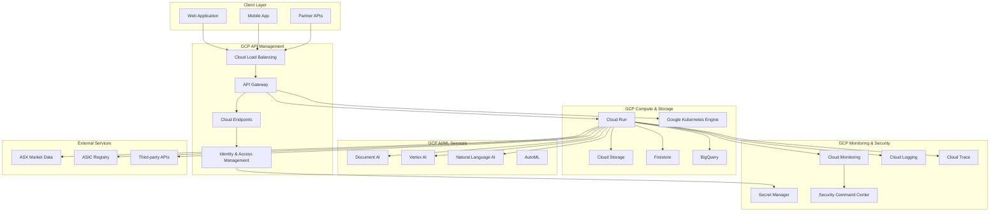

# GCP API Services Integration

## Executive Summary

This document outlines the comprehensive integration strategy for Google Cloud Platform (GCP) services within the UpRez IPO Valuation Platform. The integration leverages GCP's API Gateway, Cloud Endpoints, Identity and Access Management (IAM), monitoring services, and AI/ML capabilities to create a scalable, secure, and observable API infrastructure.

## GCP Services Architecture



## 1. API Gateway Configuration

### 1.1 Cloud Load Balancer Setup

```yaml
# gcp-load-balancer.yaml
apiVersion: networking.gke.io/v1
kind: ManagedCertificate
metadata:
  name: uprez-ssl-cert
spec:
  domains:
    - api.uprez.com
    - api-staging.uprez.com
---
apiVersion: v1
kind: Service
metadata:
  name: uprez-api-service
  annotations:
    cloud.google.com/load-balancer-type: "External"
    networking.gke.io/managed-certificates: uprez-ssl-cert
spec:
  type: LoadBalancer
  ports:
  - port: 443
    targetPort: 8080
    protocol: TCP
    name: https
  - port: 80
    targetPort: 8080
    protocol: TCP
    name: http
  selector:
    app: uprez-api
```

### 1.2 API Gateway Configuration

```yaml
# api-gateway-config.yaml
swagger: "2.0"
info:
  title: UpRez IPO Valuation API Gateway
  version: "1.0.0"
  description: API Gateway configuration for UpRez platform
host: api.uprez.com
schemes:
  - https
  - http

securityDefinitions:
  api_key:
    type: apiKey
    name: X-API-Key
    in: header
  oauth2:
    type: oauth2
    authorizationUrl: https://auth.uprez.com/oauth/authorize
    flow: accessCode
    scopes:
      read: Read access
      write: Write access
      admin: Administrative access

x-google-management:
  metrics:
    - name: requests_per_minute
      displayName: "Requests per minute"
      valueType: INT64
      metricKind: GAUGE
    - name: error_rate
      displayName: "Error rate"
      valueType: DOUBLE
      metricKind: GAUGE
  quota:
    limits:
      - name: "requests-per-minute"
        metric: requests_per_minute
        values:
          STANDARD: 100
          PREMIUM: 500
          ENTERPRISE: 2000

paths:
  /v1/valuations:
    post:
      operationId: createValuation
      security:
        - oauth2: [write]
        - api_key: []
      x-google-backend:
        address: https://uprez-valuation-service-xyz.a.run.app
        protocol: h2
      parameters:
        - name: body
          in: body
          required: true
          schema:
            $ref: '#/definitions/ValuationRequest'
      responses:
        200:
          description: Success
        400:
          description: Bad Request
        401:
          description: Unauthorized
        429:
          description: Too Many Requests
          headers:
            Retry-After:
              type: integer
              description: Seconds to wait before retrying
    get:
      operationId: listValuations
      security:
        - oauth2: [read]
        - api_key: []
      x-google-backend:
        address: https://uprez-valuation-service-xyz.a.run.app
        protocol: h2
      parameters:
        - name: page
          in: query
          type: integer
          default: 1
        - name: limit
          in: query
          type: integer
          default: 20
          maximum: 100
      responses:
        200:
          description: Success

  /v1/documents/upload:
    post:
      operationId: uploadDocument
      security:
        - oauth2: [write]
        - api_key: []
      x-google-backend:
        address: https://uprez-document-service-xyz.a.run.app
        protocol: h2
      consumes:
        - multipart/form-data
      parameters:
        - name: file
          in: formData
          type: file
          required: true
        - name: document_type
          in: formData
          type: string
          required: true
      responses:
        201:
          description: Created
        400:
          description: Bad Request
        413:
          description: Payload Too Large

  /v1/market-data/{ticker}:
    get:
      operationId: getMarketData
      security:
        - oauth2: [read]
        - api_key: []
      x-google-backend:
        address: https://uprez-market-data-service-xyz.a.run.app
        protocol: h2
        path_translation: APPEND_PATH_TO_ADDRESS
      parameters:
        - name: ticker
          in: path
          type: string
          required: true
          pattern: "^[A-Z]{3,4}$"
        - name: include_historical
          in: query
          type: boolean
          default: false
      responses:
        200:
          description: Success
        404:
          description: Not Found

definitions:
  ValuationRequest:
    type: object
    required:
      - company_name
      - industry_sector
      - expected_ipo_date
    properties:
      company_name:
        type: string
        maxLength: 200
      industry_sector:
        type: string
        enum: ["Technology", "Healthcare", "Finance"]
      expected_ipo_date:
        type: string
        format: date
      shares_on_issue:
        type: integer
        minimum: 1
```

### 1.3 API Gateway Deployment Script

```python
import asyncio
import yaml
from google.cloud import apigateway_v1
from google.oauth2 import service_account
from typing import Dict, Any

class GCPAPIGatewayManager:
    """Manages GCP API Gateway deployment and configuration"""
    
    def __init__(self, project_id: str, location: str, credentials_path: str):
        self.project_id = project_id
        self.location = location
        
        # Initialize clients
        credentials = service_account.Credentials.from_service_account_file(credentials_path)
        self.gateway_client = apigateway_v1.ApiGatewayServiceClient(credentials=credentials)
        self.config_client = apigateway_v1.ApiGatewayServiceClient(credentials=credentials)
        
        self.parent = f"projects/{project_id}/locations/{location}"
    
    async def deploy_api_config(self, config_file_path: str, api_id: str) -> str:
        """Deploy API configuration to Cloud API Gateway"""
        
        # Read configuration file
        with open(config_file_path, 'r') as f:
            config_content = f.read()
        
        # Create API if it doesn't exist
        await self._ensure_api_exists(api_id)
        
        # Create API config
        config_id = f"{api_id}-config-v{int(asyncio.get_event_loop().time())}"
        
        api_config = apigateway_v1.ApiConfig(
            display_name=f"Configuration for {api_id}",
            openapi_documents=[
                apigateway_v1.ApiConfig.OpenApiDocument(
                    document=apigateway_v1.ApiConfig.File(
                        contents=config_content.encode(),
                        path="openapi.yaml"
                    )
                )
            ]
        )
        
        request = apigateway_v1.CreateApiConfigRequest(
            parent=f"{self.parent}/apis/{api_id}",
            api_config_id=config_id,
            api_config=api_config
        )
        
        operation = self.config_client.create_api_config(request=request)
        result = operation.result()
        
        print(f"Created API config: {result.name}")
        return config_id
    
    async def deploy_gateway(self, api_id: str, config_id: str, gateway_id: str) -> str:
        """Deploy API Gateway"""
        
        gateway = apigateway_v1.Gateway(
            display_name=f"Gateway for {api_id}",
            api_config=f"{self.parent}/apis/{api_id}/configs/{config_id}"
        )
        
        request = apigateway_v1.CreateGatewayRequest(
            parent=self.parent,
            gateway_id=gateway_id,
            gateway=gateway
        )
        
        operation = self.gateway_client.create_gateway(request=request)
        result = operation.result()
        
        print(f"Created gateway: {result.name}")
        print(f"Gateway URL: {result.default_hostname}")
        
        return result.default_hostname
    
    async def _ensure_api_exists(self, api_id: str):
        """Ensure API exists, create if it doesn't"""
        
        try:
            self.gateway_client.get_api(name=f"{self.parent}/apis/{api_id}")
            print(f"API {api_id} already exists")
        except Exception:
            # API doesn't exist, create it
            api = apigateway_v1.Api(
                display_name=f"UpRez {api_id.title()} API"
            )
            
            request = apigateway_v1.CreateApiRequest(
                parent=self.parent,
                api_id=api_id,
                api=api
            )
            
            operation = self.gateway_client.create_api(request=request)
            result = operation.result()
            
            print(f"Created API: {result.name}")

# Usage
async def deploy_api_gateway():
    manager = GCPAPIGatewayManager(
        project_id="uprez-valuation-platform",
        location="us-central1",
        credentials_path="/path/to/service-account.json"
    )
    
    # Deploy API configuration
    config_id = await manager.deploy_api_config(
        config_file_path="api-gateway-config.yaml",
        api_id="uprez-valuation-api"
    )
    
    # Deploy gateway
    gateway_url = await manager.deploy_gateway(
        api_id="uprez-valuation-api",
        config_id=config_id,
        gateway_id="uprez-gateway"
    )
    
    print(f"API Gateway deployed at: {gateway_url}")
```

## 2. Cloud Endpoints Integration

### 2.1 Endpoints Configuration

```yaml
# endpoints-config.yaml
swagger: "2.0"
info:
  title: UpRez Valuation Endpoints
  version: "1.0.0"
host: uprez-valuation-service-xyz.a.run.app
x-google-endpoints:
  - name: uprez-valuation-service-xyz.a.run.app
    allowCors: true

x-google-management:
  metrics:
    - name: "requests_per_second"
      displayName: "Requests per second"
      valueType: INT64
      metricKind: GAUGE
    - name: "request_latency"
      displayName: "Request latency"
      valueType: DISTRIBUTION
      metricKind: DELTA
  quota:
    limits:
      - name: "requests-per-minute-per-user"
        metric: requests_per_second
        unit: "1/min/{project}"
        values:
          STANDARD: 100
          PREMIUM: 500
          ENTERPRISE: 2000
  authentication:
    providers:
      - id: uprez_auth
        issuer: https://auth.uprez.com
        jwks_uri: https://auth.uprez.com/.well-known/jwks.json
        audiences: "uprez-api"
    rules:
      - selector: "*"
        requirements:
          - provider_id: uprez_auth
            audiences: "uprez-api"

security:
  - uprez_oauth: []

securityDefinitions:
  uprez_oauth:
    type: oauth2
    authorizationUrl: https://auth.uprez.com/oauth/authorize
    flow: accessCode
    x-google-issuer: https://auth.uprez.com
    x-google-jwks_uri: https://auth.uprez.com/.well-known/jwks.json
    x-google-audiences: "uprez-api"

paths:
  /health:
    get:
      operationId: healthCheck
      security: []  # No auth required for health check
      responses:
        200:
          description: Service is healthy
  
  /v1/valuations:
    post:
      operationId: createValuation
      security:
        - uprez_oauth: []
      x-google-quota:
        name: requests-per-minute-per-user
        cost: 10  # Higher cost for valuation creation
      responses:
        201:
          description: Created
    get:
      operationId: listValuations
      security:
        - uprez_oauth: []
      x-google-quota:
        name: requests-per-minute-per-user
        cost: 1
      responses:
        200:
          description: Success
```

### 2.2 Endpoints Deployment

```python
from google.cloud import servicemanagement_v1
from google.cloud import serviceusage_v1
import yaml
import time

class CloudEndpointsManager:
    """Manages Google Cloud Endpoints deployment"""
    
    def __init__(self, project_id: str, credentials_path: str):
        self.project_id = project_id
        
        credentials = service_account.Credentials.from_service_account_file(credentials_path)
        self.service_management_client = servicemanagement_v1.ServiceManagerClient(credentials=credentials)
        self.service_usage_client = serviceusage_v1.ServiceUsageClient(credentials=credentials)
    
    async def deploy_endpoints_config(self, config_file_path: str) -> str:
        """Deploy Cloud Endpoints configuration"""
        
        # Read configuration
        with open(config_file_path, 'r') as f:
            config_content = f.read()
        
        config_dict = yaml.safe_load(config_content)
        service_name = config_dict['host']
        
        # Create configuration source
        config_source = servicemanagement_v1.ConfigSource(
            files=[
                servicemanagement_v1.ConfigFile(
                    file_path="openapi.yaml",
                    file_contents=config_content.encode()
                )
            ]
        )
        
        # Submit configuration
        request = servicemanagement_v1.SubmitConfigSourceRequest(
            service_name=service_name,
            config_source=config_source
        )
        
        operation = self.service_management_client.submit_config_source(request=request)
        result = operation.result()
        
        config_id = result.service_config.id
        print(f"Configuration submitted: {config_id}")
        
        # Create rollout
        rollout = servicemanagement_v1.Rollout(
            service_name=service_name,
            traffic_percent_strategy=servicemanagement_v1.Rollout.TrafficPercentStrategy(
                percentages={config_id: 100.0}
            )
        )
        
        rollout_request = servicemanagement_v1.CreateServiceRolloutRequest(
            service_name=service_name,
            rollout=rollout
        )
        
        rollout_operation = self.service_management_client.create_service_rollout(request=rollout_request)
        rollout_result = rollout_operation.result()
        
        print(f"Rollout created: {rollout_result.rollout_id}")
        
        return service_name
    
    async def enable_endpoints_service(self, service_name: str):
        """Enable Cloud Endpoints service for the project"""
        
        request = serviceusage_v1.EnableServiceRequest(
            name=f"projects/{self.project_id}/services/{service_name}"
        )
        
        operation = self.service_usage_client.enable_service(request=request)
        operation.result()
        
        print(f"Enabled service: {service_name}")
```

## 3. Identity and Access Management (IAM)

### 3.1 IAM Roles and Policies

```python
from google.cloud import iam
from google.oauth2 import service_account
from typing import List, Dict, Any

class GCPIAMManager:
    """Manages IAM roles and policies for the UpRez platform"""
    
    def __init__(self, project_id: str, credentials_path: str):
        self.project_id = project_id
        
        credentials = service_account.Credentials.from_service_account_file(credentials_path)
        self.iam_client = iam.IAMCredentialsClient(credentials=credentials)
    
    def create_custom_roles(self):
        """Create custom IAM roles for the UpRez platform"""
        
        custom_roles = {
            'uprez.valuationAnalyst': {
                'title': 'UpRez Valuation Analyst',
                'description': 'Can create and view valuations, upload documents',
                'permissions': [
                    'uprez.valuations.create',
                    'uprez.valuations.get',
                    'uprez.valuations.list',
                    'uprez.documents.upload',
                    'uprez.documents.get',
                    'uprez.marketData.get'
                ]
            },
            'uprez.seniorAnalyst': {
                'title': 'UpRez Senior Analyst',
                'description': 'Full valuation access plus analytics and exports',
                'permissions': [
                    'uprez.valuations.*',
                    'uprez.documents.*',
                    'uprez.marketData.*',
                    'uprez.analytics.get',
                    'uprez.reports.generate',
                    'uprez.reports.export'
                ]
            },
            'uprez.systemAdmin': {
                'title': 'UpRez System Administrator',
                'description': 'Full system access including user management',
                'permissions': [
                    'uprez.*',
                    'uprez.users.manage',
                    'uprez.system.configure'
                ]
            }
        }
        
        return custom_roles
    
    async def setup_service_accounts(self):
        """Set up service accounts for different components"""
        
        service_accounts = {
            'uprez-valuation-service': {
                'display_name': 'UpRez Valuation Service',
                'description': 'Service account for valuation processing',
                'roles': [
                    'roles/cloudsql.client',
                    'roles/storage.objectViewer',
                    'roles/bigquery.dataViewer',
                    'roles/aiplatform.user'
                ]
            },
            'uprez-document-service': {
                'display_name': 'UpRez Document Service',
                'description': 'Service account for document processing',
                'roles': [
                    'roles/documentai.apiUser',
                    'roles/storage.objectAdmin',
                    'roles/cloudsql.client'
                ]
            },
            'uprez-market-data-service': {
                'display_name': 'UpRez Market Data Service',
                'description': 'Service account for market data integration',
                'roles': [
                    'roles/cloudsql.client',
                    'roles/redis.editor',
                    'roles/pubsub.publisher'
                ]
            }
        }
        
        for account_id, config in service_accounts.items():
            await self._create_service_account(account_id, config)
    
    async def _create_service_account(self, account_id: str, config: Dict[str, Any]):
        """Create a service account with specified roles"""
        
        from google.cloud import iam_admin_v1
        
        # This would use the IAM Admin API to create service accounts
        # Implementation details would depend on your specific requirements
        
        print(f"Creating service account: {account_id}")
        print(f"Display name: {config['display_name']}")
        print(f"Roles: {config['roles']}")

# IAM Policy for Cloud Run Services
IAM_POLICY_TEMPLATE = {
    "bindings": [
        {
            "role": "roles/run.invoker",
            "members": [
                "serviceAccount:uprez-api-gateway@{project_id}.iam.gserviceaccount.com"
            ]
        },
        {
            "role": "roles/cloudsql.client",
            "members": [
                "serviceAccount:uprez-valuation-service@{project_id}.iam.gserviceaccount.com",
                "serviceAccount:uprez-document-service@{project_id}.iam.gserviceaccount.com"
            ]
        },
        {
            "role": "roles/storage.objectAdmin",
            "members": [
                "serviceAccount:uprez-document-service@{project_id}.iam.gserviceaccount.com"
            ]
        }
    ]
}
```

### 3.2 API Authentication Integration

```python
import jwt
from google.auth.transport import requests
from google.oauth2 import id_token
from typing import Optional, Dict, Any
import asyncio

class GCPAuthenticationManager:
    """Handles GCP-integrated authentication for the UpRez platform"""
    
    def __init__(self, project_id: str):
        self.project_id = project_id
        self.google_auth_request = requests.Request()
    
    async def verify_google_jwt(self, token: str) -> Optional[Dict[str, Any]]:
        """Verify Google-issued JWT token"""
        
        try:
            # Verify token using Google's ID token verification
            id_info = id_token.verify_token(token, self.google_auth_request)
            
            # Verify audience (your project's client ID)
            if id_info['aud'] != f"{self.project_id}.apps.googleusercontent.com":
                raise ValueError('Invalid audience')
            
            return id_info
            
        except ValueError as e:
            print(f"Token verification failed: {e}")
            return None
    
    async def verify_custom_jwt(self, token: str, jwks_uri: str) -> Optional[Dict[str, Any]]:
        """Verify custom JWT token using JWKS"""
        
        try:
            # Fetch JWKS
            import aiohttp
            async with aiohttp.ClientSession() as session:
                async with session.get(jwks_uri) as response:
                    if response.status == 200:
                        jwks_data = await response.json()
                    else:
                        raise Exception("Failed to fetch JWKS")
            
            # Decode token header to get key ID
            unverified_header = jwt.get_unverified_header(token)
            kid = unverified_header.get('kid')
            
            # Find matching key
            public_key = None
            for key in jwks_data.get('keys', []):
                if key.get('kid') == kid:
                    public_key = jwt.algorithms.RSAAlgorithm.from_jwk(key)
                    break
            
            if not public_key:
                raise ValueError('Public key not found')
            
            # Verify and decode token
            decoded_token = jwt.decode(
                token,
                public_key,
                algorithms=['RS256'],
                options={'verify_aud': False}  # Audience verification handled elsewhere
            )
            
            return decoded_token
            
        except Exception as e:
            print(f"Custom JWT verification failed: {e}")
            return None

class GCPAuthMiddleware:
    """FastAPI middleware for GCP authentication"""
    
    def __init__(self, auth_manager: GCPAuthenticationManager):
        self.auth_manager = auth_manager
    
    async def __call__(self, request, call_next):
        from fastapi import HTTPException
        
        # Skip authentication for health checks and public endpoints
        if request.url.path in ['/health', '/metrics', '/docs']:
            return await call_next(request)
        
        # Extract token from Authorization header
        auth_header = request.headers.get('Authorization')
        
        if not auth_header or not auth_header.startswith('Bearer '):
            raise HTTPException(status_code=401, detail="Authorization header required")
        
        token = auth_header.split(' ')[1]
        
        # Verify token
        user_info = await self.auth_manager.verify_custom_jwt(
            token, 
            "https://auth.uprez.com/.well-known/jwks.json"
        )
        
        if not user_info:
            raise HTTPException(status_code=401, detail="Invalid token")
        
        # Add user info to request state
        request.state.user = user_info
        
        response = await call_next(request)
        return response
```

## 4. Cloud Monitoring Integration

### 4.1 Monitoring Configuration

```python
from google.cloud import monitoring_v3
from google.cloud.monitoring_v3 import AlertPolicy, NotificationChannel
from google.protobuf.duration_pb2 import Duration
import time

class GCPMonitoringManager:
    """Manages Cloud Monitoring for the UpRez platform"""
    
    def __init__(self, project_id: str, credentials_path: str):
        self.project_id = project_id
        self.project_name = f"projects/{project_id}"
        
        credentials = service_account.Credentials.from_service_account_file(credentials_path)
        self.client = monitoring_v3.MetricServiceClient(credentials=credentials)
        self.alert_client = monitoring_v3.AlertPolicyServiceClient(credentials=credentials)
        self.notification_client = monitoring_v3.NotificationChannelServiceClient(credentials=credentials)
    
    async def create_custom_metrics(self):
        """Create custom metrics for UpRez platform"""
        
        custom_metrics = {
            'valuation_processing_time': {
                'type': 'custom.googleapis.com/uprez/valuation_processing_time',
                'labels': [
                    {'key': 'valuation_type', 'value_type': 'STRING'},
                    {'key': 'user_tier', 'value_type': 'STRING'},
                ],
                'metric_kind': 'GAUGE',
                'value_type': 'DOUBLE',
                'description': 'Time taken to process a valuation request'
            },
            'api_requests_by_endpoint': {
                'type': 'custom.googleapis.com/uprez/api_requests_by_endpoint',
                'labels': [
                    {'key': 'endpoint', 'value_type': 'STRING'},
                    {'key': 'method', 'value_type': 'STRING'},
                    {'key': 'status_code', 'value_type': 'STRING'},
                ],
                'metric_kind': 'COUNTER',
                'value_type': 'INT64',
                'description': 'Number of API requests by endpoint'
            },
            'external_api_latency': {
                'type': 'custom.googleapis.com/uprez/external_api_latency',
                'labels': [
                    {'key': 'api_provider', 'value_type': 'STRING'},
                    {'key': 'endpoint', 'value_type': 'STRING'},
                ],
                'metric_kind': 'GAUGE',
                'value_type': 'DOUBLE',
                'description': 'Latency of external API calls'
            }
        }
        
        for metric_name, config in custom_metrics.items():
            await self._create_metric_descriptor(metric_name, config)
    
    async def _create_metric_descriptor(self, metric_name: str, config: Dict[str, Any]):
        """Create a custom metric descriptor"""
        
        descriptor = monitoring_v3.MetricDescriptor(
            type=config['type'],
            metric_kind=getattr(monitoring_v3.MetricDescriptor.MetricKind, config['metric_kind']),
            value_type=getattr(monitoring_v3.MetricDescriptor.ValueType, config['value_type']),
            description=config['description'],
            labels=[
                monitoring_v3.LabelDescriptor(
                    key=label['key'],
                    value_type=getattr(monitoring_v3.LabelDescriptor.ValueType, label['value_type'])
                )
                for label in config['labels']
            ]
        )
        
        request = monitoring_v3.CreateMetricDescriptorRequest(
            name=self.project_name,
            metric_descriptor=descriptor
        )
        
        try:
            result = self.client.create_metric_descriptor(request=request)
            print(f"Created metric descriptor: {result.type}")
        except Exception as e:
            if "already exists" not in str(e):
                print(f"Failed to create metric {metric_name}: {e}")
    
    async def setup_alert_policies(self):
        """Set up alert policies for the platform"""
        
        # Create notification channel first
        notification_channel = await self._create_email_notification_channel(
            "admin@uprez.com", 
            "UpRez Admin Alerts"
        )
        
        alert_policies = {
            'high_error_rate': {
                'display_name': 'High API Error Rate',
                'condition': {
                    'filter': 'resource.type="cloud_run_revision" AND metric.type="run.googleapis.com/request_count"',
                    'comparison': 'COMPARISON_GREATER_THAN',
                    'threshold': 0.05,  # 5% error rate
                    'duration': 300  # 5 minutes
                },
                'notification_channels': [notification_channel]
            },
            'high_latency': {
                'display_name': 'High API Latency',
                'condition': {
                    'filter': 'resource.type="cloud_run_revision" AND metric.type="run.googleapis.com/request_latencies"',
                    'comparison': 'COMPARISON_GREATER_THAN',
                    'threshold': 5000,  # 5 seconds
                    'duration': 300
                },
                'notification_channels': [notification_channel]
            },
            'external_api_failures': {
                'display_name': 'External API Failures',
                'condition': {
                    'filter': 'metric.type="custom.googleapis.com/uprez/external_api_latency" AND metric.label.api_provider="asx"',
                    'comparison': 'COMPARISON_GREATER_THAN',
                    'threshold': 10000,  # 10 seconds
                    'duration': 180
                },
                'notification_channels': [notification_channel]
            }
        }
        
        for policy_name, config in alert_policies.items():
            await self._create_alert_policy(policy_name, config)
    
    async def _create_email_notification_channel(self, email: str, display_name: str) -> str:
        """Create email notification channel"""
        
        channel = NotificationChannel(
            type_="email",
            display_name=display_name,
            labels={"email_address": email},
            enabled=True
        )
        
        request = monitoring_v3.CreateNotificationChannelRequest(
            name=self.project_name,
            notification_channel=channel
        )
        
        result = self.notification_client.create_notification_channel(request=request)
        return result.name
    
    async def write_custom_metric(self, 
                                 metric_type: str, 
                                 value: float, 
                                 labels: Dict[str, str] = None):
        """Write a data point to a custom metric"""
        
        series = monitoring_v3.TimeSeries(
            metric=monitoring_v3.Metric(
                type=metric_type,
                labels=labels or {}
            ),
            resource=monitoring_v3.MonitoredResource(
                type="global"
            ),
            points=[
                monitoring_v3.Point(
                    interval=monitoring_v3.TimeInterval(
                        end_time={"seconds": int(time.time())}
                    ),
                    value=monitoring_v3.TypedValue(double_value=value)
                )
            ]
        )
        
        request = monitoring_v3.CreateTimeSeriesRequest(
            name=self.project_name,
            time_series=[series]
        )
        
        self.client.create_time_series(request=request)

# FastAPI integration for metrics
class MetricsMiddleware:
    """Middleware to collect and send metrics to GCP Monitoring"""
    
    def __init__(self, monitoring_manager: GCPMonitoringManager):
        self.monitoring_manager = monitoring_manager
    
    async def __call__(self, request, call_next):
        import time
        
        start_time = time.time()
        
        response = await call_next(request)
        
        # Calculate processing time
        processing_time = time.time() - start_time
        
        # Send metrics
        await self.monitoring_manager.write_custom_metric(
            metric_type="custom.googleapis.com/uprez/api_requests_by_endpoint",
            value=1,
            labels={
                'endpoint': request.url.path,
                'method': request.method,
                'status_code': str(response.status_code)
            }
        )
        
        if request.url.path.startswith('/v1/valuations') and request.method == 'POST':
            await self.monitoring_manager.write_custom_metric(
                metric_type="custom.googleapis.com/uprez/valuation_processing_time",
                value=processing_time,
                labels={
                    'valuation_type': request.json().get('analysis_type', 'basic') if hasattr(request, 'json') else 'unknown',
                    'user_tier': getattr(request.state, 'user', {}).get('subscription_tier', 'basic')
                }
            )
        
        return response
```

## 5. Cloud Trace Integration

### 5.1 Distributed Tracing Setup

```python
from google.cloud import trace_v1
from opentelemetry import trace
from opentelemetry.exporter.cloud_trace import CloudTraceSpanExporter
from opentelemetry.sdk.trace import TracerProvider
from opentelemetry.sdk.trace.export import BatchSpanProcessor
from opentelemetry.instrumentation.fastapi import FastAPIInstrumentor
from opentelemetry.instrumentation.requests import RequestsInstrumentor
from opentelemetry.instrumentation.sqlalchemy import SQLAlchemyInstrumentor
import asyncio

class GCPTracingManager:
    """Manages distributed tracing with Google Cloud Trace"""
    
    def __init__(self, project_id: str, service_name: str):
        self.project_id = project_id
        self.service_name = service_name
        
        # Set up OpenTelemetry
        trace.set_tracer_provider(TracerProvider())
        
        # Create Cloud Trace exporter
        cloud_trace_exporter = CloudTraceSpanExporter(project_id=project_id)
        
        # Add span processor
        span_processor = BatchSpanProcessor(cloud_trace_exporter)
        trace.get_tracer_provider().add_span_processor(span_processor)
        
        self.tracer = trace.get_tracer(__name__)
    
    def instrument_fastapi_app(self, app):
        """Instrument FastAPI app for tracing"""
        
        # Instrument FastAPI
        FastAPIInstrumentor.instrument_app(app, tracer_provider=trace.get_tracer_provider())
        
        # Instrument HTTP requests
        RequestsInstrumentor().instrument()
        
        # Instrument SQLAlchemy (if used)
        SQLAlchemyInstrumentor().instrument()
    
    async def trace_external_api_call(self, api_name: str, operation: str, func, *args, **kwargs):
        """Trace external API calls with custom spans"""
        
        with self.tracer.start_as_current_span(f"{api_name}_{operation}") as span:
            span.set_attribute("api.provider", api_name)
            span.set_attribute("api.operation", operation)
            span.set_attribute("service.name", self.service_name)
            
            try:
                start_time = time.time()
                result = await func(*args, **kwargs)
                
                # Record success metrics
                duration = time.time() - start_time
                span.set_attribute("api.duration_ms", int(duration * 1000))
                span.set_attribute("api.success", True)
                
                return result
                
            except Exception as e:
                # Record error information
                span.set_attribute("api.success", False)
                span.set_attribute("api.error", str(e))
                span.record_exception(e)
                span.set_status(trace.Status(trace.StatusCode.ERROR, str(e)))
                
                raise
    
    async def trace_valuation_processing(self, valuation_request: Dict[str, Any], processing_func):
        """Trace complete valuation processing with detailed spans"""
        
        with self.tracer.start_as_current_span("valuation_processing") as main_span:
            main_span.set_attribute("valuation.company_name", valuation_request.get('company_name', ''))
            main_span.set_attribute("valuation.analysis_type", valuation_request.get('analysis_type', 'basic'))
            main_span.set_attribute("valuation.user_id", valuation_request.get('user_id', ''))
            
            # Create child spans for different processing stages
            stages = [
                "input_validation",
                "market_data_collection", 
                "peer_analysis",
                "financial_modeling",
                "risk_assessment",
                "result_generation"
            ]
            
            try:
                result = await processing_func(valuation_request, self._create_stage_tracer(stages))
                
                main_span.set_attribute("valuation.success", True)
                main_span.set_attribute("valuation.target_price", result.get('target_price', 0))
                
                return result
                
            except Exception as e:
                main_span.set_attribute("valuation.success", False)
                main_span.set_attribute("valuation.error", str(e))
                main_span.record_exception(e)
                main_span.set_status(trace.Status(trace.StatusCode.ERROR, str(e)))
                
                raise
    
    def _create_stage_tracer(self, stages: List[str]):
        """Create a stage tracer for valuation processing"""
        
        async def stage_tracer(stage_name: str, stage_func, *args, **kwargs):
            if stage_name not in stages:
                return await stage_func(*args, **kwargs)
            
            with self.tracer.start_as_current_span(f"valuation_{stage_name}") as span:
                span.set_attribute("stage.name", stage_name)
                
                try:
                    start_time = time.time()
                    result = await stage_func(*args, **kwargs)
                    
                    duration = time.time() - start_time
                    span.set_attribute("stage.duration_ms", int(duration * 1000))
                    span.set_attribute("stage.success", True)
                    
                    return result
                    
                except Exception as e:
                    span.set_attribute("stage.success", False)
                    span.set_attribute("stage.error", str(e))
                    span.record_exception(e)
                    span.set_status(trace.Status(trace.StatusCode.ERROR, str(e)))
                    
                    raise
        
        return stage_tracer

# Usage in FastAPI application
from fastapi import FastAPI

def create_app():
    app = FastAPI(title="UpRez Valuation API")
    
    # Initialize tracing
    tracing_manager = GCPTracingManager(
        project_id="uprez-valuation-platform",
        service_name="uprez-valuation-api"
    )
    
    # Instrument the app
    tracing_manager.instrument_fastapi_app(app)
    
    return app, tracing_manager
```

## 6. Secret Manager Integration

### 6.1 Secure Configuration Management

```python
from google.cloud import secretmanager
from google.oauth2 import service_account
from typing import Dict, Any, Optional
import json
import asyncio

class GCPSecretManager:
    """Manages secrets using Google Cloud Secret Manager"""
    
    def __init__(self, project_id: str, credentials_path: str = None):
        self.project_id = project_id
        
        if credentials_path:
            credentials = service_account.Credentials.from_service_account_file(credentials_path)
            self.client = secretmanager.SecretManagerServiceClient(credentials=credentials)
        else:
            # Use default credentials (for Cloud Run, etc.)
            self.client = secretmanager.SecretManagerServiceClient()
    
    async def get_secret(self, secret_id: str, version: str = "latest") -> Optional[str]:
        """Get secret value from Secret Manager"""
        
        name = f"projects/{self.project_id}/secrets/{secret_id}/versions/{version}"
        
        try:
            response = self.client.access_secret_version(request={"name": name})
            secret_value = response.payload.data.decode("UTF-8")
            return secret_value
        except Exception as e:
            print(f"Failed to get secret {secret_id}: {e}")
            return None
    
    async def create_secret(self, secret_id: str, secret_value: str) -> bool:
        """Create a new secret in Secret Manager"""
        
        parent = f"projects/{self.project_id}"
        
        try:
            # Create the secret
            secret = secretmanager.Secret(
                replication=secretmanager.Replication(
                    automatic=secretmanager.Replication.Automatic()
                )
            )
            
            create_secret_request = secretmanager.CreateSecretRequest(
                parent=parent,
                secret_id=secret_id,
                secret=secret
            )
            
            self.client.create_secret(request=create_secret_request)
            
            # Add secret version
            add_version_request = secretmanager.AddSecretVersionRequest(
                parent=f"{parent}/secrets/{secret_id}",
                payload=secretmanager.SecretPayload(data=secret_value.encode("UTF-8"))
            )
            
            self.client.add_secret_version(request=add_version_request)
            
            print(f"Created secret: {secret_id}")
            return True
            
        except Exception as e:
            print(f"Failed to create secret {secret_id}: {e}")
            return False
    
    async def update_secret(self, secret_id: str, secret_value: str) -> bool:
        """Update an existing secret with a new version"""
        
        parent = f"projects/{self.project_id}/secrets/{secret_id}"
        
        try:
            add_version_request = secretmanager.AddSecretVersionRequest(
                parent=parent,
                payload=secretmanager.SecretPayload(data=secret_value.encode("UTF-8"))
            )
            
            self.client.add_secret_version(request=add_version_request)
            
            print(f"Updated secret: {secret_id}")
            return True
            
        except Exception as e:
            print(f"Failed to update secret {secret_id}: {e}")
            return False
    
    async def get_database_config(self) -> Dict[str, str]:
        """Get database configuration from secrets"""
        
        config = {}
        secret_mappings = {
            'db_host': 'database-host',
            'db_port': 'database-port',
            'db_name': 'database-name',
            'db_user': 'database-user',
            'db_password': 'database-password'
        }
        
        for config_key, secret_id in secret_mappings.items():
            value = await self.get_secret(secret_id)
            if value:
                config[config_key] = value
        
        return config
    
    async def get_api_credentials(self) -> Dict[str, str]:
        """Get external API credentials from secrets"""
        
        credentials = {}
        secret_mappings = {
            'asx_api_key': 'asx-api-key',
            'asx_api_secret': 'asx-api-secret',
            'capital_iq_api_key': 'capital-iq-api-key',
            'oauth_client_secret': 'oauth-client-secret',
            'jwt_secret_key': 'jwt-secret-key'
        }
        
        for cred_key, secret_id in secret_mappings.items():
            value = await self.get_secret(secret_id)
            if value:
                credentials[cred_key] = value
        
        return credentials

# Configuration manager using Secret Manager
class ConfigManager:
    """Application configuration manager using GCP Secret Manager"""
    
    def __init__(self, project_id: str):
        self.secret_manager = GCPSecretManager(project_id)
        self._config_cache = {}
        self._cache_ttl = {}
    
    async def get_config(self, config_section: str) -> Dict[str, Any]:
        """Get configuration section with caching"""
        
        import time
        
        # Check cache first
        if config_section in self._config_cache:
            cache_time = self._cache_ttl.get(config_section, 0)
            if time.time() - cache_time < 300:  # 5 minute cache
                return self._config_cache[config_section]
        
        # Load from Secret Manager
        if config_section == 'database':
            config = await self.secret_manager.get_database_config()
        elif config_section == 'external_apis':
            config = await self.secret_manager.get_api_credentials()
        else:
            # Generic secret loading
            config_json = await self.secret_manager.get_secret(f"{config_section}-config")
            if config_json:
                config = json.loads(config_json)
            else:
                config = {}
        
        # Cache the config
        self._config_cache[config_section] = config
        self._cache_ttl[config_section] = time.time()
        
        return config
    
    async def initialize_secrets(self):
        """Initialize all required secrets for the platform"""
        
        secrets_to_create = {
            'database-host': 'localhost',
            'database-port': '5432',
            'database-name': 'uprez_valuation',
            'database-user': 'uprez_user',
            'database-password': 'secure_password_here',
            'asx-api-key': 'your_asx_api_key',
            'asx-api-secret': 'your_asx_api_secret',
            'capital-iq-api-key': 'your_capital_iq_key',
            'oauth-client-secret': 'your_oauth_secret',
            'jwt-secret-key': 'your_jwt_secret_key'
        }
        
        for secret_id, default_value in secrets_to_create.items():
            # Only create if it doesn't exist
            existing_value = await self.secret_manager.get_secret(secret_id)
            if not existing_value:
                await self.secret_manager.create_secret(secret_id, default_value)
                print(f"Please update the value for secret: {secret_id}")
```

This comprehensive GCP services integration provides:

1. **API Gateway** with Cloud Load Balancing and SSL termination
2. **Cloud Endpoints** for API management and security
3. **IAM integration** with custom roles and service accounts  
4. **Cloud Monitoring** with custom metrics and alerting
5. **Cloud Trace** for distributed tracing and performance monitoring
6. **Secret Manager** for secure configuration and credential management
7. **Scalable architecture** that leverages GCP's managed services
8. **Security best practices** with proper authentication and authorization

The integration ensures the API platform is production-ready, secure, and fully observable within the GCP ecosystem.