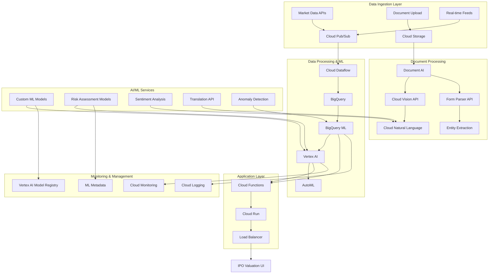

# GCP AI/ML Architecture for IPO Valuation Platform

## Architecture Overview

## Service Integration Patterns

### 1. Event-Driven Architecture
- **Pub/Sub Topics**: Market data, document events, model predictions
- **Cloud Functions**: Trigger-based processing
- **Eventarc**: Service-to-service communication

### 2. Microservices Architecture
- **Cloud Run**: Containerized ML services
- **Cloud Endpoints**: API management
- **Service Mesh**: Inter-service communication

### 3. Data Pipeline Architecture
- **Streaming**: Real-time market data processing
- **Batch**: Historical data analysis
- **Lambda**: Hybrid stream-batch processing

## Core Components

### Vertex AI Integration
- **Model Training**: Custom valuation models
- **Model Serving**: Real-time inference endpoints
- **Feature Store**: Centralized feature management
- **Pipelines**: MLOps workflows

### Document Processing Pipeline
- **Ingestion**: Multi-format document support
- **Extraction**: Structured data extraction
- **Classification**: Document type identification
- **Validation**: Data quality checks

### Risk Assessment Framework
- **Real-time Scoring**: Market risk evaluation
- **Compliance Monitoring**: Regulatory adherence
- **Anomaly Detection**: Unusual pattern identification
- **Sentiment Analysis**: Market sentiment tracking

## Scalability & Performance

### Auto-scaling Strategy
- **Horizontal Pod Autoscaler**: K8s-based scaling
- **Cloud Run**: Request-based scaling
- **Vertex AI**: Model serving scaling

### Caching Strategy
- **Redis**: Model predictions cache
- **Cloud CDN**: Static content caching
- **BigQuery BI Engine**: Query acceleration

### Performance Optimization
- **Model Compression**: TensorFlow Lite
- **Edge Deployment**: Cloud IoT Edge
- **Batch Prediction**: Offline inference