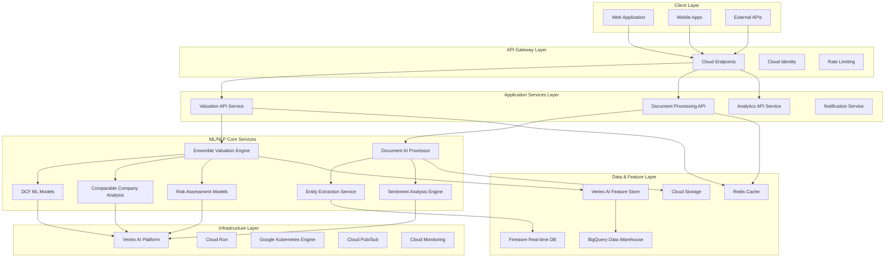
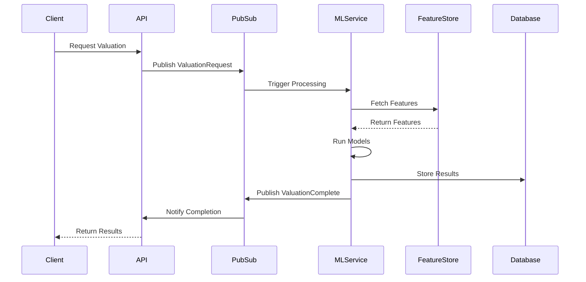

# ML/NLP System Architecture Overview

## Executive Summary

This document provides a comprehensive architectural overview of the Machine Learning and Natural Language Processing systems powering the IPO valuation platform. The architecture is designed for scalability, reliability, and real-time performance, leveraging Google Cloud Platform's AI/ML services.

## Architecture Principles

### Core Design Principles
1. **Microservices Architecture**: Decoupled, independently scalable services
2. **Event-Driven Design**: Asynchronous processing using Pub/Sub patterns
3. **Cloud-Native**: Fully leveraging GCP managed services
4. **MLOps-Enabled**: Continuous integration and deployment for ML models
5. **Data-Centric**: Feature stores and data pipelines as first-class citizens

### Quality Attributes
- **Scalability**: Auto-scaling from 1 to 10,000+ concurrent requests
- **Availability**: 99.9% uptime with multi-region deployment
- **Performance**: <500ms prediction latency, <2s document processing
- **Reliability**: Circuit breakers, retry policies, graceful degradation
- **Security**: End-to-end encryption, IAM-based access control

## High-Level System Architecture



## Component Architecture Details

### 1. Ensemble Valuation Engine
**Purpose**: Orchestrates multiple ML models to provide comprehensive valuation analysis

**Key Components**:
- **Model Registry**: Manages versions and configurations of all ML models
- **Weight Optimizer**: Dynamic weighting based on model performance and confidence
- **Uncertainty Quantifier**: Provides prediction intervals and confidence scores
- **Ensemble Validator**: Cross-validation and performance monitoring

**Technology Stack**:
- **Runtime**: Python 3.9+ on Cloud Run
- **ML Framework**: scikit-learn, TensorFlow, XGBoost
- **Orchestration**: Vertex AI Pipelines
- **Serving**: Vertex AI Prediction endpoints

### 2. Document Processing Pipeline
**Purpose**: Extracts structured data from unstructured financial documents

**Processing Stages**:
1. **Document Classification**: Identifies document types (prospectus, financial statements, etc.)
2. **Text Extraction**: OCR and text parsing using Document AI
3. **Entity Recognition**: Extracts financial metrics, dates, company names
4. **Sentiment Analysis**: Analyzes tone and sentiment in management discussions
5. **Risk Factor Identification**: Identifies and categorizes risk factors

**Technology Stack**:
- **Document AI**: Form Parser, OCR processor
- **NLP**: Cloud Natural Language API, custom BERT models
- **Storage**: Cloud Storage with intelligent tiering
- **Processing**: Cloud Functions for event-driven processing

### 3. Real-time Data Integration
**Purpose**: Ingests and processes market data in real-time

**Data Sources**:
- **Market Data APIs**: ASX, Reuters, Bloomberg feeds
- **News Feeds**: Financial news and analyst reports
- **Social Media**: Twitter, Reddit sentiment data
- **Regulatory Filings**: ASIC continuous disclosure notices

**Processing Architecture**:
- **Streaming**: Pub/Sub → Dataflow → BigQuery
- **Batch**: Cloud Composer orchestrated ETL pipelines
- **Real-time Features**: Stream processing with Apache Beam

## Service Integration Patterns

### Event-Driven Architecture


### Microservices Communication
- **Synchronous**: gRPC for internal service communication
- **Asynchronous**: Pub/Sub for event-driven workflows
- **API Gateway**: Cloud Endpoints for external API management
- **Service Mesh**: Istio for traffic management and security

## Data Flow Architecture

### Primary Data Flows

1. **Document Processing Flow**:
   ```
   Document Upload → Cloud Storage → Document AI → 
   Entity Extraction → Feature Engineering → Feature Store
   ```

2. **Market Data Flow**:
   ```
   External APIs → Pub/Sub → Dataflow → BigQuery → 
   Feature Engineering → Real-time Predictions
   ```

3. **Model Training Flow**:
   ```
   Feature Store → Vertex AI Pipelines → Model Training → 
   Model Evaluation → Model Registry → Deployment
   ```

4. **Prediction Flow**:
   ```
   API Request → Feature Retrieval → Model Ensemble → 
   Result Aggregation → Response Formatting → Client Response
   ```

## Technology Stack

### ML/AI Services
- **Vertex AI**: Model training, serving, and management
- **AutoML**: Automated model development for specific use cases
- **BigQuery ML**: In-database machine learning
- **Document AI**: Intelligent document processing
- **Cloud Natural Language**: Text analysis and sentiment

### Compute & Runtime
- **Cloud Run**: Serverless containers for ML services
- **Google Kubernetes Engine**: Container orchestration
- **Cloud Functions**: Event-driven processing
- **Compute Engine**: Custom ML workloads

### Data & Storage
- **BigQuery**: Data warehouse and analytics
- **Firestore**: Real-time database
- **Cloud Storage**: Object storage for models and data
- **Redis**: In-memory caching
- **Vertex AI Feature Store**: Centralized feature management

### Integration & Messaging
- **Cloud Pub/Sub**: Asynchronous messaging
- **Cloud Endpoints**: API management
- **Eventarc**: Event-driven service integration
- **Cloud Scheduler**: Cron job scheduling

### Monitoring & Operations
- **Cloud Monitoring**: Metrics and alerting
- **Cloud Logging**: Centralized logging
- **Error Reporting**: Error tracking and analysis
- **Vertex AI Model Monitoring**: ML model performance tracking

## Architecture Decision Records (ADRs)

### ADR-001: Choice of Ensemble Architecture
**Decision**: Implement ensemble model architecture with dynamic weighting

**Context**: Need to combine multiple valuation approaches (DCF, CCA, Risk Assessment) for robust predictions

**Rationale**:
- Reduces individual model bias
- Provides uncertainty quantification
- Allows for model-specific expertise
- Enables gradual model improvements

**Consequences**:
- Increased complexity in model management
- Higher computational requirements
- Better prediction accuracy and reliability
- Improved explainability through model contributions

### ADR-002: Cloud-Native ML Platform Choice
**Decision**: Use Vertex AI as primary ML platform

**Context**: Need managed ML platform for model development and serving

**Rationale**:
- Integrated with GCP ecosystem
- Managed infrastructure reduces operational overhead
- Built-in MLOps capabilities
- Support for multiple ML frameworks

**Consequences**:
- Vendor lock-in to Google Cloud
- Lower operational complexity
- Faster time to market
- Built-in compliance and security features

### ADR-003: Event-Driven Processing Architecture
**Decision**: Implement event-driven architecture using Pub/Sub

**Context**: Need to handle real-time data processing and model inference

**Rationale**:
- Decouples services for better scalability
- Enables asynchronous processing
- Supports event sourcing patterns
- Improves system resilience

**Consequences**:
- Eventual consistency considerations
- Increased monitoring complexity
- Better fault tolerance
- Improved system responsiveness

## Non-Functional Requirements

### Performance Requirements
- **API Response Time**: <500ms for cached predictions, <2s for new predictions
- **Document Processing**: <30s for prospectus analysis
- **Throughput**: 1,000+ concurrent prediction requests
- **Batch Processing**: Process 10,000+ documents per hour

### Scalability Requirements
- **Auto-scaling**: Scale from 0 to 100 instances based on demand
- **Geographic Distribution**: Multi-region deployment (Australia, US, EU)
- **Data Volume**: Handle 1TB+ of financial data
- **Concurrent Users**: Support 10,000+ simultaneous users

### Availability Requirements
- **Uptime**: 99.9% availability (8.77 hours downtime per year)
- **Disaster Recovery**: RPO <1 hour, RTO <4 hours
- **Failover**: Automatic failover to secondary regions
- **Circuit Breakers**: Graceful degradation during service failures

### Security Requirements
- **Data Encryption**: Encryption at rest and in transit
- **Access Control**: Role-based access control (RBAC)
- **Audit Logging**: Comprehensive audit trails
- **Compliance**: SOC 2, GDPR compliance

## Implementation Guidelines

### Development Standards
1. **Code Organization**: Follow domain-driven design principles
2. **API Design**: RESTful APIs with OpenAPI specifications
3. **Error Handling**: Structured error responses with proper HTTP status codes
4. **Logging**: Structured logging with correlation IDs
5. **Testing**: Minimum 80% test coverage for all services

### Deployment Patterns
1. **Blue-Green Deployment**: Zero-downtime deployments
2. **Canary Releases**: Gradual rollout of new model versions
3. **Feature Flags**: A/B testing for new ML features
4. **Infrastructure as Code**: Terraform for infrastructure management

### Monitoring Guidelines
1. **SLI/SLO Definition**: Clear service level objectives
2. **Dashboard Creation**: Real-time monitoring dashboards
3. **Alert Configuration**: Proactive alerting for system issues
4. **Performance Tracking**: Model performance metrics and drift detection

## Next Steps

1. **Detailed Component Design**: Create detailed designs for each service
2. **API Specifications**: Define comprehensive API contracts
3. **Data Schema Design**: Design database schemas and data models
4. **Security Architecture**: Detailed security implementation plan
5. **Deployment Strategy**: Production deployment and rollout plan

---

**Document Version**: 1.0
**Last Updated**: 2025-08-30
**Next Review**: 2025-09-30
**Reviewers**: ML Engineering Team, Platform Architecture Team