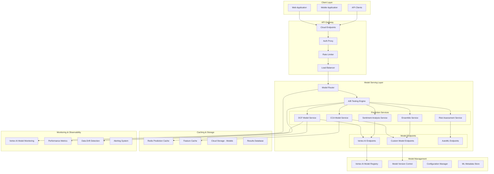

# Model Serving Architecture

## Overview

The Model Serving Architecture provides production-ready ML model deployment, versioning, and inference capabilities for the IPO valuation platform. This architecture supports multiple model types, A/B testing, auto-scaling, and comprehensive monitoring.

## Architecture Components

### 1. Model Serving Infrastructure



## Model Deployment Strategies

### 1. Container-Based Deployment

**Cloud Run Deployment**:
```yaml
apiVersion: serving.knative.dev/v1
kind: Service
metadata:
  name: dcf-model-service
  annotations:
    run.googleapis.com/cpu-throttling: "false"
    autoscaling.knative.dev/maxScale: "100"
    autoscaling.knative.dev/minScale: "1"
spec:
  template:
    metadata:
      annotations:
        autoscaling.knative.dev/maxScale: "100"
        run.googleapis.com/memory: "4Gi"
        run.googleapis.com/cpu: "2000m"
    spec:
      containers:
      - image: gcr.io/PROJECT_ID/dcf-model:latest
        ports:
        - containerPort: 8080
        env:
        - name: MODEL_VERSION
          value: "v1.2.3"
        - name: PREDICTION_TIMEOUT
          value: "30s"
        resources:
          requests:
            memory: "2Gi"
            cpu: "1000m"
          limits:
            memory: "4Gi"
            cpu: "2000m"
```

**Kubernetes Deployment**:
```yaml
apiVersion: apps/v1
kind: Deployment
metadata:
  name: ensemble-model-deployment
spec:
  replicas: 3
  selector:
    matchLabels:
      app: ensemble-model
  template:
    metadata:
      labels:
        app: ensemble-model
        version: v2.1.0
    spec:
      containers:
      - name: ensemble-service
        image: gcr.io/PROJECT_ID/ensemble-model:v2.1.0
        ports:
        - containerPort: 8080
        readinessProbe:
          httpGet:
            path: /health
            port: 8080
          initialDelaySeconds: 30
          periodSeconds: 10
        livenessProbe:
          httpGet:
            path: /health
            port: 8080
          initialDelaySeconds: 60
          periodSeconds: 30
        resources:
          requests:
            memory: "3Gi"
            cpu: "1500m"
          limits:
            memory: "6Gi"
            cpu: "3000m"
---
apiVersion: v1
kind: Service
metadata:
  name: ensemble-model-service
spec:
  selector:
    app: ensemble-model
  ports:
  - port: 80
    targetPort: 8080
  type: ClusterIP
```

### 2. Serverless Deployment

**Cloud Functions for Lightweight Models**:
```python
import functions_framework
import joblib
import numpy as np
from google.cloud import storage
from typing import Dict, Any

# Load model at cold start
model = None
scaler = None

def load_model():
    global model, scaler
    if model is None:
        client = storage.Client()
        bucket = client.bucket('ipo-valuation-models')
        
        # Download model artifacts
        model_blob = bucket.blob('risk_assessment/model.joblib')
        scaler_blob = bucket.blob('risk_assessment/scaler.joblib')
        
        model_data = model_blob.download_as_bytes()
        scaler_data = scaler_blob.download_as_bytes()
        
        model = joblib.loads(model_data)
        scaler = joblib.loads(scaler_data)

@functions_framework.http
def predict_risk_score(request):
    """HTTP Cloud Function for risk score prediction"""
    load_model()
    
    # Parse request
    request_json = request.get_json(silent=True)
    if not request_json:
        return {'error': 'Invalid request format'}, 400
    
    try:
        features = np.array(request_json['features']).reshape(1, -1)
        scaled_features = scaler.transform(features)
        prediction = model.predict(scaled_features)[0]
        probability = model.predict_proba(scaled_features)[0].max()
        
        return {
            'risk_score': float(prediction),
            'confidence': float(probability),
            'model_version': 'v1.0.2'
        }
    except Exception as e:
        return {'error': str(e)}, 500
```

### 3. Vertex AI Managed Endpoints

**Custom Prediction Container**:
```python
import os
import pickle
import numpy as np
from google.cloud import aiplatform
from google.cloud.aiplatform.prediction import Predictor
from typing import Dict, List, Any

class IPOValuationPredictor(Predictor):
    """Custom predictor for IPO valuation models"""
    
    def __init__(self):
        self.model = None
        self.feature_names = None
        
    def load(self, artifacts_uri: str) -> None:
        """Load model artifacts"""
        # Load model
        model_path = os.path.join(artifacts_uri, 'model.pkl')
        with open(model_path, 'rb') as f:
            self.model = pickle.load(f)
            
        # Load feature metadata
        features_path = os.path.join(artifacts_uri, 'features.json')
        with open(features_path, 'r') as f:
            import json
            self.feature_names = json.load(f)
    
    def predict(self, instances: List[Dict[str, Any]]) -> List[Dict[str, Any]]:
        """Make predictions"""
        predictions = []
        
        for instance in instances:
            # Extract features
            features = [instance.get(name, 0.0) for name in self.feature_names]
            X = np.array(features).reshape(1, -1)
            
            # Make prediction
            prediction = self.model.predict(X)[0]
            confidence = self.model.predict_proba(X)[0].max()
            
            predictions.append({
                'valuation': float(prediction),
                'confidence': float(confidence),
                'features_used': self.feature_names,
                'model_info': {
                    'version': os.getenv('MODEL_VERSION', 'unknown'),
                    'timestamp': os.getenv('DEPLOYMENT_TIME', 'unknown')
                }
            })
            
        return predictions

    def postprocess(self, predictions: List[Dict[str, Any]]) -> List[Dict[str, Any]]:
        """Post-process predictions"""
        for pred in predictions:
            # Add prediction intervals
            base_valuation = pred['valuation']
            confidence = pred['confidence']
            
            # Simple confidence-based intervals
            margin = base_valuation * (1 - confidence) * 0.5
            pred['prediction_interval'] = {
                'lower': base_valuation - margin,
                'upper': base_valuation + margin
            }
            
        return predictions
```

## Model Versioning and A/B Testing

### 1. Model Versioning Strategy

```python
from dataclasses import dataclass
from typing import Dict, List, Optional
from enum import Enum

class ModelStatus(Enum):
    DEVELOPMENT = "development"
    STAGING = "staging"
    PRODUCTION = "production"
    DEPRECATED = "deprecated"

@dataclass
class ModelVersion:
    model_id: str
    version: str
    artifact_uri: str
    status: ModelStatus
    performance_metrics: Dict[str, float]
    deployment_config: Dict[str, Any]
    created_at: datetime
    created_by: str
    description: str
    tags: List[str]

class ModelVersionManager:
    """Manages model versions and deployments"""
    
    def __init__(self, project_id: str, region: str):
        self.project_id = project_id
        self.region = region
        self.client = aiplatform.gapic.ModelServiceClient()
        
    async def register_model_version(
        self,
        model_id: str,
        version: str,
        artifact_uri: str,
        performance_metrics: Dict[str, float],
        description: str = "",
        tags: List[str] = None
    ) -> ModelVersion:
        """Register a new model version"""
        
        model_version = ModelVersion(
            model_id=model_id,
            version=version,
            artifact_uri=artifact_uri,
            status=ModelStatus.STAGING,
            performance_metrics=performance_metrics,
            deployment_config={},
            created_at=datetime.now(),
            created_by="system",
            description=description,
            tags=tags or []
        )
        
        # Store in model registry
        await self._store_model_version(model_version)
        
        return model_version
    
    async def promote_to_production(
        self,
        model_id: str,
        version: str,
        traffic_percentage: int = 100
    ) -> bool:
        """Promote model version to production"""
        
        # Validate performance thresholds
        model_version = await self._get_model_version(model_id, version)
        if not self._meets_production_criteria(model_version):
            raise ValueError("Model doesn't meet production criteria")
        
        # Update deployment configuration
        deployment_config = {
            'traffic_percentage': traffic_percentage,
            'auto_scaling': {
                'min_replica_count': 2,
                'max_replica_count': 20
            },
            'machine_type': 'n1-standard-4'
        }
        
        # Deploy to production endpoint
        await self._deploy_to_endpoint(model_version, deployment_config)
        
        # Update status
        model_version.status = ModelStatus.PRODUCTION
        await self._update_model_version(model_version)
        
        return True
    
    def _meets_production_criteria(self, model_version: ModelVersion) -> bool:
        """Check if model meets production deployment criteria"""
        metrics = model_version.performance_metrics
        
        # Define minimum thresholds
        min_accuracy = 0.85
        max_latency_p95 = 500  # milliseconds
        min_precision = 0.80
        min_recall = 0.75
        
        return (
            metrics.get('accuracy', 0) >= min_accuracy and
            metrics.get('latency_p95', float('inf')) <= max_latency_p95 and
            metrics.get('precision', 0) >= min_precision and
            metrics.get('recall', 0) >= min_recall
        )
```

### 2. A/B Testing Framework

```python
import random
import hashlib
from typing import Dict, List, Optional, Tuple
from dataclasses import dataclass

@dataclass
class ExperimentConfig:
    experiment_id: str
    name: str
    description: str
    traffic_split: Dict[str, float]  # {"control": 0.5, "variant_a": 0.3, "variant_b": 0.2}
    model_variants: Dict[str, str]   # {"control": "model_v1", "variant_a": "model_v2"}
    success_metrics: List[str]
    start_date: datetime
    end_date: datetime
    is_active: bool

class ABTestingEngine:
    """A/B testing engine for model deployment"""
    
    def __init__(self):
        self.experiments: Dict[str, ExperimentConfig] = {}
        self.results_tracker = ResultsTracker()
    
    def create_experiment(
        self,
        experiment_id: str,
        name: str,
        model_variants: Dict[str, str],
        traffic_split: Dict[str, float],
        duration_days: int = 30
    ) -> ExperimentConfig:
        """Create a new A/B test experiment"""
        
        # Validate traffic split
        if abs(sum(traffic_split.values()) - 1.0) > 0.001:
            raise ValueError("Traffic split must sum to 1.0")
        
        experiment = ExperimentConfig(
            experiment_id=experiment_id,
            name=name,
            description=f"A/B test for {name}",
            traffic_split=traffic_split,
            model_variants=model_variants,
            success_metrics=["accuracy", "latency", "user_satisfaction"],
            start_date=datetime.now(),
            end_date=datetime.now() + timedelta(days=duration_days),
            is_active=True
        )
        
        self.experiments[experiment_id] = experiment
        return experiment
    
    def get_variant_for_request(
        self,
        experiment_id: str,
        user_id: str,
        request_id: str
    ) -> Tuple[str, str]:  # (variant_name, model_id)
        """Determine which variant to use for a request"""
        
        experiment = self.experiments.get(experiment_id)
        if not experiment or not experiment.is_active:
            return "control", self.experiments.get("default", {}).get("control", "default_model")
        
        # Use consistent hashing for user assignment
        hash_input = f"{experiment_id}:{user_id}"
        hash_value = int(hashlib.md5(hash_input.encode()).hexdigest(), 16)
        normalized_hash = (hash_value % 10000) / 10000.0
        
        # Determine variant based on traffic split
        cumulative_prob = 0.0
        for variant_name, probability in experiment.traffic_split.items():
            cumulative_prob += probability
            if normalized_hash <= cumulative_prob:
                model_id = experiment.model_variants[variant_name]
                
                # Track assignment
                self.results_tracker.track_assignment(
                    experiment_id, user_id, request_id, variant_name, model_id
                )
                
                return variant_name, model_id
        
        # Fallback to control
        return "control", experiment.model_variants.get("control", "default_model")
    
    def record_outcome(
        self,
        experiment_id: str,
        request_id: str,
        metrics: Dict[str, float]
    ):
        """Record outcome metrics for an experiment"""
        self.results_tracker.record_outcome(experiment_id, request_id, metrics)
    
    def get_experiment_results(self, experiment_id: str) -> Dict[str, Any]:
        """Get current results for an experiment"""
        return self.results_tracker.get_results(experiment_id)

class ResultsTracker:
    """Track A/B testing results"""
    
    def __init__(self):
        self.assignments = {}
        self.outcomes = {}
    
    def track_assignment(
        self,
        experiment_id: str,
        user_id: str,
        request_id: str,
        variant_name: str,
        model_id: str
    ):
        key = f"{experiment_id}:{request_id}"
        self.assignments[key] = {
            'experiment_id': experiment_id,
            'user_id': user_id,
            'request_id': request_id,
            'variant': variant_name,
            'model_id': model_id,
            'timestamp': datetime.now()
        }
    
    def record_outcome(
        self,
        experiment_id: str,
        request_id: str,
        metrics: Dict[str, float]
    ):
        key = f"{experiment_id}:{request_id}"
        if key in self.assignments:
            self.outcomes[key] = {
                **self.assignments[key],
                'metrics': metrics,
                'outcome_timestamp': datetime.now()
            }
    
    def get_results(self, experiment_id: str) -> Dict[str, Any]:
        # Filter outcomes for this experiment
        experiment_outcomes = {
            k: v for k, v in self.outcomes.items()
            if v['experiment_id'] == experiment_id
        }
        
        # Aggregate results by variant
        results = {}
        for outcome in experiment_outcomes.values():
            variant = outcome['variant']
            if variant not in results:
                results[variant] = {
                    'count': 0,
                    'metrics': {}
                }
            
            results[variant]['count'] += 1
            
            # Aggregate metrics
            for metric_name, value in outcome['metrics'].items():
                if metric_name not in results[variant]['metrics']:
                    results[variant]['metrics'][metric_name] = []
                results[variant]['metrics'][metric_name].append(value)
        
        # Calculate summary statistics
        for variant in results:
            for metric_name, values in results[variant]['metrics'].items():
                results[variant]['metrics'][metric_name] = {
                    'mean': np.mean(values),
                    'std': np.std(values),
                    'count': len(values),
                    'p95': np.percentile(values, 95),
                    'p99': np.percentile(values, 99)
                }
        
        return results
```

## Load Balancing and Auto-scaling

### 1. Load Balancing Strategy

```yaml
# Load Balancer Configuration
apiVersion: networking.gke.io/v1
kind: ManagedCertificate
metadata:
  name: ipo-valuation-ssl-cert
spec:
  domains:
    - api.ipo-valuation.com
    - models.ipo-valuation.com
---
apiVersion: networking.k8s.io/v1
kind: Ingress
metadata:
  name: model-serving-ingress
  annotations:
    kubernetes.io/ingress.global-static-ip-name: "ipo-valuation-ip"
    networking.gke.io/managed-certificates: "ipo-valuation-ssl-cert"
    kubernetes.io/ingress.class: "gce"
    nginx.ingress.kubernetes.io/rate-limit-rpm: "1000"
    nginx.ingress.kubernetes.io/upstream-hash-by: "$request_uri"
spec:
  rules:
  - host: api.ipo-valuation.com
    http:
      paths:
      - path: /v1/predict/dcf
        pathType: Prefix
        backend:
          service:
            name: dcf-model-service
            port:
              number: 80
      - path: /v1/predict/cca
        pathType: Prefix
        backend:
          service:
            name: cca-model-service
            port:
              number: 80
      - path: /v1/predict/ensemble
        pathType: Prefix
        backend:
          service:
            name: ensemble-service
            port:
              number: 80
```

### 2. Auto-scaling Configuration

```yaml
# Horizontal Pod Autoscaler
apiVersion: autoscaling/v2
kind: HorizontalPodAutoscaler
metadata:
  name: dcf-model-hpa
spec:
  scaleTargetRef:
    apiVersion: apps/v1
    kind: Deployment
    name: dcf-model-deployment
  minReplicas: 2
  maxReplicas: 50
  metrics:
  - type: Resource
    resource:
      name: cpu
      target:
        type: Utilization
        averageUtilization: 70
  - type: Resource
    resource:
      name: memory
      target:
        type: Utilization
        averageUtilization: 80
  - type: Pods
    pods:
      metric:
        name: requests_per_second
      target:
        type: AverageValue
        averageValue: "10"
  behavior:
    scaleUp:
      stabilizationWindowSeconds: 60
      policies:
      - type: Percent
        value: 100
        periodSeconds: 60
    scaleDown:
      stabilizationWindowSeconds: 300
      policies:
      - type: Percent
        value: 10
        periodSeconds: 60
---
# Vertical Pod Autoscaler
apiVersion: autoscaling.k8s.io/v1
kind: VerticalPodAutoscaler
metadata:
  name: ensemble-model-vpa
spec:
  targetRef:
    apiVersion: apps/v1
    kind: Deployment
    name: ensemble-model-deployment
  updatePolicy:
    updateMode: "Auto"
  resourcePolicy:
    containerPolicies:
    - containerName: ensemble-service
      maxAllowed:
        cpu: "4"
        memory: "8Gi"
      minAllowed:
        cpu: "500m"
        memory: "1Gi"
```

## Caching Strategy

### 1. Multi-Level Caching Architecture

```python
import redis
import json
import hashlib
from typing import Any, Optional, Dict, List
from datetime import datetime, timedelta
from dataclasses import dataclass, asdict

@dataclass
class CacheEntry:
    key: str
    value: Any
    created_at: datetime
    expires_at: datetime
    hit_count: int = 0
    model_version: str = "unknown"
    cache_level: str = "L1"

class MultiLevelCache:
    """Multi-level caching system for model predictions"""
    
    def __init__(self, redis_url: str):
        self.redis_client = redis.from_url(redis_url)
        self.local_cache = {}  # L1 cache (in-memory)
        self.max_local_cache_size = 1000
        
        # Cache configuration
        self.cache_ttl = {
            'predictions': timedelta(hours=1),
            'features': timedelta(minutes=30),
            'market_data': timedelta(minutes=5),
            'model_metadata': timedelta(hours=24)
        }
    
    async def get(self, key: str, cache_type: str = 'predictions') -> Optional[Any]:
        """Get value from cache with fallback through cache levels"""
        
        # L1 Cache (local memory)
        local_entry = self.local_cache.get(key)
        if local_entry and not self._is_expired(local_entry):
            local_entry.hit_count += 1
            return local_entry.value
        
        # L2 Cache (Redis)
        redis_value = await self._get_from_redis(key)
        if redis_value:
            # Promote to L1 cache
            self._set_local_cache(key, redis_value, cache_type)
            return redis_value
        
        return None
    
    async def set(
        self,
        key: str,
        value: Any,
        cache_type: str = 'predictions',
        model_version: str = "unknown"
    ) -> bool:
        """Set value in all cache levels"""
        
        # Set in Redis (L2)
        ttl = self.cache_ttl.get(cache_type, timedelta(hours=1))
        await self._set_in_redis(key, value, ttl)
        
        # Set in local cache (L1)
        self._set_local_cache(key, value, cache_type, model_version)
        
        return True
    
    def _set_local_cache(
        self,
        key: str,
        value: Any,
        cache_type: str,
        model_version: str = "unknown"
    ):
        """Set value in local cache with LRU eviction"""
        
        # Check if cache is full
        if len(self.local_cache) >= self.max_local_cache_size:
            self._evict_lru_entry()
        
        ttl = self.cache_ttl.get(cache_type, timedelta(hours=1))
        entry = CacheEntry(
            key=key,
            value=value,
            created_at=datetime.now(),
            expires_at=datetime.now() + ttl,
            model_version=model_version,
            cache_level="L1"
        )
        
        self.local_cache[key] = entry
    
    def _evict_lru_entry(self):
        """Evict least recently used entry"""
        if not self.local_cache:
            return
        
        # Find entry with lowest hit count and oldest creation time
        lru_key = min(
            self.local_cache.keys(),
            key=lambda k: (self.local_cache[k].hit_count, self.local_cache[k].created_at)
        )
        del self.local_cache[lru_key]
    
    async def _get_from_redis(self, key: str) -> Optional[Any]:
        """Get value from Redis cache"""
        try:
            value_str = await self.redis_client.get(key)
            if value_str:
                return json.loads(value_str)
        except Exception as e:
            print(f"Redis get error: {e}")
        return None
    
    async def _set_in_redis(self, key: str, value: Any, ttl: timedelta) -> bool:
        """Set value in Redis cache"""
        try:
            value_str = json.dumps(value, default=str)
            await self.redis_client.setex(key, int(ttl.total_seconds()), value_str)
            return True
        except Exception as e:
            print(f"Redis set error: {e}")
            return False
    
    def _is_expired(self, entry: CacheEntry) -> bool:
        """Check if cache entry is expired"""
        return datetime.now() > entry.expires_at
    
    def generate_cache_key(
        self,
        model_id: str,
        features: Dict[str, Any],
        model_version: str = "latest"
    ) -> str:
        """Generate consistent cache key for predictions"""
        
        # Sort features for consistent hashing
        sorted_features = json.dumps(features, sort_keys=True)
        
        # Create hash
        key_data = f"{model_id}:{model_version}:{sorted_features}"
        cache_key = hashlib.sha256(key_data.encode()).hexdigest()[:16]
        
        return f"prediction:{model_id}:{cache_key}"
    
    async def invalidate_model_cache(self, model_id: str):
        """Invalidate all cache entries for a specific model"""
        
        # Invalidate local cache
        keys_to_remove = [
            key for key, entry in self.local_cache.items()
            if key.startswith(f"prediction:{model_id}:")
        ]
        for key in keys_to_remove:
            del self.local_cache[key]
        
        # Invalidate Redis cache
        pattern = f"prediction:{model_id}:*"
        try:
            keys = await self.redis_client.keys(pattern)
            if keys:
                await self.redis_client.delete(*keys)
        except Exception as e:
            print(f"Redis invalidation error: {e}")
    
    def get_cache_stats(self) -> Dict[str, Any]:
        """Get cache performance statistics"""
        
        total_entries = len(self.local_cache)
        if total_entries == 0:
            return {
                'total_entries': 0,
                'average_hit_count': 0,
                'cache_utilization': 0
            }
        
        total_hits = sum(entry.hit_count for entry in self.local_cache.values())
        avg_hit_count = total_hits / total_entries
        cache_utilization = total_entries / self.max_local_cache_size
        
        # Entry age distribution
        now = datetime.now()
        ages = [(now - entry.created_at).total_seconds() for entry in self.local_cache.values()]
        
        return {
            'total_entries': total_entries,
            'average_hit_count': avg_hit_count,
            'cache_utilization': cache_utilization,
            'average_age_seconds': sum(ages) / len(ages) if ages else 0,
            'oldest_entry_seconds': max(ages) if ages else 0
        }
```

### 2. Intelligent Cache Warming

```python
class CacheWarmer:
    """Intelligent cache warming for model predictions"""
    
    def __init__(self, cache: MultiLevelCache, feature_store):
        self.cache = cache
        self.feature_store = feature_store
        self.warming_strategies = {
            'popular_features': self._warm_popular_feature_combinations,
            'recent_requests': self._warm_recent_request_patterns,
            'scheduled_warming': self._warm_scheduled_predictions
        }
    
    async def warm_cache(self, strategy: str = 'popular_features'):
        """Warm cache using specified strategy"""
        if strategy in self.warming_strategies:
            await self.warming_strategies[strategy]()
    
    async def _warm_popular_feature_combinations(self):
        """Warm cache with popular feature combinations"""
        
        # Get popular feature combinations from analytics
        popular_combos = await self._get_popular_feature_combinations()
        
        for model_id, feature_combos in popular_combos.items():
            for features in feature_combos[:10]:  # Top 10 combinations
                cache_key = self.cache.generate_cache_key(model_id, features)
                
                # Check if already cached
                if await self.cache.get(cache_key) is None:
                    # Generate prediction and cache it
                    prediction = await self._generate_prediction(model_id, features)
                    await self.cache.set(cache_key, prediction, 'predictions')
    
    async def _get_popular_feature_combinations(self) -> Dict[str, List[Dict]]:
        """Get popular feature combinations from usage analytics"""
        # This would query usage analytics to find common patterns
        # Placeholder implementation
        return {
            'dcf_model': [
                {'revenue': 100000, 'growth_rate': 0.15, 'risk_free_rate': 0.03},
                {'revenue': 500000, 'growth_rate': 0.20, 'risk_free_rate': 0.03},
            ],
            'cca_model': [
                {'pe_ratio': 25, 'sector': 'tech', 'market_cap': 1000000},
                {'pe_ratio': 20, 'sector': 'finance', 'market_cap': 500000},
            ]
        }
```

## Monitoring and Logging

### 1. Model Performance Monitoring

```python
import time
from functools import wraps
from typing import Callable, Any, Dict
from google.cloud import monitoring_v3
from google.cloud import logging as cloud_logging

class ModelMonitoringDecorator:
    """Decorator for monitoring model predictions"""
    
    def __init__(self, model_name: str, project_id: str):
        self.model_name = model_name
        self.project_id = project_id
        
        # Initialize monitoring clients
        self.monitoring_client = monitoring_v3.MetricServiceClient()
        self.logging_client = cloud_logging.Client(project=project_id)
        self.logger = self.logging_client.logger(f"model-{model_name}")
        
    def monitor_prediction(self, func: Callable) -> Callable:
        """Decorator to monitor model predictions"""
        
        @wraps(func)
        async def wrapper(*args, **kwargs):
            start_time = time.time()
            prediction_id = self._generate_prediction_id()
            
            try:
                # Log prediction start
                self.logger.log_struct({
                    'event': 'prediction_start',
                    'prediction_id': prediction_id,
                    'model_name': self.model_name,
                    'timestamp': start_time,
                    'input_size': len(str(args) + str(kwargs))
                })
                
                # Execute prediction
                result = await func(*args, **kwargs)
                
                # Calculate metrics
                latency = time.time() - start_time
                
                # Log successful prediction
                self.logger.log_struct({
                    'event': 'prediction_success',
                    'prediction_id': prediction_id,
                    'model_name': self.model_name,
                    'latency_ms': latency * 1000,
                    'result_type': type(result).__name__,
                    'timestamp': time.time()
                })
                
                # Send metrics to Cloud Monitoring
                await self._send_metrics({
                    'prediction_latency': latency * 1000,
                    'prediction_success': 1,
                    'prediction_count': 1
                })
                
                return result
                
            except Exception as e:
                # Log error
                error_latency = time.time() - start_time
                
                self.logger.log_struct({
                    'event': 'prediction_error',
                    'prediction_id': prediction_id,
                    'model_name': self.model_name,
                    'error': str(e),
                    'error_type': type(e).__name__,
                    'latency_ms': error_latency * 1000,
                    'timestamp': time.time()
                }, severity='ERROR')
                
                # Send error metrics
                await self._send_metrics({
                    'prediction_errors': 1,
                    'error_latency': error_latency * 1000
                })
                
                raise
        
        return wrapper
    
    async def _send_metrics(self, metrics: Dict[str, float]):
        """Send metrics to Cloud Monitoring"""
        
        project_name = f"projects/{self.project_id}"
        
        for metric_name, value in metrics.items():
            series = monitoring_v3.TimeSeries()
            series.metric.type = f"custom.googleapis.com/model/{self.model_name}/{metric_name}"
            series.resource.type = "gce_instance"
            
            # Add labels
            series.metric.labels['model_name'] = self.model_name
            series.resource.labels['instance_id'] = "model-server"
            series.resource.labels['zone'] = "us-central1-a"
            
            # Create data point
            now = time.time()
            seconds = int(now)
            nanos = int((now - seconds) * 10 ** 9)
            interval = monitoring_v3.TimeInterval({
                "end_time": {"seconds": seconds, "nanos": nanos}
            })
            
            point = monitoring_v3.Point({
                "interval": interval,
                "value": {"double_value": value}
            })
            series.points = [point]
            
            # Send to monitoring
            try:
                self.monitoring_client.create_time_series(
                    name=project_name,
                    time_series=[series]
                )
            except Exception as e:
                print(f"Failed to send metric {metric_name}: {e}")
    
    def _generate_prediction_id(self) -> str:
        """Generate unique prediction ID"""
        import uuid
        return str(uuid.uuid4())[:8]

# Usage example
@ModelMonitoringDecorator("dcf_model", "ipo-valuation-project")
async def predict_dcf_valuation(features: Dict[str, Any]) -> Dict[str, float]:
    """DCF model prediction with monitoring"""
    # Model prediction logic here
    pass
```

### 2. Alerting Configuration

```yaml
# Cloud Monitoring Alert Policies
apiVersion: monitoring.coreos.com/v1
kind: PrometheusRule
metadata:
  name: model-serving-alerts
spec:
  groups:
  - name: model_performance
    rules:
    - alert: HighModelLatency
      expr: avg_over_time(prediction_latency_ms[5m]) > 1000
      for: 2m
      labels:
        severity: warning
        service: model-serving
      annotations:
        summary: "Model prediction latency is high"
        description: "Model {{ $labels.model_name }} latency is {{ $value }}ms"
    
    - alert: HighErrorRate
      expr: rate(prediction_errors[5m]) / rate(prediction_count[5m]) > 0.05
      for: 1m
      labels:
        severity: critical
        service: model-serving
      annotations:
        summary: "High model error rate"
        description: "Error rate is {{ $value }} for model {{ $labels.model_name }}"
    
    - alert: ModelMemoryUsage
      expr: container_memory_usage_bytes / container_spec_memory_limit_bytes > 0.9
      for: 5m
      labels:
        severity: warning
        service: model-serving
      annotations:
        summary: "High memory usage in model container"
        description: "Memory usage is {{ $value }} in {{ $labels.container_name }}"
    
    - alert: PredictionDrift
      expr: prediction_drift_score > 0.1
      for: 10m
      labels:
        severity: warning
        service: model-serving
      annotations:
        summary: "Model prediction drift detected"
        description: "Drift score is {{ $value }} for model {{ $labels.model_name }}"
```

## Performance Optimization

### 1. Model Optimization Techniques

```python
import tensorflow as tf
import numpy as np
from typing import Dict, Any, Optional

class ModelOptimizer:
    """Model optimization for serving performance"""
    
    def __init__(self):
        self.optimization_techniques = {
            'quantization': self._apply_quantization,
            'pruning': self._apply_pruning,
            'distillation': self._apply_knowledge_distillation,
            'tensorrt': self._apply_tensorrt_optimization
        }
    
    def optimize_model(
        self,
        model: tf.keras.Model,
        technique: str = 'quantization',
        optimization_config: Optional[Dict[str, Any]] = None
    ) -> tf.keras.Model:
        """Optimize model using specified technique"""
        
        if technique not in self.optimization_techniques:
            raise ValueError(f"Unknown optimization technique: {technique}")
        
        config = optimization_config or {}
        return self.optimization_techniques[technique](model, config)
    
    def _apply_quantization(
        self,
        model: tf.keras.Model,
        config: Dict[str, Any]
    ) -> tf.keras.Model:
        """Apply post-training quantization"""
        
        # Post-training quantization
        converter = tf.lite.TFLiteConverter.from_keras_model(model)
        converter.optimizations = [tf.lite.Optimize.DEFAULT]
        
        # Dynamic range quantization
        if config.get('dynamic_range', True):
            converter.representative_dataset = self._get_representative_dataset(config)
        
        # Integer quantization
        if config.get('integer_quantization', False):
            converter.target_spec.supported_ops = [tf.lite.OpsSet.TFLITE_BUILTINS_INT8]
            converter.inference_input_type = tf.int8
            converter.inference_output_type = tf.int8
        
        # Convert model
        quantized_tflite_model = converter.convert()
        
        # Save optimized model
        model_path = config.get('output_path', 'optimized_model.tflite')
        with open(model_path, 'wb') as f:
            f.write(quantized_tflite_model)
        
        return model  # Return original model for now
    
    def _apply_pruning(
        self,
        model: tf.keras.Model,
        config: Dict[str, Any]
    ) -> tf.keras.Model:
        """Apply structured pruning to reduce model size"""
        
        import tensorflow_model_optimization as tfmot
        
        # Define pruning schedule
        pruning_params = {
            'pruning_schedule': tfmot.sparsity.keras.ConstantSparsity(
                target_sparsity=config.get('target_sparsity', 0.5),
                begin_step=config.get('begin_step', 1000),
                frequency=config.get('frequency', 100)
            )
        }
        
        # Apply pruning
        pruned_model = tfmot.sparsity.keras.prune_low_magnitude(
            model,
            **pruning_params
        )
        
        # Recompile model
        pruned_model.compile(
            optimizer=config.get('optimizer', 'adam'),
            loss=config.get('loss', 'mse'),
            metrics=config.get('metrics', ['mae'])
        )
        
        return pruned_model
    
    def _apply_knowledge_distillation(
        self,
        teacher_model: tf.keras.Model,
        config: Dict[str, Any]
    ) -> tf.keras.Model:
        """Create smaller student model using knowledge distillation"""
        
        # Define student model architecture (smaller)
        student_model = self._create_student_model(
            teacher_model,
            compression_ratio=config.get('compression_ratio', 0.5)
        )
        
        # Knowledge distillation training
        distillation_loss = tf.keras.losses.KLDivergence()
        temperature = config.get('temperature', 3.0)
        alpha = config.get('alpha', 0.7)
        
        class DistillationModel(tf.keras.Model):
            def __init__(self, teacher, student):
                super().__init__()
                self.teacher = teacher
                self.student = student
            
            def compile(self, optimizer, metrics, student_loss_fn, distillation_loss_fn, alpha=0.1, temperature=3):
                super().compile(optimizer=optimizer, metrics=metrics)
                self.student_loss_fn = student_loss_fn
                self.distillation_loss_fn = distillation_loss_fn
                self.alpha = alpha
                self.temperature = temperature
            
            def train_step(self, data):
                x, y = data
                
                # Teacher predictions
                teacher_predictions = self.teacher(x, training=False)
                
                with tf.GradientTape() as tape:
                    # Student predictions
                    student_predictions = self.student(x, training=True)
                    
                    # Student loss
                    student_loss = self.student_loss_fn(y, student_predictions)
                    
                    # Distillation loss
                    distillation_loss = self.distillation_loss_fn(
                        tf.nn.softmax(teacher_predictions / self.temperature),
                        tf.nn.softmax(student_predictions / self.temperature)
                    )
                    
                    # Combined loss
                    total_loss = self.alpha * student_loss + (1 - self.alpha) * distillation_loss
                
                # Update weights
                gradients = tape.gradient(total_loss, self.student.trainable_variables)
                self.optimizer.apply_gradients(zip(gradients, self.student.trainable_variables))
                
                return {'loss': total_loss, 'student_loss': student_loss, 'distillation_loss': distillation_loss}
        
        # Create and compile distillation model
        distillation_model = DistillationModel(teacher_model, student_model)
        distillation_model.compile(
            optimizer=config.get('optimizer', 'adam'),
            metrics=['accuracy'],
            student_loss_fn=tf.keras.losses.SparseCategoricalCrossentropy(from_logits=True),
            distillation_loss_fn=tf.keras.losses.KLDivergence(),
            alpha=alpha,
            temperature=temperature
        )
        
        return student_model
    
    def _create_student_model(self, teacher_model, compression_ratio: float = 0.5):
        """Create smaller student model architecture"""
        # Simplified student model creation
        # In practice, this would analyze the teacher model and create a smaller version
        
        input_shape = teacher_model.input_shape[1:]
        num_classes = teacher_model.output_shape[-1]
        
        student = tf.keras.Sequential([
            tf.keras.layers.Dense(int(128 * compression_ratio), activation='relu', input_shape=input_shape),
            tf.keras.layers.Dropout(0.3),
            tf.keras.layers.Dense(int(64 * compression_ratio), activation='relu'),
            tf.keras.layers.Dropout(0.3),
            tf.keras.layers.Dense(num_classes)
        ])
        
        return student
    
    def _get_representative_dataset(self, config: Dict[str, Any]):
        """Get representative dataset for quantization"""
        # This would return a representative dataset
        # Placeholder implementation
        def representative_data_gen():
            for _ in range(100):
                yield [np.random.random((1, 10)).astype(np.float32)]
        
        return representative_data_gen
```

## Security and Compliance

### 1. Model Security Framework

```python
import jwt
import hashlib
from typing import Dict, Any, Optional, List
from datetime import datetime, timedelta
from cryptography.fernet import Fernet
from google.cloud import kms

class ModelSecurityManager:
    """Security manager for model serving endpoints"""
    
    def __init__(self, project_id: str, kms_key_name: str):
        self.project_id = project_id
        self.kms_key_name = kms_key_name
        self.kms_client = kms.KeyManagementServiceClient()
        
        # Initialize encryption
        self.fernet = self._initialize_encryption()
        
        # Security policies
        self.security_policies = {
            'max_request_size': 10 * 1024 * 1024,  # 10MB
            'rate_limit_per_minute': 1000,
            'allowed_origins': ['https://ipo-valuation.com'],
            'require_authentication': True,
            'audit_all_requests': True
        }
    
    def _initialize_encryption(self) -> Fernet:
        """Initialize encryption using Cloud KMS"""
        
        # Get encryption key from KMS
        response = self.kms_client.decrypt(
            request={
                "name": self.kms_key_name,
                "ciphertext": self._get_encrypted_key()
            }
        )
        
        key = response.plaintext
        return Fernet(key)
    
    def authenticate_request(self, token: str) -> Optional[Dict[str, Any]]:
        """Authenticate API request using JWT token"""
        
        try:
            # Decode JWT token
            payload = jwt.decode(
                token,
                self._get_jwt_secret(),
                algorithms=['HS256']
            )
            
            # Check expiration
            if payload.get('exp', 0) < datetime.utcnow().timestamp():
                return None
            
            # Check required claims
            required_claims = ['user_id', 'permissions', 'exp']
            if not all(claim in payload for claim in required_claims):
                return None
            
            return payload
            
        except jwt.InvalidTokenError:
            return None
    
    def authorize_model_access(
        self,
        user_payload: Dict[str, Any],
        model_id: str,
        operation: str = 'predict'
    ) -> bool:
        """Authorize user access to specific model"""
        
        user_permissions = user_payload.get('permissions', [])
        
        # Check general model access
        if 'model:read' not in user_permissions:
            return False
        
        # Check specific model access
        required_permission = f'model:{model_id}:{operation}'
        if required_permission not in user_permissions:
            # Check wildcard permission
            wildcard_permission = f'model:*:{operation}'
            if wildcard_permission not in user_permissions:
                return False
        
        return True
    
    def encrypt_sensitive_data(self, data: Dict[str, Any]) -> str:
        """Encrypt sensitive data before storage"""
        
        # Identify sensitive fields
        sensitive_fields = ['financial_data', 'personal_info', 'proprietary_metrics']
        
        # Create copy and encrypt sensitive fields
        encrypted_data = data.copy()
        for field in sensitive_fields:
            if field in encrypted_data:
                field_data = str(encrypted_data[field]).encode()
                encrypted_data[field] = self.fernet.encrypt(field_data).decode()
        
        return encrypted_data
    
    def decrypt_sensitive_data(self, encrypted_data: Dict[str, Any]) -> Dict[str, Any]:
        """Decrypt sensitive data after retrieval"""
        
        sensitive_fields = ['financial_data', 'personal_info', 'proprietary_metrics']
        
        decrypted_data = encrypted_data.copy()
        for field in sensitive_fields:
            if field in decrypted_data and isinstance(decrypted_data[field], str):
                try:
                    encrypted_bytes = decrypted_data[field].encode()
                    decrypted_bytes = self.fernet.decrypt(encrypted_bytes)
                    decrypted_data[field] = decrypted_bytes.decode()
                except Exception as e:
                    # Field might not be encrypted
                    pass
        
        return decrypted_data
    
    def audit_request(
        self,
        user_id: str,
        model_id: str,
        operation: str,
        request_data: Dict[str, Any],
        response_data: Dict[str, Any],
        success: bool
    ):
        """Audit model serving request"""
        
        audit_entry = {
            'timestamp': datetime.utcnow().isoformat(),
            'user_id': user_id,
            'model_id': model_id,
            'operation': operation,
            'request_hash': self._hash_data(request_data),
            'response_hash': self._hash_data(response_data),
            'success': success,
            'ip_address': request_data.get('client_ip'),
            'user_agent': request_data.get('user_agent')
        }
        
        # Store audit log
        self._store_audit_log(audit_entry)
    
    def validate_input_data(self, data: Dict[str, Any], model_id: str) -> bool:
        """Validate input data for security and format compliance"""
        
        # Check data size
        data_size = len(str(data).encode())
        if data_size > self.security_policies['max_request_size']:
            return False
        
        # Check for SQL injection patterns
        dangerous_patterns = [
            'SELECT ', 'INSERT ', 'UPDATE ', 'DELETE ', 'DROP ',
            'UNION ', 'SCRIPT>', '<script', 'javascript:', 'onload='
        ]
        
        data_str = str(data).upper()
        for pattern in dangerous_patterns:
            if pattern in data_str:
                return False
        
        # Model-specific validation
        if model_id == 'dcf_model':
            return self._validate_dcf_input(data)
        elif model_id == 'cca_model':
            return self._validate_cca_input(data)
        
        return True
    
    def _validate_dcf_input(self, data: Dict[str, Any]) -> bool:
        """Validate DCF model input data"""
        required_fields = ['revenue', 'growth_rate', 'discount_rate']
        
        # Check required fields
        if not all(field in data for field in required_fields):
            return False
        
        # Validate field ranges
        if not (0 <= data.get('growth_rate', 0) <= 1):
            return False
        
        if not (0 <= data.get('discount_rate', 0) <= 0.5):
            return False
        
        if not (data.get('revenue', 0) >= 0):
            return False
        
        return True
    
    def _validate_cca_input(self, data: Dict[str, Any]) -> bool:
        """Validate CCA model input data"""
        required_fields = ['market_cap', 'revenue', 'sector']
        
        if not all(field in data for field in required_fields):
            return False
        
        # Validate sectors
        allowed_sectors = ['technology', 'healthcare', 'finance', 'retail', 'manufacturing']
        if data.get('sector') not in allowed_sectors:
            return False
        
        return True
    
    def _hash_data(self, data: Dict[str, Any]) -> str:
        """Create hash of data for audit purposes"""
        data_str = str(sorted(data.items()))
        return hashlib.sha256(data_str.encode()).hexdigest()[:16]
    
    def _get_encrypted_key(self) -> bytes:
        """Get encrypted encryption key (placeholder)"""
        # In practice, this would retrieve the encrypted key from secure storage
        return b'encrypted_key_data'
    
    def _get_jwt_secret(self) -> str:
        """Get JWT secret from secure storage"""
        # In practice, this would retrieve from Cloud Secret Manager
        return 'jwt_secret_key'
    
    def _store_audit_log(self, audit_entry: Dict[str, Any]):
        """Store audit log entry"""
        # In practice, this would store in Cloud Logging or audit database
        print(f"AUDIT: {audit_entry}")
```

### 2. Compliance Framework

```python
from typing import Dict, List, Any, Optional
from dataclasses import dataclass
from datetime import datetime

@dataclass
class ComplianceRule:
    rule_id: str
    name: str
    description: str
    category: str  # 'data_privacy', 'model_governance', 'audit_trail'
    severity: str  # 'high', 'medium', 'low'
    check_function: str
    remediation: str

class ComplianceManager:
    """Compliance framework for ML model serving"""
    
    def __init__(self):
        self.compliance_rules = self._initialize_compliance_rules()
        self.compliance_history = []
    
    def _initialize_compliance_rules(self) -> List[ComplianceRule]:
        """Initialize compliance rules"""
        return [
            ComplianceRule(
                rule_id="GDPR_001",
                name="Data Retention Limit",
                description="Personal data should not be retained beyond necessary period",
                category="data_privacy",
                severity="high",
                check_function="check_data_retention",
                remediation="Delete or anonymize personal data older than retention period"
            ),
            ComplianceRule(
                rule_id="MODEL_001",
                name="Model Version Documentation",
                description="All production models must have version documentation",
                category="model_governance",
                severity="medium",
                check_function="check_model_documentation",
                remediation="Add comprehensive model documentation"
            ),
            ComplianceRule(
                rule_id="AUDIT_001",
                name="Prediction Audit Trail",
                description="All model predictions must be logged for audit",
                category="audit_trail",
                severity="high",
                check_function="check_prediction_logging",
                remediation="Enable comprehensive prediction logging"
            ),
            ComplianceRule(
                rule_id="FAIRNESS_001",
                name="Model Bias Testing",
                description="Models must be tested for bias across protected attributes",
                category="model_governance",
                severity="high",
                check_function="check_bias_testing",
                remediation="Implement bias testing and mitigation measures"
            )
        ]
    
    async def run_compliance_check(self, scope: str = "all") -> Dict[str, Any]:
        """Run compliance checks"""
        
        results = {
            'timestamp': datetime.utcnow().isoformat(),
            'scope': scope,
            'total_rules': len(self.compliance_rules),
            'passed': 0,
            'failed': 0,
            'warnings': 0,
            'details': []
        }
        
        for rule in self.compliance_rules:
            if scope != "all" and rule.category != scope:
                continue
            
            try:
                # Get check function
                check_function = getattr(self, rule.check_function)
                check_result = await check_function()
                
                status = "passed" if check_result['compliant'] else "failed"
                if rule.severity == "low" and not check_result['compliant']:
                    status = "warning"
                
                results['details'].append({
                    'rule_id': rule.rule_id,
                    'name': rule.name,
                    'status': status,
                    'severity': rule.severity,
                    'message': check_result.get('message', ''),
                    'remediation': rule.remediation if not check_result['compliant'] else None
                })
                
                if status == "passed":
                    results['passed'] += 1
                elif status == "failed":
                    results['failed'] += 1
                else:
                    results['warnings'] += 1
                    
            except Exception as e:
                results['details'].append({
                    'rule_id': rule.rule_id,
                    'name': rule.name,
                    'status': 'error',
                    'message': f"Check failed: {str(e)}",
                    'remediation': 'Fix compliance check implementation'
                })
                results['failed'] += 1
        
        # Store compliance history
        self.compliance_history.append(results)
        
        return results
    
    async def check_data_retention(self) -> Dict[str, Any]:
        """Check data retention compliance"""
        # Placeholder implementation
        # In practice, this would check actual data retention policies
        return {
            'compliant': True,
            'message': 'Data retention policies are properly implemented'
        }
    
    async def check_model_documentation(self) -> Dict[str, Any]:
        """Check model documentation compliance"""
        # Check if all production models have documentation
        undocumented_models = []  # This would be populated from actual check
        
        if undocumented_models:
            return {
                'compliant': False,
                'message': f'Models without documentation: {", ".join(undocumented_models)}'
            }
        
        return {
            'compliant': True,
            'message': 'All models have proper documentation'
        }
    
    async def check_prediction_logging(self) -> Dict[str, Any]:
        """Check prediction logging compliance"""
        # Check if prediction logging is enabled
        logging_enabled = True  # This would be an actual check
        
        return {
            'compliant': logging_enabled,
            'message': 'Prediction logging is enabled' if logging_enabled else 'Prediction logging is disabled'
        }
    
    async def check_bias_testing(self) -> Dict[str, Any]:
        """Check model bias testing compliance"""
        # Check if bias testing has been performed
        bias_testing_completed = False  # This would be an actual check
        
        return {
            'compliant': bias_testing_completed,
            'message': 'Bias testing completed' if bias_testing_completed else 'Bias testing required'
        }
    
    def generate_compliance_report(self) -> Dict[str, Any]:
        """Generate comprehensive compliance report"""
        
        if not self.compliance_history:
            return {'error': 'No compliance checks have been run'}
        
        latest_check = self.compliance_history[-1]
        
        # Calculate compliance score
        total_rules = latest_check['total_rules']
        passed_rules = latest_check['passed']
        compliance_score = (passed_rules / total_rules) * 100 if total_rules > 0 else 0
        
        # Identify critical issues
        critical_issues = [
            detail for detail in latest_check['details']
            if detail['status'] == 'failed' and detail.get('severity') == 'high'
        ]
        
        return {
            'compliance_score': compliance_score,
            'status': 'compliant' if compliance_score >= 90 else 'non_compliant',
            'total_rules_checked': total_rules,
            'passed': passed_rules,
            'failed': latest_check['failed'],
            'warnings': latest_check['warnings'],
            'critical_issues': len(critical_issues),
            'critical_issues_details': critical_issues,
            'last_check_date': latest_check['timestamp'],
            'recommendations': self._generate_recommendations(latest_check)
        }
    
    def _generate_recommendations(self, check_result: Dict[str, Any]) -> List[str]:
        """Generate compliance recommendations"""
        recommendations = []
        
        failed_checks = [d for d in check_result['details'] if d['status'] == 'failed']
        
        if failed_checks:
            recommendations.append("Address all failed compliance checks immediately")
            
            # High severity recommendations
            high_severity_failures = [d for d in failed_checks if d.get('severity') == 'high']
            if high_severity_failures:
                recommendations.append("Prioritize high-severity compliance issues")
        
        warnings = [d for d in check_result['details'] if d['status'] == 'warning']
        if warnings:
            recommendations.append("Review and address compliance warnings")
        
        if check_result['passed'] / check_result['total_rules'] < 0.8:
            recommendations.append("Comprehensive compliance review recommended")
        
        return recommendations
```

## Deployment Guidelines

### 1. Production Deployment Checklist

```yaml
# Production Deployment Checklist
deployment_checklist:
  pre_deployment:
    - model_performance_validation
    - security_scanning
    - compliance_verification
    - load_testing
    - disaster_recovery_testing
    
  deployment:
    - blue_green_deployment
    - health_checks
    - monitoring_setup
    - alerting_configuration
    - rollback_plan
    
  post_deployment:
    - smoke_testing
    - performance_monitoring
    - error_rate_monitoring
    - user_feedback_collection
    - documentation_update

# Performance Benchmarks
performance_requirements:
  latency:
    p50: "<200ms"
    p95: "<500ms"
    p99: "<1000ms"
  
  throughput:
    minimum_rps: 100
    target_rps: 500
    maximum_rps: 1000
  
  availability:
    target_uptime: "99.9%"
    max_downtime_per_month: "43.2 minutes"
  
  resource_utilization:
    cpu_target: "70%"
    memory_target: "80%"
    disk_target: "85%"
```

### 2. Rollback Strategy

```python
class DeploymentManager:
    """Manages model deployments and rollbacks"""
    
    def __init__(self, project_id: str):
        self.project_id = project_id
        self.deployment_history = []
    
    async def deploy_model(
        self,
        model_id: str,
        model_version: str,
        deployment_config: Dict[str, Any]
    ) -> Dict[str, Any]:
        """Deploy model with rollback capability"""
        
        deployment_id = self._generate_deployment_id()
        
        try:
            # Store current state for rollback
            current_state = await self._capture_current_state(model_id)
            
            # Perform deployment
            deployment_result = await self._execute_deployment(
                model_id, model_version, deployment_config
            )
            
            # Verify deployment
            verification_result = await self._verify_deployment(
                model_id, deployment_config
            )
            
            if not verification_result['success']:
                # Auto-rollback on verification failure
                await self._rollback_deployment(deployment_id)
                return {
                    'success': False,
                    'deployment_id': deployment_id,
                    'error': 'Deployment verification failed',
                    'rollback_performed': True
                }
            
            # Record successful deployment
            self.deployment_history.append({
                'deployment_id': deployment_id,
                'model_id': model_id,
                'model_version': model_version,
                'timestamp': datetime.utcnow(),
                'config': deployment_config,
                'previous_state': current_state,
                'status': 'success'
            })
            
            return {
                'success': True,
                'deployment_id': deployment_id,
                'model_version': model_version
            }
            
        except Exception as e:
            # Auto-rollback on deployment failure
            await self._rollback_deployment(deployment_id)
            return {
                'success': False,
                'deployment_id': deployment_id,
                'error': str(e),
                'rollback_performed': True
            }
    
    async def rollback_deployment(self, deployment_id: str) -> Dict[str, Any]:
        """Manually rollback a deployment"""
        return await self._rollback_deployment(deployment_id)
    
    async def _rollback_deployment(self, deployment_id: str) -> Dict[str, Any]:
        """Execute rollback to previous state"""
        
        # Find deployment record
        deployment_record = None
        for record in self.deployment_history:
            if record['deployment_id'] == deployment_id:
                deployment_record = record
                break
        
        if not deployment_record:
            return {'success': False, 'error': 'Deployment record not found'}
        
        try:
            # Restore previous state
            previous_state = deployment_record['previous_state']
            await self._restore_state(
                deployment_record['model_id'],
                previous_state
            )
            
            # Update deployment record
            deployment_record['rollback_timestamp'] = datetime.utcnow()
            deployment_record['status'] = 'rolled_back'
            
            return {
                'success': True,
                'deployment_id': deployment_id,
                'rolled_back_to': previous_state['version']
            }
            
        except Exception as e:
            return {
                'success': False,
                'deployment_id': deployment_id,
                'error': f'Rollback failed: {str(e)}'
            }
```

---

**Document Version**: 1.0  
**Last Updated**: 2025-08-30  
**Next Review**: 2025-09-30  
**Owners**: ML Platform Team, DevOps Team