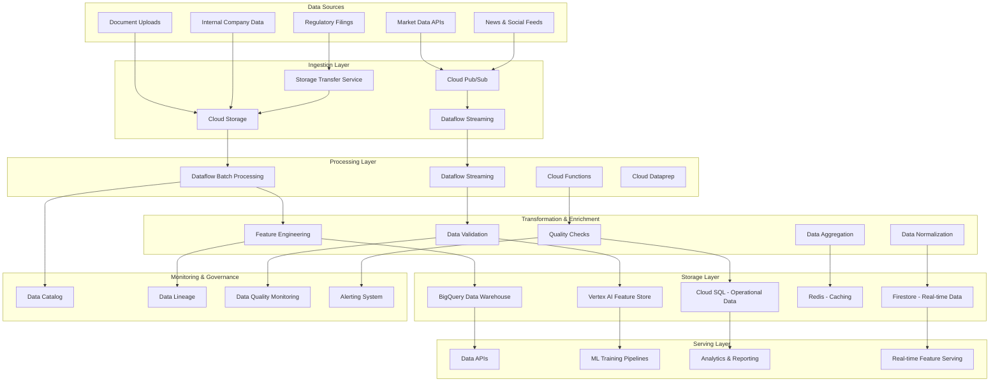

# Data Pipeline Architecture

## Overview

The Data Pipeline Architecture provides robust, scalable, and real-time data processing capabilities for the IPO valuation platform. This architecture handles ETL operations, feature engineering, data validation, and real-time streaming for financial data, market information, and document processing.

## Architecture Components

### 1. Data Pipeline Overview



## ETL Pipelines for Financial Data

### 1. Market Data ETL Pipeline

```python
import apache_beam as beam
from apache_beam.options.pipeline_options import PipelineOptions
from typing import Dict, Any, Iterator, List
import json
from datetime import datetime, timedelta
from google.cloud import bigquery
from dataclasses import dataclass

@dataclass
class MarketDataRecord:
    symbol: str
    price: float
    volume: int
    market_cap: float
    pe_ratio: float
    timestamp: datetime
    exchange: str
    sector: str
    
class MarketDataETLPipeline:
    """ETL Pipeline for processing market data"""
    
    def __init__(self, project_id: str, region: str = "us-central1"):
        self.project_id = project_id
        self.region = region
        
        # Pipeline configuration
        self.pipeline_options = PipelineOptions([
            '--project', project_id,
            '--region', region,
            '--runner', 'DataflowRunner',
            '--temp_location', f'gs://{project_id}-dataflow-temp',
            '--staging_location', f'gs://{project_id}-dataflow-staging',
            '--save_main_session', 'true'
        ])
    
    def create_batch_pipeline(self) -> beam.Pipeline:
        """Create batch processing pipeline for historical market data"""
        
        def parse_market_data(element: str) -> MarketDataRecord:
            """Parse raw market data JSON"""
            try:
                data = json.loads(element)
                return MarketDataRecord(
                    symbol=data['symbol'],
                    price=float(data['price']),
                    volume=int(data['volume']),
                    market_cap=float(data.get('market_cap', 0)),
                    pe_ratio=float(data.get('pe_ratio', 0)),
                    timestamp=datetime.fromisoformat(data['timestamp']),
                    exchange=data.get('exchange', 'ASX'),
                    sector=data.get('sector', 'Unknown')
                )
            except (json.JSONDecodeError, KeyError, ValueError) as e:
                # Log error and return None for bad records
                print(f"Error parsing market data: {e}")
                return None
        
        def validate_market_data(record: MarketDataRecord) -> bool:
            """Validate market data record"""
            if record is None:
                return False
            
            # Basic validation rules
            if record.price <= 0:
                return False
            if record.volume < 0:
                return False
            if not record.symbol or len(record.symbol) > 10:
                return False
            
            return True
        
        def enrich_market_data(record: MarketDataRecord) -> Dict[str, Any]:
            """Enrich market data with additional metrics"""
            
            # Calculate additional metrics
            daily_return = 0.0  # Would calculate from previous day's price
            volatility = 0.0    # Would calculate rolling volatility
            
            # Market classification
            if record.market_cap > 2_000_000_000:  # $2B
                market_cap_category = 'large_cap'
            elif record.market_cap > 300_000_000:  # $300M
                market_cap_category = 'mid_cap'
            else:
                market_cap_category = 'small_cap'
            
            return {
                'symbol': record.symbol,
                'price': record.price,
                'volume': record.volume,
                'market_cap': record.market_cap,
                'pe_ratio': record.pe_ratio,
                'timestamp': record.timestamp.isoformat(),
                'exchange': record.exchange,
                'sector': record.sector,
                'daily_return': daily_return,
                'volatility': volatility,
                'market_cap_category': market_cap_category,
                'processing_timestamp': datetime.utcnow().isoformat()
            }
        
        def format_for_bigquery(record: Dict[str, Any]) -> Dict[str, Any]:
            """Format record for BigQuery insertion"""
            return {
                'symbol': record['symbol'],
                'price': record['price'],
                'volume': record['volume'],
                'market_cap': record['market_cap'],
                'pe_ratio': record['pe_ratio'],
                'timestamp': record['timestamp'],
                'exchange': record['exchange'],
                'sector': record['sector'],
                'daily_return': record['daily_return'],
                'volatility': record['volatility'],
                'market_cap_category': record['market_cap_category'],
                'processing_timestamp': record['processing_timestamp']
            }
        
        pipeline = beam.Pipeline(options=self.pipeline_options)
        
        # Pipeline definition
        market_data = (
            pipeline
            | 'Read from Pub/Sub' >> beam.io.ReadFromPubSub(
                subscription=f'projects/{self.project_id}/subscriptions/market-data-sub'
            )
            | 'Parse Market Data' >> beam.Map(parse_market_data)
            | 'Filter Valid Records' >> beam.Filter(validate_market_data)
            | 'Enrich Data' >> beam.Map(enrich_market_data)
            | 'Format for BigQuery' >> beam.Map(format_for_bigquery)
            | 'Write to BigQuery' >> beam.io.WriteToBigQuery(
                table=f'{self.project_id}:financial_data.market_data',
                schema='SCHEMA_AUTODETECT',
                write_disposition=beam.io.BigQueryDisposition.WRITE_APPEND
            )
        )
        
        return pipeline
    
    def create_streaming_pipeline(self) -> beam.Pipeline:
        """Create streaming pipeline for real-time market data"""
        
        def add_timestamps(element: bytes) -> beam.window.TimestampedValue:
            """Add processing timestamp to elements"""
            return beam.window.TimestampedValue(element, time.time())
        
        def aggregate_by_symbol(elements: Iterator[Dict[str, Any]]) -> Dict[str, Any]:
            """Aggregate market data by symbol within time window"""
            records = list(elements)
            if not records:
                return None
            
            symbol = records[0]['symbol']
            prices = [r['price'] for r in records]
            volumes = [r['volume'] for r in records]
            
            return {
                'symbol': symbol,
                'window_start': min(r['timestamp'] for r in records),
                'window_end': max(r['timestamp'] for r in records),
                'count': len(records),
                'avg_price': sum(prices) / len(prices),
                'max_price': max(prices),
                'min_price': min(prices),
                'total_volume': sum(volumes),
                'price_change': prices[-1] - prices[0] if len(prices) > 1 else 0
            }
        
        pipeline = beam.Pipeline(options=self.pipeline_options)
        
        # Streaming pipeline
        (
            pipeline
            | 'Read from Pub/Sub' >> beam.io.ReadFromPubSub(
                subscription=f'projects/{self.project_id}/subscriptions/realtime-market-data'
            )
            | 'Add Timestamps' >> beam.Map(add_timestamps)
            | 'Parse JSON' >> beam.Map(json.loads)
            | 'Window into 1min intervals' >> beam.WindowInto(
                beam.window.FixedWindows(60)  # 1 minute windows
            )
            | 'Group by Symbol' >> beam.GroupBy(lambda x: x['symbol'])
            | 'Aggregate Data' >> beam.Map(
                lambda grouped: aggregate_by_symbol(grouped[1])
            )
            | 'Filter Valid Aggregations' >> beam.Filter(lambda x: x is not None)
            | 'Write to BigQuery' >> beam.io.WriteToBigQuery(
                table=f'{self.project_id}:financial_data.market_data_realtime',
                schema='SCHEMA_AUTODETECT',
                write_disposition=beam.io.BigQueryDisposition.WRITE_APPEND
            )
        )
        
        return pipeline
```

### 2. Document Processing ETL Pipeline

```python
from google.cloud import documentai
from google.cloud import storage
from google.cloud import bigquery
import json
from typing import Dict, List, Any, Optional
from dataclasses import dataclass, asdict
from datetime import datetime

@dataclass
class DocumentMetadata:
    document_id: str
    file_name: str
    file_type: str
    file_size: int
    upload_timestamp: datetime
    company_id: str
    document_category: str
    processing_status: str

@dataclass
class ExtractedEntity:
    entity_type: str
    text: str
    confidence: float
    start_offset: int
    end_offset: int
    normalized_value: Optional[str] = None

class DocumentProcessingPipeline:
    """ETL Pipeline for processing financial documents"""
    
    def __init__(self, project_id: str, processor_id: str):
        self.project_id = project_id
        self.processor_id = processor_id
        
        # Initialize clients
        self.documentai_client = documentai.DocumentProcessorServiceClient()
        self.storage_client = storage.Client()
        self.bigquery_client = bigquery.Client()
        
        # Document processor configuration
        self.processor_name = (
            f"projects/{project_id}/locations/us/processors/{processor_id}"
        )
    
    async def process_document_batch(
        self, 
        bucket_name: str, 
        file_paths: List[str]
    ) -> List[Dict[str, Any]]:
        """Process a batch of documents"""
        
        results = []
        
        for file_path in file_paths:
            try:
                # Process single document
                result = await self.process_single_document(bucket_name, file_path)
                results.append(result)
                
            except Exception as e:
                print(f"Error processing {file_path}: {e}")
                results.append({
                    'file_path': file_path,
                    'status': 'error',
                    'error': str(e)
                })
        
        return results
    
    async def process_single_document(
        self, 
        bucket_name: str, 
        file_path: str
    ) -> Dict[str, Any]:
        """Process a single document through the pipeline"""
        
        # Step 1: Extract document metadata
        metadata = self._extract_document_metadata(bucket_name, file_path)
        
        # Step 2: Process with Document AI
        document_result = await self._process_with_documentai(
            bucket_name, file_path
        )
        
        # Step 3: Extract structured data
        structured_data = self._extract_structured_data(document_result)
        
        # Step 4: Perform entity recognition
        entities = self._extract_entities(document_result)
        
        # Step 5: Classify document content
        classification = self._classify_document_content(
            document_result.text
        )
        
        # Step 6: Validate extracted data
        validation_result = self._validate_extracted_data(
            structured_data, entities
        )
        
        # Compile results
        processing_result = {
            'metadata': asdict(metadata),
            'text_content': document_result.text,
            'structured_data': structured_data,
            'entities': [asdict(entity) for entity in entities],
            'classification': classification,
            'validation': validation_result,
            'processing_timestamp': datetime.utcnow().isoformat(),
            'status': 'completed' if validation_result['is_valid'] else 'validation_failed'
        }
        
        # Step 7: Store results
        await self._store_processing_results(processing_result)
        
        return processing_result
    
    def _extract_document_metadata(
        self, 
        bucket_name: str, 
        file_path: str
    ) -> DocumentMetadata:
        """Extract metadata from document file"""
        
        # Get file information from Cloud Storage
        bucket = self.storage_client.bucket(bucket_name)
        blob = bucket.blob(file_path)
        
        # Extract metadata
        return DocumentMetadata(
            document_id=self._generate_document_id(file_path),
            file_name=blob.name.split('/')[-1],
            file_type=blob.content_type or 'unknown',
            file_size=blob.size or 0,
            upload_timestamp=blob.time_created or datetime.utcnow(),
            company_id=self._extract_company_id_from_path(file_path),
            document_category=self._classify_document_type(blob.name),
            processing_status='processing'
        )
    
    async def _process_with_documentai(
        self, 
        bucket_name: str, 
        file_path: str
    ) -> documentai.Document:
        """Process document with Document AI"""
        
        # Configure the request
        gcs_input_uri = f"gs://{bucket_name}/{file_path}"
        
        # Create the request
        request = documentai.ProcessRequest(
            name=self.processor_name,
            gcs_document=documentai.GcsDocument(
                gcs_uri=gcs_input_uri,
                mime_type="application/pdf"  # Adjust based on file type
            )
        )
        
        # Process the document
        result = self.documentai_client.process_document(request=request)
        
        return result.document
    
    def _extract_structured_data(
        self, 
        document: documentai.Document
    ) -> Dict[str, Any]:
        """Extract structured data from document"""
        
        structured_data = {
            'tables': [],
            'form_fields': {},
            'key_value_pairs': []
        }
        
        # Extract tables
        for page in document.pages:
            for table in page.tables:
                table_data = self._extract_table_data(table, document.text)
                structured_data['tables'].append(table_data)
            
            # Extract form fields
            for form_field in page.form_fields:
                field_name = self._get_text_from_element(
                    form_field.field_name, document.text
                )
                field_value = self._get_text_from_element(
                    form_field.field_value, document.text
                )
                
                if field_name:
                    structured_data['form_fields'][field_name] = field_value
        
        return structured_data
    
    def _extract_entities(
        self, 
        document: documentai.Document
    ) -> List[ExtractedEntity]:
        """Extract named entities from document"""
        
        entities = []
        
        for entity in document.entities:
            extracted_entity = ExtractedEntity(
                entity_type=entity.type_,
                text=entity.text_anchor.content if entity.text_anchor else "",
                confidence=entity.confidence,
                start_offset=(
                    entity.text_anchor.text_segments[0].start_index
                    if entity.text_anchor and entity.text_anchor.text_segments
                    else 0
                ),
                end_offset=(
                    entity.text_anchor.text_segments[0].end_index
                    if entity.text_anchor and entity.text_anchor.text_segments
                    else 0
                ),
                normalized_value=(
                    entity.normalized_value.text if entity.normalized_value else None
                )
            )
            entities.append(extracted_entity)
        
        return entities
    
    def _classify_document_content(self, text: str) -> Dict[str, Any]:
        """Classify document content and extract key sections"""
        
        # Keywords for different document sections
        section_keywords = {
            'executive_summary': ['executive summary', 'overview', 'highlights'],
            'financial_statements': ['income statement', 'balance sheet', 'cash flow'],
            'risk_factors': ['risk factors', 'risks', 'uncertainties'],
            'business_description': ['business overview', 'company description'],
            'management_discussion': ['management discussion', 'md&a']
        }
        
        # Sentiment keywords
        positive_keywords = ['growth', 'increase', 'improvement', 'strong', 'positive']
        negative_keywords = ['decline', 'decrease', 'risk', 'uncertainty', 'loss']
        
        text_lower = text.lower()
        
        classification = {
            'sections_found': [],
            'sentiment_indicators': {
                'positive_count': 0,
                'negative_count': 0
            },
            'key_metrics_found': [],
            'document_confidence': 0.0
        }
        
        # Identify sections
        for section, keywords in section_keywords.items():
            if any(keyword in text_lower for keyword in keywords):
                classification['sections_found'].append(section)
        
        # Sentiment analysis
        for keyword in positive_keywords:
            classification['sentiment_indicators']['positive_count'] += text_lower.count(keyword)
        
        for keyword in negative_keywords:
            classification['sentiment_indicators']['negative_count'] += text_lower.count(keyword)
        
        # Key metrics detection
        import re
        
        # Look for financial metrics patterns
        revenue_pattern = r'revenue[s]?.*?\$?[\d,]+(?:\.\d+)?[mkb]?'
        profit_pattern = r'(?:profit|earnings).*?\$?[\d,]+(?:\.\d+)?[mkb]?'
        
        if re.search(revenue_pattern, text_lower, re.IGNORECASE):
            classification['key_metrics_found'].append('revenue')
        
        if re.search(profit_pattern, text_lower, re.IGNORECASE):
            classification['key_metrics_found'].append('profit')
        
        # Calculate overall confidence
        sections_weight = len(classification['sections_found']) * 0.3
        metrics_weight = len(classification['key_metrics_found']) * 0.4
        text_length_weight = min(len(text) / 10000, 1.0) * 0.3
        
        classification['document_confidence'] = min(
            sections_weight + metrics_weight + text_length_weight, 1.0
        )
        
        return classification
    
    def _validate_extracted_data(
        self, 
        structured_data: Dict[str, Any], 
        entities: List[ExtractedEntity]
    ) -> Dict[str, Any]:
        """Validate extracted data for quality and completeness"""
        
        validation_result = {
            'is_valid': True,
            'validation_errors': [],
            'data_quality_score': 0.0,
            'completeness_score': 0.0
        }
        
        # Check data completeness
        required_sections = ['tables', 'form_fields']
        missing_sections = [
            section for section in required_sections
            if not structured_data.get(section)
        ]
        
        if missing_sections:
            validation_result['validation_errors'].append(
                f"Missing sections: {', '.join(missing_sections)}"
            )
        
        # Check entity confidence scores
        low_confidence_entities = [
            entity for entity in entities
            if entity.confidence < 0.7
        ]
        
        if low_confidence_entities:
            validation_result['validation_errors'].append(
                f"Found {len(low_confidence_entities)} entities with low confidence"
            )
        
        # Calculate scores
        completeness_score = 1.0 - (len(missing_sections) / len(required_sections))
        
        avg_entity_confidence = (
            sum(entity.confidence for entity in entities) / len(entities)
            if entities else 0.0
        )
        
        validation_result['completeness_score'] = completeness_score
        validation_result['data_quality_score'] = avg_entity_confidence
        
        # Overall validation
        validation_result['is_valid'] = (
            len(validation_result['validation_errors']) == 0 and
            completeness_score >= 0.7 and
            avg_entity_confidence >= 0.6
        )
        
        return validation_result
    
    async def _store_processing_results(
        self, 
        processing_result: Dict[str, Any]
    ) -> bool:
        """Store processing results in BigQuery"""
        
        try:
            # Define BigQuery table schema
            table_id = f"{self.project_id}.document_processing.processed_documents"
            
            # Format for BigQuery insertion
            bq_record = {
                'document_id': processing_result['metadata']['document_id'],
                'file_name': processing_result['metadata']['file_name'],
                'company_id': processing_result['metadata']['company_id'],
                'document_category': processing_result['metadata']['document_category'],
                'processing_timestamp': processing_result['processing_timestamp'],
                'text_content': processing_result['text_content'][:10000],  # Truncate for storage
                'structured_data': json.dumps(processing_result['structured_data']),
                'entities_count': len(processing_result['entities']),
                'classification': json.dumps(processing_result['classification']),
                'validation_result': json.dumps(processing_result['validation']),
                'processing_status': processing_result['status']
            }
            
            # Insert into BigQuery
            errors = self.bigquery_client.insert_rows_json(
                table_id, [bq_record]
            )
            
            if errors:
                print(f"BigQuery insertion errors: {errors}")
                return False
            
            return True
            
        except Exception as e:
            print(f"Error storing processing results: {e}")
            return False
    
    def _extract_table_data(
        self, 
        table: documentai.Document.Page.Table, 
        document_text: str
    ) -> Dict[str, Any]:
        """Extract data from a table structure"""
        
        table_data = {
            'headers': [],
            'rows': [],
            'row_count': len(table.body_rows),
            'column_count': 0
        }
        
        # Extract headers
        if table.header_rows:
            for header_row in table.header_rows:
                header_cells = []
                for cell in header_row.cells:
                    cell_text = self._get_text_from_element(cell.layout, document_text)
                    header_cells.append(cell_text)
                table_data['headers'].append(header_cells)
                table_data['column_count'] = max(
                    table_data['column_count'], len(header_cells)
                )
        
        # Extract body rows
        for row in table.body_rows:
            row_cells = []
            for cell in row.cells:
                cell_text = self._get_text_from_element(cell.layout, document_text)
                row_cells.append(cell_text)
            table_data['rows'].append(row_cells)
            table_data['column_count'] = max(
                table_data['column_count'], len(row_cells)
            )
        
        return table_data
    
    def _get_text_from_element(
        self, 
        layout: documentai.Document.Page.Layout, 
        document_text: str
    ) -> str:
        """Extract text from a layout element"""
        
        if not layout or not layout.text_anchor:
            return ""
        
        text_segments = layout.text_anchor.text_segments
        if not text_segments:
            return ""
        
        # Concatenate text from all segments
        extracted_text = ""
        for segment in text_segments:
            start_index = segment.start_index
            end_index = segment.end_index
            extracted_text += document_text[start_index:end_index]
        
        return extracted_text.strip()
    
    def _generate_document_id(self, file_path: str) -> str:
        """Generate unique document ID"""
        import hashlib
        return hashlib.md5(file_path.encode()).hexdigest()[:16]
    
    def _extract_company_id_from_path(self, file_path: str) -> str:
        """Extract company ID from file path"""
        # Assuming path structure: company_id/document_type/filename
        path_parts = file_path.split('/')
        return path_parts[0] if path_parts else 'unknown'
    
    def _classify_document_type(self, filename: str) -> str:
        """Classify document type based on filename"""
        
        filename_lower = filename.lower()
        
        if 'prospectus' in filename_lower:
            return 'prospectus'
        elif 'financial' in filename_lower or 'statement' in filename_lower:
            return 'financial_statement'
        elif 'annual' in filename_lower or 'report' in filename_lower:
            return 'annual_report'
        elif 'risk' in filename_lower:
            return 'risk_disclosure'
        else:
            return 'other'
```

## Feature Store Design and Implementation

### 1. Vertex AI Feature Store Configuration

```python
from google.cloud import aiplatform
from google.cloud.aiplatform import feature_store
from typing import Dict, List, Any, Optional
from dataclasses import dataclass, asdict
from datetime import datetime, timedelta
import pandas as pd

@dataclass
class FeatureSpec:
    feature_id: str
    value_type: str  # STRING, DOUBLE, INT64, BOOL, DOUBLE_ARRAY
    description: str
    labels: Dict[str, str]
    monitoring_config: Optional[Dict[str, Any]] = None

@dataclass
class EntityTypeSpec:
    entity_type_id: str
    description: str
    labels: Dict[str, str]
    monitoring_config: Optional[Dict[str, Any]] = None

class FeatureStoreManager:
    """Manages Vertex AI Feature Store operations"""
    
    def __init__(self, project_id: str, region: str, featurestore_id: str):
        self.project_id = project_id
        self.region = region
        self.featurestore_id = featurestore_id
        
        # Initialize AI Platform
        aiplatform.init(project=project_id, location=region)
        
        # Feature store client
        self.client = feature_store.FeaturestoreServiceClient()
        
        # Resource names
        self.featurestore_name = (
            f"projects/{project_id}/locations/{region}"
            f"/featurestores/{featurestore_id}"
        )
    
    async def create_entity_type(
        self, 
        entity_type_spec: EntityTypeSpec
    ) -> Dict[str, Any]:
        """Create a new entity type in the feature store"""
        
        entity_type = {
            "description": entity_type_spec.description,
            "labels": entity_type_spec.labels,
            "monitoring_config": entity_type_spec.monitoring_config or {
                "snapshot_analysis": {
                    "disabled": False,
                    "monitoring_interval_days": 1
                },
                "numerical_threshold_config": {
                    "value": 0.001
                },
                "categorical_threshold_config": {
                    "value": 0.001
                }
            }
        }
        
        request = {
            "parent": self.featurestore_name,
            "entity_type_id": entity_type_spec.entity_type_id,
            "entity_type": entity_type
        }
        
        try:
            operation = self.client.create_entity_type(request=request)
            result = operation.result()
            
            return {
                'success': True,
                'entity_type_name': result.name,
                'entity_type_id': entity_type_spec.entity_type_id
            }
            
        except Exception as e:
            return {
                'success': False,
                'error': str(e)
            }
    
    async def create_features(
        self, 
        entity_type_id: str, 
        features: List[FeatureSpec]
    ) -> Dict[str, Any]:
        """Create features for an entity type"""
        
        entity_type_name = f"{self.featurestore_name}/entityTypes/{entity_type_id}"
        
        results = []
        
        for feature_spec in features:
            feature = {
                "value_type": getattr(
                    feature_store.Feature.ValueType, 
                    feature_spec.value_type
                ),
                "description": feature_spec.description,
                "labels": feature_spec.labels,
                "monitoring_config": feature_spec.monitoring_config
            }
            
            request = {
                "parent": entity_type_name,
                "feature_id": feature_spec.feature_id,
                "feature": feature
            }
            
            try:
                operation = self.client.create_feature(request=request)
                result = operation.result()
                
                results.append({
                    'feature_id': feature_spec.feature_id,
                    'success': True,
                    'feature_name': result.name
                })
                
            except Exception as e:
                results.append({
                    'feature_id': feature_spec.feature_id,
                    'success': False,
                    'error': str(e)
                })
        
        return {
            'entity_type_id': entity_type_id,
            'results': results,
            'success_count': len([r for r in results if r['success']]),
            'error_count': len([r for r in results if not r['success']])
        }
    
    async def ingest_feature_values(
        self, 
        entity_type_id: str, 
        feature_data: pd.DataFrame,
        entity_id_column: str = 'entity_id'
    ) -> Dict[str, Any]:
        """Ingest feature values into the feature store"""
        
        entity_type_name = f"{self.featurestore_name}/entityTypes/{entity_type_id}"
        
        # Prepare feature values
        feature_specs = []
        for _, row in feature_data.iterrows():
            entity_id = row[entity_id_column]
            
            # Create feature values for this entity
            feature_values = []
            for column in feature_data.columns:
                if column != entity_id_column:
                    feature_value = {
                        "feature_id": column,
                        "value": self._convert_to_feature_value(row[column])
                    }
                    feature_values.append(feature_value)
            
            feature_specs.append({
                "entity_id": entity_id,
                "feature_values": feature_values
            })
        
        # Batch ingest features
        request = {
            "entity_type": entity_type_name,
            "feature_specs": feature_specs
        }
        
        try:
            operation = self.client.batch_create_features(request=request)
            result = operation.result()
            
            return {
                'success': True,
                'ingested_count': len(feature_specs),
                'operation_name': operation.name
            }
            
        except Exception as e:
            return {
                'success': False,
                'error': str(e)
            }
    
    async def read_feature_values(
        self, 
        entity_type_id: str, 
        entity_ids: List[str],
        feature_selector: Optional[Dict[str, List[str]]] = None
    ) -> Dict[str, Any]:
        """Read feature values from the feature store"""
        
        entity_type_name = f"{self.featurestore_name}/entityTypes/{entity_type_id}"
        
        # Configure feature selector
        if feature_selector is None:
            # Read all features for the entity type
            feature_selector = {entity_type_id: []}
        
        request = {
            "entity_type": entity_type_name,
            "entity_ids": entity_ids,
            "feature_selector": feature_selector
        }
        
        try:
            response = self.client.batch_read_feature_values(request=request)
            
            # Process response into DataFrame
            feature_data = []
            for entity_view in response.entity_views:
                entity_data = {'entity_id': entity_view.entity_id}
                
                for feature_data_item in entity_view.data:
                    feature_id = feature_data_item.feature_id
                    feature_value = self._extract_feature_value(
                        feature_data_item.value
                    )
                    entity_data[feature_id] = feature_value
                
                feature_data.append(entity_data)
            
            return {
                'success': True,
                'feature_data': pd.DataFrame(feature_data),
                'entity_count': len(feature_data)
            }
            
        except Exception as e:
            return {
                'success': False,
                'error': str(e)
            }
    
    def _convert_to_feature_value(self, value: Any) -> Dict[str, Any]:
        """Convert Python value to Feature Store value format"""
        
        if isinstance(value, str):
            return {"string_value": value}
        elif isinstance(value, (int, float)):
            if isinstance(value, int):
                return {"int64_value": value}
            else:
                return {"double_value": value}
        elif isinstance(value, bool):
            return {"bool_value": value}
        elif isinstance(value, list):
            if all(isinstance(x, (int, float)) for x in value):
                return {"double_array_value": {"values": value}}
            else:
                return {"string_array_value": {"values": [str(x) for x in value]}}
        else:
            return {"string_value": str(value)}
    
    def _extract_feature_value(self, feature_value: Any) -> Any:
        """Extract Python value from Feature Store value format"""
        
        if hasattr(feature_value, 'string_value'):
            return feature_value.string_value
        elif hasattr(feature_value, 'double_value'):
            return feature_value.double_value
        elif hasattr(feature_value, 'int64_value'):
            return feature_value.int64_value
        elif hasattr(feature_value, 'bool_value'):
            return feature_value.bool_value
        elif hasattr(feature_value, 'double_array_value'):
            return list(feature_value.double_array_value.values)
        elif hasattr(feature_value, 'string_array_value'):
            return list(feature_value.string_array_value.values)
        else:
            return None

# Feature Store Configuration
def get_financial_features_config() -> List[FeatureSpec]:
    """Get configuration for financial features"""
    return [
        FeatureSpec(
            feature_id="revenue_12m",
            value_type="DOUBLE",
            description="Trailing 12 months revenue",
            labels={"category": "financial", "period": "annual"}
        ),
        FeatureSpec(
            feature_id="revenue_growth_rate",
            value_type="DOUBLE",
            description="Year-over-year revenue growth rate",
            labels={"category": "financial", "metric": "growth"}
        ),
        FeatureSpec(
            feature_id="gross_margin",
            value_type="DOUBLE",
            description="Gross profit margin",
            labels={"category": "financial", "metric": "profitability"}
        ),
        FeatureSpec(
            feature_id="ebitda_margin",
            value_type="DOUBLE",
            description="EBITDA margin",
            labels={"category": "financial", "metric": "profitability"}
        ),
        FeatureSpec(
            feature_id="debt_to_equity",
            value_type="DOUBLE",
            description="Debt to equity ratio",
            labels={"category": "financial", "metric": "leverage"}
        ),
        FeatureSpec(
            feature_id="cash_conversion_cycle",
            value_type="DOUBLE",
            description="Cash conversion cycle in days",
            labels={"category": "financial", "metric": "efficiency"}
        )
    ]

def get_market_features_config() -> List[FeatureSpec]:
    """Get configuration for market features"""
    return [
        FeatureSpec(
            feature_id="sector_pe_median",
            value_type="DOUBLE",
            description="Sector median P/E ratio",
            labels={"category": "market", "scope": "sector"}
        ),
        FeatureSpec(
            feature_id="sector_pb_median",
            value_type="DOUBLE",
            description="Sector median P/B ratio",
            labels={"category": "market", "scope": "sector"}
        ),
        FeatureSpec(
            feature_id="market_volatility_30d",
            value_type="DOUBLE",
            description="30-day market volatility",
            labels={"category": "market", "period": "30d"}
        ),
        FeatureSpec(
            feature_id="sector_momentum_score",
            value_type="DOUBLE",
            description="Sector momentum score",
            labels={"category": "market", "metric": "momentum"}
        ),
        FeatureSpec(
            feature_id="ipo_sentiment_score",
            value_type="DOUBLE",
            description="IPO market sentiment score",
            labels={"category": "market", "metric": "sentiment"}
        )
    ]
```

### 2. Real-time Feature Engineering

```python
import apache_beam as beam
from apache_beam.transforms import window
from typing import Dict, Any, Iterator, Tuple
import numpy as np
from datetime import datetime, timedelta
import json

class FeatureEngineeringPipeline:
    """Real-time feature engineering pipeline"""
    
    def __init__(self, project_id: str):
        self.project_id = project_id
    
    def create_realtime_features_pipeline(self) -> beam.Pipeline:
        """Create pipeline for real-time feature engineering"""
        
        def parse_market_data(element: bytes) -> Dict[str, Any]:
            """Parse incoming market data"""
            try:
                data = json.loads(element.decode('utf-8'))
                return {
                    'symbol': data['symbol'],
                    'price': float(data['price']),
                    'volume': int(data['volume']),
                    'timestamp': datetime.fromisoformat(data['timestamp']),
                    'market_cap': float(data.get('market_cap', 0))
                }
            except (json.JSONDecodeError, KeyError, ValueError):
                return None
        
        def calculate_price_features(elements: Iterator[Dict[str, Any]]) -> Dict[str, Any]:
            """Calculate price-based features for a window"""
            
            records = list(elements)
            if not records:
                return None
            
            symbol = records[0]['symbol']
            prices = [r['price'] for r in records]
            volumes = [r['volume'] for r in records]
            timestamps = [r['timestamp'] for r in records]
            
            if len(prices) < 2:
                return None
            
            # Calculate features
            returns = [(prices[i] - prices[i-1]) / prices[i-1] 
                      for i in range(1, len(prices))]
            
            features = {
                'symbol': symbol,
                'window_start': min(timestamps).isoformat(),
                'window_end': max(timestamps).isoformat(),
                
                # Price features
                'price_current': prices[-1],
                'price_change': prices[-1] - prices[0],
                'price_change_pct': (prices[-1] - prices[0]) / prices[0] * 100,
                'price_volatility': np.std(returns) if returns else 0.0,
                
                # Volume features
                'volume_total': sum(volumes),
                'volume_avg': np.mean(volumes),
                'volume_weighted_price': sum(p * v for p, v in zip(prices, volumes)) / sum(volumes),
                
                # Technical indicators
                'rsi': self._calculate_rsi(prices),
                'moving_avg_5': np.mean(prices[-5:]) if len(prices) >= 5 else np.mean(prices),
                'bollinger_upper': np.mean(prices) + 2 * np.std(prices),
                'bollinger_lower': np.mean(prices) - 2 * np.std(prices),
                
                # Momentum features
                'momentum_1h': (prices[-1] - prices[0]) / prices[0] if prices else 0,
                'trend_direction': 1 if prices[-1] > prices[0] else -1,
                
                'feature_timestamp': datetime.utcnow().isoformat()
            }
            
            return features
        
        def calculate_fundamental_features(
            market_data: Dict[str, Any]
        ) -> Dict[str, Any]:
            """Calculate fundamental analysis features"""
            
            # This would typically fetch additional fundamental data
            # For now, we'll calculate basic features from market data
            
            features = market_data.copy()
            
            # Market cap category
            market_cap = market_data.get('market_cap', 0)
            if market_cap > 2_000_000_000:
                features['market_cap_category'] = 'large_cap'
            elif market_cap > 300_000_000:
                features['market_cap_category'] = 'mid_cap'
            else:
                features['market_cap_category'] = 'small_cap'
            
            # Liquidity score (based on volume)
            volume_total = market_data.get('volume_total', 0)
            if volume_total > 1_000_000:
                features['liquidity_score'] = 'high'
            elif volume_total > 100_000:
                features['liquidity_score'] = 'medium'
            else:
                features['liquidity_score'] = 'low'
            
            return features
        
        def format_for_feature_store(features: Dict[str, Any]) -> Dict[str, Any]:
            """Format features for ingestion into feature store"""
            
            return {
                'entity_id': features['symbol'],
                'entity_type': 'company',
                'features': {
                    k: v for k, v in features.items() 
                    if k not in ['symbol', 'window_start', 'window_end']
                },
                'feature_timestamp': features.get('feature_timestamp')
            }
        
        # Create pipeline
        pipeline_options = beam.options.pipeline_options.PipelineOptions([
            '--project', self.project_id,
            '--runner', 'DataflowRunner',
            '--streaming'
        ])
        
        pipeline = beam.Pipeline(options=pipeline_options)
        
        # Main pipeline
        (
            pipeline
            | 'Read Market Data' >> beam.io.ReadFromPubSub(
                subscription=f'projects/{self.project_id}/subscriptions/market-data-features'
            )
            | 'Parse Data' >> beam.Map(parse_market_data)
            | 'Filter Valid Records' >> beam.Filter(lambda x: x is not None)
            | 'Add Timestamps' >> beam.Map(
                lambda x: beam.window.TimestampedValue(x, x['timestamp'].timestamp())
            )
            | 'Window into 1 hour' >> beam.WindowInto(
                beam.window.FixedWindows(3600)  # 1 hour windows
            )
            | 'Group by Symbol' >> beam.GroupBy(lambda x: x['symbol'])
            | 'Calculate Price Features' >> beam.Map(
                lambda grouped: calculate_price_features(grouped[1])
            )
            | 'Filter Valid Features' >> beam.Filter(lambda x: x is not None)
            | 'Add Fundamental Features' >> beam.Map(calculate_fundamental_features)
            | 'Format for Feature Store' >> beam.Map(format_for_feature_store)
            | 'Write to Feature Store' >> beam.io.WriteToBigQuery(
                table=f'{self.project_id}:feature_store.realtime_features',
                schema='SCHEMA_AUTODETECT',
                write_disposition=beam.io.BigQueryDisposition.WRITE_APPEND
            )
        )
        
        return pipeline
    
    def _calculate_rsi(self, prices: list, period: int = 14) -> float:
        """Calculate Relative Strength Index"""
        
        if len(prices) < period + 1:
            return 50.0  # Neutral RSI
        
        deltas = [prices[i] - prices[i-1] for i in range(1, len(prices))]
        gains = [delta if delta > 0 else 0 for delta in deltas]
        losses = [-delta if delta < 0 else 0 for delta in deltas]
        
        avg_gain = np.mean(gains[-period:])
        avg_loss = np.mean(losses[-period:])
        
        if avg_loss == 0:
            return 100.0
        
        rs = avg_gain / avg_loss
        rsi = 100 - (100 / (1 + rs))
        
        return rsi
```

## Data Validation and Quality Checks

### 1. Data Quality Framework

```python
from typing import Dict, List, Any, Optional, Callable
from dataclasses import dataclass, field
from datetime import datetime
from enum import Enum
import pandas as pd
import numpy as np
import json

class ValidationSeverity(Enum):
    INFO = "info"
    WARNING = "warning"
    ERROR = "error"
    CRITICAL = "critical"

@dataclass
class ValidationRule:
    rule_id: str
    name: str
    description: str
    severity: ValidationSeverity
    validation_function: Callable[[Any], bool]
    error_message: str
    metadata: Dict[str, Any] = field(default_factory=dict)

@dataclass
class ValidationResult:
    rule_id: str
    passed: bool
    severity: ValidationSeverity
    message: str
    details: Dict[str, Any] = field(default_factory=dict)
    timestamp: datetime = field(default_factory=datetime.utcnow)

class DataQualityValidator:
    """Comprehensive data quality validation framework"""
    
    def __init__(self):
        self.validation_rules = {}
        self.validation_history = []
        self._register_default_rules()
    
    def _register_default_rules(self):
        """Register default validation rules"""
        
        # Financial data validation rules
        self.register_rule(ValidationRule(
            rule_id="FINANCIAL_001",
            name="Revenue Positivity Check",
            description="Revenue values should be positive",
            severity=ValidationSeverity.ERROR,
            validation_function=lambda df: (df['revenue'] >= 0).all() if 'revenue' in df.columns else True,
            error_message="Found negative revenue values"
        ))
        
        self.register_rule(ValidationRule(
            rule_id="FINANCIAL_002",
            name="P/E Ratio Range Check",
            description="P/E ratios should be within reasonable range (0-200)",
            severity=ValidationSeverity.WARNING,
            validation_function=lambda df: (
                (df['pe_ratio'] >= 0) & (df['pe_ratio'] <= 200)
            ).all() if 'pe_ratio' in df.columns else True,
            error_message="P/E ratios outside reasonable range (0-200)"
        ))
        
        # Market data validation rules
        self.register_rule(ValidationRule(
            rule_id="MARKET_001",
            name="Price Positivity Check",
            description="Stock prices should be positive",
            severity=ValidationSeverity.CRITICAL,
            validation_function=lambda df: (df['price'] > 0).all() if 'price' in df.columns else True,
            error_message="Found non-positive stock prices"
        ))
        
        self.register_rule(ValidationRule(
            rule_id="MARKET_002",
            name="Volume Reasonableness Check",
            description="Trading volume should be reasonable",
            severity=ValidationSeverity.WARNING,
            validation_function=lambda df: (
                (df['volume'] >= 0) & (df['volume'] <= 1e9)
            ).all() if 'volume' in df.columns else True,
            error_message="Trading volume outside reasonable range"
        ))
        
        # Data completeness rules
        self.register_rule(ValidationRule(
            rule_id="COMPLETENESS_001",
            name="Required Fields Check",
            description="Required fields should not be null",
            severity=ValidationSeverity.ERROR,
            validation_function=self._check_required_fields,
            error_message="Missing required fields",
            metadata={'required_fields': ['symbol', 'price', 'timestamp']}
        ))
        
        # Data freshness rules
        self.register_rule(ValidationRule(
            rule_id="FRESHNESS_001",
            name="Data Freshness Check",
            description="Data should not be older than expected threshold",
            severity=ValidationSeverity.WARNING,
            validation_function=self._check_data_freshness,
            error_message="Data is stale",
            metadata={'max_age_hours': 24}
        ))
    
    def register_rule(self, rule: ValidationRule):
        """Register a new validation rule"""
        self.validation_rules[rule.rule_id] = rule
    
    def validate_dataset(
        self, 
        data: pd.DataFrame, 
        dataset_type: str = "general"
    ) -> List[ValidationResult]:
        """Validate a complete dataset"""
        
        results = []
        
        for rule_id, rule in self.validation_rules.items():
            try:
                # Apply validation rule
                is_valid = rule.validation_function(data)
                
                result = ValidationResult(
                    rule_id=rule_id,
                    passed=is_valid,
                    severity=rule.severity,
                    message=rule.error_message if not is_valid else "Validation passed",
                    details={
                        'dataset_type': dataset_type,
                        'row_count': len(data),
                        'column_count': len(data.columns),
                        'rule_metadata': rule.metadata
                    }
                )
                
                results.append(result)
                
            except Exception as e:
                # Handle validation errors
                result = ValidationResult(
                    rule_id=rule_id,
                    passed=False,
                    severity=ValidationSeverity.CRITICAL,
                    message=f"Validation rule failed: {str(e)}",
                    details={'error': str(e)}
                )
                results.append(result)
        
        # Store validation history
        self.validation_history.append({
            'timestamp': datetime.utcnow(),
            'dataset_type': dataset_type,
            'results': results
        })
        
        return results
    
    def validate_streaming_record(
        self, 
        record: Dict[str, Any], 
        record_type: str = "market_data"
    ) -> List[ValidationResult]:
        """Validate a single streaming record"""
        
        # Convert record to DataFrame for validation
        df = pd.DataFrame([record])
        
        # Apply relevant validation rules
        results = []
        
        for rule_id, rule in self.validation_rules.items():
            # Skip rules not applicable to this record type
            if record_type == "market_data" and not rule_id.startswith(("MARKET_", "COMPLETENESS_", "FRESHNESS_")):
                continue
            elif record_type == "financial_data" and not rule_id.startswith(("FINANCIAL_", "COMPLETENESS_")):
                continue
            
            try:
                is_valid = rule.validation_function(df)
                
                result = ValidationResult(
                    rule_id=rule_id,
                    passed=is_valid,
                    severity=rule.severity,
                    message=rule.error_message if not is_valid else "Validation passed",
                    details={
                        'record_type': record_type,
                        'record_data': record
                    }
                )
                
                results.append(result)
                
            except Exception as e:
                result = ValidationResult(
                    rule_id=rule_id,
                    passed=False,
                    severity=ValidationSeverity.CRITICAL,
                    message=f"Validation failed: {str(e)}"
                )
                results.append(result)
        
        return results
    
    def _check_required_fields(self, df: pd.DataFrame) -> bool:
        """Check if required fields are present and non-null"""
        
        required_fields = [
            field for rule in self.validation_rules.values() 
            if rule.rule_id == "COMPLETENESS_001"
            for field in rule.metadata.get('required_fields', [])
        ]
        
        if not required_fields:
            return True
        
        # Check if all required fields are present
        missing_fields = [field for field in required_fields if field not in df.columns]
        if missing_fields:
            return False
        
        # Check if required fields have non-null values
        for field in required_fields:
            if df[field].isnull().any():
                return False
        
        return True
    
    def _check_data_freshness(self, df: pd.DataFrame) -> bool:
        """Check if data is fresh (not too old)"""
        
        if 'timestamp' not in df.columns:
            return True  # Skip if no timestamp
        
        max_age_hours = 24  # Default
        for rule in self.validation_rules.values():
            if rule.rule_id == "FRESHNESS_001":
                max_age_hours = rule.metadata.get('max_age_hours', 24)
                break
        
        # Convert timestamps to datetime if they're strings
        timestamps = pd.to_datetime(df['timestamp'])
        
        # Check if any data is too old
        cutoff_time = datetime.utcnow() - pd.Timedelta(hours=max_age_hours)
        old_records = timestamps < cutoff_time
        
        return not old_records.any()
    
    def get_quality_report(self, dataset_type: Optional[str] = None) -> Dict[str, Any]:
        """Generate data quality report"""
        
        if not self.validation_history:
            return {'error': 'No validation history available'}
        
        # Filter by dataset type if specified
        relevant_history = self.validation_history
        if dataset_type:
            relevant_history = [
                entry for entry in self.validation_history
                if entry['dataset_type'] == dataset_type
            ]
        
        if not relevant_history:
            return {'error': f'No validation history for dataset type: {dataset_type}'}
        
        # Get latest validation results
        latest_validation = relevant_history[-1]
        
        # Calculate quality metrics
        total_rules = len(latest_validation['results'])
        passed_rules = len([r for r in latest_validation['results'] if r.passed])
        failed_rules = total_rules - passed_rules
        
        # Group by severity
        severity_counts = {}
        for result in latest_validation['results']:
            if not result.passed:
                severity = result.severity.value
                severity_counts[severity] = severity_counts.get(severity, 0) + 1
        
        # Calculate quality score (0-100)
        quality_score = (passed_rules / total_rules) * 100 if total_rules > 0 else 0
        
        # Quality status
        if quality_score >= 95:
            quality_status = "excellent"
        elif quality_score >= 85:
            quality_status = "good"
        elif quality_score >= 70:
            quality_status = "fair"
        else:
            quality_status = "poor"
        
        return {
            'dataset_type': dataset_type or 'all',
            'validation_timestamp': latest_validation['timestamp'].isoformat(),
            'quality_score': quality_score,
            'quality_status': quality_status,
            'total_rules': total_rules,
            'passed_rules': passed_rules,
            'failed_rules': failed_rules,
            'severity_breakdown': severity_counts,
            'failed_validations': [
                {
                    'rule_id': r.rule_id,
                    'severity': r.severity.value,
                    'message': r.message
                }
                for r in latest_validation['results'] 
                if not r.passed
            ],
            'recommendations': self._generate_quality_recommendations(latest_validation['results'])
        }
    
    def _generate_quality_recommendations(
        self, 
        validation_results: List[ValidationResult]
    ) -> List[str]:
        """Generate data quality improvement recommendations"""
        
        recommendations = []
        
        # Check for critical issues
        critical_issues = [r for r in validation_results 
                         if not r.passed and r.severity == ValidationSeverity.CRITICAL]
        if critical_issues:
            recommendations.append("Address critical data quality issues immediately")
        
        # Check for error-level issues
        error_issues = [r for r in validation_results 
                       if not r.passed and r.severity == ValidationSeverity.ERROR]
        if error_issues:
            recommendations.append("Fix data validation errors before proceeding")
        
        # Check for completeness issues
        completeness_issues = [r for r in validation_results 
                             if not r.passed and r.rule_id.startswith('COMPLETENESS_')]
        if completeness_issues:
            recommendations.append("Improve data completeness by ensuring all required fields are populated")
        
        # Check for freshness issues
        freshness_issues = [r for r in validation_results 
                          if not r.passed and r.rule_id.startswith('FRESHNESS_')]
        if freshness_issues:
            recommendations.append("Implement more frequent data refresh to maintain freshness")
        
        # Overall quality recommendations
        total_issues = len([r for r in validation_results if not r.passed])
        if total_issues > len(validation_results) * 0.2:
            recommendations.append("Consider implementing automated data quality monitoring")
        
        return recommendations

# Custom validation rules for IPO data
def create_ipo_validation_rules() -> List[ValidationRule]:
    """Create specific validation rules for IPO data"""
    
    return [
        ValidationRule(
            rule_id="IPO_001",
            name="IPO Price Range Check",
            description="IPO price should be within reasonable range",
            severity=ValidationSeverity.ERROR,
            validation_function=lambda df: (
                (df['ipo_price'] >= 0.01) & (df['ipo_price'] <= 1000)
            ).all() if 'ipo_price' in df.columns else True,
            error_message="IPO price outside reasonable range ($0.01 - $1000)"
        ),
        ValidationRule(
            rule_id="IPO_002",
            name="Market Cap Reasonableness",
            description="Pre-IPO market cap should be reasonable",
            severity=ValidationSeverity.WARNING,
            validation_function=lambda df: (
                (df['market_cap'] >= 1_000_000) & (df['market_cap'] <= 1_000_000_000_000)
            ).all() if 'market_cap' in df.columns else True,
            error_message="Market cap outside reasonable range ($1M - $1T)"
        ),
        ValidationRule(
            rule_id="IPO_003",
            name="Revenue Growth Validation",
            description="Revenue growth rate should be reasonable",
            severity=ValidationSeverity.WARNING,
            validation_function=lambda df: (
                (df['revenue_growth'] >= -0.5) & (df['revenue_growth'] <= 5.0)
            ).all() if 'revenue_growth' in df.columns else True,
            error_message="Revenue growth rate outside reasonable range (-50% to 500%)"
        )
    ]
```

### 2. Real-time Data Streaming Architecture

```python
from google.cloud import pubsub_v1
from google.cloud import dataflow
import asyncio
import json
from typing import Dict, Any, Callable, Optional
from dataclasses import dataclass, field
from datetime import datetime
import logging

@dataclass
class StreamConfig:
    topic_name: str
    subscription_name: str
    message_schema: Dict[str, str]
    processing_function: Callable
    error_handling: str = "log"  # log, retry, dead_letter
    max_retries: int = 3
    batch_size: int = 100
    timeout_seconds: int = 60

class RealTimeStreamProcessor:
    """Real-time data streaming processor"""
    
    def __init__(self, project_id: str, region: str = "us-central1"):
        self.project_id = project_id
        self.region = region
        
        # Initialize Pub/Sub clients
        self.publisher = pubsub_v1.PublisherClient()
        self.subscriber = pubsub_v1.SubscriberClient()
        
        # Stream configurations
        self.stream_configs = {}
        
        # Initialize logging
        logging.basicConfig(level=logging.INFO)
        self.logger = logging.getLogger(__name__)
    
    def register_stream(self, stream_id: str, config: StreamConfig):
        """Register a new data stream"""
        self.stream_configs[stream_id] = config
        
        # Create topic and subscription if they don't exist
        self._ensure_topic_exists(config.topic_name)
        self._ensure_subscription_exists(config.topic_name, config.subscription_name)
    
    async def start_stream_processing(self, stream_id: str):
        """Start processing messages from a stream"""
        
        if stream_id not in self.stream_configs:
            raise ValueError(f"Stream {stream_id} not registered")
        
        config = self.stream_configs[stream_id]
        subscription_path = self.subscriber.subscription_path(
            self.project_id, config.subscription_name
        )
        
        def callback(message: pubsub_v1.PubsubMessage):
            """Process individual message"""
            try:
                # Parse message data
                message_data = json.loads(message.data.decode('utf-8'))
                
                # Validate message schema
                if not self._validate_message_schema(message_data, config.message_schema):
                    self.logger.error(f"Invalid message schema: {message_data}")
                    message.nack()
                    return
                
                # Process message
                result = config.processing_function(message_data)
                
                if result:
                    self.logger.info(f"Successfully processed message: {message.message_id}")
                    message.ack()
                else:
                    self.logger.error(f"Failed to process message: {message.message_id}")
                    
                    if config.error_handling == "retry":
                        # Implement retry logic
                        message.nack()
                    else:
                        message.ack()  # Acknowledge to remove from queue
                        
            except Exception as e:
                self.logger.error(f"Error processing message {message.message_id}: {str(e)}")
                
                if config.error_handling == "retry":
                    message.nack()
                else:
                    message.ack()
        
        # Configure flow control
        flow_control = pubsub_v1.types.FlowControl(
            max_messages=config.batch_size,
            max_bytes=1024 * 1024  # 1MB
        )
        
        # Start pulling messages
        self.logger.info(f"Starting stream processing for {stream_id}")
        streaming_pull_future = self.subscriber.subscribe(
            subscription_path,
            callback=callback,
            flow_control=flow_control
        )
        
        try:
            # Keep the main thread running
            streaming_pull_future.result(timeout=config.timeout_seconds)
        except KeyboardInterrupt:
            streaming_pull_future.cancel()
            self.logger.info(f"Stream processing stopped for {stream_id}")
        except Exception as e:
            streaming_pull_future.cancel()
            self.logger.error(f"Stream processing error for {stream_id}: {str(e)}")
    
    async def publish_message(
        self, 
        topic_name: str, 
        message_data: Dict[str, Any],
        attributes: Optional[Dict[str, str]] = None
    ) -> str:
        """Publish a message to a topic"""
        
        topic_path = self.publisher.topic_path(self.project_id, topic_name)
        
        # Serialize message data
        message_json = json.dumps(message_data, default=str)
        message_bytes = message_json.encode('utf-8')
        
        # Publish message
        future = self.publisher.publish(
            topic_path,
            message_bytes,
            **(attributes or {})
        )
        
        try:
            message_id = future.result(timeout=30)
            self.logger.info(f"Published message {message_id} to {topic_name}")
            return message_id
        except Exception as e:
            self.logger.error(f"Failed to publish message to {topic_name}: {str(e)}")
            raise
    
    def _ensure_topic_exists(self, topic_name: str):
        """Create topic if it doesn't exist"""
        
        topic_path = self.publisher.topic_path(self.project_id, topic_name)
        
        try:
            self.publisher.create_topic(request={"name": topic_path})
            self.logger.info(f"Created topic: {topic_name}")
        except Exception as e:
            if "already exists" in str(e).lower():
                self.logger.info(f"Topic already exists: {topic_name}")
            else:
                self.logger.error(f"Failed to create topic {topic_name}: {str(e)}")
    
    def _ensure_subscription_exists(self, topic_name: str, subscription_name: str):
        """Create subscription if it doesn't exist"""
        
        topic_path = self.publisher.topic_path(self.project_id, topic_name)
        subscription_path = self.subscriber.subscription_path(
            self.project_id, subscription_name
        )
        
        try:
            self.subscriber.create_subscription(
                request={
                    "name": subscription_path,
                    "topic": topic_path,
                    "ack_deadline_seconds": 60
                }
            )
            self.logger.info(f"Created subscription: {subscription_name}")
        except Exception as e:
            if "already exists" in str(e).lower():
                self.logger.info(f"Subscription already exists: {subscription_name}")
            else:
                self.logger.error(f"Failed to create subscription {subscription_name}: {str(e)}")
    
    def _validate_message_schema(
        self, 
        message_data: Dict[str, Any], 
        schema: Dict[str, str]
    ) -> bool:
        """Validate message against schema"""
        
        for field, expected_type in schema.items():
            if field not in message_data:
                return False
            
            value = message_data[field]
            if expected_type == 'string' and not isinstance(value, str):
                return False
            elif expected_type == 'number' and not isinstance(value, (int, float)):
                return False
            elif expected_type == 'boolean' and not isinstance(value, bool):
                return False
        
        return True

# Market data processing functions
def process_market_data_stream(message_data: Dict[str, Any]) -> bool:
    """Process real-time market data"""
    
    try:
        # Extract market data
        symbol = message_data['symbol']
        price = float(message_data['price'])
        volume = int(message_data['volume'])
        timestamp = datetime.fromisoformat(message_data['timestamp'])
        
        # Validate data quality
        validator = DataQualityValidator()
        import pandas as pd
        df = pd.DataFrame([message_data])
        validation_results = validator.validate_streaming_record(message_data, "market_data")
        
        # Check for critical validation failures
        critical_failures = [
            r for r in validation_results 
            if not r.passed and r.severity == ValidationSeverity.CRITICAL
        ]
        
        if critical_failures:
            logging.error(f"Critical validation failures for {symbol}: {critical_failures}")
            return False
        
        # Process and store data (implementation would go here)
        # For example: store in BigQuery, update feature store, trigger ML predictions
        
        logging.info(f"Processed market data for {symbol}: ${price}, volume {volume}")
        return True
        
    except Exception as e:
        logging.error(f"Error processing market data: {str(e)}")
        return False

def process_document_stream(message_data: Dict[str, Any]) -> bool:
    """Process real-time document processing events"""
    
    try:
        # Extract document information
        document_id = message_data['document_id']
        company_id = message_data['company_id']
        processing_status = message_data['status']
        
        # Handle different processing statuses
        if processing_status == 'completed':
            # Document processing completed - extract features and update ML pipeline
            logging.info(f"Document {document_id} processing completed for company {company_id}")
            # Trigger feature extraction and model retraining if needed
            
        elif processing_status == 'failed':
            # Document processing failed - alert and retry
            logging.error(f"Document {document_id} processing failed for company {company_id}")
            # Send alert to monitoring system
            
        return True
        
    except Exception as e:
        logging.error(f"Error processing document stream: {str(e)}")
        return False

# Example usage
def setup_streaming_pipelines(project_id: str) -> RealTimeStreamProcessor:
    """Setup real-time streaming pipelines"""
    
    processor = RealTimeStreamProcessor(project_id)
    
    # Register market data stream
    market_data_config = StreamConfig(
        topic_name="market-data-stream",
        subscription_name="market-data-processing",
        message_schema={
            'symbol': 'string',
            'price': 'number',
            'volume': 'number',
            'timestamp': 'string'
        },
        processing_function=process_market_data_stream,
        batch_size=50,
        timeout_seconds=300
    )
    processor.register_stream("market_data", market_data_config)
    
    # Register document processing stream
    document_config = StreamConfig(
        topic_name="document-processing-events",
        subscription_name="document-event-processing",
        message_schema={
            'document_id': 'string',
            'company_id': 'string',
            'status': 'string',
            'timestamp': 'string'
        },
        processing_function=process_document_stream,
        batch_size=20,
        timeout_seconds=120
    )
    processor.register_stream("document_events", document_config)
    
    return processor
```

## Data Versioning and Lineage Tracking

### 1. Data Lineage Framework

```python
from google.cloud import datacatalog_v1
from google.cloud import bigquery
from typing import Dict, List, Any, Optional, Tuple
from dataclasses import dataclass, field, asdict
from datetime import datetime
from enum import Enum
import json
import uuid

class DataAssetType(Enum):
    TABLE = "table"
    VIEW = "view"
    MODEL = "model"
    PIPELINE = "pipeline"
    FEATURE_SET = "feature_set"

class TransformationType(Enum):
    EXTRACT = "extract"
    TRANSFORM = "transform"
    LOAD = "load"
    AGGREGATE = "aggregate"
    JOIN = "join"
    FILTER = "filter"
    FEATURE_ENGINEERING = "feature_engineering"

@dataclass
class DataAsset:
    asset_id: str
    name: str
    asset_type: DataAssetType
    location: str  # BigQuery table, GCS bucket, etc.
    schema: Dict[str, str]
    metadata: Dict[str, Any] = field(default_factory=dict)
    created_at: datetime = field(default_factory=datetime.utcnow)
    updated_at: datetime = field(default_factory=datetime.utcnow)
    version: str = "1.0"
    tags: List[str] = field(default_factory=list)

@dataclass
class DataTransformation:
    transformation_id: str
    name: str
    transformation_type: TransformationType
    source_assets: List[str]  # Asset IDs
    target_assets: List[str]  # Asset IDs
    transformation_logic: str
    parameters: Dict[str, Any] = field(default_factory=dict)
    execution_timestamp: datetime = field(default_factory=datetime.utcnow)
    execution_duration_seconds: float = 0.0
    status: str = "completed"  # completed, failed, running
    metadata: Dict[str, Any] = field(default_factory=dict)

@dataclass
class LineageEdge:
    source_asset_id: str
    target_asset_id: str
    transformation_id: str
    relationship_type: str  # "derives_from", "uses", "produces"
    confidence: float = 1.0
    metadata: Dict[str, Any] = field(default_factory=dict)

class DataLineageTracker:
    """Track and manage data lineage across the platform"""
    
    def __init__(self, project_id: str, region: str = "us-central1"):
        self.project_id = project_id
        self.region = region
        
        # Initialize clients
        self.datacatalog_client = datacatalog_v1.DataCatalogClient()
        self.bigquery_client = bigquery.Client(project=project_id)
        
        # In-memory storage for lineage graph
        self.assets: Dict[str, DataAsset] = {}
        self.transformations: Dict[str, DataTransformation] = {}
        self.lineage_edges: List[LineageEdge] = []
    
    def register_data_asset(
        self, 
        asset: DataAsset,
        register_in_catalog: bool = True
    ) -> str:
        """Register a new data asset"""
        
        # Store in local registry
        self.assets[asset.asset_id] = asset
        
        # Register in Google Data Catalog if requested
        if register_in_catalog:
            self._register_in_data_catalog(asset)
        
        return asset.asset_id
    
    def track_transformation(
        self,
        transformation: DataTransformation
    ) -> str:
        """Track a data transformation"""
        
        # Store transformation
        self.transformations[transformation.transformation_id] = transformation
        
        # Create lineage edges
        for source_id in transformation.source_assets:
            for target_id in transformation.target_assets:
                edge = LineageEdge(
                    source_asset_id=source_id,
                    target_asset_id=target_id,
                    transformation_id=transformation.transformation_id,
                    relationship_type="derives_from",
                    metadata={
                        'transformation_type': transformation.transformation_type.value,
                        'execution_time': transformation.execution_timestamp.isoformat()
                    }
                )
                self.lineage_edges.append(edge)
        
        # Store in BigQuery for persistence
        self._store_transformation_in_bigquery(transformation)
        
        return transformation.transformation_id
    
    def get_upstream_lineage(
        self, 
        asset_id: str, 
        max_depth: int = 10
    ) -> Dict[str, Any]:
        """Get upstream lineage for an asset"""
        
        visited = set()
        lineage_graph = {
            'root_asset': asset_id,
            'upstream_assets': [],
            'transformations': [],
            'depth': 0
        }
        
        def traverse_upstream(current_asset_id: str, depth: int):
            if depth >= max_depth or current_asset_id in visited:
                return
            
            visited.add(current_asset_id)
            
            # Find upstream edges
            upstream_edges = [
                edge for edge in self.lineage_edges
                if edge.target_asset_id == current_asset_id
            ]
            
            for edge in upstream_edges:
                source_asset = self.assets.get(edge.source_asset_id)
                transformation = self.transformations.get(edge.transformation_id)
                
                if source_asset:
                    lineage_graph['upstream_assets'].append({
                        'asset': asdict(source_asset),
                        'depth': depth + 1,
                        'relationship': edge.relationship_type
                    })
                
                if transformation:
                    lineage_graph['transformations'].append({
                        'transformation': asdict(transformation),
                        'depth': depth + 1
                    })
                
                # Recursively traverse upstream
                traverse_upstream(edge.source_asset_id, depth + 1)
        
        traverse_upstream(asset_id, 0)
        lineage_graph['depth'] = max(
            item['depth'] for item in lineage_graph['upstream_assets']
        ) if lineage_graph['upstream_assets'] else 0
        
        return lineage_graph
    
    def get_downstream_lineage(
        self, 
        asset_id: str, 
        max_depth: int = 10
    ) -> Dict[str, Any]:
        """Get downstream lineage for an asset"""
        
        visited = set()
        lineage_graph = {
            'root_asset': asset_id,
            'downstream_assets': [],
            'transformations': [],
            'depth': 0
        }
        
        def traverse_downstream(current_asset_id: str, depth: int):
            if depth >= max_depth or current_asset_id in visited:
                return
            
            visited.add(current_asset_id)
            
            # Find downstream edges
            downstream_edges = [
                edge for edge in self.lineage_edges
                if edge.source_asset_id == current_asset_id
            ]
            
            for edge in downstream_edges:
                target_asset = self.assets.get(edge.target_asset_id)
                transformation = self.transformations.get(edge.transformation_id)
                
                if target_asset:
                    lineage_graph['downstream_assets'].append({
                        'asset': asdict(target_asset),
                        'depth': depth + 1,
                        'relationship': edge.relationship_type
                    })
                
                if transformation:
                    lineage_graph['transformations'].append({
                        'transformation': asdict(transformation),
                        'depth': depth + 1
                    })
                
                # Recursively traverse downstream
                traverse_downstream(edge.target_asset_id, depth + 1)
        
        traverse_downstream(asset_id, 0)
        lineage_graph['depth'] = max(
            item['depth'] for item in lineage_graph['downstream_assets']
        ) if lineage_graph['downstream_assets'] else 0
        
        return lineage_graph
    
    def analyze_impact(
        self, 
        asset_id: str, 
        change_type: str = "schema_change"
    ) -> Dict[str, Any]:
        """Analyze impact of changes to a data asset"""
        
        # Get downstream lineage
        downstream_lineage = self.get_downstream_lineage(asset_id)
        
        impacted_assets = []
        impacted_models = []
        impacted_pipelines = []
        
        for asset_info in downstream_lineage['downstream_assets']:
            asset = asset_info['asset']
            asset_type = asset['asset_type']
            
            if asset_type == DataAssetType.MODEL.value:
                impacted_models.append(asset)
            elif asset_type == DataAssetType.PIPELINE.value:
                impacted_pipelines.append(asset)
            else:
                impacted_assets.append(asset)
        
        # Assess impact severity
        impact_severity = "low"
        if len(impacted_models) > 0:
            impact_severity = "high"  # Models are critical
        elif len(impacted_pipelines) > 3:
            impact_severity = "medium"  # Many pipelines affected
        
        return {
            'source_asset_id': asset_id,
            'change_type': change_type,
            'impact_severity': impact_severity,
            'impacted_assets_count': len(impacted_assets),
            'impacted_models_count': len(impacted_models),
            'impacted_pipelines_count': len(impacted_pipelines),
            'detailed_impact': {
                'assets': impacted_assets,
                'models': impacted_models,
                'pipelines': impacted_pipelines
            },
            'recommendations': self._generate_impact_recommendations(
                impact_severity, impacted_models, impacted_pipelines
            )
        }
    
    def _register_in_data_catalog(self, asset: DataAsset):
        """Register asset in Google Data Catalog"""
        
        try:
            # Create entry group if it doesn't exist
            entry_group_id = "ipo_valuation_data"
            location_id = self.region
            
            entry_group = datacatalog_v1.EntryGroup()
            entry_group.display_name = "IPO Valuation Data Assets"
            entry_group.description = "Data assets for IPO valuation platform"
            
            parent = datacatalog_v1.DataCatalogClient.common_location_path(
                self.project_id, location_id
            )
            
            # Try to create entry group (ignore if exists)
            try:
                self.datacatalog_client.create_entry_group(
                    parent=parent,
                    entry_group_id=entry_group_id,
                    entry_group=entry_group
                )
            except Exception:
                pass  # Entry group might already exist
            
            # Create entry
            entry = datacatalog_v1.Entry()
            entry.display_name = asset.name
            entry.description = asset.metadata.get('description', '')
            entry.type_ = datacatalog_v1.EntryType.TABLE
            
            # Set schema
            schema = datacatalog_v1.Schema()
            for column_name, column_type in asset.schema.items():
                column = datacatalog_v1.ColumnSchema()
                column.column = column_name
                column.type_ = column_type
                schema.columns.append(column)
            entry.schema = schema
            
            # Create entry in catalog
            entry_group_path = self.datacatalog_client.entry_group_path(
                self.project_id, location_id, entry_group_id
            )
            
            self.datacatalog_client.create_entry(
                parent=entry_group_path,
                entry_id=asset.asset_id,
                entry=entry
            )
            
        except Exception as e:
            print(f"Failed to register asset {asset.asset_id} in Data Catalog: {e}")
    
    def _store_transformation_in_bigquery(self, transformation: DataTransformation):
        """Store transformation metadata in BigQuery"""
        
        try:
            table_id = f"{self.project_id}.data_lineage.transformations"
            
            # Format for BigQuery
            row = {
                'transformation_id': transformation.transformation_id,
                'name': transformation.name,
                'transformation_type': transformation.transformation_type.value,
                'source_assets': transformation.source_assets,
                'target_assets': transformation.target_assets,
                'transformation_logic': transformation.transformation_logic,
                'parameters': json.dumps(transformation.parameters),
                'execution_timestamp': transformation.execution_timestamp.isoformat(),
                'execution_duration_seconds': transformation.execution_duration_seconds,
                'status': transformation.status,
                'metadata': json.dumps(transformation.metadata)
            }
            
            # Insert into BigQuery
            errors = self.bigquery_client.insert_rows_json(table_id, [row])
            
            if errors:
                print(f"Failed to store transformation in BigQuery: {errors}")
                
        except Exception as e:
            print(f"Error storing transformation {transformation.transformation_id}: {e}")
    
    def _generate_impact_recommendations(
        self,
        severity: str,
        impacted_models: List[Dict],
        impacted_pipelines: List[Dict]
    ) -> List[str]:
        """Generate recommendations based on impact analysis"""
        
        recommendations = []
        
        if severity == "high":
            recommendations.append("High impact change detected - coordinate with ML team before proceeding")
            recommendations.append("Schedule model retraining after data changes")
            recommendations.append("Run comprehensive testing suite")
        
        if len(impacted_models) > 0:
            recommendations.append(f"Update and retrain {len(impacted_models)} ML models")
            recommendations.append("Validate model performance after changes")
        
        if len(impacted_pipelines) > 5:
            recommendations.append("Consider staging changes to reduce pipeline impact")
        
        recommendations.append("Update documentation and notify downstream consumers")
        
        return recommendations

# Example usage for tracking ML pipeline lineage
def track_ml_pipeline_lineage(lineage_tracker: DataLineageTracker):
    """Example of tracking ML pipeline data lineage"""
    
    # Register source data assets
    market_data_asset = DataAsset(
        asset_id="market_data_raw",
        name="Raw Market Data",
        asset_type=DataAssetType.TABLE,
        location=f"bigquery:{PROJECT_ID}.financial_data.market_data_raw",
        schema={
            "symbol": "STRING",
            "price": "FLOAT64",
            "volume": "INT64",
            "timestamp": "TIMESTAMP"
        },
        metadata={"description": "Raw market data from external feeds"},
        tags=["financial", "raw_data", "market"]
    )
    
    financial_data_asset = DataAsset(
        asset_id="financial_statements",
        name="Financial Statements",
        asset_type=DataAssetType.TABLE,
        location=f"bigquery:{PROJECT_ID}.financial_data.financial_statements",
        schema={
            "company_id": "STRING",
            "revenue": "FLOAT64",
            "expenses": "FLOAT64",
            "profit": "FLOAT64",
            "reporting_date": "DATE"
        },
        metadata={"description": "Processed financial statements"},
        tags=["financial", "processed", "statements"]
    )
    
    # Register processed/feature assets
    features_asset = DataAsset(
        asset_id="valuation_features",
        name="Valuation Features",
        asset_type=DataAssetType.FEATURE_SET,
        location=f"vertex_ai_feature_store:company_features",
        schema={
            "revenue_growth": "FLOAT64",
            "profit_margin": "FLOAT64",
            "pe_ratio": "FLOAT64",
            "market_momentum": "FLOAT64"
        },
        metadata={"description": "Engineered features for valuation models"},
        tags=["features", "ml", "valuation"]
    )
    
    # Register ML model asset
    dcf_model_asset = DataAsset(
        asset_id="dcf_valuation_model",
        name="DCF Valuation Model",
        asset_type=DataAssetType.MODEL,
        location=f"vertex_ai:dcf_model_v1",
        schema={
            "input_features": "ARRAY<FLOAT64>",
            "predicted_valuation": "FLOAT64",
            "confidence_score": "FLOAT64"
        },
        metadata={
            "description": "DCF-based valuation model",
            "model_type": "regression",
            "framework": "scikit-learn"
        },
        tags=["model", "dcf", "valuation"]
    )
    
    # Register assets
    lineage_tracker.register_data_asset(market_data_asset)
    lineage_tracker.register_data_asset(financial_data_asset)
    lineage_tracker.register_data_asset(features_asset)
    lineage_tracker.register_data_asset(dcf_model_asset)
    
    # Track feature engineering transformation
    feature_engineering_transform = DataTransformation(
        transformation_id=str(uuid.uuid4()),
        name="Valuation Feature Engineering",
        transformation_type=TransformationType.FEATURE_ENGINEERING,
        source_assets=["market_data_raw", "financial_statements"],
        target_assets=["valuation_features"],
        transformation_logic="""
        SELECT 
            company_id,
            (revenue - LAG(revenue) OVER (PARTITION BY company_id ORDER BY reporting_date)) / LAG(revenue) AS revenue_growth,
            profit / revenue AS profit_margin,
            market_cap / profit AS pe_ratio,
            AVG(price_change_pct) OVER (PARTITION BY company_id ORDER BY timestamp ROWS BETWEEN 29 PRECEDING AND CURRENT ROW) AS market_momentum
        FROM market_data m
        JOIN financial_statements f ON m.symbol = f.company_id
        """,
        parameters={"lookback_window_days": 30},
        execution_duration_seconds=45.2,
        metadata={"pipeline_version": "v2.1", "engine": "dataflow"}
    )
    
    # Track model training transformation
    model_training_transform = DataTransformation(
        transformation_id=str(uuid.uuid4()),
        name="DCF Model Training",
        transformation_type=TransformationType.TRANSFORM,
        source_assets=["valuation_features"],
        target_assets=["dcf_valuation_model"],
        transformation_logic="scikit-learn RandomForestRegressor training pipeline",
        parameters={
            "n_estimators": 100,
            "max_depth": 10,
            "train_test_split": 0.8
        },
        execution_duration_seconds=320.5,
        metadata={"accuracy_score": 0.87, "cross_val_score": 0.84}
    )
    
    # Track transformations
    lineage_tracker.track_transformation(feature_engineering_transform)
    lineage_tracker.track_transformation(model_training_transform)
    
    return lineage_tracker
```

---

**Document Version**: 1.0  
**Last Updated**: 2025-08-30  
**Next Review**: 2025-09-30  
**Owners**: Data Engineering Team, ML Platform Team