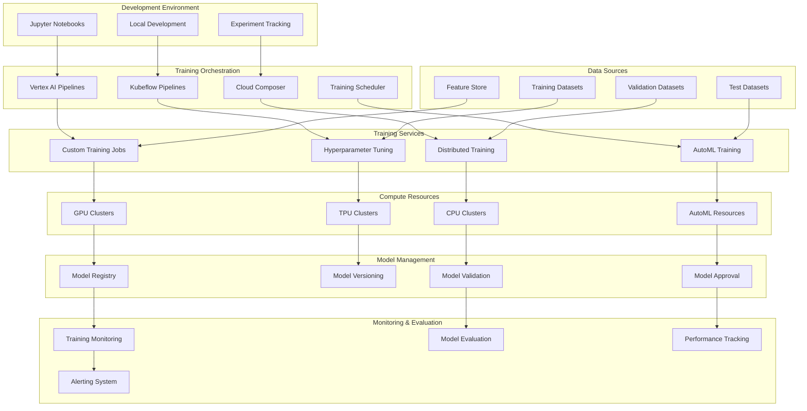

# Training Infrastructure Architecture

## Overview

The Training Infrastructure Architecture provides automated, scalable, and robust ML model training capabilities for the IPO valuation platform. This architecture implements MLOps best practices including automated training pipelines, hyperparameter optimization, distributed training, and continuous integration for ML models.

## Architecture Components

### 1. Training Infrastructure Overview



## Automated Model Training Pipelines

### 1. Vertex AI Pipeline for Model Training

```python
import kfp
from kfp.v2 import dsl, compiler
from kfp.v2.dsl import component, pipeline, Input, Output, Dataset, Model, Metrics
from typing import Dict, Any, List, Optional
import json

@component(
    base_image="gcr.io/deeplearning-platform-release/tf2-gpu.2-8:latest",
    packages_to_install=["pandas", "scikit-learn", "joblib", "google-cloud-aiplatform"]
)
def data_preprocessing_component(
    input_dataset: Input[Dataset],
    preprocessing_config: Dict[str, Any],
    processed_dataset: Output[Dataset],
    preprocessing_metrics: Output[Metrics]
) -> Dict[str, Any]:
    """Data preprocessing component"""
    
    import pandas as pd
    import numpy as np
    from sklearn.preprocessing import StandardScaler, LabelEncoder
    from sklearn.model_selection import train_test_split
    import joblib
    import json
    
    # Load data
    df = pd.read_csv(input_dataset.path)
    
    # Data cleaning
    initial_rows = len(df)
    
    # Remove duplicates
    df = df.drop_duplicates()
    
    # Handle missing values
    missing_strategy = preprocessing_config.get('missing_strategy', 'drop')
    if missing_strategy == 'drop':
        df = df.dropna()
    elif missing_strategy == 'fill_mean':
        numeric_columns = df.select_dtypes(include=[np.number]).columns
        df[numeric_columns] = df[numeric_columns].fillna(df[numeric_columns].mean())
    
    # Feature scaling
    feature_columns = preprocessing_config.get('feature_columns', [])
    if feature_columns:
        scaler = StandardScaler()
        df[feature_columns] = scaler.fit_transform(df[feature_columns])
        
        # Save scaler for later use
        scaler_path = f"{processed_dataset.path}_scaler.joblib"
        joblib.dump(scaler, scaler_path)
    
    # Encode categorical variables
    categorical_columns = preprocessing_config.get('categorical_columns', [])
    encoders = {}
    for col in categorical_columns:
        if col in df.columns:
            encoder = LabelEncoder()
            df[col] = encoder.fit_transform(df[col].astype(str))
            encoders[col] = encoder
    
    # Save encoders
    if encoders:
        encoders_path = f"{processed_dataset.path}_encoders.joblib"
        joblib.dump(encoders, encoders_path)
    
    # Train/validation/test split
    train_size = preprocessing_config.get('train_size', 0.7)
    val_size = preprocessing_config.get('val_size', 0.15)
    test_size = 1 - train_size - val_size
    
    # First split: train + val, test
    train_val_df, test_df = train_test_split(
        df, test_size=test_size, random_state=42, stratify=None
    )
    
    # Second split: train, val
    val_size_adjusted = val_size / (train_size + val_size)
    train_df, val_df = train_test_split(
        train_val_df, test_size=val_size_adjusted, random_state=42
    )
    
    # Save datasets
    train_df.to_csv(f"{processed_dataset.path}_train.csv", index=False)
    val_df.to_csv(f"{processed_dataset.path}_val.csv", index=False)
    test_df.to_csv(f"{processed_dataset.path}_test.csv", index=False)
    
    # Calculate preprocessing metrics
    metrics = {
        'initial_rows': initial_rows,
        'final_rows': len(df),
        'rows_removed': initial_rows - len(df),
        'removal_percentage': ((initial_rows - len(df)) / initial_rows) * 100,
        'train_size': len(train_df),
        'val_size': len(val_df),
        'test_size': len(test_df),
        'feature_columns_count': len(feature_columns),
        'categorical_columns_count': len(categorical_columns)
    }
    
    # Save metrics
    with open(preprocessing_metrics.path, 'w') as f:
        json.dump(metrics, f)
    
    return metrics

@component(
    base_image="gcr.io/deeplearning-platform-release/tf2-gpu.2-8:latest",
    packages_to_install=["pandas", "scikit-learn", "xgboost", "lightgbm", "joblib"]
)
def model_training_component(
    train_dataset: Input[Dataset],
    val_dataset: Input[Dataset],
    training_config: Dict[str, Any],
    trained_model: Output[Model],
    training_metrics: Output[Metrics]
) -> Dict[str, Any]:
    """Model training component with multiple algorithms"""
    
    import pandas as pd
    import numpy as np
    from sklearn.ensemble import RandomForestRegressor, GradientBoostingRegressor
    from sklearn.linear_model import LinearRegression, Ridge
    from sklearn.metrics import mean_squared_error, mean_absolute_error, r2_score
    from sklearn.model_selection import cross_val_score
    import xgboost as xgb
    import lightgbm as lgb
    import joblib
    import json
    from datetime import datetime
    
    # Load training and validation data
    train_df = pd.read_csv(f"{train_dataset.path}_train.csv")
    val_df = pd.read_csv(f"{val_dataset.path}_val.csv")
    
    # Prepare features and targets
    feature_columns = training_config.get('feature_columns', [])
    target_column = training_config.get('target_column', 'target')
    
    X_train = train_df[feature_columns]
    y_train = train_df[target_column]
    X_val = val_df[feature_columns]
    y_val = val_df[target_column]
    
    # Model selection
    model_type = training_config.get('model_type', 'random_forest')
    model_params = training_config.get('model_params', {})
    
    models = {
        'random_forest': RandomForestRegressor(**model_params),
        'gradient_boosting': GradientBoostingRegressor(**model_params),
        'linear_regression': LinearRegression(**model_params),
        'ridge': Ridge(**model_params),
        'xgboost': xgb.XGBRegressor(**model_params),
        'lightgbm': lgb.LGBMRegressor(**model_params)
    }
    
    if model_type not in models:
        raise ValueError(f"Unsupported model type: {model_type}")
    
    model = models[model_type]
    
    # Train model
    training_start = datetime.utcnow()
    model.fit(X_train, y_train)
    training_duration = (datetime.utcnow() - training_start).total_seconds()
    
    # Evaluate model
    train_pred = model.predict(X_train)
    val_pred = model.predict(X_val)
    
    # Calculate metrics
    train_metrics = {
        'mse': mean_squared_error(y_train, train_pred),
        'mae': mean_absolute_error(y_train, train_pred),
        'r2': r2_score(y_train, train_pred)
    }
    
    val_metrics = {
        'mse': mean_squared_error(y_val, val_pred),
        'mae': mean_absolute_error(y_val, val_pred),
        'r2': r2_score(y_val, val_pred)
    }
    
    # Cross-validation
    cv_scores = cross_val_score(model, X_train, y_train, cv=5, scoring='neg_mean_absolute_error')
    
    # Feature importance (if available)
    feature_importance = {}
    if hasattr(model, 'feature_importances_'):
        feature_importance = {
            feature: float(importance)
            for feature, importance in zip(feature_columns, model.feature_importances_)
        }
    
    # Compile training metrics
    training_results = {
        'model_type': model_type,
        'training_duration_seconds': training_duration,
        'train_metrics': train_metrics,
        'val_metrics': val_metrics,
        'cv_scores': {
            'mean': float(np.mean(cv_scores)),
            'std': float(np.std(cv_scores)),
            'scores': cv_scores.tolist()
        },
        'feature_importance': feature_importance,
        'model_params': model_params,
        'training_timestamp': training_start.isoformat(),
        'data_info': {
            'train_samples': len(train_df),
            'val_samples': len(val_df),
            'feature_count': len(feature_columns)
        }
    }
    
    # Save model
    model_path = f"{trained_model.path}/model.joblib"
    joblib.dump(model, model_path)
    
    # Save training metadata
    metadata_path = f"{trained_model.path}/metadata.json"
    with open(metadata_path, 'w') as f:
        json.dump(training_results, f, indent=2)
    
    # Save metrics for pipeline
    with open(training_metrics.path, 'w') as f:
        json.dump(training_results, f, indent=2)
    
    return training_results

@component(
    base_image="gcr.io/deeplearning-platform-release/tf2-gpu.2-8:latest",
    packages_to_install=["pandas", "scikit-learn", "joblib"]
)
def model_evaluation_component(
    trained_model: Input[Model],
    test_dataset: Input[Dataset],
    evaluation_config: Dict[str, Any],
    evaluation_metrics: Output[Metrics],
    model_approval: Output[str]
) -> Dict[str, Any]:
    """Model evaluation and approval component"""
    
    import pandas as pd
    import numpy as np
    from sklearn.metrics import (
        mean_squared_error, mean_absolute_error, r2_score,
        mean_absolute_percentage_error
    )
    import joblib
    import json
    
    # Load model and test data
    model = joblib.load(f"{trained_model.path}/model.joblib")
    test_df = pd.read_csv(f"{test_dataset.path}_test.csv")
    
    # Load model metadata
    with open(f"{trained_model.path}/metadata.json", 'r') as f:
        model_metadata = json.load(f)
    
    # Prepare test data
    feature_columns = evaluation_config.get('feature_columns', [])
    target_column = evaluation_config.get('target_column', 'target')
    
    X_test = test_df[feature_columns]
    y_test = test_df[target_column]
    
    # Make predictions
    y_pred = model.predict(X_test)
    
    # Calculate comprehensive evaluation metrics
    evaluation_results = {
        'test_metrics': {
            'mse': float(mean_squared_error(y_test, y_pred)),
            'rmse': float(np.sqrt(mean_squared_error(y_test, y_pred))),
            'mae': float(mean_absolute_error(y_test, y_pred)),
            'mape': float(mean_absolute_percentage_error(y_test, y_pred)),
            'r2': float(r2_score(y_test, y_pred))
        },
        'prediction_analysis': {
            'mean_prediction': float(np.mean(y_pred)),
            'std_prediction': float(np.std(y_pred)),
            'min_prediction': float(np.min(y_pred)),
            'max_prediction': float(np.max(y_pred))
        },
        'residual_analysis': {
            'mean_residual': float(np.mean(y_test - y_pred)),
            'std_residual': float(np.std(y_test - y_pred))
        },
        'test_data_info': {
            'test_samples': len(test_df),
            'feature_count': len(feature_columns)
        },
        'evaluation_timestamp': datetime.utcnow().isoformat()
    }
    
    # Model approval logic
    approval_criteria = evaluation_config.get('approval_criteria', {})
    
    min_r2 = approval_criteria.get('min_r2', 0.7)
    max_mae = approval_criteria.get('max_mae', 0.15)
    max_mape = approval_criteria.get('max_mape', 0.20)
    
    test_metrics = evaluation_results['test_metrics']
    
    approval_checks = {
        'r2_check': test_metrics['r2'] >= min_r2,
        'mae_check': test_metrics['mae'] <= max_mae,
        'mape_check': test_metrics['mape'] <= max_mape
    }
    
    # Overall approval decision
    model_approved = all(approval_checks.values())
    
    approval_result = {
        'approved': model_approved,
        'approval_checks': approval_checks,
        'approval_criteria': approval_criteria,
        'approval_timestamp': datetime.utcnow().isoformat()
    }
    
    # Combine results
    final_results = {
        **evaluation_results,
        'approval': approval_result,
        'model_metadata': model_metadata
    }
    
    # Save evaluation metrics
    with open(evaluation_metrics.path, 'w') as f:
        json.dump(final_results, f, indent=2)
    
    # Output approval decision
    with open(model_approval.path, 'w') as f:
        f.write("approved" if model_approved else "rejected")
    
    return final_results

@component(
    base_image="gcr.io/deeplearning-platform-release/tf2-gpu.2-8:latest",
    packages_to_install=["google-cloud-aiplatform", "joblib"]
)
def model_deployment_component(
    trained_model: Input[Model],
    model_approval: Input[str],
    deployment_config: Dict[str, Any],
    deployment_result: Output[str]
) -> Dict[str, Any]:
    """Model deployment component"""
    
    import json
    from google.cloud import aiplatform
    
    # Check if model is approved
    with open(model_approval.path, 'r') as f:
        approval_status = f.read().strip()
    
    if approval_status != "approved":
        result = {
            'deployed': False,
            'reason': 'Model not approved for deployment',
            'timestamp': datetime.utcnow().isoformat()
        }
        
        with open(deployment_result.path, 'w') as f:
            json.dump(result, f)
        
        return result
    
    # Initialize Vertex AI
    project_id = deployment_config['project_id']
    region = deployment_config['region']
    aiplatform.init(project=project_id, location=region)
    
    # Upload model to Model Registry
    model_name = deployment_config['model_name']
    model_description = deployment_config.get('description', '')
    
    # Load model metadata
    with open(f"{trained_model.path}/metadata.json", 'r') as f:
        model_metadata = json.load(f)
    
    try:
        # Upload model
        vertex_model = aiplatform.Model.upload(
            display_name=model_name,
            artifact_uri=trained_model.path,
            serving_container_image_uri=deployment_config['serving_image'],
            description=model_description,
            labels={
                'model_type': model_metadata['model_type'],
                'version': deployment_config.get('version', '1.0'),
                'environment': deployment_config.get('environment', 'staging')
            }
        )
        
        # Deploy to endpoint if specified
        endpoint_name = deployment_config.get('endpoint_name')
        if endpoint_name:
            # Get or create endpoint
            try:
                endpoint = aiplatform.Endpoint(endpoint_name)
            except Exception:
                endpoint = aiplatform.Endpoint.create(
                    display_name=endpoint_name,
                    description=f"Endpoint for {model_name}"
                )
            
            # Deploy model to endpoint
            endpoint.deploy(
                model=vertex_model,
                traffic_percentage=deployment_config.get('traffic_percentage', 100),
                machine_type=deployment_config.get('machine_type', 'n1-standard-2'),
                min_replica_count=deployment_config.get('min_replicas', 1),
                max_replica_count=deployment_config.get('max_replicas', 5)
            )
            
            deployment_info = {
                'endpoint_name': endpoint.display_name,
                'endpoint_id': endpoint.name,
                'traffic_percentage': deployment_config.get('traffic_percentage', 100)
            }
        else:
            deployment_info = {'endpoint_name': None}
        
        result = {
            'deployed': True,
            'model_name': vertex_model.display_name,
            'model_id': vertex_model.name,
            'model_uri': vertex_model.uri,
            'deployment_info': deployment_info,
            'timestamp': datetime.utcnow().isoformat()
        }
        
    except Exception as e:
        result = {
            'deployed': False,
            'error': str(e),
            'timestamp': datetime.utcnow().isoformat()
        }
    
    # Save deployment result
    with open(deployment_result.path, 'w') as f:
        json.dump(result, f)
    
    return result

@pipeline(
    name="ipo-valuation-training-pipeline",
    description="Complete training pipeline for IPO valuation models"
)
def ipo_valuation_training_pipeline(
    input_data_uri: str,
    model_type: str = "random_forest",
    feature_columns: List[str] = None,
    target_column: str = "valuation",
    model_name: str = "ipo-valuation-model",
    deployment_environment: str = "staging"
):
    """Complete training pipeline for IPO valuation models"""
    
    from kfp.v2.dsl import importer
    
    # Import input dataset
    input_dataset = importer(
        artifact_uri=input_data_uri,
        artifact_class=Dataset,
        reimport=False
    ).output
    
    # Preprocessing configuration
    preprocessing_config = {
        'feature_columns': feature_columns or [
            'revenue', 'growth_rate', 'profit_margin', 'debt_ratio'
        ],
        'categorical_columns': ['sector', 'market_cap_category'],
        'missing_strategy': 'fill_mean',
        'train_size': 0.7,
        'val_size': 0.15
    }
    
    # Data preprocessing
    preprocessing_task = data_preprocessing_component(
        input_dataset=input_dataset,
        preprocessing_config=preprocessing_config
    )
    
    # Training configuration
    training_config = {
        'model_type': model_type,
        'feature_columns': preprocessing_config['feature_columns'],
        'target_column': target_column,
        'model_params': {
            'n_estimators': 100,
            'max_depth': 10,
            'random_state': 42
        } if model_type == 'random_forest' else {}
    }
    
    # Model training
    training_task = model_training_component(
        train_dataset=preprocessing_task.outputs['processed_dataset'],
        val_dataset=preprocessing_task.outputs['processed_dataset'],
        training_config=training_config
    )
    
    # Model evaluation
    evaluation_config = {
        'feature_columns': preprocessing_config['feature_columns'],
        'target_column': target_column,
        'approval_criteria': {
            'min_r2': 0.75,
            'max_mae': 0.10,
            'max_mape': 0.15
        }
    }
    
    evaluation_task = model_evaluation_component(
        trained_model=training_task.outputs['trained_model'],
        test_dataset=preprocessing_task.outputs['processed_dataset'],
        evaluation_config=evaluation_config
    )
    
    # Model deployment
    deployment_config = {
        'project_id': 'ipo-valuation-project',
        'region': 'us-central1',
        'model_name': model_name,
        'description': f'{model_type} model for IPO valuation',
        'serving_image': 'gcr.io/cloud-aiplatform/prediction/sklearn-cpu.0-24:latest',
        'version': '1.0',
        'environment': deployment_environment,
        'endpoint_name': f'{model_name}-endpoint' if deployment_environment == 'production' else None,
        'machine_type': 'n1-standard-2',
        'min_replicas': 1,
        'max_replicas': 10
    }
    
    deployment_task = model_deployment_component(
        trained_model=training_task.outputs['trained_model'],
        model_approval=evaluation_task.outputs['model_approval'],
        deployment_config=deployment_config
    )
    
    # Set task dependencies
    training_task.after(preprocessing_task)
    evaluation_task.after(training_task)
    deployment_task.after(evaluation_task)

# Compile pipeline
def compile_training_pipeline():
    """Compile the training pipeline"""
    compiler.Compiler().compile(
        pipeline_func=ipo_valuation_training_pipeline,
        package_path="ipo_valuation_training_pipeline.json"
    )
```

### 2. Hyperparameter Optimization Workflows

```python
from google.cloud import aiplatform
from google.cloud.aiplatform import hyperparameter_tuning as hpt
from typing import Dict, List, Any, Optional
import json
from datetime import datetime

class HyperparameterOptimizer:
    """Manages hyperparameter optimization for ML models"""
    
    def __init__(self, project_id: str, region: str = "us-central1"):
        self.project_id = project_id
        self.region = region
        
        # Initialize Vertex AI
        aiplatform.init(project=project_id, location=region)
    
    def create_hyperparameter_tuning_job(
        self,
        job_id: str,
        model_type: str,
        training_script_path: str,
        parameter_spec: Dict[str, Any],
        training_data_uri: str,
        validation_data_uri: str,
        optimization_goal: str = "minimize",
        optimization_metric: str = "val_mae",
        max_trial_count: int = 20,
        parallel_trial_count: int = 4
    ) -> Dict[str, Any]:
        """Create hyperparameter tuning job"""
        
        # Define hyperparameter search space
        hyperparameter_spec = self._create_hyperparameter_spec(
            model_type, parameter_spec
        )
        
        # Training job specification
        worker_pool_specs = [{
            "machine_spec": {
                "machine_type": "n1-standard-4",
                "accelerator_type": aiplatform.gapic.AcceleratorType.NVIDIA_TESLA_T4,
                "accelerator_count": 1
            },
            "replica_count": 1,
            "python_package_spec": {
                "executor_image_uri": "gcr.io/cloud-aiplatform/training/tf-gpu.2-8:latest",
                "package_uris": [training_script_path],
                "python_module": "trainer.task",
                "args": [
                    f"--training_data_uri={training_data_uri}",
                    f"--validation_data_uri={validation_data_uri}",
                    f"--model_type={model_type}"
                ]
            }
        }]
        
        # Create hyperparameter tuning job
        job = aiplatform.HyperparameterTuningJob(
            display_name=f"{job_id}-hyperparameter-tuning",
            optimization_objective=optimization_metric,
            optimization_goal=optimization_goal,
            parameter_spec=hyperparameter_spec,
            max_trial_count=max_trial_count,
            parallel_trial_count=parallel_trial_count,
            worker_pool_specs=worker_pool_specs,
            labels={
                'model_type': model_type,
                'optimization_metric': optimization_metric,
                'created_by': 'automated_training'
            }
        )
        
        # Submit job
        job.submit()
        
        return {
            'job_id': job_id,
            'vertex_job_name': job.resource_name,
            'status': 'submitted',
            'optimization_metric': optimization_metric,
            'max_trials': max_trial_count,
            'submission_timestamp': datetime.utcnow().isoformat()
        }
    
    def _create_hyperparameter_spec(
        self,
        model_type: str,
        parameter_spec: Dict[str, Any]
    ) -> Dict[str, hpt.ParameterSpec]:
        """Create hyperparameter specification for different model types"""
        
        if model_type == "random_forest":
            return {
                "n_estimators": hpt.IntegerParameterSpec(
                    min_value=50, max_value=300, scale=hpt.ScaleType.LINEAR
                ),
                "max_depth": hpt.IntegerParameterSpec(
                    min_value=5, max_value=30, scale=hpt.ScaleType.LINEAR
                ),
                "min_samples_split": hpt.IntegerParameterSpec(
                    min_value=2, max_value=20, scale=hpt.ScaleType.LINEAR
                ),
                "min_samples_leaf": hpt.IntegerParameterSpec(
                    min_value=1, max_value=10, scale=hpt.ScaleType.LINEAR
                )
            }
        
        elif model_type == "xgboost":
            return {
                "n_estimators": hpt.IntegerParameterSpec(
                    min_value=100, max_value=500, scale=hpt.ScaleType.LINEAR
                ),
                "max_depth": hpt.IntegerParameterSpec(
                    min_value=3, max_value=15, scale=hpt.ScaleType.LINEAR
                ),
                "learning_rate": hpt.DoubleParameterSpec(
                    min_value=0.01, max_value=0.3, scale=hpt.ScaleType.LOG
                ),
                "subsample": hpt.DoubleParameterSpec(
                    min_value=0.6, max_value=1.0, scale=hpt.ScaleType.LINEAR
                ),
                "colsample_bytree": hpt.DoubleParameterSpec(
                    min_value=0.6, max_value=1.0, scale=hpt.ScaleType.LINEAR
                )
            }
        
        elif model_type == "neural_network":
            return {
                "hidden_units": hpt.DiscreteParameterSpec(
                    values=[64, 128, 256, 512], scale=hpt.ScaleType.LINEAR
                ),
                "learning_rate": hpt.DoubleParameterSpec(
                    min_value=0.0001, max_value=0.01, scale=hpt.ScaleType.LOG
                ),
                "dropout_rate": hpt.DoubleParameterSpec(
                    min_value=0.1, max_value=0.5, scale=hpt.ScaleType.LINEAR
                ),
                "batch_size": hpt.DiscreteParameterSpec(
                    values=[16, 32, 64, 128], scale=hpt.ScaleType.LINEAR
                ),
                "num_layers": hpt.IntegerParameterSpec(
                    min_value=2, max_value=6, scale=hpt.ScaleType.LINEAR
                )
            }
        
        else:
            # Default parameter spec
            return parameter_spec or {}
    
    def get_tuning_results(
        self,
        job_name: str
    ) -> Dict[str, Any]:
        """Get results from hyperparameter tuning job"""
        
        try:
            job = aiplatform.HyperparameterTuningJob.get(job_name)
            
            if job.state != aiplatform.gapic.JobState.JOB_STATE_SUCCEEDED:
                return {
                    'status': job.state,
                    'error': 'Job not completed successfully'
                }
            
            # Get best trial
            best_trial = None
            best_metric_value = float('inf')
            
            for trial in job.trials:
                if trial.final_measurement and trial.final_measurement.metrics:
                    metric_value = trial.final_measurement.metrics[0].value
                    if metric_value < best_metric_value:
                        best_metric_value = metric_value
                        best_trial = trial
            
            if best_trial:
                best_parameters = {
                    param.parameter_id: param.value
                    for param in best_trial.parameters
                }
                
                return {
                    'status': 'completed',
                    'best_trial_id': best_trial.id,
                    'best_metric_value': best_metric_value,
                    'best_parameters': best_parameters,
                    'total_trials': len(job.trials),
                    'completion_time': job.end_time.isoformat() if job.end_time else None
                }
            else:
                return {
                    'status': 'completed',
                    'error': 'No successful trials found'
                }
                
        except Exception as e:
            return {
                'status': 'error',
                'error': str(e)
            }
    
    def create_optimization_study(
        self,
        study_name: str,
        model_configs: List[Dict[str, Any]],
        optimization_budget: int = 100
    ) -> Dict[str, Any]:
        """Create comprehensive optimization study across multiple models"""
        
        study_results = {
            'study_name': study_name,
            'total_models': len(model_configs),
            'optimization_budget': optimization_budget,
            'start_time': datetime.utcnow().isoformat(),
            'model_results': [],
            'best_overall_model': None,
            'status': 'running'
        }
        
        # Distribute budget across models
        budget_per_model = optimization_budget // len(model_configs)
        
        for i, model_config in enumerate(model_configs):
            model_type = model_config['model_type']
            
            # Create hyperparameter tuning job for this model
            job_result = self.create_hyperparameter_tuning_job(
                job_id=f"{study_name}-{model_type}-{i}",
                model_type=model_type,
                training_script_path=model_config['training_script_path'],
                parameter_spec=model_config.get('parameter_spec', {}),
                training_data_uri=model_config['training_data_uri'],
                validation_data_uri=model_config['validation_data_uri'],
                max_trial_count=budget_per_model,
                parallel_trial_count=model_config.get('parallel_trials', 2)
            )
            
            study_results['model_results'].append({
                'model_type': model_type,
                'job_result': job_result,
                'allocated_trials': budget_per_model
            })
        
        return study_results
```

### 3. Distributed Training Architecture

```python
from google.cloud import aiplatform
from google.cloud.aiplatform import training
from typing import Dict, List, Any, Optional
import tensorflow as tf
import json

class DistributedTrainingManager:
    """Manages distributed training for large-scale ML models"""
    
    def __init__(self, project_id: str, region: str = "us-central1"):
        self.project_id = project_id
        self.region = region
        
        aiplatform.init(project=project_id, location=region)
    
    def create_distributed_training_job(
        self,
        job_id: str,
        training_script_uri: str,
        training_data_uri: str,
        model_type: str = "tensorflow",
        distribution_strategy: str = "multi_worker_mirrored",
        worker_count: int = 4,
        machine_type: str = "n1-standard-8",
        accelerator_type: str = "NVIDIA_TESLA_V100",
        accelerator_count: int = 1
    ) -> Dict[str, Any]:
        """Create distributed training job"""
        
        # Configure worker pool for distributed training
        worker_pool_specs = []
        
        if distribution_strategy == "multi_worker_mirrored":
            # Chief worker
            worker_pool_specs.append({
                "machine_spec": {
                    "machine_type": machine_type,
                    "accelerator_type": getattr(
                        aiplatform.gapic.AcceleratorType, accelerator_type
                    ),
                    "accelerator_count": accelerator_count
                },
                "replica_count": 1,
                "python_package_spec": {
                    "executor_image_uri": self._get_training_image(model_type),
                    "package_uris": [training_script_uri],
                    "python_module": "trainer.distributed_task",
                    "args": [
                        f"--training_data_uri={training_data_uri}",
                        f"--model_type={model_type}",
                        f"--distribution_strategy={distribution_strategy}",
                        f"--worker_count={worker_count}",
                        "--job_type=chief"
                    ]
                }
            })
            
            # Worker nodes
            if worker_count > 1:
                worker_pool_specs.append({
                    "machine_spec": {
                        "machine_type": machine_type,
                        "accelerator_type": getattr(
                            aiplatform.gapic.AcceleratorType, accelerator_type
                        ),
                        "accelerator_count": accelerator_count
                    },
                    "replica_count": worker_count - 1,
                    "python_package_spec": {
                        "executor_image_uri": self._get_training_image(model_type),
                        "package_uris": [training_script_uri],
                        "python_module": "trainer.distributed_task",
                        "args": [
                            f"--training_data_uri={training_data_uri}",
                            f"--model_type={model_type}",
                            f"--distribution_strategy={distribution_strategy}",
                            f"--worker_count={worker_count}",
                            "--job_type=worker"
                        ]
                    }
                })
        
        elif distribution_strategy == "parameter_server":
            # Parameter server setup
            worker_pool_specs.append({
                "machine_spec": {
                    "machine_type": "n1-highmem-4"
                },
                "replica_count": 2,  # Parameter servers
                "python_package_spec": {
                    "executor_image_uri": self._get_training_image(model_type),
                    "package_uris": [training_script_uri],
                    "python_module": "trainer.distributed_task",
                    "args": [
                        f"--training_data_uri={training_data_uri}",
                        f"--model_type={model_type}",
                        f"--distribution_strategy={distribution_strategy}",
                        "--job_type=ps"
                    ]
                }
            })
            
            # Worker nodes
            worker_pool_specs.append({
                "machine_spec": {
                    "machine_type": machine_type,
                    "accelerator_type": getattr(
                        aiplatform.gapic.AcceleratorType, accelerator_type
                    ),
                    "accelerator_count": accelerator_count
                },
                "replica_count": worker_count,
                "python_package_spec": {
                    "executor_image_uri": self._get_training_image(model_type),
                    "package_uris": [training_script_uri],
                    "python_module": "trainer.distributed_task",
                    "args": [
                        f"--training_data_uri={training_data_uri}",
                        f"--model_type={model_type}",
                        f"--distribution_strategy={distribution_strategy}",
                        "--job_type=worker"
                    ]
                }
            })
        
        # Create and submit training job
        job = aiplatform.CustomJob(
            display_name=f"{job_id}-distributed-training",
            worker_pool_specs=worker_pool_specs,
            base_output_dir=f"gs://{self.project_id}-ml-training-output/{job_id}",
            labels={
                'job_type': 'distributed_training',
                'model_type': model_type,
                'distribution_strategy': distribution_strategy
            }
        )
        
        job.submit()
        
        return {
            'job_id': job_id,
            'vertex_job_name': job.resource_name,
            'distribution_strategy': distribution_strategy,
            'worker_count': worker_count,
            'submission_timestamp': datetime.utcnow().isoformat(),
            'status': 'submitted'
        }
    
    def _get_training_image(self, model_type: str) -> str:
        """Get appropriate training image for model type"""
        
        images = {
            "tensorflow": "gcr.io/cloud-aiplatform/training/tf-gpu.2-8:latest",
            "pytorch": "gcr.io/cloud-aiplatform/training/pytorch-gpu.1-9:latest",
            "scikit-learn": "gcr.io/cloud-aiplatform/training/sklearn-cpu.0-24:latest",
            "xgboost": "gcr.io/cloud-aiplatform/training/xgboost-cpu.1-4:latest"
        }
        
        return images.get(model_type, images["scikit-learn"])
    
    def monitor_distributed_training(
        self,
        job_name: str
    ) -> Dict[str, Any]:
        """Monitor distributed training job progress"""
        
        try:
            job = aiplatform.CustomJob.get(job_name)
            
            # Get job details
            job_info = {
                'job_name': job.display_name,
                'state': job.state.name if job.state else 'unknown',
                'create_time': job.create_time.isoformat() if job.create_time else None,
                'start_time': job.start_time.isoformat() if job.start_time else None,
                'end_time': job.end_time.isoformat() if job.end_time else None,
                'worker_pools': []
            }
            
            # Get worker pool information
            for i, pool_spec in enumerate(job.job_spec.worker_pool_specs):
                pool_info = {
                    'pool_index': i,
                    'machine_type': pool_spec.machine_spec.machine_type,
                    'replica_count': pool_spec.replica_count,
                    'accelerator_type': (
                        pool_spec.machine_spec.accelerator_type.name
                        if pool_spec.machine_spec.accelerator_type
                        else None
                    ),
                    'accelerator_count': (
                        pool_spec.machine_spec.accelerator_count
                        if pool_spec.machine_spec.accelerator_count
                        else 0
                    )
                }
                job_info['worker_pools'].append(pool_info)
            
            # Calculate training duration
            if job.start_time and job.end_time:
                duration = (job.end_time - job.start_time).total_seconds()
                job_info['training_duration_seconds'] = duration
            elif job.start_time:
                duration = (datetime.utcnow() - job.start_time.replace(tzinfo=None)).total_seconds()
                job_info['elapsed_time_seconds'] = duration
            
            return job_info
            
        except Exception as e:
            return {
                'error': str(e),
                'job_name': job_name
            }
    
    def setup_distributed_training_environment(
        self,
        cluster_config: Dict[str, Any]
    ) -> Dict[str, Any]:
        """Setup distributed training environment"""
        
        environment_config = {
            'cluster_spec': {
                'chief': [f"chief-{i}:2222" for i in range(1)],
                'worker': [f"worker-{i}:2222" for i in range(cluster_config.get('worker_count', 3))],
                'ps': [f"ps-{i}:2222" for i in range(cluster_config.get('ps_count', 2))]
            },
            'environment_variables': {
                'TF_CONFIG': None,  # Will be set dynamically per worker
                'CUDA_VISIBLE_DEVICES': '0',
                'NCCL_DEBUG': 'INFO'
            },
            'resource_allocation': {
                'chief': {
                    'cpu': '4',
                    'memory': '16Gi',
                    'gpu': '1'
                },
                'worker': {
                    'cpu': '4',
                    'memory': '16Gi',
                    'gpu': '1'
                },
                'ps': {
                    'cpu': '2',
                    'memory': '8Gi',
                    'gpu': '0'
                }
            }
        }
        
        return environment_config

# Distributed training script template
def create_distributed_training_script() -> str:
    """Create distributed training script template"""
    
    return '''
import os
import json
import tensorflow as tf
from typing import Dict, Any
import argparse

def setup_distributed_strategy():
    """Setup distributed training strategy"""
    
    # Get TF_CONFIG from environment
    tf_config = os.environ.get('TF_CONFIG')
    if tf_config:
        tf_config = json.loads(tf_config)
        
        # Setup MultiWorkerMirroredStrategy
        strategy = tf.distribute.MultiWorkerMirroredStrategy()
        
        print(f"Number of replicas: {strategy.num_replicas_in_sync}")
        print(f"Cluster resolver: {tf_config}")
        
        return strategy
    else:
        # Single worker training
        return tf.distribute.get_strategy()

def create_model(strategy, model_config: Dict[str, Any]):
    """Create model within distribution strategy scope"""
    
    with strategy.scope():
        model = tf.keras.Sequential([
            tf.keras.layers.Dense(
                model_config.get('hidden_units', 128),
                activation='relu',
                input_shape=(model_config.get('input_dim', 10),)
            ),
            tf.keras.layers.Dropout(model_config.get('dropout_rate', 0.2)),
            tf.keras.layers.Dense(
                model_config.get('hidden_units', 128) // 2,
                activation='relu'
            ),
            tf.keras.layers.Dropout(model_config.get('dropout_rate', 0.2)),
            tf.keras.layers.Dense(1)  # Regression output
        ])
        
        model.compile(
            optimizer=tf.keras.optimizers.Adam(
                learning_rate=model_config.get('learning_rate', 0.001)
            ),
            loss='mse',
            metrics=['mae', 'mse']
        )
        
        return model

def train_distributed_model(
    strategy,
    model,
    train_dataset,
    val_dataset,
    training_config: Dict[str, Any]
):
    """Train model using distributed strategy"""
    
    # Distribute datasets
    train_dist_dataset = strategy.experimental_distribute_dataset(train_dataset)
    val_dist_dataset = strategy.experimental_distribute_dataset(val_dataset)
    
    # Setup callbacks
    callbacks = [
        tf.keras.callbacks.EarlyStopping(
            patience=training_config.get('early_stopping_patience', 10),
            restore_best_weights=True
        ),
        tf.keras.callbacks.ReduceLROnPlateau(
            factor=0.5,
            patience=5,
            min_lr=1e-7
        ),
        tf.keras.callbacks.ModelCheckpoint(
            filepath=training_config.get('checkpoint_path', './checkpoints/model_{epoch:02d}.h5'),
            save_best_only=True,
            monitor='val_loss'
        )
    ]
    
    # Add TensorBoard logging
    if training_config.get('enable_tensorboard', True):
        callbacks.append(
            tf.keras.callbacks.TensorBoard(
                log_dir=training_config.get('tensorboard_log_dir', './logs'),
                histogram_freq=1,
                write_graph=True,
                update_freq='epoch'
            )
        )
    
    # Train model
    history = model.fit(
        train_dist_dataset,
        epochs=training_config.get('epochs', 100),
        validation_data=val_dist_dataset,
        callbacks=callbacks,
        verbose=1
    )
    
    return model, history

def main():
    """Main training function"""
    
    parser = argparse.ArgumentParser()
    parser.add_argument('--training_data_uri', type=str, required=True)
    parser.add_argument('--model_type', type=str, default='tensorflow')
    parser.add_argument('--distribution_strategy', type=str, default='multi_worker_mirrored')
    parser.add_argument('--job_type', type=str, default='chief')
    
    args = parser.parse_args()
    
    # Setup distributed strategy
    strategy = setup_distributed_strategy()
    
    # Load and prepare data
    # (Data loading implementation would go here)
    
    # Create and train model
    model_config = {
        'hidden_units': 256,
        'dropout_rate': 0.3,
        'learning_rate': 0.001,
        'input_dim': 20
    }
    
    training_config = {
        'epochs': 100,
        'early_stopping_patience': 15,
        'enable_tensorboard': True
    }
    
    model = create_model(strategy, model_config)
    
    # Train model (dataset loading implementation needed)
    # trained_model, history = train_distributed_model(
    #     strategy, model, train_dataset, val_dataset, training_config
    # )
    
    # Save model
    model_output_path = os.environ.get('AIP_MODEL_DIR', './model_output')
    model.save(model_output_path)
    
    print(f"Model saved to: {model_output_path}")

if __name__ == '__main__':
    main()
'''
```

## Model Evaluation and Validation Frameworks

### 1. Comprehensive Model Evaluation Framework

```python
import numpy as np
import pandas as pd
from typing import Dict, List, Any, Optional, Tuple
from dataclasses import dataclass, field, asdict
from sklearn.metrics import (
    mean_squared_error, mean_absolute_error, r2_score,
    mean_absolute_percentage_error, explained_variance_score
)
from sklearn.model_selection import cross_val_score, TimeSeriesSplit
import scipy.stats as stats
from datetime import datetime
import joblib
import json

@dataclass
class ModelPerformanceMetrics:
    # Regression metrics
    mse: float
    rmse: float
    mae: float
    mape: float
    r2: float
    explained_variance: float
    
    # Business metrics
    mean_prediction_error_pct: float
    median_prediction_error_pct: float
    prediction_accuracy_within_10pct: float
    prediction_accuracy_within_20pct: float
    
    # Statistical metrics
    prediction_mean: float
    prediction_std: float
    residual_mean: float
    residual_std: float
    
    # Additional metadata
    sample_count: int
    feature_count: int
    evaluation_timestamp: datetime = field(default_factory=datetime.utcnow)

@dataclass
class CrossValidationResults:
    cv_scores: List[float]
    cv_mean: float
    cv_std: float
    cv_method: str
    fold_count: int
    individual_fold_metrics: List[Dict[str, float]] = field(default_factory=list)

@dataclass
class ModelValidationReport:
    model_id: str
    model_version: str
    model_type: str
    
    # Performance metrics
    train_performance: ModelPerformanceMetrics
    val_performance: ModelPerformanceMetrics
    test_performance: Optional[ModelPerformanceMetrics]
    
    # Cross-validation results
    cross_validation: CrossValidationResults
    
    # Model analysis
    feature_importance: Dict[str, float]
    prediction_intervals: Dict[str, Tuple[float, float]]
    model_stability: Dict[str, float]
    
    # Validation status
    validation_passed: bool
    validation_criteria: Dict[str, Any]
    validation_errors: List[str] = field(default_factory=list)
    
    # Metadata
    evaluation_timestamp: datetime = field(default_factory=datetime.utcnow)
    evaluator: str = "automated"
    evaluation_environment: str = "staging"

class ModelEvaluationFramework:
    """Comprehensive model evaluation and validation framework"""
    
    def __init__(self, validation_criteria: Optional[Dict[str, Any]] = None):
        self.validation_criteria = validation_criteria or self._get_default_criteria()
        self.evaluation_history = []
    
    def _get_default_criteria(self) -> Dict[str, Any]:
        """Get default validation criteria for IPO valuation models"""
        return {
            # Performance thresholds
            'min_r2': 0.75,
            'max_mae': 0.15,
            'max_mape': 0.20,
            'min_prediction_accuracy_10pct': 0.70,
            'min_prediction_accuracy_20pct': 0.85,
            
            # Cross-validation thresholds
            'min_cv_mean': 0.70,
            'max_cv_std': 0.10,
            
            # Stability thresholds
            'min_prediction_stability': 0.80,
            'max_residual_autocorrelation': 0.30,
            
            # Business logic thresholds
            'max_prediction_range_pct': 200,  # Predictions shouldn't vary by more than 200%
            'min_feature_importance_coverage': 0.80  # Top features should explain 80% of importance
        }
    
    async def evaluate_model(
        self,
        model: Any,
        train_data: Tuple[pd.DataFrame, pd.Series],
        val_data: Tuple[pd.DataFrame, pd.Series],
        test_data: Optional[Tuple[pd.DataFrame, pd.Series]] = None,
        model_metadata: Optional[Dict[str, Any]] = None
    ) -> ModelValidationReport:
        """Perform comprehensive model evaluation"""
        
        X_train, y_train = train_data
        X_val, y_val = val_data
        X_test, y_test = test_data if test_data else (None, None)
        
        # Get model metadata
        metadata = model_metadata or {}
        model_id = metadata.get('model_id', 'unknown')
        model_version = metadata.get('version', '1.0')
        model_type = metadata.get('model_type', 'unknown')
        
        # Calculate performance metrics for each dataset
        train_performance = self._calculate_performance_metrics(
            model, X_train, y_train, "training"
        )
        
        val_performance = self._calculate_performance_metrics(
            model, X_val, y_val, "validation"
        )
        
        test_performance = None
        if X_test is not None and y_test is not None:
            test_performance = self._calculate_performance_metrics(
                model, X_test, y_test, "test"
            )
        
        # Perform cross-validation
        cv_results = self._perform_cross_validation(
            model, X_train, y_train
        )
        
        # Analyze feature importance
        feature_importance = self._analyze_feature_importance(
            model, X_train.columns.tolist()
        )
        
        # Calculate prediction intervals
        prediction_intervals = self._calculate_prediction_intervals(
            model, X_val, y_val
        )
        
        # Assess model stability
        model_stability = self._assess_model_stability(
            model, X_val, y_val
        )
        
        # Validate against criteria
        validation_passed, validation_errors = self._validate_against_criteria(
            train_performance, val_performance, cv_results, model_stability
        )
        
        # Create validation report
        report = ModelValidationReport(
            model_id=model_id,
            model_version=model_version,
            model_type=model_type,
            train_performance=train_performance,
            val_performance=val_performance,
            test_performance=test_performance,
            cross_validation=cv_results,
            feature_importance=feature_importance,
            prediction_intervals=prediction_intervals,
            model_stability=model_stability,
            validation_passed=validation_passed,
            validation_criteria=self.validation_criteria,
            validation_errors=validation_errors
        )
        
        # Store evaluation history
        self.evaluation_history.append(report)
        
        return report
    
    def _calculate_performance_metrics(
        self,
        model: Any,
        X: pd.DataFrame,
        y: pd.Series,
        dataset_type: str
    ) -> ModelPerformanceMetrics:
        """Calculate comprehensive performance metrics"""
        
        # Make predictions
        y_pred = model.predict(X)
        
        # Basic regression metrics
        mse = mean_squared_error(y, y_pred)
        rmse = np.sqrt(mse)
        mae = mean_absolute_error(y, y_pred)
        mape = mean_absolute_percentage_error(y, y_pred)
        r2 = r2_score(y, y_pred)
        explained_var = explained_variance_score(y, y_pred)
        
        # Business-specific metrics
        prediction_errors_pct = np.abs((y - y_pred) / y) * 100
        mean_error_pct = np.mean(prediction_errors_pct)
        median_error_pct = np.median(prediction_errors_pct)
        
        # Accuracy within thresholds
        accuracy_10pct = np.mean(prediction_errors_pct <= 10)
        accuracy_20pct = np.mean(prediction_errors_pct <= 20)
        
        # Statistical properties
        pred_mean = np.mean(y_pred)
        pred_std = np.std(y_pred)
        residuals = y - y_pred
        residual_mean = np.mean(residuals)
        residual_std = np.std(residuals)
        
        return ModelPerformanceMetrics(
            mse=mse,
            rmse=rmse,
            mae=mae,
            mape=mape,
            r2=r2,
            explained_variance=explained_var,
            mean_prediction_error_pct=mean_error_pct,
            median_prediction_error_pct=median_error_pct,
            prediction_accuracy_within_10pct=accuracy_10pct,
            prediction_accuracy_within_20pct=accuracy_20pct,
            prediction_mean=pred_mean,
            prediction_std=pred_std,
            residual_mean=residual_mean,
            residual_std=residual_std,
            sample_count=len(X),
            feature_count=len(X.columns)
        )
    
    def _perform_cross_validation(
        self,
        model: Any,
        X: pd.DataFrame,
        y: pd.Series,
        cv_folds: int = 5
    ) -> CrossValidationResults:
        """Perform cross-validation analysis"""
        
        # Standard k-fold cross-validation
        cv_scores = cross_val_score(
            model, X, y, cv=cv_folds, scoring='neg_mean_absolute_error'
        )
        cv_scores = -cv_scores  # Convert back to positive MAE
        
        # Time series cross-validation (if applicable)
        ts_cv = TimeSeriesSplit(n_splits=cv_folds)
        ts_cv_scores = cross_val_score(
            model, X, y, cv=ts_cv, scoring='neg_mean_absolute_error'
        )
        ts_cv_scores = -ts_cv_scores
        
        # Individual fold analysis
        individual_metrics = []
        for i, (train_idx, val_idx) in enumerate(ts_cv.split(X)):
            X_fold_train, X_fold_val = X.iloc[train_idx], X.iloc[val_idx]
            y_fold_train, y_fold_val = y.iloc[train_idx], y.iloc[val_idx]
            
            # Clone and train model on fold
            fold_model = self._clone_model(model)
            fold_model.fit(X_fold_train, y_fold_train)
            
            # Evaluate on validation fold
            fold_metrics = self._calculate_performance_metrics(
                fold_model, X_fold_val, y_fold_val, f"fold_{i}"
            )
            
            individual_metrics.append({
                'fold': i,
                'mae': fold_metrics.mae,
                'r2': fold_metrics.r2,
                'mape': fold_metrics.mape
            })
        
        return CrossValidationResults(
            cv_scores=cv_scores.tolist(),
            cv_mean=float(np.mean(cv_scores)),
            cv_std=float(np.std(cv_scores)),
            cv_method="time_series_split",
            fold_count=cv_folds,
            individual_fold_metrics=individual_metrics
        )
    
    def _analyze_feature_importance(
        self,
        model: Any,
        feature_names: List[str]
    ) -> Dict[str, float]:
        """Analyze feature importance"""
        
        feature_importance = {}
        
        # Tree-based models
        if hasattr(model, 'feature_importances_'):
            for name, importance in zip(feature_names, model.feature_importances_):
                feature_importance[name] = float(importance)
        
        # Linear models
        elif hasattr(model, 'coef_'):
            coefficients = model.coef_
            if coefficients.ndim > 1:
                coefficients = coefficients[0]  # For multi-output case
            
            for name, coef in zip(feature_names, coefficients):
                feature_importance[name] = float(abs(coef))
        
        # Normalize importance scores
        if feature_importance:
            total_importance = sum(feature_importance.values())
            if total_importance > 0:
                feature_importance = {
                    name: importance / total_importance
                    for name, importance in feature_importance.items()
                }
        
        return feature_importance
    
    def _calculate_prediction_intervals(
        self,
        model: Any,
        X: pd.DataFrame,
        y: pd.Series,
        confidence_levels: List[float] = [0.68, 0.90, 0.95]
    ) -> Dict[str, Tuple[float, float]]:
        """Calculate prediction intervals at different confidence levels"""
        
        # Make predictions
        y_pred = model.predict(X)
        residuals = y - y_pred
        
        # Calculate residual standard deviation
        residual_std = np.std(residuals)
        
        intervals = {}
        
        for confidence in confidence_levels:
            # Calculate z-score for confidence level
            z_score = stats.norm.ppf((1 + confidence) / 2)
            
            # Calculate interval
            margin = z_score * residual_std
            
            # Calculate interval bounds across all predictions
            lower_bound = np.mean(y_pred) - margin
            upper_bound = np.mean(y_pred) + margin
            
            intervals[f'{confidence:.0%}'] = (float(lower_bound), float(upper_bound))
        
        return intervals
    
    def _assess_model_stability(
        self,
        model: Any,
        X: pd.DataFrame,
        y: pd.Series,
        perturbation_rounds: int = 10
    ) -> Dict[str, float]:
        """Assess model stability through perturbation analysis"""
        
        base_predictions = model.predict(X)
        perturbed_predictions = []
        
        # Add small random perturbations to input data
        for _ in range(perturbation_rounds):
            # Add 1% noise to numeric features
            X_perturbed = X.copy()
            numeric_columns = X.select_dtypes(include=[np.number]).columns
            
            for col in numeric_columns:
                noise = np.random.normal(0, 0.01 * X[col].std(), len(X))
                X_perturbed[col] = X[col] + noise
            
            # Make predictions with perturbed data
            perturbed_pred = model.predict(X_perturbed)
            perturbed_predictions.append(perturbed_pred)
        
        # Calculate stability metrics
        perturbed_predictions = np.array(perturbed_predictions)
        
        # Prediction stability (consistency across perturbations)
        pred_std_across_perturbations = np.std(perturbed_predictions, axis=0)
        mean_prediction_stability = 1 - np.mean(
            pred_std_across_perturbations / np.abs(base_predictions)
        )
        
        # Feature sensitivity analysis
        feature_sensitivities = {}
        for col in X.select_dtypes(include=[np.number]).columns:
            # Perturb single feature
            X_single_perturb = X.copy()
            X_single_perturb[col] = X[col] + np.random.normal(0, 0.05 * X[col].std(), len(X))
            
            single_perturb_pred = model.predict(X_single_perturb)
            sensitivity = np.mean(np.abs(single_perturb_pred - base_predictions))
            feature_sensitivities[col] = float(sensitivity)
        
        return {
            'prediction_stability': float(max(0, mean_prediction_stability)),
            'average_prediction_variance': float(np.mean(pred_std_across_perturbations)),
            'feature_sensitivities': feature_sensitivities,
            'stability_score': float(max(0, mean_prediction_stability))
        }
    
    def _validate_against_criteria(
        self,
        train_performance: ModelPerformanceMetrics,
        val_performance: ModelPerformanceMetrics,
        cv_results: CrossValidationResults,
        stability_metrics: Dict[str, float]
    ) -> Tuple[bool, List[str]]:
        """Validate model against predefined criteria"""
        
        validation_errors = []
        
        # Performance criteria
        if val_performance.r2 < self.validation_criteria['min_r2']:
            validation_errors.append(
                f"R² score {val_performance.r2:.3f} below minimum {self.validation_criteria['min_r2']}"
            )
        
        if val_performance.mae > self.validation_criteria['max_mae']:
            validation_errors.append(
                f"MAE {val_performance.mae:.3f} above maximum {self.validation_criteria['max_mae']}"
            )
        
        if val_performance.mape > self.validation_criteria['max_mape']:
            validation_errors.append(
                f"MAPE {val_performance.mape:.3f} above maximum {self.validation_criteria['max_mape']}"
            )
        
        # Business accuracy criteria
        if val_performance.prediction_accuracy_within_10pct < self.validation_criteria['min_prediction_accuracy_10pct']:
            validation_errors.append(
                f"10% accuracy {val_performance.prediction_accuracy_within_10pct:.3f} below minimum"
            )
        
        # Cross-validation criteria
        if cv_results.cv_mean < self.validation_criteria['min_cv_mean']:
            validation_errors.append(
                f"CV mean {cv_results.cv_mean:.3f} below minimum {self.validation_criteria['min_cv_mean']}"
            )
        
        if cv_results.cv_std > self.validation_criteria['max_cv_std']:
            validation_errors.append(
                f"CV std {cv_results.cv_std:.3f} above maximum {self.validation_criteria['max_cv_std']}"
            )
        
        # Stability criteria
        stability_score = stability_metrics.get('stability_score', 0)
        if stability_score < self.validation_criteria['min_prediction_stability']:
            validation_errors.append(
                f"Prediction stability {stability_score:.3f} below minimum"
            )
        
        # Overfitting check
        train_val_r2_diff = train_performance.r2 - val_performance.r2
        if train_val_r2_diff > 0.15:  # More than 15% difference suggests overfitting
            validation_errors.append(
                f"Potential overfitting detected: train R² {train_performance.r2:.3f} "
                f"vs val R² {val_performance.r2:.3f}"
            )
        
        validation_passed = len(validation_errors) == 0
        
        return validation_passed, validation_errors
    
    def _clone_model(self, model: Any) -> Any:
        """Clone model for cross-validation"""
        
        # For scikit-learn models
        if hasattr(model, 'get_params'):
            from sklearn.base import clone
            return clone(model)
        
        # For other models, try to create new instance
        model_class = type(model)
        if hasattr(model, 'get_params'):
            params = model.get_params()
            return model_class(**params)
        else:
            # Fallback: return the same model (not ideal for CV)
            return model
    
    def generate_evaluation_report(
        self,
        validation_report: ModelValidationReport
    ) -> Dict[str, Any]:
        """Generate human-readable evaluation report"""
        
        # Performance summary
        performance_summary = {
            'overall_score': (
                validation_report.val_performance.r2 * 0.4 +
                (1 - validation_report.val_performance.mape) * 0.3 +
                validation_report.val_performance.prediction_accuracy_within_10pct * 0.3
            ),
            'strengths': [],
            'weaknesses': [],
            'recommendations': []
        }
        
        # Identify strengths
        if validation_report.val_performance.r2 > 0.85:
            performance_summary['strengths'].append("Excellent predictive accuracy (R² > 0.85)")
        
        if validation_report.val_performance.prediction_accuracy_within_10pct > 0.80:
            performance_summary['strengths'].append("High business accuracy (80%+ predictions within 10%)")
        
        if validation_report.cross_validation.cv_std < 0.05:
            performance_summary['strengths'].append("Consistent performance across folds")
        
        # Identify weaknesses
        if validation_report.val_performance.mape > 0.25:
            performance_summary['weaknesses'].append("High percentage error (MAPE > 25%)")
        
        if len(validation_report.validation_errors) > 0:
            performance_summary['weaknesses'].append("Failed validation criteria")
        
        # Generate recommendations
        if not validation_report.validation_passed:
            performance_summary['recommendations'].append("Address validation errors before deployment")
        
        if validation_report.val_performance.r2 < validation_report.train_performance.r2 - 0.1:
            performance_summary['recommendations'].append("Consider regularization to reduce overfitting")
        
        if validation_report.model_stability['stability_score'] < 0.8:
            performance_summary['recommendations'].append("Improve model stability through ensemble methods")
        
        return {
            'model_info': {
                'model_id': validation_report.model_id,
                'model_version': validation_report.model_version,
                'model_type': validation_report.model_type
            },
            'validation_status': {
                'passed': validation_report.validation_passed,
                'errors_count': len(validation_report.validation_errors),
                'errors': validation_report.validation_errors
            },
            'performance_summary': performance_summary,
            'detailed_metrics': {
                'train': asdict(validation_report.train_performance),
                'validation': asdict(validation_report.val_performance),
                'test': asdict(validation_report.test_performance) if validation_report.test_performance else None,
                'cross_validation': asdict(validation_report.cross_validation)
            },
            'feature_analysis': {
                'feature_importance': validation_report.feature_importance,
                'top_features': sorted(
                    validation_report.feature_importance.items(),
                    key=lambda x: x[1],
                    reverse=True
                )[:10]
            },
            'stability_analysis': validation_report.model_stability,
            'prediction_intervals': validation_report.prediction_intervals,
            'evaluation_metadata': {
                'evaluation_timestamp': validation_report.evaluation_timestamp.isoformat(),
                'evaluator': validation_report.evaluator,
                'environment': validation_report.evaluation_environment
            }
        }
```

### 4. Continuous Integration for ML Models (MLOps)

```python
import subprocess
import os
from typing import Dict, List, Any, Optional
from dataclasses import dataclass, field
from datetime import datetime
import json
import yaml

@dataclass
class MLOpsConfig:
    project_id: str
    region: str
    repository_url: str
    training_pipeline_path: str
    model_registry: str
    
    # CI/CD settings
    trigger_on_data_change: bool = True
    trigger_on_code_change: bool = True
    trigger_on_schedule: bool = True
    schedule_cron: str = "0 2 * * 0"  # Weekly on Sunday at 2 AM
    
    # Validation settings
    min_performance_threshold: float = 0.75
    max_performance_degradation: float = 0.05
    require_manual_approval: bool = True
    
    # Deployment settings
    auto_deploy_to_staging: bool = True
    auto_deploy_to_production: bool = False
    canary_deployment_percentage: int = 10

class MLOpsPipeline:
    """MLOps pipeline for continuous integration and deployment"""
    
    def __init__(self, config: MLOpsConfig):
        self.config = config
        self.pipeline_runs = []
    
    async def run_ci_pipeline(
        self,
        trigger_type: str,
        trigger_metadata: Dict[str, Any]
    ) -> Dict[str, Any]:
        """Run complete CI pipeline for ML models"""
        
        pipeline_run = {
            'run_id': self._generate_run_id(),
            'trigger_type': trigger_type,
            'trigger_metadata': trigger_metadata,
            'start_time': datetime.utcnow(),
            'status': 'running',
            'stages': []
        }
        
        try:
            # Stage 1: Code validation
            code_validation = await self._validate_code_quality()
            pipeline_run['stages'].append({
                'stage': 'code_validation',
                'result': code_validation,
                'timestamp': datetime.utcnow()
            })
            
            if not code_validation['passed']:
                pipeline_run['status'] = 'failed'
                pipeline_run['failure_reason'] = 'Code validation failed'
                return pipeline_run
            
            # Stage 2: Data validation
            data_validation = await self._validate_training_data()
            pipeline_run['stages'].append({
                'stage': 'data_validation',
                'result': data_validation,
                'timestamp': datetime.utcnow()
            })
            
            if not data_validation['passed']:
                pipeline_run['status'] = 'failed'
                pipeline_run['failure_reason'] = 'Data validation failed'
                return pipeline_run
            
            # Stage 3: Model training
            training_result = await self._run_model_training()
            pipeline_run['stages'].append({
                'stage': 'model_training',
                'result': training_result,
                'timestamp': datetime.utcnow()
            })
            
            if not training_result['success']:
                pipeline_run['status'] = 'failed'
                pipeline_run['failure_reason'] = 'Model training failed'
                return pipeline_run
            
            # Stage 4: Model evaluation
            evaluation_result = await self._evaluate_trained_model(
                training_result['model_artifact_uri']
            )
            pipeline_run['stages'].append({
                'stage': 'model_evaluation',
                'result': evaluation_result,
                'timestamp': datetime.utcnow()
            })
            
            if not evaluation_result['validation_passed']:
                pipeline_run['status'] = 'failed'
                pipeline_run['failure_reason'] = 'Model evaluation failed'
                return pipeline_run
            
            # Stage 5: Model comparison
            comparison_result = await self._compare_with_production_model(
                evaluation_result
            )
            pipeline_run['stages'].append({
                'stage': 'model_comparison',
                'result': comparison_result,
                'timestamp': datetime.utcnow()
            })
            
            # Stage 6: Deployment decision
            deployment_decision = await self._make_deployment_decision(
                evaluation_result, comparison_result
            )
            pipeline_run['stages'].append({
                'stage': 'deployment_decision',
                'result': deployment_decision,
                'timestamp': datetime.utcnow()
            })
            
            # Stage 7: Deployment (if approved)
            if deployment_decision['deploy_to_staging']:
                staging_deployment = await self._deploy_to_staging(
                    training_result['model_artifact_uri']
                )
                pipeline_run['stages'].append({
                    'stage': 'staging_deployment',
                    'result': staging_deployment,
                    'timestamp': datetime.utcnow()
                })
            
            if deployment_decision['deploy_to_production']:
                production_deployment = await self._deploy_to_production(
                    training_result['model_artifact_uri'],
                    deployment_decision['deployment_strategy']
                )
                pipeline_run['stages'].append({
                    'stage': 'production_deployment',
                    'result': production_deployment,
                    'timestamp': datetime.utcnow()
                })
            
            pipeline_run['status'] = 'completed'
            pipeline_run['end_time'] = datetime.utcnow()
            
        except Exception as e:
            pipeline_run['status'] = 'failed'
            pipeline_run['failure_reason'] = str(e)
            pipeline_run['end_time'] = datetime.utcnow()
        
        # Store pipeline run
        self.pipeline_runs.append(pipeline_run)
        
        return pipeline_run
    
    async def _validate_code_quality(self) -> Dict[str, Any]:
        """Validate code quality using linting and testing"""
        
        results = {
            'passed': True,
            'checks': []
        }
        
        # Run linting
        try:
            lint_result = subprocess.run(
                ['flake8', 'src/', '--max-line-length=100'],
                capture_output=True,
                text=True,
                timeout=60
            )
            
            lint_check = {
                'check': 'linting',
                'passed': lint_result.returncode == 0,
                'output': lint_result.stdout + lint_result.stderr
            }
            results['checks'].append(lint_check)
            
            if not lint_check['passed']:
                results['passed'] = False
        
        except Exception as e:
            results['checks'].append({
                'check': 'linting',
                'passed': False,
                'error': str(e)
            })
            results['passed'] = False
        
        # Run unit tests
        try:
            test_result = subprocess.run(
                ['python', '-m', 'pytest', 'tests/', '-v'],
                capture_output=True,
                text=True,
                timeout=300
            )
            
            test_check = {
                'check': 'unit_tests',
                'passed': test_result.returncode == 0,
                'output': test_result.stdout + test_result.stderr
            }
            results['checks'].append(test_check)
            
            if not test_check['passed']:
                results['passed'] = False
        
        except Exception as e:
            results['checks'].append({
                'check': 'unit_tests',
                'passed': False,
                'error': str(e)
            })
            results['passed'] = False
        
        # Type checking
        try:
            mypy_result = subprocess.run(
                ['mypy', 'src/'],
                capture_output=True,
                text=True,
                timeout=120
            )
            
            mypy_check = {
                'check': 'type_checking',
                'passed': mypy_result.returncode == 0,
                'output': mypy_result.stdout + mypy_result.stderr
            }
            results['checks'].append(mypy_check)
            
            # Type checking is warning-level, not blocking
            
        except Exception as e:
            results['checks'].append({
                'check': 'type_checking',
                'passed': False,
                'error': str(e)
            })
        
        return results
    
    async def _validate_training_data(self) -> Dict[str, Any]:
        """Validate training data quality and freshness"""
        
        # This would integrate with the DataQualityValidator from earlier
        # For now, simplified validation
        
        return {
            'passed': True,
            'data_freshness': 'current',
            'data_quality_score': 0.92,
            'validation_timestamp': datetime.utcnow().isoformat()
        }
    
    async def _run_model_training(self) -> Dict[str, Any]:
        """Execute model training pipeline"""
        
        # This would trigger the Vertex AI pipeline created earlier
        # For now, return simulated result
        
        return {
            'success': True,
            'model_artifact_uri': f'gs://{self.config.project_id}-models/latest-model',
            'training_duration_minutes': 45,
            'training_metrics': {
                'final_train_mae': 0.08,
                'final_val_mae': 0.12,
                'final_r2': 0.84
            }
        }
    
    async def _evaluate_trained_model(self, model_uri: str) -> Dict[str, Any]:
        """Evaluate the trained model"""
        
        # This would use the ModelEvaluationFramework from earlier
        # For now, return simulated result
        
        return {
            'validation_passed': True,
            'performance_metrics': {
                'mae': 0.12,
                'r2': 0.84,
                'mape': 0.15
            },
            'business_metrics': {
                'accuracy_within_10pct': 0.78,
                'accuracy_within_20pct': 0.91
            }
        }
    
    async def _compare_with_production_model(
        self,
        new_model_evaluation: Dict[str, Any]
    ) -> Dict[str, Any]:
        """Compare new model with current production model"""
        
        # Get current production model performance
        current_production_metrics = {
            'mae': 0.15,
            'r2': 0.80,
            'mape': 0.18
        }
        
        new_metrics = new_model_evaluation['performance_metrics']
        
        # Calculate improvements
        improvements = {
            'mae_improvement': (current_production_metrics['mae'] - new_metrics['mae']) / current_production_metrics['mae'],
            'r2_improvement': (new_metrics['r2'] - current_production_metrics['r2']) / current_production_metrics['r2'],
            'mape_improvement': (current_production_metrics['mape'] - new_metrics['mape']) / current_production_metrics['mape']
        }
        
        # Overall improvement score
        overall_improvement = (
            improvements['mae_improvement'] * 0.4 +
            improvements['r2_improvement'] * 0.4 +
            improvements['mape_improvement'] * 0.2
        )
        
        return {
            'current_production_metrics': current_production_metrics,
            'new_model_metrics': new_metrics,
            'improvements': improvements,
            'overall_improvement': overall_improvement,
            'recommendation': 'deploy' if overall_improvement > 0.05 else 'no_deploy'
        }
    
    async def _make_deployment_decision(
        self,
        evaluation_result: Dict[str, Any],
        comparison_result: Dict[str, Any]
    ) -> Dict[str, Any]:
        """Make automated deployment decision"""
        
        decision = {
            'deploy_to_staging': False,
            'deploy_to_production': False,
            'deployment_strategy': 'blue_green',
            'requires_manual_approval': False,
            'decision_reasons': []
        }
        
        # Check if model passes validation
        if not evaluation_result['validation_passed']:
            decision['decision_reasons'].append("Model failed validation")
            return decision
        
        # Check if model improves over current production
        improvement = comparison_result['overall_improvement']
        
        if improvement > 0.10:  # Significant improvement
            decision['deploy_to_staging'] = True
            decision['decision_reasons'].append(f"Significant improvement detected: {improvement:.2%}")
            
            if not self.config.require_manual_approval:
                decision['deploy_to_production'] = True
                decision['deployment_strategy'] = 'canary'
            else:
                decision['requires_manual_approval'] = True
                decision['decision_reasons'].append("Manual approval required for production")
        
        elif improvement > 0.05:  # Moderate improvement
            decision['deploy_to_staging'] = True
            decision['requires_manual_approval'] = True
            decision['decision_reasons'].append(f"Moderate improvement: {improvement:.2%} - manual review needed")
        
        elif improvement > 0:  # Small improvement
            decision['deploy_to_staging'] = True
            decision['decision_reasons'].append(f"Small improvement: {improvement:.2%} - staging only")
        
        else:  # No improvement or degradation
            decision['decision_reasons'].append(f"No improvement over current model: {improvement:.2%}")
        
        return decision
    
    def _generate_run_id(self) -> str:
        """Generate unique pipeline run ID"""
        import uuid
        timestamp = datetime.utcnow().strftime('%Y%m%d_%H%M%S')
        short_uuid = str(uuid.uuid4())[:8]
        return f"mlops_run_{timestamp}_{short_uuid}"
    
    async def _deploy_to_staging(self, model_uri: str) -> Dict[str, Any]:
        """Deploy model to staging environment"""
        
        # Simulate staging deployment
        return {
            'success': True,
            'environment': 'staging',
            'model_uri': model_uri,
            'endpoint_url': 'https://staging-api.ipo-valuation.com/v1/predict',
            'deployment_timestamp': datetime.utcnow().isoformat()
        }
    
    async def _deploy_to_production(
        self,
        model_uri: str,
        deployment_strategy: str
    ) -> Dict[str, Any]:
        """Deploy model to production environment"""
        
        # Simulate production deployment
        return {
            'success': True,
            'environment': 'production',
            'model_uri': model_uri,
            'deployment_strategy': deployment_strategy,
            'endpoint_url': 'https://api.ipo-valuation.com/v1/predict',
            'traffic_percentage': self.config.canary_deployment_percentage if deployment_strategy == 'canary' else 100,
            'deployment_timestamp': datetime.utcnow().isoformat()
        }
    
    def generate_mlops_config(self) -> str:
        """Generate GitHub Actions workflow for MLOps"""
        
        workflow = {
            'name': 'MLOps Pipeline',
            'on': {
                'push': {
                    'branches': ['main'],
                    'paths': ['src/ml_services/**', 'data/**']
                },
                'schedule': [{
                    'cron': self.config.schedule_cron
                }],
                'workflow_dispatch': {}
            },
            'env': {
                'PROJECT_ID': self.config.project_id,
                'REGION': self.config.region,
                'GOOGLE_APPLICATION_CREDENTIALS': '${{ secrets.GCP_SA_KEY }}'
            },
            'jobs': {
                'mlops-pipeline': {
                    'runs-on': 'ubuntu-latest',
                    'steps': [
                        {
                            'name': 'Checkout code',
                            'uses': 'actions/checkout@v2'
                        },
                        {
                            'name': 'Setup Python',
                            'uses': 'actions/setup-python@v2',
                            'with': {
                                'python-version': '3.9'
                            }
                        },
                        {
                            'name': 'Install dependencies',
                            'run': 'pip install -r requirements.txt'
                        },
                        {
                            'name': 'Run code quality checks',
                            'run': |
                                flake8 src/ --max-line-length=100
                                mypy src/
                                black --check src/
                        },
                        {
                            'name': 'Run unit tests',
                            'run': 'pytest tests/ -v --cov=src/'
                        },
                        {
                            'name': 'Setup Google Cloud SDK',
                            'uses': 'google-github-actions/setup-gcloud@v0',
                            'with': {
                                'service_account_key': '${{ secrets.GCP_SA_KEY }}',
                                'project_id': '${{ env.PROJECT_ID }}'
                            }
                        },
                        {
                            'name': 'Validate training data',
                            'run': 'python scripts/validate_training_data.py'
                        },
                        {
                            'name': 'Submit training pipeline',
                            'run': |
                                python scripts/submit_training_pipeline.py \
                                  --project-id $PROJECT_ID \
                                  --region $REGION \
                                  --pipeline-config config/training_pipeline.yaml
                        },
                        {
                            'name': 'Monitor training job',
                            'run': 'python scripts/monitor_training_job.py --timeout 3600'
                        },
                        {
                            'name': 'Evaluate trained model',
                            'run': 'python scripts/evaluate_model.py --model-uri ${{ env.MODEL_URI }}'
                        },
                        {
                            'name': 'Deploy to staging',
                            'if': 'success()',
                            'run': |
                                python scripts/deploy_model.py \
                                  --environment staging \
                                  --model-uri ${{ env.MODEL_URI }}
                        },
                        {
                            'name': 'Run integration tests',
                            'if': 'success()',
                            'run': 'pytest tests/integration/ -v'
                        },
                        {
                            'name': 'Create deployment PR',
                            'if': 'success()',
                            'uses': 'peter-evans/create-pull-request@v3',
                            'with': {
                                'token': '${{ secrets.GITHUB_TOKEN }}',
                                'commit-message': 'Deploy new model version to production',
                                'title': 'Model Deployment: ${{ env.MODEL_VERSION }}',
                                'body': |
                                    ## Model Performance
                                    - R² Score: ${{ env.MODEL_R2 }}
                                    - MAE: ${{ env.MODEL_MAE }}
                                    - MAPE: ${{ env.MODEL_MAPE }}
                                    
                                    ## Deployment Details
                                    - Model URI: ${{ env.MODEL_URI }}
                                    - Training Duration: ${{ env.TRAINING_DURATION }}
                                    - Validation Status: Passed
                                    
                                    Ready for production deployment review.
                            }
                        }
                    ]
                }
            }
        }
        
        return yaml.dump(workflow, default_flow_style=False)
```

---

**Document Version**: 1.0  
**Last Updated**: 2025-08-30  
**Next Review**: 2025-09-30  
**Owners**: ML Engineering Team, MLOps Team, Data Science Team