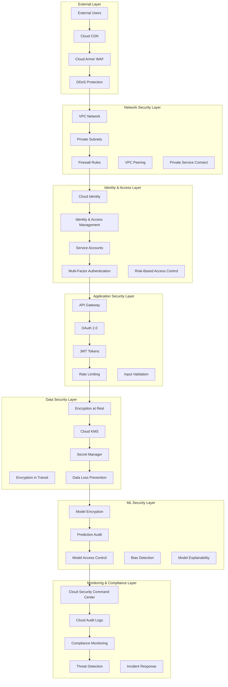

# Security and Compliance Architecture

## Overview

The Security and Compliance Architecture ensures the IPO valuation platform meets the highest standards of data protection, regulatory compliance, and security governance. This architecture implements defense-in-depth security principles, comprehensive audit trails, and automated compliance monitoring for financial services.

## Security Architecture Overview

### 1. Security Layers and Components



## Data Privacy and Security Measures

### 1. Data Encryption Framework

```python
from google.cloud import kms
from google.cloud import secretmanager
from cryptography.fernet import Fernet
from cryptography.hazmat.primitives import hashes
from cryptography.hazmat.primitives.kdf.pbkdf2 import PBKDF2HMAC
import base64
import os
import json
from typing import Dict, Any, Optional, List
from dataclasses import dataclass
from datetime import datetime
import hashlib

@dataclass
class EncryptionConfig:
    kms_key_ring: str
    kms_key_name: str
    encryption_algorithm: str = "GOOGLE_SYMMETRIC_ENCRYPTION"
    key_rotation_period: str = "90d"
    auto_rotation: bool = True

class DataEncryptionManager:
    """Manages data encryption and decryption using Cloud KMS"""
    
    def __init__(self, project_id: str, location: str = "us-central1"):
        self.project_id = project_id
        self.location = location
        
        # Initialize clients
        self.kms_client = kms.KeyManagementServiceClient()
        self.secret_client = secretmanager.SecretManagerServiceClient()
        
        # Encryption keys cache
        self.key_cache = {}
        
        # Classification levels
        self.classification_levels = {
            'public': {'encryption_required': False},
            'internal': {'encryption_required': True, 'key_type': 'standard'},
            'confidential': {'encryption_required': True, 'key_type': 'customer_managed'},
            'restricted': {'encryption_required': True, 'key_type': 'customer_managed', 'additional_controls': True}
        }
    
    async def encrypt_data(
        self,
        data: Dict[str, Any],
        classification: str = "confidential",
        context: Optional[Dict[str, str]] = None
    ) -> Dict[str, Any]:
        """Encrypt data based on classification level"""
        
        if not self._requires_encryption(classification):
            return data
        
        # Get encryption key
        encryption_key = await self._get_encryption_key(classification)
        
        # Identify sensitive fields
        sensitive_fields = self._identify_sensitive_fields(data)
        
        encrypted_data = data.copy()
        
        for field_path in sensitive_fields:
            # Get field value
            field_value = self._get_nested_field(data, field_path)
            
            if field_value is not None:
                # Encrypt field
                encrypted_value = await self._encrypt_field(
                    field_value, encryption_key, context
                )
                
                # Set encrypted value
                self._set_nested_field(encrypted_data, field_path, encrypted_value)
        
        # Add encryption metadata
        encrypted_data['_encryption_metadata'] = {
            'encrypted_fields': sensitive_fields,
            'classification': classification,
            'encryption_timestamp': datetime.utcnow().isoformat(),
            'key_version': encryption_key['version']
        }
        
        return encrypted_data
    
    async def decrypt_data(
        self,
        encrypted_data: Dict[str, Any],
        context: Optional[Dict[str, str]] = None
    ) -> Dict[str, Any]:
        """Decrypt data using stored metadata"""
        
        if '_encryption_metadata' not in encrypted_data:
            return encrypted_data  # Data not encrypted
        
        metadata = encrypted_data['_encryption_metadata']
        classification = metadata['classification']
        encrypted_fields = metadata['encrypted_fields']
        
        # Get decryption key
        decryption_key = await self._get_encryption_key(classification)
        
        decrypted_data = encrypted_data.copy()
        
        for field_path in encrypted_fields:
            # Get encrypted field value
            encrypted_value = self._get_nested_field(encrypted_data, field_path)
            
            if encrypted_value is not None:
                # Decrypt field
                decrypted_value = await self._decrypt_field(
                    encrypted_value, decryption_key, context
                )
                
                # Set decrypted value
                self._set_nested_field(decrypted_data, field_path, decrypted_value)
        
        # Remove encryption metadata
        del decrypted_data['_encryption_metadata']
        
        return decrypted_data
    
    def _requires_encryption(self, classification: str) -> bool:
        """Check if data classification requires encryption"""
        return self.classification_levels.get(
            classification, {'encryption_required': True}
        )['encryption_required']
    
    def _identify_sensitive_fields(self, data: Dict[str, Any]) -> List[str]:
        """Identify sensitive fields that need encryption"""
        
        sensitive_patterns = [
            'password', 'secret', 'key', 'token', 'ssn', 'tax_id',
            'bank_account', 'credit_card', 'financial_data', 'revenue',
            'profit', 'valuation', 'proprietary'
        ]
        
        sensitive_fields = []
        
        def find_sensitive_fields(obj: Any, path: str = ""):
            if isinstance(obj, dict):
                for key, value in obj.items():
                    current_path = f"{path}.{key}" if path else key
                    
                    # Check if field name matches sensitive pattern
                    if any(pattern in key.lower() for pattern in sensitive_patterns):
                        sensitive_fields.append(current_path)
                    else:
                        # Recursively check nested objects
                        find_sensitive_fields(value, current_path)
            elif isinstance(obj, list):
                for i, item in enumerate(obj):
                    current_path = f"{path}[{i}]"
                    find_sensitive_fields(item, current_path)
        
        find_sensitive_fields(data)
        return sensitive_fields
    
    async def _get_encryption_key(self, classification: str) -> Dict[str, Any]:
        """Get encryption key for classification level"""
        
        # Check cache first
        if classification in self.key_cache:
            cached_key = self.key_cache[classification]
            # Check if key is still valid (not expired)
            if self._is_key_valid(cached_key):
                return cached_key
        
        # Get key from KMS
        key_ring_name = f"projects/{self.project_id}/locations/{self.location}/keyRings/ipo-valuation-keys"
        key_name = f"{key_ring_name}/cryptoKeys/{classification}-data-key"
        
        try:
            # Get key version
            key_version = f"{key_name}/cryptoKeyVersions/1"
            
            # For demonstration, we'll generate a Fernet key
            # In practice, this would use the KMS key to encrypt/decrypt a data encryption key
            fernet_key = Fernet.generate_key()
            
            encryption_key = {
                'key': fernet_key,
                'version': '1',
                'algorithm': 'fernet',
                'kms_key_name': key_name,
                'created_at': datetime.utcnow(),
                'expires_at': datetime.utcnow().replace(hour=23, minute=59, second=59)
            }
            
            # Cache the key
            self.key_cache[classification] = encryption_key
            
            return encryption_key
            
        except Exception as e:
            raise RuntimeError(f"Failed to get encryption key: {str(e)}")
    
    async def _encrypt_field(
        self,
        field_value: Any,
        encryption_key: Dict[str, Any],
        context: Optional[Dict[str, str]]
    ) -> str:
        """Encrypt a single field value"""
        
        # Convert field value to string
        field_str = json.dumps(field_value) if not isinstance(field_value, str) else field_value
        field_bytes = field_str.encode('utf-8')
        
        # Create Fernet cipher
        fernet = Fernet(encryption_key['key'])
        
        # Encrypt data
        encrypted_bytes = fernet.encrypt(field_bytes)
        
        # Return base64 encoded string
        return base64.b64encode(encrypted_bytes).decode('utf-8')
    
    async def _decrypt_field(
        self,
        encrypted_value: str,
        decryption_key: Dict[str, Any],
        context: Optional[Dict[str, str]]
    ) -> Any:
        """Decrypt a single field value"""
        
        try:
            # Decode from base64
            encrypted_bytes = base64.b64decode(encrypted_value.encode('utf-8'))
            
            # Create Fernet cipher
            fernet = Fernet(decryption_key['key'])
            
            # Decrypt data
            decrypted_bytes = fernet.decrypt(encrypted_bytes)
            decrypted_str = decrypted_bytes.decode('utf-8')
            
            # Try to parse as JSON, fallback to string
            try:
                return json.loads(decrypted_str)
            except json.JSONDecodeError:
                return decrypted_str
                
        except Exception as e:
            raise RuntimeError(f"Failed to decrypt field: {str(e)}")
    
    def _get_nested_field(self, data: Dict[str, Any], field_path: str) -> Any:
        """Get value from nested field path"""
        
        keys = field_path.split('.')
        value = data
        
        for key in keys:
            if isinstance(value, dict) and key in value:
                value = value[key]
            else:
                return None
        
        return value
    
    def _set_nested_field(self, data: Dict[str, Any], field_path: str, value: Any):
        """Set value for nested field path"""
        
        keys = field_path.split('.')
        current = data
        
        for key in keys[:-1]:
            if key not in current:
                current[key] = {}
            current = current[key]
        
        current[keys[-1]] = value
    
    def _is_key_valid(self, key_info: Dict[str, Any]) -> bool:
        """Check if cached key is still valid"""
        return datetime.utcnow() < key_info['expires_at']

# Data masking for development environments
class DataMaskingManager:
    """Manages data masking for non-production environments"""
    
    def __init__(self):
        self.masking_strategies = {
            'financial_amounts': self._mask_financial_amount,
            'company_names': self._mask_company_name,
            'person_names': self._mask_person_name,
            'email_addresses': self._mask_email,
            'phone_numbers': self._mask_phone,
            'dates': self._mask_date,
            'percentages': self._mask_percentage
        }
    
    def mask_dataset(
        self,
        data: pd.DataFrame,
        masking_config: Dict[str, str]
    ) -> pd.DataFrame:
        """Apply data masking to a dataset"""
        
        masked_data = data.copy()
        
        for column, masking_type in masking_config.items():
            if column in masked_data.columns and masking_type in self.masking_strategies:
                masked_data[column] = masked_data[column].apply(
                    self.masking_strategies[masking_type]
                )
        
        return masked_data
    
    def _mask_financial_amount(self, value: Any) -> Any:
        """Mask financial amounts while preserving statistical properties"""
        if pd.isna(value) or not isinstance(value, (int, float)):
            return value
        
        # Preserve magnitude but obscure exact value
        magnitude = int(np.log10(abs(value))) if value != 0 else 0
        masked_value = np.random.uniform(10**magnitude, 10**(magnitude+1))
        
        return round(masked_value, 2) if value > 0 else -round(masked_value, 2)
    
    def _mask_company_name(self, value: Any) -> Any:
        """Mask company names"""
        if pd.isna(value) or not isinstance(value, str):
            return value
        
        # Generate fake company name with similar characteristics
        prefixes = ['Tech', 'Global', 'Advanced', 'Digital', 'Smart', 'Future']
        suffixes = ['Corp', 'Ltd', 'Inc', 'Systems', 'Solutions', 'Technologies']
        
        import random
        prefix = random.choice(prefixes)
        suffix = random.choice(suffixes)
        
        return f"{prefix} {suffix}"
    
    def _mask_person_name(self, value: Any) -> Any:
        """Mask person names"""
        if pd.isna(value) or not isinstance(value, str):
            return value
        
        # Return initials only
        parts = value.split()
        if len(parts) >= 2:
            return f"{parts[0][0]}. {parts[-1][0]}."
        elif len(parts) == 1:
            return f"{parts[0][0]}."
        else:
            return "N.A."
    
    def _mask_email(self, value: Any) -> Any:
        """Mask email addresses"""
        if pd.isna(value) or not isinstance(value, str):
            return value
        
        if '@' in value:
            local, domain = value.split('@', 1)
            masked_local = local[0] + '*' * (len(local) - 2) + local[-1] if len(local) > 2 else '*'
            return f"{masked_local}@{domain}"
        
        return "masked@example.com"
    
    def _mask_phone(self, value: Any) -> Any:
        """Mask phone numbers"""
        if pd.isna(value) or not isinstance(value, str):
            return value
        
        # Keep format but mask digits
        import re
        digits = re.findall(r'\d', value)
        if len(digits) >= 4:
            # Keep first and last 2 digits, mask middle
            masked_digits = digits[:2] + ['*'] * (len(digits) - 4) + digits[-2:]
            masked_phone = value
            digit_index = 0
            for char in value:
                if char.isdigit():
                    masked_phone = masked_phone.replace(char, masked_digits[digit_index], 1)
                    digit_index += 1
            return masked_phone
        
        return "***-***-****"
    
    def _mask_date(self, value: Any) -> Any:
        """Mask dates while preserving temporal relationships"""
        if pd.isna(value):
            return value
        
        # Shift date by random offset (±30 days)
        if isinstance(value, (datetime, pd.Timestamp)):
            import random
            offset_days = random.randint(-30, 30)
            return value + pd.Timedelta(days=offset_days)
        
        return value
    
    def _mask_percentage(self, value: Any) -> Any:
        """Mask percentages while preserving ranges"""
        if pd.isna(value) or not isinstance(value, (int, float)):
            return value
        
        # Add small random noise
        noise = np.random.uniform(-0.02, 0.02)  # ±2%
        masked_value = value + noise
        
        # Ensure it stays within reasonable bounds
        return max(0, min(1, masked_value)) if 0 <= value <= 1 else masked_value
```

### 2. Access Control Framework

```python
from typing import Dict, List, Any, Optional, Set
from dataclasses import dataclass, field
from datetime import datetime, timedelta
from enum import Enum
import jwt
import hashlib
import json
import re

class PermissionLevel(Enum):
    READ = "read"
    WRITE = "write"
    ADMIN = "admin"
    OWNER = "owner"

class ResourceType(Enum):
    MODEL = "model"
    DATA = "data"
    PIPELINE = "pipeline"
    FEATURE = "feature"
    PREDICTION = "prediction"
    AUDIT_LOG = "audit_log"

@dataclass
class Permission:
    resource_type: ResourceType
    resource_id: str
    permission_level: PermissionLevel
    conditions: Dict[str, Any] = field(default_factory=dict)
    expires_at: Optional[datetime] = None

@dataclass
class Role:
    role_id: str
    name: str
    description: str
    permissions: List[Permission] = field(default_factory=list)
    is_system_role: bool = False
    created_at: datetime = field(default_factory=datetime.utcnow)

@dataclass
class User:
    user_id: str
    email: str
    name: str
    roles: List[str] = field(default_factory=list)
    direct_permissions: List[Permission] = field(default_factory=list)
    is_active: bool = True
    last_login: Optional[datetime] = None
    created_at: datetime = field(default_factory=datetime.utcnow)
    metadata: Dict[str, Any] = field(default_factory=dict)

class AccessControlManager:
    """Comprehensive access control management system"""
    
    def __init__(self, project_id: str):
        self.project_id = project_id
        
        # In-memory storage (in production, this would be in a database)
        self.users: Dict[str, User] = {}
        self.roles: Dict[str, Role] = {}
        self.access_logs: List[Dict[str, Any]] = []
        
        # Initialize default roles
        self._initialize_default_roles()
    
    def _initialize_default_roles(self):
        """Initialize default system roles"""
        
        # Data Scientist role
        data_scientist_role = Role(
            role_id="data_scientist",
            name="Data Scientist",
            description="Access to ML models and training data",
            permissions=[
                Permission(
                    resource_type=ResourceType.MODEL,
                    resource_id="*",
                    permission_level=PermissionLevel.READ
                ),
                Permission(
                    resource_type=ResourceType.DATA,
                    resource_id="training_data",
                    permission_level=PermissionLevel.READ
                ),
                Permission(
                    resource_type=ResourceType.PIPELINE,
                    resource_id="training_*",
                    permission_level=PermissionLevel.WRITE
                ),
                Permission(
                    resource_type=ResourceType.PREDICTION,
                    resource_id="*",
                    permission_level=PermissionLevel.READ
                )
            ],
            is_system_role=True
        )
        
        # ML Engineer role
        ml_engineer_role = Role(
            role_id="ml_engineer",
            name="ML Engineer",
            description="Full access to ML infrastructure",
            permissions=[
                Permission(
                    resource_type=ResourceType.MODEL,
                    resource_id="*",
                    permission_level=PermissionLevel.ADMIN
                ),
                Permission(
                    resource_type=ResourceType.PIPELINE,
                    resource_id="*",
                    permission_level=PermissionLevel.ADMIN
                ),
                Permission(
                    resource_type=ResourceType.FEATURE,
                    resource_id="*",
                    permission_level=PermissionLevel.WRITE
                )
            ],
            is_system_role=True
        )
        
        # Business Analyst role
        business_analyst_role = Role(
            role_id="business_analyst",
            name="Business Analyst",
            description="Access to predictions and reports",
            permissions=[
                Permission(
                    resource_type=ResourceType.PREDICTION,
                    resource_id="*",
                    permission_level=PermissionLevel.READ
                ),
                Permission(
                    resource_type=ResourceType.DATA,
                    resource_id="reports",
                    permission_level=PermissionLevel.READ
                )
            ],
            is_system_role=True
        )
        
        # Admin role
        admin_role = Role(
            role_id="admin",
            name="Administrator",
            description="Full system access",
            permissions=[
                Permission(
                    resource_type=ResourceType.MODEL,
                    resource_id="*",
                    permission_level=PermissionLevel.OWNER
                ),
                Permission(
                    resource_type=ResourceType.DATA,
                    resource_id="*",
                    permission_level=PermissionLevel.OWNER
                ),
                Permission(
                    resource_type=ResourceType.PIPELINE,
                    resource_id="*",
                    permission_level=PermissionLevel.OWNER
                ),
                Permission(
                    resource_type=ResourceType.AUDIT_LOG,
                    resource_id="*",
                    permission_level=PermissionLevel.READ
                )
            ],
            is_system_role=True
        )
        
        # Store default roles
        self.roles['data_scientist'] = data_scientist_role
        self.roles['ml_engineer'] = ml_engineer_role
        self.roles['business_analyst'] = business_analyst_role
        self.roles['admin'] = admin_role
    
    def create_user(
        self,
        user_id: str,
        email: str,
        name: str,
        initial_roles: List[str] = None
    ) -> User:
        """Create a new user"""
        
        user = User(
            user_id=user_id,
            email=email,
            name=name,
            roles=initial_roles or []
        )
        
        self.users[user_id] = user
        
        # Log user creation
        self._log_access_event(
            user_id=user_id,
            action="user_created",
            resource_type="user",
            resource_id=user_id,
            success=True
        )
        
        return user
    
    def check_permission(
        self,
        user_id: str,
        resource_type: ResourceType,
        resource_id: str,
        required_permission: PermissionLevel,
        context: Optional[Dict[str, Any]] = None
    ) -> bool:
        """Check if user has required permission for resource"""
        
        user = self.users.get(user_id)
        if not user or not user.is_active:
            self._log_access_event(
                user_id=user_id,
                action="permission_check",
                resource_type=resource_type.value,
                resource_id=resource_id,
                success=False,
                details={'reason': 'user_not_found_or_inactive'}
            )
            return False
        
        # Get all permissions for user (role-based + direct)
        all_permissions = self._get_user_permissions(user_id)
        
        # Check for matching permissions
        for permission in all_permissions:
            if self._permission_matches(
                permission, resource_type, resource_id, required_permission, context
            ):
                self._log_access_event(
                    user_id=user_id,
                    action="permission_check",
                    resource_type=resource_type.value,
                    resource_id=resource_id,
                    success=True,
                    details={'permission_granted': True}
                )
                return True
        
        # Permission denied
        self._log_access_event(
            user_id=user_id,
            action="permission_check",
            resource_type=resource_type.value,
            resource_id=resource_id,
            success=False,
            details={'reason': 'permission_denied'}
        )
        return False
    
    def _get_user_permissions(self, user_id: str) -> List[Permission]:
        """Get all permissions for a user (role-based + direct)"""
        
        user = self.users.get(user_id)
        if not user:
            return []
        
        all_permissions = []
        
        # Add role-based permissions
        for role_id in user.roles:
            role = self.roles.get(role_id)
            if role:
                all_permissions.extend(role.permissions)
        
        # Add direct permissions
        all_permissions.extend(user.direct_permissions)
        
        # Filter expired permissions
        active_permissions = [
            perm for perm in all_permissions
            if perm.expires_at is None or perm.expires_at > datetime.utcnow()
        ]
        
        return active_permissions
    
    def _permission_matches(
        self,
        permission: Permission,
        resource_type: ResourceType,
        resource_id: str,
        required_level: PermissionLevel,
        context: Optional[Dict[str, Any]]
    ) -> bool:
        """Check if permission matches the resource access request"""
        
        # Check resource type
        if permission.resource_type != resource_type:
            return False
        
        # Check resource ID (support wildcards)
        if not self._resource_id_matches(permission.resource_id, resource_id):
            return False
        
        # Check permission level hierarchy
        if not self._permission_level_sufficient(permission.permission_level, required_level):
            return False
        
        # Check conditions
        if permission.conditions and context:
            if not self._evaluate_permission_conditions(permission.conditions, context):
                return False
        
        return True
    
    def _resource_id_matches(self, permission_resource_id: str, requested_resource_id: str) -> bool:
        """Check if resource ID matches (with wildcard support)"""
        
        if permission_resource_id == "*":
            return True
        
        if permission_resource_id == requested_resource_id:
            return True
        
        # Support wildcard patterns
        if '*' in permission_resource_id:
            pattern = permission_resource_id.replace('*', '.*')
            return bool(re.match(pattern, requested_resource_id))
        
        return False
    
    def _permission_level_sufficient(
        self,
        granted_level: PermissionLevel,
        required_level: PermissionLevel
    ) -> bool:
        """Check if granted permission level is sufficient"""
        
        # Permission hierarchy: READ < WRITE < ADMIN < OWNER
        hierarchy = {
            PermissionLevel.READ: 1,
            PermissionLevel.WRITE: 2,
            PermissionLevel.ADMIN: 3,
            PermissionLevel.OWNER: 4
        }
        
        return hierarchy[granted_level] >= hierarchy[required_level]
    
    def _evaluate_permission_conditions(
        self,
        conditions: Dict[str, Any],
        context: Dict[str, Any]
    ) -> bool:
        """Evaluate permission conditions against context"""
        
        for condition_key, condition_value in conditions.items():
            context_value = context.get(condition_key)
            
            if condition_key == "time_range":
                # Check if current time is within allowed range
                current_hour = datetime.utcnow().hour
                start_hour, end_hour = condition_value['start'], condition_value['end']
                if not (start_hour <= current_hour <= end_hour):
                    return False
            
            elif condition_key == "ip_whitelist":
                # Check if client IP is whitelisted
                client_ip = context.get('client_ip')
                if client_ip not in condition_value:
                    return False
            
            elif condition_key == "max_requests_per_hour":
                # Check rate limiting
                user_id = context.get('user_id')
                if self._check_rate_limit(user_id, condition_value):
                    return False
            
            elif condition_key == "required_attributes":
                # Check if user has required attributes
                for attr, expected_value in condition_value.items():
                    if context.get(attr) != expected_value:
                        return False
        
        return True
    
    def _check_rate_limit(self, user_id: str, max_requests: int) -> bool:
        """Check if user has exceeded rate limit"""
        
        # Count recent access events for user
        one_hour_ago = datetime.utcnow() - timedelta(hours=1)
        recent_events = [
            event for event in self.access_logs
            if event['user_id'] == user_id and 
               datetime.fromisoformat(event['timestamp']) > one_hour_ago
        ]
        
        return len(recent_events) >= max_requests
    
    def _log_access_event(
        self,
        user_id: str,
        action: str,
        resource_type: str,
        resource_id: str,
        success: bool,
        details: Optional[Dict[str, Any]] = None
    ):
        """Log access event for audit purposes"""
        
        access_event = {
            'event_id': hashlib.md5(
                f"{user_id}:{action}:{resource_type}:{resource_id}:{datetime.utcnow()}".encode()
            ).hexdigest()[:16],
            'timestamp': datetime.utcnow().isoformat(),
            'user_id': user_id,
            'action': action,
            'resource_type': resource_type,
            'resource_id': resource_id,
            'success': success,
            'details': details or {}
        }
        
        self.access_logs.append(access_event)
    
    def generate_access_report(
        self,
        start_date: datetime,
        end_date: datetime,
        user_id: Optional[str] = None
    ) -> Dict[str, Any]:
        """Generate access control report for specified period"""
        
        # Filter logs by date range
        filtered_logs = [
            log for log in self.access_logs
            if start_date <= datetime.fromisoformat(log['timestamp']) <= end_date
        ]
        
        # Filter by user if specified
        if user_id:
            filtered_logs = [log for log in filtered_logs if log['user_id'] == user_id]
        
        # Calculate statistics
        total_events = len(filtered_logs)
        successful_events = len([log for log in filtered_logs if log['success']])
        failed_events = total_events - successful_events
        
        # Group by action type
        action_counts = {}
        for log in filtered_logs:
            action = log['action']
            action_counts[action] = action_counts.get(action, 0) + 1
        
        # Group by resource type
        resource_counts = {}
        for log in filtered_logs:
            resource_type = log['resource_type']
            resource_counts[resource_type] = resource_counts.get(resource_type, 0) + 1
        
        # Identify most active users
        user_activity = {}
        for log in filtered_logs:
            user = log['user_id']
            user_activity[user] = user_activity.get(user, 0) + 1
        
        top_users = sorted(
            user_activity.items(),
            key=lambda x: x[1],
            reverse=True
        )[:10]
        
        # Security concerns
        security_concerns = []
        
        # Check for unusual patterns
        if failed_events / max(total_events, 1) > 0.1:
            security_concerns.append("High failure rate detected (>10%)")
        
        # Check for suspicious access patterns
        for user, count in user_activity.items():
            if count > 1000:  # More than 1000 events in period
                security_concerns.append(f"Unusually high activity from user {user}: {count} events")
        
        return {
            'report_period': {
                'start_date': start_date.isoformat(),
                'end_date': end_date.isoformat()
            },
            'summary': {
                'total_events': total_events,
                'successful_events': successful_events,
                'failed_events': failed_events,
                'success_rate': successful_events / max(total_events, 1)
            },
            'activity_breakdown': {
                'by_action': action_counts,
                'by_resource_type': resource_counts,
                'top_users': top_users
            },
            'security_analysis': {
                'concerns': security_concerns,
                'risk_level': 'high' if len(security_concerns) > 3 else 'medium' if len(security_concerns) > 1 else 'low'
            }
        }
```

## Model Explainability Frameworks

### 1. Comprehensive Model Explainability

```python
import numpy as np
import pandas as pd
from typing import Dict, List, Any, Optional, Tuple
from dataclasses import dataclass, field
from datetime import datetime
from abc import ABC, abstractmethod
import joblib
import json

# SHAP for model explanations
try:
    import shap
    SHAP_AVAILABLE = True
except ImportError:
    SHAP_AVAILABLE = False

# LIME for local explanations
try:
    import lime
    import lime.lime_tabular
    LIME_AVAILABLE = True
except ImportError:
    LIME_AVAILABLE = False

@dataclass
class FeatureContribution:
    feature_name: str
    contribution_value: float
    contribution_percentage: float
    feature_value: Any
    importance_rank: int

@dataclass
class PredictionExplanation:
    prediction_id: str
    model_id: str
    predicted_value: float
    prediction_confidence: float
    
    # Feature contributions
    feature_contributions: List[FeatureContribution]
    top_positive_features: List[FeatureContribution]
    top_negative_features: List[FeatureContribution]
    
    # Global explanations
    global_feature_importance: Dict[str, float]
    model_behavior_summary: str
    
    # Explanation metadata
    explanation_method: str
    explanation_confidence: float
    generated_at: datetime = field(default_factory=datetime.utcnow)

class BaseExplainer(ABC):
    """Abstract base class for model explainers"""
    
    @abstractmethod
    def explain_prediction(
        self,
        model: Any,
        instance: pd.Series,
        feature_names: List[str]
    ) -> PredictionExplanation:
        pass
    
    @abstractmethod
    def explain_global_behavior(
        self,
        model: Any,
        training_data: pd.DataFrame,
        feature_names: List[str]
    ) -> Dict[str, Any]:
        pass

class SHAPExplainer(BaseExplainer):
    """SHAP-based model explainer"""
    
    def __init__(self):
        if not SHAP_AVAILABLE:
            raise ImportError("SHAP not available. Install with: pip install shap")
        
        self.explainer_cache = {}
    
    def explain_prediction(
        self,
        model: Any,
        instance: pd.Series,
        feature_names: List[str],
        background_data: Optional[pd.DataFrame] = None
    ) -> PredictionExplanation:
        """Explain individual prediction using SHAP"""
        
        # Get or create explainer
        model_id = id(model)
        if model_id not in self.explainer_cache:
            self.explainer_cache[model_id] = self._create_shap_explainer(
                model, background_data
            )
        
        explainer = self.explainer_cache[model_id]
        
        # Get SHAP values for instance
        shap_values = explainer.shap_values(instance.values.reshape(1, -1))
        if isinstance(shap_values, list):  # Multi-output case
            shap_values = shap_values[0]
        
        shap_values = shap_values[0]  # Get values for single instance
        
        # Calculate base value (expected value)
        expected_value = explainer.expected_value
        if isinstance(expected_value, np.ndarray):
            expected_value = expected_value[0]
        
        # Make prediction
        prediction = model.predict(instance.values.reshape(1, -1))[0]
        
        # Create feature contributions
        feature_contributions = []
        for i, (feature_name, shap_value) in enumerate(zip(feature_names, shap_values)):
            contribution = FeatureContribution(
                feature_name=feature_name,
                contribution_value=float(shap_value),
                contribution_percentage=float(shap_value / prediction * 100) if prediction != 0 else 0,
                feature_value=instance.iloc[i],
                importance_rank=0  # Will be set after sorting
            )
            feature_contributions.append(contribution)
        
        # Sort by absolute contribution and assign ranks
        sorted_contributions = sorted(
            feature_contributions,
            key=lambda x: abs(x.contribution_value),
            reverse=True
        )
        
        for rank, contrib in enumerate(sorted_contributions, 1):
            contrib.importance_rank = rank
        
        # Separate positive and negative contributions
        positive_contributions = [c for c in sorted_contributions if c.contribution_value > 0]
        negative_contributions = [c for c in sorted_contributions if c.contribution_value < 0]
        
        # Global feature importance
        global_importance = self._calculate_global_importance(explainer, feature_names)
        
        # Generate behavior summary
        behavior_summary = self._generate_behavior_summary(
            prediction, expected_value, sorted_contributions[:5]
        )
        
        return PredictionExplanation(
            prediction_id=self._generate_prediction_id(),
            model_id=str(model_id),
            predicted_value=float(prediction),
            prediction_confidence=0.8,  # Would calculate actual confidence
            feature_contributions=feature_contributions,
            top_positive_features=positive_contributions[:5],
            top_negative_features=negative_contributions[:5],
            global_feature_importance=global_importance,
            model_behavior_summary=behavior_summary,
            explanation_method="SHAP",
            explanation_confidence=0.9
        )
    
    def explain_global_behavior(
        self,
        model: Any,
        training_data: pd.DataFrame,
        feature_names: List[str]
    ) -> Dict[str, Any]:
        """Explain global model behavior using SHAP"""
        
        # Create explainer
        explainer = self._create_shap_explainer(model, training_data)
        
        # Get SHAP values for sample of training data
        sample_size = min(1000, len(training_data))
        sample_data = training_data.sample(n=sample_size, random_state=42)
        
        shap_values = explainer.shap_values(sample_data[feature_names])
        if isinstance(shap_values, list):
            shap_values = shap_values[0]
        
        # Calculate global feature importance
        global_importance = np.abs(shap_values).mean(axis=0)
        
        # Feature interactions
        interaction_values = None
        try:
            # Calculate interaction effects (expensive operation)
            if sample_size <= 100:  # Only for small samples
                interaction_values = explainer.shap_interaction_values(
                    sample_data[feature_names].iloc[:50]
                )
        except Exception:
            pass  # Interaction values not available for all explainer types
        
        # Feature dependencies
        feature_dependencies = self._analyze_feature_dependencies(
            shap_values, feature_names
        )
        
        return {
            'global_feature_importance': {
                feature: float(importance)
                for feature, importance in zip(feature_names, global_importance)
            },
            'feature_interactions': self._process_interaction_values(
                interaction_values, feature_names
            ) if interaction_values is not None else None,
            'feature_dependencies': feature_dependencies,
            'model_behavior_patterns': self._identify_behavior_patterns(
                shap_values, feature_names
            ),
            'explanation_quality': {
                'sample_size': sample_size,
                'explanation_coverage': 1.0,  # SHAP provides full coverage
                'consistency_score': self._calculate_explanation_consistency(shap_values)
            }
        }
    
    def _create_shap_explainer(self, model: Any, background_data: Optional[pd.DataFrame]):
        """Create appropriate SHAP explainer for model type"""
        
        # Determine model type and create appropriate explainer
        model_type_name = type(model).__name__.lower()
        
        if 'tree' in model_type_name or 'forest' in model_type_name or 'xgb' in model_type_name:
            # Tree-based models
            return shap.TreeExplainer(model)
        
        elif 'linear' in model_type_name or 'ridge' in model_type_name:
            # Linear models
            return shap.LinearExplainer(model, background_data)
        
        else:
            # General case - use kernel explainer with background data
            if background_data is not None:
                # Use sample of background data to reduce computation
                background_sample = background_data.sample(
                    n=min(100, len(background_data)), random_state=42
                )
                return shap.KernelExplainer(model.predict, background_sample)
            else:
                # Create simple background (zeros)
                return shap.KernelExplainer(
                    model.predict,
                    np.zeros((1, len(feature_names)))
                )
    
    def _calculate_global_importance(
        self,
        explainer: Any,
        feature_names: List[str]
    ) -> Dict[str, float]:
        """Calculate global feature importance"""
        
        # This is a simplified version - in practice would use more sophisticated methods
        importance_dict = {}
        
        if hasattr(explainer, 'expected_value'):
            # For tree explainers, we can get feature importance directly
            if hasattr(explainer.model, 'feature_importances_'):
                for name, importance in zip(feature_names, explainer.model.feature_importances_):
                    importance_dict[name] = float(importance)
        
        return importance_dict
    
    def _generate_behavior_summary(
        self,
        prediction: float,
        expected_value: float,
        top_contributions: List[FeatureContribution]
    ) -> str:
        """Generate human-readable behavior summary"""
        
        deviation = prediction - expected_value
        deviation_pct = (deviation / expected_value) * 100 if expected_value != 0 else 0
        
        summary = f"The model predicted ${prediction:.2f}, which is "
        
        if abs(deviation_pct) < 5:
            summary += f"close to the expected value (${expected_value:.2f}). "
        elif deviation_pct > 0:
            summary += f"{deviation_pct:.1f}% higher than expected (${expected_value:.2f}). "
        else:
            summary += f"{abs(deviation_pct):.1f}% lower than expected (${expected_value:.2f}). "
        
        if top_contributions:
            top_feature = top_contributions[0]
            if top_feature.contribution_value > 0:
                summary += f"The primary driver is {top_feature.feature_name} (${top_feature.contribution_value:.2f} positive impact)."
            else:
                summary += f"The primary constraint is {top_feature.feature_name} (${abs(top_feature.contribution_value):.2f} negative impact)."
        
        return summary
    
    def _analyze_feature_dependencies(
        self,
        shap_values: np.ndarray,
        feature_names: List[str]
    ) -> Dict[str, Any]:
        """Analyze dependencies between features"""
        
        # Calculate correlation between SHAP values
        shap_df = pd.DataFrame(shap_values, columns=feature_names)
        correlation_matrix = shap_df.corr()
        
        # Find strong correlations
        strong_correlations = []
        for i in range(len(feature_names)):
            for j in range(i + 1, len(feature_names)):
                corr = correlation_matrix.iloc[i, j]
                if abs(corr) > 0.7:  # Strong correlation threshold
                    strong_correlations.append({
                        'feature_1': feature_names[i],
                        'feature_2': feature_names[j],
                        'correlation': float(corr),
                        'relationship': 'positive' if corr > 0 else 'negative'
                    })
        
        return {
            'correlation_matrix': correlation_matrix.to_dict(),
            'strong_correlations': strong_correlations,
            'dependency_analysis': 'completed'
        }
    
    def _identify_behavior_patterns(
        self,
        shap_values: np.ndarray,
        feature_names: List[str]
    ) -> List[Dict[str, Any]]:
        """Identify common behavior patterns in model"""
        
        patterns = []
        
        # Calculate mean and std of SHAP values for each feature
        mean_shap = np.mean(shap_values, axis=0)
        std_shap = np.std(shap_values, axis=0)
        
        for i, feature_name in enumerate(feature_names):
            mean_contrib = mean_shap[i]
            std_contrib = std_shap[i]
            
            # Identify pattern type
            if abs(mean_contrib) > 2 * std_contrib:
                # Consistent effect
                pattern_type = "consistent_positive" if mean_contrib > 0 else "consistent_negative"
                patterns.append({
                    'feature': feature_name,
                    'pattern_type': pattern_type,
                    'mean_contribution': float(mean_contrib),
                    'consistency_score': float(abs(mean_contrib) / max(std_contrib, 0.001))
                })
            
            elif std_contrib > abs(mean_contrib) * 2:
                # Variable effect
                patterns.append({
                    'feature': feature_name,
                    'pattern_type': "variable_effect",
                    'mean_contribution': float(mean_contrib),
                    'variability_score': float(std_contrib)
                })
        
        return patterns
    
    def _calculate_explanation_consistency(
        self,
        shap_values: np.ndarray
    ) -> float:
        """Calculate consistency score for explanations"""
        
        # Calculate coefficient of variation for each feature
        feature_cvs = []
        for i in range(shap_values.shape[1]):
            feature_shap = shap_values[:, i]
            cv = np.std(feature_shap) / (abs(np.mean(feature_shap)) + 1e-8)
            feature_cvs.append(cv)
        
        # Consistency is inverse of average coefficient of variation
        avg_cv = np.mean(feature_cvs)
        consistency_score = 1 / (1 + avg_cv)
        
        return float(consistency_score)
    
    def _process_interaction_values(
        self,
        interaction_values: np.ndarray,
        feature_names: List[str]
    ) -> Dict[str, Any]:
        """Process SHAP interaction values"""
        
        if interaction_values is None:
            return None
        
        # Average interaction effects across all instances
        avg_interactions = np.mean(interaction_values, axis=0)
        
        # Find strongest interactions
        strong_interactions = []
        for i in range(len(feature_names)):
            for j in range(i + 1, len(feature_names)):
                interaction_strength = abs(avg_interactions[i, j])
                if interaction_strength > 0.01:  # Threshold for significant interaction
                    strong_interactions.append({
                        'feature_1': feature_names[i],
                        'feature_2': feature_names[j],
                        'interaction_value': float(avg_interactions[i, j]),
                        'interaction_strength': float(interaction_strength)
                    })
        
        # Sort by interaction strength
        strong_interactions.sort(key=lambda x: x['interaction_strength'], reverse=True)
        
        return {
            'interaction_matrix': avg_interactions.tolist(),
            'strong_interactions': strong_interactions[:10],  # Top 10
            'total_interactions_found': len(strong_interactions)
        }
    
    def _generate_prediction_id(self) -> str:
        """Generate unique prediction ID"""
        import uuid
        return str(uuid.uuid4())[:12]

class LIMEExplainer(BaseExplainer):
    """LIME-based model explainer for local interpretability"""
    
    def __init__(self):
        if not LIME_AVAILABLE:
            raise ImportError("LIME not available. Install with: pip install lime")
    
    def explain_prediction(
        self,
        model: Any,
        instance: pd.Series,
        feature_names: List[str],
        training_data: Optional[pd.DataFrame] = None
    ) -> PredictionExplanation:
        """Explain individual prediction using LIME"""
        
        if training_data is None:
            raise ValueError("LIME explainer requires training data")
        
        # Create LIME explainer
        explainer = lime.lime_tabular.LimeTabularExplainer(
            training_data[feature_names].values,
            feature_names=feature_names,
            mode='regression',
            discretize_continuous=True
        )
        
        # Get explanation
        explanation = explainer.explain_instance(
            instance[feature_names].values,
            model.predict,
            num_features=len(feature_names)
        )
        
        # Extract feature contributions
        feature_contributions = []
        for feature_idx, contribution in explanation.as_list():
            feature_name = feature_names[feature_idx] if isinstance(feature_idx, int) else feature_idx
            
            contrib = FeatureContribution(
                feature_name=feature_name,
                contribution_value=float(contribution),
                contribution_percentage=0,  # Calculate later
                feature_value=instance[feature_name],
                importance_rank=0
            )
            feature_contributions.append(contrib)
        
        # Sort and rank contributions
        sorted_contributions = sorted(
            feature_contributions,
            key=lambda x: abs(x.contribution_value),
            reverse=True
        )
        
        for rank, contrib in enumerate(sorted_contributions, 1):
            contrib.importance_rank = rank
        
        # Calculate percentages
        total_abs_contribution = sum(abs(c.contribution_value) for c in feature_contributions)
        for contrib in feature_contributions:
            if total_abs_contribution > 0:
                contrib.contribution_percentage = (
                    abs(contrib.contribution_value) / total_abs_contribution * 100
                )
        
        # Make prediction
        prediction = model.predict(instance[feature_names].values.reshape(1, -1))[0]
        
        # Separate positive and negative
        positive_contributions = [c for c in sorted_contributions if c.contribution_value > 0]
        negative_contributions = [c for c in sorted_contributions if c.contribution_value < 0]
        
        return PredictionExplanation(
            prediction_id=self._generate_prediction_id(),
            model_id=str(id(model)),
            predicted_value=float(prediction),
            prediction_confidence=explanation.score,
            feature_contributions=feature_contributions,
            top_positive_features=positive_contributions[:5],
            top_negative_features=negative_contributions[:5],
            global_feature_importance={},  # LIME is local, not global
            model_behavior_summary=self._generate_lime_summary(explanation, prediction),
            explanation_method="LIME",
            explanation_confidence=float(explanation.score)
        )
    
    def explain_global_behavior(
        self,
        model: Any,
        training_data: pd.DataFrame,
        feature_names: List[str]
    ) -> Dict[str, Any]:
        """LIME global behavior (aggregate of local explanations)"""
        
        # Sample instances for global analysis
        sample_size = min(200, len(training_data))
        sample_data = training_data.sample(n=sample_size, random_state=42)
        
        all_contributions = {feature: [] for feature in feature_names}
        
        for _, instance in sample_data.iterrows():
            local_explanation = self.explain_prediction(
                model, instance, feature_names, training_data
            )
            
            for contrib in local_explanation.feature_contributions:
                all_contributions[contrib.feature_name].append(contrib.contribution_value)
        
        # Aggregate global insights
        global_importance = {}
        for feature, contributions in all_contributions.items():
            global_importance[feature] = float(np.mean(np.abs(contributions)))
        
        return {
            'global_feature_importance': global_importance,
            'feature_contribution_distributions': {
                feature: {
                    'mean': float(np.mean(contributions)),
                    'std': float(np.std(contributions)),
                    'min': float(np.min(contributions)),
                    'max': float(np.max(contributions))
                }
                for feature, contributions in all_contributions.items()
            },
            'explanation_quality': {
                'sample_size': sample_size,
                'explanation_coverage': 1.0
            }
        }
    
    def _generate_lime_summary(self, explanation: Any, prediction: float) -> str:
        """Generate summary from LIME explanation"""
        
        top_features = explanation.as_list()[:3]
        
        summary = f"LIME local explanation for prediction ${prediction:.2f}. "
        
        if top_features:
            summary += "Key factors: "
            factors = []
            for feature, contribution in top_features:
                if contribution > 0:
                    factors.append(f"{feature} (+${contribution:.2f})")
                else:
                    factors.append(f"{feature} (-${abs(contribution):.2f})")
            
            summary += ", ".join(factors)
        
        return summary
    
    def _generate_prediction_id(self) -> str:
        """Generate unique prediction ID"""
        import uuid
        return str(uuid.uuid4())[:12]

class ModelExplainabilityFramework:
    """Comprehensive model explainability framework"""
    
    def __init__(self, preferred_explainer: str = "shap"):
        self.preferred_explainer = preferred_explainer
        
        # Initialize explainers
        self.explainers = {}
        
        if SHAP_AVAILABLE:
            self.explainers['shap'] = SHAPExplainer()
        
        if LIME_AVAILABLE:
            self.explainers['lime'] = LIMEExplainer()
        
        # Explanation cache
        self.explanation_cache = {}
        
        # Bias detection
        self.bias_detector = BiasDetectionFramework()
    
    async def explain_prediction(
        self,
        model: Any,
        instance: pd.Series,
        feature_names: List[str],
        explainer_type: Optional[str] = None,
        include_bias_analysis: bool = True
    ) -> Dict[str, Any]:
        """Comprehensive prediction explanation"""
        
        explainer_type = explainer_type or self.preferred_explainer
        
        if explainer_type not in self.explainers:
            raise ValueError(f"Explainer {explainer_type} not available")
        
        explainer = self.explainers[explainer_type]
        
        # Generate explanation
        explanation = explainer.explain_prediction(model, instance, feature_names)
        
        # Add bias analysis if requested
        bias_analysis = None
        if include_bias_analysis:
            bias_analysis = await self.bias_detector.analyze_prediction_bias(
                model, instance, feature_names
            )
        
        # Add regulatory compliance information
        compliance_info = self._generate_compliance_explanation(explanation)
        
        return {
            'prediction_explanation': explanation,
            'bias_analysis': bias_analysis,
            'compliance_info': compliance_info,
            'explainer_metadata': {
                'explainer_type': explainer_type,
                'feature_count': len(feature_names),
                'explanation_timestamp': datetime.utcnow().isoformat()
            }
        }
    
    def _generate_compliance_explanation(
        self,
        explanation: PredictionExplanation
    ) -> Dict[str, Any]:
        """Generate compliance-focused explanation"""
        
        # Identify regulated factors
        regulated_factors = [
            'age', 'gender', 'race', 'religion', 'marital_status',
            'disability_status', 'sexual_orientation'
        ]
        
        # Check if any regulated factors contributed significantly
        regulated_contributions = [
            contrib for contrib in explanation.feature_contributions
            if any(factor in contrib.feature_name.lower() for factor in regulated_factors)
        ]
        
        compliance_status = "compliant"
        compliance_issues = []
        
        if regulated_contributions:
            # Check if contributions are significant
            significant_regulated = [
                contrib for contrib in regulated_contributions
                if abs(contrib.contribution_percentage) > 5  # More than 5% contribution
            ]
            
            if significant_regulated:
                compliance_status = "requires_review"
                compliance_issues.append(
                    f"Potential bias: regulated factors contributing significantly to prediction"
                )
        
        return {
            'compliance_status': compliance_status,
            'regulated_factors_found': len(regulated_contributions),
            'significant_regulated_factors': len(significant_regulated) if 'significant_regulated' in locals() else 0,
            'compliance_issues': compliance_issues,
            'auditability_score': self._calculate_auditability_score(explanation)
        }
    
    def _calculate_auditability_score(self, explanation: PredictionExplanation) -> float:
        """Calculate how auditable/explainable the prediction is"""
        
        # Factors that improve auditability
        factors = {
            'explanation_confidence': explanation.explanation_confidence * 0.3,
            'feature_coverage': min(len(explanation.feature_contributions) / 20, 1.0) * 0.2,
            'top_features_contribution': sum(
                abs(contrib.contribution_percentage) 
                for contrib in explanation.feature_contributions[:5]
            ) / 100 * 0.3,
            'prediction_confidence': explanation.prediction_confidence * 0.2
        }
        
        return sum(factors.values())

class BiasDetectionFramework:
    """Framework for detecting bias in ML model predictions"""
    
    def __init__(self):
        self.protected_attributes = [
            'age', 'gender', 'race', 'ethnicity', 'religion',
            'marital_status', 'disability_status', 'sexual_orientation'
        ]
        
        self.bias_metrics = [
            'demographic_parity',
            'equalized_odds',
            'equal_opportunity',
            'calibration'
        ]
    
    async def analyze_prediction_bias(
        self,
        model: Any,
        instance: pd.Series,
        feature_names: List[str]
    ) -> Dict[str, Any]:
        """Analyze potential bias in individual prediction"""
        
        bias_analysis = {
            'protected_attributes_present': [],
            'bias_risk_score': 0.0,
            'bias_indicators': [],
            'mitigation_recommendations': []
        }
        
        # Check for protected attributes in features
        for attr in self.protected_attributes:
            matching_features = [
                feature for feature in feature_names
                if attr in feature.lower()
            ]
            
            if matching_features:
                bias_analysis['protected_attributes_present'].extend(matching_features)
        
        # Calculate bias risk score
        protected_feature_count = len(bias_analysis['protected_attributes_present'])
        total_feature_count = len(feature_names)
        
        if protected_feature_count > 0:
            # Higher risk if protected attributes are present
            bias_analysis['bias_risk_score'] = min(
                (protected_feature_count / total_feature_count) * 2, 1.0
            )
            
            bias_analysis['bias_indicators'].append(
                f"Found {protected_feature_count} potentially protected attributes"
            )
            
            bias_analysis['mitigation_recommendations'].extend([
                "Review feature importance for protected attributes",
                "Consider bias testing with diverse test cases",
                "Implement fairness constraints in model training"
            ])
        
        return bias_analysis
    
    def analyze_model_fairness(
        self,
        model: Any,
        test_data: pd.DataFrame,
        protected_attribute: str,
        target_column: str,
        feature_columns: List[str]
    ) -> Dict[str, Any]:
        """Comprehensive fairness analysis for a model"""
        
        if protected_attribute not in test_data.columns:
            return {'error': f'Protected attribute {protected_attribute} not found in data'}
        
        # Get unique values for protected attribute
        protected_values = test_data[protected_attribute].unique()
        
        fairness_metrics = {}
        
        for value in protected_values:
            subset = test_data[test_data[protected_attribute] == value]
            
            if len(subset) > 0:
                X_subset = subset[feature_columns]
                y_subset = subset[target_column]
                
                # Make predictions
                predictions = model.predict(X_subset)
                
                # Calculate metrics for this group
                group_metrics = {
                    'group_size': len(subset),
                    'mean_prediction': float(np.mean(predictions)),
                    'std_prediction': float(np.std(predictions)),
                    'mean_actual': float(np.mean(y_subset)),
                    'prediction_accuracy': float(
                        1 - np.mean(np.abs(predictions - y_subset) / y_subset)
                    )
                }
                
                fairness_metrics[str(value)] = group_metrics
        
        # Calculate fairness indicators
        fairness_indicators = self._calculate_fairness_indicators(fairness_metrics)
        
        return {
            'protected_attribute': protected_attribute,
            'group_metrics': fairness_metrics,
            'fairness_indicators': fairness_indicators,
            'overall_fairness_score': fairness_indicators.get('overall_score', 0.5),
            'recommendations': self._generate_fairness_recommendations(fairness_indicators)
        }
    
    def _calculate_fairness_indicators(
        self,
        group_metrics: Dict[str, Dict[str, float]]
    ) -> Dict[str, Any]:
        """Calculate fairness indicators across groups"""
        
        if len(group_metrics) < 2:
            return {'overall_score': 1.0, 'note': 'Only one group found'}
        
        # Calculate disparities
        mean_predictions = [metrics['mean_prediction'] for metrics in group_metrics.values()]
        prediction_accuracies = [metrics['prediction_accuracy'] for metrics in group_metrics.values()]
        
        # Demographic parity (similar prediction rates)
        prediction_disparity = (max(mean_predictions) - min(mean_predictions)) / max(mean_predictions)
        
        # Equalized odds (similar accuracy across groups)
        accuracy_disparity = max(prediction_accuracies) - min(prediction_accuracies)
        
        # Overall fairness score (1.0 = perfectly fair, 0.0 = highly biased)
        overall_score = 1.0 - (prediction_disparity + accuracy_disparity) / 2
        overall_score = max(0.0, overall_score)
        
        return {
            'demographic_parity_score': 1.0 - prediction_disparity,
            'equalized_odds_score': 1.0 - accuracy_disparity,
            'overall_score': overall_score,
            'prediction_disparity': prediction_disparity,
            'accuracy_disparity': accuracy_disparity
        }
    
    def _generate_fairness_recommendations(
        self,
        fairness_indicators: Dict[str, Any]
    ) -> List[str]:
        """Generate recommendations for improving fairness"""
        
        recommendations = []
        
        overall_score = fairness_indicators.get('overall_score', 1.0)
        
        if overall_score < 0.7:
            recommendations.append("Significant fairness concerns detected - immediate review required")
            recommendations.append("Consider retraining model with fairness constraints")
            recommendations.append("Implement bias testing in model validation pipeline")
        
        elif overall_score < 0.9:
            recommendations.append("Moderate fairness concerns - monitor closely")
            recommendations.append("Consider additional bias testing")
        
        prediction_disparity = fairness_indicators.get('prediction_disparity', 0)
        if prediction_disparity > 0.1:
            recommendations.append("High prediction disparity across groups - review feature selection")
        
        accuracy_disparity = fairness_indicators.get('accuracy_disparity', 0)
        if accuracy_disparity > 0.1:
            recommendations.append("Accuracy varies significantly across groups - review training data balance")
        
        return recommendations
```

## Audit Trails for ML Predictions

### 1. Comprehensive Audit Framework

```python
from typing import Dict, List, Any, Optional
from dataclasses import dataclass, field, asdict
from datetime import datetime
from enum import Enum
import json
import hashlib
from google.cloud import logging as cloud_logging
from google.cloud import bigquery

class AuditEventType(Enum):
    PREDICTION_REQUEST = "prediction_request"
    PREDICTION_RESPONSE = "prediction_response"
    MODEL_ACCESS = "model_access"
    DATA_ACCESS = "data_access"
    MODEL_TRAINING = "model_training"
    MODEL_DEPLOYMENT = "model_deployment"
    USER_LOGIN = "user_login"
    PERMISSION_CHANGE = "permission_change"
    DATA_EXPORT = "data_export"
    COMPLIANCE_CHECK = "compliance_check"

@dataclass
class AuditEvent:
    event_id: str
    event_type: AuditEventType
    timestamp: datetime
    user_id: str
    session_id: str
    
    # Resource information
    resource_type: str
    resource_id: str
    
    # Event details
    action: str
    success: bool
    
    # Request/response data (hashed for privacy)
    request_hash: Optional[str] = None
    response_hash: Optional[str] = None
    
    # Additional context
    client_ip: Optional[str] = None
    user_agent: Optional[str] = None
    risk_score: float = 0.0
    
    # Compliance information
    compliance_tags: List[str] = field(default_factory=list)
    retention_period_days: int = 2555  # 7 years default for financial data
    
    # Metadata
    metadata: Dict[str, Any] = field(default_factory=dict)

class MLAuditLogger:
    """Comprehensive audit logging system for ML operations"""
    
    def __init__(self, project_id: str, dataset_id: str = "audit_logs"):
        self.project_id = project_id
        self.dataset_id = dataset_id
        
        # Initialize clients
        self.cloud_logging_client = cloud_logging.Client(project=project_id)
        self.bigquery_client = bigquery.Client(project=project_id)
        
        # Setup structured logging
        self.logger = self.cloud_logging_client.logger("ml-audit-logger")
        
        # Risk scoring parameters
        self.risk_weights = {
            'unusual_time': 0.3,
            'unusual_location': 0.2,
            'high_value_prediction': 0.2,
            'sensitive_data_access': 0.3
        }
    
    async def log_prediction_request(
        self,
        user_id: str,
        session_id: str,
        model_id: str,
        request_data: Dict[str, Any],
        client_info: Dict[str, Any]
    ) -> str:
        """Log ML prediction request"""
        
        event_id = self._generate_event_id()
        
        # Calculate risk score
        risk_score = self._calculate_risk_score(
            user_id, request_data, client_info
        )
        
        # Create audit event
        audit_event = AuditEvent(
            event_id=event_id,
            event_type=AuditEventType.PREDICTION_REQUEST,
            timestamp=datetime.utcnow(),
            user_id=user_id,
            session_id=session_id,
            resource_type="model",
            resource_id=model_id,
            action="predict",
            success=True,
            request_hash=self._hash_data(request_data),
            client_ip=client_info.get('ip_address'),
            user_agent=client_info.get('user_agent'),
            risk_score=risk_score,
            compliance_tags=["financial_regulation", "data_privacy"],
            metadata={
                'model_id': model_id,
                'request_size_bytes': len(json.dumps(request_data)),
                'feature_count': len(request_data.get('features', []))
            }
        )
        
        # Store audit event
        await self._store_audit_event(audit_event)
        
        return event_id
    
    async def log_prediction_response(
        self,
        request_event_id: str,
        user_id: str,
        model_id: str,
        response_data: Dict[str, Any],
        processing_time_ms: float,
        success: bool,
        error_message: Optional[str] = None
    ) -> str:
        """Log ML prediction response"""
        
        event_id = self._generate_event_id()
        
        audit_event = AuditEvent(
            event_id=event_id,
            event_type=AuditEventType.PREDICTION_RESPONSE,
            timestamp=datetime.utcnow(),
            user_id=user_id,
            session_id="",  # Link to request event
            resource_type="model",
            resource_id=model_id,
            action="predict_response",
            success=success,
            response_hash=self._hash_data(response_data) if success else None,
            compliance_tags=["financial_regulation", "model_governance"],
            metadata={
                'request_event_id': request_event_id,
                'processing_time_ms': processing_time_ms,
                'prediction_value': response_data.get('prediction') if success else None,
                'confidence_score': response_data.get('confidence') if success else None,
                'error_message': error_message if not success else None
            }
        )
        
        await self._store_audit_event(audit_event)
        
        return event_id
    
    async def log_model_training(
        self,
        user_id: str,
        model_id: str,
        training_config: Dict[str, Any],
        training_results: Dict[str, Any]
    ) -> str:
        """Log model training event"""
        
        event_id = self._generate_event_id()
        
        audit_event = AuditEvent(
            event_id=event_id,
            event_type=AuditEventType.MODEL_TRAINING,
            timestamp=datetime.utcnow(),
            user_id=user_id,
            session_id="",
            resource_type="model",
            resource_id=model_id,
            action="train",
            success=training_results.get('success', False),
            compliance_tags=["model_governance", "data_lineage"],
            metadata={
                'model_id': model_id,
                'training_duration_minutes': training_results.get('duration_minutes'),
                'final_accuracy': training_results.get('accuracy'),
                'training_data_size': training_config.get('data_size'),
                'hyperparameters': self._hash_data(training_config.get('hyperparameters', {})),
                'model_version': training_results.get('model_version')
            }
        )
        
        await self._store_audit_event(audit_event)
        
        return event_id
    
    async def log_data_access(
        self,
        user_id: str,
        data_resource_id: str,
        access_type: str,
        data_classification: str,
        success: bool,
        records_accessed: int = 0
    ) -> str:
        """Log data access event"""
        
        event_id = self._generate_event_id()
        
        # Higher risk for sensitive data access
        risk_score = 0.1  # Base risk
        if data_classification in ['confidential', 'restricted']:
            risk_score += 0.4
        if records_accessed > 1000:
            risk_score += 0.3
        if access_type == 'export':
            risk_score += 0.3
        
        audit_event = AuditEvent(
            event_id=event_id,
            event_type=AuditEventType.DATA_ACCESS,
            timestamp=datetime.utcnow(),
            user_id=user_id,
            session_id="",
            resource_type="data",
            resource_id=data_resource_id,
            action=access_type,
            success=success,
            risk_score=min(risk_score, 1.0),
            compliance_tags=["data_privacy", "data_governance"],
            metadata={
                'data_classification': data_classification,
                'records_accessed': records_accessed,
                'access_method': access_type
            }
        )
        
        await self._store_audit_event(audit_event)
        
        return event_id
    
    async def _store_audit_event(self, event: AuditEvent):
        """Store audit event in multiple locations for redundancy"""
        
        # Convert to dictionary
        event_dict = asdict(event)
        event_dict['timestamp'] = event.timestamp.isoformat()
        event_dict['event_type'] = event.event_type.value
        
        # Store in Cloud Logging
        self.logger.log_struct(event_dict, severity='INFO')
        
        # Store in BigQuery for analysis
        await self._store_in_bigquery(event_dict)
        
        # Store in local cache for immediate access
        # (In production, this might be Redis or similar)
    
    async def _store_in_bigquery(self, event_dict: Dict[str, Any]):
        """Store audit event in BigQuery"""
        
        table_id = f"{self.project_id}.{self.dataset_id}.ml_audit_events"
        
        try:
            # Flatten nested dictionaries for BigQuery
            flattened_event = self._flatten_dict(event_dict)
            
            errors = self.bigquery_client.insert_rows_json(
                table_id, [flattened_event]
            )
            
            if errors:
                print(f"BigQuery audit logging errors: {errors}")
                
        except Exception as e:
            print(f"Failed to store audit event in BigQuery: {e}")
    
    def _calculate_risk_score(
        self,
        user_id: str,
        request_data: Dict[str, Any],
        client_info: Dict[str, Any]
    ) -> float:
        """Calculate risk score for the request"""
        
        risk_score = 0.0
        
        # Time-based risk (unusual hours)
        current_hour = datetime.utcnow().hour
        if current_hour < 6 or current_hour > 22:  # Outside business hours
            risk_score += self.risk_weights['unusual_time']
        
        # Location-based risk (if IP geolocation available)
        # This would require IP geolocation service
        
        # High-value prediction risk
        predicted_value = request_data.get('expected_valuation', 0)
        if predicted_value > 100_000_000:  # >$100M valuations
            risk_score += self.risk_weights['high_value_prediction']
        
        # Sensitive data access risk
        if any(field in str(request_data).lower() for field in ['confidential', 'proprietary', 'restricted']):
            risk_score += self.risk_weights['sensitive_data_access']
        
        return min(risk_score, 1.0)
    
    def _hash_data(self, data: Any) -> str:
        """Create hash of data for privacy-preserving audit"""
        data_str = json.dumps(data, sort_keys=True, default=str)
        return hashlib.sha256(data_str.encode()).hexdigest()[:16]
    
    def _generate_event_id(self) -> str:
        """Generate unique event ID"""
        import uuid
        return str(uuid.uuid4())
    
    def _flatten_dict(
        self,
        d: Dict[str, Any],
        parent_key: str = '',
        sep: str = '_'
    ) -> Dict[str, Any]:
        """Flatten nested dictionary for BigQuery storage"""
        
        items = []
        for k, v in d.items():
            new_key = f"{parent_key}{sep}{k}" if parent_key else k
            
            if isinstance(v, dict):
                items.extend(self._flatten_dict(v, new_key, sep=sep).items())
            elif isinstance(v, list):
                # Convert lists to JSON strings for BigQuery
                items.append((new_key, json.dumps(v)))
            else:
                items.append((new_key, v))
        
        return dict(items)
    
    async def query_audit_trail(
        self,
        filters: Dict[str, Any],
        limit: int = 1000
    ) -> List[Dict[str, Any]]:
        """Query audit trail with filters"""
        
        # Build BigQuery query
        where_clauses = []
        
        if 'user_id' in filters:
            where_clauses.append(f"user_id = '{filters['user_id']}'")
        
        if 'model_id' in filters:
            where_clauses.append(f"resource_id = '{filters['model_id']}'")
        
        if 'start_date' in filters:
            where_clauses.append(f"timestamp >= '{filters['start_date']}'")
        
        if 'end_date' in filters:
            where_clauses.append(f"timestamp <= '{filters['end_date']}'")
        
        if 'event_type' in filters:
            where_clauses.append(f"event_type = '{filters['event_type']}'")
        
        where_clause = " AND ".join(where_clauses) if where_clauses else "1=1"
        
        query = f"""
        SELECT *
        FROM `{self.project_id}.{self.dataset_id}.ml_audit_events`
        WHERE {where_clause}
        ORDER BY timestamp DESC
        LIMIT {limit}
        """
        
        try:
            query_job = self.bigquery_client.query(query)
            results = query_job.result()
            
            return [dict(row) for row in results]
            
        except Exception as e:
            print(f"Failed to query audit trail: {e}")
            return []
    
    async def generate_compliance_report(
        self,
        start_date: datetime,
        end_date: datetime,
        report_type: str = "comprehensive"
    ) -> Dict[str, Any]:
        """Generate compliance report from audit trail"""
        
        # Query relevant audit events
        filters = {
            'start_date': start_date.isoformat(),
            'end_date': end_date.isoformat()
        }
        
        audit_events = await self.query_audit_trail(filters, limit=10000)
        
        # Analyze events for compliance
        compliance_analysis = {
            'report_period': {
                'start_date': start_date.isoformat(),
                'end_date': end_date.isoformat()
            },
            'total_events': len(audit_events),
            'event_breakdown': {},
            'compliance_metrics': {},
            'risk_analysis': {},
            'recommendations': []
        }
        
        # Event type breakdown
        event_types = {}
        for event in audit_events:
            event_type = event.get('event_type', 'unknown')
            event_types[event_type] = event_types.get(event_type, 0) + 1
        
        compliance_analysis['event_breakdown'] = event_types
        
        # Compliance metrics
        successful_events = len([e for e in audit_events if e.get('success', False)])
        failed_events = len(audit_events) - successful_events
        
        compliance_analysis['compliance_metrics'] = {
            'audit_coverage': 1.0,  # Assuming full audit coverage
            'success_rate': successful_events / max(len(audit_events), 1),
            'failure_rate': failed_events / max(len(audit_events), 1),
            'average_risk_score': np.mean([e.get('risk_score', 0) for e in audit_events]),
            'high_risk_events': len([e for e in audit_events if e.get('risk_score', 0) > 0.7])
        }
        
        # Risk analysis
        high_risk_events = [e for e in audit_events if e.get('risk_score', 0) > 0.7]
        
        compliance_analysis['risk_analysis'] = {
            'high_risk_event_count': len(high_risk_events),
            'risk_event_percentage': len(high_risk_events) / max(len(audit_events), 1) * 100,
            'risk_trends': self._analyze_risk_trends(audit_events)
        }
        
        # Generate recommendations
        recommendations = []
        
        if compliance_analysis['compliance_metrics']['failure_rate'] > 0.05:
            recommendations.append("High failure rate detected - review access controls")
        
        if compliance_analysis['risk_analysis']['risk_event_percentage'] > 10:
            recommendations.append("High percentage of risky events - enhance monitoring")
        
        if len(high_risk_events) > 100:
            recommendations.append("Large number of high-risk events - review security policies")
        
        compliance_analysis['recommendations'] = recommendations
        
        return compliance_analysis
    
    def _analyze_risk_trends(self, audit_events: List[Dict[str, Any]]) -> Dict[str, Any]:
        """Analyze risk trends over time"""
        
        # Group events by day
        daily_risk = {}
        for event in audit_events:
            event_date = event.get('timestamp', '')[:10]  # Get date part
            risk_score = event.get('risk_score', 0)
            
            if event_date not in daily_risk:
                daily_risk[event_date] = []
            daily_risk[event_date].append(risk_score)
        
        # Calculate daily average risk
        daily_avg_risk = {
            date: np.mean(risks) for date, risks in daily_risk.items()
        }
        
        # Identify trend
        risk_values = list(daily_avg_risk.values())
        if len(risk_values) > 1:
            trend = "increasing" if risk_values[-1] > risk_values[0] else "decreasing"
        else:
            trend = "stable"
        
        return {
            'daily_average_risk': daily_avg_risk,
            'trend': trend,
            'peak_risk_date': max(daily_avg_risk.items(), key=lambda x: x[1])[0] if daily_avg_risk else None
        }
```

## Compliance Monitoring Systems

### 1. Automated Compliance Monitoring

```python
from typing import Dict, List, Any, Optional, Callable
from dataclasses import dataclass, field
from datetime import datetime, timedelta
from enum import Enum
import asyncio
import json

class ComplianceFramework(Enum):
    GDPR = "gdpr"
    SOC2 = "soc2"
    ISO27001 = "iso27001"
    ASIC_REGULATORY = "asic_regulatory"
    FINANCIAL_SERVICES = "financial_services"

class ComplianceStatus(Enum):
    COMPLIANT = "compliant"
    NON_COMPLIANT = "non_compliant"
    PARTIALLY_COMPLIANT = "partially_compliant"
    UNDER_REVIEW = "under_review"

@dataclass
class ComplianceRequirement:
    requirement_id: str
    framework: ComplianceFramework
    title: str
    description: str
    
    # Implementation details
    check_function: Callable[[], Dict[str, Any]]
    automated_check: bool = True
    check_frequency_hours: int = 24
    
    # Compliance metadata
    severity: str = "medium"  # low, medium, high, critical
    remediation_guidance: str = ""
    reference_links: List[str] = field(default_factory=list)
    
    # Status tracking
    last_check_timestamp: Optional[datetime] = None
    current_status: ComplianceStatus = ComplianceStatus.UNDER_REVIEW
    compliance_score: float = 0.0

@dataclass
class ComplianceReport:
    report_id: str
    framework: ComplianceFramework
    generation_timestamp: datetime
    reporting_period: Dict[str, str]
    
    # Overall compliance status
    overall_status: ComplianceStatus
    overall_score: float
    
    # Detailed results
    requirements_checked: int
    requirements_passed: int
    requirements_failed: int
    
    # Requirement details
    requirement_results: List[Dict[str, Any]]
    
    # Risk assessment
    risk_level: str
    critical_issues: List[str]
    recommendations: List[str]
    
    # Metadata
    report_version: str = "1.0"
    generated_by: str = "automated_system"

class ComplianceMonitoringSystem:
    """Automated compliance monitoring and reporting system"""
    
    def __init__(self, project_id: str):
        self.project_id = project_id
        self.compliance_requirements = {}
        self.monitoring_tasks = {}
        
        # Initialize compliance frameworks
        self._initialize_compliance_requirements()
        
        # Reporting history
        self.compliance_reports = []
    
    def _initialize_compliance_requirements(self):
        """Initialize compliance requirements for different frameworks"""
        
        # GDPR Requirements
        gdpr_requirements = [
            ComplianceRequirement(
                requirement_id="GDPR_001",
                framework=ComplianceFramework.GDPR,
                title="Data Processing Lawfulness",
                description="Ensure lawful basis for processing personal data",
                check_function=self._check_data_processing_lawfulness,
                severity="critical",
                remediation_guidance="Verify consent or legitimate interest for all personal data processing"
            ),
            ComplianceRequirement(
                requirement_id="GDPR_002",
                framework=ComplianceFramework.GDPR,
                title="Data Retention Limits",
                description="Personal data not retained longer than necessary",
                check_function=self._check_data_retention_limits,
                severity="high",
                remediation_guidance="Implement automated data deletion policies"
            ),
            ComplianceRequirement(
                requirement_id="GDPR_003",
                framework=ComplianceFramework.GDPR,
                title="Data Subject Rights",
                description="Support for data subject access, portability, and deletion rights",
                check_function=self._check_data_subject_rights,
                severity="high",
                remediation_guidance="Implement APIs for data access, export, and deletion"
            )
        ]
        
        # SOC 2 Requirements
        soc2_requirements = [
            ComplianceRequirement(
                requirement_id="SOC2_001",
                framework=ComplianceFramework.SOC2,
                title="Access Controls",
                description="Proper access controls and user authentication",
                check_function=self._check_access_controls,
                severity="critical",
                remediation_guidance="Implement role-based access control and MFA"
            ),
            ComplianceRequirement(
                requirement_id="SOC2_002",
                framework=ComplianceFramework.SOC2,
                title="Change Management",
                description="Documented change management processes",
                check_function=self._check_change_management,
                severity="medium",
                remediation_guidance="Document and approve all system changes"
            ),
            ComplianceRequirement(
                requirement_id="SOC2_003",
                framework=ComplianceFramework.SOC2,
                title="Monitoring and Logging",
                description="Comprehensive system monitoring and logging",
                check_function=self._check_monitoring_logging,
                severity="high",
                remediation_guidance="Implement centralized logging and real-time monitoring"
            )
        ]
        
        # ASIC Regulatory Requirements
        asic_requirements = [
            ComplianceRequirement(
                requirement_id="ASIC_001",
                framework=ComplianceFramework.ASIC_REGULATORY,
                title="Financial Advice Documentation",
                description="Document basis for financial valuations and advice",
                check_function=self._check_financial_advice_documentation,
                severity="critical",
                remediation_guidance="Maintain detailed records of valuation methodologies and assumptions"
            ),
            ComplianceRequirement(
                requirement_id="ASIC_002",
                framework=ComplianceFramework.ASIC_REGULATORY,
                title="Model Risk Management",
                description="Proper model risk management and validation",
                check_function=self._check_model_risk_management,
                severity="high",
                remediation_guidance="Implement model validation, monitoring, and governance processes"
            )
        ]
        
        # Store all requirements
        all_requirements = gdpr_requirements + soc2_requirements + asic_requirements
        
        for req in all_requirements:
            self.compliance_requirements[req.requirement_id] = req
    
    async def run_compliance_check(
        self,
        framework: Optional[ComplianceFramework] = None,
        requirement_id: Optional[str] = None
    ) -> Dict[str, Any]:
        """Run compliance checks for specified framework or requirement"""
        
        # Determine which requirements to check
        requirements_to_check = []
        
        if requirement_id:
            # Check specific requirement
            if requirement_id in self.compliance_requirements:
                requirements_to_check = [self.compliance_requirements[requirement_id]]
        elif framework:
            # Check all requirements for framework
            requirements_to_check = [
                req for req in self.compliance_requirements.values()
                if req.framework == framework
            ]
        else:
            # Check all requirements
            requirements_to_check = list(self.compliance_requirements.values())
        
        # Run checks
        check_results = []
        
        for requirement in requirements_to_check:
            try:
                # Run compliance check
                check_result = await self._run_single_compliance_check(requirement)
                check_results.append(check_result)
                
                # Update requirement status
                requirement.last_check_timestamp = datetime.utcnow()
                requirement.current_status = ComplianceStatus(
                    check_result['status']
                )
                requirement.compliance_score = check_result['score']
                
            except Exception as e:
                check_results.append({
                    'requirement_id': requirement.requirement_id,
                    'status': 'error',
                    'error': str(e),
                    'score': 0.0
                })
        
        # Calculate overall compliance
        total_score = sum(result['score'] for result in check_results)
        max_possible_score = len(check_results) * 100
        overall_score = (total_score / max_possible_score) * 100 if max_possible_score > 0 else 0
        
        # Determine overall status
        if overall_score >= 95:
            overall_status = ComplianceStatus.COMPLIANT
        elif overall_score >= 80:
            overall_status = ComplianceStatus.PARTIALLY_COMPLIANT
        else:
            overall_status = ComplianceStatus.NON_COMPLIANT
        
        return {
            'overall_status': overall_status.value,
            'overall_score': overall_score,
            'requirements_checked': len(check_results),
            'requirements_passed': len([r for r in check_results if r['status'] == 'compliant']),
            'requirements_failed': len([r for r in check_results if r['status'] == 'non_compliant']),
            'detailed_results': check_results,
            'check_timestamp': datetime.utcnow().isoformat()
        }
    
    async def _run_single_compliance_check(
        self,
        requirement: ComplianceRequirement
    ) -> Dict[str, Any]:
        """Run a single compliance check"""
        
        try:
            # Execute check function
            check_result = requirement.check_function()
            
            # Standardize result format
            if isinstance(check_result, bool):
                check_result = {
                    'compliant': check_result,
                    'score': 100.0 if check_result else 0.0,
                    'details': {}
                }
            
            # Ensure required fields
            compliant = check_result.get('compliant', False)
            score = check_result.get('score', 100.0 if compliant else 0.0)
            details = check_result.get('details', {})
            
            return {
                'requirement_id': requirement.requirement_id,
                'framework': requirement.framework.value,
                'title': requirement.title,
                'status': 'compliant' if compliant else 'non_compliant',
                'score': score,
                'details': details,
                'severity': requirement.severity,
                'remediation_guidance': requirement.remediation_guidance if not compliant else None,
                'check_timestamp': datetime.utcnow().isoformat()
            }
            
        except Exception as e:
            return {
                'requirement_id': requirement.requirement_id,
                'status': 'error',
                'error': str(e),
                'score': 0.0,
                'check_timestamp': datetime.utcnow().isoformat()
            }
    
    # Compliance check implementations
    def _check_data_processing_lawfulness(self) -> Dict[str, Any]:
        """Check GDPR data processing lawfulness"""
        
        # Check if all data processing has documented lawful basis
        # This would integrate with data catalog and processing records
        
        # Simulated check
        documented_processing = {
            'financial_data': 'legitimate_interest',
            'user_data': 'consent',
            'market_data': 'legitimate_interest'
        }
        
        undocumented_processing = []  # Would be populated from actual check
        
        compliant = len(undocumented_processing) == 0
        
        return {
            'compliant': compliant,
            'score': 100.0 if compliant else 50.0,
            'details': {
                'documented_processing': documented_processing,
                'undocumented_processing': undocumented_processing,
                'total_processing_activities': len(documented_processing)
            }
        }
    
    def _check_data_retention_limits(self) -> Dict[str, Any]:
        """Check GDPR data retention compliance"""
        
        # Check data retention policies and actual retention
        # This would query database for old records
        
        retention_policies = {
            'user_data': 365,  # days
            'financial_data': 2555,  # 7 years
            'audit_logs': 2555
        }
        
        violations = []  # Would be populated from actual database checks
        
        return {
            'compliant': len(violations) == 0,
            'score': 100.0 if len(violations) == 0 else max(0, 100 - len(violations) * 20),
            'details': {
                'retention_policies': retention_policies,
                'violations_found': violations,
                'check_date': datetime.utcnow().isoformat()
            }
        }
    
    def _check_data_subject_rights(self) -> Dict[str, Any]:
        """Check GDPR data subject rights implementation"""
        
        # Check if APIs exist for data subject rights
        required_apis = [
            'data_export',
            'data_deletion',
            'data_access',
            'consent_management'
        ]
        
        implemented_apis = ['data_export', 'data_access']  # Simulated
        missing_apis = [api for api in required_apis if api not in implemented_apis]
        
        compliance_score = (len(implemented_apis) / len(required_apis)) * 100
        
        return {
            'compliant': len(missing_apis) == 0,
            'score': compliance_score,
            'details': {
                'required_apis': required_apis,
                'implemented_apis': implemented_apis,
                'missing_apis': missing_apis
            }
        }
    
    def _check_access_controls(self) -> Dict[str, Any]:
        """Check SOC 2 access control compliance"""
        
        # Check access control implementations
        access_controls = {
            'mfa_enabled': True,
            'rbac_implemented': True,
            'session_timeout': True,
            'password_policy': True,
            'access_logging': True
        }
        
        failed_controls = [control for control, status in access_controls.items() if not status]
        compliance_score = (sum(access_controls.values()) / len(access_controls)) * 100
        
        return {
            'compliant': len(failed_controls) == 0,
            'score': compliance_score,
            'details': {
                'access_controls': access_controls,
                'failed_controls': failed_controls
            }
        }
    
    def _check_change_management(self) -> Dict[str, Any]:
        """Check SOC 2 change management compliance"""
        
        # Check change management process
        change_controls = {
            'documented_process': True,
            'approval_workflow': True,
            'testing_requirements': True,
            'rollback_procedures': True,
            'change_logging': True
        }
        
        failed_controls = [control for control, status in change_controls.items() if not status]
        compliance_score = (sum(change_controls.values()) / len(change_controls)) * 100
        
        return {
            'compliant': len(failed_controls) == 0,
            'score': compliance_score,
            'details': {
                'change_controls': change_controls,
                'failed_controls': failed_controls
            }
        }
    
    def _check_monitoring_logging(self) -> Dict[str, Any]:
        """Check SOC 2 monitoring and logging compliance"""
        
        monitoring_requirements = {
            'centralized_logging': True,
            'real_time_monitoring': True,
            'alerting_system': True,
            'log_retention': True,
            'log_integrity': True,
            'incident_response': True
        }
        
        failed_requirements = [req for req, status in monitoring_requirements.items() if not status]
        compliance_score = (sum(monitoring_requirements.values()) / len(monitoring_requirements)) * 100
        
        return {
            'compliant': len(failed_requirements) == 0,
            'score': compliance_score,
            'details': {
                'monitoring_requirements': monitoring_requirements,
                'failed_requirements': failed_requirements
            }
        }
    
    def _check_financial_advice_documentation(self) -> Dict[str, Any]:
        """Check ASIC financial advice documentation compliance"""
        
        documentation_requirements = {
            'valuation_methodology_documented': True,
            'assumptions_documented': True,
            'risk_factors_identified': True,
            'model_limitations_disclosed': True,
            'data_sources_documented': True,
            'validation_results_documented': True
        }
        
        failed_requirements = [req for req, status in documentation_requirements.items() if not status]
        compliance_score = (sum(documentation_requirements.values()) / len(documentation_requirements)) * 100
        
        return {
            'compliant': len(failed_requirements) == 0,
            'score': compliance_score,
            'details': {
                'documentation_requirements': documentation_requirements,
                'failed_requirements': failed_requirements
            }
        }
    
    def _check_model_risk_management(self) -> Dict[str, Any]:
        """Check ASIC model risk management compliance"""
        
        risk_management_controls = {
            'model_validation_process': True,
            'ongoing_monitoring': True,
            'performance_benchmarking': True,
            'stress_testing': True,
            'governance_framework': True,
            'independent_validation': False  # Assuming this needs to be implemented
        }
        
        failed_controls = [control for control, status in risk_management_controls.items() if not status]
        compliance_score = (sum(risk_management_controls.values()) / len(risk_management_controls)) * 100
        
        return {
            'compliant': len(failed_controls) == 0,
            'score': compliance_score,
            'details': {
                'risk_management_controls': risk_management_controls,
                'failed_controls': failed_controls,
                'recommendations': [
                    "Implement independent model validation process"
                ] if failed_controls else []
            }
        }
    
    async def generate_compliance_report(
        self,
        framework: ComplianceFramework,
        reporting_period_days: int = 30
    ) -> ComplianceReport:
        """Generate comprehensive compliance report"""
        
        report_id = self._generate_report_id()
        end_date = datetime.utcnow()
        start_date = end_date - timedelta(days=reporting_period_days)
        
        # Run compliance checks for framework
        compliance_results = await self.run_compliance_check(framework=framework)
        
        # Analyze results
        requirements_checked = compliance_results['requirements_checked']
        requirements_passed = compliance_results['requirements_passed']
        requirements_failed = compliance_results['requirements_failed']
        overall_score = compliance_results['overall_score']
        
        # Determine overall status
        if overall_score >= 95:
            overall_status = ComplianceStatus.COMPLIANT
        elif overall_score >= 80:
            overall_status = ComplianceStatus.PARTIALLY_COMPLIANT
        else:
            overall_status = ComplianceStatus.NON_COMPLIANT
        
        # Identify critical issues
        critical_issues = [
            result['title'] for result in compliance_results['detailed_results']
            if result['status'] == 'non_compliant' and result['severity'] == 'critical'
        ]
        
        # Generate recommendations
        recommendations = self._generate_compliance_recommendations(
            compliance_results['detailed_results']
        )
        
        # Determine risk level
        if len(critical_issues) > 0:
            risk_level = "high"
        elif requirements_failed > requirements_checked * 0.2:
            risk_level = "medium"
        else:
            risk_level = "low"
        
        report = ComplianceReport(
            report_id=report_id,
            framework=framework,
            generation_timestamp=datetime.utcnow(),
            reporting_period={
                'start_date': start_date.isoformat(),
                'end_date': end_date.isoformat()
            },
            overall_status=overall_status,
            overall_score=overall_score,
            requirements_checked=requirements_checked,
            requirements_passed=requirements_passed,
            requirements_failed=requirements_failed,
            requirement_results=compliance_results['detailed_results'],
            risk_level=risk_level,
            critical_issues=critical_issues,
            recommendations=recommendations
        )
        
        # Store report
        self.compliance_reports.append(report)
        
        return report
    
    def _generate_compliance_recommendations(
        self,
        detailed_results: List[Dict[str, Any]]
    ) -> List[str]:
        """Generate compliance recommendations"""
        
        recommendations = []
        
        # Critical issues first
        critical_failures = [
            result for result in detailed_results
            if result['status'] == 'non_compliant' and result['severity'] == 'critical'
        ]
        
        if critical_failures:
            recommendations.append("Address critical compliance failures immediately")
            for failure in critical_failures:
                if failure.get('remediation_guidance'):
                    recommendations.append(f"• {failure['remediation_guidance']}")
        
        # High priority issues
        high_failures = [
            result for result in detailed_results
            if result['status'] == 'non_compliant' and result['severity'] == 'high'
        ]
        
        if high_failures:
            recommendations.append("Plan remediation for high-priority compliance gaps")
        
        # General recommendations
        failed_count = len([r for r in detailed_results if r['status'] == 'non_compliant'])
        total_count = len(detailed_results)
        
        if failed_count / max(total_count, 1) > 0.3:
            recommendations.append("Consider comprehensive compliance review and remediation program")
        
        recommendations.append("Schedule regular compliance reviews and monitoring")
        recommendations.append("Implement automated compliance checking in CI/CD pipeline")
        
        return recommendations
    
    def _generate_report_id(self) -> str:
        """Generate unique report ID"""
        import uuid
        timestamp = datetime.utcnow().strftime('%Y%m%d_%H%M%S')
        short_uuid = str(uuid.uuid4())[:8]
        return f"compliance_report_{timestamp}_{short_uuid}"
    
    async def setup_automated_monitoring(
        self,
        frameworks: List[ComplianceFramework],
        check_interval_hours: int = 24
    ):
        """Setup automated compliance monitoring"""
        
        for framework in frameworks:
            # Create monitoring task for each framework
            task_id = f"compliance_monitor_{framework.value}"
            
            async def monitor_framework(fw=framework):
                while True:
                    try:
                        # Run compliance check
                        await self.run_compliance_check(framework=fw)
                        
                        # Wait for next check
                        await asyncio.sleep(check_interval_hours * 3600)
                        
                    except Exception as e:
                        print(f"Compliance monitoring error for {fw.value}: {e}")
                        await asyncio.sleep(3600)  # Wait 1 hour before retry
            
            # Start monitoring task
            self.monitoring_tasks[task_id] = asyncio.create_task(
                monitor_framework()
            )
        
        print(f"Started automated compliance monitoring for {len(frameworks)} frameworks")
    
    def stop_automated_monitoring(self):
        """Stop all automated monitoring tasks"""
        
        for task_id, task in self.monitoring_tasks.items():
            task.cancel()
            print(f"Stopped monitoring task: {task_id}")
        
        self.monitoring_tasks.clear()
```

---

**Document Version**: 1.0  
**Last Updated**: 2025-08-30  
**Next Review**: 2025-09-30  
**Owners**: Security Team, Compliance Team, ML Engineering Team