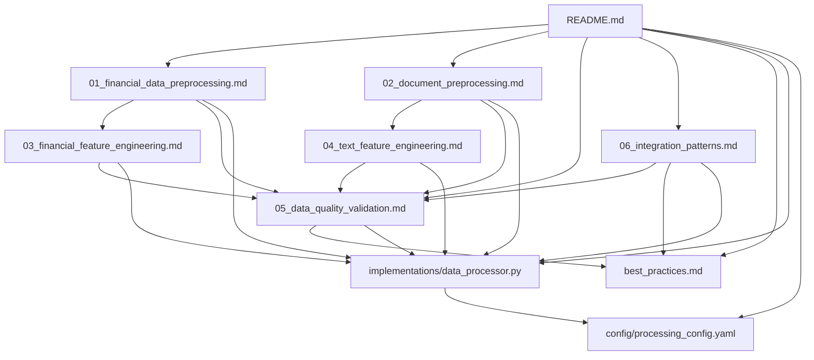

# Data Processing Documentation Index

This comprehensive index provides quick access to all data processing documentation, implementations, and resources for the IPO valuation platform.

## 📚 Documentation Structure

### Core Documentation Files

| Document | Description | Key Topics | Dependencies |
|----------|-------------|------------|-------------|
| **[README.md](./README.md)** | Main entry point and overview | Architecture, quick start, pipeline overview | None |
| **[01_financial_data_preprocessing.md](./01_financial_data_preprocessing.md)** | Financial data cleaning and preprocessing | Time series cleaning, outliers, imputation | None |
| **[02_document_preprocessing.md](./02_document_preprocessing.md)** | Document processing pipeline | PDF extraction, OCR, multi-language | None |
| **[03_financial_feature_engineering.md](./03_financial_feature_engineering.md)** | ML feature creation from financial data | Ratios, technical indicators, temporal features | 01 |
| **[04_text_feature_engineering.md](./04_text_feature_engineering.md)** | Text feature extraction and NLP | TF-IDF, embeddings, sentiment analysis | 02 |
| **[05_data_quality_validation.md](./05_data_quality_validation.md)** | Validation and quality assurance | Automated validation, statistical tests | All |
| **[06_integration_patterns.md](./06_integration_patterns.md)** | Data source integration patterns | ETL, streaming, API integration | All |
| **[best_practices.md](./best_practices.md)** | Industry standards and recommendations | Quality framework, performance, security | All |

### Implementation Resources

| Resource | Type | Description | Usage |
|----------|------|-------------|--------|
| **[implementations/data_processor.py](./implementations/data_processor.py)** | Python Module | Unified data processing interface | Import and use classes |
| **[config/processing_config.yaml](./config/processing_config.yaml)** | Configuration | Complete configuration template | Copy and customize |

## 🎯 Quick Reference by Use Case

### Data Scientists & Analysts

#### Getting Started
1. Read **[README.md](./README.md)** for overview
2. Review **[03_financial_feature_engineering.md](./03_financial_feature_engineering.md)** for ML features
3. Check **[04_text_feature_engineering.md](./04_text_feature_engineering.md)** for NLP features
4. Use **[implementations/data_processor.py](./implementations/data_processor.py)** for implementation

#### Key Sections
- **Financial Ratios**: [Section 1](./03_financial_feature_engineering.md#1-financial-ratio-calculations-and-transformations)
- **Technical Indicators**: [Section 2](./03_financial_feature_engineering.md#2-technical-indicators-and-market-sentiment)
- **Text Features**: [Section 1](./04_text_feature_engineering.md#1-tf-idf-vectorization-for-financial-documents)
- **Data Quality**: [Section 1](./05_data_quality_validation.md#1-automated-data-validation-framework)

### Data Engineers

#### Getting Started
1. Read **[README.md](./README.md)** for architecture
2. Study **[06_integration_patterns.md](./06_integration_patterns.md)** for ETL patterns
3. Review **[01_financial_data_preprocessing.md](./01_financial_data_preprocessing.md)** for preprocessing
4. Implement using **[implementations/data_processor.py](./implementations/data_processor.py)**

#### Key Sections
- **ETL Pipelines**: [Section 1](./06_integration_patterns.md#1-etl-pipelines-for-asx-and-asic-data)
- **Real-time Streaming**: [Section 2](./06_integration_patterns.md#2-real-time-streaming-architecture)
- **Data Cleaning**: [Section 1](./01_financial_data_preprocessing.md#1-time-series-data-cleaning)
- **Performance**: [Section 2](./best_practices.md#2-performance-optimization)

### DevOps & Platform Engineers

#### Getting Started
1. Read **[best_practices.md](./best_practices.md)** for operations
2. Review **[config/processing_config.yaml](./config/processing_config.yaml)** for configuration
3. Study **[05_data_quality_validation.md](./05_data_quality_validation.md)** for monitoring
4. Check **[06_integration_patterns.md](./06_integration_patterns.md)** for infrastructure

#### Key Sections
- **Monitoring**: [Section 4](./best_practices.md#4-monitoring-and-alerting)
- **Error Handling**: [Section 3](./best_practices.md#3-error-handling-and-recovery)
- **Security**: [Section 5](./best_practices.md#5-security-and-compliance)
- **Performance**: [Section 2](./best_practices.md#2-performance-optimization)

### Product Managers & Business Users

#### Getting Started
1. Read **[README.md](./README.md)** for business context
2. Review **[best_practices.md](./best_practices.md)** sections 4-6 for compliance
3. Check **[05_data_quality_validation.md](./05_data_quality_validation.md)** for quality metrics

#### Key Sections
- **Data Quality KPIs**: [Section 4.2](./best_practices.md#42-key-performance-indicators-kpis)
- **Compliance**: [Section 5.2](./best_practices.md#52-regulatory-compliance)
- **Monitoring**: [Section 4.1](./best_practices.md#41-comprehensive-monitoring-framework)

## 🔍 Search Index by Topic

### A
- **API Integration**: [06_integration_patterns.md - Section 2.1](./06_integration_patterns.md#21-market-data-streaming-pipeline)
- **ASX Data**: [06_integration_patterns.md - Section 1.1](./06_integration_patterns.md#11-asx-market-data-etl-pipeline)
- **ASIC Data**: [06_integration_patterns.md - Section 1.2](./06_integration_patterns.md#12-asic-regulatory-data-etl-pipeline)
- **Automated Validation**: [05_data_quality_validation.md - Section 1](./05_data_quality_validation.md#1-automated-data-validation-framework)
- **Audit Logging**: [best_practices.md - Section 5.1](./best_practices.md#51-data-security-best-practices)

### B
- **Best Practices**: [best_practices.md](./best_practices.md)
- **Bias Detection**: [05_data_quality_validation.md - Section 2](./05_data_quality_validation.md#2-statistical-integrity-tests)

### C
- **Configuration**: [config/processing_config.yaml](./config/processing_config.yaml)
- **Currency Conversion**: [01_financial_data_preprocessing.md - Section 4](./01_financial_data_preprocessing.md#4-currency-conversion-and-inflation-adjustment)
- **Caching Strategies**: [06_integration_patterns.md - Section 2](./06_integration_patterns.md#2-real-time-streaming-architecture)

### D
- **Data Cleaning**: [01_financial_data_preprocessing.md - Section 1](./01_financial_data_preprocessing.md#1-time-series-data-cleaning)
- **Data Quality**: [05_data_quality_validation.md](./05_data_quality_validation.md)
- **Data Lineage**: [05_data_quality_validation.md - Section 1](./05_data_quality_validation.md#1-automated-data-validation-framework)
- **Document Processing**: [02_document_preprocessing.md](./02_document_preprocessing.md)

### E
- **Error Handling**: [best_practices.md - Section 3](./best_practices.md#3-error-handling-and-recovery)
- **ETL Pipelines**: [06_integration_patterns.md - Section 1](./06_integration_patterns.md#1-etl-pipelines-for-asx-and-asic-data)
- **Embeddings**: [04_text_feature_engineering.md - Section 2](./04_text_feature_engineering.md#2-word-embeddings-for-financial-terms)

### F
- **Feature Engineering**: [03_financial_feature_engineering.md](./03_financial_feature_engineering.md)
- **Financial Ratios**: [03_financial_feature_engineering.md - Section 1](./03_financial_feature_engineering.md#1-financial-ratio-calculations-and-transformations)

### I
- **Integration Patterns**: [06_integration_patterns.md](./06_integration_patterns.md)
- **Imputation**: [01_financial_data_preprocessing.md - Section 2](./01_financial_data_preprocessing.md#2-missing-value-imputation-strategies)

### M
- **Monitoring**: [best_practices.md - Section 4](./best_practices.md#4-monitoring-and-alerting)
- **Multi-language**: [02_document_preprocessing.md - Section 3](./02_document_preprocessing.md#3-multi-language-support)

### N
- **Normalization**: [01_financial_data_preprocessing.md - Section 3](./01_financial_data_preprocessing.md#3-normalization-and-standardization)
- **NLP Processing**: [04_text_feature_engineering.md](./04_text_feature_engineering.md)

### O
- **OCR Processing**: [02_document_preprocessing.md - Section 1.2](./02_document_preprocessing.md#12-ocr-error-correction)
- **Outlier Detection**: [01_financial_data_preprocessing.md - Section 1.2](./01_financial_data_preprocessing.md#12-outlier-detection-methods)

### P
- **PDF Processing**: [02_document_preprocessing.md - Section 1.1](./02_document_preprocessing.md#11-advanced-pdf-processing)
- **Performance**: [best_practices.md - Section 2](./best_practices.md#2-performance-optimization)
- **Phrase Analysis**: [04_text_feature_engineering.md - Section 1.2](./04_text_feature_engineering.md#12-financial-phrase-detection-and-n-gram-analysis)

### R
- **Real-time Streaming**: [06_integration_patterns.md - Section 2](./06_integration_patterns.md#2-real-time-streaming-architecture)

### S
- **Security**: [best_practices.md - Section 5](./best_practices.md#5-security-and-compliance)
- **Statistical Tests**: [05_data_quality_validation.md - Section 2](./05_data_quality_validation.md#2-statistical-integrity-tests)
- **Seasonal Adjustment**: [01_financial_data_preprocessing.md - Section 5](./01_financial_data_preprocessing.md#5-seasonal-adjustment-and-detrending)

### T
- **Technical Indicators**: [03_financial_feature_engineering.md - Section 2](./03_financial_feature_engineering.md#2-technical-indicators-and-market-sentiment)
- **Text Processing**: [04_text_feature_engineering.md](./04_text_feature_engineering.md)
- **TF-IDF**: [04_text_feature_engineering.md - Section 1](./04_text_feature_engineering.md#1-tf-idf-vectorization-for-financial-documents)
- **Time Series**: [03_financial_feature_engineering.md - Section 3](./03_financial_feature_engineering.md#3-time-based-features-and-temporal-patterns)

### V
- **Validation Framework**: [05_data_quality_validation.md - Section 1](./05_data_quality_validation.md#1-automated-data-validation-framework)

## 🔗 Cross-References and Dependencies

### Document Dependencies Graph

### Code Dependencies

| Module | Dependencies | Used By |
|--------|-------------|---------|
| `FinancialDataCleaner` | pandas, numpy, scipy | Feature engineering, validation |
| `PDFProcessor` | PyPDF2, pdfplumber, camelot | Document analysis, text features |
| `FinancialRatioCalculator` | pandas, numpy | ML models, validation |
| `TechnicalIndicatorCalculator` | talib, pandas | Feature engineering, models |
| `FinancialTfIdfVectorizer` | sklearn, nltk | NLP models, text analysis |
| `DataValidator` | pandas, scipy, sklearn | All processing pipelines |
| `ASXDataETL` | asyncio, aiohttp, sqlalchemy | Data ingestion, streaming |

### Configuration Dependencies

| Component | Config Section | Dependencies |
|-----------|----------------|-------------|
| Financial Preprocessing | `financial_preprocessing` | None |
| Document Processing | `document_processing` | `text_processing` |
| Feature Engineering | `feature_engineering` | `financial_preprocessing` |
| Text Processing | `text_processing` | `document_processing` |
| Validation | `validation` | All processing sections |
| Integration | `data_sources` | External APIs, databases |

## 📋 Implementation Checklists

### New Developer Onboarding Checklist

#### Week 1: Foundations
- [ ] Read [README.md](./README.md) for platform overview
- [ ] Set up development environment using [config/processing_config.yaml](./config/processing_config.yaml)
- [ ] Review [best_practices.md](./best_practices.md) sections 1-3
- [ ] Complete Python environment setup with required packages
- [ ] Run basic examples from [implementations/data_processor.py](./implementations/data_processor.py)

#### Week 2: Deep Dive
- [ ] Study financial preprocessing: [01_financial_data_preprocessing.md](./01_financial_data_preprocessing.md)
- [ ] Complete document processing tutorial: [02_document_preprocessing.md](./02_document_preprocessing.md)
- [ ] Implement sample feature engineering: [03_financial_feature_engineering.md](./03_financial_feature_engineering.md)
- [ ] Set up validation framework: [05_data_quality_validation.md](./05_data_quality_validation.md)
- [ ] Shadow experienced developer on integration task

### Production Deployment Checklist

#### Pre-Deployment
- [ ] All code reviewed and approved
- [ ] Configuration validated using [config/processing_config.yaml](./config/processing_config.yaml)
- [ ] Data quality validation rules implemented
- [ ] Performance benchmarks met (see [best_practices.md](./best_practices.md))
- [ ] Security scan completed
- [ ] Integration tests passing
- [ ] Documentation updated

#### Deployment
- [ ] Monitoring and alerting configured
- [ ] Error handling and recovery tested
- [ ] Rollback plan prepared and tested
- [ ] Health checks implemented
- [ ] Audit logging configured
- [ ] Performance monitoring enabled

#### Post-Deployment
- [ ] Monitoring dashboards verified
- [ ] Data quality metrics tracked
- [ ] Performance within expected ranges
- [ ] Error rates below thresholds
- [ ] Stakeholder notification sent
- [ ] Documentation updated with deployment notes

## 🔧 Troubleshooting Guide

### Common Issues and Solutions

#### Data Processing Issues

| Issue | Symptoms | Solution | Reference |
|-------|----------|----------|-----------|
| **Memory Errors** | OutOfMemoryError during processing | Use chunked processing, optimize data types | [best_practices.md - Section 2.2](./best_practices.md#22-memory-management-best-practices) |
| **Missing Data** | NaN values in processed output | Review imputation configuration | [01_financial_data_preprocessing.md - Section 2](./01_financial_data_preprocessing.md#2-missing-value-imputation-strategies) |
| **Validation Failures** | Data quality checks failing | Check validation rules configuration | [05_data_quality_validation.md - Section 1](./05_data_quality_validation.md#1-automated-data-validation-framework) |
| **Performance Issues** | Slow processing times | Profile code, implement parallel processing | [best_practices.md - Section 2.1](./best_practices.md#21-efficient-data-processing-patterns) |

#### Integration Issues

| Issue | Symptoms | Solution | Reference |
|-------|----------|----------|-----------|
| **API Rate Limits** | 429 errors from external APIs | Implement backoff, respect rate limits | [06_integration_patterns.md - Section 1.1](./06_integration_patterns.md#11-asx-market-data-etl-pipeline) |
| **Connection Timeouts** | Network timeout errors | Configure retries, increase timeouts | [best_practices.md - Section 3.1](./best_practices.md#31-robust-error-handling-framework) |
| **Data Format Changes** | Parsing errors from external sources | Implement schema validation, add fallbacks | [02_document_preprocessing.md - Section 2](./02_document_preprocessing.md#2-htmlxml-parsing-for-web-scraped-data) |

#### Text Processing Issues

| Issue | Symptoms | Solution | Reference |
|-------|----------|----------|-----------|
| **OCR Quality Issues** | Poor text extraction from PDFs | Adjust OCR settings, use multiple methods | [02_document_preprocessing.md - Section 1.2](./02_document_preprocessing.md#12-ocr-error-correction) |
| **Language Detection Errors** | Wrong language detected | Fine-tune detection parameters | [02_document_preprocessing.md - Section 3.1](./02_document_preprocessing.md#31-language-detection-and-translation) |
| **TF-IDF Memory Issues** | Memory errors with large vocabulary | Reduce max_features, use sparse matrices | [04_text_feature_engineering.md - Section 1.1](./04_text_feature_engineering.md#11-financial-specific-tf-idf-implementation) |

## 📞 Support and Contact Information

### Documentation Maintenance

| Component | Owner | Contact | Update Frequency |
|-----------|-------|---------|------------------|
| Core Documentation | Data Engineering Team | data-eng@company.com | Monthly |
| Implementation Code | Senior Data Engineers | senior-de@company.com | As needed |
| Configuration | DevOps Team | devops@company.com | Quarterly |
| Best Practices | Architecture Team | architects@company.com | Quarterly |

### Getting Help

1. **Documentation Issues**: Create issue in documentation repository
2. **Implementation Help**: Contact Data Engineering Team via Slack #data-eng
3. **Performance Issues**: Contact DevOps Team via Slack #devops
4. **Architecture Questions**: Contact Architecture Team via Slack #architecture

### Contributing to Documentation

1. Fork the documentation repository
2. Make changes following the style guide in [best_practices.md](./best_practices.md)
3. Test examples and code snippets
4. Submit pull request with detailed description
5. Address review comments and merge

---

This index serves as the central navigation hub for all data processing documentation. Keep it updated as new documents are added or existing ones are modified.