# Google Cloud AI/ML Services Integration Guide

## Overview

This comprehensive guide covers the complete integration of Google Cloud AI/ML services into the IPO valuation platform, specifically tailored for Australian Securities Exchange (ASX) requirements and financial document processing.

## Architecture Overview

```mermaid
graph TB
    A[IPO Valuation Platform] --> B[Vertex AI Services]
    A --> C[Document AI Services]
    A --> D[BigQuery ML]
    A --> E[Natural Language AI]
    
    B --> B1[Custom Model Training]
    B --> B2[AutoML Integration]
    B --> B3[Model Deployment]
    B --> B4[Batch Predictions]
    B --> B5[Pipeline Orchestration]
    B --> B6[Feature Store]
    
    C --> C1[Document Processors]
    C --> C2[Prospectus Parsing]
    C --> C3[Form Parsers]
    C --> C4[OCR Integration]
    C --> C5[Document Classification]
    C --> C6[Batch Processing]
    
    D --> D1[SQL-based ML Models]
    D --> D2[Time Series Forecasting]
    D --> D3[Classification Models]
    D --> D4[Model Evaluation]
    D --> D5[Real-time Predictions]
    
    E --> E1[Entity Extraction]
    E --> E2[Sentiment Analysis]
    E --> E3[Document Summarization]
    E --> E4[Translation Services]
    E --> E5[Content Classification]
```



## Service Integration Matrix

| Service | Primary Use Case | Australian Financial Focus | Production Ready |
|---------|------------------|----------------------------|------------------|
| Vertex AI Training | Custom valuation models | ASX sector-specific models | ✅ |
| AutoML | Automated model development | Financial document classification | ✅ |
| Vertex AI Endpoints | Model serving | Real-time IPO scoring | ✅ |
| Document AI | Document processing | Prospectus and filing extraction | ✅ |
| BigQuery ML | Data warehouse ML | Time series financial forecasting | ✅ |
| Natural Language AI | Text analysis | Financial sentiment and entity extraction | ✅ |

## Quick Start

### Prerequisites

```bash
# Install Google Cloud SDK
curl https://sdk.cloud.google.com | bash
exec -l $SHELL

# Set up authentication
gcloud auth login
gcloud auth application-default login

# Set project and region
gcloud config set project YOUR_PROJECT_ID
gcloud config set compute/region australia-southeast1
```

### Initial Setup

```bash
# Enable required APIs
gcloud services enable aiplatform.googleapis.com
gcloud services enable documentai.googleapis.com
gcloud services enable bigquery.googleapis.com
gcloud services enable language.googleapis.com
gcloud services enable monitoring.googleapis.com

# Create service account
gcloud iam service-accounts create ipo-valuation-ai \
    --description="Service account for IPO valuation AI services" \
    --display-name="IPO Valuation AI"
```

## Implementation Guides

### 1. Vertex AI Integration
- [Custom Model Training](./vertex-ai/custom-training.md)
- [AutoML Integration](./vertex-ai/automl-integration.md)
- [Model Deployment](./vertex-ai/model-deployment.md)
- [Batch Predictions](./vertex-ai/batch-predictions.md)
- [Pipeline Orchestration](./vertex-ai/pipeline-orchestration.md)
- [Feature Store](./vertex-ai/feature-store.md)

### 2. Document AI Integration
- [Custom Document Processors](./document-ai/custom-processors.md)
- [Prospectus Parsing](./document-ai/prospectus-parsing.md)
- [Form Parser Configuration](./document-ai/form-parsers.md)
- [OCR Integration](./document-ai/ocr-integration.md)
- [Document Classification](./document-ai/document-classification.md)
- [Batch Processing](./document-ai/batch-processing.md)

### 3. BigQuery ML Implementation
- [SQL-based ML Workflows](./bigquery-ml/sql-workflows.md)
- [Time Series Forecasting](./bigquery-ml/time-series-forecasting.md)
- [Classification Models](./bigquery-ml/classification-models.md)
- [Model Evaluation](./bigquery-ml/model-evaluation.md)
- [Real-time Predictions](./bigquery-ml/realtime-predictions.md)

### 4. Natural Language AI Services
- [Entity Extraction](./natural-language/entity-extraction.md)
- [Sentiment Analysis](./natural-language/sentiment-analysis.md)
- [Document Summarization](./natural-language/document-summarization.md)
- [Translation Services](./natural-language/translation.md)
- [Content Classification](./natural-language/content-classification.md)

### 5. Production Implementation
- [Authentication & Service Accounts](./production/authentication.md)
- [API Client Libraries](./production/api-clients.md)
- [Error Handling & Resilience](./production/error-handling.md)
- [Cost Optimization](./production/cost-optimization.md)
- [Performance Tuning](./production/performance-tuning.md)
- [Security Best Practices](./production/security.md)

### 6. Monitoring & Operations
- [Cloud Monitoring Integration](./monitoring/cloud-monitoring.md)
- [Custom Metrics & Alerting](./monitoring/metrics-alerting.md)
- [Logging & Debugging](./monitoring/logging-debugging.md)
- [Performance Profiling](./monitoring/performance-profiling.md)
- [Capacity Planning](./monitoring/capacity-planning.md)
- [Disaster Recovery](./monitoring/disaster-recovery.md)

## Terraform Infrastructure

- [Main Infrastructure](./terraform/main.tf)
- [Vertex AI Resources](./terraform/vertex-ai.tf)
- [Document AI Resources](./terraform/document-ai.tf)
- [BigQuery ML Resources](./terraform/bigquery-ml.tf)
- [Monitoring Resources](./terraform/monitoring.tf)

## Code Examples

- [Python SDK Examples](./examples/python/)
- [Node.js SDK Examples](./examples/nodejs/)
- [REST API Examples](./examples/rest-api/)
- [Integration Patterns](./examples/patterns/)

## Performance Benchmarks

| Service | Throughput | Latency (P95) | Cost per 1M requests |
|---------|------------|---------------|---------------------|
| Vertex AI Online Prediction | 1000 RPS | < 100ms | $50-200 |
| Document AI Processing | 100 docs/min | 2-5s per doc | $1.50 per 1000 pages |
| BigQuery ML Prediction | 10K RPS | < 50ms | $5 per TB processed |
| Natural Language API | 600 RPS | < 200ms | $1-3 per 1000 requests |

## Cost Optimization Strategies

1. **Batch Processing**: Use batch prediction for non-real-time workloads
2. **Model Caching**: Implement intelligent caching for frequently requested predictions
3. **Resource Scheduling**: Scale resources based on market hours and demand
4. **Data Lifecycle**: Implement automatic data archiving and cleanup
5. **Region Selection**: Use australia-southeast1 for local data residency and lower latency

## Security Considerations

- Data residency compliance for Australian financial data
- Encryption at rest and in transit
- IAM role-based access control
- API key rotation and management
- Audit logging and compliance reporting
- GDPR and Australian Privacy Act compliance

## Support and Troubleshooting

- [Common Issues and Solutions](./troubleshooting.md)
- [Performance Tuning Guide](./performance-guide.md)
- [Cost Analysis Tools](./cost-analysis.md)
- [Monitoring Dashboards](./monitoring-dashboards.md)

## Version History

- v1.0.0 - Initial implementation with core services
- v1.1.0 - Added Document AI custom processors
- v1.2.0 - BigQuery ML time series forecasting
- v1.3.0 - Enhanced monitoring and alerting
- v2.0.0 - Production-ready with full Australian compliance

## Contributing

See [CONTRIBUTING.md](../../CONTRIBUTING.md) for guidelines on contributing to this integration guide.