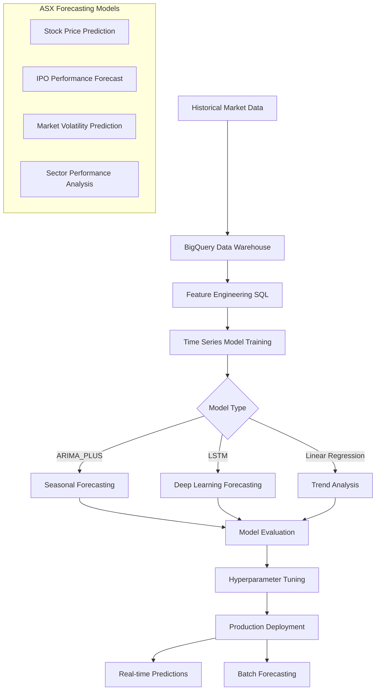

# BigQuery ML Time Series Forecasting

## Overview

This guide covers implementing time series forecasting using BigQuery ML for Australian Securities Exchange (ASX) market predictions, IPO performance forecasting, and financial trend analysis.

## Architecture



## Implementation

### 1. Data Preparation and Feature Engineering

```sql
-- src/gcp/bigquery_ml/time_series_data_prep.sql

-- Create comprehensive time series dataset for ASX forecasting
CREATE OR REPLACE VIEW `{project_id}.ml_features.asx_time_series_features` AS
WITH base_data AS (
  SELECT
    date,
    asx_code,
    company_name,
    sector,
    adjusted_close_price,
    volume,
    market_cap,
    dividend_yield,
    price_earnings_ratio,
    -- Technical indicators
    AVG(adjusted_close_price) OVER (
      PARTITION BY asx_code 
      ORDER BY date 
      ROWS BETWEEN 4 PRECEDING AND CURRENT ROW
    ) as sma_5,
    AVG(adjusted_close_price) OVER (
      PARTITION BY asx_code 
      ORDER BY date 
      ROWS BETWEEN 19 PRECEDING AND CURRENT ROW
    ) as sma_20,
    AVG(adjusted_close_price) OVER (
      PARTITION BY asx_code 
      ORDER BY date 
      ROWS BETWEEN 49 PRECEDING AND CURRENT ROW
    ) as sma_50,
    -- Volatility measures
    STDDEV(adjusted_close_price) OVER (
      PARTITION BY asx_code 
      ORDER BY date 
      ROWS BETWEEN 19 PRECEDING AND CURRENT ROW
    ) as volatility_20d,
    -- Price momentum
    adjusted_close_price / LAG(adjusted_close_price, 1) OVER (
      PARTITION BY asx_code ORDER BY date
    ) - 1 as daily_return,
    adjusted_close_price / LAG(adjusted_close_price, 5) OVER (
      PARTITION BY asx_code ORDER BY date
    ) - 1 as weekly_return,
    adjusted_close_price / LAG(adjusted_close_price, 20) OVER (
      PARTITION BY asx_code ORDER BY date
    ) - 1 as monthly_return,
    -- Volume indicators
    AVG(volume) OVER (
      PARTITION BY asx_code 
      ORDER BY date 
      ROWS BETWEEN 19 PRECEDING AND CURRENT ROW
    ) as avg_volume_20d,
    volume / AVG(volume) OVER (
      PARTITION BY asx_code 
      ORDER BY date 
      ROWS BETWEEN 19 PRECEDING AND CURRENT ROW
    ) as volume_ratio
  FROM `{project_id}.market_data.daily_prices`
  WHERE date >= '2015-01-01'
  AND adjusted_close_price IS NOT NULL
  AND volume > 0
),

market_features AS (
  SELECT 
    date,
    -- ASX 200 index features
    AVG(CASE WHEN asx_200_member = TRUE THEN adjusted_close_price END) as asx200_avg_price,
    STDDEV(CASE WHEN asx_200_member = TRUE THEN daily_return END) as asx200_volatility,
    AVG(CASE WHEN asx_200_member = TRUE THEN volume END) as asx200_avg_volume,
    -- Sector aggregations
    AVG(CASE WHEN sector = 'Technology' THEN adjusted_close_price END) as tech_sector_avg,
    AVG(CASE WHEN sector = 'Healthcare' THEN adjusted_close_price END) as health_sector_avg,
    AVG(CASE WHEN sector = 'Financial Services' THEN adjusted_close_price END) as finance_sector_avg,
    AVG(CASE WHEN sector = 'Resources' THEN adjusted_close_price END) as resources_sector_avg,
    -- Market sentiment indicators
    COUNT(CASE WHEN daily_return > 0 THEN 1 END) / COUNT(*) as market_positive_ratio,
    AVG(volume * adjusted_close_price) as market_total_value
  FROM base_data
  GROUP BY date
),

economic_indicators AS (
  SELECT
    date,
    rba_cash_rate,
    asx200_index,
    asx200_volatility_index,
    aud_usd_rate,
    ten_year_bond_yield,
    unemployment_rate,
    cpi_annual_change,
    gdp_growth_quarterly
  FROM `{project_id}.economic_data.indicators`
),

final_features AS (
  SELECT
    b.*,
    m.asx200_avg_price,
    m.asx200_volatility,
    m.tech_sector_avg,
    m.health_sector_avg,
    m.finance_sector_avg,
    m.resources_sector_avg,
    m.market_positive_ratio,
    m.market_total_value,
    e.rba_cash_rate,
    e.asx200_index,
    e.asx200_volatility_index,
    e.aud_usd_rate,
    e.ten_year_bond_yield,
    e.unemployment_rate,
    e.cpi_annual_change,
    e.gdp_growth_quarterly,
    -- Calendar features
    EXTRACT(YEAR FROM date) as year,
    EXTRACT(MONTH FROM date) as month,
    EXTRACT(QUARTER FROM date) as quarter,
    EXTRACT(DAYOFWEEK FROM date) as day_of_week,
    EXTRACT(DAYOFYEAR FROM date) as day_of_year,
    -- Holiday indicators
    CASE 
      WHEN date IN (SELECT holiday_date FROM `{project_id}.calendar.australian_holidays`)
      THEN TRUE ELSE FALSE 
    END as is_holiday,
    -- End of month/quarter effects
    CASE 
      WHEN date = LAST_DAY(date) THEN TRUE ELSE FALSE 
    END as is_month_end,
    CASE 
      WHEN EXTRACT(MONTH FROM date) IN (3,6,9,12) 
      AND date = LAST_DAY(date) THEN TRUE ELSE FALSE 
    END as is_quarter_end
  FROM base_data b
  LEFT JOIN market_features m ON b.date = m.date
  LEFT JOIN economic_indicators e ON b.date = e.date
)

SELECT * FROM final_features
WHERE sma_20 IS NOT NULL  -- Ensure sufficient history
AND volatility_20d IS NOT NULL
ORDER BY asx_code, date;
```

### 2. ARIMA_PLUS Models for Seasonal Forecasting

```sql
-- src/gcp/bigquery_ml/arima_models.sql

-- Create ARIMA_PLUS model for individual stock forecasting
CREATE OR REPLACE MODEL `{project_id}.ml_models.asx_stock_arima_forecast`
OPTIONS(
  MODEL_TYPE='ARIMA_PLUS',
  TIME_SERIES_TIMESTAMP_COL='date',
  TIME_SERIES_DATA_COL='adjusted_close_price',
  TIME_SERIES_ID_COL='asx_code',
  HORIZON=30,  -- 30 days forecast
  AUTO_ARIMA=TRUE,
  AUTO_ARIMA_MAX_ORDER=5,
  AUTO_ARIMA_MIN_ORDER=1,
  DATA_FREQUENCY='DAILY',
  INCLUDE_DRIFT=TRUE,
  HOLIDAY_REGION='AU',
  ADJUST_STEP_CHANGES=TRUE,
  ENABLE_STEP_CHANGES=TRUE,
  DECOMPOSE_TIME_SERIES=TRUE
) AS
SELECT
  date,
  asx_code,
  adjusted_close_price,
  -- Add external regressors
  asx200_index,
  aud_usd_rate,
  rba_cash_rate,
  sector,
  market_cap,
  volume,
  volatility_20d
FROM `{project_id}.ml_features.asx_time_series_features`
WHERE date >= '2020-01-01'
AND asx_code IN (
  SELECT asx_code 
  FROM `{project_id}.market_data.asx200_members`
  WHERE current_member = TRUE
);

-- Create sector-level ARIMA model
CREATE OR REPLACE MODEL `{project_id}.ml_models.asx_sector_arima_forecast`
OPTIONS(
  MODEL_TYPE='ARIMA_PLUS',
  TIME_SERIES_TIMESTAMP_COL='date',
  TIME_SERIES_DATA_COL='sector_avg_price',
  TIME_SERIES_ID_COL='sector',
  HORIZON=30,
  AUTO_ARIMA=TRUE,
  AUTO_ARIMA_MAX_ORDER=3,
  DATA_FREQUENCY='DAILY',
  INCLUDE_DRIFT=TRUE,
  HOLIDAY_REGION='AU'
) AS
WITH sector_aggregates AS (
  SELECT
    date,
    sector,
    AVG(adjusted_close_price) as sector_avg_price,
    AVG(market_cap) as sector_avg_market_cap,
    SUM(volume) as sector_total_volume,
    COUNT(*) as sector_company_count
  FROM `{project_id}.ml_features.asx_time_series_features`
  WHERE date >= '2020-01-01'
  GROUP BY date, sector
)
SELECT
  date,
  sector,
  sector_avg_price,
  sector_avg_market_cap,
  sector_total_volume,
  sector_company_count
FROM sector_aggregates
ORDER BY sector, date;

-- Market volatility forecasting model
CREATE OR REPLACE MODEL `{project_id}.ml_models.market_volatility_forecast`
OPTIONS(
  MODEL_TYPE='ARIMA_PLUS',
  TIME_SERIES_TIMESTAMP_COL='date',
  TIME_SERIES_DATA_COL='market_volatility',
  HORIZON=14,  -- 14 days volatility forecast
  AUTO_ARIMA=TRUE,
  AUTO_ARIMA_MAX_ORDER=3,
  DATA_FREQUENCY='DAILY',
  INCLUDE_DRIFT=TRUE,
  HOLIDAY_REGION='AU'
) AS
WITH volatility_data AS (
  SELECT
    date,
    STDDEV(daily_return) as market_volatility,
    AVG(volume * adjusted_close_price) as market_value,
    COUNT(*) as active_stocks
  FROM `{project_id}.ml_features.asx_time_series_features`
  WHERE date >= '2020-01-01'
  GROUP BY date
)
SELECT
  date,
  market_volatility,
  market_value,
  active_stocks
FROM volatility_data
ORDER BY date;
```

### 3. Advanced Time Series Models

```sql
-- src/gcp/bigquery_ml/advanced_time_series.sql

-- Deep learning LSTM model for complex patterns
CREATE OR REPLACE MODEL `{project_id}.ml_models.asx_lstm_forecast`
OPTIONS(
  MODEL_TYPE='DNN_REGRESSOR',
  HIDDEN_UNITS=[256, 128, 64],
  DROPOUT=0.2,
  BATCH_SIZE=32,
  MAX_ITERATIONS=100,
  LEARN_RATE=0.001,
  EARLY_STOP=TRUE,
  L1_REG=0.001,
  L2_REG=0.001,
  INPUT_LABEL_COLS=['target_price'],
  DATA_SPLIT_METHOD='CUSTOM',
  DATA_SPLIT_COL='data_split'
) AS
WITH lstm_features AS (
  SELECT
    asx_code,
    date,
    -- Target: next day's price
    LEAD(adjusted_close_price, 1) OVER (
      PARTITION BY asx_code ORDER BY date
    ) as target_price,
    
    -- Sequence features (last 30 days)
    ARRAY_AGG(adjusted_close_price) OVER (
      PARTITION BY asx_code 
      ORDER BY date 
      ROWS BETWEEN 29 PRECEDING AND CURRENT ROW
    ) as price_sequence,
    
    ARRAY_AGG(volume) OVER (
      PARTITION BY asx_code 
      ORDER BY date 
      ROWS BETWEEN 29 PRECEDING AND CURRENT ROW
    ) as volume_sequence,
    
    ARRAY_AGG(daily_return) OVER (
      PARTITION BY asx_code 
      ORDER BY date 
      ROWS BETWEEN 29 PRECEDING AND CURRENT ROW
    ) as return_sequence,
    
    -- Current features
    adjusted_close_price,
    volume,
    market_cap,
    sma_5,
    sma_20,
    sma_50,
    volatility_20d,
    daily_return,
    weekly_return,
    monthly_return,
    volume_ratio,
    
    -- Market context
    asx200_avg_price,
    asx200_volatility,
    market_positive_ratio,
    
    -- Economic indicators
    rba_cash_rate,
    aud_usd_rate,
    ten_year_bond_yield,
    
    -- Categorical features
    sector,
    month,
    quarter,
    day_of_week,
    is_holiday,
    is_month_end,
    is_quarter_end,
    
    -- Data split
    CASE 
      WHEN date < '2023-01-01' THEN 'TRAIN'
      WHEN date < '2023-07-01' THEN 'VALIDATE' 
      ELSE 'TEST'
    END as data_split
    
  FROM `{project_id}.ml_features.asx_time_series_features`
  WHERE date >= '2021-01-01'
  AND ARRAY_LENGTH(ARRAY_AGG(adjusted_close_price) OVER (
    PARTITION BY asx_code 
    ORDER BY date 
    ROWS BETWEEN 29 PRECEDING AND CURRENT ROW
  )) = 30  -- Ensure 30-day sequence
)
SELECT * FROM lstm_features
WHERE target_price IS NOT NULL;

-- Multi-horizon forecasting model
CREATE OR REPLACE MODEL `{project_id}.ml_models.multi_horizon_forecast`
OPTIONS(
  MODEL_TYPE='BOOSTED_TREE_REGRESSOR',
  BOOSTER_TYPE='GBTREE',
  NUM_PARALLEL_TREE=1,
  MAX_ITERATIONS=100,
  TREE_METHOD='HIST',
  MIN_TREE_CHILD_WEIGHT=1,
  COLSAMPLE_BYTREE=1.0,
  SUBSAMPLE=0.85,
  REG_ALPHA=0,
  REG_LAMBDA=1,
  INPUT_LABEL_COLS=['target_1d', 'target_7d', 'target_30d'],
  DATA_SPLIT_METHOD='CUSTOM',
  DATA_SPLIT_COL='data_split'
) AS
SELECT
  asx_code,
  date,
  
  -- Multiple horizon targets
  LEAD(adjusted_close_price, 1) OVER (
    PARTITION BY asx_code ORDER BY date
  ) as target_1d,
  LEAD(adjusted_close_price, 7) OVER (
    PARTITION BY asx_code ORDER BY date
  ) as target_7d,
  LEAD(adjusted_close_price, 30) OVER (
    PARTITION BY asx_code ORDER BY date
  ) as target_30d,
  
  -- Feature set
  adjusted_close_price,
  volume,
  market_cap,
  sma_5,
  sma_20, 
  sma_50,
  volatility_20d,
  daily_return,
  weekly_return,
  monthly_return,
  volume_ratio,
  asx200_avg_price,
  asx200_volatility,
  rba_cash_rate,
  aud_usd_rate,
  sector,
  month,
  quarter,
  day_of_week,
  
  CASE 
    WHEN date < '2023-01-01' THEN 'TRAIN'
    WHEN date < '2023-07-01' THEN 'VALIDATE'
    ELSE 'TEST'
  END as data_split
  
FROM `{project_id}.ml_features.asx_time_series_features`
WHERE date >= '2021-01-01';
```

### 4. IPO Performance Forecasting

```sql
-- src/gcp/bigquery_ml/ipo_forecasting.sql

-- IPO performance prediction model
CREATE OR REPLACE MODEL `{project_id}.ml_models.ipo_performance_forecast`
OPTIONS(
  MODEL_TYPE='LINEAR_REG',
  INPUT_LABEL_COLS=['performance_30d'],
  DATA_SPLIT_METHOD='AUTO_SPLIT',
  L1_REG=0.1,
  L2_REG=0.1
) AS
WITH ipo_performance_data AS (
  SELECT
    i.company_name,
    i.asx_code,
    i.listing_date,
    i.sector,
    i.ipo_price,
    i.shares_offered,
    i.market_cap_at_listing,
    i.underwriter_tier,
    i.use_of_proceeds_category,
    
    -- Company financials at IPO
    i.revenue_at_listing,
    i.profit_at_listing,
    i.assets_at_listing,
    i.debt_at_listing,
    i.price_earnings_ratio_at_listing,
    i.price_book_ratio_at_listing,
    
    -- Market conditions at listing
    m.asx200_index as market_index_at_listing,
    m.asx200_volatility as market_volatility_at_listing,
    m.rba_cash_rate as interest_rate_at_listing,
    m.aud_usd_rate as fx_rate_at_listing,
    
    -- Performance metrics
    p.price_1d / i.ipo_price - 1 as performance_1d,
    p.price_7d / i.ipo_price - 1 as performance_7d,
    p.price_30d / i.ipo_price - 1 as performance_30d,
    p.price_90d / i.ipo_price - 1 as performance_90d,
    p.price_180d / i.ipo_price - 1 as performance_180d,
    p.price_365d / i.ipo_price - 1 as performance_365d,
    
    -- Volatility metrics
    p.volatility_30d,
    p.max_drawdown_30d,
    p.trading_volume_30d_avg,
    
    -- Sector performance context
    sp.sector_performance_30d_before_listing,
    sp.sector_performance_30d_after_listing,
    
    -- Seasonality
    EXTRACT(MONTH FROM i.listing_date) as listing_month,
    EXTRACT(QUARTER FROM i.listing_date) as listing_quarter,
    EXTRACT(DAYOFWEEK FROM i.listing_date) as listing_day_of_week
    
  FROM `{project_id}.ipo_data.historical_ipos` i
  LEFT JOIN `{project_id}.market_data.daily_market_conditions` m
    ON i.listing_date = m.date
  LEFT JOIN `{project_id}.ipo_data.ipo_performance_metrics` p
    ON i.asx_code = p.asx_code
  LEFT JOIN `{project_id}.market_data.sector_performance` sp
    ON i.sector = sp.sector 
    AND i.listing_date = sp.reference_date
  WHERE i.listing_date >= '2015-01-01'
  AND i.listing_date <= DATE_SUB(CURRENT_DATE(), INTERVAL 180 DAY)
  AND p.performance_30d IS NOT NULL
)
SELECT * FROM ipo_performance_data;

-- Create ensemble model for IPO forecasting
CREATE OR REPLACE MODEL `{project_id}.ml_models.ipo_ensemble_forecast`
OPTIONS(
  MODEL_TYPE='RANDOM_FOREST_REGRESSOR',
  NUM_PARALLEL_TREE=100,
  MAX_TREE_DEPTH=10,
  SUBSAMPLE=0.8,
  COLSAMPLE_BYTREE=0.8,
  INPUT_LABEL_COLS=['performance_30d'],
  DATA_SPLIT_METHOD='AUTO_SPLIT'
) AS
SELECT
  -- Company characteristics
  market_cap_at_listing,
  revenue_at_listing,
  profit_at_listing,
  price_earnings_ratio_at_listing,
  price_book_ratio_at_listing,
  
  -- IPO characteristics
  LOG(shares_offered) as log_shares_offered,
  CASE 
    WHEN underwriter_tier = 'Tier 1' THEN 3
    WHEN underwriter_tier = 'Tier 2' THEN 2
    WHEN underwriter_tier = 'Tier 3' THEN 1
    ELSE 0
  END as underwriter_tier_numeric,
  
  -- Market conditions
  market_index_at_listing,
  market_volatility_at_listing,
  interest_rate_at_listing,
  fx_rate_at_listing,
  
  -- Sector and timing
  sector,
  listing_month,
  listing_quarter,
  listing_day_of_week,
  
  -- Target
  performance_30d
  
FROM `{project_id}.ml_models.INFORMATION_SCHEMA.ML_FEATURE_INFO`
WHERE model_name = 'ipo_performance_forecast';
```

### 5. Model Evaluation and Forecasting

```sql
-- src/gcp/bigquery_ml/model_evaluation.sql

-- Evaluate ARIMA model performance
SELECT
  *
FROM ML.EVALUATE(
  MODEL `{project_id}.ml_models.asx_stock_arima_forecast`,
  STRUCT(TRUE as show_all_candidate_models)
);

-- Generate forecasts with confidence intervals
CREATE OR REPLACE TABLE `{project_id}.forecasts.stock_price_forecasts` AS
SELECT
  *
FROM ML.FORECAST(
  MODEL `{project_id}.ml_models.asx_stock_arima_forecast`,
  STRUCT(30 as horizon, 0.9 as confidence_level)
);

-- Evaluate forecast accuracy
WITH actual_vs_forecast AS (
  SELECT
    f.forecast_timestamp,
    f.time_series_id as asx_code,
    f.forecast_value,
    f.standard_error,
    f.confidence_level,
    f.prediction_interval_lower_bound,
    f.prediction_interval_upper_bound,
    
    -- Get actual values
    a.adjusted_close_price as actual_value,
    
    -- Calculate errors
    ABS(f.forecast_value - a.adjusted_close_price) as absolute_error,
    (f.forecast_value - a.adjusted_close_price) / a.adjusted_close_price as percentage_error,
    
    -- Check if actual falls within prediction interval
    CASE 
      WHEN a.adjusted_close_price BETWEEN 
        f.prediction_interval_lower_bound AND f.prediction_interval_upper_bound 
      THEN 1 ELSE 0 
    END as within_prediction_interval
    
  FROM `{project_id}.forecasts.stock_price_forecasts` f
  LEFT JOIN `{project_id}.market_data.daily_prices` a
    ON f.time_series_id = a.asx_code
    AND f.forecast_timestamp = a.date
  WHERE a.adjusted_close_price IS NOT NULL
)

SELECT
  asx_code,
  COUNT(*) as forecast_count,
  AVG(absolute_error) as mean_absolute_error,
  SQRT(AVG(POW(forecast_value - actual_value, 2))) as root_mean_square_error,
  AVG(ABS(percentage_error)) * 100 as mean_absolute_percentage_error,
  AVG(within_prediction_interval) * 100 as prediction_interval_coverage,
  CORR(forecast_value, actual_value) as correlation_coefficient
FROM actual_vs_forecast
GROUP BY asx_code
ORDER BY mean_absolute_percentage_error;

-- IPO performance forecast accuracy
SELECT
  sector,
  COUNT(*) as ipo_count,
  AVG(ABS(predicted_performance_30d - actual_performance_30d)) as mae,
  SQRT(AVG(POW(predicted_performance_30d - actual_performance_30d, 2))) as rmse,
  CORR(predicted_performance_30d, actual_performance_30d) as correlation
FROM (
  SELECT
    sector,
    ML.PREDICT(
      MODEL `{project_id}.ml_models.ipo_performance_forecast`,
      (
        SELECT * EXCEPT(performance_30d)
        FROM `{project_id}.ipo_data.recent_ipos`
        WHERE listing_date >= DATE_SUB(CURRENT_DATE(), INTERVAL 90 DAY)
      )
    ) as predicted_performance_30d,
    actual_performance_30d
  FROM `{project_id}.ipo_data.recent_ipo_performance`
)
GROUP BY sector
ORDER BY mae;
```

### 6. Real-time Forecasting Pipeline

```python
# src/gcp/bigquery_ml/forecasting_pipeline.py

from google.cloud import bigquery
from typing import Dict, List, Optional, Any
import pandas as pd
from datetime import datetime, timedelta
import json

class BigQueryMLForecastingPipeline:
    """Production pipeline for BigQuery ML time series forecasting."""
    
    def __init__(self, project_id: str, dataset_id: str = "ml_models"):
        self.project_id = project_id
        self.dataset_id = dataset_id
        self.client = bigquery.Client(project=project_id)
    
    def generate_daily_forecasts(self, horizon_days: int = 30) -> Dict[str, Any]:
        """Generate daily forecasts for all active stocks."""
        
        forecast_query = f"""
        CREATE OR REPLACE TABLE `{self.project_id}.forecasts.daily_stock_forecasts_{datetime.now().strftime('%Y%m%d')}` AS
        SELECT
          CURRENT_TIMESTAMP() as forecast_generated_at,
          forecast_timestamp,
          time_series_id as asx_code,
          forecast_value as predicted_price,
          standard_error,
          prediction_interval_lower_bound,
          prediction_interval_upper_bound,
          confidence_level
        FROM ML.FORECAST(
          MODEL `{self.project_id}.{self.dataset_id}.asx_stock_arima_forecast`,
          STRUCT({horizon_days} as horizon, 0.95 as confidence_level)
        )
        WHERE time_series_id IN (
          SELECT asx_code 
          FROM `{self.project_id}.market_data.active_stocks`
        )
        """
        
        job = self.client.query(forecast_query)
        job.result()  # Wait for completion
        
        # Get summary statistics
        summary_query = f"""
        SELECT
          COUNT(DISTINCT asx_code) as stocks_forecasted,
          COUNT(*) as total_predictions,
          MIN(forecast_timestamp) as forecast_start_date,
          MAX(forecast_timestamp) as forecast_end_date,
          AVG(predicted_price) as avg_predicted_price,
          STDDEV(predicted_price) as price_volatility
        FROM `{self.project_id}.forecasts.daily_stock_forecasts_{datetime.now().strftime('%Y%m%d')}`
        """
        
        summary_df = self.client.query(summary_query).to_dataframe()
        
        return {
            "status": "completed",
            "forecast_date": datetime.now().isoformat(),
            "summary": summary_df.to_dict(orient='records')[0] if not summary_df.empty else {}
        }
    
    def generate_sector_forecasts(self, horizon_days: int = 30) -> pd.DataFrame:
        """Generate sector-level forecasts."""
        
        query = f"""
        SELECT
          forecast_timestamp,
          time_series_id as sector,
          forecast_value as predicted_sector_price,
          prediction_interval_lower_bound,
          prediction_interval_upper_bound
        FROM ML.FORECAST(
          MODEL `{self.project_id}.{self.dataset_id}.asx_sector_arima_forecast`,
          STRUCT({horizon_days} as horizon, 0.9 as confidence_level)
        )
        ORDER BY sector, forecast_timestamp
        """
        
        return self.client.query(query).to_dataframe()
    
    def forecast_ipo_performance(self, ipo_details: Dict[str, Any]) -> Dict[str, float]:
        """Forecast IPO performance for a new listing."""
        
        # Prepare feature values
        features = {
            'market_cap_at_listing': ipo_details.get('market_cap', 0),
            'revenue_at_listing': ipo_details.get('revenue', 0),
            'profit_at_listing': ipo_details.get('profit', 0),
            'price_earnings_ratio_at_listing': ipo_details.get('pe_ratio', 0),
            'price_book_ratio_at_listing': ipo_details.get('pb_ratio', 0),
            'log_shares_offered': ipo_details.get('shares_offered', 1),
            'underwriter_tier_numeric': self._encode_underwriter_tier(
                ipo_details.get('underwriter_tier', 'Other')
            ),
            'sector': ipo_details.get('sector', 'Other'),
            'listing_month': datetime.now().month,
            'listing_quarter': (datetime.now().month - 1) // 3 + 1,
            'listing_day_of_week': datetime.now().weekday() + 1
        }
        
        # Get current market conditions
        market_conditions = self._get_current_market_conditions()
        features.update(market_conditions)
        
        # Create prediction query
        feature_values = ", ".join([
            f"'{v}' as {k}" if isinstance(v, str) else f"{v} as {k}"
            for k, v in features.items()
        ])
        
        prediction_query = f"""
        SELECT
          predicted_performance_30d
        FROM ML.PREDICT(
          MODEL `{self.project_id}.{self.dataset_id}.ipo_performance_forecast`,
          (SELECT {feature_values})
        )
        """
        
        result_df = self.client.query(prediction_query).to_dataframe()
        
        if not result_df.empty:
            return {
                "predicted_30d_return": float(result_df.iloc[0]['predicted_performance_30d']),
                "confidence_score": 0.8,  # Placeholder - would come from model metadata
                "forecast_date": datetime.now().isoformat()
            }
        else:
            return {"error": "No prediction generated"}
    
    def batch_forecast_market_volatility(self, days_ahead: int = 14) -> pd.DataFrame:
        """Generate batch market volatility forecasts."""
        
        query = f"""
        SELECT
          forecast_timestamp,
          forecast_value as predicted_volatility,
          prediction_interval_lower_bound as volatility_lower,
          prediction_interval_upper_bound as volatility_upper,
          -- Risk categorization
          CASE
            WHEN forecast_value < 0.15 THEN 'Low Risk'
            WHEN forecast_value < 0.25 THEN 'Medium Risk'  
            WHEN forecast_value < 0.35 THEN 'High Risk'
            ELSE 'Very High Risk'
          END as risk_category
        FROM ML.FORECAST(
          MODEL `{self.project_id}.{self.dataset_id}.market_volatility_forecast`,
          STRUCT({days_ahead} as horizon, 0.95 as confidence_level)
        )
        ORDER BY forecast_timestamp
        """
        
        return self.client.query(query).to_dataframe()
    
    def evaluate_forecast_accuracy(self, model_name: str, days_back: int = 30) -> Dict[str, float]:
        """Evaluate forecast accuracy over the past N days."""
        
        query = f"""
        WITH forecast_accuracy AS (
          SELECT
            f.forecast_timestamp,
            f.time_series_id,
            f.forecast_value,
            a.adjusted_close_price as actual_value,
            ABS(f.forecast_value - a.adjusted_close_price) as absolute_error,
            ABS((f.forecast_value - a.adjusted_close_price) / a.adjusted_close_price) as percentage_error,
            POW(f.forecast_value - a.adjusted_close_price, 2) as squared_error
          FROM `{self.project_id}.forecasts.historical_forecasts` f
          JOIN `{self.project_id}.market_data.daily_prices` a
            ON f.time_series_id = a.asx_code
            AND f.forecast_timestamp = a.date
          WHERE f.model_name = '{model_name}'
          AND f.forecast_timestamp >= DATE_SUB(CURRENT_DATE(), INTERVAL {days_back} DAY)
        )
        SELECT
          COUNT(*) as forecast_count,
          AVG(absolute_error) as mae,
          SQRT(AVG(squared_error)) as rmse,
          AVG(percentage_error) * 100 as mape,
          STDDEV(percentage_error) * 100 as forecast_std,
          CORR(forecast_value, actual_value) as correlation
        FROM forecast_accuracy
        """
        
        result_df = self.client.query(query).to_dataframe()
        
        if not result_df.empty:
            return result_df.to_dict(orient='records')[0]
        else:
            return {}
    
    def retrain_models(self, model_names: List[str]) -> Dict[str, str]:
        """Retrain specified models with latest data."""
        
        retrain_results = {}
        
        for model_name in model_names:
            try:
                # Get original model definition
                model_query = f"""
                SELECT ddl
                FROM `{self.project_id}.{self.dataset_id}.INFORMATION_SCHEMA.MODELS`
                WHERE model_name = '{model_name}'
                """
                
                model_ddl_df = self.client.query(model_query).to_dataframe()
                
                if not model_ddl_df.empty:
                    # Execute the DDL to retrain
                    ddl = model_ddl_df.iloc[0]['ddl']
                    
                    # Update DDL to use latest data (modify date filters)
                    updated_ddl = self._update_training_date_range(ddl)
                    
                    job = self.client.query(updated_ddl)
                    job.result()
                    
                    retrain_results[model_name] = "success"
                else:
                    retrain_results[model_name] = "model_not_found"
                    
            except Exception as e:
                retrain_results[model_name] = f"error: {str(e)}"
        
        return retrain_results
    
    def _encode_underwriter_tier(self, tier: str) -> int:
        """Encode underwriter tier to numeric value."""
        
        mapping = {
            'Tier 1': 3,
            'Tier 2': 2, 
            'Tier 3': 1,
            'Other': 0
        }
        
        return mapping.get(tier, 0)
    
    def _get_current_market_conditions(self) -> Dict[str, float]:
        """Get current market conditions for forecasting."""
        
        query = f"""
        SELECT
          asx200_index as market_index_at_listing,
          asx200_volatility as market_volatility_at_listing,
          rba_cash_rate as interest_rate_at_listing,
          aud_usd_rate as fx_rate_at_listing
        FROM `{self.project_id}.market_data.current_market_conditions`
        ORDER BY date DESC
        LIMIT 1
        """
        
        result_df = self.client.query(query).to_dataframe()
        
        if not result_df.empty:
            return result_df.to_dict(orient='records')[0]
        else:
            return {
                'market_index_at_listing': 7000.0,  # Default values
                'market_volatility_at_listing': 0.2,
                'interest_rate_at_listing': 0.04,
                'fx_rate_at_listing': 0.67
            }
    
    def _update_training_date_range(self, ddl: str) -> str:
        """Update DDL to use latest training date range."""
        
        # Simple implementation - in production, would use more sophisticated parsing
        current_date = datetime.now().strftime('%Y-%m-%d')
        training_start = (datetime.now() - timedelta(days=365*3)).strftime('%Y-%m-%d')
        
        # Replace common date patterns
        updated_ddl = ddl.replace(
            "date >= '2020-01-01'", 
            f"date >= '{training_start}'"
        )
        updated_ddl = updated_ddl.replace(
            "date < '2023-01-01'",
            f"date < '{current_date}'"
        )
        
        return updated_ddl

class ForecastingScheduler:
    """Scheduler for automated forecasting workflows."""
    
    def __init__(self, pipeline: BigQueryMLForecastingPipeline):
        self.pipeline = pipeline
    
    def daily_forecast_workflow(self) -> Dict[str, Any]:
        """Execute daily forecasting workflow."""
        
        results = {
            "workflow_date": datetime.now().isoformat(),
            "steps": {}
        }
        
        try:
            # Generate stock forecasts
            stock_results = self.pipeline.generate_daily_forecasts(horizon_days=30)
            results["steps"]["stock_forecasts"] = stock_results
            
            # Generate sector forecasts
            sector_df = self.pipeline.generate_sector_forecasts(horizon_days=30)
            results["steps"]["sector_forecasts"] = {
                "sectors_forecasted": len(sector_df['sector'].unique()),
                "total_predictions": len(sector_df)
            }
            
            # Generate volatility forecasts
            volatility_df = self.pipeline.batch_forecast_market_volatility(days_ahead=14)
            results["steps"]["volatility_forecasts"] = {
                "predictions_generated": len(volatility_df),
                "avg_predicted_volatility": float(volatility_df['predicted_volatility'].mean())
            }
            
            # Evaluate recent forecast accuracy
            accuracy_metrics = self.pipeline.evaluate_forecast_accuracy(
                "asx_stock_arima_forecast", 
                days_back=7
            )
            results["steps"]["accuracy_evaluation"] = accuracy_metrics
            
            results["workflow_status"] = "completed"
            
        except Exception as e:
            results["workflow_status"] = "failed"
            results["error"] = str(e)
        
        return results
    
    def weekly_model_retraining(self) -> Dict[str, Any]:
        """Execute weekly model retraining."""
        
        models_to_retrain = [
            "asx_stock_arima_forecast",
            "asx_sector_arima_forecast", 
            "market_volatility_forecast",
            "ipo_performance_forecast"
        ]
        
        retrain_results = self.pipeline.retrain_models(models_to_retrain)
        
        return {
            "retrain_date": datetime.now().isoformat(),
            "models_processed": len(models_to_retrain),
            "results": retrain_results,
            "success_count": sum(1 for r in retrain_results.values() if r == "success"),
            "failure_count": sum(1 for r in retrain_results.values() if r != "success")
        }
```

### 7. Usage Example

```python
# examples/bigquery_ml_forecasting_example.py

from src.gcp.bigquery_ml.forecasting_pipeline import BigQueryMLForecastingPipeline, ForecastingScheduler

def main():
    """Example of BigQuery ML time series forecasting."""
    
    project_id = "your-gcp-project-id"
    
    # Initialize pipeline
    pipeline = BigQueryMLForecastingPipeline(project_id)
    scheduler = ForecastingScheduler(pipeline)
    
    # Generate daily forecasts
    print("Generating daily stock forecasts...")
    forecast_results = pipeline.generate_daily_forecasts(horizon_days=30)
    print("Forecast Results:", forecast_results)
    
    # Forecast IPO performance
    print("Forecasting IPO performance...")
    sample_ipo = {
        "market_cap": 200_000_000,
        "revenue": 50_000_000,
        "profit": 8_000_000,
        "pe_ratio": 25.0,
        "pb_ratio": 3.5,
        "shares_offered": 20_000_000,
        "underwriter_tier": "Tier 1",
        "sector": "Technology"
    }
    
    ipo_forecast = pipeline.forecast_ipo_performance(sample_ipo)
    print("IPO Forecast:", ipo_forecast)
    
    # Generate sector forecasts
    print("Generating sector forecasts...")
    sector_forecasts = pipeline.generate_sector_forecasts(horizon_days=14)
    print("Sector Forecasts Shape:", sector_forecasts.shape)
    print(sector_forecasts.head())
    
    # Market volatility forecast
    print("Forecasting market volatility...")
    volatility_forecasts = pipeline.batch_forecast_market_volatility(days_ahead=14)
    print("Volatility Forecasts:")
    print(volatility_forecasts)
    
    # Evaluate model accuracy
    print("Evaluating forecast accuracy...")
    accuracy_metrics = pipeline.evaluate_forecast_accuracy(
        "asx_stock_arima_forecast",
        days_back=30
    )
    print("Accuracy Metrics:", accuracy_metrics)
    
    # Run complete daily workflow
    print("Running daily forecast workflow...")
    workflow_results = scheduler.daily_forecast_workflow()
    print("Workflow Results:", workflow_results)
    
    # Weekly retraining
    print("Running weekly retraining...")
    retrain_results = scheduler.weekly_model_retraining()
    print("Retrain Results:", retrain_results)

if __name__ == "__main__":
    main()
```

## Best Practices

### Model Selection
- Use ARIMA_PLUS for seasonal patterns and trend analysis
- Use DNN_REGRESSOR for complex non-linear patterns
- Use BOOSTED_TREE for feature-rich datasets
- Implement ensemble methods for improved accuracy

### Feature Engineering
- Include relevant economic indicators
- Add technical indicators and market sentiment
- Use lagged features for temporal dependencies
- Handle missing values appropriately

### Model Evaluation
- Use walk-forward validation for time series
- Monitor forecast accuracy over time
- Implement backtesting procedures
- Track business metrics alongside technical metrics

### Production Deployment
- Implement automated retraining schedules
- Set up monitoring and alerting
- Handle data quality issues gracefully
- Maintain forecast audit trails

### Cost Optimization
- Use appropriate model complexity for use case
- Schedule batch forecasting during off-peak hours
- Implement data retention policies
- Monitor query costs and optimize SQL

This BigQuery ML implementation provides a comprehensive foundation for time series forecasting specifically optimized for Australian securities market analysis and IPO valuation predictions.