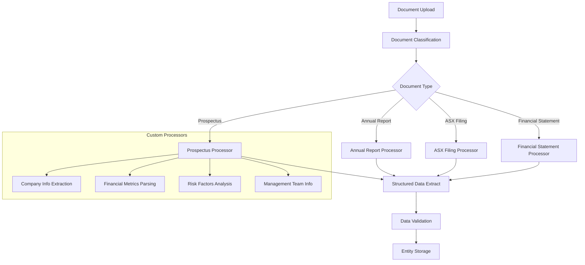

# Document AI Custom Processors for Australian Financial Documents

## Overview

This guide covers implementing custom Document AI processors specifically designed for Australian Securities Exchange (ASX) financial documents, including prospectuses, annual reports, and regulatory filings.

## Architecture



## Implementation

### 1. Document AI Processor Configuration

```python
# src/gcp/document_ai/processor_config.py

from google.cloud import documentai
from google.cloud import storage
from typing import Dict, List, Optional, Any
import json
import re
from datetime import datetime
from dataclasses import dataclass
from enum import Enum

class DocumentType(Enum):
    """Australian financial document types."""
    PROSPECTUS = "prospectus"
    ANNUAL_REPORT = "annual_report"
    ASX_FILING = "asx_filing"
    FINANCIAL_STATEMENT = "financial_statement"
    QUARTERLY_REPORT = "quarterly_report"
    CONTINUOUS_DISCLOSURE = "continuous_disclosure"
    TAKEOVER_DOCUMENT = "takeover_document"

@dataclass
class ProcessorConfig:
    """Configuration for Document AI processors."""
    processor_id: str
    processor_version: str
    location: str = "australia-southeast1"
    mime_type: str = "application/pdf"

class ASXDocumentProcessor:
    """Custom processor for ASX financial documents."""
    
    def __init__(self, project_id: str, location: str = "australia-southeast1"):
        self.project_id = project_id
        self.location = location
        self.client = documentai.DocumentProcessorServiceClient(
            client_options={"api_endpoint": f"{location}-documentai.googleapis.com"}
        )
        
        # Processor configurations
        self.processors = {
            DocumentType.PROSPECTUS: ProcessorConfig(
                processor_id="prospectus-processor-id",
                processor_version="rc",
                location=location
            ),
            DocumentType.ANNUAL_REPORT: ProcessorConfig(
                processor_id="annual-report-processor-id", 
                processor_version="rc",
                location=location
            ),
            DocumentType.ASX_FILING: ProcessorConfig(
                processor_id="asx-filing-processor-id",
                processor_version="rc", 
                location=location
            ),
            DocumentType.FINANCIAL_STATEMENT: ProcessorConfig(
                processor_id="financial-statement-processor-id",
                processor_version="rc",
                location=location
            )
        }
    
    def create_custom_processor(
        self,
        display_name: str,
        processor_type: str,
        document_type: DocumentType
    ) -> str:
        """Create a custom Document AI processor."""
        
        parent = f"projects/{self.project_id}/locations/{self.location}"
        
        # Define processor configuration based on document type
        processor_config = self._get_processor_config(document_type)
        
        processor = documentai.Processor(
            display_name=display_name,
            type_=processor_type,
            default_processor_version=processor_config.processor_version
        )
        
        request = documentai.CreateProcessorRequest(
            parent=parent,
            processor=processor
        )
        
        operation = self.client.create_processor(request=request)
        response = operation.result(timeout=300)
        
        print(f"Created processor: {response.name}")
        return response.name
    
    def _get_processor_config(self, document_type: DocumentType) -> Dict[str, Any]:
        """Get processor configuration for specific document type."""
        
        configs = {
            DocumentType.PROSPECTUS: {
                "schema": {
                    "entity_types": [
                        {
                            "type": "company_name",
                            "base_types": ["text"],
                            "properties": {"mandatory": True}
                        },
                        {
                            "type": "ipo_price_range",
                            "base_types": ["money"],
                            "properties": {"mandatory": True}
                        },
                        {
                            "type": "shares_offered",
                            "base_types": ["number"],
                            "properties": {"mandatory": True}
                        },
                        {
                            "type": "listing_date",
                            "base_types": ["date"],
                            "properties": {"mandatory": True}
                        },
                        {
                            "type": "asx_code",
                            "base_types": ["text"],
                            "properties": {"mandatory": True}
                        },
                        {
                            "type": "underwriter",
                            "base_types": ["text"],
                            "properties": {"mandatory": False}
                        },
                        {
                            "type": "industry_sector",
                            "base_types": ["text"],
                            "properties": {"mandatory": True}
                        },
                        {
                            "type": "use_of_proceeds",
                            "base_types": ["text"],
                            "properties": {"mandatory": True}
                        },
                        {
                            "type": "risk_factors",
                            "base_types": ["text"],
                            "properties": {"mandatory": True}
                        },
                        {
                            "type": "financial_highlights",
                            "base_types": ["text"],
                            "properties": {"mandatory": True}
                        }
                    ]
                },
                "processing_config": {
                    "enable_advanced_ocr": True,
                    "enable_symbol_ocr": True,
                    "enable_image_quality_scores": True,
                    "enable_entity_extraction": True,
                    "enable_form_extraction": True,
                    "enable_barcode_detection": False
                }
            },
            DocumentType.FINANCIAL_STATEMENT: {
                "schema": {
                    "entity_types": [
                        {
                            "type": "revenue",
                            "base_types": ["money"],
                            "properties": {"mandatory": True}
                        },
                        {
                            "type": "net_profit",
                            "base_types": ["money"],
                            "properties": {"mandatory": True}
                        },
                        {
                            "type": "total_assets",
                            "base_types": ["money"],
                            "properties": {"mandatory": True}
                        },
                        {
                            "type": "shareholders_equity",
                            "base_types": ["money"],
                            "properties": {"mandatory": True}
                        },
                        {
                            "type": "cash_flow",
                            "base_types": ["money"],
                            "properties": {"mandatory": True}
                        },
                        {
                            "type": "reporting_period",
                            "base_types": ["date"],
                            "properties": {"mandatory": True}
                        }
                    ]
                },
                "processing_config": {
                    "enable_advanced_ocr": True,
                    "enable_table_extraction": True,
                    "enable_entity_extraction": True,
                    "enable_form_extraction": True
                }
            }
        }
        
        return configs.get(document_type, {})
    
    def process_document(
        self,
        document_path: str,
        document_type: DocumentType,
        mime_type: str = "application/pdf"
    ) -> documentai.Document:
        """Process document using appropriate custom processor."""
        
        processor_config = self.processors[document_type]
        
        # Read document
        if document_path.startswith('gs://'):
            content = self._read_gcs_file(document_path)
        else:
            with open(document_path, 'rb') as document_file:
                content = document_file.read()
        
        # Configure request
        name = f"projects/{self.project_id}/locations/{self.location}/processors/{processor_config.processor_id}/processorVersions/{processor_config.processor_version}"
        
        request = documentai.ProcessRequest(
            name=name,
            raw_document=documentai.RawDocument(
                content=content,
                mime_type=mime_type
            ),
            field_mask="text,entities,pages,tables"
        )
        
        # Process document
        result = self.client.process_document(request=request)
        
        return result.document
    
    def _read_gcs_file(self, gcs_path: str) -> bytes:
        """Read file from Google Cloud Storage."""
        
        client = storage.Client()
        
        # Parse GCS path
        bucket_name = gcs_path.replace('gs://', '').split('/')[0]
        blob_name = '/'.join(gcs_path.replace('gs://', '').split('/')[1:])
        
        bucket = client.bucket(bucket_name)
        blob = bucket.blob(blob_name)
        
        return blob.download_as_bytes()

class ProspectusProcessor(ASXDocumentProcessor):
    """Specialized processor for IPO prospectuses."""
    
    def extract_ipo_data(self, document: documentai.Document) -> Dict[str, Any]:
        """Extract IPO-specific data from prospectus."""
        
        extracted_data = {
            "company_info": {},
            "ipo_details": {},
            "financial_info": {},
            "risk_factors": [],
            "use_of_proceeds": "",
            "management_team": [],
            "market_overview": "",
            "competitive_landscape": ""
        }
        
        # Extract entities
        for entity in document.entities:
            self._process_prospectus_entity(entity, extracted_data)
        
        # Extract tables for financial data
        for page in document.pages:
            for table in page.tables:
                self._process_financial_table(table, extracted_data)
        
        # Post-process and validate data
        extracted_data = self._validate_prospectus_data(extracted_data)
        
        return extracted_data
    
    def _process_prospectus_entity(
        self,
        entity: documentai.Document.Entity,
        data: Dict[str, Any]
    ) -> None:
        """Process individual entities from prospectus."""
        
        entity_type = entity.type_
        entity_text = entity.mention_text
        confidence = entity.confidence
        
        # Only process high-confidence entities
        if confidence < 0.7:
            return
        
        if entity_type == "company_name":
            data["company_info"]["name"] = entity_text
        elif entity_type == "asx_code":
            data["company_info"]["asx_code"] = entity_text.upper()
        elif entity_type == "ipo_price_range":
            data["ipo_details"]["price_range"] = self._parse_price_range(entity_text)
        elif entity_type == "shares_offered":
            data["ipo_details"]["shares_offered"] = self._parse_number(entity_text)
        elif entity_type == "listing_date":
            data["ipo_details"]["listing_date"] = self._parse_date(entity_text)
        elif entity_type == "underwriter":
            if "underwriters" not in data["ipo_details"]:
                data["ipo_details"]["underwriters"] = []
            data["ipo_details"]["underwriters"].append(entity_text)
        elif entity_type == "industry_sector":
            data["company_info"]["sector"] = entity_text
        elif entity_type == "use_of_proceeds":
            data["use_of_proceeds"] = entity_text
        elif entity_type == "risk_factors":
            data["risk_factors"].append(entity_text)
    
    def _process_financial_table(
        self,
        table: documentai.Document.Page.Table,
        data: Dict[str, Any]
    ) -> None:
        """Process financial tables from prospectus."""
        
        # Convert table to structured format
        table_data = []
        headers = []
        
        for row_idx, row in enumerate(table.header_rows + table.body_rows):
            row_data = []
            for cell in row.cells:
                cell_text = self._get_cell_text(cell)
                row_data.append(cell_text)
            
            if row_idx == 0:  # Header row
                headers = row_data
            else:
                table_data.append(dict(zip(headers, row_data)))
        
        # Extract financial metrics
        financial_metrics = self._extract_financial_metrics(table_data)
        data["financial_info"].update(financial_metrics)
    
    def _get_cell_text(self, cell: documentai.Document.Page.Table.TableCell) -> str:
        """Extract text from table cell."""
        
        text = ""
        for segment in cell.layout.text_anchor.text_segments:
            start_index = segment.start_index
            end_index = segment.end_index
            # Note: In real implementation, would need access to full document text
            # text += document.text[start_index:end_index]
        
        return text.strip()
    
    def _extract_financial_metrics(self, table_data: List[Dict]) -> Dict[str, Any]:
        """Extract financial metrics from table data."""
        
        metrics = {}
        
        for row in table_data:
            for key, value in row.items():
                if key and value:
                    # Look for common financial metrics
                    key_lower = key.lower()
                    
                    if any(term in key_lower for term in ['revenue', 'sales', 'income']):
                        if 'revenue' not in metrics:
                            metrics['revenue'] = {}
                        metrics['revenue'][key] = self._parse_financial_value(value)
                    
                    elif any(term in key_lower for term in ['profit', 'loss', 'earnings']):
                        if 'profit_loss' not in metrics:
                            metrics['profit_loss'] = {}
                        metrics['profit_loss'][key] = self._parse_financial_value(value)
                    
                    elif any(term in key_lower for term in ['assets', 'liabilities']):
                        if 'balance_sheet' not in metrics:
                            metrics['balance_sheet'] = {}
                        metrics['balance_sheet'][key] = self._parse_financial_value(value)
        
        return metrics
    
    def _parse_price_range(self, price_text: str) -> Dict[str, float]:
        """Parse IPO price range from text."""
        
        # Example: "$2.00 - $3.50", "AUD 1.50 to AUD 2.25"
        price_pattern = r'[\$A-Z]*\s*(\d+\.?\d*)\s*[-to]\s*[\$A-Z]*\s*(\d+\.?\d*)'
        
        match = re.search(price_pattern, price_text, re.IGNORECASE)
        if match:
            return {
                "min_price": float(match.group(1)),
                "max_price": float(match.group(2)),
                "currency": "AUD"
            }
        
        return {}
    
    def _parse_financial_value(self, value_text: str) -> Optional[float]:
        """Parse financial value from text."""
        
        if not value_text:
            return None
        
        # Remove currency symbols and formatting
        clean_text = re.sub(r'[\$,\s]', '', value_text)
        
        # Handle thousands/millions notation
        multiplier = 1
        if 'million' in value_text.lower() or 'm' in clean_text.lower():
            multiplier = 1_000_000
        elif 'thousand' in value_text.lower() or 'k' in clean_text.lower():
            multiplier = 1_000
        elif 'billion' in value_text.lower() or 'b' in clean_text.lower():
            multiplier = 1_000_000_000
        
        # Extract numeric value
        number_pattern = r'(\d+\.?\d*)'
        match = re.search(number_pattern, clean_text)
        
        if match:
            return float(match.group(1)) * multiplier
        
        return None
    
    def _parse_number(self, number_text: str) -> Optional[int]:
        """Parse number from text."""
        
        clean_text = re.sub(r'[,\s]', '', number_text)
        number_pattern = r'(\d+)'
        
        match = re.search(number_pattern, clean_text)
        if match:
            return int(match.group(1))
        
        return None
    
    def _parse_date(self, date_text: str) -> Optional[str]:
        """Parse date from text."""
        
        # Common Australian date formats
        date_patterns = [
            r'(\d{1,2})[/\-](\d{1,2})[/\-](\d{4})',  # DD/MM/YYYY or DD-MM-YYYY
            r'(\d{1,2})\s+(\w+)\s+(\d{4})',  # DD Month YYYY
            r'(\w+)\s+(\d{1,2}),?\s+(\d{4})'  # Month DD, YYYY
        ]
        
        for pattern in date_patterns:
            match = re.search(pattern, date_text)
            if match:
                # Convert to ISO format (simplified)
                return date_text  # In real implementation, would standardize format
        
        return None
    
    def _validate_prospectus_data(self, data: Dict[str, Any]) -> Dict[str, Any]:
        """Validate and clean extracted prospectus data."""
        
        # Ensure required fields are present
        required_fields = [
            ("company_info", "name"),
            ("company_info", "asx_code"),
            ("ipo_details", "price_range"),
            ("ipo_details", "shares_offered")
        ]
        
        for section, field in required_fields:
            if section not in data or field not in data[section]:
                print(f"Warning: Missing required field {section}.{field}")
        
        # Validate ASX code format
        if "asx_code" in data.get("company_info", {}):
            asx_code = data["company_info"]["asx_code"]
            if not re.match(r'^[A-Z]{3}$', asx_code):
                print(f"Warning: Invalid ASX code format: {asx_code}")
        
        # Add extraction metadata
        data["extraction_metadata"] = {
            "extraction_date": datetime.now().isoformat(),
            "processor_type": "prospectus",
            "confidence_threshold": 0.7,
            "validation_status": "completed"
        }
        
        return data

class FinancialStatementProcessor(ASXDocumentProcessor):
    """Specialized processor for financial statements."""
    
    def extract_financial_data(self, document: documentai.Document) -> Dict[str, Any]:
        """Extract financial data from statements."""
        
        extracted_data = {
            "income_statement": {},
            "balance_sheet": {},
            "cash_flow": {},
            "reporting_period": {},
            "notes": [],
            "auditor_report": {}
        }
        
        # Process tables for financial data
        for page in document.pages:
            for table in page.tables:
                self._classify_and_process_table(table, extracted_data)
        
        # Extract text entities
        for entity in document.entities:
            self._process_financial_entity(entity, extracted_data)
        
        return extracted_data
    
    def _classify_and_process_table(
        self,
        table: documentai.Document.Page.Table,
        data: Dict[str, Any]
    ) -> None:
        """Classify table type and process accordingly."""
        
        # Extract table headers to determine type
        headers = []
        if table.header_rows:
            for cell in table.header_rows[0].cells:
                headers.append(self._get_cell_text(cell).lower())
        
        # Classify table based on headers
        if any(term in ' '.join(headers) for term in ['revenue', 'expenses', 'profit', 'loss']):
            self._process_income_statement_table(table, data["income_statement"])
        elif any(term in ' '.join(headers) for term in ['assets', 'liabilities', 'equity']):
            self._process_balance_sheet_table(table, data["balance_sheet"])
        elif any(term in ' '.join(headers) for term in ['cash flow', 'operating', 'financing']):
            self._process_cash_flow_table(table, data["cash_flow"])
    
    def _process_income_statement_table(
        self,
        table: documentai.Document.Page.Table,
        income_data: Dict[str, Any]
    ) -> None:
        """Process income statement table."""
        
        # Implementation for income statement processing
        pass
    
    def _process_balance_sheet_table(
        self,
        table: documentai.Document.Page.Table,
        balance_data: Dict[str, Any]
    ) -> None:
        """Process balance sheet table."""
        
        # Implementation for balance sheet processing
        pass
    
    def _process_cash_flow_table(
        self,
        table: documentai.Document.Page.Table,
        cash_flow_data: Dict[str, Any]
    ) -> None:
        """Process cash flow table."""
        
        # Implementation for cash flow processing
        pass
    
    def _process_financial_entity(
        self,
        entity: documentai.Document.Entity,
        data: Dict[str, Any]
    ) -> None:
        """Process financial entities."""
        
        # Implementation for entity processing
        pass
```

### 2. Batch Document Processing

```python
# src/gcp/document_ai/batch_processor.py

from google.cloud import documentai
from google.cloud import storage
from concurrent.futures import ThreadPoolExecutor, as_completed
import asyncio
import aiohttp
from typing import List, Dict, Any, Optional
import json
import time

class BatchDocumentProcessor:
    """Batch processor for large volumes of financial documents."""
    
    def __init__(self, project_id: str, location: str = "australia-southeast1"):
        self.project_id = project_id
        self.location = location
        self.client = documentai.DocumentProcessorServiceClient(
            client_options={"api_endpoint": f"{location}-documentai.googleapis.com"}
        )
        self.storage_client = storage.Client()
    
    def batch_process_documents(
        self,
        input_gcs_uri: str,
        output_gcs_uri: str,
        processor_id: str,
        processor_version: str = "rc",
        field_mask: str = "text,entities,pages,tables"
    ) -> documentai.BatchProcessResponse:
        """Process multiple documents in batch."""
        
        name = f"projects/{self.project_id}/locations/{self.location}/processors/{processor_id}/processorVersions/{processor_version}"
        
        # Configure input
        gcs_input_config = documentai.BatchDocumentsInputConfig(
            gcs_prefix=documentai.GcsPrefix(gcs_uri_prefix=input_gcs_uri)
        )
        
        input_config = documentai.BatchProcessRequest.BatchInputConfig(
            gcs_source=gcs_input_config,
            mime_type="application/pdf"
        )
        
        # Configure output
        gcs_output_config = documentai.DocumentOutputConfig.GcsOutputConfig(
            gcs_uri=output_gcs_uri,
            field_mask=field_mask
        )
        
        output_config = documentai.DocumentOutputConfig(
            gcs_output_config=gcs_output_config
        )
        
        # Create batch process request
        request = documentai.BatchProcessRequest(
            name=name,
            input_documents=input_config,
            document_output_config=output_config
        )
        
        # Submit batch operation
        operation = self.client.batch_process_documents(request=request)
        
        print(f"Batch processing started: {operation.operation.name}")
        
        # Wait for completion
        print("Waiting for batch processing to complete...")
        response = operation.result(timeout=7200)  # 2 hours timeout
        
        print(f"Batch processing completed. Output: {output_gcs_uri}")
        
        return response
    
    def process_documents_parallel(
        self,
        document_paths: List[str],
        processor_config: Dict[str, str],
        max_workers: int = 10
    ) -> List[Dict[str, Any]]:
        """Process multiple documents in parallel using threading."""
        
        results = []
        
        with ThreadPoolExecutor(max_workers=max_workers) as executor:
            # Submit all processing tasks
            future_to_doc = {
                executor.submit(
                    self._process_single_document,
                    doc_path,
                    processor_config
                ): doc_path
                for doc_path in document_paths
            }
            
            # Collect results as they complete
            for future in as_completed(future_to_doc):
                doc_path = future_to_doc[future]
                try:
                    result = future.result()
                    result['source_document'] = doc_path
                    results.append(result)
                    print(f"Processed: {doc_path}")
                except Exception as exc:
                    print(f"Error processing {doc_path}: {exc}")
                    results.append({
                        'source_document': doc_path,
                        'error': str(exc),
                        'status': 'failed'
                    })
        
        return results
    
    def _process_single_document(
        self,
        document_path: str,
        processor_config: Dict[str, str]
    ) -> Dict[str, Any]:
        """Process a single document."""
        
        try:
            # Read document content
            if document_path.startswith('gs://'):
                content = self._read_gcs_file(document_path)
            else:
                with open(document_path, 'rb') as f:
                    content = f.read()
            
            # Create processor instance
            processor = ASXDocumentProcessor(self.project_id, self.location)
            
            # Determine document type
            doc_type = self._classify_document(content, document_path)
            
            # Process document
            name = f"projects/{self.project_id}/locations/{self.location}/processors/{processor_config['processor_id']}"
            
            request = documentai.ProcessRequest(
                name=name,
                raw_document=documentai.RawDocument(
                    content=content,
                    mime_type="application/pdf"
                ),
                field_mask=processor_config.get('field_mask', 'text,entities,pages,tables')
            )
            
            result = self.client.process_document(request=request)
            
            # Extract structured data
            if doc_type == DocumentType.PROSPECTUS:
                prospectus_processor = ProspectusProcessor(self.project_id, self.location)
                structured_data = prospectus_processor.extract_ipo_data(result.document)
            elif doc_type == DocumentType.FINANCIAL_STATEMENT:
                financial_processor = FinancialStatementProcessor(self.project_id, self.location)
                structured_data = financial_processor.extract_financial_data(result.document)
            else:
                structured_data = self._extract_generic_data(result.document)
            
            return {
                'status': 'success',
                'document_type': doc_type.value,
                'structured_data': structured_data,
                'processing_time': time.time(),
                'page_count': len(result.document.pages)
            }
            
        except Exception as e:
            return {
                'status': 'error',
                'error': str(e),
                'processing_time': time.time()
            }
    
    def _classify_document(self, content: bytes, file_path: str) -> DocumentType:
        """Classify document type based on content and filename."""
        
        # Simple classification based on filename
        file_path_lower = file_path.lower()
        
        if 'prospectus' in file_path_lower:
            return DocumentType.PROSPECTUS
        elif 'annual' in file_path_lower and 'report' in file_path_lower:
            return DocumentType.ANNUAL_REPORT
        elif any(term in file_path_lower for term in ['financial', 'statement', 'balance']):
            return DocumentType.FINANCIAL_STATEMENT
        elif 'quarterly' in file_path_lower:
            return DocumentType.QUARTERLY_REPORT
        elif any(term in file_path_lower for term in ['asx', 'filing', 'disclosure']):
            return DocumentType.ASX_FILING
        
        # Default classification
        return DocumentType.ASX_FILING
    
    def _extract_generic_data(self, document: documentai.Document) -> Dict[str, Any]:
        """Extract generic structured data from any document."""
        
        return {
            'text_content': document.text[:1000] + "..." if len(document.text) > 1000 else document.text,
            'entity_count': len(document.entities),
            'page_count': len(document.pages),
            'table_count': sum(len(page.tables) for page in document.pages),
            'entities': [
                {
                    'type': entity.type_,
                    'text': entity.mention_text,
                    'confidence': entity.confidence
                }
                for entity in document.entities[:10]  # First 10 entities
            ]
        }
    
    def _read_gcs_file(self, gcs_path: str) -> bytes:
        """Read file from Google Cloud Storage."""
        
        bucket_name = gcs_path.replace('gs://', '').split('/')[0]
        blob_name = '/'.join(gcs_path.replace('gs://', '').split('/')[1:])
        
        bucket = self.storage_client.bucket(bucket_name)
        blob = bucket.blob(blob_name)
        
        return blob.download_as_bytes()
    
    async def async_process_documents(
        self,
        document_paths: List[str],
        processor_config: Dict[str, str],
        max_concurrent: int = 5
    ) -> List[Dict[str, Any]]:
        """Process documents asynchronously for better performance."""
        
        semaphore = asyncio.Semaphore(max_concurrent)
        
        async def process_doc(doc_path: str) -> Dict[str, Any]:
            async with semaphore:
                return await self._async_process_single_document(doc_path, processor_config)
        
        tasks = [process_doc(doc_path) for doc_path in document_paths]
        results = await asyncio.gather(*tasks, return_exceptions=True)
        
        # Handle exceptions
        processed_results = []
        for i, result in enumerate(results):
            if isinstance(result, Exception):
                processed_results.append({
                    'source_document': document_paths[i],
                    'status': 'error',
                    'error': str(result)
                })
            else:
                processed_results.append(result)
        
        return processed_results
    
    async def _async_process_single_document(
        self,
        document_path: str,
        processor_config: Dict[str, str]
    ) -> Dict[str, Any]:
        """Asynchronously process a single document."""
        
        # This would use async HTTP client to call Document AI API
        # Implementation depends on async Document AI client availability
        pass

class DocumentProcessingWorkflow:
    """Workflow manager for document processing operations."""
    
    def __init__(self, project_id: str, location: str = "australia-southeast1"):
        self.batch_processor = BatchDocumentProcessor(project_id, location)
        self.project_id = project_id
        self.location = location
    
    def create_processing_workflow(
        self,
        input_bucket: str,
        output_bucket: str,
        processor_mappings: Dict[DocumentType, str]
    ) -> Dict[str, Any]:
        """Create a complete document processing workflow."""
        
        workflow_config = {
            'input_bucket': input_bucket,
            'output_bucket': output_bucket,
            'processor_mappings': processor_mappings,
            'batch_size': 100,
            'parallel_workers': 10,
            'retry_attempts': 3,
            'timeout_minutes': 30
        }
        
        return workflow_config
    
    def execute_workflow(
        self,
        workflow_config: Dict[str, Any],
        document_filter: Optional[str] = None
    ) -> Dict[str, Any]:
        """Execute the document processing workflow."""
        
        # List documents in input bucket
        documents = self._list_input_documents(
            workflow_config['input_bucket'],
            document_filter
        )
        
        # Group documents by type
        documents_by_type = self._group_documents_by_type(documents)
        
        # Process each document type
        results = {}
        for doc_type, doc_paths in documents_by_type.items():
            if doc_type in workflow_config['processor_mappings']:
                processor_id = workflow_config['processor_mappings'][doc_type]
                
                # Process in batches
                batch_results = self.batch_processor.process_documents_parallel(
                    doc_paths,
                    {'processor_id': processor_id},
                    workflow_config['parallel_workers']
                )
                
                results[doc_type.value] = batch_results
        
        # Save workflow results
        self._save_workflow_results(results, workflow_config['output_bucket'])
        
        return {
            'status': 'completed',
            'processed_documents': sum(len(docs) for docs in documents_by_type.values()),
            'results_by_type': {k: len(v) for k, v in results.items()},
            'output_location': workflow_config['output_bucket']
        }
    
    def _list_input_documents(
        self,
        bucket_name: str,
        document_filter: Optional[str] = None
    ) -> List[str]:
        """List documents in input bucket."""
        
        client = storage.Client()
        bucket = client.bucket(bucket_name)
        
        blobs = bucket.list_blobs(prefix=document_filter)
        
        return [f"gs://{bucket_name}/{blob.name}" for blob in blobs if blob.name.endswith('.pdf')]
    
    def _group_documents_by_type(
        self,
        document_paths: List[str]
    ) -> Dict[DocumentType, List[str]]:
        """Group documents by their detected type."""
        
        grouped = {}
        
        for doc_path in document_paths:
            doc_type = self._classify_document_by_path(doc_path)
            
            if doc_type not in grouped:
                grouped[doc_type] = []
            
            grouped[doc_type].append(doc_path)
        
        return grouped
    
    def _classify_document_by_path(self, document_path: str) -> DocumentType:
        """Classify document type based on file path."""
        
        path_lower = document_path.lower()
        
        if 'prospectus' in path_lower:
            return DocumentType.PROSPECTUS
        elif 'annual' in path_lower:
            return DocumentType.ANNUAL_REPORT
        elif 'financial' in path_lower:
            return DocumentType.FINANCIAL_STATEMENT
        elif 'quarterly' in path_lower:
            return DocumentType.QUARTERLY_REPORT
        else:
            return DocumentType.ASX_FILING
    
    def _save_workflow_results(
        self,
        results: Dict[str, List[Dict[str, Any]]],
        output_bucket: str
    ) -> None:
        """Save workflow results to output bucket."""
        
        client = storage.Client()
        bucket = client.bucket(output_bucket)
        
        # Save consolidated results
        blob = bucket.blob('workflow_results.json')
        blob.upload_from_string(json.dumps(results, indent=2))
        
        # Save results by document type
        for doc_type, type_results in results.items():
            type_blob = bucket.blob(f'results_{doc_type}.json')
            type_blob.upload_from_string(json.dumps(type_results, indent=2))
```

### 3. Usage Example

```python
# examples/document_ai_processing_example.py

from src.gcp.document_ai.processor_config import ProspectusProcessor, FinancialStatementProcessor
from src.gcp.document_ai.batch_processor import BatchDocumentProcessor, DocumentProcessingWorkflow
from src.gcp.document_ai.processor_config import DocumentType

async def main():
    """Example of processing Australian financial documents."""
    
    project_id = "your-gcp-project-id"
    
    # Initialize processors
    prospectus_processor = ProspectusProcessor(project_id)
    batch_processor = BatchDocumentProcessor(project_id)
    
    # Process single prospectus
    prospectus_path = "gs://your-bucket/documents/example-prospectus.pdf"
    document = prospectus_processor.process_document(
        prospectus_path,
        DocumentType.PROSPECTUS
    )
    
    # Extract IPO data
    ipo_data = prospectus_processor.extract_ipo_data(document)
    print("Extracted IPO Data:", ipo_data)
    
    # Batch processing example
    document_paths = [
        "gs://your-bucket/prospectuses/company1.pdf",
        "gs://your-bucket/prospectuses/company2.pdf",
        "gs://your-bucket/annual-reports/company1-2023.pdf"
    ]
    
    processor_config = {
        'processor_id': 'your-processor-id',
        'field_mask': 'text,entities,pages,tables'
    }
    
    # Process in parallel
    results = batch_processor.process_documents_parallel(
        document_paths,
        processor_config,
        max_workers=5
    )
    
    print(f"Processed {len(results)} documents")
    
    # Workflow processing
    workflow = DocumentProcessingWorkflow(project_id)
    
    workflow_config = workflow.create_processing_workflow(
        input_bucket="your-input-bucket",
        output_bucket="your-output-bucket", 
        processor_mappings={
            DocumentType.PROSPECTUS: "prospectus-processor-id",
            DocumentType.FINANCIAL_STATEMENT: "financial-processor-id",
            DocumentType.ANNUAL_REPORT: "annual-report-processor-id"
        }
    )
    
    # Execute workflow
    workflow_results = workflow.execute_workflow(workflow_config)
    print("Workflow Results:", workflow_results)

if __name__ == "__main__":
    import asyncio
    asyncio.run(main())
```

## Best Practices

### Performance Optimization
- Use batch processing for large document volumes
- Implement parallel processing with appropriate concurrency limits
- Cache processor results to avoid re-processing
- Use regional processors for lower latency

### Cost Management
- Monitor processing volumes and costs
- Use batch processing for non-urgent documents
- Implement document deduplication
- Set up budget alerts and quotas

### Quality Assurance
- Implement confidence score thresholds
- Add manual review workflows for low-confidence extractions
- Validate extracted data against business rules
- Monitor extraction accuracy over time

### Security and Compliance
- Ensure data residency requirements are met
- Implement proper access controls
- Audit document processing activities
- Encrypt sensitive documents in transit and at rest

This implementation provides a comprehensive foundation for processing Australian financial documents using Document AI's custom processors, with specific optimizations for IPO valuation workflows.