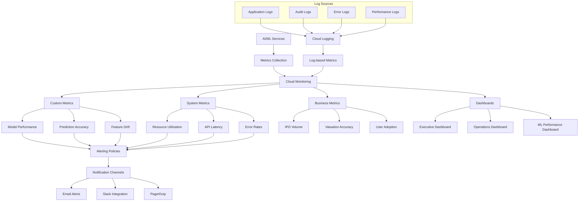

# Cloud Monitoring and Operations Framework

## Overview

This guide covers implementing a comprehensive monitoring and operations framework using Google Cloud Monitoring for the IPO valuation platform's AI/ML services, including custom metrics, alerting policies, and operational dashboards.

## Architecture



## Implementation

### 1. Monitoring Infrastructure Setup

```python
# src/gcp/monitoring/monitoring_setup.py

from google.cloud import monitoring_v3
from google.cloud import logging_v2
from google.api_core import exceptions
from typing import Dict, List, Optional, Any, Union
import json
from datetime import datetime, timedelta
from dataclasses import dataclass, asdict
from enum import Enum
import time

class MetricType(Enum):
    """Types of metrics for IPO valuation platform."""
    MODEL_PERFORMANCE = "model_performance"
    PREDICTION_ACCURACY = "prediction_accuracy"
    FEATURE_DRIFT = "feature_drift"
    RESOURCE_UTILIZATION = "resource_utilization"
    API_PERFORMANCE = "api_performance"
    BUSINESS_KPI = "business_kpi"
    ERROR_TRACKING = "error_tracking"

class AlertSeverity(Enum):
    """Alert severity levels."""
    CRITICAL = "CRITICAL"
    WARNING = "WARNING"
    INFO = "INFO"

@dataclass
class CustomMetricDescriptor:
    """Configuration for custom metric descriptors."""
    metric_type: str
    display_name: str
    description: str
    metric_kind: str  # GAUGE, DELTA, CUMULATIVE
    value_type: str   # BOOL, INT64, DOUBLE, STRING, DISTRIBUTION
    labels: List[Dict[str, str]]
    unit: Optional[str] = None

@dataclass
class AlertPolicy:
    """Configuration for alerting policies."""
    display_name: str
    conditions: List[Dict[str, Any]]
    notification_channels: List[str]
    alert_strategy: Dict[str, Any]
    documentation: Dict[str, str]
    enabled: bool = True

class IPOValuationMonitoring:
    """Monitoring setup for IPO valuation platform."""
    
    def __init__(self, project_id: str):
        self.project_id = project_id
        self.project_name = f"projects/{project_id}"
        
        # Initialize clients
        self.monitoring_client = monitoring_v3.MetricServiceClient()
        self.alert_client = monitoring_v3.AlertPolicyServiceClient()
        self.notification_client = monitoring_v3.NotificationChannelServiceClient()
        self.logging_client = logging_v2.Client(project=project_id)
    
    def get_custom_metric_descriptors(self) -> List[CustomMetricDescriptor]:
        """Define custom metric descriptors for IPO valuation platform."""
        
        return [
            # Model Performance Metrics
            CustomMetricDescriptor(
                metric_type="custom.googleapis.com/ml/model_accuracy",
                display_name="ML Model Accuracy",
                description="Accuracy of IPO valuation predictions",
                metric_kind=monitoring_v3.MetricDescriptor.MetricKind.GAUGE,
                value_type=monitoring_v3.MetricDescriptor.ValueType.DOUBLE,
                labels=[
                    {"key": "model_name", "description": "Name of the ML model"},
                    {"key": "model_version", "description": "Version of the ML model"},
                    {"key": "environment", "description": "Deployment environment"}
                ],
                unit="1"
            ),
            
            CustomMetricDescriptor(
                metric_type="custom.googleapis.com/ml/prediction_latency",
                display_name="ML Prediction Latency",
                description="Latency of ML model predictions",
                metric_kind=monitoring_v3.MetricDescriptor.MetricKind.GAUGE,
                value_type=monitoring_v3.MetricDescriptor.ValueType.DOUBLE,
                labels=[
                    {"key": "endpoint_name", "description": "Name of the prediction endpoint"},
                    {"key": "model_type", "description": "Type of ML model"}
                ],
                unit="ms"
            ),
            
            CustomMetricDescriptor(
                metric_type="custom.googleapis.com/ml/feature_drift",
                display_name="Feature Drift Score",
                description="Drift score for model features",
                metric_kind=monitoring_v3.MetricDescriptor.MetricKind.GAUGE,
                value_type=monitoring_v3.MetricDescriptor.ValueType.DOUBLE,
                labels=[
                    {"key": "feature_name", "description": "Name of the feature"},
                    {"key": "model_name", "description": "Associated ML model"}
                ],
                unit="1"
            ),
            
            # Business Metrics
            CustomMetricDescriptor(
                metric_type="custom.googleapis.com/business/ipo_valuations_processed",
                display_name="IPO Valuations Processed",
                description="Number of IPO valuations processed",
                metric_kind=monitoring_v3.MetricDescriptor.MetricKind.CUMULATIVE,
                value_type=monitoring_v3.MetricDescriptor.ValueType.INT64,
                labels=[
                    {"key": "valuation_type", "description": "Type of valuation"},
                    {"key": "sector", "description": "Industry sector"}
                ],
                unit="1"
            ),
            
            CustomMetricDescriptor(
                metric_type="custom.googleapis.com/business/valuation_accuracy",
                display_name="Valuation Accuracy vs Actual",
                description="Accuracy of valuations compared to actual market performance",
                metric_kind=monitoring_v3.MetricDescriptor.MetricKind.GAUGE,
                value_type=monitoring_v3.MetricDescriptor.ValueType.DOUBLE,
                labels=[
                    {"key": "time_horizon", "description": "Time horizon for comparison"},
                    {"key": "market_segment", "description": "Market segment"}
                ],
                unit="1"
            ),
            
            # Document Processing Metrics
            CustomMetricDescriptor(
                metric_type="custom.googleapis.com/document_ai/documents_processed",
                display_name="Documents Processed",
                description="Number of financial documents processed",
                metric_kind=monitoring_v3.MetricDescriptor.MetricKind.CUMULATIVE,
                value_type=monitoring_v3.MetricDescriptor.ValueType.INT64,
                labels=[
                    {"key": "document_type", "description": "Type of financial document"},
                    {"key": "processor_type", "description": "Document AI processor type"}
                ],
                unit="1"
            ),
            
            CustomMetricDescriptor(
                metric_type="custom.googleapis.com/document_ai/extraction_confidence",
                display_name="Document Extraction Confidence",
                description="Confidence score of document data extraction",
                metric_kind=monitoring_v3.MetricDescriptor.MetricKind.GAUGE,
                value_type=monitoring_v3.MetricDescriptor.ValueType.DOUBLE,
                labels=[
                    {"key": "document_type", "description": "Type of financial document"},
                    {"key": "extraction_field", "description": "Extracted field type"}
                ],
                unit="1"
            ),
            
            # API Performance Metrics
            CustomMetricDescriptor(
                metric_type="custom.googleapis.com/api/request_duration",
                display_name="API Request Duration",
                description="Duration of API requests",
                metric_kind=monitoring_v3.MetricDescriptor.MetricKind.DISTRIBUTION,
                value_type=monitoring_v3.MetricDescriptor.ValueType.DISTRIBUTION,
                labels=[
                    {"key": "api_endpoint", "description": "API endpoint name"},
                    {"key": "method", "description": "HTTP method"},
                    {"key": "status_code", "description": "HTTP status code"}
                ],
                unit="ms"
            ),
            
            # Cost Metrics
            CustomMetricDescriptor(
                metric_type="custom.googleapis.com/cost/ml_service_cost",
                display_name="ML Service Cost",
                description="Cost of ML service usage",
                metric_kind=monitoring_v3.MetricDescriptor.MetricKind.CUMULATIVE,
                value_type=monitoring_v3.MetricDescriptor.ValueType.DOUBLE,
                labels=[
                    {"key": "service_name", "description": "Name of the ML service"},
                    {"key": "resource_type", "description": "Type of resource"}
                ],
                unit="USD"
            )
        ]
    
    def create_custom_metrics(self) -> Dict[str, Any]:
        """Create custom metric descriptors."""
        
        descriptors = self.get_custom_metric_descriptors()
        results = {
            "created_metrics": [],
            "failed_metrics": [],
            "creation_timestamp": datetime.now().isoformat()
        }
        
        for descriptor_config in descriptors:
            try:
                # Check if metric already exists
                existing_metric = None
                try:
                    existing_metric = self.monitoring_client.get_metric_descriptor(
                        name=f"{self.project_name}/metricDescriptors/{descriptor_config.metric_type}"
                    )
                except exceptions.NotFound:
                    pass
                
                if existing_metric:
                    print(f"Metric already exists: {descriptor_config.metric_type}")
                    continue
                
                # Create metric descriptor
                descriptor = monitoring_v3.MetricDescriptor(
                    type=descriptor_config.metric_type,
                    display_name=descriptor_config.display_name,
                    description=descriptor_config.description,
                    metric_kind=descriptor_config.metric_kind,
                    value_type=descriptor_config.value_type,
                    unit=descriptor_config.unit or "",
                    labels=[
                        monitoring_v3.LabelDescriptor(
                            key=label["key"],
                            description=label["description"]
                        )
                        for label in descriptor_config.labels
                    ]
                )
                
                # Create the metric
                created_descriptor = self.monitoring_client.create_metric_descriptor(
                    name=self.project_name,
                    metric_descriptor=descriptor
                )
                
                results["created_metrics"].append({
                    "metric_type": descriptor_config.metric_type,
                    "display_name": descriptor_config.display_name,
                    "resource_name": created_descriptor.name
                })
                
                print(f"Created metric: {descriptor_config.metric_type}")
                
            except Exception as e:
                results["failed_metrics"].append({
                    "metric_type": descriptor_config.metric_type,
                    "error": str(e)
                })
                print(f"Failed to create metric {descriptor_config.metric_type}: {e}")
        
        return results
    
    def create_log_based_metrics(self) -> Dict[str, Any]:
        """Create log-based metrics from application logs."""
        
        log_metrics = [
            {
                "name": "ipo_valuation_errors",
                "description": "Count of IPO valuation errors",
                "filter": 'resource.type="gce_instance" AND jsonPayload.component="ipo_valuation" AND severity="ERROR"',
                "label_extractors": {
                    "error_type": "EXTRACT(jsonPayload.error_type)",
                    "model_name": "EXTRACT(jsonPayload.model_name)"
                }
            },
            {
                "name": "model_prediction_requests",
                "description": "Count of model prediction requests",
                "filter": 'resource.type="vertex_ai_endpoint" AND httpRequest.requestMethod="POST"',
                "label_extractors": {
                    "endpoint_name": "EXTRACT(resource.labels.endpoint_id)",
                    "status_code": "EXTRACT(httpRequest.status)"
                }
            },
            {
                "name": "document_processing_time",
                "description": "Document processing time distribution",
                "filter": 'resource.type="cloud_function" AND jsonPayload.function_name="process_financial_document"',
                "value_extractor": "EXTRACT(jsonPayload.processing_time_ms)",
                "label_extractors": {
                    "document_type": "EXTRACT(jsonPayload.document_type)"
                }
            }
        ]
        
        results = {
            "created_log_metrics": [],
            "failed_log_metrics": [],
            "creation_timestamp": datetime.now().isoformat()
        }
        
        for metric_config in log_metrics:
            try:
                # Create log metric
                metric = logging_v2.LogMetric(
                    name=metric_config["name"],
                    description=metric_config["description"],
                    filter=metric_config["filter"],
                    label_extractors=metric_config.get("label_extractors", {}),
                    value_extractor=metric_config.get("value_extractor"),
                    metric_descriptor=logging_v2.LogMetric.MetricDescriptor(
                        metric_kind=logging_v2.LogMetric.MetricDescriptor.MetricKind.CUMULATIVE,
                        value_type=logging_v2.LogMetric.MetricDescriptor.ValueType.INT64
                    )
                )
                
                created_metric = self.logging_client.create_metric(
                    parent=f"projects/{self.project_id}",
                    metric=metric
                )
                
                results["created_log_metrics"].append({
                    "name": metric_config["name"],
                    "description": metric_config["description"],
                    "resource_name": created_metric.name
                })
                
                print(f"Created log-based metric: {metric_config['name']}")
                
            except Exception as e:
                results["failed_log_metrics"].append({
                    "name": metric_config["name"],
                    "error": str(e)
                })
                print(f"Failed to create log metric {metric_config['name']}: {e}")
        
        return results
    
    def create_notification_channels(self) -> Dict[str, Any]:
        """Create notification channels for alerts."""
        
        channels_config = [
            {
                "type": "email",
                "display_name": "IPO Platform - Critical Alerts",
                "description": "Email notifications for critical IPO platform alerts",
                "labels": {
                    "email_address": "ipo-platform-alerts@company.com"
                }
            },
            {
                "type": "slack",
                "display_name": "IPO Platform - Slack Channel",
                "description": "Slack notifications for IPO platform alerts",
                "labels": {
                    "channel_name": "#ipo-platform-alerts",
                    "url": "https://hooks.slack.com/services/YOUR/SLACK/WEBHOOK"
                }
            },
            {
                "type": "pagerduty",
                "display_name": "IPO Platform - PagerDuty",
                "description": "PagerDuty notifications for critical alerts",
                "labels": {
                    "service_key": "your-pagerduty-service-key"
                }
            }
        ]
        
        results = {
            "created_channels": [],
            "failed_channels": [],
            "creation_timestamp": datetime.now().isoformat()
        }
        
        for channel_config in channels_config:
            try:
                # Create notification channel
                channel = monitoring_v3.NotificationChannel(
                    type=f"projects/{self.project_id}/notificationChannelDescriptors/{channel_config['type']}",
                    display_name=channel_config["display_name"],
                    description=channel_config["description"],
                    labels=channel_config["labels"],
                    enabled=True
                )
                
                created_channel = self.notification_client.create_notification_channel(
                    name=self.project_name,
                    notification_channel=channel
                )
                
                results["created_channels"].append({
                    "display_name": channel_config["display_name"],
                    "type": channel_config["type"],
                    "resource_name": created_channel.name
                })
                
                print(f"Created notification channel: {channel_config['display_name']}")
                
            except Exception as e:
                results["failed_channels"].append({
                    "display_name": channel_config["display_name"],
                    "error": str(e)
                })
                print(f"Failed to create notification channel {channel_config['display_name']}: {e}")
        
        return results
    
    def create_alert_policies(self, notification_channels: List[str]) -> Dict[str, Any]:
        """Create alert policies for IPO valuation platform."""
        
        alert_policies = [
            AlertPolicy(
                display_name="ML Model Accuracy Drop",
                conditions=[{
                    "display_name": "Model accuracy below 85%",
                    "condition_threshold": {
                        "filter": 'resource.type="vertex_ai_model" AND metric.type="custom.googleapis.com/ml/model_accuracy"',
                        "comparison": monitoring_v3.ComparisonType.COMPARISON_LESS_THAN,
                        "threshold_value": 0.85,
                        "duration": {"seconds": 300},  # 5 minutes
                        "aggregations": [{
                            "alignment_period": {"seconds": 60},
                            "per_series_aligner": monitoring_v3.Aggregation.Aligner.ALIGN_MEAN
                        }]
                    }
                }],
                notification_channels=notification_channels,
                alert_strategy={
                    "auto_close": {"seconds": 1800}  # 30 minutes
                },
                documentation={
                    "content": "ML model accuracy has dropped below acceptable threshold. Check model performance and consider retraining.",
                    "mime_type": "text/markdown"
                }
            ),
            
            AlertPolicy(
                display_name="High API Latency",
                conditions=[{
                    "display_name": "API latency above 2 seconds",
                    "condition_threshold": {
                        "filter": 'resource.type="cloud_function" AND metric.type="custom.googleapis.com/api/request_duration"',
                        "comparison": monitoring_v3.ComparisonType.COMPARISON_GREATER_THAN,
                        "threshold_value": 2000,  # 2 seconds in milliseconds
                        "duration": {"seconds": 180},  # 3 minutes
                        "aggregations": [{
                            "alignment_period": {"seconds": 60},
                            "per_series_aligner": monitoring_v3.Aggregation.Aligner.ALIGN_PERCENTILE_95
                        }]
                    }
                }],
                notification_channels=notification_channels,
                alert_strategy={
                    "auto_close": {"seconds": 900}  # 15 minutes
                },
                documentation={
                    "content": "API response times are elevated. Check service health and scaling.",
                    "mime_type": "text/markdown"
                }
            ),
            
            AlertPolicy(
                display_name="Feature Drift Detected",
                conditions=[{
                    "display_name": "Feature drift score above 0.3",
                    "condition_threshold": {
                        "filter": 'metric.type="custom.googleapis.com/ml/feature_drift"',
                        "comparison": monitoring_v3.ComparisonType.COMPARISON_GREATER_THAN,
                        "threshold_value": 0.3,
                        "duration": {"seconds": 600},  # 10 minutes
                        "aggregations": [{
                            "alignment_period": {"seconds": 300},
                            "per_series_aligner": monitoring_v3.Aggregation.Aligner.ALIGN_MAX
                        }]
                    }
                }],
                notification_channels=notification_channels[:1],  # Only email for warnings
                alert_strategy={
                    "auto_close": {"seconds": 3600}  # 1 hour
                },
                documentation={
                    "content": "Significant feature drift detected. Review data sources and consider model retraining.",
                    "mime_type": "text/markdown"
                }
            ),
            
            AlertPolicy(
                display_name="High Error Rate",
                conditions=[{
                    "display_name": "Error rate above 5%",
                    "condition_threshold": {
                        "filter": 'metric.type="logging.googleapis.com/user/ipo_valuation_errors"',
                        "comparison": monitoring_v3.ComparisonType.COMPARISON_GREATER_THAN,
                        "threshold_value": 5,
                        "duration": {"seconds": 300},  # 5 minutes
                        "aggregations": [{
                            "alignment_period": {"seconds": 60},
                            "per_series_aligner": monitoring_v3.Aggregation.Aligner.ALIGN_RATE
                        }]
                    }
                }],
                notification_channels=notification_channels,
                alert_strategy={
                    "auto_close": {"seconds": 1800}  # 30 minutes
                },
                documentation={
                    "content": "High error rate detected in IPO valuation service. Check logs for specific error patterns.",
                    "mime_type": "text/markdown"
                }
            )
        ]
        
        results = {
            "created_policies": [],
            "failed_policies": [],
            "creation_timestamp": datetime.now().isoformat()
        }
        
        for policy_config in alert_policies:
            try:
                # Create alert policy conditions
                conditions = []
                for condition_config in policy_config.conditions:
                    condition = monitoring_v3.AlertPolicy.Condition(
                        display_name=condition_config["display_name"],
                        condition_threshold=monitoring_v3.AlertPolicy.Condition.MetricThreshold(
                            filter=condition_config["condition_threshold"]["filter"],
                            comparison=condition_config["condition_threshold"]["comparison"],
                            threshold_value=condition_config["condition_threshold"]["threshold_value"],
                            duration=monitoring_v3.Duration(
                                seconds=condition_config["condition_threshold"]["duration"]["seconds"]
                            ),
                            aggregations=[
                                monitoring_v3.Aggregation(
                                    alignment_period=monitoring_v3.Duration(
                                        seconds=agg["alignment_period"]["seconds"]
                                    ),
                                    per_series_aligner=agg["per_series_aligner"]
                                )
                                for agg in condition_config["condition_threshold"]["aggregations"]
                            ]
                        )
                    )
                    conditions.append(condition)
                
                # Create alert policy
                policy = monitoring_v3.AlertPolicy(
                    display_name=policy_config.display_name,
                    conditions=conditions,
                    notification_channels=policy_config.notification_channels,
                    alert_strategy=monitoring_v3.AlertPolicy.AlertStrategy(
                        auto_close=monitoring_v3.Duration(
                            seconds=policy_config.alert_strategy["auto_close"]["seconds"]
                        )
                    ),
                    documentation=monitoring_v3.AlertPolicy.Documentation(
                        content=policy_config.documentation["content"],
                        mime_type=policy_config.documentation["mime_type"]
                    ),
                    enabled=policy_config.enabled
                )
                
                created_policy = self.alert_client.create_alert_policy(
                    name=self.project_name,
                    alert_policy=policy
                )
                
                results["created_policies"].append({
                    "display_name": policy_config.display_name,
                    "resource_name": created_policy.name,
                    "conditions_count": len(conditions)
                })
                
                print(f"Created alert policy: {policy_config.display_name}")
                
            except Exception as e:
                results["failed_policies"].append({
                    "display_name": policy_config.display_name,
                    "error": str(e)
                })
                print(f"Failed to create alert policy {policy_config.display_name}: {e}")
        
        return results

class MetricWriter:
    """Utility class for writing custom metrics."""
    
    def __init__(self, project_id: str):
        self.project_id = project_id
        self.project_name = f"projects/{project_id}"
        self.client = monitoring_v3.MetricServiceClient()
    
    def write_model_accuracy_metric(
        self,
        model_name: str,
        model_version: str,
        accuracy: float,
        environment: str = "production"
    ) -> None:
        """Write model accuracy metric."""
        
        series = monitoring_v3.TimeSeries(
            metric=monitoring_v3.Metric(
                type="custom.googleapis.com/ml/model_accuracy",
                labels={
                    "model_name": model_name,
                    "model_version": model_version,
                    "environment": environment
                }
            ),
            resource=monitoring_v3.MonitoredResource(
                type="generic_node",
                labels={
                    "project_id": self.project_id,
                    "location": "australia-southeast1",
                    "namespace": "ipo-valuation",
                    "node_id": f"{model_name}-{model_version}"
                }
            ),
            points=[
                monitoring_v3.Point(
                    interval=monitoring_v3.TimeInterval(
                        end_time={"seconds": int(time.time())}
                    ),
                    value=monitoring_v3.TypedValue(double_value=accuracy)
                )
            ]
        )
        
        self.client.create_time_series(
            name=self.project_name,
            time_series=[series]
        )
    
    def write_prediction_latency_metric(
        self,
        endpoint_name: str,
        model_type: str,
        latency_ms: float
    ) -> None:
        """Write prediction latency metric."""
        
        series = monitoring_v3.TimeSeries(
            metric=monitoring_v3.Metric(
                type="custom.googleapis.com/ml/prediction_latency",
                labels={
                    "endpoint_name": endpoint_name,
                    "model_type": model_type
                }
            ),
            resource=monitoring_v3.MonitoredResource(
                type="vertex_ai_endpoint",
                labels={
                    "project_id": self.project_id,
                    "location": "australia-southeast1",
                    "endpoint_id": endpoint_name
                }
            ),
            points=[
                monitoring_v3.Point(
                    interval=monitoring_v3.TimeInterval(
                        end_time={"seconds": int(time.time())}
                    ),
                    value=monitoring_v3.TypedValue(double_value=latency_ms)
                )
            ]
        )
        
        self.client.create_time_series(
            name=self.project_name,
            time_series=[series]
        )
    
    def write_business_metric(
        self,
        metric_type: str,
        value: Union[int, float],
        labels: Dict[str, str]
    ) -> None:
        """Write business metric."""
        
        # Determine value type
        if isinstance(value, int):
            typed_value = monitoring_v3.TypedValue(int64_value=value)
        else:
            typed_value = monitoring_v3.TypedValue(double_value=value)
        
        series = monitoring_v3.TimeSeries(
            metric=monitoring_v3.Metric(
                type=f"custom.googleapis.com/business/{metric_type}",
                labels=labels
            ),
            resource=monitoring_v3.MonitoredResource(
                type="generic_node",
                labels={
                    "project_id": self.project_id,
                    "location": "australia-southeast1",
                    "namespace": "ipo-valuation-business",
                    "node_id": "business-metrics"
                }
            ),
            points=[
                monitoring_v3.Point(
                    interval=monitoring_v3.TimeInterval(
                        end_time={"seconds": int(time.time())}
                    ),
                    value=typed_value
                )
            ]
        )
        
        self.client.create_time_series(
            name=self.project_name,
            time_series=[series]
        )

class DashboardManager:
    """Manager for creating monitoring dashboards."""
    
    def __init__(self, project_id: str):
        self.project_id = project_id
        self.project_name = f"projects/{project_id}"
        self.client = monitoring_v3.DashboardsServiceClient()
    
    def create_ml_performance_dashboard(self) -> Dict[str, Any]:
        """Create ML performance monitoring dashboard."""
        
        dashboard_config = {
            "displayName": "IPO Valuation - ML Performance",
            "mosaicLayout": {
                "tiles": [
                    {
                        "width": 6,
                        "height": 4,
                        "widget": {
                            "title": "Model Accuracy Trend",
                            "xyChart": {
                                "dataSets": [{
                                    "timeSeriesQuery": {
                                        "timeSeriesFilter": {
                                            "filter": 'metric.type="custom.googleapis.com/ml/model_accuracy"',
                                            "aggregation": {
                                                "alignmentPeriod": "300s",
                                                "perSeriesAligner": "ALIGN_MEAN",
                                                "crossSeriesReducer": "REDUCE_MEAN",
                                                "groupByFields": ["metric.label.model_name"]
                                            }
                                        }
                                    },
                                    "plotType": "LINE",
                                    "targetAxis": "Y1"
                                }],
                                "timeshiftDuration": "0s",
                                "yAxis": {
                                    "label": "Accuracy",
                                    "scale": "LINEAR"
                                }
                            }
                        }
                    },
                    {
                        "width": 6,
                        "height": 4,
                        "xPos": 6,
                        "widget": {
                            "title": "Prediction Latency",
                            "xyChart": {
                                "dataSets": [{
                                    "timeSeriesQuery": {
                                        "timeSeriesFilter": {
                                            "filter": 'metric.type="custom.googleapis.com/ml/prediction_latency"',
                                            "aggregation": {
                                                "alignmentPeriod": "300s",
                                                "perSeriesAligner": "ALIGN_PERCENTILE_95",
                                                "crossSeriesReducer": "REDUCE_MEAN",
                                                "groupByFields": ["metric.label.endpoint_name"]
                                            }
                                        }
                                    },
                                    "plotType": "LINE",
                                    "targetAxis": "Y1"
                                }],
                                "yAxis": {
                                    "label": "Latency (ms)",
                                    "scale": "LINEAR"
                                }
                            }
                        }
                    },
                    {
                        "width": 12,
                        "height": 4,
                        "yPos": 4,
                        "widget": {
                            "title": "Feature Drift Monitoring",
                            "xyChart": {
                                "dataSets": [{
                                    "timeSeriesQuery": {
                                        "timeSeriesFilter": {
                                            "filter": 'metric.type="custom.googleapis.com/ml/feature_drift"',
                                            "aggregation": {
                                                "alignmentPeriod": "600s",
                                                "perSeriesAligner": "ALIGN_MEAN",
                                                "crossSeriesReducer": "REDUCE_MAX",
                                                "groupByFields": ["metric.label.feature_name"]
                                            }
                                        }
                                    },
                                    "plotType": "STACKED_AREA",
                                    "targetAxis": "Y1"
                                }],
                                "yAxis": {
                                    "label": "Drift Score",
                                    "scale": "LINEAR"
                                },
                                "thresholds": [{
                                    "value": 0.3,
                                    "color": "RED",
                                    "direction": "ABOVE"
                                }]
                            }
                        }
                    }
                ]
            }
        }
        
        try:
            dashboard = monitoring_v3.Dashboard(
                display_name=dashboard_config["displayName"],
                mosaic_layout=dashboard_config["mosaicLayout"]
            )
            
            created_dashboard = self.client.create_dashboard(
                parent=self.project_name,
                dashboard=dashboard
            )
            
            return {
                "status": "created",
                "dashboard_name": created_dashboard.name,
                "display_name": dashboard_config["displayName"]
            }
            
        except Exception as e:
            return {
                "status": "failed",
                "error": str(e)
            }
    
    def create_business_kpi_dashboard(self) -> Dict[str, Any]:
        """Create business KPI dashboard."""
        
        dashboard_config = {
            "displayName": "IPO Valuation - Business KPIs",
            "mosaicLayout": {
                "tiles": [
                    {
                        "width": 6,
                        "height": 4,
                        "widget": {
                            "title": "IPO Valuations Processed",
                            "scorecard": {
                                "timeSeriesQuery": {
                                    "timeSeriesFilter": {
                                        "filter": 'metric.type="custom.googleapis.com/business/ipo_valuations_processed"',
                                        "aggregation": {
                                            "alignmentPeriod": "3600s",
                                            "perSeriesAligner": "ALIGN_RATE",
                                            "crossSeriesReducer": "REDUCE_SUM"
                                        }
                                    }
                                },
                                "sparkChartView": {
                                    "sparkChartType": "SPARK_BAR"
                                }
                            }
                        }
                    },
                    {
                        "width": 6,
                        "height": 4,
                        "xPos": 6,
                        "widget": {
                            "title": "Valuation Accuracy",
                            "scorecard": {
                                "timeSeriesQuery": {
                                    "timeSeriesFilter": {
                                        "filter": 'metric.type="custom.googleapis.com/business/valuation_accuracy"',
                                        "aggregation": {
                                            "alignmentPeriod": "3600s",
                                            "perSeriesAligner": "ALIGN_MEAN",
                                            "crossSeriesReducer": "REDUCE_MEAN"
                                        }
                                    }
                                },
                                "gaugeView": {
                                    "lowerBound": 0.0,
                                    "upperBound": 1.0
                                }
                            }
                        }
                    }
                ]
            }
        }
        
        try:
            dashboard = monitoring_v3.Dashboard(
                display_name=dashboard_config["displayName"],
                mosaic_layout=dashboard_config["mosaicLayout"]
            )
            
            created_dashboard = self.client.create_dashboard(
                parent=self.project_name,
                dashboard=dashboard
            )
            
            return {
                "status": "created",
                "dashboard_name": created_dashboard.name,
                "display_name": dashboard_config["displayName"]
            }
            
        except Exception as e:
            return {
                "status": "failed",
                "error": str(e)
            }
```

### 2. Usage Example

```python
# examples/monitoring_setup_example.py

from src.gcp.monitoring.monitoring_setup import (
    IPOValuationMonitoring,
    MetricWriter,
    DashboardManager
)
import time

def main():
    """Example of setting up comprehensive monitoring."""
    
    project_id = "your-gcp-project-id"
    
    # Initialize monitoring
    monitoring = IPOValuationMonitoring(project_id)
    metric_writer = MetricWriter(project_id)
    dashboard_manager = DashboardManager(project_id)
    
    # Create custom metrics
    print("Creating custom metrics...")
    metrics_result = monitoring.create_custom_metrics()
    print(f"Created {len(metrics_result['created_metrics'])} custom metrics")
    
    # Create log-based metrics
    print("Creating log-based metrics...")
    log_metrics_result = monitoring.create_log_based_metrics()
    print(f"Created {len(log_metrics_result['created_log_metrics'])} log-based metrics")
    
    # Create notification channels
    print("Creating notification channels...")
    channels_result = monitoring.create_notification_channels()
    print(f"Created {len(channels_result['created_channels'])} notification channels")
    
    # Extract notification channel names
    notification_channels = [
        channel["resource_name"] 
        for channel in channels_result["created_channels"]
    ]
    
    # Create alert policies
    print("Creating alert policies...")
    alerts_result = monitoring.create_alert_policies(notification_channels)
    print(f"Created {len(alerts_result['created_policies'])} alert policies")
    
    # Create dashboards
    print("Creating monitoring dashboards...")
    
    ml_dashboard = dashboard_manager.create_ml_performance_dashboard()
    print(f"ML Dashboard: {ml_dashboard['status']}")
    
    business_dashboard = dashboard_manager.create_business_kpi_dashboard()
    print(f"Business Dashboard: {business_dashboard['status']}")
    
    # Example: Write some sample metrics
    print("Writing sample metrics...")
    
    # Model accuracy metric
    metric_writer.write_model_accuracy_metric(
        model_name="ipo-valuation-v1",
        model_version="1.0.0",
        accuracy=0.92,
        environment="production"
    )
    
    # Prediction latency metric
    metric_writer.write_prediction_latency_metric(
        endpoint_name="ipo-valuation-endpoint",
        model_type="regression",
        latency_ms=150.5
    )
    
    # Business metrics
    metric_writer.write_business_metric(
        metric_type="ipo_valuations_processed",
        value=25,
        labels={
            "valuation_type": "automated",
            "sector": "technology"
        }
    )
    
    metric_writer.write_business_metric(
        metric_type="valuation_accuracy",
        value=0.87,
        labels={
            "time_horizon": "30_days",
            "market_segment": "asx_200"
        }
    )
    
    print("Sample metrics written successfully!")
    
    # Summary
    print("\n=== Monitoring Setup Summary ===")
    print(f"Custom Metrics: {len(metrics_result['created_metrics'])}")
    print(f"Log-based Metrics: {len(log_metrics_result['created_log_metrics'])}")
    print(f"Notification Channels: {len(channels_result['created_channels'])}")
    print(f"Alert Policies: {len(alerts_result['created_policies'])}")
    print(f"ML Dashboard: {ml_dashboard.get('display_name', 'Failed')}")
    print(f"Business Dashboard: {business_dashboard.get('display_name', 'Failed')}")

if __name__ == "__main__":
    main()
```

## Best Practices

### Metric Design
- Use meaningful metric names and descriptions
- Implement proper labeling for dimensional analysis
- Choose appropriate metric types (gauge, counter, distribution)
- Consider cardinality limits for labels

### Alerting Strategy
- Set up tiered alerting (warning, critical)
- Use appropriate thresholds based on historical data
- Implement alert fatigue prevention
- Document alert response procedures

### Dashboard Design
- Create role-specific dashboards (executive, operations, engineering)
- Use appropriate visualization types for different metrics
- Implement drill-down capabilities
- Keep dashboards focused and actionable

### Performance Optimization
- Batch metric writes when possible
- Use appropriate aggregation periods
- Monitor monitoring costs and quota usage
- Implement metric retention policies

### Security and Compliance
- Secure notification channels and webhooks
- Implement proper access controls for dashboards
- Maintain audit logs for monitoring configuration changes
- Ensure sensitive data is not exposed in metrics

This implementation provides a comprehensive monitoring and operations framework specifically designed for the IPO valuation platform, enabling proactive monitoring of AI/ML services and business KPIs with automated alerting and rich visualization capabilities.