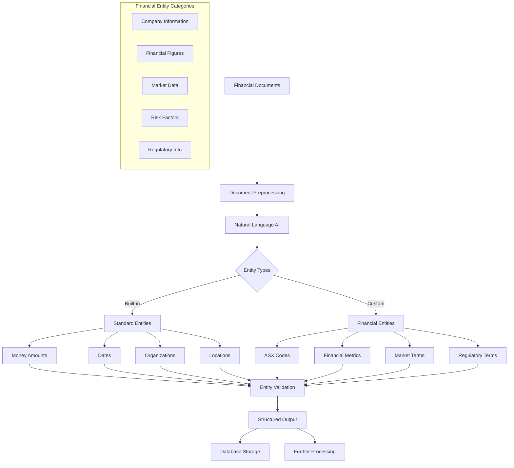

# Natural Language AI Entity Extraction for Financial Documents

## Overview

This guide covers implementing Google Cloud Natural Language AI for entity extraction from Australian financial documents, including prospectuses, annual reports, and ASX filings, with specialized focus on IPO valuation-relevant information.

## Architecture



## Implementation

### 1. Natural Language Client Configuration

```python
# src/gcp/natural_language/entity_extractor.py

from google.cloud import language_v1
from google.cloud import storage
from typing import Dict, List, Optional, Any, Union, Tuple
import re
import json
from datetime import datetime
from dataclasses import dataclass, asdict
from enum import Enum
import pandas as pd

class EntityType(Enum):
    """Financial entity types for Australian markets."""
    COMPANY_NAME = "COMPANY_NAME"
    ASX_CODE = "ASX_CODE"
    MONEY_AMOUNT = "MONEY_AMOUNT"
    PERCENTAGE = "PERCENTAGE"
    DATE = "DATE"
    FINANCIAL_RATIO = "FINANCIAL_RATIO"
    SHARES_OUTSTANDING = "SHARES_OUTSTANDING"
    MARKET_CAP = "MARKET_CAP"
    REVENUE = "REVENUE"
    PROFIT = "PROFIT"
    SECTOR = "SECTOR"
    UNDERWRITER = "UNDERWRITER"
    RISK_FACTOR = "RISK_FACTOR"
    USE_OF_PROCEEDS = "USE_OF_PROCEEDS"
    MANAGEMENT_PERSON = "MANAGEMENT_PERSON"
    AUDITOR = "AUDITOR"
    LISTING_DATE = "LISTING_DATE"
    IPO_PRICE = "IPO_PRICE"

@dataclass
class ExtractedEntity:
    """Structured representation of an extracted entity."""
    entity_type: str
    text: str
    confidence: float
    start_offset: int
    end_offset: int
    metadata: Dict[str, Any]
    normalized_value: Optional[Any] = None
    context: Optional[str] = None

@dataclass  
class FinancialDocument:
    """Representation of a financial document for processing."""
    document_id: str
    document_type: str
    content: str
    metadata: Dict[str, Any]
    extracted_entities: List[ExtractedEntity]

class AustralianFinancialEntityExtractor:
    """Entity extractor specialized for Australian financial documents."""
    
    def __init__(self, project_id: str):
        self.project_id = project_id
        self.client = language_v1.LanguageServiceClient()
        
        # Australian-specific patterns
        self.asx_code_pattern = re.compile(r'\b[A-Z]{3}\b')
        self.money_patterns = {
            'aud_million': re.compile(r'A?\$\s*(\d+(?:,\d{3})*(?:\.\d+)?)\s*(?:million|mill?|m)\b', re.IGNORECASE),
            'aud_billion': re.compile(r'A?\$\s*(\d+(?:,\d{3})*(?:\.\d+)?)\s*(?:billion|bill?|b)\b', re.IGNORECASE),
            'aud_thousand': re.compile(r'A?\$\s*(\d+(?:,\d{3})*(?:\.\d+)?)\s*(?:thousand|k)\b', re.IGNORECASE),
            'aud_basic': re.compile(r'A?\$\s*(\d+(?:,\d{3})*(?:\.\d+)?)\b')
        }
        self.percentage_pattern = re.compile(r'(\d+(?:\.\d+)?)\s*%')
        
        # Financial ratio patterns
        self.ratio_patterns = {
            'pe_ratio': re.compile(r'P/E\s*(?:ratio)?\s*(?:of)?\s*(\d+(?:\.\d+)?)', re.IGNORECASE),
            'pb_ratio': re.compile(r'P/B\s*(?:ratio)?\s*(?:of)?\s*(\d+(?:\.\d+)?)', re.IGNORECASE),
            'debt_equity': re.compile(r'debt[/-]?to[/-]?equity\s*(?:ratio)?\s*(?:of)?\s*(\d+(?:\.\d+)?)', re.IGNORECASE),
            'current_ratio': re.compile(r'current\s*ratio\s*(?:of)?\s*(\d+(?:\.\d+)?)', re.IGNORECASE)
        }
        
        # Australian sector classifications
        self.sector_mapping = {
            'technology': ['technology', 'tech', 'software', 'IT', 'information technology'],
            'healthcare': ['healthcare', 'health', 'medical', 'pharmaceutical', 'biotech'],
            'financial_services': ['financial services', 'banking', 'finance', 'insurance'],
            'resources': ['resources', 'mining', 'oil', 'gas', 'petroleum'],
            'consumer_discretionary': ['consumer discretionary', 'retail', 'media', 'entertainment'],
            'industrials': ['industrials', 'manufacturing', 'construction', 'aerospace'],
            'real_estate': ['real estate', 'property', 'REIT'],
            'utilities': ['utilities', 'power', 'electricity', 'water'],
            'energy': ['energy', 'renewable', 'solar', 'wind'],
            'materials': ['materials', 'chemicals', 'steel', 'metals']
        }
    
    def extract_entities(
        self,
        document: Union[str, FinancialDocument],
        document_type: str = "prospectus",
        enable_custom_extraction: bool = True
    ) -> List[ExtractedEntity]:
        """Extract entities from financial document."""
        
        if isinstance(document, str):
            text_content = document
        else:
            text_content = document.content
        
        # Preprocess text
        processed_text = self._preprocess_text(text_content)
        
        # Extract using Google NL API
        nl_entities = self._extract_standard_entities(processed_text)
        
        # Extract custom financial entities
        if enable_custom_extraction:
            custom_entities = self._extract_custom_entities(processed_text, document_type)
            nl_entities.extend(custom_entities)
        
        # Post-process and validate
        validated_entities = self._validate_and_normalize_entities(nl_entities, processed_text)
        
        return validated_entities
    
    def _preprocess_text(self, text: str) -> str:
        """Preprocess text for better entity extraction."""
        
        # Normalize whitespace
        text = re.sub(r'\s+', ' ', text)
        
        # Fix common OCR errors in financial documents
        text = re.sub(r'([A-Z]{2,3})\s+([A-Z]{2,3})', r'\1\2', text)  # Fix split ASX codes
        text = re.sub(r'\$\s+(\d)', r'$\1', text)  # Fix split dollar amounts
        
        # Standardize Australian dollar notation
        text = re.sub(r'AUD\s*\$', 'A$', text)
        text = re.sub(r'AU\$', 'A$', text)
        
        return text.strip()
    
    def _extract_standard_entities(self, text: str) -> List[ExtractedEntity]:
        """Extract entities using Google Natural Language API."""
        
        document = language_v1.Document(
            content=text,
            type_=language_v1.Document.Type.PLAIN_TEXT
        )
        
        # Configure entity extraction
        features = language_v1.AnalyzeEntitiesRequest.Features(
            extract_syntax=True,
            extract_entities=True,
            extract_document_sentiment=False,
            extract_entity_sentiment=True,
            classify_text=False
        )
        
        request = language_v1.AnalyzeEntitiesRequest(
            document=document,
            features=features
        )
        
        try:
            response = self.client.analyze_entities(request=request)
            
            entities = []
            for entity in response.entities:
                # Convert to our entity format
                extracted_entity = ExtractedEntity(
                    entity_type=self._map_standard_entity_type(entity.type_.name),
                    text=entity.name,
                    confidence=entity.salience,  # Use salience as confidence proxy
                    start_offset=entity.mentions[0].text.begin_offset if entity.mentions else 0,
                    end_offset=entity.mentions[0].text.begin_offset + len(entity.name) if entity.mentions else len(entity.name),
                    metadata={
                        "mentions_count": len(entity.mentions),
                        "wikipedia_url": entity.metadata.get("wikipedia_url", "") if entity.metadata else "",
                        "mid": entity.metadata.get("mid", "") if entity.metadata else "",
                        "entity_sentiment": {
                            "magnitude": entity.sentiment.magnitude if hasattr(entity, 'sentiment') else 0,
                            "score": entity.sentiment.score if hasattr(entity, 'sentiment') else 0
                        }
                    }
                )
                entities.append(extracted_entity)
            
            return entities
            
        except Exception as e:
            print(f"Error in standard entity extraction: {e}")
            return []
    
    def _extract_custom_entities(self, text: str, document_type: str) -> List[ExtractedEntity]:
        """Extract custom financial entities using patterns."""
        
        entities = []
        
        # Extract ASX codes
        entities.extend(self._extract_asx_codes(text))
        
        # Extract money amounts
        entities.extend(self._extract_money_amounts(text))
        
        # Extract percentages
        entities.extend(self._extract_percentages(text))
        
        # Extract financial ratios
        entities.extend(self._extract_financial_ratios(text))
        
        # Extract sectors
        entities.extend(self._extract_sectors(text))
        
        # Extract dates (IPO specific)
        if document_type == "prospectus":
            entities.extend(self._extract_ipo_dates(text))
        
        # Extract underwriters
        entities.extend(self._extract_underwriters(text))
        
        # Extract risk factors
        entities.extend(self._extract_risk_factors(text))
        
        # Extract use of proceeds
        entities.extend(self._extract_use_of_proceeds(text))
        
        return entities
    
    def _extract_asx_codes(self, text: str) -> List[ExtractedEntity]:
        """Extract ASX stock codes."""
        
        entities = []
        
        for match in self.asx_code_pattern.finditer(text):
            code = match.group()
            
            # Validate it's likely an ASX code (not just any 3-letter word)
            if self._is_likely_asx_code(code, text, match.start()):
                entity = ExtractedEntity(
                    entity_type=EntityType.ASX_CODE.value,
                    text=code,
                    confidence=0.9,
                    start_offset=match.start(),
                    end_offset=match.end(),
                    metadata={"pattern_match": "three_letter_code"},
                    normalized_value=code.upper()
                )
                entities.append(entity)
        
        return entities
    
    def _extract_money_amounts(self, text: str) -> List[ExtractedEntity]:
        """Extract Australian dollar amounts."""
        
        entities = []
        
        for pattern_name, pattern in self.money_patterns.items():
            for match in pattern.finditer(text):
                amount_str = match.group(1).replace(',', '')
                
                try:
                    amount = float(amount_str)
                    
                    # Convert to base amount
                    if 'million' in pattern_name:
                        normalized_amount = amount * 1_000_000
                    elif 'billion' in pattern_name:
                        normalized_amount = amount * 1_000_000_000
                    elif 'thousand' in pattern_name:
                        normalized_amount = amount * 1_000
                    else:
                        normalized_amount = amount
                    
                    entity = ExtractedEntity(
                        entity_type=EntityType.MONEY_AMOUNT.value,
                        text=match.group(),
                        confidence=0.95,
                        start_offset=match.start(),
                        end_offset=match.end(),
                        metadata={
                            "currency": "AUD",
                            "pattern_type": pattern_name,
                            "original_amount": amount
                        },
                        normalized_value=normalized_amount
                    )
                    entities.append(entity)
                    
                except ValueError:
                    continue
        
        return entities
    
    def _extract_percentages(self, text: str) -> List[ExtractedEntity]:
        """Extract percentage values."""
        
        entities = []
        
        for match in self.percentage_pattern.finditer(text):
            percentage_str = match.group(1)
            
            try:
                percentage = float(percentage_str)
                
                entity = ExtractedEntity(
                    entity_type=EntityType.PERCENTAGE.value,
                    text=match.group(),
                    confidence=0.9,
                    start_offset=match.start(),
                    end_offset=match.end(),
                    metadata={"unit": "percent"},
                    normalized_value=percentage / 100  # Convert to decimal
                )
                entities.append(entity)
                
            except ValueError:
                continue
        
        return entities
    
    def _extract_financial_ratios(self, text: str) -> List[ExtractedEntity]:
        """Extract financial ratios."""
        
        entities = []
        
        for ratio_name, pattern in self.ratio_patterns.items():
            for match in pattern.finditer(text):
                ratio_str = match.group(1)
                
                try:
                    ratio_value = float(ratio_str)
                    
                    entity = ExtractedEntity(
                        entity_type=EntityType.FINANCIAL_RATIO.value,
                        text=match.group(),
                        confidence=0.85,
                        start_offset=match.start(),
                        end_offset=match.end(),
                        metadata={
                            "ratio_type": ratio_name,
                            "ratio_category": "valuation" if ratio_name in ['pe_ratio', 'pb_ratio'] else "liquidity"
                        },
                        normalized_value=ratio_value
                    )
                    entities.append(entity)
                    
                except ValueError:
                    continue
        
        return entities
    
    def _extract_sectors(self, text: str) -> List[ExtractedEntity]:
        """Extract industry sectors."""
        
        entities = []
        text_lower = text.lower()
        
        for sector, keywords in self.sector_mapping.items():
            for keyword in keywords:
                pattern = re.compile(rf'\b{re.escape(keyword)}\b', re.IGNORECASE)
                
                for match in pattern.finditer(text):
                    entity = ExtractedEntity(
                        entity_type=EntityType.SECTOR.value,
                        text=match.group(),
                        confidence=0.8,
                        start_offset=match.start(),
                        end_offset=match.end(),
                        metadata={
                            "sector_category": sector,
                            "matched_keyword": keyword
                        },
                        normalized_value=sector
                    )
                    entities.append(entity)
        
        return entities
    
    def _extract_ipo_dates(self, text: str) -> List[ExtractedEntity]:
        """Extract IPO-related dates."""
        
        entities = []
        
        # Patterns for IPO date mentions
        ipo_date_patterns = [
            r'(?:listing|IPO|initial public offering)\s+(?:date|on)\s+(\d{1,2}[/-]\d{1,2}[/-]\d{4})',
            r'(?:expected to|will)\s+(?:list|commence trading)\s+on\s+(\d{1,2}\s+\w+\s+\d{4})',
            r'listing\s+(?:is\s+)?scheduled\s+for\s+(\d{1,2}\s+\w+\s+\d{4})'
        ]
        
        for pattern_str in ipo_date_patterns:
            pattern = re.compile(pattern_str, re.IGNORECASE)
            
            for match in pattern.finditer(text):
                date_str = match.group(1)
                
                entity = ExtractedEntity(
                    entity_type=EntityType.LISTING_DATE.value,
                    text=match.group(),
                    confidence=0.9,
                    start_offset=match.start(),
                    end_offset=match.end(),
                    metadata={
                        "date_format": "extracted_from_text",
                        "context": "IPO_listing"
                    },
                    normalized_value=self._normalize_date(date_str)
                )
                entities.append(entity)
        
        return entities
    
    def _extract_underwriters(self, text: str) -> List[ExtractedEntity]:
        """Extract underwriter information."""
        
        entities = []
        
        # Common Australian underwriter patterns
        underwriter_patterns = [
            r'(?:underwriter|lead manager|bookrunner)(?:s)?\s+(?:is|are|include)\s+([A-Z][A-Za-z\s&,]+)',
            r'([A-Z][A-Za-z\s&]+)\s+(?:is|are)\s+(?:acting as\s+)?(?:the\s+)?(?:lead\s+)?(?:manager|underwriter)',
            r'(?:joint\s+)?(?:lead\s+)?(?:managers?|underwriters?)[:\s]+([A-Z][A-Za-z\s&,]+)'
        ]
        
        for pattern_str in underwriter_patterns:
            pattern = re.compile(pattern_str, re.IGNORECASE)
            
            for match in pattern.finditer(text):
                underwriter_text = match.group(1).strip()
                
                # Clean up the extracted text
                underwriter_text = re.sub(r'\s+', ' ', underwriter_text)
                underwriter_text = underwriter_text.rstrip(',.')
                
                entity = ExtractedEntity(
                    entity_type=EntityType.UNDERWRITER.value,
                    text=underwriter_text,
                    confidence=0.8,
                    start_offset=match.start(1),
                    end_offset=match.end(1),
                    metadata={
                        "role": "underwriter",
                        "full_match": match.group()
                    },
                    normalized_value=underwriter_text.title()
                )
                entities.append(entity)
        
        return entities
    
    def _extract_risk_factors(self, text: str) -> List[ExtractedEntity]:
        """Extract risk factors from text."""
        
        entities = []
        
        # Look for risk factor sections
        risk_section_pattern = re.compile(
            r'(?:RISK\s+FACTORS?|RISKS?)\s*:?\s*(.*?)(?=\n\s*[A-Z][A-Z\s]{10,}|\Z)',
            re.IGNORECASE | re.DOTALL
        )
        
        match = risk_section_pattern.search(text)
        if match:
            risk_content = match.group(1)
            
            # Extract individual risk factors
            risk_sentences = re.split(r'[.!?]\s+', risk_content)
            
            for i, sentence in enumerate(risk_sentences[:10]):  # Limit to first 10
                if len(sentence.strip()) > 50:  # Only meaningful sentences
                    entity = ExtractedEntity(
                        entity_type=EntityType.RISK_FACTOR.value,
                        text=sentence.strip(),
                        confidence=0.7,
                        start_offset=match.start() + risk_content.find(sentence),
                        end_offset=match.start() + risk_content.find(sentence) + len(sentence),
                        metadata={
                            "risk_order": i + 1,
                            "section": "risk_factors"
                        }
                    )
                    entities.append(entity)
        
        return entities
    
    def _extract_use_of_proceeds(self, text: str) -> List[ExtractedEntity]:
        """Extract use of proceeds information."""
        
        entities = []
        
        # Look for use of proceeds section
        proceeds_pattern = re.compile(
            r'(?:USE\s+OF\s+PROCEEDS?|HOW\s+THE\s+MONEY\s+WILL\s+BE\s+USED)\s*:?\s*(.*?)(?=\n\s*[A-Z][A-Z\s]{10,}|\Z)',
            re.IGNORECASE | re.DOTALL
        )
        
        match = proceeds_pattern.search(text)
        if match:
            proceeds_content = match.group(1)
            
            # Extract bullet points or main uses
            use_patterns = [
                r'•\s*(.*?)(?=•|\n\n|\Z)',
                r'-\s*(.*?)(?=-|\n\n|\Z)',
                r'\d+\.\s*(.*?)(?=\d+\.|\n\n|\Z)'
            ]
            
            for pattern_str in use_patterns:
                pattern = re.compile(pattern_str, re.DOTALL)
                
                for i, match in enumerate(pattern.finditer(proceeds_content)):
                    use_text = match.group(1).strip()
                    
                    if len(use_text) > 20:
                        entity = ExtractedEntity(
                            entity_type=EntityType.USE_OF_PROCEEDS.value,
                            text=use_text,
                            confidence=0.75,
                            start_offset=match.start(1),
                            end_offset=match.end(1),
                            metadata={
                                "use_order": i + 1,
                                "section": "use_of_proceeds"
                            }
                        )
                        entities.append(entity)
        
        return entities
    
    def _is_likely_asx_code(self, code: str, text: str, position: int) -> bool:
        """Validate if a 3-letter code is likely an ASX code."""
        
        # Get context around the code
        start = max(0, position - 50)
        end = min(len(text), position + len(code) + 50)
        context = text[start:end].lower()
        
        # Check for ASX-related context
        asx_indicators = [
            'asx', 'australian securities exchange', 'stock code', 'ticker',
            'listed', 'trading', 'share code', 'securities'
        ]
        
        if any(indicator in context for indicator in asx_indicators):
            return True
        
        # Check if surrounded by financial context
        financial_context = [
            'shares', 'stock', 'market', 'trading', 'price', 'volume',
            'dividend', 'earnings', 'revenue'
        ]
        
        if any(term in context for term in financial_context):
            return True
        
        # Exclude common English words that happen to be 3 letters
        common_words = {
            'THE', 'AND', 'FOR', 'ARE', 'BUT', 'NOT', 'YOU', 'ALL', 'CAN', 'HER',
            'WAS', 'ONE', 'OUR', 'HAD', 'HAS', 'HIS', 'HOW', 'ITS', 'MAY', 'NEW',
            'NOW', 'OLD', 'SEE', 'TWO', 'WAY', 'WHO', 'BOY', 'DID', 'GOT', 'MAN',
            'END', 'DAY', 'GET', 'USE', 'HER', 'OWN', 'SAY', 'SHE', 'TOO', 'ANY'
        }
        
        if code.upper() in common_words:
            return False
        
        return len(code) == 3 and code.isupper()
    
    def _normalize_date(self, date_str: str) -> Optional[str]:
        """Normalize date string to ISO format."""
        
        # This is a simplified version - in production, would use more robust date parsing
        try:
            # Handle common Australian date formats
            if '/' in date_str:
                parts = date_str.split('/')
                if len(parts) == 3:
                    day, month, year = parts
                    return f"{year}-{month.zfill(2)}-{day.zfill(2)}"
            
            return date_str  # Return as-is if can't parse
        except:
            return None
    
    def _map_standard_entity_type(self, nl_entity_type: str) -> str:
        """Map Google NL entity types to our entity types."""
        
        mapping = {
            'PERSON': 'MANAGEMENT_PERSON',
            'ORGANIZATION': 'COMPANY_NAME', 
            'LOCATION': 'LOCATION',
            'EVENT': 'EVENT',
            'WORK_OF_ART': 'DOCUMENT',
            'CONSUMER_GOOD': 'PRODUCT',
            'OTHER': 'OTHER',
            'PHONE_NUMBER': 'PHONE_NUMBER',
            'ADDRESS': 'ADDRESS',
            'DATE': 'DATE',
            'NUMBER': 'NUMBER',
            'PRICE': 'MONEY_AMOUNT'
        }
        
        return mapping.get(nl_entity_type, 'OTHER')
    
    def _validate_and_normalize_entities(
        self,
        entities: List[ExtractedEntity],
        text: str
    ) -> List[ExtractedEntity]:
        """Validate and normalize extracted entities."""
        
        validated = []
        
        for entity in entities:
            # Skip entities with very low confidence
            if entity.confidence < 0.5:
                continue
            
            # Add context for better understanding
            entity.context = self._get_entity_context(entity, text)
            
            # Perform entity-specific validation
            if self._validate_entity(entity):
                validated.append(entity)
        
        # Remove duplicates
        validated = self._remove_duplicate_entities(validated)
        
        # Sort by position in text
        validated.sort(key=lambda x: x.start_offset)
        
        return validated
    
    def _get_entity_context(self, entity: ExtractedEntity, text: str) -> str:
        """Get surrounding context for an entity."""
        
        context_size = 100
        start = max(0, entity.start_offset - context_size)
        end = min(len(text), entity.end_offset + context_size)
        
        return text[start:end].strip()
    
    def _validate_entity(self, entity: ExtractedEntity) -> bool:
        """Validate individual entity."""
        
        # Entity-specific validation rules
        if entity.entity_type == EntityType.MONEY_AMOUNT.value:
            return entity.normalized_value is not None and entity.normalized_value > 0
        
        elif entity.entity_type == EntityType.ASX_CODE.value:
            return len(entity.text) == 3 and entity.text.isupper()
        
        elif entity.entity_type == EntityType.PERCENTAGE.value:
            return entity.normalized_value is not None and 0 <= entity.normalized_value <= 1
        
        # General validation
        return len(entity.text.strip()) > 0
    
    def _remove_duplicate_entities(
        self,
        entities: List[ExtractedEntity]
    ) -> List[ExtractedEntity]:
        """Remove duplicate entities."""
        
        unique_entities = []
        seen = set()
        
        for entity in entities:
            # Create a key for deduplication
            key = (entity.entity_type, entity.text.lower(), entity.start_offset)
            
            if key not in seen:
                seen.add(key)
                unique_entities.append(entity)
        
        return unique_entities

class FinancialEntityProcessor:
    """Processor for extracted financial entities."""
    
    def __init__(self, extractor: AustralianFinancialEntityExtractor):
        self.extractor = extractor
    
    def process_ipo_prospectus(self, prospectus_text: str) -> Dict[str, Any]:
        """Process IPO prospectus and extract structured information."""
        
        entities = self.extractor.extract_entities(
            prospectus_text,
            document_type="prospectus"
        )
        
        # Group entities by type
        entity_groups = {}
        for entity in entities:
            if entity.entity_type not in entity_groups:
                entity_groups[entity.entity_type] = []
            entity_groups[entity.entity_type].append(entity)
        
        # Extract structured IPO information
        ipo_info = {
            "company_information": self._extract_company_info(entity_groups),
            "financial_metrics": self._extract_financial_metrics(entity_groups),
            "ipo_details": self._extract_ipo_details(entity_groups),
            "risk_assessment": self._extract_risk_assessment(entity_groups),
            "market_context": self._extract_market_context(entity_groups),
            "raw_entities": [asdict(entity) for entity in entities]
        }
        
        return ipo_info
    
    def _extract_company_info(self, entity_groups: Dict[str, List[ExtractedEntity]]) -> Dict[str, Any]:
        """Extract company information from entities."""
        
        company_info = {}
        
        # Company name
        if EntityType.COMPANY_NAME.value in entity_groups:
            companies = entity_groups[EntityType.COMPANY_NAME.value]
            # Take the most confident company name
            if companies:
                best_company = max(companies, key=lambda x: x.confidence)
                company_info["name"] = best_company.text
                company_info["name_confidence"] = best_company.confidence
        
        # ASX code
        if EntityType.ASX_CODE.value in entity_groups:
            codes = entity_groups[EntityType.ASX_CODE.value]
            if codes:
                # Take the first valid ASX code
                company_info["asx_code"] = codes[0].normalized_value
                company_info["asx_code_confidence"] = codes[0].confidence
        
        # Sector
        if EntityType.SECTOR.value in entity_groups:
            sectors = entity_groups[EntityType.SECTOR.value]
            if sectors:
                # Take the most confident sector
                best_sector = max(sectors, key=lambda x: x.confidence)
                company_info["sector"] = best_sector.normalized_value
                company_info["sector_confidence"] = best_sector.confidence
        
        return company_info
    
    def _extract_financial_metrics(self, entity_groups: Dict[str, List[ExtractedEntity]]) -> Dict[str, Any]:
        """Extract financial metrics from entities."""
        
        metrics = {}
        
        # Money amounts - categorize by context
        if EntityType.MONEY_AMOUNT.value in entity_groups:
            money_entities = entity_groups[EntityType.MONEY_AMOUNT.value]
            
            for money_entity in money_entities:
                context = money_entity.context.lower() if money_entity.context else ""
                
                if any(term in context for term in ['revenue', 'sales', 'turnover']):
                    metrics["revenue"] = {
                        "value": money_entity.normalized_value,
                        "confidence": money_entity.confidence,
                        "text": money_entity.text
                    }
                elif any(term in context for term in ['profit', 'earnings', 'income']):
                    metrics["profit"] = {
                        "value": money_entity.normalized_value,
                        "confidence": money_entity.confidence,
                        "text": money_entity.text
                    }
                elif any(term in context for term in ['market cap', 'capitalisation']):
                    metrics["market_cap"] = {
                        "value": money_entity.normalized_value,
                        "confidence": money_entity.confidence,
                        "text": money_entity.text
                    }
        
        # Financial ratios
        if EntityType.FINANCIAL_RATIO.value in entity_groups:
            ratio_entities = entity_groups[EntityType.FINANCIAL_RATIO.value]
            
            for ratio_entity in ratio_entities:
                ratio_type = ratio_entity.metadata.get("ratio_type")
                if ratio_type:
                    metrics[ratio_type] = {
                        "value": ratio_entity.normalized_value,
                        "confidence": ratio_entity.confidence,
                        "text": ratio_entity.text
                    }
        
        return metrics
    
    def _extract_ipo_details(self, entity_groups: Dict[str, List[ExtractedEntity]]) -> Dict[str, Any]:
        """Extract IPO-specific details."""
        
        ipo_details = {}
        
        # Listing date
        if EntityType.LISTING_DATE.value in entity_groups:
            dates = entity_groups[EntityType.LISTING_DATE.value]
            if dates:
                best_date = max(dates, key=lambda x: x.confidence)
                ipo_details["listing_date"] = {
                    "value": best_date.normalized_value,
                    "confidence": best_date.confidence,
                    "text": best_date.text
                }
        
        # Underwriters
        if EntityType.UNDERWRITER.value in entity_groups:
            underwriters = entity_groups[EntityType.UNDERWRITER.value]
            ipo_details["underwriters"] = [
                {
                    "name": uw.normalized_value,
                    "confidence": uw.confidence,
                    "text": uw.text
                }
                for uw in underwriters
            ]
        
        # IPO price (from money amounts in IPO context)
        if EntityType.MONEY_AMOUNT.value in entity_groups:
            money_entities = entity_groups[EntityType.MONEY_AMOUNT.value]
            
            for money_entity in money_entities:
                context = money_entity.context.lower() if money_entity.context else ""
                
                if any(term in context for term in ['ipo price', 'offer price', 'issue price']):
                    ipo_details["ipo_price"] = {
                        "value": money_entity.normalized_value,
                        "confidence": money_entity.confidence,
                        "text": money_entity.text
                    }
                    break
        
        return ipo_details
    
    def _extract_risk_assessment(self, entity_groups: Dict[str, List[ExtractedEntity]]) -> Dict[str, Any]:
        """Extract risk-related information."""
        
        risk_info = {}
        
        if EntityType.RISK_FACTOR.value in entity_groups:
            risk_entities = entity_groups[EntityType.RISK_FACTOR.value]
            
            risk_info["risk_factors"] = [
                {
                    "description": risk.text,
                    "confidence": risk.confidence,
                    "order": risk.metadata.get("risk_order", 0)
                }
                for risk in risk_entities
            ]
            
            risk_info["total_risks_identified"] = len(risk_entities)
        
        return risk_info
    
    def _extract_market_context(self, entity_groups: Dict[str, List[ExtractedEntity]]) -> Dict[str, Any]:
        """Extract market context information."""
        
        market_info = {}
        
        # Extract percentages that might be market-related
        if EntityType.PERCENTAGE.value in entity_groups:
            percentages = entity_groups[EntityType.PERCENTAGE.value]
            
            market_percentages = []
            for pct in percentages:
                context = pct.context.lower() if pct.context else ""
                
                if any(term in context for term in ['market', 'share', 'growth', 'return']):
                    market_percentages.append({
                        "value": pct.normalized_value,
                        "text": pct.text,
                        "context": pct.context,
                        "confidence": pct.confidence
                    })
            
            if market_percentages:
                market_info["market_percentages"] = market_percentages
        
        return market_info
```

### 2. Usage Example

```python
# examples/entity_extraction_example.py

from src.gcp.natural_language.entity_extractor import (
    AustralianFinancialEntityExtractor,
    FinancialEntityProcessor,
    EntityType
)

def main():
    """Example of financial entity extraction."""
    
    project_id = "your-gcp-project-id"
    
    # Sample IPO prospectus text
    sample_prospectus = """
    TechCorp Limited (ASX: TCL) is pleased to announce its Initial Public Offering.
    
    The Company is offering 20,000,000 ordinary shares at an issue price of A$2.50 per share,
    raising approximately A$50 million. The Company will list on the Australian Securities Exchange
    on 15 March 2024.
    
    TechCorp operates in the technology sector, specifically software development and cloud services.
    The Company reported revenue of A$35 million and net profit of A$5.2 million for FY2023.
    
    The P/E ratio is approximately 15.5 and the price-to-book ratio is 2.8.
    
    Lead Manager: Goldman Sachs Australia Pty Ltd
    Joint Lead Manager: Macquarie Capital
    
    Use of Proceeds:
    • Expansion of cloud infrastructure (40%)
    • Research and development (35%) 
    • Working capital (25%)
    
    Risk Factors:
    The technology sector is highly competitive with rapid changes in technology.
    The Company's success depends on key personnel and intellectual property protection.
    Market conditions may affect the Company's ability to execute its business plan.
    """
    
    # Initialize extractor
    extractor = AustralianFinancialEntityExtractor(project_id)
    processor = FinancialEntityProcessor(extractor)
    
    # Extract entities
    print("Extracting entities from prospectus...")
    entities = extractor.extract_entities(sample_prospectus, "prospectus")
    
    print(f"\nFound {len(entities)} entities:")
    for entity in entities:
        print(f"- {entity.entity_type}: '{entity.text}' (confidence: {entity.confidence:.2f})")
        if entity.normalized_value:
            print(f"  Normalized: {entity.normalized_value}")
        print()
    
    # Process structured information
    print("Processing structured IPO information...")
    ipo_info = processor.process_ipo_prospectus(sample_prospectus)
    
    print("\nStructured IPO Information:")
    print(f"Company: {ipo_info['company_information']}")
    print(f"Financial Metrics: {ipo_info['financial_metrics']}")
    print(f"IPO Details: {ipo_info['ipo_details']}")
    print(f"Risk Assessment: {ipo_info['risk_assessment']}")
    
    # Filter entities by type
    money_entities = [e for e in entities if e.entity_type == EntityType.MONEY_AMOUNT.value]
    print(f"\nMoney entities found: {len(money_entities)}")
    for money in money_entities:
        print(f"- {money.text} -> A${money.normalized_value:,.2f}")
    
    # ASX codes
    asx_entities = [e for e in entities if e.entity_type == EntityType.ASX_CODE.value]
    print(f"\nASX codes found: {len(asx_entities)}")
    for asx in asx_entities:
        print(f"- {asx.text}")
    
    # Risk factors
    risk_entities = [e for e in entities if e.entity_type == EntityType.RISK_FACTOR.value]
    print(f"\nRisk factors found: {len(risk_entities)}")
    for risk in risk_entities:
        print(f"- {risk.text[:100]}...")

if __name__ == "__main__":
    main()
```

## Best Practices

### Entity Extraction Optimization
- Preprocess text to fix common OCR errors
- Use context-aware validation for extracted entities
- Implement confidence thresholds for quality control
- Combine multiple extraction methods for better coverage

### Australian Financial Context
- Include ASX-specific terminology and patterns
- Handle Australian dollar notation variations
- Recognize Australian company naming conventions
- Account for local regulatory terminology

### Performance and Scaling
- Batch process multiple documents efficiently
- Cache frequently used patterns and models
- Implement parallel processing for large document sets
- Monitor API usage and costs

### Quality Assurance
- Validate extracted entities against business rules
- Implement manual review workflows for low-confidence extractions
- Track extraction accuracy and continuously improve patterns
- Maintain audit trails for regulatory compliance

This implementation provides a comprehensive foundation for extracting financial entities from Australian documents using Google Cloud Natural Language AI, specifically optimized for IPO valuation workflows.