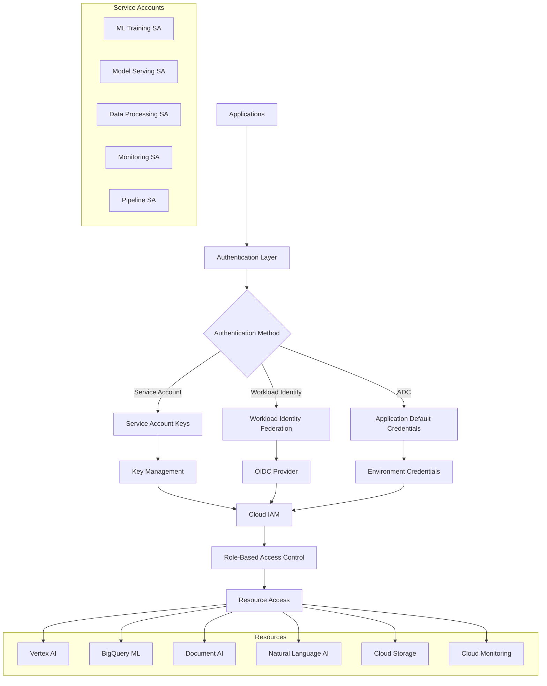

# Production Authentication and Service Account Management

## Overview

This guide covers implementing production-ready authentication and service account management for the IPO valuation platform's Google Cloud AI/ML services integration, focusing on security best practices and compliance requirements.

## Architecture



## Implementation

### 1. Service Account Management

```python
# src/gcp/auth/service_accounts.py

from google.cloud import iam
from google.cloud import resourcemanager_v3
from google.oauth2 import service_account
import google.auth
from typing import Dict, List, Optional, Any, Union
import json
import base64
from datetime import datetime, timedelta
from dataclasses import dataclass
from enum import Enum
import os

class ServiceAccountRole(Enum):
    """Predefined roles for IPO valuation platform service accounts."""
    ML_TRAINING = "ml_training"
    MODEL_SERVING = "model_serving"
    DATA_PROCESSING = "data_processing"
    MONITORING = "monitoring"
    PIPELINE_ORCHESTRATION = "pipeline_orchestration"
    DOCUMENT_PROCESSING = "document_processing"
    NATURAL_LANGUAGE = "natural_language"
    FEATURE_STORE = "feature_store"

@dataclass
class ServiceAccountConfig:
    """Configuration for creating service accounts."""
    account_id: str
    display_name: str
    description: str
    roles: List[str]
    conditions: Optional[Dict[str, Any]] = None
    key_rotation_days: int = 90
    enable_key_rotation: bool = True
    environment: str = "production"

class IPOValuationServiceAccountManager:
    """Service account manager for IPO valuation platform."""
    
    def __init__(self, project_id: str):
        self.project_id = project_id
        self.iam_client = iam.IAMCredentialsServiceClient()
        self.resource_manager = resourcemanager_v3.ProjectsClient()
        
        # Initialize with application default credentials
        self.credentials, _ = google.auth.default()
    
    def get_service_account_configs(self) -> Dict[ServiceAccountRole, ServiceAccountConfig]:
        """Get predefined service account configurations."""
        
        configs = {
            ServiceAccountRole.ML_TRAINING: ServiceAccountConfig(
                account_id="ipo-ml-training",
                display_name="IPO ML Training Service Account",
                description="Service account for ML model training operations",
                roles=[
                    "roles/aiplatform.user",
                    "roles/bigquery.dataEditor",
                    "roles/bigquery.jobUser",
                    "roles/storage.objectViewer",
                    "roles/storage.objectCreator",
                    "roles/ml.developer"
                ],
                conditions={
                    "title": "Training Hours Only",
                    "description": "Access only during training hours",
                    "expression": "request.time.getHours() >= 1 && request.time.getHours() <= 6"
                }
            ),
            
            ServiceAccountRole.MODEL_SERVING: ServiceAccountConfig(
                account_id="ipo-model-serving",
                display_name="IPO Model Serving Service Account", 
                description="Service account for model serving and inference",
                roles=[
                    "roles/aiplatform.user",
                    "roles/ml.modelUser",
                    "roles/monitoring.metricWriter",
                    "roles/logging.logWriter"
                ],
                key_rotation_days=30,  # More frequent rotation for serving
                conditions={
                    "title": "Model Serving Only",
                    "description": "Access limited to model serving resources",
                    "expression": """
                    resource.type == "aiplatform.googleapis.com/Endpoint" ||
                    resource.type == "aiplatform.googleapis.com/Model"
                    """
                }
            ),
            
            ServiceAccountRole.DATA_PROCESSING: ServiceAccountConfig(
                account_id="ipo-data-processing",
                display_name="IPO Data Processing Service Account",
                description="Service account for data ingestion and processing",
                roles=[
                    "roles/bigquery.dataEditor",
                    "roles/bigquery.jobUser",
                    "roles/storage.objectAdmin",
                    "roles/pubsub.subscriber",
                    "roles/pubsub.publisher"
                ]
            ),
            
            ServiceAccountRole.DOCUMENT_PROCESSING: ServiceAccountConfig(
                account_id="ipo-document-ai",
                display_name="IPO Document AI Service Account",
                description="Service account for Document AI processing",
                roles=[
                    "roles/documentai.apiUser",
                    "roles/storage.objectViewer",
                    "roles/storage.objectCreator"
                ]
            ),
            
            ServiceAccountRole.NATURAL_LANGUAGE: ServiceAccountConfig(
                account_id="ipo-natural-language",
                display_name="IPO Natural Language Service Account",
                description="Service account for Natural Language AI processing",
                roles=[
                    "roles/language.serviceAgent",
                    "roles/storage.objectViewer"
                ]
            ),
            
            ServiceAccountRole.MONITORING: ServiceAccountConfig(
                account_id="ipo-monitoring",
                display_name="IPO Monitoring Service Account",
                description="Service account for monitoring and alerting",
                roles=[
                    "roles/monitoring.editor",
                    "roles/logging.viewer",
                    "roles/errorreporting.writer",
                    "roles/cloudtrace.agent"
                ]
            ),
            
            ServiceAccountRole.PIPELINE_ORCHESTRATION: ServiceAccountConfig(
                account_id="ipo-pipeline-orchestration",
                display_name="IPO Pipeline Orchestration Service Account",
                description="Service account for pipeline orchestration",
                roles=[
                    "roles/aiplatform.user",
                    "roles/bigquery.jobUser",
                    "roles/storage.objectAdmin",
                    "roles/iam.serviceAccountUser"
                ]
            ),
            
            ServiceAccountRole.FEATURE_STORE: ServiceAccountConfig(
                account_id="ipo-feature-store",
                display_name="IPO Feature Store Service Account",
                description="Service account for Feature Store operations",
                roles=[
                    "roles/aiplatform.featurestoreUser",
                    "roles/bigquery.dataViewer",
                    "roles/bigquery.jobUser"
                ]
            )
        }
        
        return configs
    
    def create_service_account(
        self,
        config: ServiceAccountConfig
    ) -> Dict[str, Any]:
        """Create service account with specified configuration."""
        
        try:
            # Create service account
            request = iam.CreateServiceAccountRequest(
                name=f"projects/{self.project_id}",
                account_id=config.account_id,
                service_account=iam.ServiceAccount(
                    display_name=config.display_name,
                    description=config.description
                )
            )
            
            service_account = self.iam_client.create_service_account(request=request)
            
            # Assign roles
            self._assign_roles_to_service_account(
                service_account.email,
                config.roles,
                config.conditions
            )
            
            # Generate initial key if needed
            key_info = None
            if config.enable_key_rotation:
                key_info = self._create_service_account_key(service_account.email)
            
            return {
                "status": "created",
                "service_account": {
                    "name": service_account.name,
                    "email": service_account.email,
                    "project_id": service_account.project_id,
                    "unique_id": service_account.unique_id
                },
                "roles_assigned": config.roles,
                "key_info": key_info,
                "created_at": datetime.now().isoformat()
            }
            
        except Exception as e:
            return {
                "status": "failed",
                "error": str(e),
                "attempted_at": datetime.now().isoformat()
            }
    
    def create_all_service_accounts(self) -> Dict[str, Any]:
        """Create all predefined service accounts."""
        
        configs = self.get_service_account_configs()
        results = {
            "creation_start": datetime.now().isoformat(),
            "accounts": {},
            "summary": {
                "total": len(configs),
                "created": 0,
                "failed": 0
            }
        }
        
        for role, config in configs.items():
            print(f"Creating service account: {config.account_id}")
            
            result = self.create_service_account(config)
            results["accounts"][role.value] = result
            
            if result["status"] == "created":
                results["summary"]["created"] += 1
            else:
                results["summary"]["failed"] += 1
        
        results["creation_end"] = datetime.now().isoformat()
        
        return results
    
    def _assign_roles_to_service_account(
        self,
        service_account_email: str,
        roles: List[str],
        conditions: Optional[Dict[str, Any]] = None
    ) -> None:
        """Assign IAM roles to service account."""
        
        # Get current IAM policy
        project_name = f"projects/{self.project_id}"
        policy = self.resource_manager.get_iam_policy(
            request={"resource": project_name}
        )
        
        # Create member string
        member = f"serviceAccount:{service_account_email}"
        
        # Add role bindings
        for role in roles:
            binding = None
            
            # Find existing binding
            for b in policy.bindings:
                if b.role == role:
                    binding = b
                    break
            
            # Create new binding if not exists
            if not binding:
                binding = iam.Binding(role=role, members=[])
                policy.bindings.append(binding)
            
            # Add member if not already present
            if member not in binding.members:
                binding.members.append(member)
                
                # Add condition if specified
                if conditions:
                    from google.cloud.iam_v1 import Expr
                    binding.condition = Expr(
                        title=conditions.get("title", ""),
                        description=conditions.get("description", ""),
                        expression=conditions.get("expression", "")
                    )
        
        # Update policy
        self.resource_manager.set_iam_policy(
            request={
                "resource": project_name,
                "policy": policy
            }
        )
    
    def _create_service_account_key(
        self,
        service_account_email: str
    ) -> Dict[str, Any]:
        """Create service account key."""
        
        request = iam.CreateServiceAccountKeyRequest(
            name=f"projects/{self.project_id}/serviceAccounts/{service_account_email}",
            private_key_type=iam.ServiceAccountPrivateKeyType.TYPE_GOOGLE_CREDENTIALS_FILE
        )
        
        key = self.iam_client.create_service_account_key(request=request)
        
        # Decode key data
        key_data = base64.b64decode(key.private_key_data).decode('utf-8')
        key_json = json.loads(key_data)
        
        return {
            "key_id": key.name.split('/')[-1],
            "key_algorithm": key.key_algorithm.name,
            "created_at": key.valid_after_time,
            "expires_at": key.valid_before_time,
            "credentials": key_json
        }
    
    def rotate_service_account_keys(
        self,
        service_account_email: str,
        delete_old_keys: bool = True
    ) -> Dict[str, Any]:
        """Rotate service account keys."""
        
        try:
            # List existing keys
            request = iam.ListServiceAccountKeysRequest(
                name=f"projects/{self.project_id}/serviceAccounts/{service_account_email}",
                key_types=[iam.ListServiceAccountKeysRequest.KeyType.USER_MANAGED]
            )
            
            existing_keys = self.iam_client.list_service_account_keys(request=request)
            
            # Create new key
            new_key_info = self._create_service_account_key(service_account_email)
            
            # Delete old keys if requested
            deleted_keys = []
            if delete_old_keys:
                for key in existing_keys.keys:
                    if key.key_type == iam.ServiceAccountKey.KeyType.USER_MANAGED:
                        delete_request = iam.DeleteServiceAccountKeyRequest(
                            name=key.name
                        )
                        self.iam_client.delete_service_account_key(request=delete_request)
                        deleted_keys.append(key.name.split('/')[-1])
            
            return {
                "status": "rotated",
                "new_key": new_key_info,
                "deleted_keys": deleted_keys,
                "rotated_at": datetime.now().isoformat()
            }
            
        except Exception as e:
            return {
                "status": "failed",
                "error": str(e),
                "attempted_at": datetime.now().isoformat()
            }
    
    def audit_service_accounts(self) -> Dict[str, Any]:
        """Audit all service accounts for compliance."""
        
        audit_results = {
            "audit_timestamp": datetime.now().isoformat(),
            "accounts": {},
            "compliance_summary": {
                "total_accounts": 0,
                "compliant": 0,
                "non_compliant": 0,
                "issues": []
            }
        }
        
        # List all service accounts in project
        request = iam.ListServiceAccountsRequest(
            name=f"projects/{self.project_id}"
        )
        
        service_accounts = self.iam_client.list_service_accounts(request=request)
        
        for sa in service_accounts.accounts:
            if sa.email.endswith(f"{self.project_id}.iam.gserviceaccount.com"):
                account_audit = self._audit_single_service_account(sa)
                audit_results["accounts"][sa.email] = account_audit
                
                audit_results["compliance_summary"]["total_accounts"] += 1
                
                if account_audit["compliant"]:
                    audit_results["compliance_summary"]["compliant"] += 1
                else:
                    audit_results["compliance_summary"]["non_compliant"] += 1
                    audit_results["compliance_summary"]["issues"].extend(
                        account_audit["issues"]
                    )
        
        return audit_results
    
    def _audit_single_service_account(
        self,
        service_account: iam.ServiceAccount
    ) -> Dict[str, Any]:
        """Audit a single service account."""
        
        issues = []
        
        # Check for old keys
        request = iam.ListServiceAccountKeysRequest(
            name=service_account.name,
            key_types=[iam.ListServiceAccountKeysRequest.KeyType.USER_MANAGED]
        )
        
        keys = self.iam_client.list_service_account_keys(request=request)
        
        old_keys = []
        for key in keys.keys:
            if key.key_type == iam.ServiceAccountKey.KeyType.USER_MANAGED:
                # Check if key is older than 90 days
                key_age = datetime.now() - key.valid_after_time
                if key_age.days > 90:
                    old_keys.append({
                        "key_id": key.name.split('/')[-1],
                        "age_days": key_age.days,
                        "created": key.valid_after_time.isoformat()
                    })
        
        if old_keys:
            issues.append(f"Service account has {len(old_keys)} keys older than 90 days")
        
        # Check role assignments (simplified)
        # In production, you'd check IAM policy bindings
        
        # Check naming convention
        if not service_account.email.startswith("ipo-"):
            issues.append("Service account doesn't follow naming convention")
        
        # Check description
        if not service_account.description:
            issues.append("Service account missing description")
        
        return {
            "email": service_account.email,
            "display_name": service_account.display_name,
            "description": service_account.description,
            "created": service_account.create_time.isoformat() if service_account.create_time else None,
            "key_count": len(keys.keys),
            "old_keys": old_keys,
            "issues": issues,
            "compliant": len(issues) == 0
        }

class AuthenticationManager:
    """Authentication manager for different deployment environments."""
    
    def __init__(self, project_id: str, environment: str = "production"):
        self.project_id = project_id
        self.environment = environment
    
    def get_credentials_for_service(
        self,
        service_role: ServiceAccountRole,
        credential_source: str = "default"
    ) -> Union[service_account.Credentials, google.auth.credentials.Credentials]:
        """Get credentials for specific service."""
        
        if credential_source == "key_file":
            return self._get_credentials_from_key_file(service_role)
        elif credential_source == "workload_identity":
            return self._get_workload_identity_credentials(service_role)
        else:
            # Use Application Default Credentials
            credentials, _ = google.auth.default(
                scopes=['https://www.googleapis.com/auth/cloud-platform']
            )
            return credentials
    
    def _get_credentials_from_key_file(
        self,
        service_role: ServiceAccountRole
    ) -> service_account.Credentials:
        """Get credentials from service account key file."""
        
        # In production, key files should be stored securely
        key_file_path = os.getenv(f"{service_role.value.upper()}_KEY_FILE")
        
        if not key_file_path or not os.path.exists(key_file_path):
            raise ValueError(f"Key file not found for {service_role.value}")
        
        credentials = service_account.Credentials.from_service_account_file(
            key_file_path,
            scopes=['https://www.googleapis.com/auth/cloud-platform']
        )
        
        return credentials
    
    def _get_workload_identity_credentials(
        self,
        service_role: ServiceAccountRole
    ) -> google.auth.credentials.Credentials:
        """Get credentials using Workload Identity Federation."""
        
        # This would implement Workload Identity Federation
        # For now, fall back to default credentials
        credentials, _ = google.auth.default()
        return credentials
    
    def create_authenticated_client(
        self,
        service_type: str,
        service_role: ServiceAccountRole,
        credential_source: str = "default"
    ) -> Any:
        """Create authenticated client for specific service."""
        
        credentials = self.get_credentials_for_service(service_role, credential_source)
        
        if service_type == "vertex_ai":
            from google.cloud import aiplatform
            aiplatform.init(
                project=self.project_id,
                credentials=credentials
            )
            return aiplatform
        
        elif service_type == "bigquery":
            from google.cloud import bigquery
            return bigquery.Client(
                project=self.project_id,
                credentials=credentials
            )
        
        elif service_type == "document_ai":
            from google.cloud import documentai
            return documentai.DocumentProcessorServiceClient(
                credentials=credentials
            )
        
        elif service_type == "natural_language":
            from google.cloud import language_v1
            return language_v1.LanguageServiceClient(
                credentials=credentials
            )
        
        elif service_type == "storage":
            from google.cloud import storage
            return storage.Client(
                project=self.project_id,
                credentials=credentials
            )
        
        else:
            raise ValueError(f"Unsupported service type: {service_type}")

class SecurityPolicyManager:
    """Manager for security policies and compliance."""
    
    def __init__(self, project_id: str):
        self.project_id = project_id
    
    def create_security_policy(self) -> Dict[str, Any]:
        """Create comprehensive security policy."""
        
        policy = {
            "version": "1.0",
            "effective_date": datetime.now().isoformat(),
            "service_accounts": {
                "key_rotation_policy": {
                    "max_key_age_days": 90,
                    "automatic_rotation": True,
                    "notification_before_expiry_days": 7
                },
                "access_control": {
                    "principle_of_least_privilege": True,
                    "conditional_access": True,
                    "regular_audit_required": True,
                    "audit_frequency_days": 30
                }
            },
            "authentication": {
                "require_mfa": True,
                "session_timeout_minutes": 60,
                "allowed_ip_ranges": [],  # Configure based on requirements
                "workload_identity_preferred": True
            },
            "monitoring": {
                "log_all_access": True,
                "alert_on_unusual_activity": True,
                "retain_logs_days": 90
            },
            "compliance": {
                "frameworks": ["SOX", "GDPR", "Australian Privacy Act"],
                "data_residency": "australia",
                "encryption_at_rest": True,
                "encryption_in_transit": True
            }
        }
        
        return policy
    
    def validate_compliance(
        self,
        audit_results: Dict[str, Any]
    ) -> Dict[str, Any]:
        """Validate compliance against security policy."""
        
        policy = self.create_security_policy()
        compliance_report = {
            "validation_timestamp": datetime.now().isoformat(),
            "policy_version": policy["version"],
            "compliance_status": "compliant",
            "violations": [],
            "recommendations": []
        }
        
        # Check key rotation compliance
        max_key_age = policy["service_accounts"]["key_rotation_policy"]["max_key_age_days"]
        
        for account_email, account_info in audit_results["accounts"].items():
            for old_key in account_info.get("old_keys", []):
                if old_key["age_days"] > max_key_age:
                    violation = {
                        "type": "key_rotation_violation",
                        "account": account_email,
                        "key_id": old_key["key_id"],
                        "age_days": old_key["age_days"],
                        "severity": "high"
                    }
                    compliance_report["violations"].append(violation)
                    compliance_report["compliance_status"] = "non_compliant"
        
        # Check naming conventions
        for account_email, account_info in audit_results["accounts"].items():
            if not account_email.startswith("ipo-"):
                violation = {
                    "type": "naming_convention_violation", 
                    "account": account_email,
                    "severity": "medium"
                }
                compliance_report["violations"].append(violation)
        
        # Generate recommendations
        if compliance_report["violations"]:
            compliance_report["recommendations"] = self._generate_compliance_recommendations(
                compliance_report["violations"]
            )
        
        return compliance_report
    
    def _generate_compliance_recommendations(
        self,
        violations: List[Dict[str, Any]]
    ) -> List[str]:
        """Generate recommendations based on violations."""
        
        recommendations = []
        
        key_violations = [v for v in violations if v["type"] == "key_rotation_violation"]
        if key_violations:
            recommendations.append(
                f"Rotate {len(key_violations)} service account keys that are over 90 days old"
            )
        
        naming_violations = [v for v in violations if v["type"] == "naming_convention_violation"]
        if naming_violations:
            recommendations.append(
                f"Update {len(naming_violations)} service account names to follow naming conventions"
            )
        
        recommendations.append("Implement automated key rotation")
        recommendations.append("Set up monitoring alerts for compliance violations")
        
        return recommendations
```

### 2. Usage Example

```python
# examples/authentication_example.py

from src.gcp.auth.service_accounts import (
    IPOValuationServiceAccountManager,
    AuthenticationManager,
    SecurityPolicyManager,
    ServiceAccountRole
)

def main():
    """Example of production authentication setup."""
    
    project_id = "your-gcp-project-id"
    
    # Initialize managers
    sa_manager = IPOValuationServiceAccountManager(project_id)
    auth_manager = AuthenticationManager(project_id, "production")
    security_manager = SecurityPolicyManager(project_id)
    
    # Create all service accounts
    print("Creating service accounts...")
    creation_results = sa_manager.create_all_service_accounts()
    print("Service Account Creation Results:", creation_results)
    
    # Audit service accounts
    print("Auditing service accounts...")
    audit_results = sa_manager.audit_service_accounts()
    print("Audit Summary:", audit_results["compliance_summary"])
    
    # Validate compliance
    print("Validating compliance...")
    compliance_report = security_manager.validate_compliance(audit_results)
    print("Compliance Status:", compliance_report["compliance_status"])
    
    if compliance_report["violations"]:
        print("Violations found:")
        for violation in compliance_report["violations"]:
            print(f"  - {violation['type']}: {violation.get('account', 'N/A')}")
        
        print("Recommendations:")
        for rec in compliance_report["recommendations"]:
            print(f"  - {rec}")
    
    # Test authentication for different services
    print("Testing service authentication...")
    
    # Vertex AI authentication
    try:
        vertex_ai = auth_manager.create_authenticated_client(
            "vertex_ai",
            ServiceAccountRole.ML_TRAINING
        )
        print("✓ Vertex AI authentication successful")
    except Exception as e:
        print(f"✗ Vertex AI authentication failed: {e}")
    
    # BigQuery authentication
    try:
        bq_client = auth_manager.create_authenticated_client(
            "bigquery",
            ServiceAccountRole.DATA_PROCESSING
        )
        print("✓ BigQuery authentication successful")
    except Exception as e:
        print(f"✗ BigQuery authentication failed: {e}")
    
    # Document AI authentication
    try:
        doc_ai_client = auth_manager.create_authenticated_client(
            "document_ai",
            ServiceAccountRole.DOCUMENT_PROCESSING
        )
        print("✓ Document AI authentication successful")
    except Exception as e:
        print(f"✗ Document AI authentication failed: {e}")
    
    # Key rotation example
    print("Testing key rotation...")
    ml_training_email = f"ipo-ml-training@{project_id}.iam.gserviceaccount.com"
    
    rotation_result = sa_manager.rotate_service_account_keys(
        ml_training_email,
        delete_old_keys=False  # Keep old keys for testing
    )
    
    print("Key Rotation Result:", rotation_result["status"])
    
    # Create security policy
    print("Creating security policy...")
    security_policy = security_manager.create_security_policy()
    print("Security Policy created with frameworks:", security_policy["compliance"]["frameworks"])

if __name__ == "__main__":
    main()
```

## Best Practices

### Service Account Management
- Use descriptive naming conventions for service accounts
- Apply principle of least privilege for role assignments
- Implement regular key rotation (90 days maximum)
- Use conditional IAM policies where appropriate
- Document service account purposes and usage

### Authentication Strategies
- Prefer Workload Identity Federation over service account keys
- Use Application Default Credentials in development
- Implement proper credential scoping
- Store credentials securely (never in code)
- Use short-lived tokens when possible

### Security Controls
- Enable audit logging for all authentication events
- Implement multi-factor authentication for human users
- Use conditional access based on IP, time, and resource
- Regular security audits and compliance checks
- Encrypt all data in transit and at rest

### Monitoring and Alerting
- Monitor unusual authentication patterns
- Alert on failed authentication attempts
- Track service account key usage
- Monitor privileged access activities
- Implement automated response to security events

### Compliance Requirements
- Maintain audit trails for regulatory compliance
- Implement data residency controls
- Follow industry-specific security frameworks
- Regular compliance validation and reporting
- Document security procedures and policies

This implementation provides a comprehensive foundation for production-ready authentication and service account management, specifically designed for the security requirements of financial services and IPO valuation platforms operating in Australia.