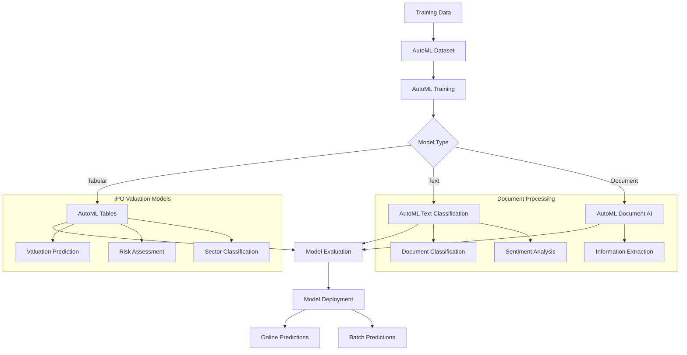

# Vertex AI AutoML Integration

## Overview

This guide covers implementing AutoML integration with Vertex AI for automated model development, specifically designed for IPO valuation and Australian financial document classification tasks.

## Architecture



## Implementation

### 1. AutoML Configuration

```python
# src/gcp/vertex_ai/automl_config.py

from google.cloud import aiplatform
from google.cloud.aiplatform import schema
from typing import Dict, List, Optional, Any, Union
import pandas as pd
import json
from datetime import datetime
from enum import Enum

class AutoMLModelType(Enum):
    """AutoML model types for IPO valuation platform."""
    TABULAR_REGRESSION = "tabular_regression"
    TABULAR_CLASSIFICATION = "tabular_classification"
    TEXT_CLASSIFICATION = "text_classification"
    TEXT_EXTRACTION = "text_extraction"
    FORECASTING = "forecasting"

class IPOAutoMLConfig:
    """Configuration for AutoML models in IPO valuation context."""
    
    def __init__(self, project_id: str, region: str = "australia-southeast1"):
        self.project_id = project_id
        self.region = region
        self.staging_bucket = f"gs://{project_id}-automl-staging"
        
        # Initialize Vertex AI
        aiplatform.init(
            project=project_id,
            location=region,
            staging_bucket=self.staging_bucket
        )
    
    def get_tabular_config(self, model_type: str = "regression") -> Dict[str, Any]:
        """Get AutoML tabular configuration for IPO valuation."""
        
        base_config = {
            "display_name": f"ipo-valuation-{model_type}",
            "optimization_prediction_type": model_type,
            "column_transformations": self._get_column_transformations(),
            "optimization_objective": self._get_optimization_objective(model_type),
            "train_budget_milli_node_hours": 4000,  # 4 hours
            "disable_early_stopping": False,
            "export_evaluated_data_items": True,
            "additional_experiments": [
                "enable_feature_selection",
                "enable_automatic_feature_engineering"
            ]
        }
        
        if model_type == "regression":
            base_config.update({
                "target_column": "final_ipo_valuation",
                "weight_column": None,
                "optimization_objective": "minimize-rmse"
            })
        elif model_type == "classification":
            base_config.update({
                "target_column": "valuation_category",
                "class_weight": "balanced",
                "optimization_objective": "maximize-au-roc"
            })
        
        return base_config
    
    def get_text_config(self, task_type: str = "classification") -> Dict[str, Any]:
        """Get AutoML text configuration for document processing."""
        
        return {
            "display_name": f"financial-doc-{task_type}",
            "prediction_type": f"text_{task_type}",
            "multi_label": False,
            "sentiment_max": 10,
            "text_extraction_schema": self._get_text_extraction_schema() if task_type == "extraction" else None,
            "train_budget_milli_node_hours": 2000,  # 2 hours
            "disable_early_stopping": False
        }
    
    def get_forecasting_config(self) -> Dict[str, Any]:
        """Get AutoML forecasting configuration for time series."""
        
        return {
            "display_name": "asx-market-forecasting",
            "optimization_objective": "minimize-rmse",
            "time_column": "date",
            "time_series_identifier_column": "asx_code",
            "target_column": "adjusted_close_price",
            "forecast_horizon": 30,  # 30 days
            "context_window": 90,   # 90 days
            "quantiles": [0.1, 0.5, 0.9],
            "train_budget_milli_node_hours": 6000,  # 6 hours
            "data_granularity_unit": "day",
            "data_granularity_count": 1,
            "holiday_regions": ["AU"],
            "transformations": [
                {
                    "auto": {
                        "column_name": "volume"
                    }
                },
                {
                    "numeric": {
                        "column_name": "market_cap",
                        "invalid_values_allowed": True
                    }
                }
            ]
        }
    
    def _get_column_transformations(self) -> List[Dict[str, Any]]:
        """Define column transformations for tabular data."""
        
        return [
            {
                "numeric": {
                    "column_name": "market_cap",
                    "invalid_values_allowed": True
                }
            },
            {
                "numeric": {
                    "column_name": "revenue",
                    "invalid_values_allowed": True
                }
            },
            {
                "numeric": {
                    "column_name": "net_profit", 
                    "invalid_values_allowed": True
                }
            },
            {
                "numeric": {
                    "column_name": "total_assets",
                    "invalid_values_allowed": True
                }
            },
            {
                "categorical": {
                    "column_name": "sector"
                }
            },
            {
                "categorical": {
                    "column_name": "listing_tier"
                }
            },
            {
                "numeric": {
                    "column_name": "price_to_book_ratio",
                    "invalid_values_allowed": True
                }
            },
            {
                "numeric": {
                    "column_name": "debt_to_equity_ratio",
                    "invalid_values_allowed": True
                }
            },
            {
                "categorical": {
                    "column_name": "underwriter_tier"
                }
            },
            {
                "numeric": {
                    "column_name": "market_volatility_30d",
                    "invalid_values_allowed": True
                }
            },
            {
                "timestamp": {
                    "column_name": "listing_date",
                    "time_format": "%Y-%m-%d"
                }
            }
        ]
    
    def _get_optimization_objective(self, model_type: str) -> str:
        """Get optimization objective based on model type."""
        
        objectives = {
            "regression": "minimize-rmse",
            "classification": "maximize-au-roc",
            "forecasting": "minimize-rmse"
        }
        
        return objectives.get(model_type, "minimize-rmse")
    
    def _get_text_extraction_schema(self) -> List[Dict[str, Any]]:
        """Define schema for text extraction tasks."""
        
        return [
            {
                "name": "company_name",
                "type": "text",
                "nullable": False
            },
            {
                "name": "ipo_price_range",
                "type": "text",
                "nullable": False
            },
            {
                "name": "shares_offered",
                "type": "number",
                "nullable": False
            },
            {
                "name": "listing_date",
                "type": "date",
                "nullable": False
            },
            {
                "name": "sector",
                "type": "text",
                "nullable": False
            },
            {
                "name": "use_of_proceeds",
                "type": "text",
                "nullable": True
            },
            {
                "name": "risk_factors",
                "type": "text",
                "nullable": True
            }
        ]

class AutoMLTrainingManager:
    """Manager for AutoML training operations."""
    
    def __init__(self, config: IPOAutoMLConfig):
        self.config = config
        self.project_id = config.project_id
        self.region = config.region
    
    def create_tabular_dataset(
        self,
        display_name: str,
        gcs_source: Union[str, List[str]],
        target_column: str
    ) -> aiplatform.TabularDataset:
        """Create tabular dataset for AutoML training."""
        
        if isinstance(gcs_source, str):
            gcs_source = [gcs_source]
        
        dataset = aiplatform.TabularDataset.create(
            display_name=display_name,
            gcs_source=gcs_source,
            sync=True
        )
        
        print(f"Created tabular dataset: {dataset.resource_name}")
        return dataset
    
    def create_text_dataset(
        self,
        display_name: str,
        gcs_source: Union[str, List[str]],
        import_schema: str = "text_classification"
    ) -> aiplatform.TextDataset:
        """Create text dataset for document classification."""
        
        if isinstance(gcs_source, str):
            gcs_source = [gcs_source]
        
        dataset = aiplatform.TextDataset.create(
            display_name=display_name,
            gcs_source=gcs_source,
            import_schema_uri=import_schema,
            sync=True
        )
        
        print(f"Created text dataset: {dataset.resource_name}")
        return dataset
    
    def train_tabular_model(
        self,
        dataset: aiplatform.TabularDataset,
        model_type: AutoMLModelType,
        target_column: str,
        training_fraction_split: float = 0.8,
        validation_fraction_split: float = 0.1,
        test_fraction_split: float = 0.1,
        budget_milli_node_hours: int = 4000
    ) -> aiplatform.AutoMLTabularTrainingJob:
        """Train AutoML tabular model for IPO valuation."""
        
        config = self.config.get_tabular_config(
            "regression" if model_type == AutoMLModelType.TABULAR_REGRESSION else "classification"
        )
        
        # Create training job
        job = aiplatform.AutoMLTabularTrainingJob(
            display_name=config["display_name"],
            optimization_prediction_type=config["optimization_prediction_type"],
            optimization_objective=config["optimization_objective"],
            column_transformations=config["column_transformations"],
            optimization_objective_recall_value=None,
            optimization_objective_precision_value=None
        )
        
        print(f"Starting AutoML tabular training: {job.display_name}")
        
        # Run training
        model = job.run(
            dataset=dataset,
            target_column=target_column,
            training_fraction_split=training_fraction_split,
            validation_fraction_split=validation_fraction_split,
            test_fraction_split=test_fraction_split,
            budget_milli_node_hours=budget_milli_node_hours,
            model_display_name=f"ipo-valuation-model-{datetime.now().strftime('%Y%m%d-%H%M')}",
            disable_early_stopping=False,
            export_evaluated_data_items=True,
            additional_experiments=config["additional_experiments"],
            sync=True
        )
        
        print(f"Training completed. Model: {model.resource_name}")
        return model
    
    def train_text_classification_model(
        self,
        dataset: aiplatform.TextDataset,
        budget_milli_node_hours: int = 2000
    ) -> aiplatform.AutoMLTextTrainingJob:
        """Train AutoML text classification model."""
        
        config = self.config.get_text_config("classification")
        
        # Create training job
        job = aiplatform.AutoMLTextTrainingJob(
            display_name=config["display_name"],
            prediction_type="classification",
            multi_label=config["multi_label"]
        )
        
        print(f"Starting AutoML text classification training: {job.display_name}")
        
        # Run training
        model = job.run(
            dataset=dataset,
            budget_milli_node_hours=budget_milli_node_hours,
            model_display_name=f"document-classifier-{datetime.now().strftime('%Y%m%d-%H%M')}",
            training_fraction_split=0.8,
            validation_fraction_split=0.1,
            test_fraction_split=0.1,
            sync=True
        )
        
        print(f"Text classification training completed. Model: {model.resource_name}")
        return model
    
    def train_forecasting_model(
        self,
        dataset: aiplatform.TimeSeriesDataset,
        time_column: str,
        time_series_identifier_column: str,
        target_column: str,
        forecast_horizon: int = 30,
        budget_milli_node_hours: int = 6000
    ) -> aiplatform.AutoMLForecastingTrainingJob:
        """Train AutoML forecasting model for market predictions."""
        
        config = self.config.get_forecasting_config()
        
        # Create training job
        job = aiplatform.AutoMLForecastingTrainingJob(
            display_name=config["display_name"],
            optimization_objective=config["optimization_objective"]
        )
        
        print(f"Starting AutoML forecasting training: {job.display_name}")
        
        # Run training
        model = job.run(
            dataset=dataset,
            target_column=target_column,
            time_column=time_column,
            time_series_identifier_column=time_series_identifier_column,
            time_series_attribute_columns=[],
            forecast_horizon=forecast_horizon,
            context_window=config["context_window"],
            data_granularity_unit=config["data_granularity_unit"],
            data_granularity_count=config["data_granularity_count"],
            budget_milli_node_hours=budget_milli_node_hours,
            model_display_name=f"market-forecasting-{datetime.now().strftime('%Y%m%d-%H%M')}",
            quantiles=config["quantiles"],
            validation_options="auto",
            additional_experiments=[
                "enable_probabilistic_inference"
            ],
            sync=True
        )
        
        print(f"Forecasting training completed. Model: {model.resource_name}")
        return model
    
    def evaluate_model(
        self,
        model: aiplatform.Model,
        evaluation_name: Optional[str] = None
    ) -> Dict[str, Any]:
        """Evaluate trained AutoML model."""
        
        evaluations = model.list_model_evaluations()
        
        if not evaluations:
            print("No evaluations found for model")
            return {}
        
        # Get the latest evaluation
        latest_evaluation = evaluations[0]
        
        evaluation_metrics = {
            "model_name": model.display_name,
            "evaluation_id": latest_evaluation.name,
            "metrics": {}
        }
        
        # Extract metrics based on model type
        if hasattr(latest_evaluation, 'metrics'):
            metrics = latest_evaluation.metrics
            
            # Common metrics
            if 'rootMeanSquaredError' in metrics:
                evaluation_metrics["metrics"]["rmse"] = metrics['rootMeanSquaredError']
            
            if 'meanAbsoluteError' in metrics:
                evaluation_metrics["metrics"]["mae"] = metrics['meanAbsoluteError']
            
            if 'rSquared' in metrics:
                evaluation_metrics["metrics"]["r_squared"] = metrics['rSquared']
            
            if 'auRoc' in metrics:
                evaluation_metrics["metrics"]["auc_roc"] = metrics['auRoc']
            
            if 'auPrc' in metrics:
                evaluation_metrics["metrics"]["auc_prc"] = metrics['auPrc']
            
            if 'logLoss' in metrics:
                evaluation_metrics["metrics"]["log_loss"] = metrics['logLoss']
        
        return evaluation_metrics
    
    def deploy_model(
        self,
        model: aiplatform.Model,
        endpoint_display_name: Optional[str] = None,
        machine_type: str = "n1-standard-4",
        min_replica_count: int = 1,
        max_replica_count: int = 3,
        accelerator_type: Optional[str] = None,
        accelerator_count: Optional[int] = None
    ) -> aiplatform.Endpoint:
        """Deploy AutoML model to endpoint."""
        
        if not endpoint_display_name:
            endpoint_display_name = f"{model.display_name}-endpoint"
        
        # Create endpoint
        endpoint = aiplatform.Endpoint.create(
            display_name=endpoint_display_name,
            sync=True
        )
        
        print(f"Created endpoint: {endpoint.resource_name}")
        
        # Deploy model to endpoint
        endpoint.deploy(
            model=model,
            deployed_model_display_name=f"{model.display_name}-deployment",
            machine_type=machine_type,
            min_replica_count=min_replica_count,
            max_replica_count=max_replica_count,
            accelerator_type=accelerator_type,
            accelerator_count=accelerator_count,
            traffic_percentage=100,
            sync=True
        )
        
        print(f"Model deployed to endpoint: {endpoint.resource_name}")
        return endpoint
```

### 2. Data Preparation for AutoML

```python
# src/gcp/vertex_ai/automl_data_prep.py

import pandas as pd
import numpy as np
from google.cloud import bigquery
from google.cloud import storage
from typing import Dict, List, Tuple, Optional
import json
import csv
from io import StringIO
from datetime import datetime, timedelta

class AutoMLDataPreparator:
    """Data preparation utilities for AutoML training."""
    
    def __init__(self, project_id: str):
        self.project_id = project_id
        self.bq_client = bigquery.Client(project=project_id)
        self.storage_client = storage.Client(project=project_id)
    
    def prepare_tabular_data(
        self,
        source_table: str,
        target_column: str,
        output_gcs_path: str,
        validation_split: float = 0.2
    ) -> Tuple[str, str]:
        """Prepare tabular data for AutoML training."""
        
        # Query to get IPO valuation data
        query = f"""
        WITH ipo_features AS (
            SELECT
                company_name,
                asx_code,
                sector,
                listing_tier,
                market_cap,
                revenue,
                net_profit,
                total_assets,
                shareholders_equity,
                total_debt,
                price_to_book_ratio,
                debt_to_equity_ratio,
                return_on_equity,
                underwriter_tier,
                listing_date,
                market_volatility_30d,
                sector_performance_90d,
                ipo_price_min,
                ipo_price_max,
                shares_offered,
                final_ipo_valuation,
                -- Create categorical target for classification
                CASE 
                    WHEN final_ipo_valuation < 50000000 THEN 'Small'
                    WHEN final_ipo_valuation < 200000000 THEN 'Medium' 
                    WHEN final_ipo_valuation < 1000000000 THEN 'Large'
                    ELSE 'Mega'
                END as valuation_category
            FROM `{source_table}`
            WHERE final_ipo_valuation IS NOT NULL
            AND listing_date >= '2015-01-01'
            AND market_cap IS NOT NULL
            AND revenue IS NOT NULL
        )
        SELECT *
        FROM ipo_features
        ORDER BY listing_date DESC
        """
        
        # Execute query and get DataFrame
        df = self.bq_client.query(query).to_dataframe()
        
        # Feature engineering
        df = self._engineer_features(df)
        
        # Handle missing values
        df = self._handle_missing_values(df)
        
        # Split data
        train_df, val_df = self._split_data(df, validation_split)
        
        # Add ML_USE column for AutoML
        train_df['ml_use'] = 'training'
        val_df['ml_use'] = 'validation'
        
        # Combine datasets
        full_df = pd.concat([train_df, val_df], ignore_index=True)
        
        # Save to GCS
        output_path = self._save_to_gcs(full_df, output_gcs_path)
        
        return output_path, f"Dataset prepared with {len(full_df)} samples"
    
    def prepare_text_classification_data(
        self,
        documents_table: str,
        labels_table: str,
        output_gcs_path: str
    ) -> str:
        """Prepare text data for document classification."""
        
        query = f"""
        WITH document_labels AS (
            SELECT 
                d.document_id,
                d.document_text,
                d.document_type,
                l.label,
                l.confidence
            FROM `{documents_table}` d
            JOIN `{labels_table}` l ON d.document_id = l.document_id
            WHERE l.confidence > 0.8
            AND LENGTH(d.document_text) > 100
        )
        SELECT 
            document_text as text_content,
            label as classification_label
        FROM document_labels
        """
        
        df = self.bq_client.query(query).to_dataframe()
        
        # Format for AutoML text classification
        # AutoML expects: text_content, classification_label, ml_use
        
        # Split data
        train_size = int(0.8 * len(df))
        val_size = int(0.1 * len(df))
        
        df['ml_use'] = 'training'
        df.iloc[train_size:train_size+val_size, df.columns.get_loc('ml_use')] = 'validation'
        df.iloc[train_size+val_size:, df.columns.get_loc('ml_use')] = 'test'
        
        # Save to GCS in JSONL format for text classification
        return self._save_text_data_to_gcs(df, output_gcs_path)
    
    def prepare_forecasting_data(
        self,
        time_series_table: str,
        output_gcs_path: str,
        forecast_horizon: int = 30
    ) -> str:
        """Prepare time series data for forecasting."""
        
        query = f"""
        WITH daily_prices AS (
            SELECT
                date,
                asx_code,
                adjusted_close_price,
                volume,
                market_cap,
                sector,
                -- Technical indicators
                AVG(adjusted_close_price) OVER (
                    PARTITION BY asx_code 
                    ORDER BY date 
                    ROWS BETWEEN 19 PRECEDING AND CURRENT ROW
                ) as sma_20,
                AVG(adjusted_close_price) OVER (
                    PARTITION BY asx_code 
                    ORDER BY date 
                    ROWS BETWEEN 49 PRECEDING AND CURRENT ROW
                ) as sma_50,
                STDDEV(adjusted_close_price) OVER (
                    PARTITION BY asx_code 
                    ORDER BY date 
                    ROWS BETWEEN 19 PRECEDING AND CURRENT ROW
                ) as volatility_20d
            FROM `{time_series_table}`
            WHERE date >= '2020-01-01'
            AND adjusted_close_price IS NOT NULL
        )
        SELECT *
        FROM daily_prices
        WHERE sma_20 IS NOT NULL
        ORDER BY asx_code, date
        """
        
        df = self.bq_client.query(query).to_dataframe()
        
        # Ensure proper date format
        df['date'] = pd.to_datetime(df['date'])
        
        # Create additional features
        df['day_of_week'] = df['date'].dt.dayofweek
        df['month'] = df['date'].dt.month
        df['quarter'] = df['date'].dt.quarter
        
        # Calculate returns
        df['price_return'] = df.groupby('asx_code')['adjusted_close_price'].pct_change()
        
        # Save to GCS
        return self._save_to_gcs(df, output_gcs_path)
    
    def _engineer_features(self, df: pd.DataFrame) -> pd.DataFrame:
        """Engineer additional features for IPO valuation."""
        
        # Financial ratios
        df['revenue_per_share'] = df['revenue'] / df['shares_offered']
        df['asset_turnover'] = df['revenue'] / df['total_assets']
        df['profit_margin'] = df['net_profit'] / df['revenue']
        df['equity_ratio'] = df['shareholders_equity'] / df['total_assets']
        
        # Market timing features  
        df['listing_year'] = pd.to_datetime(df['listing_date']).dt.year
        df['listing_month'] = pd.to_datetime(df['listing_date']).dt.month
        df['listing_quarter'] = pd.to_datetime(df['listing_date']).dt.quarter
        
        # IPO characteristics
        df['price_range_width'] = df['ipo_price_max'] - df['ipo_price_min']
        df['price_range_midpoint'] = (df['ipo_price_max'] + df['ipo_price_min']) / 2
        df['total_offering_value'] = df['shares_offered'] * df['price_range_midpoint']
        
        # Sector encoding (one-hot)
        sector_dummies = pd.get_dummies(df['sector'], prefix='sector')
        df = pd.concat([df, sector_dummies], axis=1)
        
        # Underwriter tier encoding
        underwriter_mapping = {
            'Tier 1': 3,
            'Tier 2': 2, 
            'Tier 3': 1,
            'Other': 0
        }
        df['underwriter_tier_numeric'] = df['underwriter_tier'].map(underwriter_mapping).fillna(0)
        
        return df
    
    def _handle_missing_values(self, df: pd.DataFrame) -> pd.DataFrame:
        """Handle missing values in dataset."""
        
        # Numeric columns - fill with median
        numeric_columns = df.select_dtypes(include=[np.number]).columns
        for col in numeric_columns:
            df[col].fillna(df[col].median(), inplace=True)
        
        # Categorical columns - fill with mode
        categorical_columns = df.select_dtypes(include=['object']).columns
        for col in categorical_columns:
            if col not in ['company_name', 'asx_code']:  # Keep these as-is
                df[col].fillna(df[col].mode()[0] if not df[col].mode().empty else 'Unknown', inplace=True)
        
        return df
    
    def _split_data(
        self,
        df: pd.DataFrame,
        validation_split: float
    ) -> Tuple[pd.DataFrame, pd.DataFrame]:
        """Split data into training and validation sets."""
        
        # Sort by listing date to ensure temporal split
        df_sorted = df.sort_values('listing_date')
        
        split_idx = int(len(df_sorted) * (1 - validation_split))
        
        train_df = df_sorted.iloc[:split_idx].copy()
        val_df = df_sorted.iloc[split_idx:].copy()
        
        return train_df, val_df
    
    def _save_to_gcs(self, df: pd.DataFrame, gcs_path: str) -> str:
        """Save DataFrame to Google Cloud Storage as CSV."""
        
        # Convert to CSV
        csv_buffer = StringIO()
        df.to_csv(csv_buffer, index=False)
        csv_content = csv_buffer.getvalue()
        
        # Parse GCS path
        bucket_name = gcs_path.replace('gs://', '').split('/')[0]
        blob_name = '/'.join(gcs_path.replace('gs://', '').split('/')[1:])
        
        # Upload to GCS
        bucket = self.storage_client.bucket(bucket_name)
        blob = bucket.blob(blob_name)
        blob.upload_from_string(csv_content, content_type='text/csv')
        
        print(f"Data saved to {gcs_path}")
        print(f"Dataset shape: {df.shape}")
        
        return gcs_path
    
    def _save_text_data_to_gcs(self, df: pd.DataFrame, gcs_path: str) -> str:
        """Save text data to GCS in JSONL format."""
        
        # Convert to JSONL format
        jsonl_lines = []
        for _, row in df.iterrows():
            line = {
                "text_content": row['text_content'],
                "classification_label": row['classification_label'],
                "ml_use": row['ml_use']
            }
            jsonl_lines.append(json.dumps(line))
        
        jsonl_content = '\n'.join(jsonl_lines)
        
        # Parse GCS path  
        bucket_name = gcs_path.replace('gs://', '').split('/')[0]
        blob_name = '/'.join(gcs_path.replace('gs://', '').split('/')[1:])
        
        # Upload to GCS
        bucket = self.storage_client.bucket(bucket_name)
        blob = bucket.blob(blob_name)
        blob.upload_from_string(jsonl_content, content_type='application/jsonl')
        
        print(f"Text data saved to {gcs_path}")
        print(f"Dataset samples: {len(df)}")
        
        return gcs_path
    
    def validate_automl_data(self, gcs_path: str, data_type: str = "tabular") -> Dict[str, Any]:
        """Validate data format for AutoML."""
        
        validation_results = {
            "valid": True,
            "errors": [],
            "warnings": [],
            "statistics": {}
        }
        
        try:
            # Read data from GCS
            bucket_name = gcs_path.replace('gs://', '').split('/')[0]
            blob_name = '/'.join(gcs_path.replace('gs://', '').split('/')[1:])
            
            bucket = self.storage_client.bucket(bucket_name)
            blob = bucket.blob(blob_name)
            
            if data_type == "tabular":
                content = blob.download_as_text()
                df = pd.read_csv(StringIO(content))
                
                # Validate tabular data
                validation_results["statistics"] = {
                    "total_samples": len(df),
                    "feature_count": len(df.columns) - 1,  # Exclude target
                    "missing_values": df.isnull().sum().sum(),
                    "duplicate_rows": df.duplicated().sum()
                }
                
                # Check for required columns
                if 'ml_use' not in df.columns:
                    validation_results["errors"].append("Missing 'ml_use' column")
                    validation_results["valid"] = False
                
                # Check data distribution
                ml_use_counts = df['ml_use'].value_counts()
                if ml_use_counts.get('training', 0) < 100:
                    validation_results["warnings"].append("Training set may be too small")
                
            elif data_type == "text":
                content = blob.download_as_text()
                lines = content.strip().split('\n')
                
                validation_results["statistics"] = {
                    "total_samples": len(lines)
                }
                
                # Validate JSONL format
                for i, line in enumerate(lines[:10]):  # Check first 10 lines
                    try:
                        json.loads(line)
                    except json.JSONDecodeError:
                        validation_results["errors"].append(f"Invalid JSON on line {i+1}")
                        validation_results["valid"] = False
                        break
        
        except Exception as e:
            validation_results["valid"] = False
            validation_results["errors"].append(f"Failed to read data: {str(e)}")
        
        return validation_results

class AutoMLPipelineOrchestrator:
    """Orchestrator for complete AutoML pipelines."""
    
    def __init__(self, project_id: str, region: str = "australia-southeast1"):
        self.config = IPOAutoMLConfig(project_id, region)
        self.training_manager = AutoMLTrainingManager(self.config)
        self.data_prep = AutoMLDataPreparator(project_id)
    
    def run_complete_tabular_pipeline(
        self,
        source_table: str,
        target_column: str,
        model_type: AutoMLModelType,
        dataset_name: str,
        budget_hours: int = 4
    ) -> Dict[str, Any]:
        """Run complete AutoML tabular pipeline."""
        
        results = {
            "pipeline_start": datetime.now().isoformat(),
            "steps": {},
            "model": None,
            "evaluation": None,
            "endpoint": None
        }
        
        try:
            # Step 1: Data preparation
            print("Step 1: Preparing data...")
            gcs_path = f"gs://{self.config.project_id}-automl-data/{dataset_name}.csv"
            
            data_path, data_info = self.data_prep.prepare_tabular_data(
                source_table,
                target_column, 
                gcs_path
            )
            
            results["steps"]["data_preparation"] = {
                "status": "completed",
                "data_path": data_path,
                "info": data_info
            }
            
            # Step 2: Create dataset
            print("Step 2: Creating AutoML dataset...")
            dataset = self.training_manager.create_tabular_dataset(
                dataset_name,
                data_path,
                target_column
            )
            
            results["steps"]["dataset_creation"] = {
                "status": "completed", 
                "dataset_id": dataset.resource_name
            }
            
            # Step 3: Train model
            print("Step 3: Training AutoML model...")
            model = self.training_manager.train_tabular_model(
                dataset,
                model_type,
                target_column,
                budget_milli_node_hours=budget_hours * 1000
            )
            
            results["model"] = model.resource_name
            results["steps"]["model_training"] = {
                "status": "completed",
                "model_id": model.resource_name
            }
            
            # Step 4: Evaluate model
            print("Step 4: Evaluating model...")
            evaluation = self.training_manager.evaluate_model(model)
            
            results["evaluation"] = evaluation
            results["steps"]["model_evaluation"] = {
                "status": "completed",
                "metrics": evaluation.get("metrics", {})
            }
            
            # Step 5: Deploy model (optional)
            if evaluation.get("metrics", {}).get("rmse", 1.0) < 0.5:  # Good enough to deploy
                print("Step 5: Deploying model...")
                endpoint = self.training_manager.deploy_model(model)
                
                results["endpoint"] = endpoint.resource_name
                results["steps"]["model_deployment"] = {
                    "status": "completed",
                    "endpoint_id": endpoint.resource_name
                }
            else:
                results["steps"]["model_deployment"] = {
                    "status": "skipped",
                    "reason": "Model performance not sufficient for deployment"
                }
            
            results["pipeline_status"] = "completed"
            results["pipeline_end"] = datetime.now().isoformat()
            
        except Exception as e:
            results["pipeline_status"] = "failed"
            results["error"] = str(e)
            results["pipeline_end"] = datetime.now().isoformat()
        
        return results
    
    def run_text_classification_pipeline(
        self,
        documents_table: str,
        labels_table: str,
        dataset_name: str,
        budget_hours: int = 2
    ) -> Dict[str, Any]:
        """Run complete text classification pipeline."""
        
        results = {
            "pipeline_start": datetime.now().isoformat(),
            "steps": {},
            "model": None,
            "evaluation": None,
            "endpoint": None
        }
        
        try:
            # Step 1: Data preparation
            print("Step 1: Preparing text data...")
            gcs_path = f"gs://{self.config.project_id}-automl-data/{dataset_name}.jsonl"
            
            data_path = self.data_prep.prepare_text_classification_data(
                documents_table,
                labels_table,
                gcs_path
            )
            
            results["steps"]["data_preparation"] = {
                "status": "completed",
                "data_path": data_path
            }
            
            # Step 2: Create dataset
            print("Step 2: Creating text dataset...")
            dataset = self.training_manager.create_text_dataset(
                dataset_name,
                data_path
            )
            
            results["steps"]["dataset_creation"] = {
                "status": "completed",
                "dataset_id": dataset.resource_name
            }
            
            # Step 3: Train model
            print("Step 3: Training text classification model...")
            model = self.training_manager.train_text_classification_model(
                dataset,
                budget_hours * 1000
            )
            
            results["model"] = model.resource_name
            results["steps"]["model_training"] = {
                "status": "completed",
                "model_id": model.resource_name
            }
            
            # Step 4: Evaluate and deploy
            evaluation = self.training_manager.evaluate_model(model)
            results["evaluation"] = evaluation
            
            # Auto-deploy if performance is good
            if evaluation.get("metrics", {}).get("auc_roc", 0) > 0.85:
                endpoint = self.training_manager.deploy_model(model)
                results["endpoint"] = endpoint.resource_name
            
            results["pipeline_status"] = "completed"
            results["pipeline_end"] = datetime.now().isoformat()
            
        except Exception as e:
            results["pipeline_status"] = "failed"
            results["error"] = str(e)
            results["pipeline_end"] = datetime.now().isoformat()
        
        return results
```

### 3. AutoML Model Management

```python
# src/gcp/vertex_ai/automl_management.py

from google.cloud import aiplatform
from typing import Dict, List, Optional, Any
import json
from datetime import datetime
import pandas as pd

class AutoMLModelManager:
    """Manager for AutoML model lifecycle operations."""
    
    def __init__(self, project_id: str, region: str = "australia-southeast1"):
        self.project_id = project_id
        self.region = region
        
        aiplatform.init(project=project_id, location=region)
    
    def list_models(self, filter_string: Optional[str] = None) -> List[Dict[str, Any]]:
        """List all AutoML models."""
        
        models = aiplatform.Model.list(filter=filter_string)
        
        model_list = []
        for model in models:
            model_info = {
                "resource_name": model.resource_name,
                "display_name": model.display_name,
                "model_type": self._get_model_type(model),
                "create_time": model.create_time,
                "update_time": model.update_time,
                "labels": model.labels,
                "deployment_count": len(model.deployed_models) if hasattr(model, 'deployed_models') else 0
            }
            model_list.append(model_info)
        
        return model_list
    
    def get_model_details(self, model_name: str) -> Dict[str, Any]:
        """Get detailed information about a specific model."""
        
        model = aiplatform.Model(model_name)
        
        # Get evaluations
        evaluations = model.list_model_evaluations()
        
        # Get deployed endpoints
        endpoints = []
        try:
            for endpoint in aiplatform.Endpoint.list():
                for deployed_model in endpoint.list_models():
                    if deployed_model.model == model.resource_name:
                        endpoints.append({
                            "endpoint_name": endpoint.resource_name,
                            "endpoint_display_name": endpoint.display_name,
                            "traffic_percentage": deployed_model.traffic_percentage,
                            "machine_type": deployed_model.machine_type,
                            "min_replica_count": deployed_model.min_replica_count,
                            "max_replica_count": deployed_model.max_replica_count
                        })
        except:
            pass  # Handle cases where endpoints can't be accessed
        
        model_details = {
            "basic_info": {
                "resource_name": model.resource_name,
                "display_name": model.display_name,
                "description": model.description,
                "create_time": model.create_time,
                "update_time": model.update_time,
                "labels": model.labels,
                "encryption_spec": model.encryption_spec
            },
            "evaluations": [],
            "deployments": endpoints,
            "metadata": self._extract_model_metadata(model)
        }
        
        # Process evaluations
        for eval_obj in evaluations:
            eval_info = {
                "evaluation_name": eval_obj.name,
                "metrics": eval_obj.metrics if hasattr(eval_obj, 'metrics') else {}
            }
            model_details["evaluations"].append(eval_info)
        
        return model_details
    
    def compare_models(self, model_names: List[str]) -> pd.DataFrame:
        """Compare multiple AutoML models."""
        
        comparison_data = []
        
        for model_name in model_names:
            try:
                model = aiplatform.Model(model_name)
                evaluations = model.list_model_evaluations()
                
                row_data = {
                    "model_name": model.display_name,
                    "resource_name": model_name,
                    "create_time": model.create_time,
                    "model_type": self._get_model_type(model)
                }
                
                # Add evaluation metrics
                if evaluations:
                    metrics = evaluations[0].metrics if hasattr(evaluations[0], 'metrics') else {}
                    
                    # Common metrics
                    row_data["rmse"] = metrics.get("rootMeanSquaredError", None)
                    row_data["mae"] = metrics.get("meanAbsoluteError", None)
                    row_data["r_squared"] = metrics.get("rSquared", None)
                    row_data["auc_roc"] = metrics.get("auRoc", None)
                    row_data["auc_prc"] = metrics.get("auPrc", None)
                    row_data["log_loss"] = metrics.get("logLoss", None)
                    row_data["accuracy"] = metrics.get("accuracy", None)
                
                comparison_data.append(row_data)
                
            except Exception as e:
                print(f"Error processing model {model_name}: {e}")
        
        return pd.DataFrame(comparison_data)
    
    def batch_predict(
        self,
        model_name: str,
        input_gcs_uri: str,
        output_gcs_uri: str,
        machine_type: str = "n1-standard-4",
        accelerator_type: Optional[str] = None,
        accelerator_count: Optional[int] = None
    ) -> aiplatform.BatchPredictionJob:
        """Run batch prediction using AutoML model."""
        
        model = aiplatform.Model(model_name)
        
        # Create batch prediction job
        batch_job = model.batch_predict(
            job_display_name=f"batch-prediction-{datetime.now().strftime('%Y%m%d-%H%M')}",
            gcs_source=input_gcs_uri,
            gcs_destination_prefix=output_gcs_uri,
            machine_type=machine_type,
            accelerator_type=accelerator_type,
            accelerator_count=accelerator_count,
            sync=False
        )
        
        print(f"Batch prediction job started: {batch_job.resource_name}")
        
        return batch_job
    
    def online_predict(
        self,
        endpoint_name: str,
        instances: List[Dict[str, Any]]
    ) -> List[Dict[str, Any]]:
        """Get online predictions from deployed AutoML model."""
        
        endpoint = aiplatform.Endpoint(endpoint_name)
        
        predictions = endpoint.predict(instances=instances)
        
        return predictions.predictions
    
    def explain_prediction(
        self,
        endpoint_name: str,
        instances: List[Dict[str, Any]]
    ) -> List[Dict[str, Any]]:
        """Get prediction explanations from AutoML model."""
        
        endpoint = aiplatform.Endpoint(endpoint_name)
        
        try:
            explanations = endpoint.explain(instances=instances)
            return explanations.explanations
        except Exception as e:
            print(f"Explanation not available: {e}")
            return []
    
    def monitor_model_performance(
        self,
        model_name: str,
        baseline_dataset_uri: str,
        target_dataset_uri: str
    ) -> Dict[str, Any]:
        """Monitor model performance drift."""
        
        # This would integrate with Vertex AI Model Monitoring
        # For now, return a placeholder structure
        
        monitoring_results = {
            "model_name": model_name,
            "monitoring_time": datetime.now().isoformat(),
            "drift_detection": {
                "feature_drift": {},
                "prediction_drift": {},
                "data_quality": {}
            },
            "alerts": []
        }
        
        return monitoring_results
    
    def update_model_metadata(
        self,
        model_name: str,
        labels: Optional[Dict[str, str]] = None,
        description: Optional[str] = None
    ) -> aiplatform.Model:
        """Update model metadata."""
        
        model = aiplatform.Model(model_name)
        
        update_mask = []
        
        if labels:
            model._gca_resource.labels = labels
            update_mask.append("labels")
        
        if description:
            model._gca_resource.description = description
            update_mask.append("description")
        
        if update_mask:
            model = model.update(update_mask)
        
        return model
    
    def archive_model(self, model_name: str) -> None:
        """Archive an AutoML model."""
        
        model = aiplatform.Model(model_name)
        
        # Add archive label
        current_labels = model.labels or {}
        current_labels["status"] = "archived"
        current_labels["archived_date"] = datetime.now().strftime("%Y-%m-%d")
        
        model.update_labels(current_labels)
        
        print(f"Model {model_name} archived successfully")
    
    def delete_model(self, model_name: str, force: bool = False) -> None:
        """Delete an AutoML model."""
        
        model = aiplatform.Model(model_name)
        
        # Check if model is deployed
        endpoints = []
        try:
            for endpoint in aiplatform.Endpoint.list():
                for deployed_model in endpoint.list_models():
                    if deployed_model.model == model.resource_name:
                        endpoints.append(endpoint.resource_name)
        except:
            pass
        
        if endpoints and not force:
            raise ValueError(f"Model is deployed to endpoints: {endpoints}. Use force=True to delete anyway.")
        
        # Undeploy from endpoints if force=True
        if endpoints and force:
            for endpoint_name in endpoints:
                endpoint = aiplatform.Endpoint(endpoint_name)
                endpoint.undeploy_all()
        
        # Delete model
        model.delete(sync=True)
        
        print(f"Model {model_name} deleted successfully")
    
    def _get_model_type(self, model: aiplatform.Model) -> str:
        """Determine model type from model object."""
        
        # This is a simplified version - in practice, you'd examine model metadata
        if hasattr(model, 'supported_deployment_resources_types'):
            return "automl_tabular"
        else:
            return "unknown"
    
    def _extract_model_metadata(self, model: aiplatform.Model) -> Dict[str, Any]:
        """Extract useful metadata from model object."""
        
        metadata = {}
        
        try:
            # Training metadata
            if hasattr(model, 'training_pipeline'):
                metadata["training_pipeline"] = model.training_pipeline
            
            # Model artifacts
            if hasattr(model, 'artifact_uri'):
                metadata["artifact_uri"] = model.artifact_uri
            
            # Container specs
            if hasattr(model, 'container_spec'):
                metadata["container_spec"] = {
                    "image_uri": model.container_spec.image_uri if hasattr(model.container_spec, 'image_uri') else None,
                    "command": model.container_spec.command if hasattr(model.container_spec, 'command') else None,
                    "args": model.container_spec.args if hasattr(model.container_spec, 'args') else None
                }
        
        except Exception as e:
            metadata["extraction_error"] = str(e)
        
        return metadata

class AutoMLMonitoring:
    """Monitoring utilities for AutoML models."""
    
    def __init__(self, project_id: str, region: str = "australia-southeast1"):
        self.project_id = project_id
        self.region = region
    
    def create_performance_dashboard(self, model_names: List[str]) -> Dict[str, Any]:
        """Create performance monitoring dashboard data."""
        
        manager = AutoMLModelManager(self.project_id, self.region)
        
        dashboard_data = {
            "created_at": datetime.now().isoformat(),
            "models": [],
            "summary_stats": {}
        }
        
        all_metrics = []
        
        for model_name in model_names:
            try:
                model_details = manager.get_model_details(model_name)
                
                model_summary = {
                    "name": model_details["basic_info"]["display_name"],
                    "resource_name": model_name,
                    "create_time": model_details["basic_info"]["create_time"],
                    "evaluation_metrics": {},
                    "deployment_status": "deployed" if model_details["deployments"] else "not_deployed",
                    "deployment_count": len(model_details["deployments"])
                }
                
                # Extract metrics
                if model_details["evaluations"]:
                    metrics = model_details["evaluations"][0]["metrics"]
                    model_summary["evaluation_metrics"] = metrics
                    all_metrics.append(metrics)
                
                dashboard_data["models"].append(model_summary)
                
            except Exception as e:
                print(f"Error processing model {model_name}: {e}")
        
        # Calculate summary statistics
        if all_metrics:
            dashboard_data["summary_stats"] = self._calculate_summary_stats(all_metrics)
        
        return dashboard_data
    
    def _calculate_summary_stats(self, metrics_list: List[Dict[str, Any]]) -> Dict[str, Any]:
        """Calculate summary statistics across models."""
        
        stats = {}
        
        # Collect all metric values
        metric_values = {}
        for metrics in metrics_list:
            for metric_name, value in metrics.items():
                if isinstance(value, (int, float)):
                    if metric_name not in metric_values:
                        metric_values[metric_name] = []
                    metric_values[metric_name].append(value)
        
        # Calculate statistics
        for metric_name, values in metric_values.items():
            if values:
                stats[metric_name] = {
                    "min": min(values),
                    "max": max(values),
                    "mean": sum(values) / len(values),
                    "count": len(values)
                }
        
        return stats
```

### 4. Usage Example

```python
# examples/automl_complete_example.py

from src.gcp.vertex_ai.automl_config import AutoMLModelType
from src.gcp.vertex_ai.automl_data_prep import AutoMLPipelineOrchestrator
from src.gcp.vertex_ai.automl_management import AutoMLModelManager, AutoMLMonitoring

async def main():
    """Complete AutoML workflow example."""
    
    project_id = "your-gcp-project-id"
    
    # Initialize orchestrator
    orchestrator = AutoMLPipelineOrchestrator(project_id)
    model_manager = AutoMLModelManager(project_id)
    
    # Run IPO valuation regression pipeline
    print("Running IPO valuation regression pipeline...")
    regression_results = orchestrator.run_complete_tabular_pipeline(
        source_table=f"{project_id}.ipo_data.historical_ipos",
        target_column="final_ipo_valuation",
        model_type=AutoMLModelType.TABULAR_REGRESSION,
        dataset_name="ipo-valuation-regression",
        budget_hours=4
    )
    
    print("Regression Pipeline Results:", regression_results)
    
    # Run document classification pipeline
    print("Running document classification pipeline...")
    text_results = orchestrator.run_text_classification_pipeline(
        documents_table=f"{project_id}.documents.financial_docs",
        labels_table=f"{project_id}.documents.doc_labels",
        dataset_name="financial-doc-classification",
        budget_hours=2
    )
    
    print("Text Classification Results:", text_results)
    
    # Model management examples
    print("Listing all models...")
    models = model_manager.list_models()
    print(f"Found {len(models)} models")
    
    if regression_results.get("model"):
        model_name = regression_results["model"]
        
        # Get detailed model information
        print(f"Getting details for model: {model_name}")
        model_details = model_manager.get_model_details(model_name)
        print("Model Evaluation Metrics:", model_details.get("evaluations", []))
        
        # Online prediction example
        if regression_results.get("endpoint"):
            endpoint_name = regression_results["endpoint"]
            
            # Sample prediction data
            sample_instances = [{
                "market_cap": 150000000,
                "revenue": 50000000,
                "net_profit": 8000000,
                "total_assets": 120000000,
                "sector": "Technology",
                "listing_tier": "ASX 300",
                "price_to_book_ratio": 2.5,
                "debt_to_equity_ratio": 0.3,
                "underwriter_tier": "Tier 1",
                "market_volatility_30d": 0.15
            }]
            
            predictions = model_manager.online_predict(endpoint_name, sample_instances)
            print("Prediction Results:", predictions)
            
            # Get explanations
            explanations = model_manager.explain_prediction(endpoint_name, sample_instances)
            print("Prediction Explanations:", explanations)
        
        # Batch prediction example
        batch_job = model_manager.batch_predict(
            model_name=model_name,
            input_gcs_uri="gs://your-bucket/batch-input/",
            output_gcs_uri="gs://your-bucket/batch-output/"
        )
        
        print(f"Batch prediction job: {batch_job.resource_name}")
    
    # Model comparison
    model_names = [model["resource_name"] for model in models[:3]]  # Compare first 3 models
    if model_names:
        comparison_df = model_manager.compare_models(model_names)
        print("Model Comparison:")
        print(comparison_df)
    
    # Performance monitoring
    monitoring = AutoMLMonitoring(project_id)
    dashboard = monitoring.create_performance_dashboard(model_names)
    print("Performance Dashboard:", dashboard)

if __name__ == "__main__":
    import asyncio
    asyncio.run(main())
```

## Best Practices

### AutoML Optimization
1. **Data Quality**: Ensure high-quality, representative training data
2. **Feature Engineering**: Let AutoML handle feature engineering, but provide clean base features
3. **Budget Allocation**: Start with smaller budgets for experimentation
4. **Model Evaluation**: Always evaluate models thoroughly before deployment

### Cost Management
- Use appropriate training budgets for each task complexity
- Monitor training costs and set budget alerts
- Archive or delete unused models regularly
- Use batch predictions for large-scale inference

### Performance Monitoring
- Set up automated model monitoring
- Track prediction drift over time
- Implement A/B testing for model updates
- Monitor business metrics alongside technical metrics

### Production Deployment
- Test models thoroughly before production deployment
- Implement gradual rollout strategies
- Set up proper logging and monitoring
- Plan for model updates and retraining

This AutoML implementation provides a comprehensive foundation for automated machine learning workflows specifically optimized for IPO valuation and Australian financial document processing use cases.