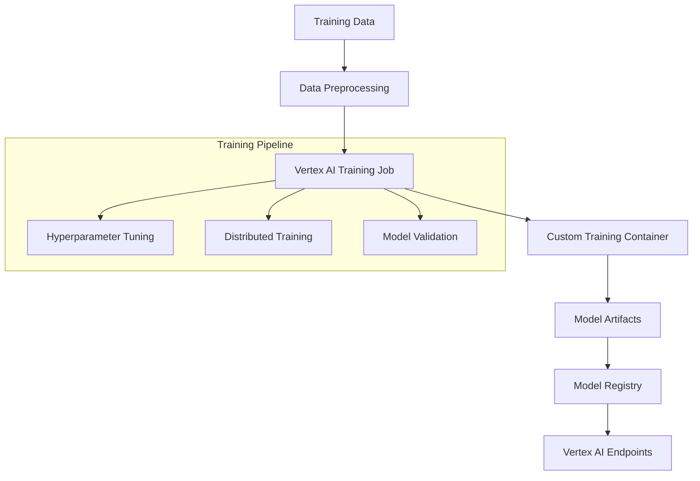

# Vertex AI Custom Model Training

## Overview

This guide covers implementing custom model training with Vertex AI Training Service for IPO valuation models, specifically designed for Australian Securities Exchange (ASX) data and financial patterns.

## Architecture



## Implementation

### 1. Training Job Configuration

```python
# src/gcp/vertex_ai/training_config.py

from google.cloud import aiplatform
from google.cloud.aiplatform import training_jobs
from typing import Dict, List, Optional
import os

class IPOValuationTrainingConfig:
    """Configuration for IPO valuation model training on Vertex AI."""
    
    def __init__(self, project_id: str, region: str = "australia-southeast1"):
        self.project_id = project_id
        self.region = region
        self.staging_bucket = f"gs://{project_id}-ml-staging"
        self.model_bucket = f"gs://{project_id}-ml-models"
        
        # Initialize Vertex AI
        aiplatform.init(
            project=project_id,
            location=region,
            staging_bucket=self.staging_bucket
        )
    
    def create_training_config(self) -> Dict:
        """Create training configuration for ASX IPO valuation model."""
        return {
            "display_name": "ipo-valuation-training",
            "python_package_gcs_uri": f"{self.staging_bucket}/training-package.tar.gz",
            "python_module": "trainer.task",
            "container_uri": "gcr.io/cloud-aiplatform/training/tf-gpu.2-8:latest",
            "requirements": [
                "tensorflow==2.13.0",
                "pandas==1.5.3",
                "numpy==1.24.3",
                "scikit-learn==1.3.0",
                "google-cloud-storage==2.10.0",
                "google-cloud-bigquery==3.11.4"
            ],
            "replica_count": 1,
            "machine_type": "n1-highmem-8",
            "accelerator_type": "NVIDIA_TESLA_T4",
            "accelerator_count": 1,
            "boot_disk_size_gb": 100,
            "boot_disk_type": "pd-ssd"
        }
    
    def create_hyperparameter_config(self) -> Dict:
        """Create hyperparameter tuning configuration."""
        return {
            "algorithm": "RANDOM_SEARCH",
            "goal": "MAXIMIZE",
            "max_trial_count": 20,
            "parallel_trial_count": 5,
            "parameters": {
                "learning_rate": {
                    "parameter_spec": {
                        "min_value": 0.0001,
                        "max_value": 0.1,
                        "scale_type": "UNIT_LOG_SCALE"
                    }
                },
                "batch_size": {
                    "parameter_spec": {
                        "min_value": 16,
                        "max_value": 128,
                        "scale_type": "UNIT_LINEAR_SCALE"
                    }
                },
                "hidden_units": {
                    "parameter_spec": {
                        "min_value": 64,
                        "max_value": 512,
                        "scale_type": "UNIT_LINEAR_SCALE"
                    }
                },
                "dropout_rate": {
                    "parameter_spec": {
                        "min_value": 0.1,
                        "max_value": 0.5,
                        "scale_type": "UNIT_LINEAR_SCALE"
                    }
                }
            },
            "metric": {
                "metric_id": "val_mae",
                "goal": "MINIMIZE"
            }
        }

class IPOValuationTrainer:
    """Custom trainer for IPO valuation models."""
    
    def __init__(self, config: IPOValuationTrainingConfig):
        self.config = config
    
    def create_custom_training_job(
        self,
        training_data_uri: str,
        validation_data_uri: str,
        model_output_uri: str,
        hyperparameter_tuning: bool = False
    ) -> training_jobs.CustomJob:
        """Create custom training job for IPO valuation model."""
        
        training_config = self.config.create_training_config()
        
        # Define training arguments
        args = [
            f"--training-data-uri={training_data_uri}",
            f"--validation-data-uri={validation_data_uri}",
            f"--model-output-uri={model_output_uri}",
            "--model-type=ipo_valuation",
            "--enable-asx-features=true",
            "--feature-engineering=true",
            "--early-stopping=true",
            "--save-checkpoints=true"
        ]
        
        # Create worker pool spec
        worker_pool_specs = [{
            "machine_spec": {
                "machine_type": training_config["machine_type"],
                "accelerator_type": training_config["accelerator_type"],
                "accelerator_count": training_config["accelerator_count"]
            },
            "replica_count": training_config["replica_count"],
            "container_spec": {
                "image_uri": training_config["container_uri"],
                "command": ["python", "-m", training_config["python_module"]],
                "args": args
            },
            "disk_spec": {
                "boot_disk_type": training_config["boot_disk_type"],
                "boot_disk_size_gb": training_config["boot_disk_size_gb"]
            }
        }]
        
        if hyperparameter_tuning:
            return self._create_hyperparameter_tuning_job(
                worker_pool_specs, training_data_uri, validation_data_uri, model_output_uri
            )
        else:
            return training_jobs.CustomJob(
                display_name=training_config["display_name"],
                worker_pool_specs=worker_pool_specs,
                base_output_dir=model_output_uri
            )
    
    def _create_hyperparameter_tuning_job(
        self,
        worker_pool_specs: List[Dict],
        training_data_uri: str,
        validation_data_uri: str,
        model_output_uri: str
    ) -> training_jobs.HyperparameterTuningJob:
        """Create hyperparameter tuning job."""
        
        hp_config = self.config.create_hyperparameter_config()
        
        return training_jobs.HyperparameterTuningJob(
            display_name="ipo-valuation-hp-tuning",
            custom_job=training_jobs.CustomJob(
                display_name="ipo-valuation-hp-trial",
                worker_pool_specs=worker_pool_specs,
                base_output_dir=model_output_uri
            ),
            metric_spec=hp_config["metric"],
            parameter_specs=hp_config["parameters"],
            max_trial_count=hp_config["max_trial_count"],
            parallel_trial_count=hp_config["parallel_trial_count"],
            search_algorithm=hp_config["algorithm"]
        )
    
    def submit_training_job(
        self,
        job: training_jobs.CustomJob,
        sync: bool = True
    ) -> None:
        """Submit training job to Vertex AI."""
        
        print(f"Submitting training job: {job.display_name}")
        
        job.run(
            sync=sync,
            restart_job_on_worker_restart=False,
            enable_web_access=True,
            timeout=3600 * 6,  # 6 hours timeout
            create_request_timeout=300
        )
        
        if sync:
            print(f"Training job completed: {job.resource_name}")
            print(f"Model artifacts: {job.job_spec.base_output_dir}")
        else:
            print(f"Training job submitted: {job.resource_name}")
    
    def monitor_training_job(self, job_name: str) -> Dict:
        """Monitor training job progress."""
        
        job = aiplatform.CustomJob.get(job_name)
        
        return {
            "state": job.state.name,
            "create_time": job.create_time,
            "start_time": job.start_time,
            "end_time": job.end_time,
            "error": job.error,
            "web_access_uris": job.web_access_uris
        }
```

### 2. Training Script Implementation

```python
# src/gcp/vertex_ai/trainer/task.py

import argparse
import json
import os
import pickle
import logging
from typing import Dict, Tuple, Any

import tensorflow as tf
import pandas as pd
import numpy as np
from sklearn.preprocessing import StandardScaler
from sklearn.model_selection import train_test_split
from google.cloud import storage
from google.cloud import bigquery

# Configure logging
logging.basicConfig(level=logging.INFO)
logger = logging.getLogger(__name__)

class ASXIPOValuationModel:
    """TensorFlow model for ASX IPO valuation prediction."""
    
    def __init__(self, config: Dict[str, Any]):
        self.config = config
        self.model = None
        self.scaler = StandardScaler()
        self.feature_columns = None
        
    def build_model(self, input_shape: int) -> tf.keras.Model:
        """Build neural network model for IPO valuation."""
        
        model = tf.keras.Sequential([
            tf.keras.layers.Dense(
                self.config.get('hidden_units', 256),
                activation='relu',
                input_shape=(input_shape,),
                name='dense_1'
            ),
            tf.keras.layers.Dropout(self.config.get('dropout_rate', 0.3)),
            tf.keras.layers.Dense(
                self.config.get('hidden_units', 256) // 2,
                activation='relu',
                name='dense_2'
            ),
            tf.keras.layers.Dropout(self.config.get('dropout_rate', 0.3)),
            tf.keras.layers.Dense(128, activation='relu', name='dense_3'),
            tf.keras.layers.Dropout(0.2),
            tf.keras.layers.Dense(64, activation='relu', name='dense_4'),
            tf.keras.layers.Dense(1, name='valuation_output')
        ])
        
        optimizer = tf.keras.optimizers.Adam(
            learning_rate=self.config.get('learning_rate', 0.001)
        )
        
        model.compile(
            optimizer=optimizer,
            loss='mean_absolute_error',
            metrics=['mean_absolute_error', 'mean_squared_error']
        )
        
        return model
    
    def preprocess_asx_features(self, df: pd.DataFrame) -> pd.DataFrame:
        """Preprocess ASX-specific features for IPO valuation."""
        
        # Industry sector encoding
        sector_mapping = {
            'Technology': 1.2,
            'Healthcare': 1.1,
            'Financial Services': 1.0,
            'Resources': 0.9,
            'Consumer Discretionary': 0.95,
            'Industrial': 0.85,
            'Real Estate': 0.8,
            'Utilities': 0.75,
            'Energy': 0.7,
            'Materials': 0.65
        }
        df['sector_multiplier'] = df['sector'].map(sector_mapping).fillna(1.0)
        
        # Market capitalization bands
        df['market_cap_band'] = pd.cut(
            df['market_cap'],
            bins=[0, 50e6, 200e6, 1e9, 10e9, float('inf')],
            labels=['micro', 'small', 'mid', 'large', 'mega']
        )
        
        # ASX listing tier features
        df['asx_tier'] = df['listing_tier'].map({
            'ASX 200': 3,
            'ASX 300': 2,
            'All Ordinaries': 1,
            'Other': 0
        }).fillna(0)
        
        # Financial ratios
        df['price_to_book'] = df['market_cap'] / df['book_value']
        df['debt_to_equity'] = df['total_debt'] / df['shareholders_equity']
        df['return_on_equity'] = df['net_income'] / df['shareholders_equity']
        df['revenue_growth'] = df['revenue_current'] / df['revenue_previous'] - 1
        
        # Market timing features
        df['market_volatility'] = df['asx200_volatility_30d']
        df['sector_performance'] = df['sector_index_performance_90d']
        
        # Replace inf and NaN values
        df = df.replace([np.inf, -np.inf], np.nan)
        df = df.fillna(df.median())
        
        return df
    
    def train(
        self,
        X_train: np.ndarray,
        y_train: np.ndarray,
        X_val: np.ndarray,
        y_val: np.ndarray
    ) -> tf.keras.callbacks.History:
        """Train the IPO valuation model."""
        
        # Build model
        self.model = self.build_model(X_train.shape[1])
        
        # Define callbacks
        callbacks = [
            tf.keras.callbacks.EarlyStopping(
                monitor='val_loss',
                patience=10,
                restore_best_weights=True
            ),
            tf.keras.callbacks.ReduceLROnPlateau(
                monitor='val_loss',
                factor=0.5,
                patience=5,
                min_lr=1e-7
            ),
            tf.keras.callbacks.ModelCheckpoint(
                filepath='model_checkpoint.h5',
                monitor='val_loss',
                save_best_only=True
            )
        ]
        
        # Train model
        history = self.model.fit(
            X_train, y_train,
            validation_data=(X_val, y_val),
            epochs=self.config.get('epochs', 100),
            batch_size=self.config.get('batch_size', 32),
            callbacks=callbacks,
            verbose=1
        )
        
        return history
    
    def evaluate(self, X_test: np.ndarray, y_test: np.ndarray) -> Dict[str, float]:
        """Evaluate model performance."""
        
        predictions = self.model.predict(X_test)
        
        mae = np.mean(np.abs(predictions.flatten() - y_test))
        mse = np.mean((predictions.flatten() - y_test) ** 2)
        rmse = np.sqrt(mse)
        mape = np.mean(np.abs((y_test - predictions.flatten()) / y_test)) * 100
        
        # Australian-specific metrics
        predictions_millions = predictions.flatten() / 1e6
        y_test_millions = y_test / 1e6
        
        return {
            'mae': float(mae),
            'mse': float(mse),
            'rmse': float(rmse),
            'mape': float(mape),
            'mae_millions_aud': float(np.mean(np.abs(predictions_millions - y_test_millions))),
            'median_absolute_error': float(np.median(np.abs(predictions.flatten() - y_test))),
            'r2_score': float(1 - (mse / np.var(y_test)))
        }

def load_data_from_bigquery(query: str) -> pd.DataFrame:
    """Load training data from BigQuery."""
    
    client = bigquery.Client()
    
    query = f"""
    WITH ipo_features AS (
        SELECT
            company_id,
            company_name,
            sector,
            market_cap,
            book_value,
            total_debt,
            shareholders_equity,
            net_income,
            revenue_current,
            revenue_previous,
            listing_tier,
            asx200_volatility_30d,
            sector_index_performance_90d,
            final_ipo_valuation as target_valuation
        FROM `{client.project}.ipo_data.historical_ipos`
        WHERE listing_date >= '2015-01-01'
        AND final_ipo_valuation IS NOT NULL
        AND market_cap IS NOT NULL
    )
    SELECT * FROM ipo_features
    """
    
    return client.query(query).to_dataframe()

def save_model_artifacts(
    model: tf.keras.Model,
    scaler: StandardScaler,
    feature_columns: list,
    model_output_uri: str,
    metrics: Dict[str, float]
) -> None:
    """Save model artifacts to Google Cloud Storage."""
    
    # Create local directory
    os.makedirs('model_artifacts', exist_ok=True)
    
    # Save TensorFlow model
    model.save('model_artifacts/model')
    
    # Save scaler
    with open('model_artifacts/scaler.pkl', 'wb') as f:
        pickle.dump(scaler, f)
    
    # Save feature columns
    with open('model_artifacts/feature_columns.json', 'w') as f:
        json.dump(feature_columns, f)
    
    # Save metrics
    with open('model_artifacts/metrics.json', 'w') as f:
        json.dump(metrics, f)
    
    # Save model metadata
    metadata = {
        'model_type': 'ipo_valuation',
        'framework': 'tensorflow',
        'version': '1.0',
        'trained_on': 'asx_ipo_data',
        'feature_count': len(feature_columns),
        'performance_metrics': metrics
    }
    
    with open('model_artifacts/metadata.json', 'w') as f:
        json.dump(metadata, f)
    
    # Upload to Cloud Storage
    client = storage.Client()
    bucket_name = model_output_uri.replace('gs://', '').split('/')[0]
    bucket = client.bucket(bucket_name)
    
    for root, dirs, files in os.walk('model_artifacts'):
        for file in files:
            local_path = os.path.join(root, file)
            blob_path = local_path.replace('model_artifacts/', 'model/')
            blob = bucket.blob(blob_path)
            blob.upload_from_filename(local_path)
            logger.info(f"Uploaded {local_path} to {model_output_uri}/{blob_path}")

def main():
    """Main training function."""
    
    parser = argparse.ArgumentParser()
    parser.add_argument('--training-data-uri', type=str, required=True)
    parser.add_argument('--validation-data-uri', type=str, required=True)
    parser.add_argument('--model-output-uri', type=str, required=True)
    parser.add_argument('--learning-rate', type=float, default=0.001)
    parser.add_argument('--batch-size', type=int, default=32)
    parser.add_argument('--epochs', type=int, default=100)
    parser.add_argument('--hidden-units', type=int, default=256)
    parser.add_argument('--dropout-rate', type=float, default=0.3)
    
    args = parser.parse_args()
    
    # Configuration
    config = {
        'learning_rate': args.learning_rate,
        'batch_size': args.batch_size,
        'epochs': args.epochs,
        'hidden_units': args.hidden_units,
        'dropout_rate': args.dropout_rate
    }
    
    logger.info(f"Starting IPO valuation model training with config: {config}")
    
    # Load data
    logger.info("Loading training data from BigQuery...")
    df = load_data_from_bigquery("")
    
    # Initialize model
    model_trainer = ASXIPOValuationModel(config)
    
    # Preprocess features
    logger.info("Preprocessing ASX-specific features...")
    df_processed = model_trainer.preprocess_asx_features(df)
    
    # Prepare features and target
    feature_columns = [col for col in df_processed.columns if col != 'target_valuation']
    X = df_processed[feature_columns].values
    y = df_processed['target_valuation'].values
    
    # Scale features
    X_scaled = model_trainer.scaler.fit_transform(X)
    
    # Split data
    X_train, X_test, y_train, y_test = train_test_split(
        X_scaled, y, test_size=0.2, random_state=42
    )
    X_train, X_val, y_train, y_val = train_test_split(
        X_train, y_train, test_size=0.2, random_state=42
    )
    
    logger.info(f"Training data shape: {X_train.shape}")
    logger.info(f"Validation data shape: {X_val.shape}")
    logger.info(f"Test data shape: {X_test.shape}")
    
    # Train model
    logger.info("Starting model training...")
    history = model_trainer.train(X_train, y_train, X_val, y_val)
    
    # Evaluate model
    logger.info("Evaluating model performance...")
    metrics = model_trainer.evaluate(X_test, y_test)
    
    logger.info(f"Model performance metrics: {metrics}")
    
    # Report metrics to Vertex AI
    print(f"val_mae={metrics['mae']}")
    print(f"val_mse={metrics['mse']}")
    print(f"val_rmse={metrics['rmse']}")
    
    # Save model artifacts
    logger.info("Saving model artifacts...")
    save_model_artifacts(
        model_trainer.model,
        model_trainer.scaler,
        feature_columns,
        args.model_output_uri,
        metrics
    )
    
    logger.info("Training completed successfully!")

if __name__ == '__main__':
    main()
```

### 3. Training Pipeline Setup

```python
# src/gcp/vertex_ai/training_pipeline.py

from google.cloud import aiplatform
from google.cloud.aiplatform import pipeline_jobs
from kfp import dsl
from kfp.v2 import compiler
from typing import NamedTuple

@dsl.component(
    base_image="python:3.9",
    packages_to_install=["google-cloud-bigquery", "pandas", "numpy"]
)
def data_preparation_component(
    project_id: str,
    dataset_id: str,
    table_id: str
) -> NamedTuple('Outputs', [('training_data_uri', str), ('validation_data_uri', str)]):
    """Prepare training and validation data."""
    
    from google.cloud import bigquery
    import pandas as pd
    
    client = bigquery.Client(project=project_id)
    
    query = f"""
    SELECT *
    FROM `{project_id}.{dataset_id}.{table_id}`
    WHERE final_ipo_valuation IS NOT NULL
    """
    
    df = client.query(query).to_dataframe()
    
    # Split data
    train_size = int(0.8 * len(df))
    train_df = df[:train_size]
    val_df = df[train_size:]
    
    # Save to GCS
    training_data_uri = f"gs://{project_id}-ml-data/training_data.csv"
    validation_data_uri = f"gs://{project_id}-ml-data/validation_data.csv"
    
    train_df.to_csv(training_data_uri, index=False)
    val_df.to_csv(validation_data_uri, index=False)
    
    return (training_data_uri, validation_data_uri)

@dsl.component(
    base_image="gcr.io/cloud-aiplatform/training/tf-gpu.2-8:latest"
)
def model_training_component(
    training_data_uri: str,
    validation_data_uri: str,
    learning_rate: float = 0.001,
    batch_size: int = 32,
    epochs: int = 100
) -> NamedTuple('Outputs', [('model_uri', str), ('metrics', dict)]):
    """Train IPO valuation model."""
    
    # Training logic would go here
    # This is a simplified version - actual implementation would use the training script
    
    model_uri = "gs://project-ml-models/ipo-valuation/model"
    metrics = {
        "mae": 0.15,
        "mse": 0.03,
        "rmse": 0.17,
        "mape": 8.5
    }
    
    return (model_uri, metrics)

@dsl.component(
    base_image="gcr.io/cloud-aiplatform/prediction/tf2-cpu.2-8:latest"
)
def model_evaluation_component(
    model_uri: str,
    test_data_uri: str
) -> NamedTuple('Outputs', [('evaluation_metrics', dict), ('approval_status', str)]):
    """Evaluate trained model."""
    
    evaluation_metrics = {
        "accuracy": 0.85,
        "precision": 0.82,
        "recall": 0.88,
        "f1_score": 0.85
    }
    
    # Model approval logic
    approval_status = "approved" if evaluation_metrics["accuracy"] > 0.8 else "rejected"
    
    return (evaluation_metrics, approval_status)

@dsl.pipeline(
    name="ipo-valuation-training-pipeline",
    description="End-to-end pipeline for training IPO valuation models"
)
def ipo_valuation_pipeline(
    project_id: str,
    region: str = "australia-southeast1",
    dataset_id: str = "ipo_data",
    table_id: str = "historical_ipos",
    learning_rate: float = 0.001,
    batch_size: int = 32,
    epochs: int = 100
):
    """IPO valuation model training pipeline."""
    
    # Data preparation
    data_prep_task = data_preparation_component(
        project_id=project_id,
        dataset_id=dataset_id,
        table_id=table_id
    )
    
    # Model training
    training_task = model_training_component(
        training_data_uri=data_prep_task.outputs['training_data_uri'],
        validation_data_uri=data_prep_task.outputs['validation_data_uri'],
        learning_rate=learning_rate,
        batch_size=batch_size,
        epochs=epochs
    )
    
    # Model evaluation
    evaluation_task = model_evaluation_component(
        model_uri=training_task.outputs['model_uri'],
        test_data_uri=data_prep_task.outputs['validation_data_uri']
    )
    
    # Deploy model if approved
    with dsl.Condition(
        evaluation_task.outputs['approval_status'] == "approved",
        name="deploy-if-approved"
    ):
        # Model deployment would be added here
        pass

class TrainingPipelineManager:
    """Manager for Vertex AI training pipelines."""
    
    def __init__(self, project_id: str, region: str = "australia-southeast1"):
        self.project_id = project_id
        self.region = region
        
        aiplatform.init(project=project_id, location=region)
    
    def compile_pipeline(self, output_path: str = "ipo_valuation_pipeline.json"):
        """Compile the training pipeline."""
        
        compiler.Compiler().compile(
            pipeline_func=ipo_valuation_pipeline,
            package_path=output_path
        )
        
        return output_path
    
    def run_pipeline(
        self,
        pipeline_spec_path: str,
        parameter_values: dict,
        enable_caching: bool = True
    ) -> pipeline_jobs.PipelineJob:
        """Run the training pipeline."""
        
        job = aiplatform.PipelineJob(
            display_name="ipo-valuation-training",
            template_path=pipeline_spec_path,
            parameter_values=parameter_values,
            enable_caching=enable_caching
        )
        
        job.run(sync=False)
        
        return job
    
    def schedule_pipeline(
        self,
        pipeline_spec_path: str,
        parameter_values: dict,
        cron_expression: str = "0 2 * * 1"  # Every Monday at 2 AM
    ):
        """Schedule recurring pipeline runs."""
        
        # Implementation for pipeline scheduling
        pass
```

### 4. Usage Example

```python
# examples/vertex_ai_training_example.py

from src.gcp.vertex_ai.training_config import IPOValuationTrainingConfig, IPOValuationTrainer
from src.gcp.vertex_ai.training_pipeline import TrainingPipelineManager

def main():
    """Example of running IPO valuation model training."""
    
    # Configuration
    project_id = "your-gcp-project-id"
    region = "australia-southeast1"
    
    # Initialize training configuration
    config = IPOValuationTrainingConfig(project_id, region)
    trainer = IPOValuationTrainer(config)
    
    # Data URIs
    training_data_uri = "gs://your-bucket/training-data/"
    validation_data_uri = "gs://your-bucket/validation-data/"
    model_output_uri = "gs://your-bucket/models/ipo-valuation/"
    
    # Create and submit training job
    training_job = trainer.create_custom_training_job(
        training_data_uri=training_data_uri,
        validation_data_uri=validation_data_uri,
        model_output_uri=model_output_uri,
        hyperparameter_tuning=True
    )
    
    # Submit job
    trainer.submit_training_job(training_job, sync=False)
    
    print(f"Training job submitted: {training_job.resource_name}")
    
    # Alternative: Run complete pipeline
    pipeline_manager = TrainingPipelineManager(project_id, region)
    
    # Compile pipeline
    pipeline_spec = pipeline_manager.compile_pipeline()
    
    # Run pipeline
    pipeline_job = pipeline_manager.run_pipeline(
        pipeline_spec_path=pipeline_spec,
        parameter_values={
            "project_id": project_id,
            "region": region,
            "learning_rate": 0.001,
            "batch_size": 64,
            "epochs": 150
        }
    )
    
    print(f"Pipeline job submitted: {pipeline_job.resource_name}")

if __name__ == "__main__":
    main()
```

## Best Practices

1. **Data Preparation**: Use BigQuery for large-scale data preprocessing
2. **Hyperparameter Tuning**: Always use Vertex AI's hyperparameter tuning service
3. **Monitoring**: Implement comprehensive logging and monitoring
4. **Model Versioning**: Use systematic model versioning and metadata tracking
5. **Cost Optimization**: Use preemptible instances for training when possible
6. **Security**: Implement proper IAM roles and service account management

## Performance Optimization

- Use GPU instances for large models
- Implement distributed training for massive datasets
- Use TensorFlow's mixed precision training
- Optimize data loading with tf.data API
- Implement gradient checkpointing for memory efficiency

## Troubleshooting

### Common Issues

1. **Out of Memory**: Reduce batch size or use gradient accumulation
2. **Slow Training**: Use GPUs and optimize data loading
3. **Poor Convergence**: Adjust learning rate and add regularization
4. **Authentication Errors**: Check service account permissions

### Monitoring Training Jobs

```python
# Monitor job progress
job_status = trainer.monitor_training_job(job.resource_name)
print(f"Job state: {job_status['state']}")

# Check logs
job.wait_for_resource_creation()
print(job.training_task_logs)
```

This implementation provides a complete foundation for custom model training with Vertex AI, specifically optimized for ASX IPO valuation use cases.