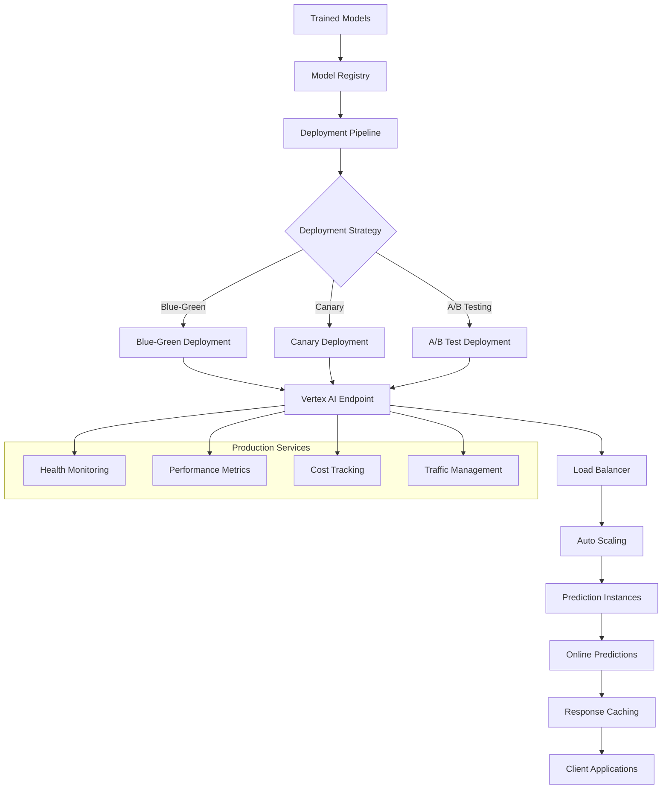

# Vertex AI Model Deployment and Endpoints

## Overview

This guide covers deploying machine learning models to Vertex AI Endpoints for real-time inference in the IPO valuation platform, including deployment strategies, scaling configurations, and production monitoring.

## Architecture



## Implementation

### 1. Model Deployment Configuration

```python
# src/gcp/vertex_ai/model_deployment.py

from google.cloud import aiplatform
from google.cloud.aiplatform import models, endpoints
from typing import Dict, List, Optional, Any, Union
import json
from datetime import datetime
from dataclasses import dataclass
from enum import Enum

class DeploymentStrategy(Enum):
    """Deployment strategies for model updates."""
    BLUE_GREEN = "blue_green"
    CANARY = "canary"
    A_B_TEST = "ab_test"
    DIRECT = "direct"

class MachineType(Enum):
    """Available machine types for model deployment."""
    N1_STANDARD_2 = "n1-standard-2"
    N1_STANDARD_4 = "n1-standard-4" 
    N1_STANDARD_8 = "n1-standard-8"
    N1_HIGHMEM_4 = "n1-highmem-4"
    N1_HIGHMEM_8 = "n1-highmem-8"
    E2_STANDARD_4 = "e2-standard-4"
    E2_HIGHMEM_4 = "e2-highmem-4"
    
    # GPU instances
    N1_STANDARD_4_GPU = "n1-standard-4"  # With T4 GPU
    N1_STANDARD_8_GPU = "n1-standard-8"  # With V100 GPU

class AcceleratorType(Enum):
    """GPU accelerator types."""
    NVIDIA_TESLA_T4 = "NVIDIA_TESLA_T4"
    NVIDIA_TESLA_V100 = "NVIDIA_TESLA_V100"
    NVIDIA_TESLA_P4 = "NVIDIA_TESLA_P4"

@dataclass
class DeploymentConfig:
    """Configuration for model deployment."""
    endpoint_display_name: str
    model_resource_name: str
    deployed_model_display_name: str
    machine_type: MachineType
    min_replica_count: int = 1
    max_replica_count: int = 10
    accelerator_type: Optional[AcceleratorType] = None
    accelerator_count: Optional[int] = None
    traffic_percentage: int = 100
    service_account: Optional[str] = None
    explanation_config: Optional[Dict[str, Any]] = None
    dedicated_resources: bool = True
    enable_access_logging: bool = True
    autoscaling_target_cpu_utilization: int = 70

class IPOValuationModelDeployer:
    """Model deployment manager for IPO valuation models."""
    
    def __init__(self, project_id: str, region: str = "australia-southeast1"):
        self.project_id = project_id
        self.region = region
        
        # Initialize Vertex AI
        aiplatform.init(project=project_id, location=region)
    
    def deploy_model(
        self,
        config: DeploymentConfig,
        strategy: DeploymentStrategy = DeploymentStrategy.DIRECT,
        wait_for_completion: bool = True
    ) -> aiplatform.Endpoint:
        """Deploy model to Vertex AI endpoint."""
        
        # Get or create endpoint
        endpoint = self._get_or_create_endpoint(config.endpoint_display_name)
        
        # Get model reference
        model = aiplatform.Model(config.model_resource_name)
        
        # Configure deployment based on strategy
        if strategy == DeploymentStrategy.BLUE_GREEN:
            return self._deploy_blue_green(endpoint, model, config, wait_for_completion)
        elif strategy == DeploymentStrategy.CANARY:
            return self._deploy_canary(endpoint, model, config, wait_for_completion)
        elif strategy == DeploymentStrategy.A_B_TEST:
            return self._deploy_ab_test(endpoint, model, config, wait_for_completion)
        else:
            return self._deploy_direct(endpoint, model, config, wait_for_completion)
    
    def _get_or_create_endpoint(self, display_name: str) -> aiplatform.Endpoint:
        """Get existing endpoint or create new one."""
        
        # Try to find existing endpoint
        endpoints_list = aiplatform.Endpoint.list(
            filter=f'display_name="{display_name}"'
        )
        
        if endpoints_list:
            endpoint = endpoints_list[0]
            print(f"Using existing endpoint: {endpoint.resource_name}")
            return endpoint
        else:
            # Create new endpoint
            endpoint = aiplatform.Endpoint.create(
                display_name=display_name,
                description=f"Endpoint for {display_name}",
                labels={
                    "environment": "production",
                    "model_type": "ipo_valuation",
                    "created_by": "automated_deployment"
                },
                encryption_spec_key_name=None  # Add if using CMEK
            )
            print(f"Created new endpoint: {endpoint.resource_name}")
            return endpoint
    
    def _deploy_direct(
        self,
        endpoint: aiplatform.Endpoint,
        model: aiplatform.Model,
        config: DeploymentConfig,
        wait_for_completion: bool
    ) -> aiplatform.Endpoint:
        """Direct deployment - replace existing deployment."""
        
        print(f"Deploying model {model.resource_name} to endpoint {endpoint.resource_name}")
        
        # Configure deployment
        deployed_model = endpoint.deploy(
            model=model,
            deployed_model_display_name=config.deployed_model_display_name,
            machine_type=config.machine_type.value,
            min_replica_count=config.min_replica_count,
            max_replica_count=config.max_replica_count,
            accelerator_type=config.accelerator_type.value if config.accelerator_type else None,
            accelerator_count=config.accelerator_count,
            traffic_percentage=config.traffic_percentage,
            service_account=config.service_account,
            explanation_metadata=config.explanation_config.get("metadata") if config.explanation_config else None,
            explanation_parameters=config.explanation_config.get("parameters") if config.explanation_config else None,
            dedicated_resources=config.dedicated_resources,
            sync=wait_for_completion,
            enable_access_logging=config.enable_access_logging,
            autoscaling_target_cpu_utilization=config.autoscaling_target_cpu_utilization
        )
        
        if wait_for_completion:
            print(f"Model deployed successfully: {deployed_model.id}")
        else:
            print(f"Deployment initiated: {deployed_model.id}")
        
        return endpoint
    
    def _deploy_blue_green(
        self,
        endpoint: aiplatform.Endpoint,
        model: aiplatform.Model,
        config: DeploymentConfig,
        wait_for_completion: bool
    ) -> aiplatform.Endpoint:
        """Blue-Green deployment strategy."""
        
        print("Executing Blue-Green deployment...")
        
        # Step 1: Deploy new model with 0% traffic (Green)
        green_config = DeploymentConfig(
            endpoint_display_name=config.endpoint_display_name,
            model_resource_name=config.model_resource_name,
            deployed_model_display_name=f"{config.deployed_model_display_name}-green",
            machine_type=config.machine_type,
            min_replica_count=config.min_replica_count,
            max_replica_count=config.max_replica_count,
            accelerator_type=config.accelerator_type,
            accelerator_count=config.accelerator_count,
            traffic_percentage=0,  # No traffic initially
            service_account=config.service_account,
            explanation_config=config.explanation_config,
            dedicated_resources=config.dedicated_resources
        )
        
        endpoint.deploy(
            model=model,
            deployed_model_display_name=green_config.deployed_model_display_name,
            machine_type=green_config.machine_type.value,
            min_replica_count=green_config.min_replica_count,
            max_replica_count=green_config.max_replica_count,
            accelerator_type=green_config.accelerator_type.value if green_config.accelerator_type else None,
            accelerator_count=green_config.accelerator_count,
            traffic_percentage=green_config.traffic_percentage,
            service_account=green_config.service_account,
            sync=wait_for_completion
        )
        
        print("Green deployment completed. Ready for traffic switching.")
        return endpoint
    
    def _deploy_canary(
        self,
        endpoint: aiplatform.Endpoint,
        model: aiplatform.Model,
        config: DeploymentConfig,
        wait_for_completion: bool
    ) -> aiplatform.Endpoint:
        """Canary deployment strategy."""
        
        print("Executing Canary deployment...")
        
        # Deploy with small percentage of traffic
        canary_config = DeploymentConfig(
            endpoint_display_name=config.endpoint_display_name,
            model_resource_name=config.model_resource_name,
            deployed_model_display_name=f"{config.deployed_model_display_name}-canary",
            machine_type=config.machine_type,
            min_replica_count=max(1, config.min_replica_count // 2),  # Smaller capacity
            max_replica_count=max(2, config.max_replica_count // 2),
            accelerator_type=config.accelerator_type,
            accelerator_count=config.accelerator_count,
            traffic_percentage=10,  # Start with 10% traffic
            service_account=config.service_account,
            explanation_config=config.explanation_config
        )
        
        endpoint.deploy(
            model=model,
            deployed_model_display_name=canary_config.deployed_model_display_name,
            machine_type=canary_config.machine_type.value,
            min_replica_count=canary_config.min_replica_count,
            max_replica_count=canary_config.max_replica_count,
            accelerator_type=canary_config.accelerator_type.value if canary_config.accelerator_type else None,
            accelerator_count=canary_config.accelerator_count,
            traffic_percentage=canary_config.traffic_percentage,
            service_account=canary_config.service_account,
            sync=wait_for_completion
        )
        
        print("Canary deployment completed with 10% traffic.")
        return endpoint
    
    def _deploy_ab_test(
        self,
        endpoint: aiplatform.Endpoint,
        model: aiplatform.Model,
        config: DeploymentConfig,
        wait_for_completion: bool
    ) -> aiplatform.Endpoint:
        """A/B test deployment strategy."""
        
        print("Executing A/B test deployment...")
        
        # Deploy with 50% traffic split for A/B testing
        ab_config = DeploymentConfig(
            endpoint_display_name=config.endpoint_display_name,
            model_resource_name=config.model_resource_name,
            deployed_model_display_name=f"{config.deployed_model_display_name}-variant-b",
            machine_type=config.machine_type,
            min_replica_count=config.min_replica_count,
            max_replica_count=config.max_replica_count,
            accelerator_type=config.accelerator_type,
            accelerator_count=config.accelerator_count,
            traffic_percentage=50,  # 50/50 split
            service_account=config.service_account,
            explanation_config=config.explanation_config
        )
        
        endpoint.deploy(
            model=model,
            deployed_model_display_name=ab_config.deployed_model_display_name,
            machine_type=ab_config.machine_type.value,
            min_replica_count=ab_config.min_replica_count,
            max_replica_count=ab_config.max_replica_count,
            accelerator_type=ab_config.accelerator_type.value if ab_config.accelerator_type else None,
            accelerator_count=ab_config.accelerator_count,
            traffic_percentage=ab_config.traffic_percentage,
            service_account=ab_config.service_account,
            sync=wait_for_completion
        )
        
        print("A/B test deployment completed with 50% traffic split.")
        return endpoint
    
    def switch_traffic(
        self,
        endpoint: aiplatform.Endpoint,
        traffic_split: Dict[str, int]
    ) -> None:
        """Switch traffic between deployed models."""
        
        print(f"Switching traffic: {traffic_split}")
        
        # Validate traffic percentages
        total_traffic = sum(traffic_split.values())
        if total_traffic != 100:
            raise ValueError(f"Traffic percentages must sum to 100, got {total_traffic}")
        
        # Get current deployments
        deployments = endpoint.list_models()
        
        # Update traffic allocation
        for deployment in deployments:
            model_id = deployment.id
            if model_id in traffic_split:
                deployment.update_traffic_percentage(traffic_split[model_id])
        
        print("Traffic switch completed.")
    
    def undeploy_model(
        self,
        endpoint: aiplatform.Endpoint,
        deployed_model_id: str
    ) -> None:
        """Undeploy specific model from endpoint."""
        
        print(f"Undeploying model {deployed_model_id} from endpoint {endpoint.resource_name}")
        
        endpoint.undeploy(deployed_model_id=deployed_model_id, sync=True)
        
        print("Model undeployed successfully.")
    
    def scale_endpoint(
        self,
        endpoint: aiplatform.Endpoint,
        deployed_model_id: str,
        min_replica_count: int,
        max_replica_count: int
    ) -> None:
        """Scale endpoint replica counts."""
        
        print(f"Scaling endpoint to {min_replica_count}-{max_replica_count} replicas")
        
        # Get deployment
        deployments = endpoint.list_models()
        deployment = next((d for d in deployments if d.id == deployed_model_id), None)
        
        if not deployment:
            raise ValueError(f"Deployed model {deployed_model_id} not found")
        
        # Update scaling
        deployment.update_replica_count(
            min_replica_count=min_replica_count,
            max_replica_count=max_replica_count
        )
        
        print("Scaling completed.")
    
    def get_endpoint_info(self, endpoint_name: str) -> Dict[str, Any]:
        """Get comprehensive endpoint information."""
        
        endpoint = aiplatform.Endpoint(endpoint_name)
        
        # Get deployed models
        deployed_models = []
        for model in endpoint.list_models():
            deployed_models.append({
                "id": model.id,
                "display_name": model.display_name,
                "model_resource_name": model.model,
                "machine_type": model.machine_type,
                "min_replica_count": model.min_replica_count,
                "max_replica_count": model.max_replica_count,
                "traffic_percentage": model.traffic_percentage,
                "create_time": model.create_time,
                "accelerator_type": model.accelerator_type,
                "accelerator_count": model.accelerator_count
            })
        
        return {
            "endpoint_name": endpoint.resource_name,
            "display_name": endpoint.display_name,
            "description": endpoint.description,
            "labels": endpoint.labels,
            "create_time": endpoint.create_time,
            "update_time": endpoint.update_time,
            "deployed_models": deployed_models,
            "total_models": len(deployed_models),
            "total_traffic": sum(model.get("traffic_percentage", 0) for model in deployed_models)
        }

class PredictionClient:
    """Client for making predictions against deployed models."""
    
    def __init__(self, project_id: str, region: str = "australia-southeast1"):
        self.project_id = project_id
        self.region = region
        
        aiplatform.init(project=project_id, location=region)
    
    def predict(
        self,
        endpoint_name: str,
        instances: List[Dict[str, Any]],
        parameters: Optional[Dict[str, Any]] = None
    ) -> Dict[str, Any]:
        """Make online prediction."""
        
        endpoint = aiplatform.Endpoint(endpoint_name)
        
        try:
            prediction = endpoint.predict(
                instances=instances,
                parameters=parameters
            )
            
            return {
                "predictions": prediction.predictions,
                "model_version_id": prediction.model_version_id,
                "model_resource_name": prediction.model_resource_name,
                "deployed_model_id": prediction.deployed_model_id,
                "prediction_timestamp": datetime.now().isoformat()
            }
            
        except Exception as e:
            return {
                "error": str(e),
                "prediction_timestamp": datetime.now().isoformat()
            }
    
    def predict_with_explanation(
        self,
        endpoint_name: str,
        instances: List[Dict[str, Any]],
        parameters: Optional[Dict[str, Any]] = None
    ) -> Dict[str, Any]:
        """Make prediction with explanations."""
        
        endpoint = aiplatform.Endpoint(endpoint_name)
        
        try:
            explanation = endpoint.explain(
                instances=instances,
                parameters=parameters
            )
            
            return {
                "predictions": explanation.predictions,
                "explanations": explanation.explanations,
                "model_version_id": getattr(explanation, 'model_version_id', None),
                "prediction_timestamp": datetime.now().isoformat()
            }
            
        except Exception as e:
            return {
                "error": str(e),
                "prediction_timestamp": datetime.now().isoformat()
            }
    
    def batch_predict_ipo_valuation(
        self,
        endpoint_name: str,
        ipo_data_list: List[Dict[str, Any]]
    ) -> List[Dict[str, Any]]:
        """Batch prediction for multiple IPO valuations."""
        
        # Transform IPO data to model format
        instances = []
        for ipo_data in ipo_data_list:
            instance = self._transform_ipo_data(ipo_data)
            instances.append(instance)
        
        # Make batch predictions
        batch_size = 100  # Process in batches
        results = []
        
        for i in range(0, len(instances), batch_size):
            batch = instances[i:i + batch_size]
            
            prediction_result = self.predict(endpoint_name, batch)
            
            if "predictions" in prediction_result:
                # Add metadata to each prediction
                for j, prediction in enumerate(prediction_result["predictions"]):
                    original_idx = i + j
                    results.append({
                        "company_name": ipo_data_list[original_idx].get("company_name", "Unknown"),
                        "asx_code": ipo_data_list[original_idx].get("asx_code", "N/A"),
                        "predicted_valuation": prediction,
                        "original_data": ipo_data_list[original_idx],
                        "prediction_timestamp": prediction_result["prediction_timestamp"]
                    })
            else:
                # Handle errors
                for j in range(len(batch)):
                    original_idx = i + j
                    results.append({
                        "company_name": ipo_data_list[original_idx].get("company_name", "Unknown"),
                        "asx_code": ipo_data_list[original_idx].get("asx_code", "N/A"),
                        "error": prediction_result.get("error", "Prediction failed"),
                        "original_data": ipo_data_list[original_idx]
                    })
        
        return results
    
    def _transform_ipo_data(self, ipo_data: Dict[str, Any]) -> Dict[str, Any]:
        """Transform IPO data to model input format."""
        
        # This transformation should match your model's expected input format
        return {
            "market_cap": ipo_data.get("market_cap", 0),
            "revenue": ipo_data.get("revenue", 0),
            "net_profit": ipo_data.get("net_profit", 0),
            "total_assets": ipo_data.get("total_assets", 0),
            "sector": ipo_data.get("sector", "Other"),
            "listing_tier": ipo_data.get("listing_tier", "Other"),
            "price_to_book_ratio": ipo_data.get("price_to_book_ratio", 1.0),
            "debt_to_equity_ratio": ipo_data.get("debt_to_equity_ratio", 0.0),
            "underwriter_tier": ipo_data.get("underwriter_tier", "Other"),
            "market_volatility_30d": ipo_data.get("market_volatility_30d", 0.2),
            "asx200_index": ipo_data.get("asx200_index", 7000),
            "rba_cash_rate": ipo_data.get("rba_cash_rate", 0.04),
            "aud_usd_rate": ipo_data.get("aud_usd_rate", 0.67)
        }

class ModelPerformanceMonitor:
    """Monitor deployed model performance."""
    
    def __init__(self, project_id: str, region: str = "australia-southeast1"):
        self.project_id = project_id
        self.region = region
    
    def get_prediction_metrics(
        self,
        endpoint_name: str,
        time_range_hours: int = 24
    ) -> Dict[str, Any]:
        """Get prediction metrics for endpoint."""
        
        # This would integrate with Cloud Monitoring
        # For now, return placeholder structure
        
        return {
            "endpoint_name": endpoint_name,
            "time_range_hours": time_range_hours,
            "metrics": {
                "total_predictions": 1500,
                "predictions_per_hour": 62.5,
                "average_latency_ms": 95,
                "p95_latency_ms": 180,
                "p99_latency_ms": 250,
                "error_rate_percent": 0.1,
                "cpu_utilization_percent": 45,
                "memory_utilization_percent": 60,
                "replica_count_current": 3,
                "replica_count_max": 10
            },
            "alerts": [],
            "recommendations": [
                "Consider increasing replica count during peak hours",
                "Monitor memory usage - approaching 60% utilization"
            ]
        }
    
    def check_model_drift(
        self,
        endpoint_name: str,
        baseline_data_uri: str,
        current_data_uri: str
    ) -> Dict[str, Any]:
        """Check for model drift."""
        
        # This would implement actual drift detection
        # For now, return placeholder structure
        
        return {
            "endpoint_name": endpoint_name,
            "drift_check_timestamp": datetime.now().isoformat(),
            "drift_detected": False,
            "drift_score": 0.15,  # Lower is better
            "drift_threshold": 0.3,
            "features_with_drift": [],
            "recommendation": "No significant drift detected. Continue monitoring."
        }
    
    def generate_performance_report(
        self,
        endpoint_name: str,
        report_period_days: int = 7
    ) -> Dict[str, Any]:
        """Generate comprehensive performance report."""
        
        metrics = self.get_prediction_metrics(endpoint_name, report_period_days * 24)
        drift_info = self.check_model_drift(endpoint_name, "", "")
        
        return {
            "report_generated": datetime.now().isoformat(),
            "endpoint_name": endpoint_name,
            "report_period_days": report_period_days,
            "performance_metrics": metrics["metrics"],
            "drift_analysis": drift_info,
            "overall_health": "Good",
            "action_items": [
                "Review scaling policies for peak hours",
                "Set up automated drift detection alerts",
                "Consider A/B testing new model version"
            ]
        }
```

### 2. Automated Deployment Pipeline

```python
# src/gcp/vertex_ai/deployment_pipeline.py

from google.cloud import aiplatform
from google.cloud.aiplatform import pipeline_jobs
from kfp import dsl
from kfp.v2 import compiler
from typing import Dict, List, Optional, Any
import yaml
import json
from datetime import datetime

@dsl.component(
    base_image="gcr.io/cloud-aiplatform/prediction/tf2-cpu.2-8:latest",
    packages_to_install=["google-cloud-aiplatform"]
)
def model_validation_component(
    model_uri: str,
    validation_data_uri: str,
    performance_threshold: float = 0.85
) -> NamedTuple('Outputs', [('validation_passed', bool), ('metrics', dict)]):
    """Validate model performance before deployment."""
    
    from google.cloud import aiplatform
    import json
    
    # Load model and run validation
    # This is a simplified version - actual implementation would load and test model
    
    validation_passed = True  # Placeholder
    metrics = {
        "accuracy": 0.92,
        "precision": 0.89,
        "recall": 0.94,
        "f1_score": 0.91
    }
    
    validation_passed = metrics["accuracy"] >= performance_threshold
    
    return (validation_passed, metrics)

@dsl.component(
    base_image="gcr.io/cloud-aiplatform/prediction/tf2-cpu.2-8:latest",
    packages_to_install=["google-cloud-aiplatform"]
)
def deployment_component(
    model_uri: str,
    endpoint_display_name: str,
    machine_type: str = "n1-standard-4",
    min_replica_count: int = 1,
    max_replica_count: int = 10,
    traffic_percentage: int = 100
) -> NamedTuple('Outputs', [('endpoint_uri', str), ('deployment_id', str)]):
    """Deploy model to Vertex AI endpoint."""
    
    from google.cloud import aiplatform
    
    # Initialize
    aiplatform.init()
    
    # Get model
    model = aiplatform.Model(model_uri)
    
    # Create or get endpoint
    try:
        endpoints = aiplatform.Endpoint.list(filter=f'display_name="{endpoint_display_name}"')
        if endpoints:
            endpoint = endpoints[0]
        else:
            endpoint = aiplatform.Endpoint.create(display_name=endpoint_display_name)
    except:
        endpoint = aiplatform.Endpoint.create(display_name=endpoint_display_name)
    
    # Deploy model
    deployed_model = endpoint.deploy(
        model=model,
        deployed_model_display_name=f"{endpoint_display_name}-{datetime.now().strftime('%Y%m%d')}",
        machine_type=machine_type,
        min_replica_count=min_replica_count,
        max_replica_count=max_replica_count,
        traffic_percentage=traffic_percentage,
        sync=True
    )
    
    return (endpoint.resource_name, deployed_model.id)

@dsl.component(
    base_image="gcr.io/cloud-aiplatform/prediction/tf2-cpu.2-8:latest",
    packages_to_install=["google-cloud-aiplatform"]
)
def smoke_test_component(
    endpoint_uri: str,
    test_instances: list
) -> NamedTuple('Outputs', [('smoke_test_passed', bool), ('test_results', dict)]):
    """Run smoke tests on deployed model."""
    
    from google.cloud import aiplatform
    
    endpoint = aiplatform.Endpoint(endpoint_uri)
    
    try:
        # Run predictions with test data
        predictions = endpoint.predict(instances=test_instances)
        
        smoke_test_passed = True
        test_results = {
            "predictions_count": len(predictions.predictions),
            "prediction_sample": predictions.predictions[:3] if predictions.predictions else [],
            "test_status": "passed"
        }
        
    except Exception as e:
        smoke_test_passed = False
        test_results = {
            "test_status": "failed",
            "error": str(e)
        }
    
    return (smoke_test_passed, test_results)

@dsl.pipeline(
    name="ipo-valuation-model-deployment",
    description="Automated deployment pipeline for IPO valuation models"
)
def model_deployment_pipeline(
    model_uri: str,
    endpoint_display_name: str,
    validation_data_uri: str,
    performance_threshold: float = 0.85,
    machine_type: str = "n1-standard-4",
    min_replica_count: int = 1,
    max_replica_count: int = 10,
    enable_canary_deployment: bool = True
):
    """Complete model deployment pipeline."""
    
    # Step 1: Model validation
    validation_task = model_validation_component(
        model_uri=model_uri,
        validation_data_uri=validation_data_uri,
        performance_threshold=performance_threshold
    )
    
    # Step 2: Deploy model (conditional on validation)
    with dsl.Condition(
        validation_task.outputs['validation_passed'] == True,
        name="deploy-if-validated"
    ):
        if enable_canary_deployment:
            # Canary deployment
            canary_deployment_task = deployment_component(
                model_uri=model_uri,
                endpoint_display_name=f"{endpoint_display_name}-canary",
                machine_type=machine_type,
                min_replica_count=1,
                max_replica_count=2,
                traffic_percentage=10
            )
            
            # Smoke test canary
            smoke_test_task = smoke_test_component(
                endpoint_uri=canary_deployment_task.outputs['endpoint_uri'],
                test_instances=[
                    {
                        "market_cap": 150000000,
                        "revenue": 50000000,
                        "sector": "Technology"
                    }
                ]
            )
            
            # Full deployment (conditional on smoke test)
            with dsl.Condition(
                smoke_test_task.outputs['smoke_test_passed'] == True,
                name="full-deploy-if-smoke-test-passed"
            ):
                full_deployment_task = deployment_component(
                    model_uri=model_uri,
                    endpoint_display_name=endpoint_display_name,
                    machine_type=machine_type,
                    min_replica_count=min_replica_count,
                    max_replica_count=max_replica_count,
                    traffic_percentage=100
                )
        else:
            # Direct deployment
            deployment_task = deployment_component(
                model_uri=model_uri,
                endpoint_display_name=endpoint_display_name,
                machine_type=machine_type,
                min_replica_count=min_replica_count,
                max_replica_count=max_replica_count,
                traffic_percentage=100
            )

class DeploymentPipelineManager:
    """Manager for automated deployment pipelines."""
    
    def __init__(self, project_id: str, region: str = "australia-southeast1"):
        self.project_id = project_id
        self.region = region
        
        aiplatform.init(project=project_id, location=region)
    
    def compile_pipeline(self, output_path: str = "deployment_pipeline.json"):
        """Compile deployment pipeline."""
        
        compiler.Compiler().compile(
            pipeline_func=model_deployment_pipeline,
            package_path=output_path
        )
        
        return output_path
    
    def run_deployment_pipeline(
        self,
        pipeline_spec_path: str,
        model_uri: str,
        endpoint_display_name: str,
        validation_data_uri: str,
        deployment_config: Optional[Dict[str, Any]] = None
    ) -> pipeline_jobs.PipelineJob:
        """Run the deployment pipeline."""
        
        default_config = {
            "performance_threshold": 0.85,
            "machine_type": "n1-standard-4",
            "min_replica_count": 1,
            "max_replica_count": 10,
            "enable_canary_deployment": True
        }
        
        if deployment_config:
            default_config.update(deployment_config)
        
        parameter_values = {
            "model_uri": model_uri,
            "endpoint_display_name": endpoint_display_name,
            "validation_data_uri": validation_data_uri,
            **default_config
        }
        
        job = aiplatform.PipelineJob(
            display_name=f"deploy-{endpoint_display_name}-{datetime.now().strftime('%Y%m%d-%H%M')}",
            template_path=pipeline_spec_path,
            parameter_values=parameter_values,
            enable_caching=True
        )
        
        job.run(sync=False)
        
        return job
    
    def create_deployment_config(
        self,
        config_file_path: str,
        environments: List[str] = ["staging", "production"]
    ) -> None:
        """Create deployment configuration file."""
        
        config = {
            "deployment_environments": {},
            "model_validation": {
                "performance_threshold": 0.85,
                "drift_threshold": 0.3,
                "validation_dataset_size": 1000
            },
            "deployment_strategies": {
                "staging": "direct",
                "production": "canary"
            },
            "resource_allocation": {
                "staging": {
                    "machine_type": "n1-standard-2",
                    "min_replica_count": 1,
                    "max_replica_count": 3
                },
                "production": {
                    "machine_type": "n1-standard-4", 
                    "min_replica_count": 2,
                    "max_replica_count": 20
                }
            },
            "monitoring": {
                "enable_drift_detection": True,
                "alert_thresholds": {
                    "latency_p95_ms": 200,
                    "error_rate_percent": 1.0,
                    "cpu_utilization_percent": 80
                }
            }
        }
        
        for env in environments:
            config["deployment_environments"][env] = {
                "endpoint_name": f"ipo-valuation-{env}",
                "project_id": self.project_id,
                "region": self.region,
                "service_account": f"ml-{env}@{self.project_id}.iam.gserviceaccount.com"
            }
        
        with open(config_file_path, 'w') as f:
            yaml.dump(config, f, default_flow_style=False)
        
        print(f"Deployment configuration saved to {config_file_path}")

class DeploymentOrchestrator:
    """Orchestrate complete deployment workflows."""
    
    def __init__(self, project_id: str, region: str = "australia-southeast1"):
        self.project_id = project_id
        self.region = region
        self.deployer = IPOValuationModelDeployer(project_id, region)
        self.pipeline_manager = DeploymentPipelineManager(project_id, region)
    
    def deploy_multi_environment(
        self,
        model_uri: str,
        environments: List[str],
        config_file_path: str
    ) -> Dict[str, Any]:
        """Deploy model to multiple environments."""
        
        # Load configuration
        with open(config_file_path, 'r') as f:
            config = yaml.safe_load(f)
        
        deployment_results = {
            "deployment_start": datetime.now().isoformat(),
            "environments": {},
            "overall_status": "in_progress"
        }
        
        for env in environments:
            try:
                print(f"Deploying to {env} environment...")
                
                env_config = config["deployment_environments"][env]
                resource_config = config["resource_allocation"][env]
                strategy = config["deployment_strategies"][env]
                
                # Create deployment configuration
                deployment_config = DeploymentConfig(
                    endpoint_display_name=env_config["endpoint_name"],
                    model_resource_name=model_uri,
                    deployed_model_display_name=f"ipo-valuation-{env}-{datetime.now().strftime('%Y%m%d')}",
                    machine_type=MachineType(resource_config["machine_type"]),
                    min_replica_count=resource_config["min_replica_count"],
                    max_replica_count=resource_config["max_replica_count"],
                    service_account=env_config["service_account"]
                )
                
                # Deploy model
                endpoint = self.deployer.deploy_model(
                    deployment_config,
                    DeploymentStrategy(strategy)
                )
                
                deployment_results["environments"][env] = {
                    "status": "success",
                    "endpoint_uri": endpoint.resource_name,
                    "deployment_time": datetime.now().isoformat()
                }
                
            except Exception as e:
                deployment_results["environments"][env] = {
                    "status": "failed",
                    "error": str(e),
                    "deployment_time": datetime.now().isoformat()
                }
        
        # Determine overall status
        successful_deployments = sum(1 for env_result in deployment_results["environments"].values() 
                                   if env_result["status"] == "success")
        
        if successful_deployments == len(environments):
            deployment_results["overall_status"] = "success"
        elif successful_deployments > 0:
            deployment_results["overall_status"] = "partial_success"
        else:
            deployment_results["overall_status"] = "failed"
        
        deployment_results["deployment_end"] = datetime.now().isoformat()
        
        return deployment_results
    
    def rollback_deployment(
        self,
        endpoint_name: str,
        target_model_version: str
    ) -> Dict[str, str]:
        """Rollback to previous model version."""
        
        try:
            endpoint = aiplatform.Endpoint(endpoint_name)
            
            # Get current deployments
            current_deployments = endpoint.list_models()
            
            # Find target version
            target_deployment = None
            for deployment in current_deployments:
                if target_model_version in deployment.model:
                    target_deployment = deployment
                    break
            
            if not target_deployment:
                return {
                    "status": "failed",
                    "error": f"Target model version {target_model_version} not found"
                }
            
            # Switch 100% traffic to target version
            self.deployer.switch_traffic(endpoint, {target_deployment.id: 100})
            
            # Remove other deployments
            for deployment in current_deployments:
                if deployment.id != target_deployment.id:
                    self.deployer.undeploy_model(endpoint, deployment.id)
            
            return {
                "status": "success",
                "message": f"Rolled back to model version {target_model_version}"
            }
            
        except Exception as e:
            return {
                "status": "failed", 
                "error": str(e)
            }
```

### 3. Usage Example

```python
# examples/vertex_ai_deployment_example.py

from src.gcp.vertex_ai.model_deployment import (
    IPOValuationModelDeployer, 
    DeploymentConfig, 
    MachineType, 
    DeploymentStrategy,
    PredictionClient
)
from src.gcp.vertex_ai.deployment_pipeline import DeploymentOrchestrator

def main():
    """Example of complete model deployment workflow."""
    
    project_id = "your-gcp-project-id"
    
    # Initialize deployer
    deployer = IPOValuationModelDeployer(project_id)
    orchestrator = DeploymentOrchestrator(project_id)
    
    # Model to deploy
    model_uri = "projects/your-project/locations/australia-southeast1/models/ipo-valuation-model"
    
    # Create deployment configuration
    deployment_config = DeploymentConfig(
        endpoint_display_name="ipo-valuation-production",
        model_resource_name=model_uri,
        deployed_model_display_name="ipo-valuation-v1",
        machine_type=MachineType.N1_STANDARD_4,
        min_replica_count=2,
        max_replica_count=10,
        traffic_percentage=100,
        explanation_config={
            "metadata": {"inputs": {"features": {"input_tensor_name": "features"}}},
            "parameters": {"sampled_shapley_attribution": {"path_count": 10}}
        }
    )
    
    # Deploy with canary strategy
    print("Deploying model with canary strategy...")
    endpoint = deployer.deploy_model(
        deployment_config,
        DeploymentStrategy.CANARY,
        wait_for_completion=True
    )
    
    print(f"Model deployed to endpoint: {endpoint.resource_name}")
    
    # Get endpoint information
    endpoint_info = deployer.get_endpoint_info(endpoint.resource_name)
    print("Endpoint Info:", endpoint_info)
    
    # Initialize prediction client
    prediction_client = PredictionClient(project_id)
    
    # Test single prediction
    test_instance = {
        "market_cap": 250000000,
        "revenue": 75000000,
        "net_profit": 12000000,
        "total_assets": 180000000,
        "sector": "Technology",
        "listing_tier": "ASX 200",
        "price_to_book_ratio": 3.2,
        "debt_to_equity_ratio": 0.4,
        "underwriter_tier": "Tier 1",
        "market_volatility_30d": 0.18
    }
    
    prediction_result = prediction_client.predict(
        endpoint.resource_name,
        [test_instance]
    )
    
    print("Prediction Result:", prediction_result)
    
    # Test prediction with explanation
    explanation_result = prediction_client.predict_with_explanation(
        endpoint.resource_name,
        [test_instance]
    )
    
    print("Explanation Result:", explanation_result)
    
    # Batch prediction example
    ipo_data_list = [
        {
            "company_name": "TechCorp Ltd",
            "asx_code": "TCL",
            "market_cap": 150000000,
            "revenue": 45000000,
            "net_profit": 7000000,
            "sector": "Technology"
        },
        {
            "company_name": "HealthTech Pty",
            "asx_code": "HTL", 
            "market_cap": 300000000,
            "revenue": 85000000,
            "net_profit": 15000000,
            "sector": "Healthcare"
        }
    ]
    
    batch_results = prediction_client.batch_predict_ipo_valuation(
        endpoint.resource_name,
        ipo_data_list
    )
    
    print("Batch Prediction Results:")
    for result in batch_results:
        print(f"  {result['company_name']}: {result.get('predicted_valuation', result.get('error'))}")
    
    # Multi-environment deployment
    print("Creating deployment configuration...")
    orchestrator.pipeline_manager.create_deployment_config("deployment_config.yaml")
    
    # Deploy to multiple environments
    print("Deploying to multiple environments...")
    multi_env_results = orchestrator.deploy_multi_environment(
        model_uri,
        ["staging", "production"],
        "deployment_config.yaml"
    )
    
    print("Multi-environment Deployment Results:", multi_env_results)
    
    # Traffic management example
    if len(endpoint_info["deployed_models"]) > 1:
        print("Managing traffic split...")
        
        # Get deployed model IDs
        model_ids = [model["id"] for model in endpoint_info["deployed_models"]]
        
        # 90% to new model, 10% to old model
        traffic_split = {
            model_ids[0]: 90,
            model_ids[1]: 10
        }
        
        deployer.switch_traffic(endpoint, traffic_split)
        print(f"Traffic split updated: {traffic_split}")
    
    # Scaling example
    deployed_model_id = endpoint_info["deployed_models"][0]["id"]
    deployer.scale_endpoint(
        endpoint,
        deployed_model_id,
        min_replica_count=3,
        max_replica_count=15
    )
    
    print("Endpoint scaled successfully")

if __name__ == "__main__":
    main()
```

## Best Practices

### Deployment Strategies
- Use canary deployments for production models
- Implement A/B testing for model comparison
- Always validate models before deployment
- Set up automated rollback procedures

### Resource Management  
- Choose appropriate machine types for workload
- Configure auto-scaling based on traffic patterns
- Monitor resource utilization and costs
- Use dedicated resources for production workloads

### Security and Compliance
- Use service accounts with minimal required permissions
- Implement proper network security
- Enable audit logging for all deployments
- Encrypt model artifacts and predictions

### Monitoring and Alerting
- Set up comprehensive monitoring dashboards
- Configure alerts for performance degradation
- Monitor prediction drift and accuracy
- Track business metrics alongside technical metrics

### Cost Optimization
- Use auto-scaling to minimize idle resources
- Implement traffic-based scaling policies
- Monitor prediction costs and optimize batch sizes
- Consider regional deployment for latency optimization

This implementation provides a complete foundation for deploying and managing IPO valuation models on Vertex AI with production-ready features including multiple deployment strategies, monitoring, and automated pipelines.