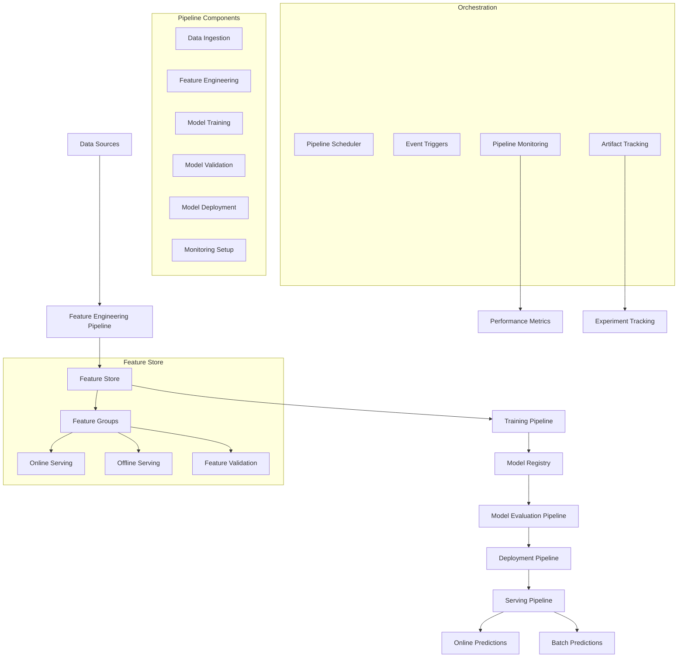

# Vertex AI Pipelines and Feature Store Integration

## Overview

This guide covers implementing Vertex AI Pipelines for ML workflow orchestration and Feature Store integration for consistent feature serving in the IPO valuation platform, enabling end-to-end ML lifecycle management.

## Architecture



## Implementation

### 1. Feature Store Setup and Management

```python
# src/gcp/vertex_ai/feature_store.py

from google.cloud import aiplatform
from google.cloud.aiplatform import feature_store
from google.cloud import bigquery
from typing import Dict, List, Optional, Any, Union
import pandas as pd
from datetime import datetime, timedelta
import json
from dataclasses import dataclass

@dataclass
class FeatureConfig:
    """Configuration for feature store features."""
    feature_id: str
    value_type: str  # STRING, INT64, DOUBLE, BOOL, etc.
    description: str
    labels: Dict[str, str] = None
    monitoring_config: Dict[str, Any] = None

@dataclass
class EntityTypeConfig:
    """Configuration for feature store entity types."""
    entity_type_id: str
    description: str
    monitoring_config: Dict[str, Any] = None
    labels: Dict[str, str] = None

class IPOValuationFeatureStore:
    """Feature Store manager for IPO valuation features."""
    
    def __init__(self, project_id: str, region: str = "australia-southeast1"):
        self.project_id = project_id
        self.region = region
        self.featurestore_id = "ipo-valuation-featurestore"
        
        # Initialize clients
        aiplatform.init(project=project_id, location=region)
        self.bq_client = bigquery.Client(project=project_id)
        
        # Feature store client
        self.fs_client = aiplatform.gapic.FeaturestoreServiceClient(
            client_options={"api_endpoint": f"{region}-aiplatform.googleapis.com"}
        )
    
    def create_featurestore(
        self,
        featurestore_id: Optional[str] = None,
        online_serving_config: Optional[Dict[str, Any]] = None
    ) -> feature_store.Featurestore:
        """Create the main feature store."""
        
        if not featurestore_id:
            featurestore_id = self.featurestore_id
        
        # Default online serving configuration
        if not online_serving_config:
            online_serving_config = {
                "fixed_node_count": 2,
                "scaling": {
                    "min_node_count": 1,
                    "max_node_count": 10,
                    "cpu_utilization_target": 70
                }
            }
        
        # Create feature store
        featurestore = aiplatform.Featurestore.create(
            featurestore_id=featurestore_id,
            online_serving_config=online_serving_config,
            labels={
                "environment": "production",
                "purpose": "ipo_valuation",
                "team": "ml_platform"
            },
            encryption_spec=None,  # Add CMEK if required
            sync=True
        )
        
        print(f"Created feature store: {featurestore.resource_name}")
        return featurestore
    
    def create_entity_types(
        self,
        featurestore: feature_store.Featurestore
    ) -> Dict[str, feature_store.EntityType]:
        """Create entity types for IPO valuation features."""
        
        entity_configs = [
            EntityTypeConfig(
                entity_type_id="company",
                description="Company-level features for IPO valuation",
                labels={"category": "company_data"}
            ),
            EntityTypeConfig(
                entity_type_id="market",
                description="Market-level features and indicators",
                labels={"category": "market_data"}
            ),
            EntityTypeConfig(
                entity_type_id="ipo",
                description="IPO-specific features and characteristics",
                labels={"category": "ipo_data"}
            ),
            EntityTypeConfig(
                entity_type_id="financial",
                description="Financial metrics and ratios",
                labels={"category": "financial_data"}
            )
        ]
        
        entity_types = {}
        
        for config in entity_configs:
            entity_type = featurestore.create_entity_type(
                entity_type_id=config.entity_type_id,
                description=config.description,
                labels=config.labels,
                monitoring_config=config.monitoring_config,
                sync=True
            )
            
            entity_types[config.entity_type_id] = entity_type
            print(f"Created entity type: {entity_type.resource_name}")
        
        return entity_types
    
    def create_features(
        self,
        entity_types: Dict[str, feature_store.EntityType]
    ) -> Dict[str, List[feature_store.Feature]]:
        """Create features for each entity type."""
        
        # Define features for each entity type
        feature_definitions = {
            "company": [
                FeatureConfig("asx_code", "STRING", "ASX stock code"),
                FeatureConfig("company_name", "STRING", "Company legal name"),
                FeatureConfig("sector", "STRING", "Industry sector classification"),
                FeatureConfig("listing_tier", "STRING", "ASX listing tier (ASX 200, etc.)"),
                FeatureConfig("market_cap", "DOUBLE", "Market capitalization in AUD"),
                FeatureConfig("employee_count", "INT64", "Number of employees"),
                FeatureConfig("company_age_years", "INT64", "Company age in years"),
                FeatureConfig("headquarters_location", "STRING", "Primary business location")
            ],
            "financial": [
                FeatureConfig("revenue_current", "DOUBLE", "Current year revenue in AUD"),
                FeatureConfig("revenue_previous", "DOUBLE", "Previous year revenue in AUD"),
                FeatureConfig("net_profit_current", "DOUBLE", "Current year net profit in AUD"),
                FeatureConfig("net_profit_previous", "DOUBLE", "Previous year net profit in AUD"),
                FeatureConfig("total_assets", "DOUBLE", "Total assets in AUD"),
                FeatureConfig("total_debt", "DOUBLE", "Total debt in AUD"),
                FeatureConfig("shareholders_equity", "DOUBLE", "Shareholders equity in AUD"),
                FeatureConfig("cash_and_equivalents", "DOUBLE", "Cash and cash equivalents in AUD"),
                FeatureConfig("price_to_book_ratio", "DOUBLE", "Price-to-book ratio"),
                FeatureConfig("debt_to_equity_ratio", "DOUBLE", "Debt-to-equity ratio"),
                FeatureConfig("return_on_equity", "DOUBLE", "Return on equity ratio"),
                FeatureConfig("profit_margin", "DOUBLE", "Net profit margin percentage"),
                FeatureConfig("revenue_growth_rate", "DOUBLE", "Year-over-year revenue growth rate")
            ],
            "ipo": [
                FeatureConfig("ipo_price_min", "DOUBLE", "Minimum IPO price in AUD"),
                FeatureConfig("ipo_price_max", "DOUBLE", "Maximum IPO price in AUD"),
                FeatureConfig("shares_offered", "INT64", "Number of shares offered"),
                FeatureConfig("total_offering_value", "DOUBLE", "Total offering value in AUD"),
                FeatureConfig("underwriter_tier", "STRING", "Primary underwriter tier"),
                FeatureConfig("use_of_proceeds_category", "STRING", "Primary use of proceeds category"),
                FeatureConfig("listing_date", "STRING", "Planned listing date (ISO format)"),
                FeatureConfig("roadshow_duration_days", "INT64", "Length of roadshow in days"),
                FeatureConfig("institutional_allocation_pct", "DOUBLE", "Percentage allocated to institutions"),
                FeatureConfig("retail_allocation_pct", "DOUBLE", "Percentage allocated to retail investors")
            ],
            "market": [
                FeatureConfig("asx200_index", "DOUBLE", "ASX 200 index value"),
                FeatureConfig("asx200_volatility_30d", "DOUBLE", "30-day ASX 200 volatility"),
                FeatureConfig("sector_index_value", "DOUBLE", "Relevant sector index value"),
                FeatureConfig("sector_performance_90d", "DOUBLE", "90-day sector performance"),
                FeatureConfig("rba_cash_rate", "DOUBLE", "RBA cash rate"),
                FeatureConfig("aud_usd_rate", "DOUBLE", "AUD/USD exchange rate"),
                FeatureConfig("ten_year_bond_yield", "DOUBLE", "10-year government bond yield"),
                FeatureConfig("market_sentiment_score", "DOUBLE", "Market sentiment score (-1 to 1)"),
                FeatureConfig("ipo_market_activity", "INT64", "Number of IPOs in past 30 days"),
                FeatureConfig("average_ipo_performance_30d", "DOUBLE", "Average IPO performance in past 30 days")
            ]
        }
        
        created_features = {}
        
        for entity_type_id, feature_configs in feature_definitions.items():
            if entity_type_id not in entity_types:
                continue
            
            entity_type = entity_types[entity_type_id]
            features = []
            
            for feature_config in feature_configs:
                feature = entity_type.create_feature(
                    feature_id=feature_config.feature_id,
                    value_type=feature_config.value_type,
                    description=feature_config.description,
                    labels=feature_config.labels,
                    monitoring_config=feature_config.monitoring_config,
                    sync=True
                )
                
                features.append(feature)
                print(f"Created feature: {feature.resource_name}")
            
            created_features[entity_type_id] = features
        
        return created_features
    
    def ingest_features_from_bigquery(
        self,
        entity_type: feature_store.EntityType,
        feature_source_query: str,
        entity_id_column: str,
        feature_time_column: str = "feature_timestamp"
    ) -> aiplatform.gapic.ImportFeatureValuesResponse:
        """Ingest features from BigQuery into Feature Store."""
        
        # Create import request
        import_request = {
            "entity_type": entity_type.resource_name,
            "bigquery_source": {
                "input_uri": f"bq://{self.project_id}.temp_dataset.feature_import_view"
            },
            "entity_id_field": entity_id_column,
            "feature_time_field": feature_time_column,
            "disable_online_serving": False,
            "worker_count": 10
        }
        
        # Create temporary view in BigQuery
        create_view_sql = f"""
        CREATE OR REPLACE VIEW `{self.project_id}.temp_dataset.feature_import_view` AS
        {feature_source_query}
        """
        
        # Execute view creation
        self.bq_client.query(create_view_sql).result()
        
        # Import features
        operation = self.fs_client.import_feature_values(request=import_request)
        
        print(f"Feature import started: {operation.name}")
        
        # Wait for completion (optional)
        result = operation.result(timeout=3600)  # 1 hour timeout
        
        print(f"Feature import completed: {result.imported_entity_count} entities, {result.imported_feature_value_count} feature values")
        
        return result
    
    def batch_serve_features(
        self,
        entity_type: feature_store.EntityType,
        entity_ids: List[str],
        feature_selector: Dict[str, List[str]]
    ) -> pd.DataFrame:
        """Batch serve features for multiple entities."""
        
        # Create feature selector
        feature_selector_proto = []
        for entity_type_id, feature_ids in feature_selector.items():
            for feature_id in feature_ids:
                feature_selector_proto.append({
                    "id_matcher": {
                        "ids": [feature_id]
                    }
                })
        
        # Batch read request
        request = {
            "entity_type": entity_type.resource_name,
            "entity_ids": entity_ids,
            "feature_selector": {
                "feature_selector": feature_selector_proto
            }
        }
        
        # Execute batch read
        response = self.fs_client.batch_read_feature_values(request=request)
        
        # Convert to DataFrame
        records = []
        for entity_view in response.entity_view:
            entity_id = entity_view.entity_id
            record = {"entity_id": entity_id}
            
            for data in entity_view.data:
                feature_id = data.feature_id
                if data.value:
                    # Extract value based on type
                    if data.value.HasField("string_value"):
                        record[feature_id] = data.value.string_value
                    elif data.value.HasField("double_value"):
                        record[feature_id] = data.value.double_value
                    elif data.value.HasField("int64_value"):
                        record[feature_id] = data.value.int64_value
                    elif data.value.HasField("bool_value"):
                        record[feature_id] = data.value.bool_value
            
            records.append(record)
        
        return pd.DataFrame(records)
    
    def online_serve_features(
        self,
        entity_type: feature_store.EntityType,
        entity_id: str,
        feature_ids: List[str]
    ) -> Dict[str, Any]:
        """Serve features online for real-time prediction."""
        
        # Online read request
        request = {
            "entity_type": entity_type.resource_name,
            "entity_id": entity_id,
            "feature_selector": {
                "id_matcher": {
                    "ids": feature_ids
                }
            }
        }
        
        # Execute online read
        response = self.fs_client.read_feature_values(request=request)
        
        # Extract feature values
        features = {"entity_id": entity_id}
        
        for data in response.entity_view.data:
            feature_id = data.feature_id
            if data.value:
                # Extract value based on type
                if data.value.HasField("string_value"):
                    features[feature_id] = data.value.string_value
                elif data.value.HasField("double_value"):
                    features[feature_id] = data.value.double_value
                elif data.value.HasField("int64_value"):
                    features[feature_id] = data.value.int64_value
                elif data.value.HasField("bool_value"):
                    features[feature_id] = data.value.bool_value
        
        return features

class FeatureEngineeringPipeline:
    """Feature engineering pipeline for IPO valuation features."""
    
    def __init__(self, project_id: str, region: str = "australia-southeast1"):
        self.project_id = project_id
        self.region = region
        self.bq_client = bigquery.Client(project=project_id)
    
    def create_company_features(self) -> str:
        """Create SQL query for company feature engineering."""
        
        return f"""
        WITH company_base AS (
            SELECT
                asx_code,
                company_name,
                sector,
                listing_tier,
                incorporation_date,
                headquarters_state,
                employee_count,
                CURRENT_TIMESTAMP() as feature_timestamp
            FROM `{self.project_id}.company_data.companies`
        ),
        
        company_features AS (
            SELECT
                *,
                DATE_DIFF(CURRENT_DATE(), incorporation_date, YEAR) as company_age_years,
                CASE
                    WHEN headquarters_state IN ('NSW', 'VIC') THEN 'Major'
                    WHEN headquarters_state IN ('QLD', 'WA', 'SA') THEN 'Secondary'
                    ELSE 'Other'
                END as headquarters_location
            FROM company_base
        )
        
        SELECT * FROM company_features
        """
    
    def create_financial_features(self) -> str:
        """Create SQL query for financial feature engineering."""
        
        return f"""
        WITH financial_base AS (
            SELECT
                asx_code,
                reporting_period,
                revenue,
                net_profit,
                total_assets,
                total_debt,
                shareholders_equity,
                cash_and_equivalents,
                CURRENT_TIMESTAMP() as feature_timestamp,
                ROW_NUMBER() OVER (PARTITION BY asx_code ORDER BY reporting_period DESC) as period_rank
            FROM `{self.project_id}.financial_data.annual_reports`
        ),
        
        current_financials AS (
            SELECT * FROM financial_base WHERE period_rank = 1
        ),
        
        previous_financials AS (
            SELECT * FROM financial_base WHERE period_rank = 2
        ),
        
        financial_features AS (
            SELECT
                c.asx_code,
                c.revenue as revenue_current,
                p.revenue as revenue_previous,
                c.net_profit as net_profit_current,
                p.net_profit as net_profit_previous,
                c.total_assets,
                c.total_debt,
                c.shareholders_equity,
                c.cash_and_equivalents,
                
                -- Calculated ratios
                SAFE_DIVIDE(c.total_debt, c.shareholders_equity) as debt_to_equity_ratio,
                SAFE_DIVIDE(c.net_profit, c.shareholders_equity) as return_on_equity,
                SAFE_DIVIDE(c.net_profit, c.revenue) as profit_margin,
                SAFE_DIVIDE(c.revenue - p.revenue, p.revenue) as revenue_growth_rate,
                
                c.feature_timestamp
            FROM current_financials c
            LEFT JOIN previous_financials p ON c.asx_code = p.asx_code
        )
        
        SELECT * FROM financial_features
        """
    
    def create_market_features(self) -> str:
        """Create SQL query for market feature engineering."""
        
        return f"""
        WITH market_data AS (
            SELECT
                date,
                asx200_index,
                asx200_volatility_30d,
                rba_cash_rate,
                aud_usd_rate,
                ten_year_bond_yield,
                CURRENT_TIMESTAMP() as feature_timestamp,
                ROW_NUMBER() OVER (ORDER BY date DESC) as date_rank
            FROM `{self.project_id}.market_data.daily_indicators`
        ),
        
        sector_data AS (
            SELECT
                sector,
                AVG(adjusted_close_price) as sector_index_value,
                (AVG(adjusted_close_price) - LAG(AVG(adjusted_close_price), 90) OVER (
                    PARTITION BY sector ORDER BY date
                )) / LAG(AVG(adjusted_close_price), 90) OVER (
                    PARTITION BY sector ORDER BY date
                ) as sector_performance_90d,
                date
            FROM `{self.project_id}.market_data.daily_prices`
            WHERE date >= DATE_SUB(CURRENT_DATE(), INTERVAL 180 DAY)
            GROUP BY sector, date
        ),
        
        ipo_activity AS (
            SELECT
                COUNT(*) as ipo_market_activity,
                AVG(performance_30d) as average_ipo_performance_30d,
                DATE(listing_date) as activity_date
            FROM `{self.project_id}.ipo_data.recent_listings`
            WHERE listing_date >= DATE_SUB(CURRENT_DATE(), INTERVAL 30 DAY)
            GROUP BY DATE(listing_date)
        ),
        
        market_features AS (
            SELECT
                'market' as entity_id,
                m.asx200_index,
                m.asx200_volatility_30d,
                s.sector_index_value,
                s.sector_performance_90d,
                m.rba_cash_rate,
                m.aud_usd_rate,
                m.ten_year_bond_yield,
                
                -- Market sentiment (placeholder - would calculate from news/social data)
                0.0 as market_sentiment_score,
                
                COALESCE(i.ipo_market_activity, 0) as ipo_market_activity,
                COALESCE(i.average_ipo_performance_30d, 0) as average_ipo_performance_30d,
                
                m.feature_timestamp
            FROM market_data m
            CROSS JOIN sector_data s
            LEFT JOIN ipo_activity i ON DATE(m.date) = i.activity_date
            WHERE m.date_rank = 1
            AND s.date = m.date
        )
        
        SELECT * FROM market_features
        """
    
    def create_ipo_features(self) -> str:
        """Create SQL query for IPO-specific feature engineering."""
        
        return f"""
        WITH ipo_base AS (
            SELECT
                asx_code,
                ipo_price_min,
                ipo_price_max,
                shares_offered,
                listing_date,
                underwriter_primary,
                use_of_proceeds_primary,
                roadshow_start_date,
                roadshow_end_date,
                institutional_book_value,
                retail_book_value,
                CURRENT_TIMESTAMP() as feature_timestamp
            FROM `{self.project_id}.ipo_data.ipo_details`
        ),
        
        ipo_features AS (
            SELECT
                asx_code,
                ipo_price_min,
                ipo_price_max,
                shares_offered,
                (ipo_price_min + ipo_price_max) / 2 * shares_offered as total_offering_value,
                
                -- Underwriter tier mapping
                CASE
                    WHEN underwriter_primary IN ('Goldman Sachs', 'Morgan Stanley', 'UBS') THEN 'Tier 1'
                    WHEN underwriter_primary IN ('Macquarie', 'Deutsche Bank', 'Citigroup') THEN 'Tier 2'
                    ELSE 'Tier 3'
                END as underwriter_tier,
                
                use_of_proceeds_primary as use_of_proceeds_category,
                FORMAT_DATE('%Y-%m-%d', listing_date) as listing_date,
                DATE_DIFF(roadshow_end_date, roadshow_start_date, DAY) as roadshow_duration_days,
                
                -- Allocation percentages
                institutional_book_value / (institutional_book_value + retail_book_value) as institutional_allocation_pct,
                retail_book_value / (institutional_book_value + retail_book_value) as retail_allocation_pct,
                
                feature_timestamp
            FROM ipo_base
            WHERE institutional_book_value + retail_book_value > 0
        )
        
        SELECT * FROM ipo_features
        """

class VertexAIPipelineOrchestrator:
    """Orchestrator for Vertex AI Pipelines with Feature Store integration."""
    
    def __init__(self, project_id: str, region: str = "australia-southeast1"):
        self.project_id = project_id
        self.region = region
        
        aiplatform.init(project=project_id, location=region)
        
        self.feature_store = IPOValuationFeatureStore(project_id, region)
        self.feature_pipeline = FeatureEngineeringPipeline(project_id, region)
    
    def setup_complete_feature_store(self) -> Dict[str, Any]:
        """Set up complete feature store with all entity types and features."""
        
        setup_results = {
            "setup_start": datetime.now().isoformat(),
            "components_created": {}
        }
        
        try:
            # Create feature store
            print("Creating feature store...")
            featurestore = self.feature_store.create_featurestore()
            setup_results["components_created"]["featurestore"] = featurestore.resource_name
            
            # Create entity types
            print("Creating entity types...")
            entity_types = self.feature_store.create_entity_types(featurestore)
            setup_results["components_created"]["entity_types"] = {
                k: v.resource_name for k, v in entity_types.items()
            }
            
            # Create features
            print("Creating features...")
            features = self.feature_store.create_features(entity_types)
            setup_results["components_created"]["features"] = {
                entity_type: [f.resource_name for f in feature_list]
                for entity_type, feature_list in features.items()
            }
            
            setup_results["setup_status"] = "completed"
            setup_results["setup_end"] = datetime.now().isoformat()
            
        except Exception as e:
            setup_results["setup_status"] = "failed"
            setup_results["error"] = str(e)
            setup_results["setup_end"] = datetime.now().isoformat()
        
        return setup_results
    
    def run_feature_ingestion_pipeline(
        self,
        entity_types: Dict[str, feature_store.EntityType]
    ) -> Dict[str, Any]:
        """Run feature ingestion pipeline for all entity types."""
        
        ingestion_results = {
            "ingestion_start": datetime.now().isoformat(),
            "entity_types_processed": {}
        }
        
        # Feature queries by entity type
        feature_queries = {
            "company": self.feature_pipeline.create_company_features(),
            "financial": self.feature_pipeline.create_financial_features(),
            "market": self.feature_pipeline.create_market_features(),
            "ipo": self.feature_pipeline.create_ipo_features()
        }
        
        for entity_type_id, entity_type in entity_types.items():
            if entity_type_id not in feature_queries:
                continue
            
            try:
                print(f"Ingesting features for {entity_type_id}...")
                
                # Get feature query
                feature_query = feature_queries[entity_type_id]
                
                # Determine entity ID column
                entity_id_column = "asx_code" if entity_type_id != "market" else "entity_id"
                
                # Ingest features
                result = self.feature_store.ingest_features_from_bigquery(
                    entity_type,
                    feature_query,
                    entity_id_column
                )
                
                ingestion_results["entity_types_processed"][entity_type_id] = {
                    "status": "completed",
                    "entities_imported": result.imported_entity_count,
                    "features_imported": result.imported_feature_value_count
                }
                
            except Exception as e:
                ingestion_results["entity_types_processed"][entity_type_id] = {
                    "status": "failed",
                    "error": str(e)
                }
        
        ingestion_results["ingestion_end"] = datetime.now().isoformat()
        
        return ingestion_results
    
    def create_training_pipeline_with_features(
        self,
        pipeline_name: str,
        model_type: str = "tabular_regression"
    ) -> Dict[str, Any]:
        """Create training pipeline that uses Feature Store."""
        
        from kfp import dsl
        from kfp.v2 import compiler
        
        @dsl.component(
            base_image="gcr.io/cloud-aiplatform/training/tf-gpu.2-8:latest",
            packages_to_install=["google-cloud-aiplatform", "pandas", "scikit-learn"]
        )
        def feature_serving_component(
            project_id: str,
            featurestore_id: str,
            entity_ids: list
        ) -> NamedTuple('Outputs', [('features_uri', str)]):
            """Serve features from Feature Store for training."""
            
            from google.cloud import aiplatform
            import pandas as pd
            import json
            
            # Initialize
            aiplatform.init(project=project_id)
            
            # Get Feature Store
            featurestore = aiplatform.Featurestore(
                f"projects/{project_id}/locations/australia-southeast1/featurestores/{featurestore_id}"
            )
            
            # Get entity types
            entity_types = featurestore.list_entity_types()
            
            # Serve features for all entities
            all_features = []
            
            for entity_type in entity_types:
                # Define features to serve (example)
                feature_ids = [
                    "market_cap", "revenue_current", "net_profit_current",
                    "debt_to_equity_ratio", "return_on_equity"
                ]
                
                try:
                    # Batch serve features
                    features_df = self.feature_store.batch_serve_features(
                        entity_type,
                        entity_ids,
                        {entity_type.name.split('/')[-1]: feature_ids}
                    )
                    
                    all_features.append(features_df)
                except:
                    continue
            
            # Combine all features
            if all_features:
                combined_features = pd.concat(all_features, ignore_index=True)
                
                # Save to temporary location
                features_uri = f"gs://{project_id}-ml-temp/features/training_features.csv"
                combined_features.to_csv(features_uri, index=False)
            else:
                features_uri = ""
            
            return (features_uri,)
        
        @dsl.component(
            base_image="gcr.io/cloud-aiplatform/training/tf-gpu.2-8:latest",
            packages_to_install=["google-cloud-aiplatform", "tensorflow", "pandas"]
        )
        def model_training_component(
            features_uri: str,
            target_column: str,
            model_output_uri: str
        ) -> NamedTuple('Outputs', [('model_uri', str), ('metrics', dict)]):
            """Train model using features from Feature Store."""
            
            import pandas as pd
            import tensorflow as tf
            from sklearn.model_selection import train_test_split
            from sklearn.preprocessing import StandardScaler
            import json
            
            # Load features
            features_df = pd.read_csv(features_uri)
            
            # Prepare training data
            X = features_df.drop(columns=[target_column, 'entity_id'])
            y = features_df[target_column]
            
            # Split data
            X_train, X_test, y_train, y_test = train_test_split(
                X, y, test_size=0.2, random_state=42
            )
            
            # Scale features
            scaler = StandardScaler()
            X_train_scaled = scaler.fit_transform(X_train)
            X_test_scaled = scaler.transform(X_test)
            
            # Build model
            model = tf.keras.Sequential([
                tf.keras.layers.Dense(128, activation='relu', input_shape=(X_train_scaled.shape[1],)),
                tf.keras.layers.Dropout(0.3),
                tf.keras.layers.Dense(64, activation='relu'),
                tf.keras.layers.Dropout(0.3),
                tf.keras.layers.Dense(1)
            ])
            
            model.compile(
                optimizer='adam',
                loss='mean_squared_error',
                metrics=['mean_absolute_error']
            )
            
            # Train model
            history = model.fit(
                X_train_scaled, y_train,
                validation_data=(X_test_scaled, y_test),
                epochs=50,
                batch_size=32,
                verbose=1
            )
            
            # Evaluate model
            test_loss, test_mae = model.evaluate(X_test_scaled, y_test, verbose=0)
            
            # Save model
            model.save(model_output_uri)
            
            metrics = {
                "test_loss": float(test_loss),
                "test_mae": float(test_mae),
                "training_samples": int(len(X_train))
            }
            
            return (model_output_uri, metrics)
        
        @dsl.pipeline(
            name=pipeline_name,
            description="IPO valuation training pipeline with Feature Store integration"
        )
        def training_pipeline_with_features(
            project_id: str,
            featurestore_id: str,
            entity_ids: list,
            target_column: str = "final_ipo_valuation",
            model_output_uri: str = f"gs://{self.project_id}-ml-models/ipo-valuation/"
        ):
            """Training pipeline using Feature Store."""
            
            # Serve features
            features_task = feature_serving_component(
                project_id=project_id,
                featurestore_id=featurestore_id,
                entity_ids=entity_ids
            )
            
            # Train model
            training_task = model_training_component(
                features_uri=features_task.outputs['features_uri'],
                target_column=target_column,
                model_output_uri=model_output_uri
            )
            
            # Set resource requirements
            features_task.set_memory_limit('8G')
            features_task.set_cpu_limit('4')
            
            training_task.set_memory_limit('16G')
            training_task.set_cpu_limit('8')
            training_task.set_gpu_limit(1)
        
        # Compile pipeline
        compiler.Compiler().compile(
            pipeline_func=training_pipeline_with_features,
            package_path=f"{pipeline_name}.json"
        )
        
        return {
            "pipeline_name": pipeline_name,
            "pipeline_spec_path": f"{pipeline_name}.json",
            "created_at": datetime.now().isoformat()
        }
    
    def run_pipeline(
        self,
        pipeline_spec_path: str,
        parameters: Dict[str, Any]
    ) -> aiplatform.PipelineJob:
        """Run compiled pipeline."""
        
        job = aiplatform.PipelineJob(
            display_name=f"ipo-valuation-pipeline-{datetime.now().strftime('%Y%m%d-%H%M')}",
            template_path=pipeline_spec_path,
            parameter_values=parameters,
            enable_caching=True
        )
        
        job.run(sync=False)
        
        return job
    
    def schedule_pipeline(
        self,
        pipeline_spec_path: str,
        parameters: Dict[str, Any],
        cron_schedule: str = "0 2 * * 1"  # Every Monday at 2 AM
    ) -> str:
        """Schedule pipeline to run periodically."""
        
        # Create pipeline schedule
        schedule = aiplatform.PipelineJobSchedule(
            pipeline_spec_path=pipeline_spec_path,
            parameter_values=parameters,
            display_name=f"ipo-valuation-schedule-{datetime.now().strftime('%Y%m%d')}",
            cron=cron_schedule,
            max_concurrent_run_count=1
        )
        
        schedule.create()
        
        return schedule.resource_name
```

### 2. Usage Example

```python
# examples/vertex_ai_pipeline_example.py

from src.gcp.vertex_ai.pipeline_orchestration import (
    VertexAIPipelineOrchestrator,
    IPOValuationFeatureStore
)

def main():
    """Example of complete Vertex AI Pipeline with Feature Store integration."""
    
    project_id = "your-gcp-project-id"
    
    # Initialize orchestrator
    orchestrator = VertexAIPipelineOrchestrator(project_id)
    
    # Set up complete feature store
    print("Setting up Feature Store...")
    setup_results = orchestrator.setup_complete_feature_store()
    print("Feature Store Setup Results:", setup_results)
    
    if setup_results["setup_status"] != "completed":
        print("Feature Store setup failed, aborting...")
        return
    
    # Get entity types for ingestion
    featurestore = aiplatform.Featurestore(
        f"projects/{project_id}/locations/australia-southeast1/featurestores/ipo-valuation-featurestore"
    )
    
    entity_types = {}
    for entity_type in featurestore.list_entity_types():
        entity_type_id = entity_type.name.split('/')[-1]
        entity_types[entity_type_id] = entity_type
    
    # Run feature ingestion
    print("Running feature ingestion pipeline...")
    ingestion_results = orchestrator.run_feature_ingestion_pipeline(entity_types)
    print("Feature Ingestion Results:", ingestion_results)
    
    # Test feature serving
    print("Testing feature serving...")
    feature_store_manager = IPOValuationFeatureStore(project_id)
    
    # Online feature serving example
    if "company" in entity_types:
        company_features = feature_store_manager.online_serve_features(
            entity_types["company"],
            "TCL",  # Sample ASX code
            ["market_cap", "revenue_current", "sector"]
        )
        print("Online served features:", company_features)
    
    # Batch feature serving example
    if "company" in entity_types:
        batch_features_df = feature_store_manager.batch_serve_features(
            entity_types["company"],
            ["TCL", "CBA", "BHP"],  # Sample ASX codes
            {"company": ["market_cap", "revenue_current", "net_profit_current"]}
        )
        print("Batch served features:")
        print(batch_features_df)
    
    # Create training pipeline
    print("Creating training pipeline...")
    pipeline_info = orchestrator.create_training_pipeline_with_features(
        "ipo-valuation-training-pipeline"
    )
    print("Pipeline created:", pipeline_info)
    
    # Run training pipeline
    print("Running training pipeline...")
    pipeline_parameters = {
        "project_id": project_id,
        "featurestore_id": "ipo-valuation-featurestore",
        "entity_ids": ["TCL", "CBA", "BHP", "ANZ", "WBC"],
        "target_column": "final_ipo_valuation"
    }
    
    pipeline_job = orchestrator.run_pipeline(
        pipeline_info["pipeline_spec_path"],
        pipeline_parameters
    )
    
    print(f"Pipeline job started: {pipeline_job.resource_name}")
    
    # Schedule pipeline for regular runs
    print("Scheduling pipeline...")
    schedule_name = orchestrator.schedule_pipeline(
        pipeline_info["pipeline_spec_path"],
        pipeline_parameters,
        "0 2 * * 1"  # Every Monday at 2 AM
    )
    
    print(f"Pipeline scheduled: {schedule_name}")
    
    # Monitor pipeline
    print(f"Pipeline state: {pipeline_job.state}")
    print(f"Pipeline web console: {pipeline_job._dashboard_uri()}")

if __name__ == "__main__":
    main()
```

## Best Practices

### Feature Store Management
- Design consistent feature schemas across entity types
- Implement feature versioning and lineage tracking
- Use appropriate data types and validation rules
- Monitor feature freshness and quality

### Pipeline Design
- Create modular, reusable pipeline components
- Implement proper error handling and retry logic
- Use caching for expensive operations
- Design for scalability and parallel execution

### Feature Engineering
- Standardize feature naming conventions
- Implement feature validation and quality checks
- Version control feature engineering code
- Document feature business logic and calculations

### Production Operations
- Set up monitoring and alerting for pipelines
- Implement automated testing for pipeline components
- Use staged deployments for pipeline updates
- Maintain proper access controls and security

### Cost Optimization
- Use appropriate compute resources for each component
- Implement caching strategies to reduce redundant computations
- Schedule resource-intensive operations during off-peak hours
- Monitor and optimize feature serving costs

This implementation provides a comprehensive foundation for orchestrating ML pipelines with Feature Store integration, specifically optimized for IPO valuation workflows and Australian financial data processing.