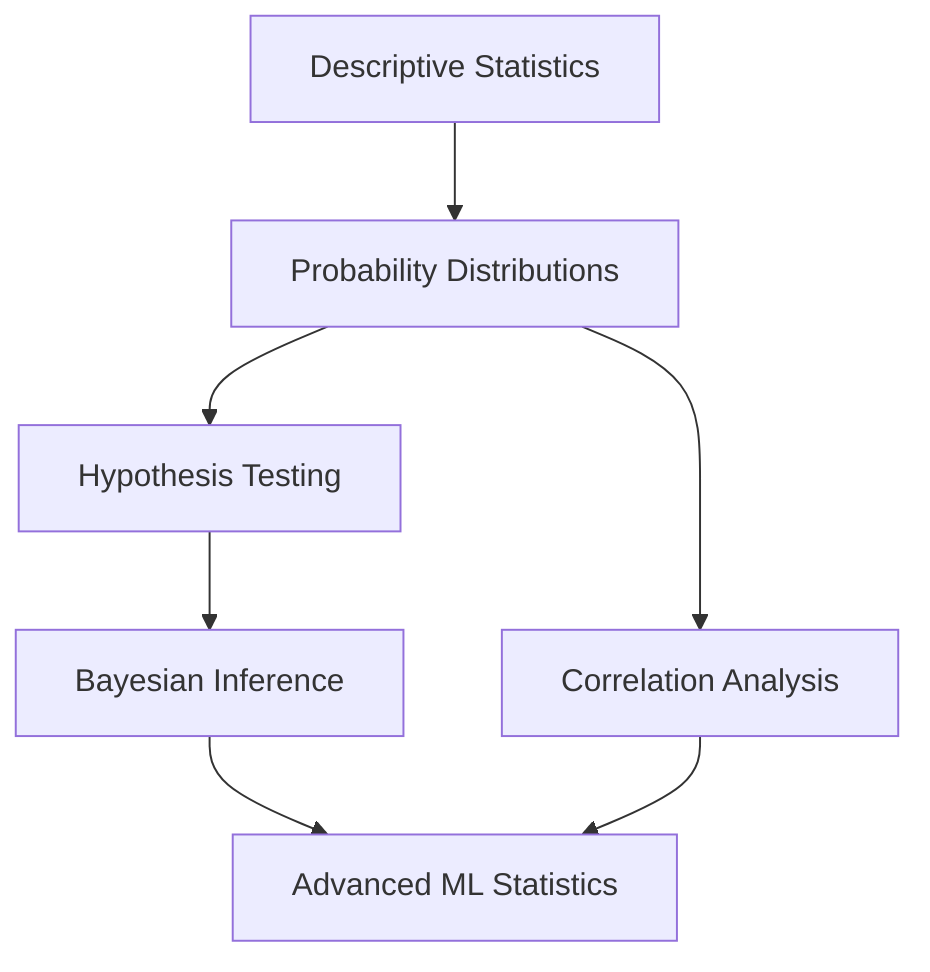

# Statistics and Probability Foundations for IPO Valuation

## 📊 Chapter Overview

Statistics and probability form the bedrock of quantitative finance and machine learning in IPO valuation. This chapter builds from basic descriptive statistics to advanced Bayesian inference, with a focus on financial applications and practical implementation.

## 🎯 Learning Objectives

By the end of this chapter, you will:
- Master descriptive statistics for financial time series analysis
- Understand probability distributions commonly used in finance
- Apply hypothesis testing to validate financial hypotheses
- Implement Bayesian inference for uncertainty quantification
- Detect and handle multicollinearity in financial datasets

## 📈 Why Statistics Matter in IPO Valuation

### The Challenge
IPO valuation involves:
- **Uncertainty**: Future performance is unknown
- **Limited Data**: Young companies have short histories  
- **Market Volatility**: External factors affect valuations
- **Multiple Variables**: Many factors influence success

### The Solution
Statistical methods provide:
- **Risk Quantification**: Measure and model uncertainty
- **Pattern Recognition**: Identify trends in historical data
- **Hypothesis Testing**: Validate assumptions about market behavior
- **Predictive Modeling**: Estimate future performance with confidence intervals

## 🏗️ Chapter Structure

### Part I: Descriptive Statistics for Finance
1. **[Measures of Central Tendency](./02-descriptive-statistics.md)**
   - Mean, median, mode in financial contexts
   - Handling outliers and extreme events
   - Time-weighted returns

2. **[Measures of Dispersion](./02-descriptive-statistics.md#dispersion)**
   - Variance and standard deviation
   - Volatility calculations
   - Value at Risk (VaR) basics

3. **[Distribution Shape](./02-descriptive-statistics.md#shape)**
   - Skewness in return distributions
   - Kurtosis and fat tails
   - Jarque-Bera test for normality

### Part II: Probability Distributions in Finance
4. **[Normal Distribution](./03-probability-distributions.md)**
   - Properties and assumptions
   - Limitations in financial modeling
   - Central Limit Theorem applications

5. **[Log-Normal Distribution](./03-probability-distributions.md#log-normal)**
   - Stock price modeling
   - Geometric Brownian motion
   - Applications in option pricing

6. **[Student's t-Distribution](./03-probability-distributions.md#t-distribution)**
   - Heavy-tailed modeling
   - Small sample statistics
   - Risk modeling improvements

### Part III: Statistical Inference
7. **[Hypothesis Testing](./04-hypothesis-testing.md)**
   - Null and alternative hypotheses in finance
   - Type I and Type II errors in investment decisions
   - p-values and statistical significance
   - Multiple testing corrections

8. **[Bayesian Inference](./05-bayesian-inference.md)**
   - Prior beliefs and evidence updating
   - Posterior distributions for parameter estimation
   - Credible intervals vs confidence intervals
   - Applications in IPO success prediction

### Part IV: Multivariate Statistics
9. **[Correlation Analysis](./06-correlation-analysis.md)**
   - Pearson correlation in financial data
   - Spearman rank correlation for non-linear relationships
   - Partial correlation for controlling variables
   - Rolling correlations for time-varying relationships

10. **[Multicollinearity Detection](./06-correlation-analysis.md#multicollinearity)**
    - Variance Inflation Factor (VIF)
    - Condition indices
    - Principal Component Analysis for dimension reduction

## 💡 Key Insights for IPO Valuation

### 1. Financial Data Properties
```python
# Financial returns are typically:
# - Non-normal (fat tails, skewness)
# - Heteroskedastic (changing volatility)
# - Serially correlated (momentum/reversal effects)
# - Subject to regime changes

import numpy as np
import pandas as pd

# Example: Daily returns analysis
def analyze_returns(returns):
    """Analyze financial return properties"""
    stats = {
        'mean': np.mean(returns),
        'std': np.std(returns),
        'skewness': scipy.stats.skew(returns),
        'kurtosis': scipy.stats.kurtosis(returns),
        'jarque_bera': scipy.stats.jarque_bera(returns)
    }
    return stats
```

### 2. Risk Measurement
```python
# Value at Risk calculation
def calculate_var(returns, confidence_level=0.05):
    """Calculate Value at Risk at given confidence level"""
    return np.percentile(returns, confidence_level * 100)

# Expected Shortfall (Conditional VaR)
def calculate_es(returns, confidence_level=0.05):
    """Calculate Expected Shortfall"""
    var = calculate_var(returns, confidence_level)
    return np.mean(returns[returns <= var])
```

### 3. Uncertainty Quantification
```python
# Bayesian approach to parameter uncertainty
def bayesian_mean_estimation(data, prior_mean, prior_precision):
    """Bayesian estimation with normal-normal conjugate prior"""
    n = len(data)
    sample_mean = np.mean(data)
    sample_precision = n / np.var(data)
    
    # Posterior parameters
    posterior_precision = prior_precision + sample_precision
    posterior_mean = (prior_precision * prior_mean + 
                     sample_precision * sample_mean) / posterior_precision
    
    return posterior_mean, 1/posterior_precision
```

## 🔧 Practical Implementation Guidelines

### 1. Data Quality Checks
```python
def financial_data_quality_check(data):
    """Comprehensive data quality assessment"""
    checks = {
        'missing_values': data.isnull().sum(),
        'infinite_values': np.isinf(data).sum(),
        'outliers': detect_outliers_iqr(data),
        'normality_test': scipy.stats.normaltest(data.dropna()),
        'stationarity_test': adfuller(data.dropna())
    }
    return checks
```

### 2. Statistical Significance
```python
def statistical_significance_framework():
    """Framework for statistical testing in finance"""
    return {
        'alpha_level': 0.05,  # Standard significance level
        'multiple_testing': 'bonferroni',  # Correction method
        'effect_size': 'cohen_d',  # Practical significance
        'power_analysis': 0.80  # Desired statistical power
    }
```

### 3. Model Assumptions
```python
def validate_model_assumptions(residuals):
    """Validate key statistical assumptions"""
    tests = {
        'normality': scipy.stats.jarque_bera(residuals),
        'homoskedasticity': het_white(residuals),
        'autocorrelation': ljungbox(residuals),
        'linearity': rainbow_test(residuals)
    }
    return tests
```

## 🚨 Common Pitfalls and Solutions

### 1. Survivorship Bias
**Problem**: Only analyzing successful IPOs
**Solution**: Include failed IPOs and delisted companies

### 2. Look-Ahead Bias
**Problem**: Using future information in historical analysis
**Solution**: Strict temporal separation of training/testing data

### 3. Data Snooping
**Problem**: Over-testing leads to false discoveries
**Solution**: Multiple testing corrections and out-of-sample validation

### 4. Assumption Violations
**Problem**: Applying normal distribution to non-normal data
**Solution**: Distribution fitting and robust statistical methods

## 🎪 Real-World Applications

### 1. IPO Success Probability
```python
# Logistic regression for IPO success prediction
def ipo_success_model(financial_metrics, market_conditions):
    """Model IPO success probability using statistical methods"""
    # Feature engineering with statistical transformations
    features = engineer_statistical_features(financial_metrics)
    
    # Bayesian logistic regression for uncertainty quantification
    model = BayesianLogisticRegression()
    posterior_samples = model.fit(features, success_labels)
    
    # Prediction with credible intervals
    success_prob, credible_interval = model.predict_with_uncertainty(new_data)
    return success_prob, credible_interval
```

### 2. Risk Assessment
```python
def comprehensive_risk_assessment(company_data):
    """Multi-dimensional risk assessment using statistical methods"""
    risks = {
        'market_risk': calculate_beta(company_returns, market_returns),
        'liquidity_risk': bid_ask_spread_analysis(trading_data),
        'credit_risk': altman_z_score(financial_statements),
        'tail_risk': calculate_expected_shortfall(returns)
    }
    return aggregate_risk_score(risks)
```

## 📚 Prerequisites for Next Chapters

Before proceeding to Linear Algebra, ensure you understand:
- Probability distributions and their parameters
- Hypothesis testing framework and interpretation
- Basic Bayesian reasoning
- Correlation vs causation concepts
- Statistical significance and practical significance

## 🔄 Chapter Dependencies



---

**Next**: [Descriptive Statistics for Financial Time Series](./02-descriptive-statistics.md)