# ML Models Architecture and Data Flow Diagrams

## System Architecture Overview

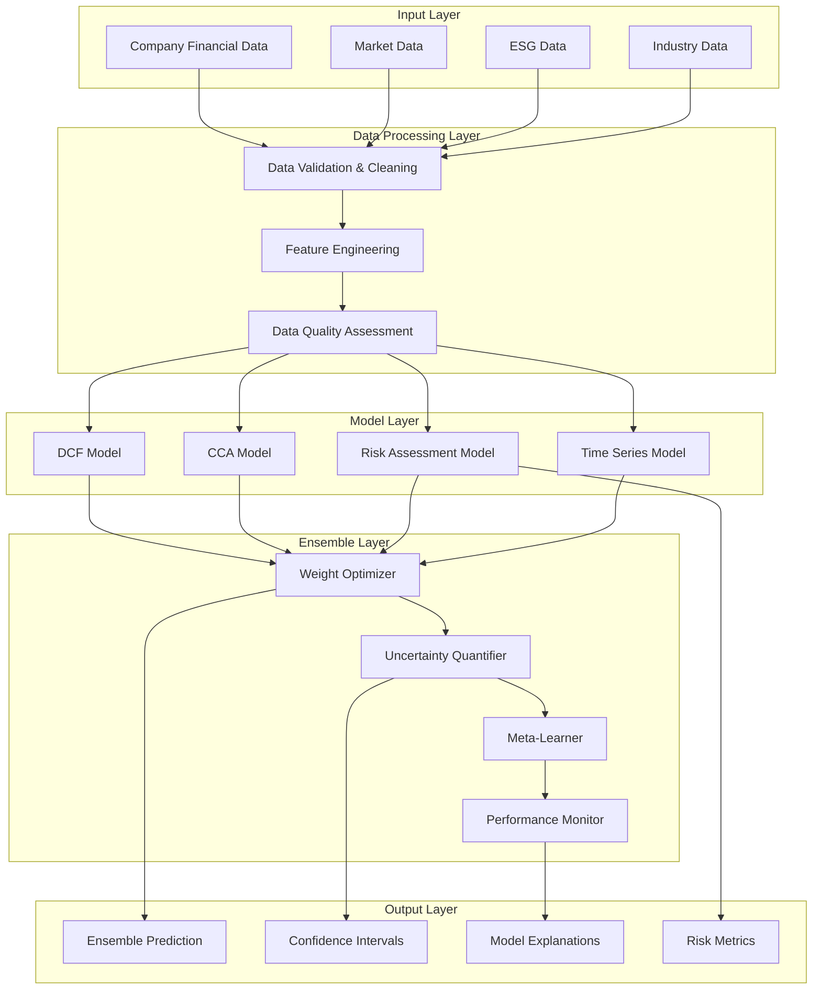

## DCF Model Architecture

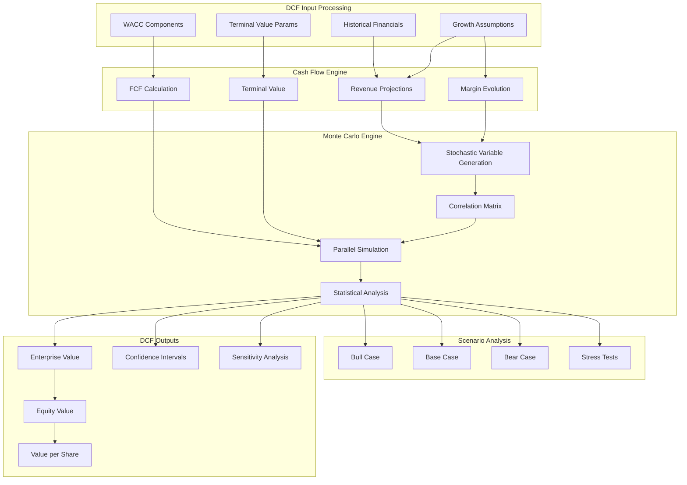

## CCA Model Architecture

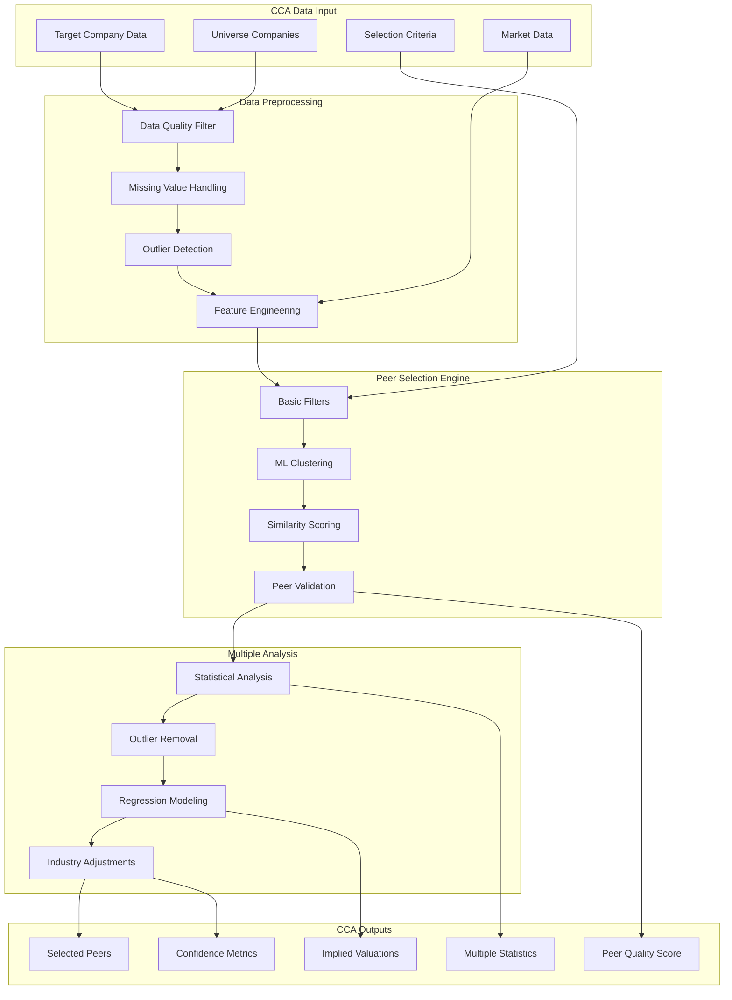

## Risk Assessment Model Architecture

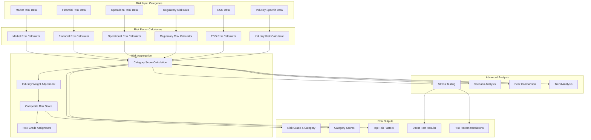

## Time Series Forecasting Architecture

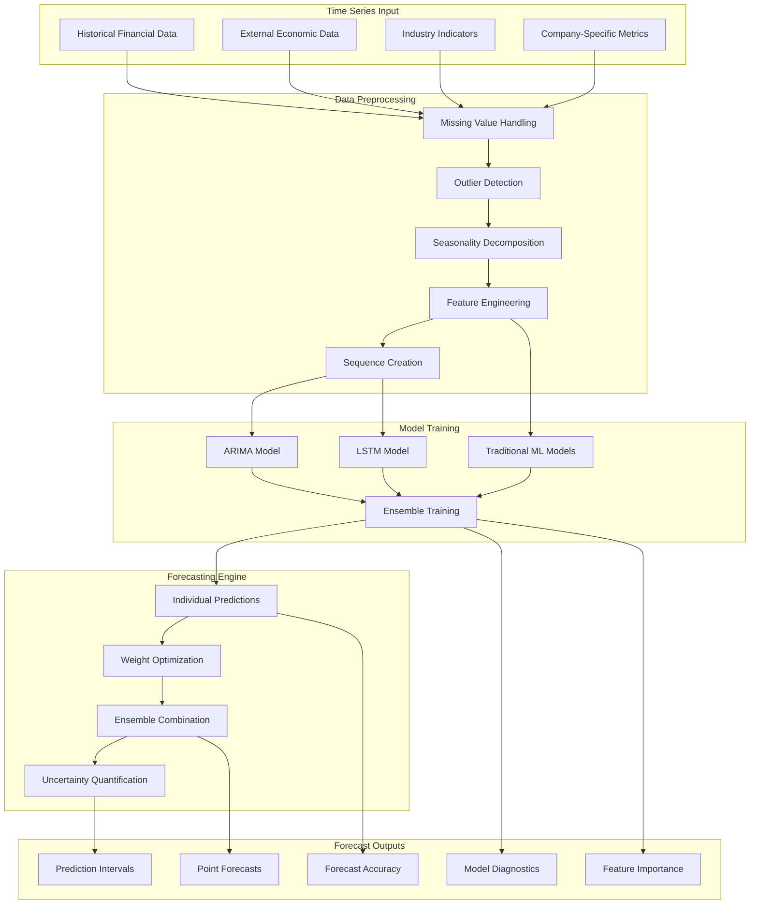

## Ensemble Framework Architecture

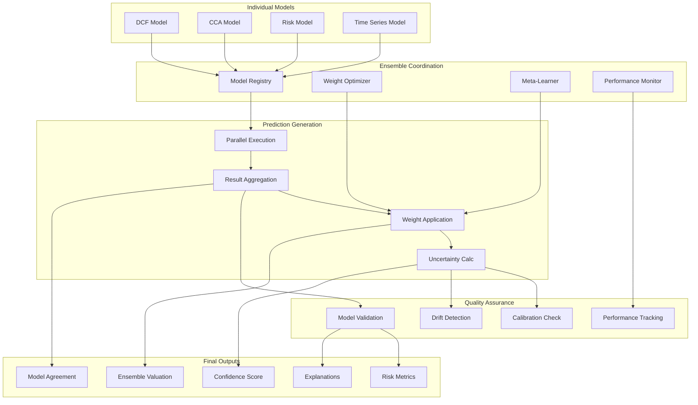

## Data Flow Diagrams

### Complete System Data Flow

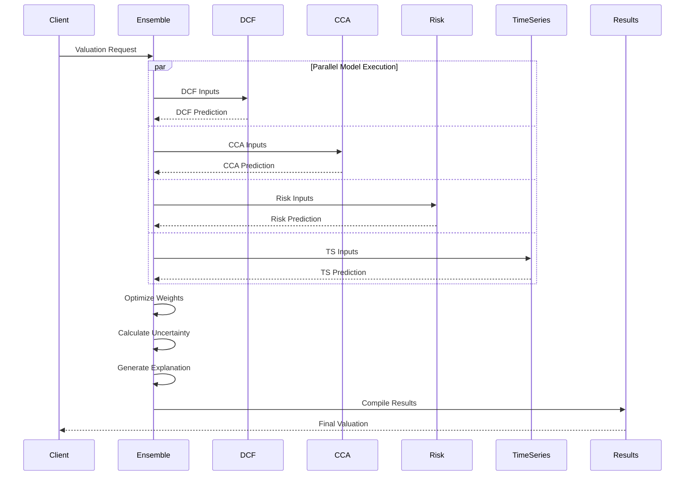

### Monte Carlo Simulation Data Flow

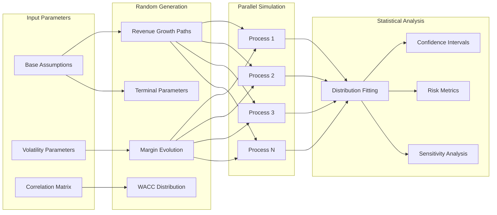

### Risk Assessment Data Flow

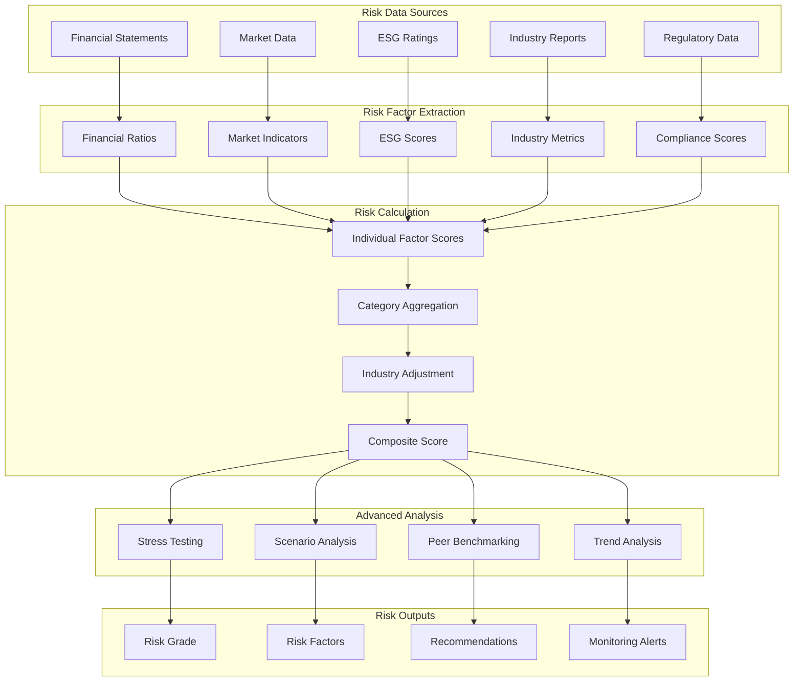

## Component Interaction Patterns

### Model Communication Protocol

```python
class ModelCommunicationProtocol:
    """Defines how models communicate and share information"""
    
    async def coordinate_model_execution(self, ensemble_inputs):
        """
        Coordination Pattern:
        1. Validate all inputs in parallel
        2. Execute models concurrently
        3. Share intermediate results via memory store
        4. Aggregate predictions
        5. Calculate ensemble uncertainty
        """
        
        # Step 1: Input validation
        validation_tasks = [
            self.validate_dcf_inputs(ensemble_inputs.dcf_inputs),
            self.validate_cca_inputs(ensemble_inputs.cca_inputs),
            self.validate_risk_inputs(ensemble_inputs.risk_inputs),
            self.validate_ts_inputs(ensemble_inputs.ts_inputs)
        ]
        
        validation_results = await asyncio.gather(*validation_tasks)
        
        # Step 2: Model execution
        prediction_tasks = [
            self.dcf_model.predict(ensemble_inputs.dcf_inputs),
            self.cca_model.predict(ensemble_inputs.cca_inputs),
            self.risk_model.predict(ensemble_inputs.risk_inputs),
            self.ts_model.predict(ensemble_inputs.ts_inputs)
        ]
        
        predictions = await asyncio.gather(*prediction_tasks)
        
        # Step 3: Information sharing
        await self.share_intermediate_results(predictions)
        
        return predictions
```

### Memory and State Management

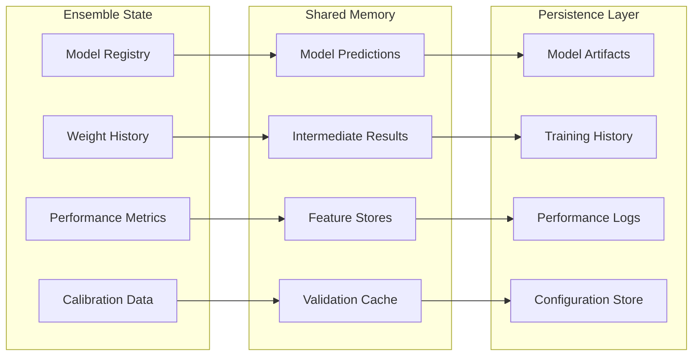

## Performance Optimization Architecture

### Parallel Processing Design

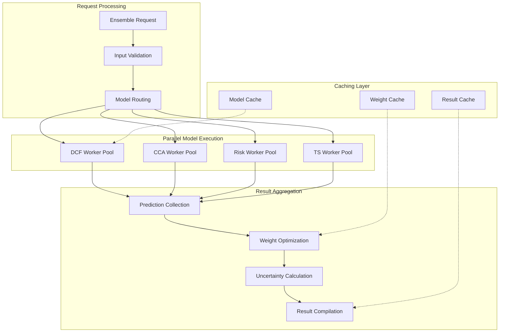

### Caching Strategy

```python
class EnsembleCachingStrategy:
    """Multi-level caching for ensemble performance optimization"""
    
    def __init__(self):
        self.model_cache = {}  # Cache model predictions
        self.weight_cache = {}  # Cache optimized weights
        self.feature_cache = {}  # Cache processed features
        
    async def get_cached_prediction(self, model_name: str, input_hash: str):
        """Retrieve cached model prediction"""
        cache_key = f"{model_name}_{input_hash}"
        
        if cache_key in self.model_cache:
            cached_result = self.model_cache[cache_key]
            
            # Check if cache is still valid (e.g., less than 1 hour old)
            if (datetime.now() - cached_result['timestamp']).seconds < 3600:
                return cached_result['prediction']
        
        return None
    
    async def cache_prediction(self, model_name: str, input_hash: str, 
                             prediction: ModelPrediction):
        """Cache model prediction with timestamp"""
        cache_key = f"{model_name}_{input_hash}"
        
        self.model_cache[cache_key] = {
            'prediction': prediction,
            'timestamp': datetime.now()
        }
        
        # Implement cache size management
        await self._manage_cache_size()
```

## Integration Patterns

### API Integration Architecture

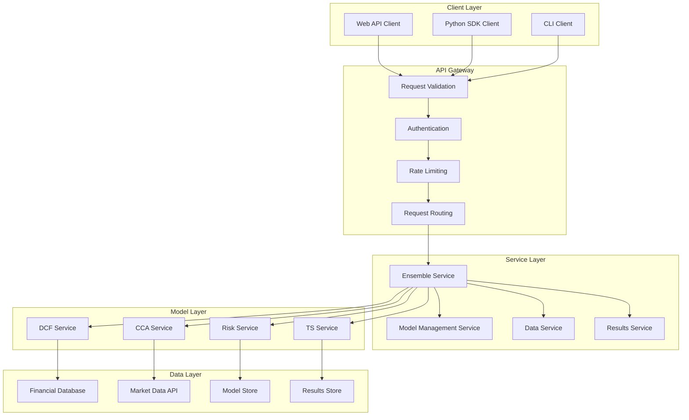

### Microservices Architecture

```yaml
# Docker Compose Example
version: '3.8'
services:
  ensemble-api:
    build: ./ensemble-service
    ports:
      - "8000:8000"
    environment:
      - MODEL_REGISTRY_URL=http://model-registry:8001
    depends_on:
      - model-registry
      - redis-cache
      
  dcf-service:
    build: ./dcf-service
    ports:
      - "8001:8000"
    environment:
      - MONTE_CARLO_WORKERS=4
      
  cca-service:
    build: ./cca-service
    ports:
      - "8002:8000"
    environment:
      - PEER_UNIVERSE_DB=postgresql://...
      
  risk-service:
    build: ./risk-service
    ports:
      - "8003:8000"
    environment:
      - ESG_DATA_SOURCE=api.esg-provider.com
      
  model-registry:
    image: registry:2
    ports:
      - "5000:5000"
      
  redis-cache:
    image: redis:alpine
    ports:
      - "6379:6379"
      
  postgresql:
    image: postgres:13
    environment:
      POSTGRES_DB: valuation_db
      POSTGRES_USER: user
      POSTGRES_PASSWORD: password
```

## Deployment Architecture

### Production Deployment Pattern

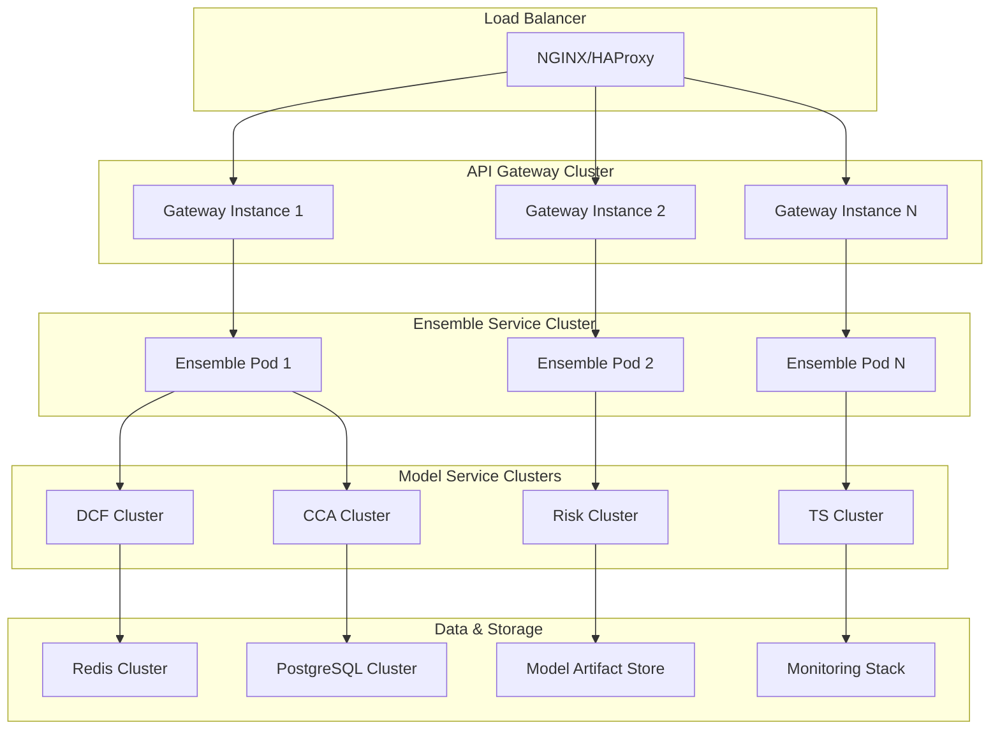

### Monitoring and Observability

```python
class EnsembleMonitoring:
    """Comprehensive monitoring for ensemble system"""
    
    def __init__(self):
        self.metrics_collector = MetricsCollector()
        self.alerting_system = AlertingSystem()
        
    async def setup_monitoring(self):
        """Setup comprehensive monitoring"""
        
        # Performance metrics
        self.monitor_prediction_latency()
        self.monitor_accuracy_trends()
        self.monitor_model_agreement()
        
        # System health metrics
        self.monitor_memory_usage()
        self.monitor_cpu_utilization()
        self.monitor_error_rates()
        
        # Business metrics
        self.monitor_prediction_volume()
        self.monitor_client_satisfaction()
        self.monitor_model_utilization()
    
    def monitor_prediction_latency(self):
        """Monitor prediction generation latency"""
        latency_metrics = {
            'p50_latency': 'median prediction time',
            'p95_latency': '95th percentile prediction time',
            'p99_latency': '99th percentile prediction time',
            'max_latency': 'maximum prediction time'
        }
        
        # Set up alerts
        self.alerting_system.add_alert(
            metric='p95_latency',
            threshold=5.0,  # 5 seconds
            message='High prediction latency detected'
        )
```

## Scalability Considerations

### Horizontal Scaling Strategy

```python
class EnsembleScalingManager:
    """Manage horizontal scaling of ensemble components"""
    
    def __init__(self):
        self.auto_scaler = AutoScaler()
        self.load_balancer = LoadBalancer()
        
    async def scale_based_on_load(self, current_metrics: Dict):
        """Auto-scale based on current system load"""
        
        # Scaling decision factors
        factors = {
            'request_rate': current_metrics['requests_per_second'],
            'avg_latency': current_metrics['average_latency'],
            'cpu_utilization': current_metrics['cpu_usage'],
            'memory_utilization': current_metrics['memory_usage'],
            'queue_depth': current_metrics['pending_requests']
        }
        
        # Scaling rules
        if factors['request_rate'] > 100 and factors['avg_latency'] > 3.0:
            await self.auto_scaler.scale_up('ensemble-service', target_instances=6)
        
        if factors['cpu_utilization'] > 80:
            await self.auto_scaler.scale_up('model-workers', target_instances=8)
        
        if factors['queue_depth'] > 50:
            await self.auto_scaler.scale_up('prediction-workers', target_instances=4)
```

This architecture documentation provides developers with comprehensive system design patterns, data flow understanding, and deployment strategies needed to build scalable, production-ready ensemble valuation systems.