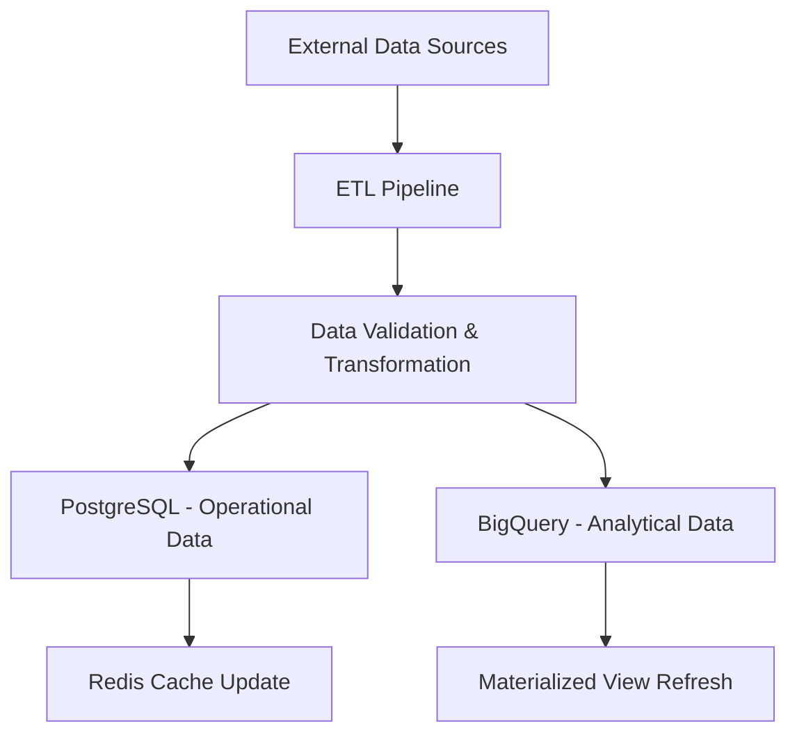

# IPO Valuation Platform - Database Architecture

## Overview

The IPO Valuation Platform employs a comprehensive, multi-database architecture optimized for financial data management, real-time collaboration, and analytical workloads. This document outlines the complete database architecture, data flow, and optimization strategies.

## Architecture Summary

### Database Components

1. **PostgreSQL** - Primary transactional database for operational data
2. **BigQuery** - Analytical data warehouse for historical analysis and reporting
3. **Redis** - High-performance caching layer and session management
4. **Cloud Storage** - Document and file storage with lifecycle management
5. **Firestore** - Real-time collaboration and NoSQL document storage

## Detailed Architecture

### 1. PostgreSQL - Transactional Database

**Purpose**: Primary operational database for business logic, user management, and real-time transactions.

**Key Features**:
- ACID compliance for financial data integrity
- Row-level security for multi-tenant architecture
- Advanced indexing strategies for performance
- Full-text search capabilities
- JSON/JSONB support for flexible schema design

**Schema Organization**:
```
├── core/                    # Core business entities
│   ├── users               # User accounts and profiles
│   ├── organizations       # Multi-tenant organization structure
│   ├── companies           # Company master data
│   ├── financial_statements # Financial data storage
│   ├── valuation_models    # Valuation model templates
│   └── valuations         # Valuation results and analysis
├── security/               # Security and audit
│   ├── api_keys           # API key management
│   ├── user_sessions      # Session tracking
│   ├── audit_log          # Comprehensive audit trail
│   └── data_permissions   # Fine-grained access control
└── analytics/             # Analytical views and aggregates
    └── materialized_views # Pre-computed analytical data
```

**Performance Optimizations**:
- Covering indexes to minimize table lookups
- Partial indexes for filtered queries
- Expression indexes for computed values
- BRIN indexes for time-series data
- Query-specific composite indexes

### 2. BigQuery - Analytical Data Warehouse

**Purpose**: Scalable analytical data warehouse for complex queries, historical analysis, and business intelligence.

**Key Features**:
- Columnar storage for analytical workloads
- Automatic scaling and performance optimization
- Standard SQL interface with analytical functions
- Machine learning capabilities built-in
- Cost-effective storage with lifecycle management

**Schema Design**:
```
analytics/
├── dim_companies/          # Company dimension (SCD Type 2)
├── dim_users/             # User dimension for analytics
├── dim_date/              # Date dimension for time-based analysis
├── fact_financial_statements/ # Core financial data fact table
├── fact_valuations/       # Valuation results fact table
├── fact_market_data/      # Market data for benchmarking
├── fact_ipo_performance/  # IPO tracking and performance
└── aggregates/           # Pre-computed aggregation tables
    ├── sector_benchmarks/
    └── monthly_summaries/
```

**Optimization Strategies**:
- Partitioning by date for query performance
- Clustering on frequently filtered columns
- Materialized views for complex aggregations
- Automatic table optimization
- Query result caching

### 3. Redis - Caching and Real-time Data

**Purpose**: High-performance caching layer, session management, and real-time features.

**Key Features**:
- Sub-millisecond latency for cached data
- Advanced data structures (Sets, Sorted Sets, Hashes)
- Pub/Sub for real-time notifications
- Lua scripting for complex operations
- Persistence options for durability

**Data Organization**:
```
Redis Key Patterns:
├── session:{token}         # User session data
├── company:{id}           # Company basic information
├── financials:{id}:{type} # Latest financial statements
├── ratios:{id}           # Financial ratios cache
├── valuation:{id}        # Valuation results cache
├── market:{ticker}       # Real-time market data
├── peers:{id}           # Company peer groups
├── rate_limit:{key}     # API rate limiting counters
└── workspace:{id}:users # Active collaboration users
```

**Caching Strategies**:
- Write-through caching for frequently accessed data
- TTL-based expiration policies
- Cache warming for predictable access patterns
- Intelligent cache invalidation

### 4. Cloud Storage - Document Management

**Purpose**: Scalable file and document storage with lifecycle management and CDN integration.

**Storage Organization**:
```
Bucket Structure:
├── uprez-documents-prod/
│   ├── companies/{id}/     # Company documents
│   ├── ipos/{id}/         # IPO-related documents
│   ├── valuations/{id}/   # Valuation exports and models
│   ├── uploads/{user}/    # User uploads (temporary)
│   └── backups/           # System backups
├── uprez-static-assets/   # Public static content
└── uprez-archive-cold/    # Long-term archived data
```

**Features**:
- Automatic lifecycle management (Standard → Nearline → Coldline → Archive)
- Cross-region replication for disaster recovery
- Customer-managed encryption keys
- CDN integration for global access
- Object versioning and backup

### 5. Firestore - Real-time Collaboration

**Purpose**: NoSQL document database optimized for real-time collaboration features.

**Collections Structure**:
```
Firestore Collections:
├── workspaces/            # Collaboration workspaces
├── workspace_comments/    # Real-time comments and discussions
├── workspace_changes/     # Operational transform changes
├── user_presence/         # Real-time user presence
├── notifications/         # User notifications
├── activity_feed/         # Activity and audit trail
├── collaboration_sessions/ # Active collaboration sessions
├── real_time_cursors/     # Live cursor positions
└── version_history/       # Document version control
```

**Real-time Features**:
- WebSocket connections for live updates
- Operational transforms for collaborative editing
- Conflict resolution algorithms
- Offline synchronization support

## Data Flow Architecture

### 1. Data Ingestion Flow



**Data Sources**:
- SEC EDGAR filings (XBRL data)
- Market data providers (Bloomberg, Reuters)
- Financial data APIs (Yahoo Finance, Alpha Vantage)
- Manual uploads and company direct submissions
- Third-party data vendors

**ETL Process**:
1. **Extract**: Parallel data extraction from multiple sources
2. **Transform**: Data standardization, validation, and enrichment
3. **Load**: Atomic loading to multiple destinations
4. **Validate**: Data quality checks and alerts
5. **Cache**: Update caching layer for performance

### 2. Query and Access Patterns

**Transactional Queries** → PostgreSQL
- User authentication and authorization
- CRUD operations on business entities
- Real-time valuation calculations
- Financial data retrieval

**Analytical Queries** → BigQuery  
- Historical trend analysis
- Sector benchmarking and comparisons
- Complex financial analytics
- Business intelligence reporting

**High-frequency Access** → Redis
- User session management
- Real-time market data
- Frequently accessed company information
- API rate limiting

**Collaboration Features** → Firestore
- Real-time workspace updates
- Live cursor tracking
- Comment threads and discussions
- Activity notifications

### 3. Security and Access Control

**Multi-layered Security**:
1. **Network Security**: VPC isolation, private subnets, firewall rules
2. **Authentication**: JWT tokens, OAuth2, multi-factor authentication
3. **Authorization**: RBAC and ABAC with fine-grained permissions
4. **Encryption**: At-rest and in-transit encryption for all data stores
5. **Audit**: Comprehensive audit logging and monitoring

**Row-Level Security** (PostgreSQL):
```sql
-- Example: Users can only access data in their organizations
CREATE POLICY company_access_policy ON core.companies
FOR ALL USING (
    organization_id IN (
        SELECT organization_id 
        FROM core.user_organizations 
        WHERE user_id = current_setting('app.current_user_id')::UUID
    )
);
```

## Performance Optimization

### 1. Database Performance

**PostgreSQL Optimizations**:
- Connection pooling (PgBouncer)
- Query optimization with EXPLAIN ANALYZE
- Regular VACUUM and ANALYZE operations  
- Materialized views for complex queries
- Partitioning for large tables

**BigQuery Optimizations**:
- Partitioning by date columns
- Clustering on filter columns
- Query result caching
- Slot management and reservation
- Cost optimization through query design

**Redis Optimizations**:
- Memory usage monitoring and optimization
- Connection pooling
- Pipeline operations for bulk updates
- Appropriate data structure selection
- Memory-efficient serialization

### 2. Caching Strategy

**Multi-level Caching**:
1. **Application Cache**: In-memory caching at application level
2. **Redis Cache**: Distributed caching for shared data
3. **Database Cache**: PostgreSQL buffer cache optimization
4. **CDN Cache**: Static asset caching and delivery

**Cache Invalidation**:
- Event-driven cache invalidation
- TTL-based expiration policies
- Cache tagging for bulk invalidation
- Intelligent cache warming

## Monitoring and Alerting

### 1. Performance Monitoring

**Key Metrics**:
- Database connection utilization
- Query execution times and slow queries
- Cache hit ratios and memory usage
- Storage utilization and growth
- Replication lag (if applicable)

**Monitoring Tools**:
- Google Cloud Monitoring for infrastructure metrics
- PostgreSQL-specific monitoring with pg_stat_statements
- Custom dashboards in Grafana
- Real-time alerting via PagerDuty

### 2. Data Quality Monitoring

**Quality Metrics**:
- Data freshness and completeness
- Validation error rates
- Source data quality scores
- Transformation success rates
- Cross-system consistency checks

## Disaster Recovery and Backup

### 1. Backup Strategy

**PostgreSQL**:
- Continuous WAL archiving
- Daily full backups with point-in-time recovery
- Cross-region backup replication
- Automated backup testing

**BigQuery**:
- Automated dataset snapshots
- Cross-region table copies
- Export to Cloud Storage for long-term retention

**Redis**:
- RDB snapshots with AOF logging
- Backup verification and testing
- High availability with Redis Sentinel

### 2. High Availability

**Architecture Features**:
- Multi-zone deployment for all components
- Automated failover mechanisms  
- Load balancing across replicas
- Circuit breaker patterns
- Graceful degradation strategies

## Scalability Considerations

### 1. Horizontal Scaling

**Read Replicas**:
- PostgreSQL read replicas for analytical queries
- BigQuery automatic scaling
- Redis cluster mode for high throughput

**Sharding Strategies**:
- Organization-based sharding for multi-tenancy
- Time-based partitioning for historical data
- Geographic distribution for global users

### 2. Future Scaling Plans

**Growth Projections**:
- Data volume growth: 100TB+ within 3 years
- User scale: 10,000+ concurrent users
- Geographic expansion: Multi-region deployment
- API throughput: 100,000+ requests per minute

**Technology Roadmap**:
- Consider Apache Kafka for event streaming
- Implement Apache Airflow for complex ETL workflows
- Evaluate GraphQL federation for API scaling
- Machine learning pipeline integration with Vertex AI

## Cost Optimization

### 1. Storage Optimization

**Lifecycle Management**:
- Automatic storage class transitions
- Data archival and deletion policies
- Compression and deduplication
- Reserved capacity planning

### 2. Compute Optimization

**Resource Management**:
- Right-sizing database instances
- Auto-scaling policies
- Spot instances for batch processing
- Query optimization for cost reduction

## Conclusion

This comprehensive database architecture provides a robust, scalable, and secure foundation for the IPO Valuation Platform. The multi-database approach ensures optimal performance for different workload types while maintaining data consistency and reliability.

The architecture supports:
- **Scalability**: Horizontal and vertical scaling capabilities
- **Performance**: Optimized for both transactional and analytical workloads  
- **Security**: Multi-layered security with comprehensive audit capabilities
- **Reliability**: High availability and disaster recovery
- **Cost-effectiveness**: Optimized resource utilization and cost management
- **Developer Experience**: Clear separation of concerns and well-defined interfaces

Future enhancements will focus on expanding analytical capabilities, implementing advanced machine learning features, and supporting global scale deployment.